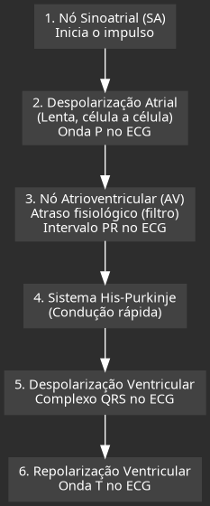
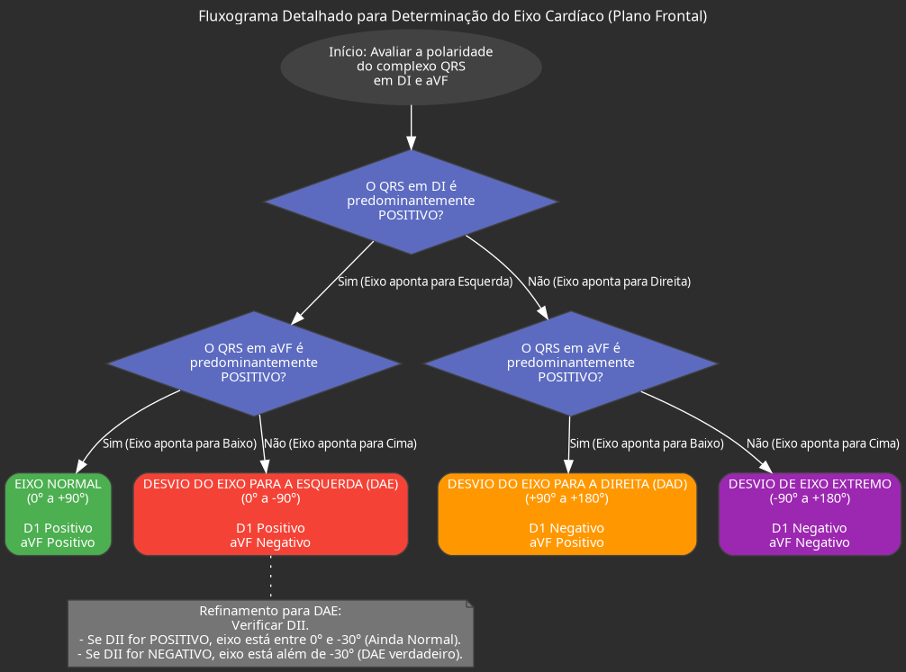

Com certeza! Abaixo está um resumo detalhado da aula em formato de texto otimizado para Obsidian, com todos os tópicos, bullet points, tabelas e fluxogramas solicitados.

### **1. Formação e Propagação do Impulso Elétrico Cardíaco**

*   **Pressuposto Inicial:** A aula parte do princípio que o impulso elétrico já foi formado. A discussão não focará na eletrofisiologia celular (influxo de sódio, cálcio, etc.), mas sim na propagação desse impulso através do coração.
*   **O Esqueleto Elétrico do Coração:** O impulso elétrico segue um caminho predefinido e obrigatório para que a contração cardíaca ocorra de forma eficiente. Qualquer desvio desse caminho resulta em um traçado anormal no eletrocardiograma (ECG).
*   **Trajeto Normal do Impulso:**
    *   **Origem no Nó Sinoatrial (SA):** O impulso se forma no nó SA, localizado na parte superior do átrio direito.
    *   **Despolarização Atrial:** A partir do nó SA, o impulso se espalha pelos átrios, célula a célula.
        *   Este processo é **lento**, pois não ocorre em um tecido especializado de condução rápida.
        *   No ECG, essa atividade lenta e de baixa amplitude é representada pela **Onda P**, que é tipicamente achatada e pequena.
        *   Existe um feixe especializado (Feixe de Bachmann) que facilita a condução para o átrio esquerdo, mas a maior parte da propagação ainda é célula a célula.
    *   **Chegada ao Nó Atrioventricular (AV):** O impulso converge para o nó AV, localizado na junção entre os átrios e os ventrículos.
        *   **Função de Filtro:** O nó AV atua como um filtro, causando um atraso fisiológico na condução.
        *   Esse atraso é crucial para permitir que os átrios se contraiam completamente (sístole atrial) antes que os ventrículos comecem a se contrair (sístole ventricular), garantindo um sincronismo perfeito.
        *   No ECG, esse atraso é representado pelo **intervalo PR**.
    *   **Condução Ventricular Rápida:** Após passar pelo nó AV, o impulso entra em um sistema de condução altamente especializado e rápido.
        *   **Feixe de His e Fibras de Purkinje:** O impulso desce pelo Feixe de His e se espalha rapidamente pelos ventrículos através das Fibras de Purkinje.
        *   Essa condução veloz gera uma onda de grande amplitude no ECG, o **Complexo QRS**. A rapidez e a grande massa muscular dos ventrículos são responsáveis por sua morfologia proeminente.

### **2. Ondas, Segmentos e Intervalos do ECG**

*   **Onda P:**
    *   **Representa:** A despolarização dos átrios (sístole atrial).
    *   **Normalidade:** Deve ser positiva nas derivações DII, DIII e aVF, e negativa em aVR. Sua morfologia é crucial para determinar o ritmo sinusal.
*   **Intervalo PR:**
    *   **Representa:** O tempo que o impulso leva para viajar do nó SA, despolarizar os átrios e chegar ao nó AV (o atraso no nó AV).
    *   **Medição:** Do início da onda P ao início do complexo QRS.
*   **Complexo QRS:**
    *   **Representa:** A despolarização dos ventrículos (sístole ventricular).
    *   **Morfologia:**
        *   **Onda Q:** A primeira deflexão negativa.
        *   **Onda R:** A primeira deflexão positiva.
        *   **Onda S:** A deflexão negativa que se segue à onda R.
*   **Onda T:**
    *   **Representa:** A repolarização dos ventrículos.
*   **Onda U:**
    *   **Representa:** A repolarização dos músculos papilares.
    *   **Visibilidade:** Nem sempre é visível. Quando proeminente, pode indicar hipocalemia (níveis baixos de potássio).
*   **Repolarização Atrial:**
    *   Ocorre ao mesmo tempo que a despolarização ventricular.
    *   Sua onda é "escondida" ou mascarada pela grande amplitude do complexo QRS e, por isso, não é visível no ECG normal.

### **3. O Eixo Elétrico e as Derivações**

*   **Vetor Resultante:** O impulso elétrico gera múltiplos pequenos vetores. A soma de todos esses vetores cria um **vetor resultante principal**, que normalmente aponta para "baixo e para a esquerda", em torno de +60 graus.
*   **Derivações Precordiais (V1 a V6):**
    *   São "olhos" ou eletrodos posicionados no plano horizontal do tórax.
    *   Eles observam a aproximação ou o afastamento do vetor resultante.
    *   **V1 e V2:** Olham o coração "pelas costas" do vetor. Por isso, o QRS nessas derivações é predominantemente **negativo**.
    *   **V5 e V6:** Olham o coração "de frente" para o vetor. Por isso, o QRS nessas derivações é predominantemente **positivo**.
    *   **V3 e V4:** Representam a zona de transição, onde o QRS passa de negativo para positivo, sendo tipicamente **isodifásico**.
    *   **Progressão Normal da Onda R:** A amplitude da onda R deve aumentar progressivamente de V1 para V6.

| Derivação | Localização no Tórax | Visão do Vetor Cardíaco | Morfologia Típica do QRS |
| :--- | :--- | :--- | :--- |
| **V1** | 4º espaço intercostal, linha paraesternal direita | Vê o vetor se afastando | Predominantemente Negativo |
| **V2** | 4º espaço intercostal, linha paraesternal esquerda | Vê o vetor se afastando | Predominantemente Negativo |
| **V3** | Entre V2 e V4 | Zona de Transição | Isodifásico (R e S com amplitudes semelhantes) |
| **V4** | 5º espaço intercostal, linha hemiclavicular | Zona de Transição | Isodifásico / Predominantemente Positivo |
| **V5** | 5º espaço intercostal, linha axilar anterior | Vê o vetor se aproximando | Predominantemente Positivo |
| **V6** | 5º espaço intercostal, linha axilar média | Vê o vetor se aproximando | Predominantemente Positivo |

*   **Derivações Periféricas e o Plano Frontal (Rosa dos Ventos):**
    *   **Triângulo de Einthoven:** As derivações DI, DII e DIII são formadas pela diferença de potencial entre os membros (braço direito, braço esquerdo, perna esquerda).
    *   **Derivações Aumentadas:** aVR, aVL e aVF olham o coração a partir de um único membro.
    *   Juntas, essas 6 derivações formam o **plano frontal** ou **Rosa dos Ventos**, que permite determinar o **eixo elétrico** do coração.

### **4. Sobrecargas Cardíacas**

#### **4.1. Sobrecarga Atrial Direita (SAD)**
*   **Mecanismo:** O átrio direito, ao se sobrecarregar, demora mais para despolarizar e gera um vetor de maior amplitude.
*   **Critério no ECG:**
    *   **Onda P *apiculada* (pontuda) e alta.**
    *   **Amplitude > 2,5 mm** (2,5 quadradinhos) na derivação DII.

#### **4.2. Sobrecarga Atrial Esquerda (SAE)**
*   **Mecanismo:** O átrio esquerdo, que despolariza depois do direito, fica sobrecarregado. Sua despolarização se torna mais lenta e demorada.
*   **Critérios no ECG:**
    *   **Onda P alargada e bífida (entalhada)**, com formato de "M" ou "corcova de camelo".
    *   **Duração > 120 ms** (3 quadradinhos) de largura.
    *   **Índice de Morris em V1:** A porção negativa da onda P em V1 tem uma área (duração x profundidade) maior ou igual a 1 mm².

#### **4.3. Sobrecarga Ventricular Esquerda (SVE)**
*   **Mecanismo:** O aumento da massa do ventrículo esquerdo (VE) gera um vetor elétrico muito mais potente, desviando o eixo para a esquerda.
*   **Critérios no ECG:**
    *   **Desvio do Eixo Elétrico para a Esquerda.**
    *   **Índice de Sokolov-Lyon:** A soma da amplitude da **onda S em V1** com a **onda R em V5 ou V6** é **> 35 mm**.
    *   **Índice de Cornell:** (R em aVL + S em V3) > 28 mm (homens) ou > 20 mm (mulheres).
    *   **Padrão de *Strain*:** Alterações secundárias da repolarização, como **inversão assimétrica da onda T** e infradesnivelamento do segmento ST nas derivações que olham para o VE (V5, V6, DI, aVL).

#### **4.4. Sobrecarga Ventricular Direita (SVD)**
*   **Mecanismo:** O aumento da massa do ventrículo direito (VD) faz com que o vetor resultante do coração se desvie para a direita.
*   **Critérios no ECG:**
    *   **Desvio do Eixo Elétrico para a Direita.**
    *   **Onda R proeminente em V1** (R > S em V1).
    *   **Sinal de Peñaloza-Tranchesi:** Uma mudança abrupta na morfologia do QRS de V1 (positivo) para V2 (negativo).
    *   Pode haver um padrão de *strain* do VD, com inversão de onda T nas derivações que olham para o VD (V1, V2, DIII).

### **5. Bloqueios de Ramo**

#### **5.1. Bloqueio de Ramo Direito (BRD)**
*   **Mecanismo:** Há uma lesão no ramo direito, impedindo a passagem normal do impulso por ele. O impulso despolariza primeiro o lado esquerdo normalmente (rápido) e depois passa, célula a célula (lento), para o lado direito.
*   **Critérios no ECG:**
    *   **QRS alargado (> 120 ms).**
    *   **Padrão "orelha de coelho" (rsR') em V1.** A segunda onda R' (a segunda "orelha") representa a despolarização lenta e tardia do ventrículo direito.

#### **5.2. Bloqueio de Ramo Esquerdo (BRE)**
*   **Mecanismo:** A lesão está no ramo esquerdo. O impulso desce pelo ramo direito (normal) e depois passa lentamente para o ventrículo esquerdo. Como o VE tem mais massa, o QRS fica muito alargado.
*   **Critérios no ECG:**
    *   **QRS alargado (> 120 ms).**
    *   **Padrão de "torre" ou onda R monofásica e alargada em V5 e V6.**
    *   Ausência de onda Q em V5 e V6.
    *   **BRE novo é sempre considerado patológico e pode ser um sinal de infarto agudo.**

### **6. Síndrome Coronariana Aguda (SCA) e Escore HEART**

*   **Tipos de Infarto:**
    *   **Infarto com Supra de ST (IAMCSST):** Oclusão total de uma artéria coronária. O tratamento imediato é a reperfusão (trombólise ou angioplastia).
    *   **Infarto sem Supra de ST (IAMSSST):** Oclusão parcial. O tratamento é mais conservador inicialmente, com estratificação de risco.
*   **Diagnóstico Diferencial da Dor Torácica:**
    *   É crucial diferenciar SCA de outras causas graves como **Dissecção de Aorta** (dor lancinante que irradia para o dorso), **Tromboembolismo Pulmonar (TEP)**, e **Pericardite**.
*   **Estratificação de Risco no IAMSSST: Escore HEART**
    *   Ferramenta para decidir se um paciente com dor torácica e suspeita de SCA pode receber alta segura do pronto-socorro ou precisa ser internado.

**Escore HEART para Estratificação de Risco na Dor Torácica**

| Critério | Descrição | Pontuação |
| :--- | :--- | :--- |
| **H**istory (História) | Ligeiramente suspeita | 0 |
| | Moderadamente suspeita | 1 |
| | Altamente suspeita (típica) | 2 |
| **E**CG | Normal | 0 |
| | Alterações não específicas (ex: BRE prévio) | 1 |
| | Alterações significativas (Infra de ST) | 2 |
| **A**ge (Idade) | < 45 anos | 0 |
| | 45-64 anos | 1 |
| | ≥ 65 anos | 2 |
| **R**isk Factors (Fatores de Risco) | Nenhum | 0 |
| | 1-2 fatores (HAS, DM, DLP, tabagismo, histórico familiar) | 1 |
| | ≥ 3 fatores ou doença aterosclerótica conhecida | 2 |
| **T**roponin (Troponina) | Dentro do limite normal | 0 |
| | 1-3x o limite superior da normalidade (LSN) | 1 |
| | > 3x o LSN | 2 |

**Interpretação e Conduta:**
*   **0-3 pontos (Baixo Risco):** Risco de evento cardíaco maior em 6 semanas é de 0,9-1,7%. Considerar alta hospitalar após avaliação.
*   **4-6 pontos (Risco Intermediário):** Risco de 12-16%. Paciente deve ser internado para observação e investigação.
*   **≥ 7 pontos (Alto Risco):** Risco de 50-65%. Paciente deve ser internado e provavelmente submetido a cateterismo.