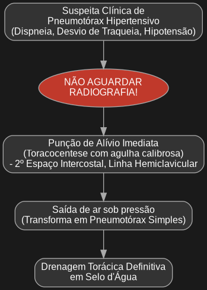

Com certeza, aqui estão os códigos PlantUML para os fluxogramas novamente.

Copie e cole cada bloco de código em seu editor Obsidian para renderizar os diagramas.

---

### **Fluxograma 1: Abordagem Inicial da Dor Torácica**

````plantuml
@startuml
digraph G {
    graph [bgcolor="#1a1a1a", fontcolor=white, splines=ortho];
    node [shape=box, style="rounded,filled", fontname="Arial", fontsize=12, color="#a9a9a9", fillcolor="#333333", fontcolor=white];
    edge [fontname="Arial", fontsize=10, color="#a9a9a9", fontcolor="#a9a9a9"];

    Start [label="Paciente com Dor Torácica\nna Sala de Emergência"];
    
    ECG [label="Realizar ECG em até 10 minutos"];
    
    DecisionECG [label="ECG mostra\nSupradesnivelamento de ST?", shape=diamond, fillcolor="#5c6bc0"];
    
    IAMCSST [label="Diagnóstico: IAMCSST\n(Infarto com Supra de ST)\n\n- Iniciar protocolo de SCA\n- Terapia de reperfusão (Angioplastia ou Trombolítico)\n- Transferir para unidade coronariana"];
    
    NoSupra [label="Ausência de Supra de ST"];
    
    Investigate [label="Continuar investigação para as outras\n5 causas catastróficas e SCA sem Supra"];
    
    ExamesComplementares [label="Coletar História e Exame Físico Detalhado\n\n- PA em ambos os braços\n- Simetria de pulsos\n- Radiografia de Tórax\n- Marcadores de necrose miocárdica (Troponina)\n- D-dímero (se indicado)"];

    Start -> ECG;
    ECG -> DecisionECG;
    DecisionECG -> IAMCSST [label="Sim"];
    DecisionECG -> NoSupra [label="Não"];
    NoSupra -> Investigate;
    Investigate -> ExamesComplementares;
}
@enduml
````

---

### **Fluxograma 2: Manejo da Síndrome Coronariana Aguda**

````plantuml
@startuml
digraph G {
    graph [bgcolor="#1a1a1a", fontcolor=white, splines=ortho];
    node [shape=box, style="rounded,filled", fontname="Arial", fontsize=12, color="#a9a9a9", fillcolor="#333333", fontcolor=white];
    edge [fontname="Arial", fontsize=10, color="#a9a9a9", fontcolor="#a9a9a9"];

    Start [label="Paciente com Dor Torácica\nSugestiva de SCA"];
    
    ECG [label="Realizar ECG em 10 minutos"];
    
    DecisionECG [label="ECG mostra\nSupradesnivelamento de ST?", shape=diamond, fillcolor="#5c6bc0"];
    
    IAMCSST [label="IAMCSST\n\n- Iniciar MONABCH (Morfina, O2 se Sat<90%, Nitrato, AAS, Betabloq, Clopidogrel, Heparina)\n- Contatar hemodinâmica/UTI coronariana"];
    
    Reperfusion [label="Terapia de Reperfusão Urgente\n- Angioplastia Primária (se <90-120 min)\n- Trombolítico (se Angioplastia indisponível)"];
    
    NoSupra [label="SCA sem Supra de ST\n(IAMSSST ou Angina Instável)"];
    
    Investigate [label="- Iniciar MONABCH (exceto trombolítico)\n- Coletar Troponina Ultrassensível (0h e 1-3h)\n- Estratificar risco (Escores HEART, TIMI, GRACE)"];
    
    DecisionRisk [label="Qual o risco do paciente?", shape=diamond, fillcolor="#8e44ad"];
    
    HighRisk [label="Alto Risco\n\n- Cateterismo em < 24h"];
    
    LowRisk [label="Baixo/Intermediário Risco\n\n- Internar para observação\n- Considerar testes não-invasivos\n(Cintilografia, Teste Ergométrico)"];
    
    {rank=same; IAMCSST; NoSupra;}

    Start -> ECG;
    ECG -> DecisionECG;
    DecisionECG -> IAMCSST [label="Sim"];
    IAMCSST -> Reperfusion;
    DecisionECG -> NoSupra [label="Não"];
    NoSupra -> Investigate;
    Investigate -> DecisionRisk;
    DecisionRisk -> HighRisk [label="Alto"];
    DecisionRisk -> LowRisk [label="Baixo/Intermediário"];
}
@enduml
````

---

### **Fluxograma 3: Manejo do Pneumotórax Hipertensivo**

````plantuml
@startuml
digraph G {
    graph [bgcolor="#1a1a1a", fontcolor=white, splines=ortho];
    node [shape=box, style="rounded,filled", fontname="Arial", fontsize=12, color="#a9a9a9", fillcolor="#333333", fontcolor=white];
    edge [fontname="Arial", fontsize=10, color="#a9a9a9", fontcolor="#a9a9a9"];

    Start [label="Suspeita Clínica de\nPneumotórax Hipertensivo\n(Dispneia, Desvio de Traqueia, Hipotensão)"];
    
    Warning [label="NÃO AGUARDAR\nRADIOGRAFIA!", shape=ellipse, fillcolor="#c0392b"];
    
    Action1 [label="Punção de Alívio Imediata\n(Toracocentese com agulha calibrosa)\n- 2º Espaço Intercostal, Linha Hemiclavicular"];
    
    Result [label="Saída de ar sob pressão\n(Transforma em Pneumotórax Simples)"];
    
    Action2 [label="Drenagem Torácica Definitiva\nem Selo d'Água"];

    Start -> Warning;
    Warning -> Action1;
    Action1 -> Result;
    Result -> Action2;
}
@enduml
````


Entendi. O problema de renderização no Obsidian geralmente ocorre quando o código do PlantUML não está dentro do "code fence" (bloco de código) correto que ativa o plugin.

Vou fornecer os códigos dos três fluxogramas novamente. Para que funcionem no Obsidian, você precisa copiar cada bloco de código exatamente como está abaixo, incluindo a primeira linha ` ```plantuml ` e a última linha ` ``` `.

---

### **Fluxograma 1: Manejo Inicial da Dor Torácica**

Copie e cole este bloco inteiro na sua nota:

plantuml
@startuml
digraph G {
    graph [bgcolor="#1a1a1a", fontcolor=white, splines=ortho];
    node [shape=box, style="rounded,filled", fontname="Arial", fontsize=12, color="#a9a9a9", fillcolor="#333333", fontcolor=white];
    edge [fontname="Arial", fontsize=10, color="#a9a9a9", fontcolor="#a9a9a9"];

    Start [label="Paciente com Dor Torácica\nna Sala de Emergência"];
    
    ECG [label="Realizar ECG em até 10 minutos"];
    
    DecisionECG [label="ECG mostra\nSupradesnivelamento de ST?", shape=diamond, fillcolor="#5c6bc0"];
    
    IAMCSST [label="Diagnóstico: IAMCSST\n(Infarto com Supra de ST)\n\n- Iniciar protocolo de SCA\n- Terapia de reperfusão (Angioplastia ou Trombolítico)\n- Transferir para unidade coronariana"];
    
    NoSupra [label="Ausência de Supra de ST"];
    
    Investigate [label="Continuar investigação para as outras\n5 causas catastróficas e SCA sem Supra"];
    
    ExamesComplementares [label="Coletar História e Exame Físico Detalhado\n\n- PA em ambos os braços\n- Simetria de pulsos\n- Radiografia de Tórax\n- Marcadores de necrose miocárdica (Troponina)\n- D-dímero (se indicado)"];

    Start -> ECG;
    ECG -> DecisionECG;
    DecisionECG -> IAMCSST [label="Sim"];
    DecisionECG -> NoSupra [label="Não"];
    NoSupra -> Investigate;
    Investigate -> ExamesComplementares;
}
@enduml
```
````

---

### **Fluxograma 2: Conduta Baseada no Escore HEART**

Copie e cole este bloco inteiro na sua nota:
````plantuml
@startuml
digraph G {
    graph [bgcolor="#1a1a1a", fontcolor=white, splines=ortho];
    node [shape=box, style="rounded,filled", fontname="Arial", fontsize=12, color="#a9a9a9", fillcolor="#333333", fontcolor=white];
    edge [fontname="Arial", fontsize=10, color="#a9a9a9", fontcolor="#a9a9a9"];

    Start [label="Paciente com Dor Torácica\nECG e Troponina Iniciais Inconclusivos"];
    
    ScoreHeart [label="Calcular Escore HEART"];
    
    DecisionScore [label="Qual o resultado do Escore?", shape=diamond, fillcolor="#5c6bc0"];
    
    BaixoRisco [label="Escore 0-3: Baixo Risco\n(~1.7% MACE em 6 semanas)\n\n- Considerar alta hospitalar segura\n- Orientar retorno se necessário"];
    
    RiscoIntermediario [label="Escore 4-6: Risco Intermediário\n(~20% MACE em 6 semanas)\n\n- Admitir para observação\n- Seriar marcadores\n- Realizar testes não-invasivos (Cintilografia, Teste Ergométrico)"];
    
    AltoRisco [label="Escore 7-10: Alto Risco\n(~72% MACE em 6 semanas)\n\n- Admitir para unidade coronariana\n- Iniciar terapia para SCA\n- Considerar fortemente cateterismo precoce"];

    Start -> ScoreHeart;
    ScoreHeart -> DecisionScore;
    DecisionScore -> BaixoRisco [label="0-3"];
    DecisionScore -> RiscoIntermediario [label="4-6"];
    DecisionScore -> AltoRisco [label="7-10"];
}
@enduml
```
````

---

### **Fluxograma 3: Manejo do Pneumotórax Hipertensivo**

Copie e cole este bloco inteiro na sua nota:


Ao usar esses blocos de código completos, o Obsidian deve conseguir renderizar os fluxogramas corretamente.