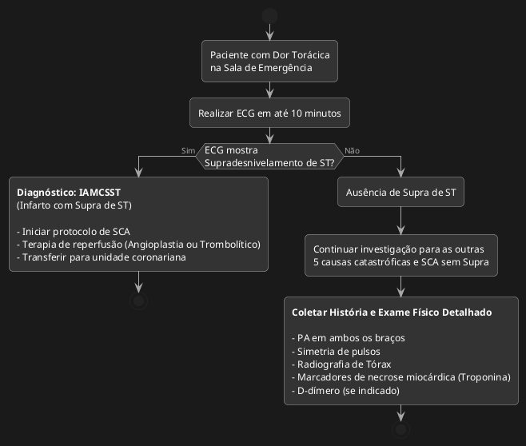
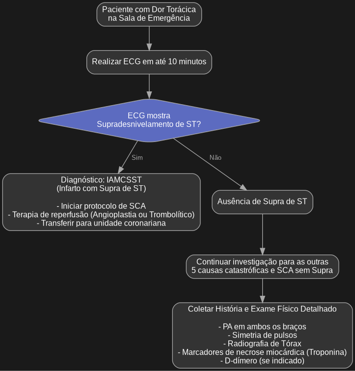
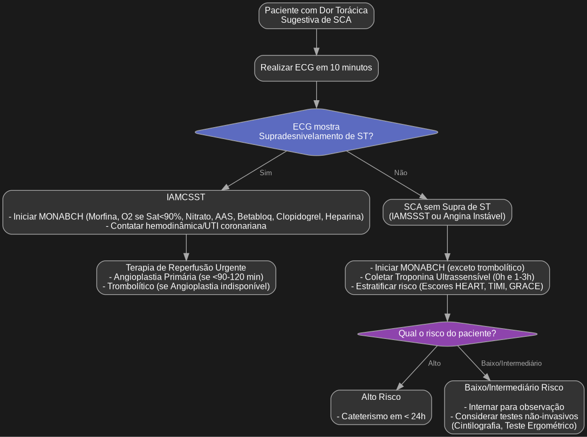
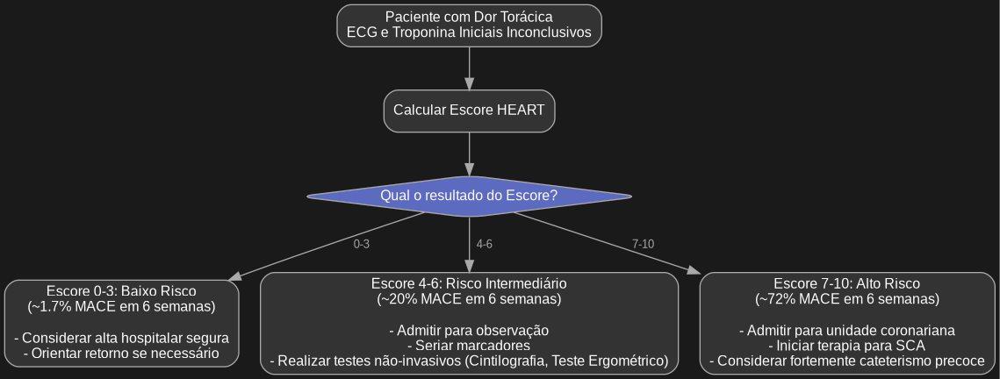

```plantuml
@startuml
digraph G {
    graph [bgcolor="#1a1a1a", fontcolor=white, splines=ortho];
    node [shape=box, style="rounded,filled", fontname="Arial", fontsize=12, color="#a9a9a9", fillcolor="#333333", fontcolor=white];
    edge [fontname="Arial", fontsize=10, color="#a9a9a9", fontcolor="#a9a9a9"];

    Start [label="Paciente com Dor Torácica\nna Sala de Emergência"];
    
    ECG [label="Realizar ECG em até 10 minutos"];
    
    DecisionECG [label="ECG mostra\nSupradesnivelamento de ST?", shape=diamond, fillcolor="#5c6bc0"];
    
    IAMCSST [label="Diagnóstico: IAMCSST\n(Infarto com Supra de ST)\n\n- Iniciar protocolo de SCA\n- Terapia de reperfusão (Angioplastia ou Trombolítico)\n- Transferir para unidade coronariana"];
    
    NoSupra [label="Ausência de Supra de ST"];
    
    Investigate [label="Continuar investigação para as outras\n5 causas catastróficas e SCA sem Supra"];
    
    ExamesComplementares [label="Coletar História e Exame Físico Detalhado\n\n- PA em ambos os braços\n- Simetria de pulsos\n- Radiografia de Tórax\n- Marcadores de necrose miocárdica (Troponina)\n- D-dímero (se indicado)"];

    Start -> ECG;
    ECG -> DecisionECG;
    DecisionECG -> IAMCSST [label="Sim"];
    DecisionECG -> NoSupra [label="Não"];
    NoSupra -> Investigate;
    Investigate -> ExamesComplementares;
}
@enduml
```





