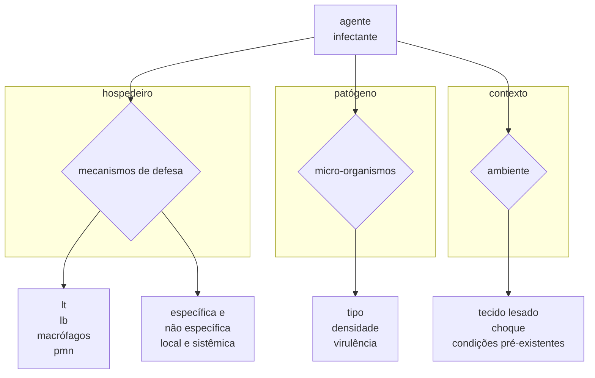
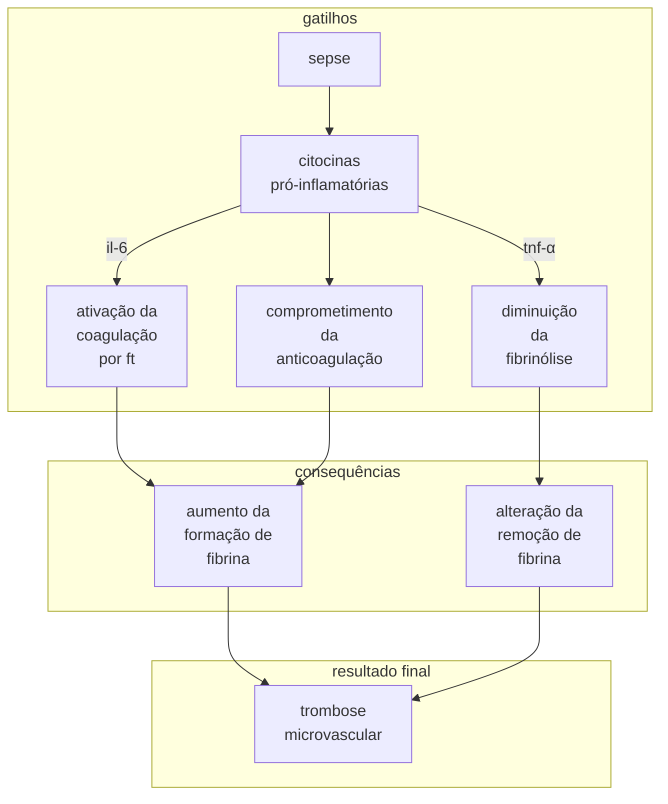
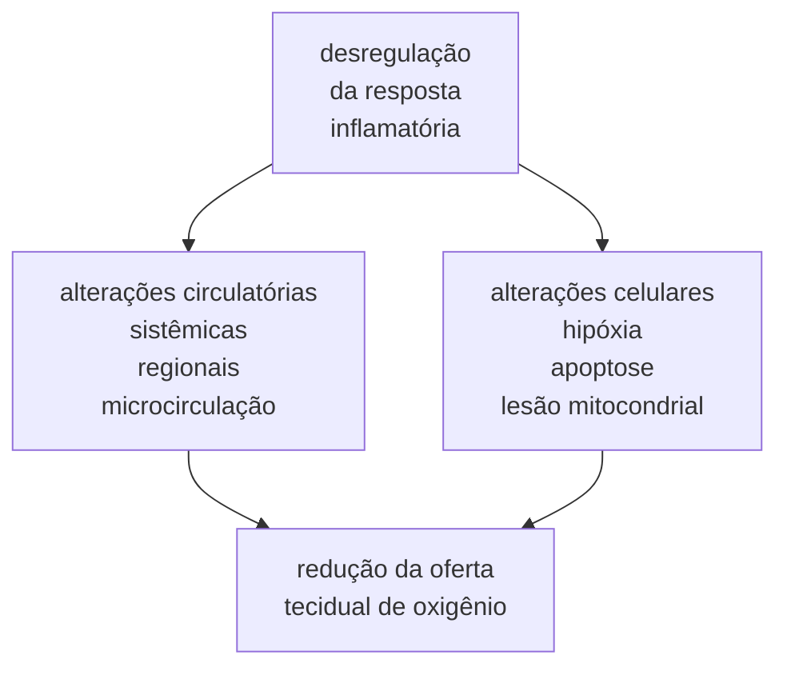
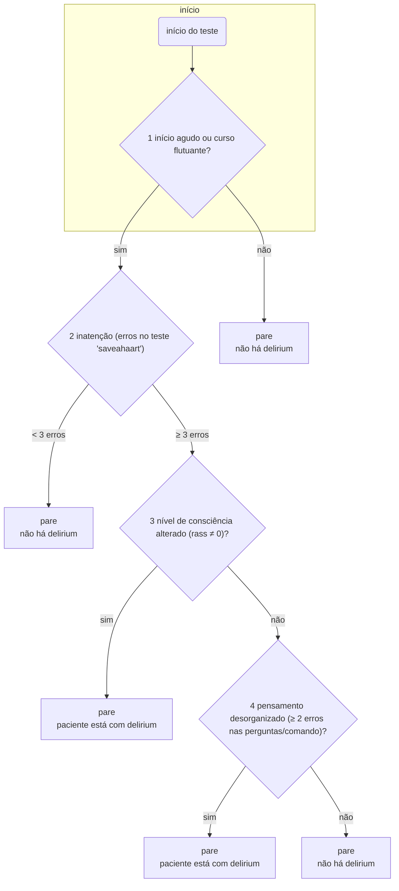
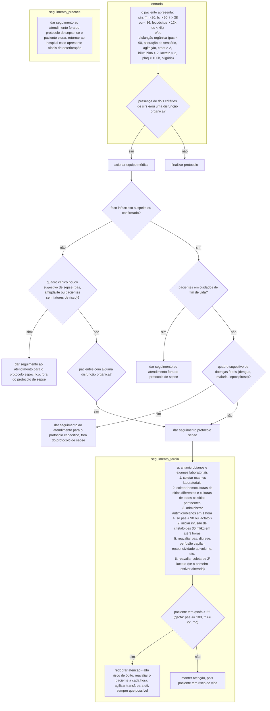
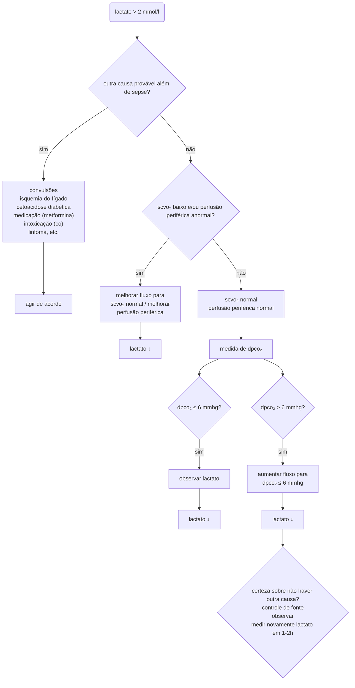
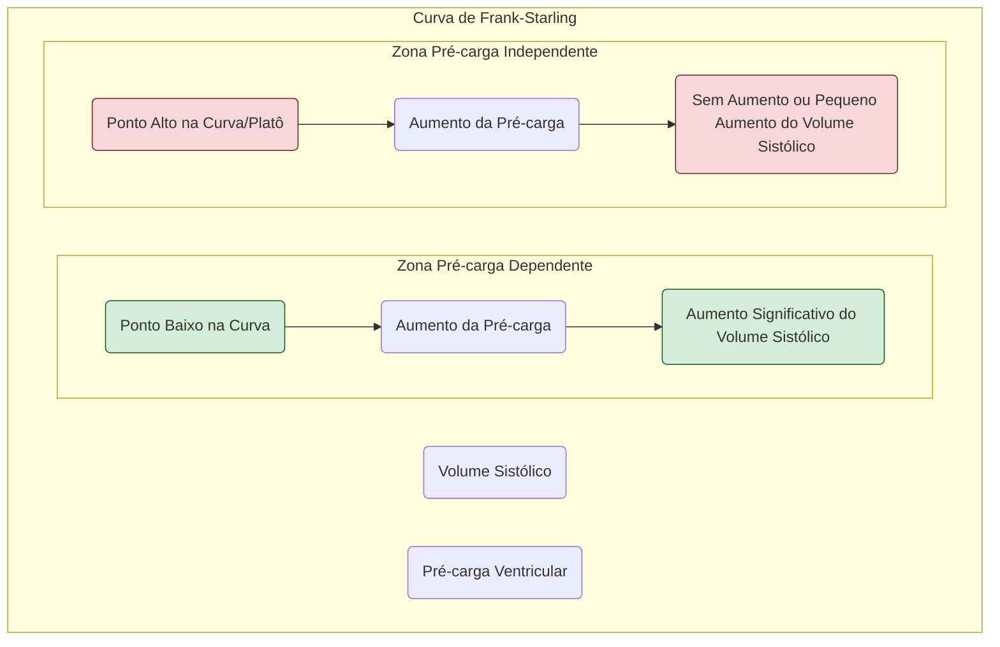

***

# Parte 1: Conceitos e Epidemiologia da Sepse

## Introdução

*   **Desafio Principal**: A sepse é o principal desafio no tratamento de pacientes graves. Sua incidência tem aumentado significativamente, tornando-a uma prioridade médica.
*   **Incidência Global**: Uma revisão sistemática em países desenvolvidos estimou quase 20 milhões de casos por ano.
*   **Incidência no Brasil**: Estima-se que, anualmente, cerca de 430.000 novos casos de sepse sejam diagnosticados apenas nas Unidades de Terapia Intensiva (UTI), ocupando 30% dos leitos.
*   **Fatores do Aumento de Incidência**:
    *   Aumento da sobrevida de pacientes com doenças crônicas (incluindo oncológicos).
    *   Uso crescente de imunossupressores.
    *   Maior instrumentação em pacientes hospitalizados.
    *   Melhor controle inicial de pacientes agudamente enfermos (ex: politraumatizados), que antes faleciam precocemente.
*   **Letalidade e Custos**:
    *   A sepse apresenta elevada letalidade, estimada em cerca de 6 milhões de óbitos por ano globalmente.
    *   Os custos associados ao tratamento são muito altos, representando um grande peso no orçamento das instituições de saúde.
*   **Objetivo do Capítulo**: Revisar os conceitos atuais de sepse e descrever os dados epidemiológicos, com ênfase na realidade brasileira.

## Conceitos

*   **Evolução das Definições**: A terminologia da sepse evoluiu ao longo do tempo, culminando em conferências de consenso para padronizar os critérios.
*   **Consenso de 1991 (Sepse-1)**: Organizado pelo *American College of Chest Physicians* e pela *Society of Critical Care Medicine*, definiu os termos:
    *   **Síndrome da Resposta Inflamatória Sistêmica (SIRS)**
    *   **Sepse**
    *   **Sepse Grave**
    *   **Choque Séptico**

---
**Tabela 1.1: Definições de síndrome de resposta inflamatória sistêmica, sepse, sepse grave e choque séptico (Consenso de 1991)**

| Termo | Definição |
| :--- | :--- |
| **SIRS** | Presença de pelo menos 2 dos seguintes itens: <br> a) temperatura central > 38,3 ºC ou < 36 ºC <br> b) frequência cardíaca > 90 bpm <br> c) frequência respiratória > 20 rpm ou PaCO₂ < 32 mmHg ou necessidade de ventilação mecânica <br> d) leucócitos totais > 12.000/mm³ ou < 4.000/mm³ ou presença > 10% de formas jovens |
| **Sepse** | SIRS secundária a processo infeccioso confirmado ou suspeito, sem necessidade da identificação do agente infeccioso |
| **Sepse grave** | Presença dos critérios de sepse associada à disfunção orgânica ou a sinais de hipoperfusão. Hipoperfusão e anormalidades da perfusão podem incluir (mas não estão limitadas) hipotensão, hipoxemia, acidose láctica, oligúria e alteração aguda do estado mental |
| **Choque séptico** | Estado de falência circulatória aguda caracterizada pela persistência de hipotensão arterial em paciente séptico, sendo hipotensão definida como pressão arterial sistólica < 90 mmHg, redução de > 40 mmHg da linha de base, ou pressão arterial média < 60 mmHg, a despeito de adequada reposição volêmica, com necessidade de vasopressores, na ausência de outras causas de hipotensão |
*Adaptado de: Bone et al. SRIS - síndrome da resposta inflamatória sistêmica; PaCO₂ - pressão parcial de gás carbônico.*

---

*   **Críticas às Definições de 1991**: As definições foram criticadas por sua **excessiva sensibilidade e falta de especificidade**. A diferenciação entre SIRS (causada por trauma, cirurgia) e sepse era frequentemente difícil.
*   **Consenso de 2001 (Sepse-2)**:
    *   Buscou aumentar a especificidade, adicionando sinais e sintomas frequentemente encontrados em pacientes sépticos (ex: balanço hídrico positivo, hiperglicemia, aumento de proteína C-reativa).
    *   Apesar de colaborar para o entendimento da resposta inflamatória, **manteve os conceitos de definição anteriores**.
*   **Consenso de 2016 (Sepse-3)**:
    *   Publicado pela *Society of Critical Care Medicine (SCCM)* e *European Society of Intensive Care Medicine (ESICM)*, trouxe uma **mudança conceitual importante**, baseada na análise de grandes bancos de dados.
    *   **Nova Definição de Sepse**: Presença de **disfunção orgânica ameaçadora à vida**, secundária a uma **resposta desregulada do hospedeiro a uma infecção**.
    *   **Critério Clínico para Disfunção Orgânica**: Aumento de **≥ 2 pontos no escore SOFA** (*Sequential Organ Failure Assessment*) basal, como consequência da infecção. Este critério demonstrou ser mais acurado que a presença de SIRS.
    *   **Nova Definição de Choque Séptico**: Presença de hipotensão com necessidade de vasopressores para manter Pressão Arterial Média (PAM) ≥ 65 mmHg, **associada a lactato ≥ 2 mmol/L**, após adequada ressuscitação volêmica.
    *   **qSOFA (quick Sepsis Organ Failure Assessment)**: Um novo escore foi sugerido (mas não faz parte da definição) para identificar pacientes com suspeita de sepse com maior risco de mortalidade.
        *   **Critérios do qSOFA (presença de 2 ou mais)**:
            1.  Rebaixamento do nível de consciência.
            2.  Frequência respiratória ≥ 22 ipm.
            3.  Pressão arterial sistólica ≤ 100 mmHg.

---
**Tabela 1.2: Definições de sepse e choque séptico, conforme consenso de 2016**

| Termo | Definição |
| :--- | :--- |
| **Sepse** | Disfunção orgânica ameaçadora à vida secundária a resposta desregulada do hospedeiro a uma infecção. **Disfunção orgânica:** aumento em 2 pontos no escore Sequential Organ Failure Assessment (SOFA) como consequência da infecção. |
| **Choque séptico** | Anormalidade circulatória e celular/metabólica secundária à sepse o suficiente para aumentar significativamente a mortalidade. Requer a presença de hipotensão com necessidade de vasopressores para manter pressão arterial média ≥ 65 mmHg e lactato ≥ 2 mmol/L após adequada ressuscitação volêmica. |

---

*   **Vantagens do Sepse-3**:
    1.  **Base Fisiopatológica**: A definição ampla reflete melhor a fisiopatologia, abandonando a noção de que a sepse é causada exclusivamente por uma resposta inflamatória.
    2.  **Baseado em Evidências**: Pela primeira vez, o consenso baseou-se em dados robustos e não apenas na opinião de especialistas.
    3.  **Independência da SIRS**: As novas definições não exigem a presença de SIRS, que não é sensível nem específica para sepse.
    4.  **Simplificação da Nomenclatura**: O termo "sepse grave" foi abolido, usando-se apenas "sepse" para enfatizar a gravidade da condição.
*   **Desvantagens do Sepse-3**:
    1.  **Redução de Sensibilidade**: A principal preocupação é a menor sensibilidade para detectar casos precoces, especialmente em países com recursos limitados.
    2.  **Complexidade do SOFA**: O uso da variação do escore SOFA não é simples, pode não ser bem conhecido fora da UTI e demanda exames laboratoriais, podendo retardar o diagnóstico.
    3.  **Desvalorização do Lactato**: A exclusão do lactato como critério de disfunção orgânica pode comprometer a detecção precoce de pacientes graves (choque oculto).
    4.  **Dificuldade Diagnóstica**: A nova definição de choque séptico, que exige hiperlactatemia, torna o diagnóstico difícil em locais sem acesso à dosagem de lactato.
    5.  **Limitações do qSOFA**: Embora sugerido como ferramenta de triagem, estudos mostram que o qSOFA pode ter baixa sensibilidade, o que não é desejável. Ele funciona mais como um alerta de gravidade do que como uma ferramenta de detecção precoce.

## Epidemiologia

*   **Focos de Infecção**: As infecções mais comuns associadas à sepse são **pneumonia, infecção intra-abdominal e infecção urinária**. Pneumonia é responsável por cerca de metade dos casos.
*   **Agentes Etiológicos**:
    *   Bactérias Gram-negativas e Gram-positivas estão implicadas.
    *   As hemoculturas são positivas em apenas cerca de 30% dos casos.
    *   Um estudo brasileiro em 75 UTIs mostrou predominância de bacilos Gram-negativos, seguidos por cocos Gram-positivos (principalmente *Staphylococcus aureus*).
*   **Questões Metodológicas em Estudos**:
    *   A grande variação nos resultados dos estudos epidemiológicos deve-se a diferenças em: desenho do estudo, definição de sepse utilizada, tipo de instituição, unidades envolvidas (apenas UTI ou hospital todo), sazonalidade, etc.
    *   Estudos prospectivos tendem a detectar mais casos que estudos transversais (prevalência).
*   **Incidência e Mortalidade no Brasil**:
    *   São poucos os estudos multicêntricos brasileiros.
    *   **Estudo BASES (2002)**: Em 5 hospitais, encontrou letalidade de 47,3% para sepse grave.
    *   **Estudo Sepse Brasil (2003)**: Em 75 UTIs, a letalidade foi de 34,4% para sepse grave e 65,3% para choque séptico.
    *   **Banco de dados do ILAS (Instituto Latino Americano de Sepse)**: Dados de 2017 mostram uma letalidade global de 29%, mas com uma diferença significativa entre instituições do SUS (44,8%) e da saúde suplementar (22,3%).
    *   **Estudo SPREAD (2017)**: O estudo de prevalência mais representativo, conduzido pelo ILAS, encontrou uma prevalência de sepse nas UTIs brasileiras de 29,7% e uma **mortalidade de 55,6%**.
        *   Com base nesses dados, estima-se a ocorrência de **420 mil casos de sepse tratados em UTIs por ano no Brasil, com 230 mil óbitos**.
*   **Mortalidade Pós-Alta e Sequelas**:
    *   A sepse não é apenas uma doença aguda. Pacientes que sobrevivem apresentam elevada mortalidade pós-alta.
    *   Há também redução importante na qualidade de vida, com problemas físicos (perda de massa muscular), emocionais (ansiedade, depressão) e déficits cognitivos.
*   **Razões para a Alta Letalidade**:
    *   Baixo reconhecimento da doença entre leigos e profissionais de saúde.
    *   Atraso no diagnóstico.
    *   Inadequação do tratamento, tanto em termos de recursos quanto de processos.


***

# Parte 2: Fisiopatogenia da Sepse

## Introdução

*   **Resposta Desregulada**: A sepse é caracterizada por uma resposta do hospedeiro à infecção que se torna desregulada e generalizada. Envolve tecidos distantes do foco infeccioso, com um desequilíbrio na homeostase inflamatória.
*   **Pilares da Fisiopatologia**:
    *   **Alterações da Coagulação**: Ocorre uma exacerbação da coagulação com comprometimento da anticoagulação e da fibrinólise, resultando em trombose da microcirculação e **Coagulação Intravascular Disseminada (CIVD)**.
    *   **Disfunção Orgânica**: Gerada por alterações na microcirculação, apoptose (morte celular programada) e lesão mitocondrial.

## Resposta Normal à Infecção

*   **Início da Resposta**: A resposta imune inata é ativada quando células como os macrófagos reconhecem componentes microbianos.
*   **Mecanismos de Reconhecimento**:
    *   **Receptores de Reconhecimento de Padrões (PRRs)**: Presentes na superfície das células imunes, reconhecem padrões moleculares.
        *   **PAMPs (Padrões Moleculares Associados a Patógenos)**: Componentes de microrganismos (ex: toxinas, componentes da parede celular). Os **Receptores Toll-like (TLRs)** são uma família importante de PRRs.
        *   **DAMPs (Padrões Moleculares Associados a Danos)**: Sinais de perigo endógenos, liberados durante o insulto inflamatório (ex: proteínas HMGB 1 e S 100 de células danificadas).
*   **Cascata de Sinalização**: A ligação dos receptores (ex: TLRs) aos PAMPs/DAMPs desencadeia uma cascata de sinalização, ativando o fator de transcrição **NF-κb**.
*   **Ativação do NF-κb**: Leva à produção de:
    *   **Citocinas pró-inflamatórias** (TNF-α, IL-1).
    *   **Quimiocinas** e moléculas de adesão.
    *   Óxido nítrico.
*   **Resposta Celular**: Leucócitos (neutrófilos) são ativados e migram para o local da lesão, onde liberam mediadores que causam os sinais clássicos da inflamação (calor, rubor, edema).
*   **Equilíbrio de Mediadores**: O processo é regulado por um equilíbrio entre:
    *   **Mediadores Pró-inflamatórios**: TNF-α e IL-1 são os principais.
    *   **Mediadores Anti-inflamatórios**: Citocinas que inibem a produção de TNF-α e IL-1, suprimindo o sistema imunológico (ex: IL-10).
*   **Homeostase**: Se os mediadores se equilibram e a infecção é controlada, a homeostase é restaurada, e o tecido é reparado.

---
**figura 1.1: fatores determinantes da resposta à infecção**

---

## Desregulação da Resposta Inflamatória na Sepse

*   **Conceito Atual**: A sepse não é apenas uma resposta inflamatória exacerbada. Ela é decorrente de fenômenos **pró e anti-inflamatórios que ocorrem concomitantemente**. Ambos contribuem tanto para a destruição do patógeno quanto para a lesão orgânica e predisposição a novas infecções.
*   **Generalização da Resposta**: A sepse ocorre quando essa resposta inflamatória ultrapassa os limites do ambiente local, tornando-se generalizada e causando disfunção orgânica.
*   **Causas da Desregulação**: É multifatorial e inclui:
    *   Efeitos diretos dos microrganismos ou suas toxinas.
    *   Liberação de grandes quantidades de mediadores pró-inflamatórios.
    *   Ativação do sistema complemento.
    *   Suscetibilidade genética individual.

## Mecanismos Geradores de Disfunção Orgânica

### Alterações Circulatórias (Sistêmica, Regional e da Microcirculação)

*   **Hipotensão**: É a manifestação mais grave, causada por:
    *   **Vasodilatação difusa**: Pela liberação de mediadores como óxido nítrico (NO).
    *   **Hipovolemia relativa**: Por extravasamento de líquido para fora dos vasos (aumento da permeabilidade capilar).
*   **Depressão Miocárdica**: Ocorre uma diminuição do desempenho do coração, manifestação precoce na sepse.
*   **Falha da Microcirculação**: É o alvo mais importante. Ocorre:
    *   **Perda da autorregulação** do fluxo sanguíneo.
    *   **Formação de microtrombos** e estase sanguínea.
    *   **Fluxo heterogêneo**: Áreas bem perfundidas ao lado de áreas sem perfusão adequada.
    *   **Edema tecidual**: Prejudica a difusão de oxigênio para as células.
    *   **Rigidez dos eritrócitos**: Dificulta a passagem pelos capilares.

### Alterações do Sistema de Coagulação

*   **Estado Pró-coagulante**: Há um predomínio de eventos pró-coagulantes sobre os anticoagulantes.
*   **Gatilho**: O **Fator Tecidual (FT)** é expresso na superfície de células endoteliais e inflamatórias, iniciando a cascata de coagulação de forma descontrolada.
*   **Falha dos Mecanismos Anticoagulantes**:
    *   Níveis de **antitrombina** estão reduzidos.
    *   O sistema **proteína C/proteína S** está comprometido.
*   **Supressão da Fibrinólise**: Ocorre um aumento maciço do **inibidor da ativação do plasminogênio (PAI-1)**, o que impede a degradação da fibrina e dos coágulos.
*   **CIVD (Coagulação Intravascular Disseminada)**: É a expressão máxima dessa disfunção. Na sepse, o quadro predominante é o de **hipercoagulabilidade**, com trombose da microcirculação e consequente disfunção orgânica.

---
**figura 2.2: alterações de coagulação na sepse**



---

### Lesão Celular

*   **Causas Múltiplas**: A lesão celular na sepse não é apenas por falta de oxigênio (isquemia). Outros mecanismos incluem:
    *   **Lesão Citopática**: Lesão direta das células por mediadores inflamatórios.
    *   **Disfunção Mitocondrial**: As mitocôndrias perdem a capacidade de usar oxigênio para produzir energia, mesmo quando o oxigênio está disponível. Isso é chamado de **hipóxia citopática**.
    *   **Aumento da Apoptose**: Ocorre morte celular programada de forma excessiva em linfócitos e células dendríticas (levando a imunossupressão) e em células de vários órgãos, contribuindo para a falência orgânica.

---
**figura 2.3: principais mecanismos geradores de disfunção orgânica na sepse**

---

Entendido. Seguirei o formato solicitado para os diagramas. Aqui está a terceira parte do resumo.

***

# Parte 3: Disfunções Orgânicas na Sepse

## Introdução

*   **Indicador de Gravidade**: O surgimento ou agravamento de uma disfunção orgânica é um consenso de que o quadro do paciente é grave.
*   **Desafio Clínico**: A maior dificuldade é quantificar e definir objetivamente uma disfunção orgânica à beira leito, o que exige alta suspeição clínica.
*   **Mecanismo de Morte**: A disfunção de múltiplos órgãos é o principal mecanismo de morte em pacientes sépticos. Quanto maior o número de órgãos acometidos, maior a mortalidade.

## Disfunções Específicas

### Disfunção Cardiovascular

*   **Gênese Multifatorial**: Envolve desde alterações nas mitocôndrias até os grandes vasos. Inclui:
    *   Lesão intrínseca das miofibrilas por citocinas.
    *   Disfunção mitocondrial.
    *   Distúrbio do fluxo de cálcio e desregulação autonômica.
*   **Alterações Macro-hemodinâmicas**:
    *   **Vasoplegia**: Diminuição da pós-carga.
    *   **Aumento da Permeabilidade Capilar**: Leva à formação de microtrombos e heterogeneidade de fluxo.
*   **Manifestação Principal**: **Hipotensão arterial**. É importante notar que pode haver hipoperfusão tecidual mesmo sem hipotensão.
*   **Débito Cardíaco na Sepse**: Pode estar aumentado, normal ou diminuído. Mesmo quando aumentado em valores absolutos, pode ser **inadequado para a demanda metabólica elevada** do organismo, caracterizando uma insuficiência relativa.
*   **Depressão Miocárdica (Cardiomiopatia Séptica)**:
    *   Induzida por mediadores inflamatórios, caracterizada por redução da contratilidade e da fração de ejeção.
    *   Como mecanismo compensatório, ocorre a **dilatação de ambos os ventrículos** para manter o volume sistólico.
    *   Pode mimetizar doenças isquêmicas (aumento de troponina, alterações eletrocardiográficas), mas geralmente é um déficit contrátil difuso, sem lesão coronariana.
    *   **É reversível**, e a maioria dos sobreviventes recupera a função cardíaca.

### Disfunção Respiratória

*   **Manifestações Clínicas**: Dispneia, taquipneia e disfunção das trocas gasosas.
*   **Principal Causa de SDRA**: A sepse é a principal causa da Síndrome do Desconforto Respiratório Agudo (SDRA).
*   **Fisiopatologia da SDRA na Sepse**: Aumento da permeabilidade capilar com edema intersticial, diminuição da produção de surfactante, colapso alveolar e *shunt*.

---
**tabela 3.1: classificação de gravidade e critérios de diagnóstico para sdra (critérios de berlim)**

| Critério | Descrição |
| :--- | :--- |
| **Tempo** | Dentro de uma semana de um evento clínico conhecido, ou novo evento, ou piora de sintomas respiratórios. |
| **Radiografia de tórax** | Opacidades bilaterais, não completamente explicadas por derrame pleural, colapso lobar ou pulmonar, ou nódulos. |
| **Origem do edema** | Insuficiência respiratória não totalmente explicada por falência cardíaca ou sobrecarga volêmica. É necessária avaliação objetiva (ex: ecocardiografia) para excluir edema hidrostático se não houver fatores de risco presentes. |
| **Oxigenação** | |
| *Leve* | 200 mmHg < PaO₂/FiO₂ ≤ 300 mmHg com PEEP ou CPAP ≥ 5 cmH₂O |
| *Moderada* | 100 mmHg < PaO₂/FiO₂ ≤ 200 mmHg com PEEP ou CPAP ≥ 5 cmH₂O |
| *Grave* | PaO₂/FiO₂ ≤ 100 mmHg com PEEP ≥ 5 cmH₂O |
*FiO₂: Fração inspirada de oxigênio; PEEP: pressão expiratória final positiva; CPAP: pressão contínua de vias aéreas.*

---

### Disfunção Renal

*   **Alta Incidência**: É uma disfunção muito comum na sepse.
*   **Etiologia Multifatorial**:
    *   **Hipoperfusão**: É a primeira causa a ser considerada.
    *   Outras causas: síndrome compartimental abdominal, estase venosa renal, ação direta de citocinas, nefrotoxicidade por fármacos.
*   **Diagnóstico**: Não há um biomarcador precoce ideal. O diagnóstico é clínico (retenção de escórias, oligúria) e tardio. O escore **KDIGO** é um dos mais utilizados para classificar a lesão renal aguda.
*   **Terapia**: Não há consenso sobre o momento ideal para iniciar a terapia de substituição renal (diálise), devendo ser individualizada. Indicações de emergência incluem hipercalemia grave, hipervolemia refratária, acidose grave e uremia.

### Disfunção Gastrointestinal

*   **Subestimada**: Frequentemente não é diagnosticada como uma disfunção orgânica.
*   **Manifestações**: Dismotilidade, estase gástrica, constipação, atrofia de mucosa, hemorragias digestivas e aumento do risco de **translocação bacteriana**.
*   **Alterações Hepáticas**: Caracterizam-se principalmente por colestase e pouca lesão hepatocelular.

### Disfunção Neurológica

*   **Delirium**: É a manifestação mais comum.
    *   **Características**: Flutuação do nível de consciência, desatenção, pensamento desorganizado, podendo haver agitação e alteração do ciclo sono-vigília.
    *   **Impacto**: O delirium está associado ao aumento da mortalidade e a piores desfechos cognitivos a médio prazo.
    *   **Diagnóstico**: Pode ser avaliado com a ferramenta **CAM-ICU** (*Confusion Assessment Method for the ICU*).
*   **Neuromiopatia do Doente Crítico**:
    *   Manifesta-se por fraqueza muscular importante, hiporreflexia e atrofia.
    *   Relaciona-se com dificuldade de desmame da ventilação mecânica e piora da funcionalidade futura do paciente.
*   **Sequelas a Longo Prazo**: O comprometimento neurológico não se limita à fase aguda. Sobreviventes frequentemente desenvolvem déficits cognitivos, ansiedade, depressão ou síndrome do estresse pós-traumático.

---
**figura 3.1: método de avaliação da confusão mental na uti (cam-icu)**

---

### Disfunção Endócrina

*   **Hiperglicemia**: É o principal marcador de disfunção endócrina e um marcador de gravidade da resposta inflamatória. Pacientes hiperglicêmicos (principalmente não diabéticos) têm maior morbimortalidade. O controle glicêmico visa manter a glicemia < 180 mg/dL.
*   **Insuficiência Suprarrenal**: O estresse metabólico pode levar à insuficiência adrenal relativa ou absoluta. O diagnóstico é de suspeição clínica. A terapia com hidrocortisona (200 mg/dia) pode ser considerada em pacientes com choque refratário.

## Estratégias de Triagem

*   **Dilema Principal**: Balancear **sensibilidade** (capacidade de detectar todos os casos, mesmo que inclua falsos-positivos) e **especificidade** (capacidade de identificar corretamente apenas os verdadeiros casos).
*   **Detecção Precoce vs. Diagnóstico Avançado**:
    *   **Estratégia Sensível (Triagem)**: Baseia-se na suspeita de infecção + critérios de SIRS. Permite a detecção precoce e previne a evolução para formas graves. O risco é o tratamento excessivo e o aumento da carga de trabalho. Geralmente realizada pela equipe de enfermagem.
    *   **Estratégia Específica (Diagnóstico)**: Baseia-se na presença de disfunção orgânica já instalada. Confirma o diagnóstico em um estágio mais avançado.
*   **Fluxo Ideal**: A detecção deve ser precoce. A equipe de enfermagem identifica um paciente potencial (alta sensibilidade), e a equipe médica realiza a avaliação para confirmar o foco infeccioso e a necessidade de tratamento (maior especificidade).

---
**figura 3.2: sugestão de fluxo de atendimento para pacientes com suspeita de sepse**

---
**figura 3.3: vantagens e desvantagens das estratégias de triagem**

#### Maior especificidade (baixa sensibilidade)
*   Não sobrecarrega a equipe de saúde
*   Foca nos pacientes mais graves
*   Reduz a sobrecarga no laboratório
*   Reduz "fadiga de chamada"
*   Não há "consumo de insumos"

#### Maior sensibilidade (baixa especificidade)
*   Não previne sepse
*   Detecção tardia
*   Custo efetividade?

#### Alta sensibilidade
*   Detecção de infecção
*   Prevenção de sepse
*   Redução de disfunção orgânica
*   Redução de tempo de internação
*   Redução de custos

#### Alta sensibilidade excessiva
*   Uso excessivo de equipe
*   Desperdício
*   Alto excesso de recursos
*   Perda de foco nos pacientes mais graves

---

## Escores Prognósticos

*   **Finalidade**: São ferramentas para auxiliar na comunicação entre equipes e para discriminar objetivamente a gravidade do caso. **Não são ferramentas de diagnóstico**.
*   **Escore SOFA (Sequential Organ Failure Assessment)**:
    *   Desenvolvido especificamente para pacientes sépticos para avaliar disfunções orgânicas de forma sequencial.
    *   **Utilização**: Foi incorporado como critério clínico na definição de sepse do consenso de 2016 (Sepse-3).
    *   **Componentes**: Avalia 6 sistemas orgânicos, atribuindo uma pontuação de 0 a 4 para cada um, conforme o grau de disfunção.

---
**tabela 3.2: escore sequential organ failure assessment (sofa)**

| Variáveis                                         | Pontuação 0                        | Pontuação 1 | Pontuação 2                                | Pontuação 3                                             | Pontuação 4                                              |
| :------------------------------------------------ | :--------------------------------- | :---------- | :----------------------------------------- | :------------------------------------------------------ | :------------------------------------------------------- |
| **Respiratória (PaO₂/FiO₂)**                      | ≥ 400                              | < 400       | < 300                                      | < 200 (com ventilação mecânica)                         | < 100 (com ventilação mecânica)                          |
| **Hematológica (plaquetas x 10³ – mm³)**          | ≥ 150                              | < 150       | < 100                                      | < 50                                                    | < 20                                                     |
| **Hepática (bilirrubina total – mg/dL)**          | < 1,2                              | 1,2-1,9     | 2,0-5,9                                    | 6,0-11,9                                                | > 12                                                     |
| **Cardiovascular (PAM e drogas vasoativas)**      | PAM ≥ 70 sem medicações vasoativas | PAM < 70    | Dopamina ≤ 5 ou dobutamina (qualquer dose) | Dopamina > 5 ou adrenalina ≤ 0,1 ou noradrenalina ≤ 0,1 | Dopamina > 15 ou adrenalina > 0,1 ou noradrenalina > 0,1 |
| **Neurológico (ECG - Escala de Coma de Glasgow)** | 15                                 | 13-14       | 10-12                                      | 6-9                                                     | < 6                                                      |
| **Renal (creatinina – mg/dL ou débito urinário)** | < 1,2 | 1,2-1,9 | 2,0-3,4 | 3,5-4,9 ou débito urinário < 500 mL/dia | > 5,0 ou débito urinário < 200 mL/dia |

---

*   **Escore qSOFA (Quick Sepsis-related Organ Failure Assessment)**:
    *   **Criação**: Em 2016, para identificar rapidamente, entre pacientes com suspeita de infecção, aqueles com **maior risco de óbito ou internação prolongada em UTI**.
    *   **Uso**: É um **escore de gravidade**, não faz parte da definição de sepse e não deve ser usado para tomar decisões clínicas isoladas.
    *   **Variáveis Clínicas**:
        1.  Frequência respiratória ≥ 22 ipm.
        2.  Pressão arterial sistólica ≤ 100 mmHg.
        3.  Rebaixamento do nível de consciência.
    *   **Pontuação**: Considerado positivo se **dois ou mais** itens estão presentes.
    *   **Pontos Positivos**: Criado a partir de grandes bancos de dados; fácil aplicação (apenas variáveis clínicas).
    *   **Pontos Negativos**: **Baixa sensibilidade** (não pode ser usado como ferramenta de triagem/screening); não validado para definir alocação de recursos.

***

Ok, aqui está a quarta parte do resumo. Os diagramas e fluxogramas foram convertidos para o formato de texto solicitado, com aspas triplas e em letras minúsculas.

***

# Parte 4: Variáveis de Perfusão no Paciente com Sepse

## Introdução

*   **Relevância da Disfunção Orgânica**: O desenvolvimento de disfunção orgânica é o evento clínico mais relevante na sepse, pois está diretamente ligado à morbidade e mortalidade.
*   **Conceitos Relevantes**:
    1.  **Disfunção Orgânica sem Hipóxia**: A disfunção orgânica pode ocorrer mesmo na ausência de hipóxia tecidual, sugerindo que este não é o único mecanismo.
    2.  **Sobrevivência Celular**: A disfunção orgânica pode ocorrer sem morte celular significativa, indicando uma interrupção da atividade celular em vez de um dano estrutural permanente. Pode ser uma "estratégia adaptativa" à lesão.
    3.  **Tolerância**: Além da resposta imune contra o patógeno, a capacidade do hospedeiro de limitar o dano celular (tolerância) também é um mecanismo de defesa crucial.
*   **Objetivo Terapêutico Essencial**: Apesar da complexidade, o **restabelecimento da perfusão tecidual** é uma etapa essencial no tratamento precoce da sepse.

## O Conceito de Choque

*   **Definição Global**: Choque é uma forma de **insuficiência circulatória aguda ameaçadora à vida**, associada à inadequada utilização de oxigênio pelas células. A circulação é incapaz de fornecer oxigênio suficiente para atender às demandas dos tecidos, resultando em disfunção celular.
*   **Choque Compensado**: É possível ter choque com níveis de pressão arterial normais, desde que haja sinais de hipoperfusão tecidual. Pacientes sépticos com pressão normal, mas com sinais de hipoperfusão, têm pior prognóstico.
*   **Definição de Choque Séptico (Sepsis-3)**:
    *   É um subgrupo de pacientes com sepse que apresentam anormalidades circulatórias, celulares e metabólicas tão acentuadas que o risco de morte é muito maior.
    *   **Critérios Diagnósticos**: Necessidade de **vasopressor** para manter uma Pressão Arterial Média (PAM) ≥ 65 mmHg **E** um nível de **lactato sérico > 2 mmol/L**, após a infusão adequada de fluidos.
    *   **Desvantagem da Nova Definição**: A exigência de hiperlactatemia como componente obrigatório torna o diagnóstico difícil em locais com baixos recursos, onde a dosagem de lactato não está disponível.

## Formas de Avaliação da Perfusão Tecidual

São utilizadas medidas indiretas, globais, tanto clínicas quanto laboratoriais.

### Exame Clínico

Avalia três órgãos prontamente acessíveis:
1.  **Pele (perfusão cutânea)**
2.  **Rins (débito urinário)**
3.  **Cérebro (estado mental)**
*   **Limitação**: Os achados são pouco específicos e não devem ser utilizados isoladamente. Parâmetros clínicos e macro-hemodinâmicos têm baixa correlação com o estado real da perfusão tecidual.

### Tempo de Enchimento Capilar (TEC)

*   **Definição**: É o tempo necessário para que o leito capilar recupere a cor (perfusão) após uma compressão que causa palidez.
*   **Técnica**: Aplicar digitopressão no 2º quirodáctilo (dedo indicador) por aproximadamente 20 segundos.
*   **Valor Normal**: Retorno da coloração normal em **até 4,5 segundos**. Tempos maiores estão associados à hipoperfusão e maior chance de disfunção orgânica.
*   **Vantagens**: Técnica não invasiva, barata e que dispensa laboratório, útil em locais com poucos recursos.

### Temperatura da Pele

*   **Técnica**: Avaliar com o dorso da mão ou dos dedos.
*   **Conceito de Extremidades Frias**: Todas as extremidades estão frias, ou os membros inferiores estão frios enquanto os superiores estão quentes (na ausência de doença vascular periférica).
*   **Significado Clínico**: Alterações de temperatura que persistem após a ressuscitação inicial estão associadas à hiperlactatemia e piora das disfunções orgânicas.

### Escore Mottling (Livedo)

*   **Definição**: Presença de uma coloração marmóreo-acinzentada com padrão irregular e rendilhado na pele, geralmente iniciando-se nos joelhos. Reflete a vasoconstrição heterogênea dos pequenos vasos da microcirculação.
*   **Escore de Ait-Oufella**: Avalia a extensão do mottling a partir do joelho.
    *   **Escore 0**: Sem mottling.
    *   **Escore 1**: Área do tamanho de uma moeda, localizada sobre o joelho.
    *   **Escore 2**: Mottling que não ultrapassa a metade da coxa.
    *   **Escore 3**: Mottling que se estende por toda a coxa.
    *   **Escore 4**: Mottling que se estende até a região inguinal.
    *   **Escore 5**: Mottling que ultrapassa a região inguinal.
*   **Valor Prognóstico**: Após 6 horas de tratamento, o escore mottling, juntamente com a oligúria e o nível de lactato, esteve fortemente associado à mortalidade. Escores mais altos indicam maior mortalidade e de forma mais precoce. A redução no escore após a ressuscitação prediz melhor prognóstico.

### Oximetria Venosa

*   **Saturação Venosa Mista de Oxigênio (SvO₂)**:
    *   Reflete o equilíbrio global entre a oferta e o consumo de oxigênio pelo corpo.
    *   É medida em uma amostra de sangue coletada da **artéria pulmonar** (requer um cateter de Swan-Ganz), representando o sangue "misturado" de todo o corpo.
*   **Saturação Venosa Central de Oxigênio (ScvO₂)**:
    *   Corresponde à saturação de oxigênio do sangue na **veia cava superior**.
    *   Reflete a quantidade de oxigênio que retorna apenas da parte superior do corpo (cabeça, pescoço, membros superiores).
    *   É um guia menos preciso que a SvO₂, mas suas variações acompanham as da SvO₂, podendo ser usada para monitorização contínua.
*   **Relação SvO₂ e ScvO₂**:
    *   **Em indivíduos saudáveis**: SvO₂ é 2-3% maior que a ScvO₂, pois a parte inferior do corpo (rins, fígado) extrai menos oxigênio.
    *   **Em estados de choque**: Essa relação se inverte. A ScvO₂ pode exceder a SvO₂, pois a circulação para rins e trato gastrointestinal é drasticamente reduzida (aumentando a extração de O₂ na parte inferior do corpo), enquanto o fluxo para o cérebro é mantido.
*   **Interpretação**: A SvO₂/ScvO₂ tem relação direta com a oferta de oxigênio (débito cardíaco, hemoglobina, saturação arterial) e relação inversa com o consumo de oxigênio.

---
**figura 4.3: condições que levam a alteração na saturação venosa central de oxigênio**
```mermaid
graph TD
    subgraph diminui_scvo2 ["↓ Extração de O₂"]
        a["↑ Consumo"]
        b["↓ Oferta"]
    end

    subgraph aumenta_scvo2 ["↑ Extração de O₂"]
        c["↓ Consumo"]
        d["↑ Oferta"]
    end
    
    a --> a1["stress<br>dor<br>hipertermia<br>convulsão<br>insuficiência respiratória<br>aumento da demanda metabólica"]
    b --> b1["↓ pao₂<br>↓ hemoglobina<br>↓ débito cardíaco"]
    
    c --> c1["hipotermia<br>anestesia/sedação"]
    d --> d1["↑ pao₂<br>↑ hemoglobina<br>↑ volumes inotrópicos<br>↑ débito cardíaco"]

    b1 --> result["ScvO₂ < 70%"]
    a1 --> result
    
    c1 --> result2["ScvO₂ > 70%"]
    d1 --> result2
   ```


### Lactato

*   **Poder de Discriminação**: O lactato tem o melhor poder de discriminação prognóstica quando comparado a outras variáveis de oxigenação.
*   **Produção**: É o produto final da glicólise anaeróbia.
*   **Metabolismo**: É produzido principalmente no músculo, intestino, cérebro e eritrócitos. É depurado (removido) principalmente pelo fígado (convertido em glicose - Ciclo de Cori) e rins.
*   **Causas de Hiperlactatemia na Sepse (não é apenas hipóxia!)**:
    1.  **Tipo A (Hipoperfusão Tecidual)**: É a hipóxia tecidual, mais comum na fase inicial do choque.
    2.  **Tipo B (Causas Não-Hipóxicas)**:
        *   **Inibição da Enzima Piruvato Desidrogenase (PDH)**: Mediadores inflamatórios bloqueiam a entrada do piruvato na mitocôndria para o ciclo de Krebs. O piruvato acumulado é convertido em lactato.
        *   **Glicólise Acelerada**: O estresse da sepse (liberação de adrenalina) aumenta a produção de glicose e piruvato, que excede a capacidade da mitocôndria e é desviado para lactato.
        *   **Disfunção Hepática**: Redução da depuração de lactato pelo fígado.
*   **Interpretação**: O lactato aumentado não significa, necessariamente, hipóxia tecidual. Nas fases iniciais do choque, geralmente é por hipóxia. Nas fases tardias (choque de alto fluxo), pode persistir mesmo com oferta de oxigênio restaurada, devido às outras causas.
*   **Valor Prognóstico**:
    *   Níveis elevados por mais de 24 horas estão associados a uma mortalidade de quase 90%.
    *   **"Clearance" de Lactato**: Dosagens seriadas são mais úteis que uma única medida. A redução dos níveis de lactato ao longo do tempo (seja por diminuição da produção ou aumento da depuração) é um bom indicador de resposta à terapia e melhor prognóstico.


**figura 4.5: fisiologia e metabolismo do lactato**
```mermaid
graph TD
    subgraph via_glicolítica
        a[glicogênio] --> b(glicose);
        b --> c(2 piruvato);
        b -- adrenalina/alcalose --> c;
    end
    
    subgraph via_aeróbica
        c -- pdh --> d(acetil coa);
        d --> e(ciclo de krebs);
        f[ácidos graxos] -- β-oxidação --> d;
    end
    
    subgraph via_anaeróbica
        c --> g(2 lactato);
    end
    
    subgraph inibidores
        h[anóxia<br>xantina<br>deficiência de tiamina] -- inibe --> d;
    end
```


### Gradiente Venoarterial de CO₂ (Pv-aCO₂ ou PCO₂ gap)

*   **Definição**: É a diferença entre a pressão de CO₂ no sangue venoso central (PvCO₂) e no sangue arterial (PaCO₂).
*   **Valor Normal**: 2 a 5 mmHg.
*   **Significado Clínico**:
    *   Um gradiente **aumentado (> 6 mmHg)** sugere que o **débito cardíaco é insuficiente** para "lavar" o CO₂ produzido pelos tecidos, mesmo que o débito cardíaco pareça normal em números absolutos.
    *   Indica um estado de baixo fluxo sanguíneo global, que pode estar causando hipoperfusão tecidual.
*   **Uso**: Na presença de sinais de má perfusão, um gradiente aumentado deve estimular intervenções para aumentar o débito cardíaco.

## Integração dos Marcadores de Perfusão

*   **Uso Conjunto**: É fundamental sistematizar a interpretação conjunta de todos os marcadores. **O uso isolado de um único marcador tem pouco valor**.
*   A seguir, um fluxograma que integra a avaliação desses marcadores.

**figura 4.7: interpretação conjunta dos marcadores de perfusão tecidual**

Sem problemas, retornarei ao formato de bloco de código para os diagramas e fluxogramas. Peço desculpas pela confusão.

Aqui está a quinta parte do resumo, sobre Reposição Volêmica.

***

# Parte 5: Reposição Volêmica na Sepse

## Introdução

*   **Tema Controverso e Essencial**: A reposição volêmica é um capítulo fundamental na restituição da perfusão tecidual em pacientes em choque.
*   **Desafio Clínico**: Otimizar a perfusão sem causar iatrogenias, ou seja, encontrar o equilíbrio entre o excesso e a restrição de fluidos, balanceando com o uso de vasopressores.
*   **Objetivo Principal**: A **precocidade** na restauração da perfusão é o objetivo central da reposição de fluidos na sepse.

## Fisiopatologia da Hipovolemia

*   **Distribuição Hídrica Corporal**: Em um adulto saudável, a água corporal total (60% do peso) é dividida em:
    *   Espaço intracelular (40%).
    *   Espaço extracelular (20%), que se subdivide em:
        *   Espaço intersticial (15%).
        *   Espaço intravascular (5%). A volemia efetiva é de aproximadamente 4 litros em uma pessoa de 60 kg.
*   **Causas da Hipovolemia na Sepse**:
    *   **Hipovolemia Relativa**: É a principal causa de hipotensão. O volume total de líquido não diminuiu, mas está mal distribuído.
        *   **Vasodilatação**: Aumento da capacitância vascular (os "vasos" ficam maiores), fazendo com que o mesmo volume de sangue não seja suficiente para preenchê-los.
        *   **Extravasamento Capilar**: A resposta inflamatória aumenta a permeabilidade dos capilares, causando a perda de líquido do espaço intravascular para o interstício (edema).
    *   **Hipovolemia Absoluta**: Perda real de volume do corpo.
        *   **Aumento das Perdas Insensíveis**: Por febre, taquicardia e sudorese.
        *   **Diminuição da Ingesta**: Comum em pacientes gravemente enfermos.
*   **Consequência Fisiopatológica**: A hipovolemia (relativa ou absoluta) causa uma redução do retorno venoso (pré-carga), o que leva à diminuição do débito cardíaco e, consequentemente, da oferta de oxigênio (DO₂) aos tecidos, perpetuando a hipóxia tecidual. Por isso, a reposição volêmica é a primeira medida para normalizar o fluxo.

## Tipos de Fluidos

### Cristaloides Isotônicos

*   **Características**: São a base da reposição volêmica. Distribuem-se uniformemente no espaço extracelular, o que significa que apenas cerca de 1/4 do volume infundido permanece no espaço intravascular.
*   **Efeito Hemodinâmico**: O efeito é rápido, mas de **curta duração**, exigindo a infusão de grandes volumes.
*   **Tipos**:
    *   **Solução Salina Isotônica (NaCl 0,9%)**: Contém altas concentrações de sódio e cloro. O excesso de cloro pode causar acidose metabólica hiperclorêmica e vasoconstrição renal.
    *   **Soluções Balanceadas (Ringer Lactato, Plasmalyte)**: Possuem composição de eletrólitos mais próxima à do plasma, com menos cloro.

---
**Tabela 5.1: Composição das principais soluções de cristaloides isotônicos**

| Cristaloide | Sódio (mEq/L) | Cloro (mEq/L) | Potássio (mEq/L) | Bicarbonato (mEq/L) | Cálcio (mEq/L) | Acetato (mEq/L) | Gluconato (mEq/L) |
| :--- | :--- | :--- | :--- | :--- | :--- | :--- | :--- |
| **NaCl 0,9%** | 154 | 154 | - | - | - | - | - |
| **Ringer** | 147 | 155 | 4 | - | 5 | - | - |
| **Ringer Lactato** | 130 | 109 | 4 | 28\* | 3 | - | - |
| **Plasmalyte** | 140 | 96 | 4 | 28 | - | 27 | 23 |
*Oferecido na forma de lactato, que é rapidamente transformado no fígado em bicarbonato.*

---

### Soluções Coloides

*   **Mecanismo**: Aumentam a pressão coloido-oncótica do plasma, "puxando" líquido para o espaço intravascular. Em teoria, expandem o volume com menor quantidade de fluido.
*   **Eficácia na Sepse**: O benefício é questionável, pois na sepse há aumento da permeabilidade capilar, permitindo que as moléculas de coloide também extravasem para o interstício, podendo até piorar o edema.
*   **Tipos e Recomendações**:
    *   **Albumina**: Coloide proteico natural. O estudo SAFE mostrou segurança, e uma subanálise sugeriu possível benefício em pacientes com choque séptico. A Campanha de Sobrevivência à Sepse (SSC) sugere seu uso em pacientes que já receberam grandes volumes de cristaloides.
    *   **Amidos Sintéticos (HES)**: **NÃO SÃO RECOMENDADOS**. Estudos mostraram associação com aumento de lesão renal e mortalidade.
    *   **Gelatinas**: Também não são recomendadas pela SSC (recomendação fraca), pois os estudos existentes sugerem malefício.

---
**Tabela 5.2: Características dos principais coloides utilizados para expansão plasmática**

| Coloide | Peso molecular médio (kDa) | Capacidade hidrófila\* (mL) | Pressão coloido-oncótica (mmHg) | Duração do efeito expansor (horas) |
| :--- | :--- | :--- | :--- | :--- |
| **Albumina** | 70 | 14-15 | 80 | 12-24 |
| **Gelatinas** | 35 | 14-15 | - | 12-24 |
| **Dextran 40** | 40 | 20-25 | - | 6 |
| **Dextran 70** | 70 | 20-25 | 58 | 12-24 |
| **HES 6%/0,4** | 130 | 16-17 | 34 | 6-8 |

---

## Estratégias para Reposição Volêmica

*   **Princípio Básico**: A reposição de fluidos deve ser reservada para pacientes com indicação clara: sinais de hipoperfusão ou hipotensão, principalmente na fase inicial.
*   **As Duas Perguntas Fundamentais**:
    1.  O paciente **precisa** de reposição de fluidos (ou seja, há sinais de hipoperfusão)?
    2.  O paciente **responde** à reposição de fluidos (ou seja, o volume sistólico é pré-carga dependente)?
*   **Recomendação da SSC**:
    *   Para pacientes sépticos com hipoperfusão (hipotensão ou lactato elevado), recomenda-se iniciar a infusão de **pelo menos 30 mL/kg de cristaloides na primeira hora** após o diagnóstico.
    *   Esta é uma recomendação baseada em pacotes de tratamento, visando garantir uma ressuscitação mínima e precoce, especialmente em locais com menos recursos para avaliações dinâmicas. A estratégia é alvo de controvérsias (volume fixo vs. Individualizado), mas a defesa é que os benefícios de corrigir a hipoperfusão precocemente superam os riscos na fase inicial.
*   **Excesso de Fluidos**: Após a fase inicial, o excesso de fluidos está associado a piores desfechos (edema pulmonar, congestão renal, síndrome compartimental).

## Avaliação da Responsividade a Fluidos

*   **Conceito**: Apenas cerca de 50% dos pacientes graves respondem à infusão de volume com um aumento do débito cardíaco. Infundir fluidos em um paciente "não respondedor" é iatrogênico. A responsividade depende de em qual ponto da **curva de Frank-Starling** o paciente se encontra.


*   **Métodos "Estáticos" (Pouco Confiáveis)**: Medidas como a Pressão Venosa Central (PVC) e a Pressão de Oclusão da Artéria Pulmonar (POAP) **não preveem** a resposta a fluidos e não devem ser usadas para este fim.
*   **Métodos "Dinâmicos" (Recomendados)**: Avaliam a resposta do sistema circulatório a uma manobra que altera a pré-carga de forma controlada.
    1.  **Elevação Passiva das Pernas (PLR)**: Move o paciente da posição semi-sentada para a deitada com as pernas elevadas a 45º. Isso funciona como uma "autotransfusão" de cerca de 300 mL de sangue. Se o débito cardíaco aumentar 10-15%, o paciente é considerado respondedor.
    2.  **Variação da Pressão de Pulso (ΔPP) e Variação do Volume Sistólico (VVS)**: Em pacientes em ventilação mecânica controlada, a interação coração-pulmão causa oscilações na pressão de pulso. Uma variação > 13% sugere fluidorresponsividade. **Limitações**: requer ventilação controlada, ritmo sinusal, volume corrente de 8 mL/kg.
    3.  **Variações do Diâmetro da Veia Cava com a Respiração (Ultrassom)**: A veia cava inferior colapsa na inspiração em ventilação espontânea e se distende na ventilação mecânica. Variações significativas indicam fluidorresponsividade.

***

Com certeza. Aqui está a sexta parte do resumo, abordando o uso de Drogas Vasoativas na Sepse.

***

# Parte 6: Drogas Vasoativas na Sepse

## Introdução

*   **Necessidade de Suporte Hemodinâmico**: Pacientes com choque séptico frequentemente persistem com hipotensão arterial e sinais de hipoperfusão mesmo após a reposição volêmica inicial.
*   **Indicação**: O suporte com drogas vasoativas (vasopressores e/ou inotrópicos) é essencial para evitar a piora das disfunções orgânicas.
*   **Quando Iniciar**: Se a hipotensão é grave ou persiste apesar da administração de fluidos, o uso de vasopressores é indicado. É aceitável iniciar um vasopressor temporariamente, mesmo durante a ressuscitação volêmica, para restaurar a perfusão de órgãos vitais.
*   **Inotrópicos**: Indicados na presença de disfunção cardíaca (ex: débito cardíaco baixo).

## Racional para Uso de Drogas Vasoativas

*   **Mecanismo do Choque Séptico**: Caracteriza-se por **vasodilatação** (vasoplegia), hipovolemia (relativa e absoluta) e depressão miocárdica.
*   **Alvos das Drogas**:
    *   **Vasopressores**: Atuam primariamente nos receptores **alfa-1 adrenérgicos** no músculo liso dos vasos, causando vasoconstrição e aumentando a resistência vascular sistêmica (RVS), o que eleva a pressão arterial.
    *   **Inotrópicos**: Atuam primariamente nos receptores **beta-1 e beta-2 adrenérgicos** no miocárdio, aumentando a contratilidade e a frequência cardíaca, o que eleva o débito cardíaco (DC).
*   **Metas de Pressão Arterial**:
    *   A recomendação geral é manter uma **Pressão Arterial Média (PAM) ≥ 65 mmHg**.
    *   **Justificativa**: Abaixo desse valor, o fluxo sanguíneo para os tecidos pode se tornar dependente da pressão (perda da autorregulação), levando à hipoperfusão.
    *   **Individualização**: Em pacientes cronicamente hipertensos, idosos ou com aterosclerose, pode ser necessário um alvo de PAM um pouco mais alto (ex: 75-85 mmHg) para garantir a perfusão adequada, especialmente a renal. O estudo SEPSISPAM mostrou que, em pacientes hipertensos, um alvo de PAM de 80-85 mmHg reduziu a necessidade de terapia renal substitutiva.

---
**Figura 6.1: Divisão didática das principais drogas vasoativas e inotrópicas**
```mermaid
graph TD
    subgraph Eixo Efeito Inotrópico
        direction LR
        A["Efeitos Inotrópicos: SIM"]
        B["Efeitos Inotrópicos: NÃO"]
    end
    subgraph Eixo Resistência Vascular
        direction TB
        C["↑ Vasoconstrição"]
        D["↑ Vasodilatação"]
    end
    subgraph Drogas
        VASOCONSTRITORES_INO[Noradrenalina<br>Adrenalina<br>Dopamina]
        VASODILATADORES_INO[Dobutamina<br>Milrinone]
        VASOCONSTRITORES_NAO_INO[Vasopressina<br>Fenilefrina]
        VASODILATADORES_NAO_INO[Nitroglicerina<br>Nitroprussiato]
    end
    %% Conexões
    A --- C --- VASOCONSTRITORES_INO
    A --- D --- VASODILATADORES_INO
    B --- C --- VASOCONSTRITORES_NAO_INO
    B --- D --- VASODILATADORES_NAO_INO
    %% Estilo (opcional, para garantir a visibilidade)
    linkStyle default stroke-width:2px,stroke:black
 ```

## Terapia Guiada por Metas – EGDT

*   **Contexto Histórico**: O estudo de Rivers et al. (2001) sobre a *Early Goal-Directed Therapy* (EGDT) revolucionou o tratamento inicial da sepse. O protocolo visava otimizar precocemente a oferta de oxigênio com metas para PVC, PAM e Saturação Venosa Central de Oxigênio (ScvO₂).
*   **Evidência Atual**: Três grandes ensaios clínicos mais recentes (ProCESS, ARISE, ProMISe) **não conseguiram replicar os benefícios** da EGDT quando comparada ao "cuidado usual" em centros com alta qualidade de assistência.
*   **Conclusão**: O protocolo rígido da EGDT não é mais considerado necessário para todos. No entanto, o princípio fundamental de **reconhecimento e ressuscitação precoce** permanece. A monitorização da perfusão com ferramentas como a ScvO₂ ainda pode ser útil em pacientes mais graves ou que não respondem à terapia inicial.

## Principais Vasopressores e Inotrópicos

### Noradrenalina (Norepinefrina)

*   **Mecanismo**: Agonista predominantemente **alfa-adrenérgico**, com algum efeito beta-1. É um potente vasoconstritor, aumentando a RVS e, consequentemente, a PAM, com um efeito modesto no débito cardíaco.
*   **Uso Clínico**: É a **droga de primeira escolha** para o tratamento da hipotensão no choque séptico.
*   **Vantagens**: Aumenta a pressão arterial de forma eficaz sem aumentar significativamente a frequência cardíaca (menor risco de taquiarritmias) ou o consumo de oxigênio pelo miocárdio, quando comparada a outras catecolaminas.

### Dopamina

*   **Mecanismo**: Seus efeitos são dose-dependentes.
    *   **Doses baixas ("renais")**: Efeito dopaminérgico, causando vasodilatação renal. **Este efeito não demonstrou proteger os rins e seu uso para este fim é PROSCRITO**.
    *   **Doses moderadas**: Efeito beta-1 predominante, aumentando o débito cardíaco.
    *   **Doses altas**: Efeito alfa-1 predominante, causando vasoconstrição.
*   **Uso Clínico**: **Não é recomendada como agente de primeira linha**. O estudo SOAP II mostrou que a dopamina está associada a um **maior risco de arritmias** e, no subgrupo de choque cardiogênico, a maior mortalidade em comparação com a noradrenalina.
*   **Indicação Restrita**: Pode ser considerada como alternativa à noradrenalina apenas em casos muito selecionados de pacientes com bradicardia significativa e baixo risco de taquiarritmias.

### Adrenalina (Epinefrina)

*   **Mecanismo**: Agonista potente tanto **alfa quanto beta-adrenérgico**. Causa vasoconstrição, aumenta a contratilidade miocárdica e a frequência cardíaca.
*   **Uso Clínico**: Considerada uma droga de **segunda linha**. Pode ser adicionada ou usada como alternativa à noradrenalina em pacientes com choque séptico refratário.
*   **Desvantagens**:
    *   Pode causar **hiperlactatemia** por estimulação da glicólise, o que pode confundir a interpretação do lactato como marcador de perfusão.
    *   Maior potencial para causar **taquiarritmias**.
    *   Pode diminuir a perfusão esplâncnica (trato gastrointestinal).

### Vasopressina (e Análogos como Terlipressina)

*   **Mecanismo**: Age em receptores V1 nos vasos sanguíneos, causando vasoconstrição por um mecanismo **não-adrenérgico**.
*   **Racional**: Pacientes com choque séptico têm uma deficiência relativa de vasopressina endógena.
*   **Uso Clínico**:
    *   **Não é recomendada como vasopressor de primeira linha isolado**.
    *   A SSC sugere **adicionar vasopressina (em dose baixa e fixa, até 0.03 U/min)** à noradrenalina em casos de choque refratário.
    *   O objetivo principal é **elevar a PAM ao alvo** ou **reduzir a dose de noradrenalina** (efeito "poupador de catecolaminas"), minimizando os efeitos adversos dos agentes adrenérgicos.
    *   O estudo VANISH mostrou que o uso precoce de vasopressina não melhorou o desfecho de dias livres de lesão renal, mas reduziu a necessidade de terapia renal substitutiva.

### Fenilefrina

*   **Mecanismo**: Agonista **alfa-1 puro**. Causa vasoconstrição potente sem efeito inotrópico.
*   **Uso Clínico**: Seu uso no choque séptico é restrito. Pode reduzir o débito cardíaco por aumentar excessivamente a pós-carga e causar bradicardia reflexa. **Não é recomendada** rotineiramente.

### Dobutamina

*   **Mecanismo**: Agonista predominantemente **beta-1 adrenérgico**. É um **inotrópico**, aumentando a contratilidade miocárdica e, consequentemente, o débito cardíaco. Possui também um efeito beta-2, que pode causar vasodilatação e hipotensão.
*   **Uso Clínico**:
    *   **Não deve ser usada isoladamente** em pacientes hipotensos.
    *   A SSC sugere seu uso em pacientes que mantêm sinais de **hipoperfusão (ex: lactato elevado, ScvO₂ baixa)** ou evidência de **disfunção miocárdica (baixo débito cardíaco)**, *apesar* da reposição volêmica adequada e do uso de vasopressores para manter a PAM.

### Levosimendan e Inibidores da Fosfodiesterase

*   **Mecanismo**: São inotrópicos que atuam por mecanismos não-adrenérgicos, conhecidos como "inodilatadores". Aumentam a contratilidade e causam vasodilatação.
*   **Uso Clínico**: Seu papel na sepse é controverso. O estudo LEOPARDS não mostrou benefício com o uso de levosimendan em pacientes com choque séptico e, ao contrário, associou-se a maior incidência de arritmias supraventriculares. **Não são recomendados rotineiramente**.
***

# Parte 7: Diagnóstico do Agente Infeccioso

## Introdução

*   **Importância Fundamental**: O diagnóstico correto do foco primário da infecção e a identificação do microrganismo são cruciais para o controle da sepse.
*   **Impacto da Terapia Inadequada**: A escolha inicial inadequada do esquema antimicrobiano leva a um aumento significativo da mortalidade.
*   **Benefícios do Diagnóstico Correto**:
    *   Permite a individualização da terapia.
    *   Facilita o controle cirúrgico da fonte, quando necessário (ex: drenagem de abscessos).
    *   Melhora a vigilância epidemiológica.

## Aspectos Gerais

*   **Coleta de Culturas**:
    *   **Regra de Ouro**: Coletar culturas **antes** da administração de antibióticos, desde que isso **não atrase significativamente** o início da terapia (que deve ocorrer na primeira hora).
    *   **Hemoculturas**: Devem ser coletadas em **TODOS** os pacientes com suspeita de sepse.
        *   **Técnica**: Coletar pelo menos **dois pares de amostras** (um frasco aeróbio e um anaeróbio por par) de **sítios de punção periférica diferentes**.
        *   **Evitar Coleta de Cateteres**: Culturas coletadas de cateteres existentes têm maior risco de contaminação com germes colonizantes da pele e devem ser evitadas para o diagnóstico inicial, a menos que haja suspeita de infecção do próprio cateter.
    *   **Culturas de Sítios Específicos**: Coletar culturas de outros sítios conforme a suspeita clínica (ex: urina, secreção traqueal, líquido pleural, etc.). Não se deve colher culturas de todos os sítios indiscriminadamente.
*   **Descalonamento**: A identificação do patógeno e seu perfil de sensibilidade (antibiograma) são a base para o descalonamento da antibioticoterapia empírica, uma prática essencial de *stewardship* que reduz custos, eventos adversos e resistência bacteriana.
*   **Novas Tecnologias**:
    *   **MALDI-TOF**: Identificação rápida de microrganismos a partir de colônias crescidas em cultura.
    *   **PCR (Reação em Cadeia da Polimerase)**: Detecção de DNA de múltiplos patógenos diretamente do sangue ou de outras amostras.
    *   **Limitações**: Custo, disponibilidade e risco de detectar DNA de microrganismos não viáveis ou contaminantes. Ainda não substituem as culturas tradicionais na prática clínica rotineira.

## Focos Infecciosos Específicos

### Infecção Respiratória

*   **Causa mais Comum de Sepse**:
    *   **Pneumonia Adquirida na Comunidade (PAC) Grave**:
        *   **Amostras**: Coletar hemoculturas e uma amostra respiratória de boa qualidade (escarro ou aspirado traqueal).
        *   **Testes Rápidos**: Pesquisa de antígeno urinário para *Streptococcus pneumoniae* e *Legionella pneumophila*.
        *   **Vírus**: Considerar pesquisa viral (ex: PCR para Influenza), especialmente durante surtos.
    *   **Pneumonia Associada à Ventilação Mecânica (PAV)**:
        *   **Diagnóstico Clínico**: É desafiador. Suspeitar em paciente com novo infiltrado radiológico associado a sinais como febre, leucocitose, secreção traqueal purulenta e/ou piora da oxigenação.
        *   **Coleta de Amostras**: A coleta de aspirado traqueal para cultura quantitativa é o método não invasivo de escolha. Métodos invasivos (lavado broncoalveolar) não mostraram superioridade em desfechos clínicos.
        *   **Líquido Pleural**: Se houver derrame pleural significativo, deve ser puncionado (toracocentese) e enviado para análise (bioquímica, citologia, Gram e cultura).

---
**Quadro 7.1: Características da pneumonia associada à assistência à saúde**

| Tipo de Pneumonia | Definição / Características |
| :--- | :--- |
| **Pneumonia associada a assistência à saúde (PAAS)** | - Presença de fatores de risco para germes multirresistentes (ex: internação recente, diálise). <br> - Pode se apresentar nos serviços de emergência, não apenas em pacientes já internados. |
| **Pneumonia adquirida no hospital (PAH)** | Desenvolvida **após 48 horas** da admissão hospitalar e que não estava em incubação no momento da admissão. |
| **Pneumonia associada a ventilação mecânica (PAV)** | Pneumonia que surge **após 48 horas** de intubação e ventilação mecânica. |

---

### Infecção Urinária

*   **Contexto**: Geralmente associada ao uso de sonda vesical de demora.
*   **Diagnóstico**: Presença de sinais/sintomas (ex: febre, dor suprapúbica) + urocultura positiva com ≥ 10⁵ UFC/mL.
*   **Coleta**: A urina deve ser coletada assepticamente da **porta de coleta da sonda vesical**, e não da bolsa coletora.

### Infecção Abdominal

*   **Princípio Fundamental**: O **controle da fonte** (cirúrgico ou por drenagem percutânea) é tão ou mais importante que a antibioticoterapia.
*   **Diagnóstico por Imagem**: A **tomografia computadorizada de abdome** é o método de escolha para identificar coleções e guiar intervenções.
*   **Coleta de Culturas**: Hemoculturas e cultura do material de coleções (abscessos, líquido peritoneal) obtido de forma estéril. Culturas de drenos ou feridas abertas não são confiáveis (refletem colonização).
*   **Infecção por *Clostridioides difficile***: Causa importante de diarreia e sepse em pacientes hospitalizados. O diagnóstico é feito pela detecção das **toxinas A/B** nas fezes, geralmente por testes rápidos (ELISA) ou PCR.

### Infecção de Corrente Sanguínea Associada a Cateter (ICS-AC)

*   **Suspeita**: Em pacientes com sepse sem outro foco aparente, o cateter venoso central (CVC) deve ser considerado a fonte.
*   **Conduta Padrão**: Na suspeita ou confirmação de ICS-AC, a **regra é remover o cateter**.
*   **Diagnóstico**:
    *   **Cultura de Ponta de Cateter (Técnica de Maki)**: Cultura semiquantitativa da ponta do cateter. Crescimento de > 15 UFC é considerado positivo. Requer a remoção do cateter.
    *   **Técnicas com Preservação do Cateter** (para situações onde a remoção é difícil/arriscada):
        *   **Tempo Diferencial para Positivação (TDP)**: Coletam-se hemoculturas simultaneamente do CVC e de uma veia periférica. Se a cultura do CVC positivar **pelo menos 2 horas antes** da cultura periférica, o diagnóstico de ICS-AC é fortemente sugerido. É o método preferencial nestes casos.
        *   **Cultura Quantitativa Pareada**: Compara o número de colônias (UFC/mL) entre a amostra do CVC e a periférica. Uma razão ≥ 3:1 ou 5:1 (dependendo do laboratório) é positiva. Pouco disponível na prática.


***

# Parte 8: Uso de Biomarcadores na Sepse

## Introdução

*   **Definição**: Biomarcadores são substâncias ou características que podem ser medidas objetivamente como indicadores de processos biológicos normais, patológicos ou respostas a intervenções.
*   **Finalidades na Sepse**:
    *   **Diagnóstico**: Diferenciar sepse de outras condições inflamatórias não infecciosas (ex: pancreatite, trauma).
    *   **Prognóstico / Estratificação de Risco**: Identificar pacientes com maior risco de desfechos desfavoráveis.
    *   **Monitoração e Seguimento**: Guiar a terapia antimicrobiana, especificamente decidindo quando iniciar e, principalmente, **quando suspender** os antibióticos de forma segura.
*   **O Biomarcador Ideal**: Deveria ser barato, rápido, fácil de interpretar, com alta sensibilidade e especificidade, e com boa dinâmica (sobe rápido na infecção e desce rápido com a resolução). **Infelizmente, o biomarcador ideal para sepse não existe**.
*   **Biomarcadores Mais Utilizados**: Embora dezenas tenham sido estudados, os dois mais utilizados e com maior evidência na prática clínica são a **Proteína C Reativa (PCR)** e a **Procalcitonina (PCT)**.

## Procalcitonina (PCT)

*   **O que é**: É um peptídeo precursor do hormônio calcitonina. Em condições normais, seus níveis são muito baixos.
*   **Dinâmica na Infecção**:
    *   É produzida em resposta a estímulos inflamatórios, **particularmente de origem bacteriana**. Infecções virais, fúngicas ou inflamações não infecciosas estimulam muito menos sua produção.
    *   Sua secreção inicia-se de 2 a 4 horas após o estímulo, com pico em 12 a 24 horas.
    *   Possui uma **meia-vida curta** (22-35 horas), o que significa que seus níveis caem rapidamente assim que o estímulo infeccioso é controlado. Essa característica é a mais importante para sua utilidade clínica.
*   **Utilidade Clínica Principal: Guiar a Duração da Antibioticoterapia**:
    *   A principal e mais bem estabelecida utilidade da PCT é **ajudar a decidir quando suspender os antibióticos**.
    *   **Racional**: A queda dos níveis de PCT ao longo do tempo reflete o controle da infecção bacteriana. Medições seriadas (diárias ou a cada 2 dias) são mais úteis que uma única medida.
    *   **Protocolo de Suspensão**: Vários estudos randomizados (como o PRORATA e, mais recentemente, o SAPS) mostraram que o uso de um protocolo baseado na queda da PCT (ex: suspender antibiótico se a PCT cair > 80% do pico ou para um valor absoluto < 0.5 µg/L) é seguro e eficaz para **reduzir a duração total da exposição a antibióticos** em pacientes críticos, sem aumentar a mortalidade ou a falha terapêutica.
    *   **Recomendação da SSC**: A SSC sugere (recomendação fraca) que a mensuração da PCT pode ser usada para auxiliar na descontinuação de antibióticos.
*   **Utilidade Diagnóstica (Mais Controvertida)**:
    *   A PCT pode ajudar a diferenciar infecção bacteriana de outras causas de inflamação, mas sua acurácia diagnóstica não é perfeita.
    *   **Falsos-Positivos**: Níveis de PCT podem estar elevados em outras condições graves, como trauma extenso, queimaduras, choque cardiogênico e pancreatite.
    *   **Falsos-Negativos**: Níveis podem não se elevar em infecções bacterianas localizadas ou em estágios muito iniciais.
    *   **Recomendação da SSC**: A SSC sugere que a PCT pode ser usada para auxiliar na decisão de não iniciar antibióticos em pacientes de baixo risco nos quais a infecção bacteriana é improvável.

## Proteína C Reativa (PCR)

*   **O que é**: É uma proteína de fase aguda clássica, sintetizada no fígado em resposta a processos inflamatórios de qualquer natureza.
*   **Dinâmica na Infecção**:
    *   É **altamente sensível, mas pouco específica**. Seus níveis sobem em praticamente qualquer quadro inflamatório, seja ele infeccioso (bacteriano, viral, fúngico) ou não infeccioso (trauma, cirurgia, doença autoimune).
    *   Sua secreção inicia-se de 4 a 6 horas após o estímulo, com pico em 36 a 48 horas.
    *   Possui uma **meia-vida mais longa** (18-20 horas) que a da PCT, o que a torna um marcador de resposta terapêutica um pouco mais lento.
*   **Utilidade Clínica**:
    *   **Diagnóstico**: Um valor **muito baixo** de PCR torna a presença de uma infecção bacteriana grave **pouco provável** (alto valor preditivo negativo). No entanto, um valor elevado não confirma a infecção.
    *   **Monitoração da Resposta Terapêutica**: Assim como a PCT, a **queda seriada** dos níveis de PCR ao longo dos dias de tratamento está associada a um bom prognóstico e à resolução do quadro infeccioso. Vários estudos mostraram que a falha na queda da PCR nos primeiros dias de tratamento é um marcador de pior desfecho.
    *   **Comparação com a PCT**:
        *   A PCR é **mais barata e mais amplamente disponível** que a PCT.
        *   A PCT é mais específica para infecção bacteriana e tem uma dinâmica mais rápida, sendo teoricamente superior para guiar a antibioticoterapia.
        *   No entanto, um estudo brasileiro (Oliveira et al., 2013) comparou diretamente a PCR com a PCT para guiar a descontinuação de antibióticos em pacientes com sepse e **não encontrou diferença** na duração da terapia entre os grupos. Isso sugere que a monitorização seriada da PCR pode ser uma alternativa custo-efetiva à PCT em locais com recursos limitados.

***

**Pontos Chave sobre Biomarcadores**

*   **Diagnóstico**: As evidências para o uso de biomarcadores para o diagnóstico inicial de sepse são restritas. A decisão clínica continua sendo soberana.
*   **Terapia Guiada**: A **Procalcitonina (PCT)** pode auxiliar na **redução do tempo de uso de antibióticos** de forma segura.
*   **Custo-Efetividade**: Não há dados robustos de custo-efetividade para a PCT.
*   **PCR como Alternativa**: A **Proteína C Reativa (PCR)** tem menor custo e maior disponibilidade. Embora as evidências para seu uso sejam mais restritas que as da PCT, a monitorização seriada de seus níveis é uma ferramenta útil para avaliar a resposta ao tratamento.

***

# Parte 9: Recomendações nas Infecções no Paciente Grave: Uso de Antimicrobianos

## Aspectos Gerais

*   **Pilar do Tratamento**: A terapia antimicrobiana é o pilar fundamental no tratamento da sepse.
*   **A "Primeira Hora" de Ouro**: A Campanha de Sobrevivência à Sepse (SSC) recomenda fortemente a administração de antibióticos de largo espectro, por via endovenosa, **o mais rápido possível e, idealmente, dentro da primeira hora** após o reconhecimento da sepse ou choque séptico.
    *   **Justificativa**: Múltiplos estudos observacionais mostram que cada hora de atraso na administração do antimicrobiano eficaz em pacientes com choque séptico aumenta a mortalidade.
    *   **Coleta de Culturas**: Deve-se coletar culturas antes, mas isso **NÃO** deve atrasar o início dos antibióticos.
*   **Terapia Empírica Inicial**:
    *   **Largo Espectro**: A terapia inicial deve ser ampla o suficiente para cobrir todos os patógenos prováveis, considerando o foco infeccioso, a microbiota local, o local de aquisição da infecção (comunidade vs. Hospital) e os fatores de risco do paciente.
    *   **Combinação de Drogas (Terapia Múltipla)**: O uso de mais de um antibiótico é frequentemente necessário para garantir a cobertura de amplo espectro, especialmente em pacientes com risco de germes multirresistentes (MDR).
*   **Terapia Combinada vs. Monoterapia**:
    *   **Terapia Múltipla (para ampliar o espectro)**: Usar dois agentes de classes diferentes para cobrir diferentes grupos de patógenos (ex: um betalactâmico para Gram-negativos + vancomicina para MRSA). Isso é prática padrão.
    *   **Terapia Combinada (para o mesmo patógeno)**: Usar dois agentes contra o mesmo patógeno (ex: um betalactâmico + um aminoglicosídeo para *Pseudomonas*).
        *   **Racional**: Potencial sinergismo e redução mais rápida da carga bacteriana.
        *   **Recomendação da SSC**: Sugere terapia combinada para pacientes com **choque séptico**, mas não para pacientes com sepse sem choque. A recomendação é controversa.
*   **Descalonamento**:
    *   **Princípio Fundamental do *Stewardship***: Assim que o patógeno for identificado e seu perfil de sensibilidade conhecido, a terapia de amplo espectro deve ser **descalonada** para um antibiótico de espectro mais estreito, direcionado e eficaz.
    *   **Duração**: A terapia combinada, se iniciada, não deve ser mantida por mais de 3-5 dias.
*   **Duração do Tratamento**:
    *   **Recomendação Geral**: A maioria das infecções pode ser tratada com **7 a 10 dias** de antibióticos.
    *   **Cursos Mais Curtos**: Cursos mais curtos (ex: 5 dias) podem ser suficientes para infecções de fácil controle, como infecções do trato urinário ou intra-abdominais com bom controle de fonte.
    *   **Cursos Mais Longos**: Necessários em situações como resposta clínica lenta, focos não controlados (abscessos não drenados), bacteremia por *Staphylococcus aureus*, infecções fúngicas ou virais, e em pacientes imunossuprimidos.

## Abordagem Sindrômica

### Infecções Respiratórias (Pneumonia)

*   **Pneumonia Adquirida na Comunidade (PAC) Grave**:
    *   **Esquema Padrão**: Um **betalactâmico** (ex: ceftriaxona) **associado a um macrolídeo** (ex: azitromicina) OU uma **fluoroquinolona respiratória** (ex: levofloxacina).
    *   **Risco para *Pseudomonas***: Se houver risco (ex: DPOC grave, bronquiectasias), usar um betalactâmico antipseudomonas (ex: piperacilina-tazobactam, cefepime) associado a uma fluoroquinolona antipseudomonas (cipro ou levofloxacina) ou a um aminoglicosídeo.
    *   **Risco para MRSA Adquirido na Comunidade (CA-MRSA)**: Se houver suspeita (pneumonia necrosante, pós-infecção viral), adicionar **vancomicina ou linezolida**.

---
**Quadro 9.1: Antibioticoterapia recomendada para pneumonia comunitária grave**

| Cenário Clínico | Esquema Recomendado |
| :--- | :--- |
| **Padrão** | **Betalactâmico** (cefotaxima, ceftriaxone ou ampicilina/sulbactam)<br>**+**<br>**Azitromicina ou fluoroquinolona respiratória** |
| **Alergia a Penicilina** | **Fluoroquinolona respiratória**<br>**+**<br>**Aztreonam** |
| **Preocupação com *Pseudomonas*** | **Um agente antipseudomonas** (piperacilina/tazobactam, cefepime, imipenem ou meropenem)<br>**+**<br>**Ciprofloxacina ou levofloxacina (750 mg)**<br>OU<br>**Betalactâmico + aminoglicosídeo e azitromicina** |
| **Considerar CA-MRSA** | Adicionar **Vancomicina ou Linezolida/Clindamicina** ao esquema base |
*CA-MRSA – community – acquired methicillin-resistant Staphylococcus aureus*

---


*   **Pneumonia Nosocomial (Hospitalar / Associada à Ventilação)**:
    *   **Princípio**: A escolha deve ser guiada pela **microbiologia local** e pelos fatores de risco do paciente para germes MDR.
    *   **Esquema Empírico para Risco de MDR**: Requer cobertura para *Pseudomonas*, outros Gram-negativos MDR e MRSA.
        *   **1) Um agente antipseudomonas**: Piperacilina-tazobactam, cefepime, ceftazidima, ou um carbapenêmico (imipenem, meropenem).
        *   **2) Um segundo agente antipseudomonas de outra classe**: Aminoglicosídeo (amicacina) ou fluoroquinolona (ciprofloxacina).
        *   **3) Um agente anti-MRSA**: Vancomicina ou linezolida.

### Infecções Intra-abdominais

*   **Princípio Chave**: **Controle do foco** é primordial.
*   **Terapia Empírica**: Deve cobrir enterobactérias, anaeróbios e, em alguns casos, *Enterococcus*.
    *   **Baixo Risco (Comunitária, sem choque)**: Cefoxitina, ertapenem, ou um betalactâmico/inibidor de betalactamase.
    *   **Alto Risco (Nosocomial, choque séptico)**: Piperacilina-tazobactam ou carbapenêmicos (imipenem, meropenem). Adicionar cobertura para *Enterococcus* (vancomicina) se indicado. Cobertura antifúngica empírica (equinocandina) deve ser considerada em pacientes de alto risco (ex: múltiplas cirurgias, perfuração intestinal).

### Meningites

*   **Meningite Comunitária**: Cobertura empírica para *S. pneumoniae* e *N. meningitidis*. Esquema: **Ceftriaxona + Vancomicina**. Adicionar ampicilina se o paciente for idoso ou imunossuprimido para cobrir *Listeria*.
*   **Meningite Nosocomial (Pós-neurocirurgia)**: Cobertura ampla para Gram-negativos MDR (*Pseudomonas, Acinetobacter*) e MRSA. Esquema: **Vancomicina + um betalactâmico antipseudomonas de boa penetração no SNC** (ex: meropenem, ceftazidima).

## Patógenos Específicos (MDR)

*   ***Staphylococcus aureus* Resistente à Metilcilina (MRSA)**:
    *   **Droga de Escolha**: **Vancomicina**. Requer monitorização de níveis séricos.
    *   **Alternativas**: **Linezolida** (superior para pneumonia), **Daptomicina** (boa para bacteremia, mas **inativa no pulmão**).
*   ***Enterococcus* Resistente à Vancomicina (VRE)**:
    *   **Drogas de Escolha**: **Linezolida** ou **Daptomicina**.
*   **Gram-negativos produtores de Betalactamases de Espectro Estendido (ESBL)**:
    *   **Droga de Escolha**: **Carbapenêmicos** (meropenem, imipenem, ertapenem). São a terapia mais confiável.
*   **Gram-negativos produtores de Carbapenemases (KPC, NDM, etc.)**:
    *   **Desafio Terapêutico**: Opções são muito limitadas.
    *   **Esquemas**: Geralmente requerem **terapia combinada**, podendo incluir:
        *   **Polimixinas** (Polimixina B ou Colistina).
        *   **Tigeciclina** (evitar em bacteremias, pois tem baixos níveis séricos).
        *   **Aminoglicosídeos**.
        *   **Novos agentes**: Ceftazidima-avibactam (ativo contra KPC e OXA-48, mas não NDM).
        *   **Dupla de carbapenêmicos**: Em alguns casos, a combinação de ertapenem + meropenem pode ser uma opção para infecções por KPC.

### Fungos (*Candida*)

*   **Candidíase Invasiva / Candidemia**:
    *   **Droga de Primeira Escolha**: Uma **equinocandina** (caspofungina, micafungina ou anidulafungina).
    *   **Alternativas**: Fluconazol (se o paciente não for grave e a espécie for provavelmente sensível), Anfotericina B (mais tóxica).
    *   **Manejo Adicional**: **Remoção de todos os cateteres venosos centrais** e avaliação de fundo de olho para excluir endoftalmite.

Com certeza. Aqui está a décima parte do resumo, que detalha os conceitos de farmacocinética e farmacodinâmica para otimizar a antibioticoterapia.

***

# Parte 10: Escolha e Otimização de Antimicrobianos

## Terapia Adequada, Apropriada e Otimizada

*   **Conceitos Clássicos e Modernos**:
    *   **Terapia Apropriada (Clássico)**: A escolha do antibiótico era baseada apenas na sensibilidade *in vitro* (antibiograma).
    *   **Terapia Adequada (Moderno)**: Leva em conta a sensibilidade *in vitro* **E** a administração da dose e intervalo corretos.
    *   **Terapia Otimizada**: É o nível mais alto de refinamento. Inclui a administração precoce de uma droga eficaz, considerando suas propriedades físico-químicas e, principalmente, aplicando os princípios de **farmacocinética/farmacodinâmica (PK/PD)** para maximizar o efeito e minimizar a resistência.

## Fatores Relevantes na Escolha do Esquema Empírico

*   **Exposição Prévia a Antibióticos**: O uso recente de antibióticos é um dos principais fatores de risco para infecção por patógenos multirresistentes (MDR).
*   **Duração da Hospitalização**: Internações prolongadas aumentam o risco de colonização e infecção por germes hospitalares.
*   **Dispositivos Invasivos**: Cateteres, tubos e sondas são portas de entrada para infecções.
*   **Microbiota Local**: O conhecimento do perfil de sensibilidade dos patógenos prevalentes na instituição (ou na unidade específica, como a UTI) é **fundamental** para a escolha do esquema empírico mais apropriado. Guias externos têm utilidade limitada.

## Propriedades Físico-Químicas dos Antimicrobianos

*   **Classificação**: Os antibióticos podem ser divididos em dois grandes grupos com base em sua afinidade pela água:
    *   **Hidrofílicos**: Dissolvem-se bem em água. Incluem **betalactâmicos, aminoglicosídeos, glicopeptídeos (vancomicina) e polimixinas**.
        *   **Farmacocinética**: Possuem baixo volume de distribuição, ficando confinados principalmente ao espaço intravascular e intersticial. Sua eliminação é predominantemente renal.
        *   **Implicação na Sepse**: No paciente séptico, que tem um grande aumento do volume de líquido no espaço intersticial (edema), o volume de distribuição desses fármacos aumenta, o que pode levar a **concentrações subterapêuticas**.
    *   **Lipofílicos**: Dissolvem-se bem em gordura. Incluem **fluoroquinolonas, macrolídeos, lincosamidas (clindamicina) e tetraciclinas (tigeciclina)**.
        *   **Farmacocinética**: Possuem alto volume de distribuição, pois penetram facilmente nas membranas celulares e se acumulam dentro das células e tecidos. Sua eliminação é predominantemente hepática.
        *   **Implicação na Sepse**: São menos afetados pelas alterações volêmicas agudas da sepse.

---
**Figura 10.1: Classificação dos antibióticos conforme a solubilidade**
### Hidrofílicos (Solúveis em Água)

| Classe de Medicamento | Exemplos                                                                                                                                                                              |
| :-------------------- | :------------------------------------------------------------------------------------------------------------------------------------------------------------------------------------ |
| **Betalactâmicos**    | Penicilinas (Amoxicilina, Ampicilina, Penicilina G) <br> Cefalosporinas (Cefalexina, Ceftriaxona, Cefepima) <br> Carbapenêmicos (Meropenem, Imipenem) <br> Monobactâmicos (Aztreonam) |
| **Aminoglicosídeos**  | Amicacina, Gentamicina, Tobramicina, Neomicina                                                                                                                                        |
| **Glicopeptídeos**    | Vancomicina, Teicoplanina                                                                                                                                                             |
| **Linezolida**        | O único medicamento desta classe é a própria linezolida.                                                                                                                              |
| **Daptomicina**       | O único medicamento desta classe é a própria daptomicina.                                                                                                                             |
| **Polimixinas**       | Polimixina B, Polimixina E (Colistina)                                                                                                                                                |

### Lipofílicos (Solúveis em Gordura)

| Classe de Medicamento | Exemplos |
| :--- | :--- |
| **Fluoroquinolonas** | Ciprofloxacino, Levofloxacino, Moxifloxacino |
| **Macrolídeos** | Azitromicina, Claritromicina, Eritromicina |
| **Lincosamidas** | Clindamicina, Lincomicina |
| **Tetraciclinas e Tigeciclina** | Doxiciclina, Minociclina, Tigeciclina |
| **Rifampicina** | A própria rifampicina é o principal exemplo. |
| **Metronidazol** | O próprio metronidazol é o principal exemplo. |
| **Azoles (Antifúngicos)** | Fluconazol, Itraconazol, Voriconazol, Cetoconazol |
| **Equinocandinas (Antifúngicos)** | Caspofungina, Micafungina, Anidulafungina |

---

## Farmacocinética (PK) e Farmacodinâmica (PD)

*   **Farmacocinética (PK)**: O que o corpo faz com a droga (absorção, **distribuição**, metabolismo, **eliminação**).
*   **Farmacodinâmica (PD)**: O que a droga faz com o corpo (e com o microrganismo). É a relação entre a concentração da droga e seu efeito bactericida.
*   **Índices de PK/PD**: Correlacionam a concentração do antibiótico ao longo do tempo com a Concentração Inibitória Mínima (CIM) do patógeno. A CIM é a menor concentração da droga que inibe o crescimento da bactéria *in vitro*.
    1.  **ƒT > CIM (Tempo-dependente)**: O mais importante é o **tempo** em que a concentração do antibiótico permanece **acima da CIM**. A meta é maximizar essa duração.
        *   **Antibióticos**: **Betalactâmicos** (penicilinas, cefalosporinas, carbapenêmicos).
    2.  **C<sub>máx</sub> / CIM (Concentração-dependente)**: O mais importante é atingir um **pico de concentração (C<sub>máx</sub>)** o mais alto possível em relação à CIM.
        *   **Antibióticos**: **Aminoglicosídeos**.
    3.  **AUC<sub>24</sub> / CIM (Exposição-dependente)**: O mais importante é a **exposição total** à droga ao longo de 24 horas (Área Sob a Curva - AUC), em relação à CIM.
        *   **Antibióticos**: **Vancomicina, fluoroquinolonas, linezolida**.

## Administração Baseada em Otimização de PK/PD

*   **Alterações de PK/PD na Sepse**: O paciente crítico e séptico é um "alvo móvel".
    *   **Aumento do Volume de Distribuição**: Devido à ressuscitação volêmica e extravasamento capilar, as concentrações de drogas hidrofílicas podem ser insuficientes.
    *   **Hipoalbuminemia**: Menos droga se liga à albumina, aumentando a fração livre (ativa), o que pode aumentar o clearance.
    *   ***Clearance* Renal Aumentado (*Augmented Renal Clearance* - ARC)**: Na fase inicial hiperdinâmica da sepse, alguns pacientes (especialmente jovens e sem comorbidades) podem apresentar uma taxa de filtração glomerular suprafisiológica, eliminando drogas hidrofílicas muito rapidamente e resultando em níveis subterapêuticos.
*   **Estratégias de Otimização**:
    *   **Para Antibióticos Tempo-Dependentes (Betalactâmicos)**:
        *   **Infusão Estendida ou Contínua**: Em vez de administrar a dose em 30-60 minutos (bolus), infunde-se a mesma dose em 3-4 horas (estendida) ou ao longo de 24 horas (contínua).
        *   **Benefício**: Essa estratégia maximiza o T > CIM, sendo particularmente útil para tratar infecções por germes com CIMs elevadas (próximas ao ponto de corte de sensibilidade). Estudos sugerem melhores desfechos clínicos com esta abordagem.
    *   **Para Antibióticos Concentração-Dependentes (Aminoglicosídeos)**:
        *   **Dose Única Diária Elevada**: Administrar a dose total do dia de uma só vez para atingir um pico (C<sub>máx</sub>) muito alto, maximizando o índice C<sub>máx</sub>/CIM.
        *   **Benefício**: Aumenta a eficácia bactericida e, paradoxalmente, diminui a nefrotoxicidade, pois permite um período "livre de droga" mais longo para a depuração renal.
    *   **Para Antibióticos Exposição-Dependentes (Vancomicina)**:
        *   **Dose de Ataque**: Administrar uma dose inicial maior (ex: 25-30 mg/kg) para atingir rapidamente o alvo terapêutico, especialmente em pacientes graves.
        *   **Infusão Contínua**: Pode ser uma estratégia para atingir o alvo de AUC/CIM de forma mais estável e com menor risco de nefrotoxicidade.
        *   **Monitorização Terapêutica de Drogas (TDM)**: A dosagem dos níveis séricos do antibiótico (ex: vale da vancomicina) é crucial para ajustar a dose e garantir eficácia e segurança.

---
**Tabela 10.2: Esquemas de administração otimizados por PK/PD para pacientes críticos**

| Antibiótico | Esquema Otimizado Sugerido |
| :--- | :--- |
| **Ampicilina-sulbactam** | 3,0 g, EV, a cada 6 h |
| **Amicacina** | 15-20 mg/kg, EV, em dose única diária |
| **Cefepima** | 2,0 g, EV, a cada 8 h, em **infusão de 3 h** |
| **Gentamicina** | 7 mg/kg, EV, em dose única diária |
| **Imipeném** | 500 mg, EV, a cada 6 h ou 1 g, EV, a cada 8 h (pode ser estendido) |
| **Levofloxacino** | 750 mg, EV, a cada 24 h |
| **Linezolida** | 600 mg, EV, a cada 12 h |
| **Meropeném** | 1-2 g, EV, a cada 8 h, em **infusão de 3 h** |
| **Piperacilina-tazobactam** | 4,5 g, EV, a cada 6/8 h, em **infusão de 4 h** |
| **Vancomicina** | **Dose de ataque de 25-30 mg/kg**, seguida de 15-20 mg/kg a cada 12 h, visando manter nível sérico pré-dose de 15-20 µg/mL ou infusão contínua. |
Com certeza. Aqui está a décima primeira parte do resumo, focada em Disfunção Respiratória e Ventilação Mecânica na Sepse.

***

# Parte 11: Disfunção Respiratória e Ventilação Mecânica

## Introdução

*   **Falência Respiratória na Sepse**: Pacientes sépticos frequentemente desenvolvem insuficiência respiratória, seja pelo aumento do trabalho respiratório (para compensar a acidose metabólica) ou por lesão pulmonar direta.
*   **Síndrome do Desconforto Respiratório Agudo (SDRA)**:
    *   **Sepse é a Principal Causa**: A sepse responde por cerca de 75% dos casos de SDRA.
    *   **Origem**: A SDRA pode ser de origem pulmonar (foco infeccioso no pulmão, como pneumonia) ou extrapulmonar (sepse de outro foco, como peritonite, que causa lesão pulmonar por mediadores inflamatórios sistêmicos).

## Fisiopatologia da Disfunção Respiratória na SDRA

*   **Mecanismo Básico**: A desregulação da resposta inflamatória causa lesão na barreira alvéolo-capilar do pulmão.
*   **Fases da SDRA**:
    1.  **Fase Exsudativa (Primeiros 7 dias)**:
        *   **Edema Inflamatório**: Há um extravasamento de fluido rico em proteínas para o interstício e para dentro dos alvéolos, formando um edema pulmonar não cardiogênico.
        *   **Formação de Membrana Hialina**: O material proteináceo se deposita nas paredes alveolares.
        *   **Inativação do Surfactante**: Células inflamatórias e proteínas inativam o surfactante pulmonar.
        *   **Consequências Fisiológicas**:
            *   **Colapso Alveolar (Atelectasia)**: Resulta em áreas do pulmão que são perfundidas por sangue, mas não ventiladas.
            *   ***Shunt* Intrapulmonar**: O sangue passa por essas áreas colapsadas sem ser oxigenado, sendo a principal causa da **hipoxemia refratária** (que não responde bem ao aumento do oxigênio ofertado).
            *   **Redução da Complacência Pulmonar**: Os pulmões ficam "duros" e difíceis de ventilar.
    2.  **Fase Proliferativa (Após 7 dias)**: Início da fase de reparo e resolução do edema.
    3.  **Fase Fibrótica (Tardia)**: Em alguns pacientes com doença prolongada, pode ocorrer fibrose pulmonar difusa.
*   **Lesão Pulmonar Induzida pela Ventilação Mecânica (LPIVM)**: A própria ventilação mecânica, se não for ajustada corretamente, pode agravar a lesão pulmonar através de:
    *   **Volutrauma**: Uso de volumes correntes altos que hiperdistendem os alvéolos saudáveis.
    *   **Barotrauma**: Uso de pressões excessivamente altas nas vias aéreas.
    *   **Atelectrauma**: Abertura e fechamento cíclico de alvéolos instáveis, causando lesão por cisalhamento.

## Estratégias Ventilatórias (Ventilação Protetora)

O objetivo da ventilação mecânica na SDRA não é apenas corrigir a hipoxemia, mas **proteger os pulmões** de mais lesões (LPIVM).

### Ajuste de Volume Corrente e Pressões

*   **Princípio do "Baby Lung"**: Na SDRA, a maior parte do pulmão está colapsada ou edemaciada, e apenas uma pequena porção permanece aerada e funcional. É este "pulmão de bebê" que efetivamente participa da ventilação. Devemos ventilar este pequeno pulmão com volumes pequenos.
*   **Ventilação com Baixo Volume Corrente**:
    *   **Recomendação Fundamental**: Ventilar todos os pacientes com SDRA com um volume corrente (VC) de **6 mL/kg de peso corporal predito** (e não o peso real).
    *   **Peso Predito**: Calculado com base na altura e sexo do paciente.
        *   Homens (kg): 50,0 + [0,91 x (altura em cm – 152,4)]
        *   Mulheres (kg): 45,5 + [0,91 x (altura em cm – 152,4)]
*   **Pressão de Platô (P<sub>plat</sub>)**:
    *   **Definição**: É a pressão medida nos alvéolos ao final da inspiração. Reflete o estresse alveolar.
    *   **Meta**: Manter a **P<sub>plat</sub> ≤ 30 cmH₂O**. Se a P<sub>plat</sub> exceder este valor, o volume corrente deve ser reduzido (até um mínimo de 4 mL/kg).
*   **Hipercapnia Permissiva**: Como consequência do baixo volume corrente, é comum e aceitável que a PCO₂ arterial aumente (hipercapnia), desde que o **pH arterial seja mantido ≥ 7.20**.
*   **Pressão de Distensão (*Driving Pressure*, ΔP)**:
    *   **Definição**: ΔP = P<sub>plat</sub> – PEEP. Representa a "tensão" cíclica aplicada aos pulmões a cada respiração. É um indicador da deformação pulmonar.
    *   **Valor Prognóstico**: Estudos mais recentes (Amato et al., 2015) mostraram que a **ΔP é o preditor mais forte de mortalidade** na SDRA.
    *   **Meta**: Manter a **ΔP < 15 cmH₂O**.

### Ajuste da Pressão Expiratória Final Positiva (PEEP)

*   **Função da PEEP**:
    1.  **Evitar o Colapso Alveolar**: Mantém os alvéolos abertos ao final da expiração, combatendo o atelectrauma.
    2.  **Recrutar Alvéolos**: Ajuda a reabrir unidades alveolares colapsadas.
    3.  **Melhorar a Oxigenação**: Ao manter os alvéolos abertos, reduz o *shunt* e melhora a relação ventilação/perfusão.
*   **Estratégia de PEEP "Elevada vs. Baixa"**:
    *   **Recomendação da SSC**: Sugere o uso de **PEEP mais elevada** em pacientes com SDRA **moderada a grave** (PaO₂/FiO₂ < 200).
    *   **Titulação da PEEP**: A melhor forma de titular a PEEP é controversa. A abordagem mais comum e prática é usar uma tabela que combina níveis de PEEP com a Fração Inspirada de Oxigênio (FiO₂) necessária para manter a saturação de oxigênio alvo (geralmente entre 88-95% ou PaO₂ 55-80 mmHg), como a tabela do estudo ARDSnet. A titulação pela melhor complacência ou pela menor *driving pressure* também são estratégias válidas.

---
**Figura 11.1: Tabela PEEP/FiO₂ (Estratégia de PEEP Elevada do estudo ARDSnet)**

| FiO₂ | 30% | 40% | 40% | 50% | 50% | 60% | 70% | 70% | 70% | 80% | 90% | 90% | 90% | 100% |
| :--- | :-- | :-- | :-- | :-- | :-- | :-- | :-- | :-- | :-- | :-- | :-- | :-- | :-- | :--- |
| **PEEP** | 5 | 5 | 8 | 8 | 10 | 10 | 10 | 12 | 14 | 14 | 14 | 16 | 18 | 18-24 |

---

### Manobras de Recrutamento Alveolar (MRA)

*   **Conceito**: Aplicação de pressões inspiratórias altas e sustentadas (ex: 40 cmH₂O por 40 segundos) para reverter o colapso alveolar.
*   **Evidência Atual**: O recente estudo ART **não demonstrou benefício e, ao contrário, mostrou aumento da mortalidade** com o uso de MRA seguida de titulação da PEEP decrescente.
*   **Recomendação**: **Não se recomenda mais o uso rotineiro de manobras de recrutamento**.

### Ventilação em Posição Prona

*   **Conceito**: Colocar o paciente em decúbito ventral ("de barriga para baixo").
*   **Mecanismo**: Melhora a relação ventilação/perfusão. O peso do coração e do conteúdo abdominal não comprime mais as bases pulmonares, permitindo um recrutamento mais homogêneo dos alvéolos e uma distribuição mais uniforme da ventilação.
*   **Indicação**: **Fortemente recomendada** para pacientes com **SDRA grave (PaO₂/FiO₂ < 150)**.
*   **Evidência**: O estudo PROSEVA demonstrou uma **redução significativa da mortalidade** com o uso da posição prona por pelo menos 16 horas por dia, quando iniciada precocemente.
*   **Cuidados**: É uma manobra que exige uma equipe treinada e em número suficiente devido aos riscos (ex: perda de tubo, cateteres, úlceras de pressão).

### Outras Estratégias

*   **Bloqueadores Neuromusculares (BNM)**:
    *   **Indicação**: Sugeridos para pacientes com **SDRA grave (PaO₂/FiO₂ < 150)**, nas primeiras 48 horas.
    *   **Benefício**: O uso de infusão contínua de cisatracúrio demonstrou melhorar a sobrevida. Acredita-se que o benefício venha da melhora da sincronia paciente-ventilador (evitando assincronia e LPIVM) e de um possível efeito anti-inflamatório.
*   **Estratégia de Fluidos Conservadora**:
    *   **Racional**: Após a fase inicial de ressuscitação do choque, um balanço hídrico positivo e cumulativo piora o edema pulmonar e está associado a piores desfechos.
    *   **Recomendação**: Assim que o paciente estiver hemodinamicamente estável (sem choque), deve-se adotar uma estratégia de fluidos conservadora para manter o paciente com o menor balanço hídrico possível.

***
Com certeza. Aqui está a décima segunda parte do resumo, focada nas Terapias Adjuvantes na Sepse.

***

# Parte 12: Terapias Adjuvantes na Sepse

## Introdução

*   **Contexto**: Além da ressuscitação hemodinâmica, antibioticoterapia e controle do foco infeccioso, o tratamento da sepse envolve medidas de suporte para manter o equilíbrio metabólico, eletrolítico, imunológico e nutricional.
*   **Terapias Abordadas**: Este capítulo discute as recomendações para:
    *   Controle glicêmico
    *   Uso de corticoides
    *   Uso de hemocomponentes
    *   Terapia de substituição renal
    *   Terapia nutricional
    *   Imunoglobulinas

## Controle Glicêmico

*   **Hiperglicemia de Estresse**: É uma consequência comum da doença crítica, resultante da resistência à insulina induzida por hormônios de estresse (catecolaminas, cortisol, glucagon).
*   **Efeitos Deletérios da Hiperglicemia**: A hiperglicemia não controlada tem impacto negativo, associando-se a disfunção imune, aumento do risco de infecções e pior prognóstico.
*   **Evolução das Recomendações**:
    *   **Controle Glicêmico Estrito (Alvo: 80-110 mg/dL)**: Popularizado por um estudo em 2001 (Van den Berghe), essa estratégia foi posteriormente abandonada.
    *   **Evidência Atual (Estudo NICE-SUGAR)**: O estudo NICE-SUGAR (2009), o maior já realizado sobre o tema, demonstrou que o controle estrito **aumentava a mortalidade** e estava associado a um risco significativamente maior de **hipoglicemia grave**, um evento potencialmente fatal.
*   **Recomendação Atual da SSC**:
    *   **Início da Terapia com Insulina**: Iniciar a infusão de insulina endovenosa quando **duas medidas consecutivas de glicemia forem > 180 mg/dL**.
    *   **Alvo Terapêutico**: O objetivo é manter a glicemia em um alvo **entre 140-180 mg/dL**. Alvos mais baixos (< 110 mg/dL) não são recomendados.
    *   **Monitorização**: A glicemia deve ser monitorizada frequentemente (a cada 1-2 horas) até a estabilização, preferencialmente com amostras de **sangue arterial** em pacientes com cateter arterial, pois a glicemia capilar pode ser imprecisa em pacientes em choque.

## Corticoides

*   **Racional**: Pacientes com sepse podem desenvolver uma **insuficiência adrenal relativa** (também chamada de CIRCI - *Critical Illness-Related Corticosteroid Insufficiency*), na qual a produção de cortisol é inadequada para a gravidade do estresse inflamatório. Os corticoides poderiam reverter essa insuficiência e modular a resposta inflamatória.
*   **Evolução das Evidências**: O uso de corticoides na sepse é um dos temas mais controversos.
    *   **Estudos Iniciais**: Estudos dos anos 80 com altas doses mostraram malefícios.
    *   **Estudos com Doses Baixas**: Estudos posteriores com doses "fisiológicas" de estresse (ex: hidrocortisona 200-300 mg/dia) tiveram resultados conflitantes. O estudo francês de Annane (2002) mostrou benefício, enquanto o estudo CORTICUS (2008) não.
*   **Evidência Atual (Estudos ADRENAL e APROCCHSS, 2018)**:
    *   **ADRENAL**: Não encontrou diferença na mortalidade em 90 dias com o uso de hidrocortisona em infusão contínua.
    *   **APROCCHSS**: Encontrou uma **redução da mortalidade** em 90 dias com o uso de hidrocortisona (em bolus) + fludrocortisona.
    *   **Desfechos Secundários**: Ambos os estudos mostraram que o uso de corticoides levou a uma **resolução mais rápida do choque** (menor tempo de uso de vasopressores) e da ventilação mecânica. O principal efeito adverso foi a hiperglicemia.
*   **Recomendação da SSC (Pré-2018)**: Sugere o uso de hidrocortisona intravenosa (200 mg/dia) apenas para pacientes com **choque séptico refratário** (que permanecem hemodinamicamente instáveis apesar da ressuscitação volêmica adequada e do uso de vasopressores). As diretrizes mais recentes provavelmente incorporarão as novas evidências.

## Hemocomponentes

*   **Anemia do Paciente Crítico**: É multifatorial (coletas de sangue, perdas ocultas, inflamação).
*   **Transfusão de Concentrado de Hemácias**:
    *   **Estratégia Restritiva vs. Liberal**: A evidência atual, consolidada pelo estudo TRICC e confirmada para pacientes sépticos pelo estudo TRISS, apoia fortemente uma **estratégia transfusional restritiva**.
    *   **Recomendação da SSC**: Recomenda-se a transfusão de hemácias somente quando a hemoglobina **cair para < 7,0 g/dL** em adultos.
    *   **Exceções (Alvos Mais Altos)**: Uma estratégia mais liberal (alvo de Hb > 7,0 g/dL) pode ser considerada em situações específicas como:
        *   Isquemia miocárdica ativa.
        *   Hipoxemia grave.
        *   Hemorragia aguda.
*   **Eritropoietina**: **Não é recomendada** para tratamento da anemia associada à sepse.
*   **Plasma Fresco Congelado (PFC)**:
    *   **Recomendação**: **NÃO** deve ser usado para corrigir anormalidades laboratoriais da coagulação na ausência de **sangramento ativo** ou antes de **procedimentos invasivos planejados**.
*   **Transfusão de Plaquetas**:
    *   **Profilática**: Transfundir se as plaquetas estiverem **< 10.000/mm³** (na ausência de sangramento).
    *   **Alto Risco de Sangramento**: Transfundir se as plaquetas estiverem **< 20.000/mm³**.
    *   **Sangramento Ativo ou Procedimento Invasivo**: Recomenda-se manter as plaquetas **> 50.000/mm³**.

## Terapia de Substituição Renal (TSR)

*   **Contexto**: A Lesão Renal Aguda (LRA) é uma complicação comum e grave da sepse.
*   **Momento de Início ("Timing")**: É a questão mais debatida.
    *   **Início Precoce vs. Tardio**: Estudos recentes (AKIKI, ELAIN) tiveram resultados conflitantes. Uma metanálise sugere que o início precoce não melhora a sobrevida e pode expor desnecessariamente os pacientes aos riscos da diálise.
    *   **Recomendação**: Iniciar a TSR com base em indicações clássicas (ex: hipercalemia/acidose graves e refratárias, anúria, sobrecarga volêmica grave) e não apenas com base em estágios de LRA (ex: creatinina ou oligúria isoladas).
*   **Modalidade**:
    *   **Terapias Contínuas (ex: CVVHD) vs. Intermitentes (Hemodiálise Convencional)**: Não há evidência de superioridade de uma modalidade sobre a outra em termos de mortalidade.
    *   **Recomendação**: As terapias contínuas são sugeridas para pacientes **hemodinamicamente instáveis**, pois permitem uma remoção de volume mais lenta e controlada.

## Terapia Nutricional

*   **Via de Administração**:
    *   **Nutrição Enteral (NE)**: É a **via preferencial** em pacientes com trato gastrointestinal funcionante. Deve ser iniciada precocemente ("*early enteral nutrition*"), dentro das primeiras 24-48 horas.
    *   **Nutrição Parenteral (NP)**: Indicada apenas quando a NE é contraindicada ou não tolerada. Não se recomenda iniciar NP precocemente (nos primeiros 7 dias) em pacientes críticos, seja sozinha ou em combinação com a NE.
*   **Meta Calórica e Proteica**:
    *   **Fase Aguda (Primeira Semana)**: A **hipoalimentação permissiva** ou **nutrição trófica** (administrar apenas 10-20 mL/hora ou até 500 kcal/dia) é segura e recomendada. Tentar atingir as metas calóricas completas precocemente não mostrou benefício e pode ser prejudicial ("*overfeeding*").
    *   **Progressão**: A dieta deve ser avançada para atingir as metas completas após a primeira semana, conforme a melhora clínica do paciente.
*   **Imunonutrição e Suplementação**:
    *   Não há evidência para recomendar o uso rotineiro de fórmulas com arginina, glutamina ou ácidos graxos ômega-3.
    *   A suplementação com antioxidantes (como selênio) também **não é recomendada**.

## Imunoglobulinas

*   **Racional Teórico**: A terapia com imunoglobulina intravenosa (IVIg) poderia modular a resposta imune.
*   **Evidência**: Revisões sistemáticas e metanálises, incluindo uma da Cochrane, não conseguiram demonstrar um benefício claro na redução da mortalidade. Os estudos são heterogêneos e de qualidade variável.
*   **Recomendação da SSC**: **Não sugere** o uso de imunoglobulinas intravenosas em pacientes com sepse ou choque séptico (recomendação fraca).


***

# Parte 13: Implementação de Protocolos Institucionais para Atendimento da Sepse

## Introdução

*   **Problema de Saúde Pública**: A sepse é uma das maiores causas de mortalidade hospitalar. Sua alta incidência, letalidade e custos levaram a Organização Mundial da Saúde (OMS), em 2017, a aprovar uma resolução para melhorar sua prevenção, diagnóstico e tratamento.
*   **O Desafio da Implementação**: A maior dificuldade no manejo da sepse não é a falta de conhecimento científico, mas sim **como aplicar esse conhecimento de forma sistemática e organizada** à beira leito.
*   **Protocolos Gerenciados**: A implementação de protocolos institucionais, baseados em diretrizes como as da Campanha de Sobrevivência à Sepse (SSC), tem se mostrado a ferramenta mais eficaz para melhorar os processos de cuidado e reduzir a mortalidade.

## Os Pacotes de Tratamento (*Bundles*)

*   **Conceito**: Um *bundle* ou pacote de tratamento é um conjunto de poucas intervenções baseadas em evidências que, quando aplicadas em conjunto, resultam em melhores desfechos do que quando aplicadas individualmente.
*   **Evolução dos Pacotes da SSC**:
    *   **Pacotes de 3 e 6 Horas (Versão 2016)**:
        *   **Pacote de 3 horas**: 1) Medir lactato; 2) Coletar hemoculturas; 3) Administrar antibiótico de amplo espectro; 4) Iniciar 30 mL/kg de cristaloide para hipotensão ou lactato elevado.
        *   **Pacote de 6 horas** (para pacientes com choque persistente): 5) Iniciar vasopressores; 6) Reavaliar o status volêmico e de perfusão.
    *   **Atualização para o Pacote de 1 Hora (*Hour-1 Bundle*, 2018)**:
        *   **Mudança Principal**: Os pacotes foram consolidados em um único pacote com o objetivo de iniciar as intervenções **dentro da primeira hora** do reconhecimento.
        *   **Componentes do Pacote de 1 Hora**:
            1.  **Medir o nível de lactato.** Remensurar se o lactato inicial for > 2 mmol/L.
            2.  **Obter hemoculturas** antes de administrar antibióticos.
            3.  **Administrar antibióticos de amplo espectro.**
            4.  **Iniciar rapidamente a administração de 30 mL/kg de cristaloide** para hipotensão ou lactato ≥ 4 mmol/L.
            5.  **Aplicar vasopressores** se o paciente estiver hipotenso durante ou após a ressuscitação volêmica para manter uma PAM ≥ 65 mmHg.
        *   **Interpretação**: O objetivo é **iniciar** todas essas tarefas na primeira hora, não necessariamente completá-las (especialmente a infusão de fluidos).

---
**Quadro 13.1: Pacotes de 3 e de 6 horas (Versão 2016)**

| Pacote de 3 Horas |
| :--- |
| 1. Coleta de lactato sérico para avaliação do estado perfusional. |
| 2. Coleta de hemocultura antes do início da terapia antimicrobiana. |
| 3. Início de antimicrobiano, de largo espectro, por via endovenosa, na primeira hora do tratamento. |
| 4. Reposição volêmica agressiva precoce em pacientes com hipotensão ou lactato acima de 2 vezes o valor de referência. |
| **Pacote de 6 Horas** (para pacientes com hiperlactatemia\* ou hipotensão persistente) |
| 5. Uso de vasopressores para manter pressão arterial média acima de 65 mmHg. |
| 6. Reavaliação do status volêmico e da perfusão tecidual. |
| 7. Nova mensuração de lactato para pacientes com hiperlactatemia inicial. |
*Hiperlactatemia é definida por valores duas vezes acima do valor de referência.*

---

## Processo de Implementação de Protocolos

A implementação é um processo contínuo de melhoria da qualidade, dividido em duas fases.

### Fase 1: Preparação ("Antes")

1.  **Criação do Grupo de Sepse**:
    *   **Multidisciplinar**: Deve incluir representantes de todos os setores chave: médicos e enfermeiros da emergência, UTI e enfermarias; farmácia; laboratório; comissão de controle de infecção (CCIH); e gestores/diretoria.
    *   **Liderança**: É crucial ter um "campeão" ou líder do projeto que seja formador de opinião e engajado.
2.  **Definição das Estratégias e Instrumentos**:
    *   **Instrumentos de Detecção Precoce (Triagem)**: Definir critérios para acionar o protocolo (ex: uso de escores como NEWS/MEWS nas enfermarias). A triagem deve ser prioritariamente uma responsabilidade da enfermagem.
    *   **Fluxo de Atendimento**: Desenhar um fluxograma claro de como o paciente será atendido em cada setor (emergência, enfermaria, UTI).
    *   **Instrumentos de Apoio**: Criar ferramentas práticas como:
        *   **Kit Sepse**: Um kit físico com todos os materiais necessários (tubos para coleta, fichas, dose inicial de antibiótico).
        *   **Protocolo Institucional**: Um documento claro com as condutas a serem seguidas.
        *   ***Checklists***: Para garantir que todos os passos do pacote sejam cumpridos.
        *   **Guia de Terapia Antimicrobiana Empírica**: Desenvolvido em conjunto com a CCIH, baseado na epidemiologia local.
3.  **Educação e Treinamento**:
    *   Capacitar todas as equipes envolvidas sobre o que é sepse, como reconhecê-la e como seguir o protocolo institucional. O treinamento deve ser contínuo.

### Fase 2: Implementação e Monitoramento ("Durante e Depois")

1.  **Coleta de Dados**:
    *   **Indicadores de Processo**: Medir a **aderência** a cada item do pacote de tratamento (ex: % de pacientes que receberam antibióticos em 1 hora).
    *   **Indicadores de Resultado**: Medir a **letalidade hospitalar** por sepse e choque séptico.
    *   **Busca Ativa**: A coleta de dados deve ser feita por busca ativa de casos (ex: revisando prontuários, resultados de culturas, prescrições de antibióticos), e não apenas pelos "protocolos abertos", para evitar viés de seleção.
2.  **Análise dos Resultados e Feedback**:
    *   **Análise Crítica**: O time de sepse deve se reunir periodicamente para analisar os dados, identificar falhas no processo e pontos de melhoria.
    *   ***Feedback***: Divulgar os resultados de aderência e letalidade para todas as equipes. O feedback pode ser geral (por setor) ou individualizado, e é uma ferramenta poderosa para motivar a mudança.
3.  **Ciclo de Melhoria Contínua (PDCA)**:
    *   **Plan (Planejar)**: Identificar um problema (ex: baixa aderência à coleta de lactato).
    *   **Do (Fazer)**: Implementar um plano de ação (ex: treinar novamente a equipe sobre a importância do lactato).
    *   **Check (Checar)**: Medir novamente a aderência após a intervenção.
    *   **Act (Agir)**: Se a intervenção funcionou, padronizá-la. Se não, planejar uma nova abordagem.

***

**Pontos Chave da Implementação**

*   **Base em Evidências**: As diretrizes da SSC e os pacotes de tratamento são a base para a implementação de protocolos.
*   **Diagnóstico e Tratamento Precoces**: São fundamentais para reduzir a mortalidade.
*   **Processo Multidisciplinar**: O sucesso depende do engajamento de múltiplas categorias profissionais e setores do hospital.
*   **Melhoria Contínua**: A implementação não é um evento único, mas um ciclo contínuo de medição, análise e melhoria dos processos.
*   **Ferramentas Essenciais**: Liderança, capacitação contínua, auditoria com coleta de indicadores e feedback constante são os instrumentos chave para o sucesso.

***
