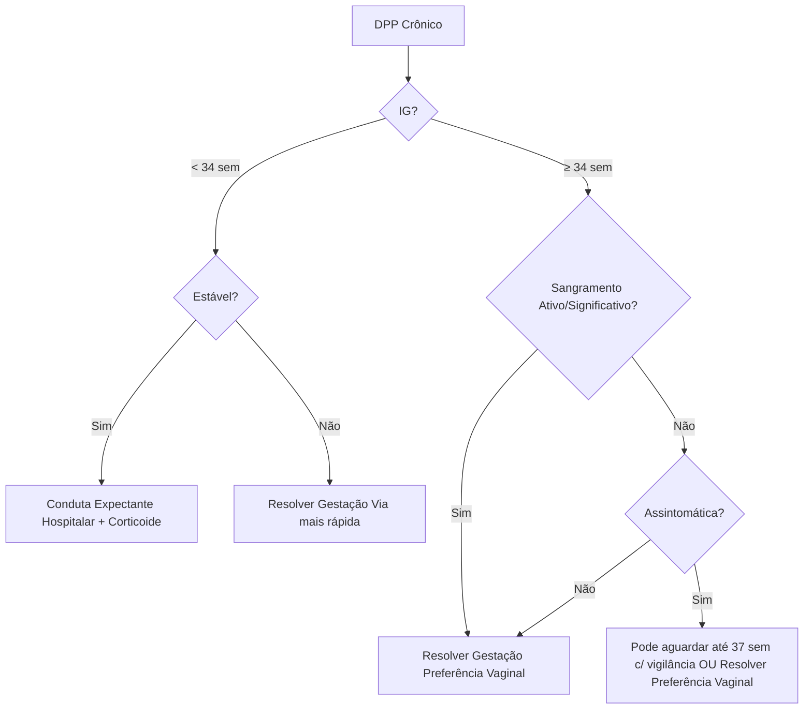
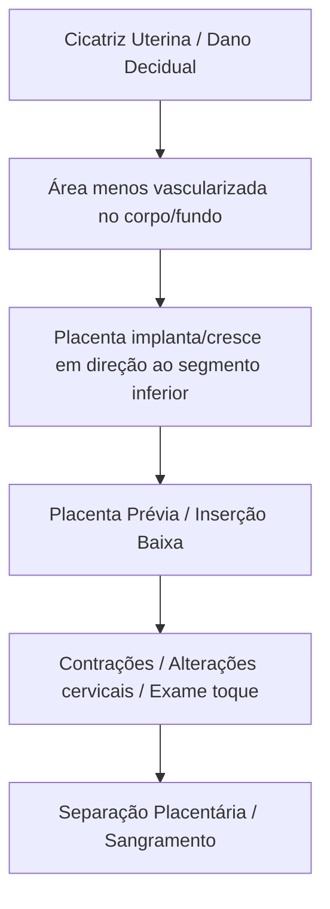
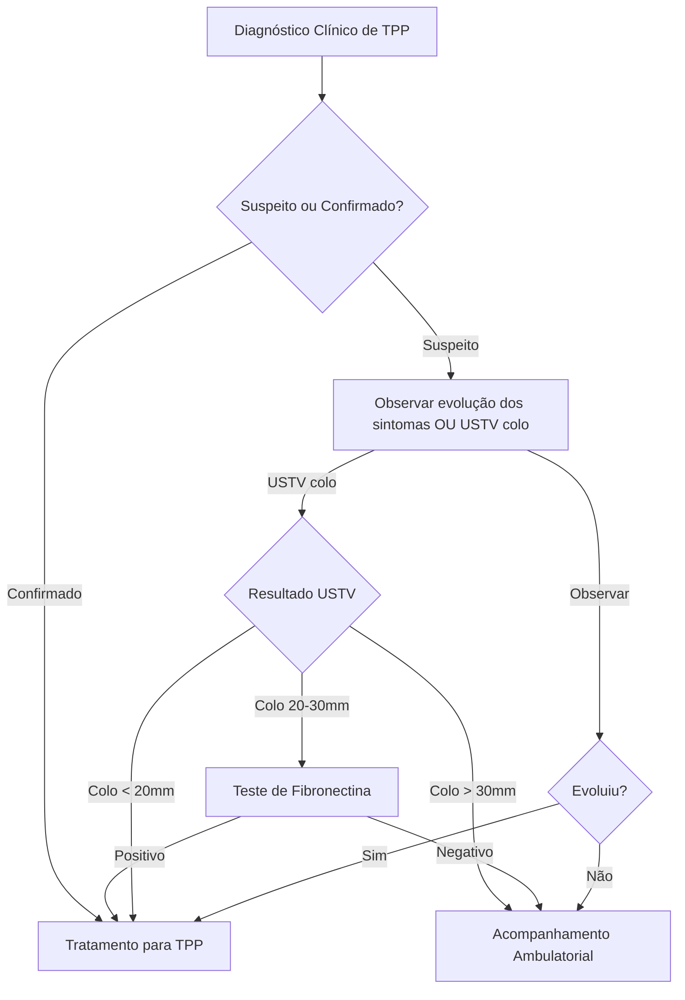
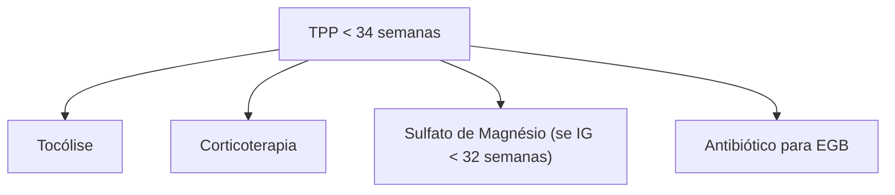

# MARC

### Semana 1 - Espondiloartrites

# Espondiloartrites

## 1.0 Definição

*   Grupo de doenças reumáticas inflamatórias sistêmicas que envolvem o esqueleto axial e/ou periférico.
*   Compartilham mecanismos genéticos e fisiopatológicos, além de manifestações satélites (entesite, dactilite).
*   **Esqueleto Axial (Reumatologia):** Crânio, caixa torácica, coluna vertebral (incluindo articulações sacroilíacas).
*   **Esqueleto Periférico:** Demais articulações, destacando joelho, tornozelo e pequenas articulações dos dedos.

## 2.0 Classificação

*   **Evolução Histórica:**
    *   1970: Moll e Wright - "espondiloartropatias soronegativas" (sem fator reumatoide e com manifestações articulares diferentes da AR).
    *   Posteriormente: Critérios Amor e ESSG - achados clínicos, laboratoriais e radiológicos, mas sem especificar doenças.
    *   Atual: "espondiloartrites" - inflamação nas articulações das vértebras.
*   **Classificação atual:**
    *   **Espondiloartrite Axial:**
        *   **Não-radiográfica:** sacroiliíte apenas na ressonância magnética.
        *   **Radiográfica (Espondilite Anquilosante):** sacroiliíte visível na radiografia.
    *   **Predomínio Sintomático:**
        *   Predominantemente axial.
        *   Predominantemente periférico.
    *   **Espondiloartrites Indiferenciadas:** Manifestações periféricas sem critérios para doenças específicas.
   
*  **Interseções:** Há sobreposição entre as diferentes classificações (conforme esquema na página 9).
    *  Ex: Espondiloartrite axial (e suas subclasses) + artrite associada a DII e artrite psoriásica.
 * Artrite reativa e espondiloartrite periférica indiferenciada.
  
## 3.0 Espondilite Anquilosante

### 3.1 Epidemiologia

*   Predomínio masculino (3:1).
*   Início inferior aos 40 anos.
*   Mais frequente em caucasianos.
*   Prevalência: 0,3-0,5% (pode chegar a 2% em populações com maior prevalência de HLA-B27).

### 3.2 Etiologia

*   Interação entre genética e ambiente.
*   **Genética:**
    *   Responsável por 90% do risco.
    *   **HLA-B27:** Fator de risco mais importante (mas não patognomônico).
        *   Presente em até 9% da população geral e em 90% dos pacientes brancos com a doença.
        *   Apenas 2-6% dos indivíduos com HLA-B27 desenvolvem espondilite anquilosante.
        *   Risco aumenta com histórico familiar (15-20%).

### 3.3 Fisiopatologia

*   Ativação imune e produção de citocinas inflamatórias.
*   Mimetismo molecular de patógenos.
*   Alterações no HLA-B27.
*   **Êntese:** Local de inserção de tendões, ligamentos e cápsula articular no osso (principal alvo inflamatório na espondilite anquilosante, sobretudo a fibrocartilaginosa).
*   **Fatores:**
    *   Estresse mecânico.
    *   Disbiose (alterações da microbiota intestinal).
*   **Citocinas:** PGE2, IL-23, TNF, IL-17.
*   **Círculo vicioso:** Inflamação → neoformação óssea (sindesmófitos na coluna).

### 3.4 Manifestações Axiais

*   **Dor Lombar Inflamatória:**
    *   Início insidioso.
    *   Rigidez matinal > 30 minutos.
    *   Melhora com exercício, piora com repouso.
    *   Dor noturna (com melhora ao levantar).
    *   Pode irradiar para membros inferiores ou dor profunda na região das nádegas.
*   **Critérios ASAS (2009):**
    *   Para lombalgia crônica > 3 meses.
    *   Início < 40 anos.
    *   Início insidioso, melhora com exercício, piora com repouso e dor noturna.
*   **Outras Manifestações:** Dor e rigidez cervical; acometimento da caixa torácica (costocondrite, dor manúbrio-esternal, limitação da expansibilidade torácica).

### 3.5 Manifestações Periféricas

*   **Padrão:**
    *   Oligoarticular.
    *   Assimétrico.
    *   Predominantemente membros inferiores.
*   **Estruturas:** Ombro, quadril, joelho, tornozelo.
*   Êntese (calcâneo) e dactilite também ocorrem.

### 3.6 Manifestações Extra-articulares

*   **Oculares:** Uveíte anterior aguda (principal), irite, iridociclite.
    *   Unilateral, abrupta, com dor, hiperemia e borramento visual.
    *   Forte associação com HLA-B27.
*   **Outras:** Fadiga (queixa mais frequente associada à atividade da doença), insuficiência aórtica, fibrose apical, nefropatia por IgA, amiloidose AA secundária (raras).

### 3.7 Exames Laboratoriais

*   Sem exame confirmatório (HLA-B27 não é diagnóstico).
*   Prova de atividade inflamatória elevada (PCR, VHS).
*   Anemia normocítica e normocrômica.
*   Líquido sinovial inflamatório (2.000-50.000 cel/mm³).
*   FR e FAN negativos.

### 3.8 Exames de Imagem

*   **Radiografia Convencional:** Primeiro exame para suspeita de espondilite anquilosante.
    *   **Sacroiliíte:**
        *   Classificada por critérios modificados de Nova York (1994) (esclerose, erosões, irregularidades das margens, alteração do espaço articular, anquilose).
    *   **Coluna:**
        *   Canto brilhante (shiny corner).
        *   Sindesmófitos: ossificação do ânulo fibroso e ligamentos longitudinais.
        *   "Coluna em bambu".
    *   Na radiografia se detectam as sequelas da inflamação, mas não necessariamente as lesões agudas.
*   **Ressonância Magnética:** Detecta precocemente lesões inflamatórias (edema de medula óssea, sinovite, entesite, capsulite) tanto nas articulações sacroilíacas quanto na coluna vertebral.

### 3.9 Exame Físico

*   Teste de Schober modificado: avalia a flexão da coluna lombar (positivo se variação < 5 cm).
*   Manobra de Patrick (FABERE): avalia articulações sacroilíacas (dor inguinal = quadril; dor lombar = sacroilíaca).

### 3.10 Diagnóstico

*   Aspectos importantes: clínica compatível e sacroiliíte na radiografia.
*   HLA-B27: não é para triagem, apenas em contexto sugestivo.
*   **Critérios Classificatórios:**
    *   Modificados de Nova York (1994): lombalgia inflamatória, expansão torácica reduzida, limitação da coluna, sacroiliíte na radiografia.
    *   ASAS (2009):
        *   Dor nas costas > 3 meses, início < 45 anos.
        *   Sacroiliíte na imagem ou HLA-B27 + 2 ou mais características de espondiloartrite.
        *   Características: lombalgia inflamatória, artrite, entesite, dactilite, PCR elevado, uveíte, HLA-B27 positivo, boa resposta a AINEs, psoríase, DII e HF de espondiloartrite.
### Tabelas de Critérios e Diagnóstico em Espondiloartrites

#### Critérios de Amor (Espondiloartropatias)

Estes critérios foram propostos para classificar um grupo de doenças relacionadas (espondiloartropatias), antes da divisão mais precisa em espondiloartrites. Eles são um pouco menos usados hoje em dia, mas são relevantes para entender a evolução da classificação.

| Categoria                             | Critérios                                                                                 | Pontuação |
| ------------------------------------- | ----------------------------------------------------------------------------------------- | --------- |
| **Clínicos**                          |                                                                                           |           |
| Dor lombar inflamatória (DLI)         | Dor lombar que melhora com movimento, piora com repouso, rigidez matinal (mais de 30 min) | 2         |
| Lombalgia alternante                  | Dor que varia de um lado da lombar para o outro                                           | 1         |
| Dor glútea alternante                 | Dor que varia de um glúteo para o outro                                                   | 1         |
| Entesite                              | Dor nos locais de inserção dos tendões e ligamentos (ex: calcanhar)                       | 2         |
| Artrite assimétrica                   | Artrite em um lado do corpo diferente do outro                                            | 2         |
| Dactilite                             | Inflamação do dedo inteiro (em salsicha)                                                  | 2         |
| Manifestações extra-articulares       | Uveíte, psoríase, doença inflamatória intestinal (DII)                                    | 2         |
| Rigidez matinal                       | Rigidez que dura mais de 30 minutos pela manhã                                            | 2         |
| Resposta aos AINEs                    | Melhora da dor e da rigidez com anti-inflamatórios não esteroides                         | 2         |
| História familiar de espondiloartrite | Um familiar de primeiro grau com espondiloartrite                                         | 2         |
| **Radiográficos**                     |                                                                                           |           |
| Sacroiliíte                           | Alterações radiográficas nas articulações sacroilíacas (esclerose, erosões, anquilose)    | 3         |
| **Critérios para classificação:**     | **≥ 6 pontos**                                                                            |           |
|                                       |                                                                                           |           |

*Observação: a pontuação serve para classificação e não para diagnóstico.*

#### Critérios Modificados de Nova York (Espondilite Anquilosante Radiográfica)

Estes critérios são específicos para espondilite anquilosante (EA), que é caracterizada por alterações radiográficas nas articulações sacroilíacas.

| Critérios Clínicos                                  | Critérios Radiográficos             |
| --------------------------------------------------- | ---------------------------------- |
| 1. Lombalgia por > 3 meses, melhora com exercício | Sacroiliíte bilateral graus 2-4      |
| 2. Limitação da mobilidade lombar (flexão/extensão) | Sacroiliíte unilateral graus 3-4      |
| 3. Limitação da expansibilidade torácica            |                                     |
| **Classificação:**                                 | **1 critério radiográfico + 1 clínico = EA**   |

*   **Graus de Sacroiliíte (Radiográfica):**
    *   **Grau 0:** Normal.
    *   **Grau 1:** Suspeita.
    *   **Grau 2:** Mínimas alterações (erosões, esclerose).
    *   **Grau 3:** Moderadas alterações.
    *   **Grau 4:** Anquilose (fusão) das articulações sacroilíacas.

#### Diferenciação entre Artrite Mecânica e Inflamatória

Esta tabela ajuda a distinguir entre causas mecânicas (decorrentes de problemas de sobrecarga ou biomecânica) e inflamatórias de dor articular.

| Característica          | Artrite Mecânica                           | Artrite Inflamatória                      |
| ----------------------- | ----------------------------------------- | --------------------------------------- |
| **Início da dor**       | Aguda, relacionada a trauma ou esforço      | Insidiosa, gradual, sem causa aparente   |
| **Ritmo da dor**        | Piora com uso, melhora com repouso       | Piora com repouso, melhora com movimento |
| **Rigidez matinal**     | Curta (< 30 minutos)                      | Prolongada (> 30 minutos)              |
| **Dor noturna**        | Geralmente ausente ou relacionada ao posicionamento| Frequente, com alívio ao se levantar |
| **Sinais inflamatórios**| Ausentes ou leves                        | Presentes (edema, calor, rubor)         |
| **Sistêmica**          | Ausente                                     | Fadiga, febre, perda de peso, mal estar   |
| **Melhora com AINEs**    | Pode melhorar, mas não é a base do tratamento | Geralmente melhora significativamente    |
| **Progressão**          | Não progressiva, relacionada à causa        | Progressiva, com possível dano articular|
| **Acometimento**         | Mono ou oligoarticular (mais em articulações de carga)  | Poliarticular (mais frequente em pequenas articulações)
| **Exames complementares** | Geralmente normais                   | PCR/VHS podem estar elevados |
*Observação: as características da tabela servem para auxiliar na suspeita diagnostica, mas o diagnóstico deve ser feito com base no quadro clinico, exames complementares e de imagem.*
___

### 3.11 Tratamento

*   **Objetivo:** Controle da inflamação, melhora da dor e rigidez, prevenção de danos estruturais e preservação da qualidade de vida.
*   **Multidisciplinar:** Reumatologista, fisioterapia, terapia ocupacional, psicólogo, nutricionista.
*   **Não Farmacológico:** Exercícios, cessar tabagismo.
*   **Farmacológico:**
    *   **1ª Linha:** AINEs (dose plena e contínua), boa resposta e baixa taxa de eventos adversos.
    *   **2ª Linha:** Antagonistas do TNF (anti-TNF) (infliximabe, adalimumabe, etanercept, certolizumabe e golimumabe).
    *   **3ª Linha:** Inibidor de IL-17A (secuquinumabe).
    *   Imunossupressores sintéticos não são indicados para manifestações axiais.
    *   Infiltração articular: opção, mas glicocorticoides sistêmicos devem ser evitados.
*   **Cirúrgico:** Exceção, artroplastia de quadril e cirurgia para deformidades vertebrais.
## Posologia dos Medicamentos nas Espondiloartrites por Linha de Tratamento

As posologias apresentadas são orientações gerais e podem variar dependendo da resposta individual do paciente, gravidade da doença, comorbidades e outras particularidades. **É fundamental que o tratamento seja sempre individualizado e acompanhado por um médico especialista.**

### 1ª Linha de Tratamento: Anti-inflamatórios Não Esteroides (AINEs)

Os AINEs são a primeira linha para controle da dor e inflamação, tanto nas formas axiais quanto periféricas das espondiloartrites. A dose e o tipo de AINE devem ser individualizados, sendo a dose plena mantida continuamente.

*   **Exemplos de AINEs comuns:**
    *   **Naproxeno:** 500 mg, 12/12 horas (até 1000 mg ao dia).
    *   **Ibuprofeno:** 400-800 mg, 8/8 horas ou 6/6 horas (até 2400 mg ao dia).
    *   **Diclofenaco:** 50-75 mg, 8/8 horas ou 12/12 horas (até 150 mg ao dia).
    *   **Celecoxibe:** 200 mg, 1x ao dia ou 100 mg, 12/12 horas (até 400mg ao dia)
    *   **Etoricoxibe:** 60-90 mg 1x ao dia (120mg em casos agudos)
    *   **Indometacina:** 25-50 mg, 8/8 horas (até 200 mg ao dia)

*   **Observações:**
    *   A dose deve ser ajustada conforme resposta clínica.
    *   AINEs podem causar efeitos colaterais gastrointestinais, cardiovasculares e renais.
    *   Utilizar com cautela em pacientes com histórico de úlcera péptica, insuficiência renal ou doenças cardiovasculares.
    *   Considerar uso de inibidores da bomba de prótons (ex: omeprazol) para proteção gástrica.

### 2ª Linha de Tratamento: Medicamentos Modificadores da Doença (DMARDs) Sintéticos (Tradicionais)

Os DMARDs são usados em casos de resposta insuficiente aos AINEs, principalmente nas manifestações periféricas e em alguns casos de artrite psoriásica.

*   **Metotrexato:**
    *   Dose inicial: 7,5 a 15 mg, 1x por semana.
    *   Pode ser ajustada até 25 mg/semana (dependendo da resposta e tolerância).
    *   Administração oral ou subcutânea.
    *   Requer suplementação com ácido fólico para reduzir efeitos colaterais (5 mg/dia exceto dia da tomada do metotrexato).
*   **Sulfassalazina:**
    *   Dose inicial: 500 mg, 12/12 horas.
    *   Aumentar gradualmente até 2-3 gramas ao dia, divididas em duas a três tomadas.
    *   Requer monitorização da função hepática e hemograma.
    *   Recomenda-se começar com doses menores e aumentar progressivamente para melhor tolerabilidade.
*   **Outros DMARDs (menos usados em espondiloartrites):**
    *   Leflunomida, azatioprina (utilizados em casos refratários).
    *   Cloroquina e hidroxicloroquina não são eficazes nas manifestações axiais.

*   **Observações:**
    *   Efeitos colaterais e necessidade de acompanhamento com exames laboratoriais.
    *   Não costumam ser eficazes nas manifestações axiais.

### 2ª ou 3ª Linha de Tratamento: Agentes Biológicos (Anti-TNF e Anti-IL17)

Os agentes biológicos são indicados em pacientes com resposta inadequada aos AINEs e/ou DMARDs sintéticos, especialmente em formas mais graves ou refratárias. São considerados 2a linha em pacientes com espondiloartrite, mas 3a linha na Artrite Reativa.

*   **Inibidores do TNF (Anti-TNF):**
    *   **Infliximabe:** 5 mg/kg, infusão intravenosa nas semanas 0, 2 e 6, depois a cada 8 semanas.
    *   **Adalimumabe:** 40 mg, injeção subcutânea a cada 2 semanas.
    *   **Etanercepte:** 25-50 mg, injeção subcutânea 2x por semana ou 50mg 1x por semana.
    *  **Certolizumabe:** 200 mg, injeção subcutânea, a cada 2 semanas (dose de ataque) e, depois, a cada 4 semanas.
    *   **Golimumabe:** 50 mg, injeção subcutânea 1x ao mês.
*   **Inibidores de IL-17A:**
    *   **Secuquinumabe:** 150 mg ou 300mg, injeção subcutânea semanalmente por 5 semanas (dose de ataque), depois mensalmente.
    *   **Ixequizumabe:** 80mg, injeção subcutânea a cada 2 semanas por 12 semanas e depois, a cada 4 semanas.

*   **Observações:**
    *   Administração subcutânea ou intravenosa.
    *   Monitorar risco de infecções (tuberculose).
    *   Podem aumentar risco de infecções oportunistas e outras complicações infecciosas, por tanto, é indicado ter o esquema vacinal atualizado.

### Tratamentos Adicionais

*   **Glicocorticoides (Corticosteroides):**
    *   Infiltração local: pode ser usada em casos de dor refratária em entesites ou articulações específicas (dose ajustada dependendo da área).
    *   Uso sistêmico: deve ser evitado devido aos efeitos colaterais em longo prazo. Em alguns casos de uveíte aguda, pode ser usada dose de ataque por curto tempo.
*   **Analgésicos:**
    *   Paracetamol (acetaminofeno): pode ser usado para alívio da dor, mas não atua na inflamação.
    *   Opioides: raramente indicados em longo prazo, apenas em casos de dor intensa e refratária.
*   **Fisioterapia:** Essencial para manter a mobilidade, fortalecer músculos e reduzir a dor.
*   **Exercícios:** Prática regular de atividades físicas (como caminhada, alongamento e exercícios de fortalecimento) é fundamental.

### 3.12 Prognóstico

*   Melhorou com tratamento; maioria controla a doença e mantém vida produtiva.
*   Fatores de pior prognóstico: sexo masculino, tabagismo, elevação persistente da atividade inflamatória, acometimento precoce de quadril, sindesmófitos prévios, resposta ruim a AINEs.
*   Principais causas de óbito: doenças cardiovasculares e infecções.

## 4.0 Artrite Psoriásica

### 4.1 Epidemiologia

*   Associação com psoríase (1-3% da população adulta, 30% dos casos apresentam acometimento articular).
*   Segunda espondiloartrite mais prevalente.
*   Mais frequente em caucasianos.
*   Acomete ambos os sexos.
*   Início entre 20-50 anos.

### 4.2 Etiologia

*   Gatilho ambiental (infecções, traumatismos físicos) em indivíduo geneticamente predisposto.
*   Doença poligênica.
*   HLA-B27 presente em 20-60% (mais nos casos com acometimento axial).
*   HF positiva em até 40%.

### 4.3 Fisiopatologia

*   Gatilho ambiental nos queratinócitos → ativação de células e liberação de citocinas inflamatórias (TNF-alfa, IL-17, IL-22, IL-23).
*   Círculo vicioso de inflamação e danos.

### 4.4 Manifestações Articulares

*   Relacionada à forma cutânea e acometimento ungueal.
*   Psoríase antecede a artrite em 70% dos casos.
*   **Classificação de Moll e Wright (1973):**
    *   Oligoartrite assimétrica.
    *   Poliartrite simétrica.
    *   Acometimento predominante das IFDs (diagnóstico diferencial da AR).
    *   Artrite mutilante.
    *   Doença axial predominante.
*   **Padrão:** Oligoarticular e assimétrico evolui para poliartrite simétrica.
*   **Envolvimento de IFDs:** Importante para diagnóstico diferencial com artrite reumatoide.
*   Dactilite em até 40% dos casos.
*   Evolução: deformidades, erosões, subluxações, reabsorção óssea (artrite mutilante).
*   Acometimento axial menos frequente (sacroiliíte assimétrica, sindesmófitos unilaterais e irregulares).

### 4.5 Manifestações Extra-articulares

*   Menos frequentes que na espondilite anquilosante.
*   Conjuntivite (principal), uveíte e episclerite.
*   Úlceras orais, uretrite, colite e insuficiência aórtica (raras).

### 4.6 Comorbidades Associadas

*   Maior incidência de hipertensão arterial, diabetes mellitus, dislipidemia e obesidade.
*   Risco cardiovascular aumentado (disfunção endotelial e síndrome metabólica).
*   HIV: pode ser gatilho e causar quadros mais graves.

### 4.7 Laboratório

*   Não há exame específico.
*   Elevação de PCR e VHS (em atividade da doença).
*   Hiperuricemia (20%).
*   FR ou anti-CCP positivo em pequena porcentagem (alterações imunológicas).
*   Líquido sinovial inflamatório (2.000-50.000 cel/mm³).

### 4.8 Exames de Imagem

*   Radiografia: lesões ósseas proliferativas (periostite com aspecto "fluffy"/algodonoso), reabsorção óssea e lesão tipo "pencil-in-cup" nas IFDs.
*   RM e USG para avaliação da inflamação aguda (complementares à radiografia).

### 4.9 Diagnóstico

*   Critérios de Moll e Wright (1973): psoríase + artrite periférica e/ou axial + teste sorológico negativo para FR.
*   Critérios CASPAR (2006):
    *   Psoríase atual (2 pontos) OU História pessoal ou familiar de psoríase (1 ponto).
    *   Distrofia ungueal (1 ponto).
    *   Dactilite (1 ponto).
    *   Fator reumatoide negativo (1 ponto).
    *   Neoformação óssea justa-articular na radiografia de mãos e pés (1 ponto).
*   Diagnóstico diferencial: Outras espondiloartrites, osteoartrite e artrite reumatoide (atenção às IFDs).

### 4.10 Tratamento

*   Multidisciplinar (reumatologista, dermatologista, fisioterapeuta, etc.)
*   Cessar tabagismo e mudanças no estilo de vida.
*   **1ª Linha:** AINEs (cautela em quadros mais graves ou com DII).
*   **2ª Linha:** Metotrexato e outros imunossupressores sintéticos.
*   **3ª Linha:** Antagonistas do TNF (anti-TNF) (inibidores de IL-17 também são eficazes).
*   Infiltração articular com glicocorticoide (opção), mas glicocorticoides sistêmicos devem ser evitados.

### 4.11 Prognóstico

*   Piora em relação à visão inicial.
*   40-60% desenvolvem doença erosiva.
*   10-20% cursam com deformidades importantes e limitação funcional.
*   Pior prognóstico: sexo feminino, idade precoce, artrite de início agudo, acometimento poliarticular, provas inflamatórias elevadas.
*   Maior mortalidade por causas cardiovasculares (associadas à síndrome metabólica).

## 5.0 Artrite Reativa

### 5.1 Definição

*   Condição desencadeada por infecções extra-articulares (geniturinário e gastrointestinal).
*   Impossível isolar o patógeno no líquido sinovial (estéril).
*   Considerada uma espondiloartrite.
*   "Síndrome de Reiter" é um subgrupo com a tríade artrite + uretrite + conjuntivite (não é sinônimo de artrite reativa).

### 5.2 Epidemiologia

*   Adultos jovens (20-40 anos).
*   Início de 0,6 a 27 casos por 100 mil adultos.
*   Pode ser mais frequente em caucasianos.
*   Masculino = feminino (geral), masculino > feminino se associada a infecções do trato geniturinário.

### 5.3 Etiologia

*   Indivíduos geneticamente predispostos (HLA-B27 presente em 60-80%).
*   Resposta imune disfuncional a infecções por patógenos.
*   *Chlamydia trachomatis* (50% dos casos).
*  Outros: *Ureaplasma urealyticum* e *Mycoplasma genitalium*.
*  Bactérias do trato gastrointestinal: *Salmonella, Shigella, Yersinia, Campylobacter*.
*  *Clostridium difficile* e *E. coli* (menos frequentes).
*   *Chlamydia pneumoniae* (trato respiratório).

### 5.4 Fisiopatologia

*   Apresentação de antígenos aos linfócitos (HLA-B27 importante).
*   Ativação imune.
*   Alterações na microbiota intestinal.

### 5.5 Manifestações Clínicas

*   Início agudo 1-4 semanas após infecção.
*   Queixas geniturinárias (uretrite asséptica) ou diarreia.
*   **Quadro:** Oligoartrite assimétrica (membros inferiores) + manifestações extra-articulares.
*   Até 40% apresentam acometimento axial (sacroiliíte/espondilite), lombalgia inflamatória, entesite e dactilite.
*   **Extra-articulares:**
    *   Conjuntivite (principal), uveíte, episclerite, ceratite.
    *   Úlceras orais indolores, eritema nodoso.
    *   Distrofia ungueal.
    *   Ceratoderma blenorrágico (plantar e lateral dos pés e palma).
    *   Balanite circinada (glande e corpo do pênis).

### 5.6 Exames Complementares

*   Inespecíficos (não obrigatórios).
*   Elevação de PCR e VHS.
*   Evidência da infecção (cultura, sorologia, molecular).
*   Líquido sinovial inflamatório (2.000-50.000 cel/mm³).
*   RM e USG para inflamação aguda, radiografia para sequelas.
*   Sacroiliíte assimétrica.

### 5.7 Diagnóstico

*   Clínico.
*   Diferencial com artrite gonocócica:
    *   Artrite Reativa: Homem = mulher, artralgia migratória, entesite/dactilite, acometimento axial, lesões mucocutâneas (ceratoderma, balanite), cultura negativa.
    *   Artrite Gonocócica: Mulher > Homem, sem artralgia migratória, predomínio em mãos, punho e joelho, cultura positiva.
*   Outros diagnósticos diferenciais: gota, artrite séptica, artrites infecciosas.

### 5.8 Tratamento

*   **1ª Linha:** AINEs.
*   Infiltração articular com glicocorticoides (opção), mas glicocorticoides sistêmicos devem ser evitados.
*   **2ª Linha:** Imunossupressores sintéticos (sulfassalazina, metotrexato).
*   **3ª Linha:** Inibidores de TNF (anti-TNF).

### 5.9 Prognóstico

*   80% resolve em 6-12 meses.
*   Forma crônica: artrite periférica/axial persistente.
*   Pior prognóstico: sexo masculino, HLA-B27, reinfecções, VHS elevada, artrite de quadril, entesite do aquiles, resposta ruim a AINEs.

## 6.0 Artrite Associada a Doença Inflamatória Intestinal (Artrite Enteropática)

### 6.1 Definição

*   Manifestação articular associada a DII (Crohn e RCU).
*   Acometimento articular é a manifestação extraintestinal mais comum das DII.
*   Outras associações: pós-operatório de bypass intestinal, doença de Whipple.

### 6.2 Epidemiologia

*   Prevalência estimada em torno de 0,2% da população mundial (mas varia entre 11.1 a 14.9%).
*   Acomete homens e mulheres igualmente.
*   Todas as idades (principalmente 20-30 anos).

### 6.3 Etiologia

*   Alteração da permeabilidade intestinal → translocação bacteriana e resposta imune disfuncional.
*   Marcadores genéticos comuns com espondiloartrites (receptores de interleucinas 17 e 23).

### 6.4 Fisiopatologia

*   Semelhante a outras espondiloartrites.
*   Fatores genéticos + gatilhos ambientais.

### 6.5 Manifestações Clínicas

*   Articulares podem preceder as queixas gastrointestinais.
*   Dor abdominal, diarreia e sangramento como sinais de alerta para o diagnóstico da artrite.
*  **Classificação (Oxford):**
    *  Tipo I: oligoartrite assimétrica (membros inferiores, não erosiva, autolimitada).
    *  Tipo II: poliartrite simétrica (semelhante à AR, erosões e deformidades, evolução independente da DII).
*  Acometimento axial semelhante ao da espondilite anquilosante (sacroiliíte + lombalgia).
*   Manifestações extraintestinais: uveíte, úlceras, pioderma gangrenoso e eritema nodoso.

### 6.6 Exames Complementares

*   Inespecíficos (anemia, leucocitose, elevação das provas inflamatórias).
*   HLA-B27 pode estar presente em acometimentos axiais.
*   Líquido sinovial inflamatório.
*   FR, FAN, ANCA e ASCA negativos.
*   Ressonância magnética e USG detectam alterações inflamatórias agudas, radiografia para sequelas.

### 6.7 Diagnóstico

*   Clínico (alto nível de suspeita).
*   Exames complementares e de imagem são coadjuvantes.

### 6.8 Tratamento

*   Multidisciplinar: reumatologista, gastroenterologista, suporte físico, nutricional e psicológico.
*   **AINEs** contraindicados em formas graves de DII, usar com cautela em formas leves.
*   **Tratamento DII:** Glicocorticoides e imunossupressores (sulfassalazina).
*   **Anti-TNF:**  inibidores TNF (exceto etanercept).
*  Se refratário,  inibidor das interleucinas 12 e 23 (ustequinumabe).

### 6.9 Prognóstico

*   Quadro periférico: intermitente e sem deformidades.
*   Poliartrite/axial: pode ser progressiva e com limitação funcional.

## 7.0 Espondiloartrite Indiferenciada

*   Pacientes com manifestações clínicas de espondiloartrite sem critérios para uma doença específica.
*   Comportamento semelhante à espondiloartrite axial não-radiográfica.
*   Pode evoluir para forma definida ou remitir espontaneamente.
*   Tratamento de acordo com as recomendações gerais para espondiloartrites.


### Manifestações Clínicas

| Característica | Espondilite Anquilosante | Artrite Psoriásica | Artrite Reativa | Artrite Enteropática | Espondiloartrite Indiferenciada |
|---|---|---|---|---|---|
| **Acometimento Articular** | Axial (sacroilíacas, coluna), periférico (grandes articulações, assimétrico) | Periférico (IFDs, poliartrite simétrica ou assimétrica), axial (menos comum, assimétrico) | Periférico (oligoartrite assimétrica, membros inferiores), axial (até 40%) | Periférico (oligoartrite assimétrica ou poliartrite simétrica), axial | Variável, sem critérios para doença específica |
| **Dor Lombar** | Inflamatória (melhora com exercício, piora com repouso, rigidez matinal > 30 min, dor noturna) | Menos comum, pode ser inflamatória ou mecânica |  Inflamatória, associada a sacroiliíte | Inflamatória, associada a sacroiliíte | Pode estar presente |
| **Entesite** | Comum (calcâneo) | Comum | Comum | Comum | Pode estar presente |
| **Dactilite** | Comum | Frequente (até 40%) | Comum | Pode estar presente | Pode estar presente |
| **Manifestações Extra-articulares** | Uveíte anterior aguda (principal), fadiga, insuficiência aórtica (raro) | Conjuntivite, uveíte, lesões de pele e unhas | Conjuntivite, uveíte, úlceras orais, ceratoderma blenorrágico, balanite circinada | Uveíte, úlceras orais, pioderma gangrenoso, eritema nodoso | Variável |
| **Doença Intestinal** | - | - |  Diarreia (prévia à artrite) | Crohn ou RCU | - |
| **Psoríase** | - | Sim | - | - | - |


### Tratamento

| Tratamento   | Espondilite Anquilosante                   | Artrite Psoriásica                                          | Artrite Reativa             | Artrite Enteropática                                           | Espondiloartrite Indiferenciada |
| ------------ | ------------------------------------------ | ----------------------------------------------------------- | --------------------------- | -------------------------------------------------------------- | ------------------------------- |
| **1ª Linha** | AINEs (dose plena, contínua)               | AINEs (cautela se DII)                                      | AINEs                       | - (AINEs contraindicados em DII grave, cautela em leve)        | AINEs                           |
| **2ª Linha** | Anti-TNF                                   | Metotrexato, outros imunossupressores                       | Sulfassalazina, metotrexato | Glicocorticoides e imunossupressores (sulfassalazina) para DII | Depende da manifestação         |
| **3ª Linha** | IL-17 inibidores                           | Anti-TNF, IL-17 inibidores                                  | Anti-TNF                    | Anti-TNF (exceto etanercept),ustequinumabe (se refratário)     | Depende da manifestação         |
| **Outros**   | Fisioterapia, exercícios, cessar tabagismo | Fisioterapia, exercícios, cessar tabagismo, tratar psoríase | Fisioterapia, exercícios    | Fisioterapia, exercícios, tratar DII                           | Fisioterapia, exercícios        |


## Considerações Adicionais:

* **HLA-B27:** Presente em alta porcentagem dos pacientes com espondilite anquilosante e artrite reativa, mas *não é diagnóstico*.  Usar apenas em contexto clínico sugestivo.
* **Fator Reumatoide (FR):**  Negativo nas espondiloartrites (exceto em alguns casos de artrite psoriásica).
* **Diagnóstico Diferencial:**  Essencial considerar outras doenças reumáticas, como artrite reumatoide, gota e artrite séptica.  Atenção especial ao acometimento das IFDs na artrite psoriásica.
* **Tratamento Individualizado:** Ajustar medicação e terapias de acordo com a resposta de cada paciente, gravidade da doença e comorbidades.

# Osteoartrite (OA)

## 1.1 Conceito
* Doença articular degenerativa mais comum.
* Caracterizada por degeneração progressiva da cartilagem articular.
* Envolve inflamação de baixo grau, remodelação óssea e alterações em toda a articulação (cartilagem, osso subcondral, membrana sinovial, ligamentos, cápsula articular, meniscos e músculos periarticulares).
* Não é considerada uma doença autoimune clássica, embora haja componente inflamatório.

## 1.2 Epidemiologia
* A prevalência aumenta com a idade. Rara antes dos 40 anos, frequente após os 60. 85% das pessoas com mais de 75 anos têm evidências radiográficas.
* Predominante no sexo feminino, exceto para OA de quadril (mais comum em homens até os 50 anos).
* Prevalência global de OA de quadril/joelho ~5% em adultos >18 anos.
* Difícil mensuração da prevalência real devido ao diagnóstico tardio (geralmente após o início da dor).

## 1.3 Patologia
* Desequilíbrio entre degradação e reparação da cartilagem articular.
* Aumento do metabolismo celular articular em resposta à agressão.
* Condrócitos ativados liberam enzimas degradadoras (metaloproteinases, serinoproteinases, etc.) que degradam a matriz extracelular da cartilagem (colágeno tipo II, proteoglicanos, ácido hialurônico).
* Fissuras e quebra da cartilagem, com tentativa de reparo inadequada.
* Exposição do osso subcondral, formação de cistos ósseos e osteófitos.
* Remodelamento e hipertrofia óssea, levando à esclerose subcondral.
* Inflamação da membrana sinovial e outros tecidos periarticulares.


## 1.4 Fatores de Risco
* Idade avançada: Colágeno com menor qualidade e elasticidade.
* Sexo feminino: Maior risco para OA de mãos e joelhos.
* Genética: OA nodal das mãos tem forte componente genético. Associação com HLA-B 18, HLA-B 8 e A 1.
* Obesidade: Principal fator de risco modificável. Aumento da produção de citocinas pró-inflamatórias (adiponectinas).
* Trauma prévio: Lesões articulares, meniscais e fraturas.
* Alterações mecânicas: Deformidades em varo ou valgo, displasia de quadril.
* Tabagismo: Contribui para degeneração discal.
* Fatores Nutricionais: Deficiências vitamínicas e minerais.
* Densidade óssea: Osteoporose pode aumentar o risco de fraturas, que podem levar à OA secundária.
* Fatores hormonais: Alterações hormonais, como na menopausa, podem influenciar o risco de OA.

## 1.5 Classificação
* Primária (idiopática): Sem causa conhecida.
* Secundária: Causada por fator subjacente (trauma, doença metabólica, etc.).
* Localizada: <3 articulações envolvidas.
* Generalizada: >3 articulações envolvidas.

## 1.6 Quadro Clínico
* Dor articular: Relacionada ao uso, piora com atividade, melhora com repouso.
* Rigidez matinal: Curta duração (<30 minutos), protocinética (dor no início do movimento).
* Crepitação: Sensação ou som de rangido na articulação.
* Derrame articular: Incomum, exceto em joelhos, geralmente discreto.
* Deformidade articular: Nódulos de Heberden (IFDs), Bouchard (IFPs), valgismo do hálux, varismo/valgismo de joelhos.
* Limitação da amplitude de movimento.
* Instabilidade articular: Sensação de falseio.

## 1.7 Tratamento

### 1.7.1 Não Farmacológico
* Educação do paciente.
* Perda de peso (se necessário).
* Exercícios físicos: Fortalecimento muscular, alongamento, exercícios aeróbicos de baixo impacto.
* Fisioterapia.
* Terapia ocupacional.
* Dispositivos auxiliares: Bengalas, andadores, órteses.

### 1.7.2 Farmacológico

* Analgésicos: Paracetamol (primeira escolha), tramadol, opioides (casos refratários).
* AINEs: Tópicos ou orais, considerar risco cardiovascular e gastrointestinal.
* Inibidores da COX-2 (coxibes): Menor risco gastrointestinal, maior risco cardiovascular.
* Corticosteroides intra-articulares: Alívio temporário da dor e inflamação.
* Viscossuplementação (ácido hialurônico): Injeções intra-articulares, alívio da dor e melhora da função.
* Condroitina e glicosamina: Eficácia controversa.
* Diacereína: Anti-inflamatório e analgésico.
* **Analgésicos:**
    * Paracetamol: 500mg-1g a cada 4-6 horas (máximo 4g/dia).
    * Tramadol: 50-100mg a cada 4-6 horas (dose máxima 400mg/dia).
    * Opioides: Utilizados em casos de dor refratária, com cautela e monitoramento.

* **AINEs:**
    * Ibuprofeno: 400-800mg a cada 4-6 horas.
    * Naproxeno: 250-500mg a cada 12 horas.
    * Diclofenaco: 50-100mg a cada 8-12 horas.
    * Celecoxibe: 100-200mg a cada 12 horas.
    * AINEs tópicos: Aplicar na área afetada 3-4 vezes ao dia.

* **Inibidores da COX-2 (coxibes):**
    * Celecoxibe: 100-200mg a cada 12 horas.
    * Etoricoxibe: 60-120mg uma vez ao dia.

* **Corticosteroides intra-articulares:**
    * Dose e frequência variam conforme a articulação e a gravidade da inflamação.

* **Viscossuplementação (ácido hialurônico):**
    * Injeções intra-articulares, geralmente uma série de 3-5 injeções, uma vez por semana.

* **Condroitina e glicosamina:**
    * Condroitina: 400mg 3 vezes ao dia.
    * Glicosamina: 500mg 3 vezes ao dia.

* **Diacereína:**
    * 50mg 2 vezes ao dia.

### 1.8.3 Fármacos de Ação Rápida
* Ver posologias dos AINEs e Paracetamol na seção 1.8.2.

### 1.8.4 Fármacos de Ação Lenta
* Ver posologias da condroitina, glicosamina e diacereína na seção 1.8.2.

### 1.8.5 Medicações Intra-articulares
* Ver posologias na seção 1.8.2.

### 1.8.6 Outros
* Duloxetina: 30-60mg uma vez ao dia.

## 1.8 Tratamento Cirúrgico
* Artroplastia total: Substituição da articulação, indicada em casos graves com dor refratária e limitação funcional.
* Artroscopia: Procedimento minimamente invasivo, para reparo de lesões associadas (menisco, ligamentos).
* Osteotomia: Realinhamento ósseo, para corrigir deformidades.


### Semana 2 - Neoplasia na infância

# Biologia Molecular dos Tumores da Infância 
## Destaques

* **Alterações genéticas afetam proto-oncogenes, genes supressores de tumor e genes de reparo de DNA. Foco deste capítulo: proto-oncogenes e genes supressores de tumor em neoplasias infantis.**  O câncer é causado por alterações no DNA. Essas alterações podem ativar genes que promovem o crescimento celular (proto-oncogenes, que se tornam oncogenes quando ativados) ou desativar genes que suprimem o crescimento (genes supressores de tumor).  Genes de reparo de DNA corrigem erros no DNA, e sua falha também contribui para o câncer. Este capítulo foca nos dois primeiros tipos de genes em cânceres infantis.
* **Oncogenes: fatores de transcrição são o maior grupo em tumores pediátricos.** Oncogenes são genes que promovem o crescimento celular descontrolado. Fatores de transcrição são proteínas que controlam a atividade de outros genes. Quando um fator de transcrição se torna um oncogene, ele pode ativar genes que levam ao câncer.
* **Imagens modernas detectam lesões malignas a partir de 10⁹ células.**  Técnicas de imagem como ressonância magnética e tomografia computadorizada se tornaram tão sensíveis que podem detectar tumores muito pequenos, compostos por apenas um bilhão de células.
* **Neuroblastoma: tumor sólido extracraniano mais comum, 15% das mortes por câncer infantil.**  O neuroblastoma se origina em células do sistema nervoso periférico e é o tumor sólido (não envolvendo o sangue) mais comum encontrado fora do crânio em crianças. Ele é responsável por uma parcela significativa das mortes por câncer nessa faixa etária.
* **Avanços no entendimento de tumores de SNC em crianças nos últimos 20 anos.**  Houve progressos consideráveis na compreensão dos tumores do sistema nervoso central (cérebro e medula espinhal) que afetam crianças, incluindo sua biologia, genética e tratamento.

## Introdução

* **Avanços na genética da patogênese de tumores (infância e adultos).**  A pesquisa em genética do câncer avançou muito nas últimas décadas, revelando os mecanismos moleculares que levam ao desenvolvimento de tumores tanto em crianças quanto em adultos.
* **Alterações genéticas: hereditárias (todas as células) ou somáticas (células tumorais).** As alterações genéticas que causam câncer podem ser herdadas dos pais e estar presentes em todas as células do corpo ou podem surgir espontaneamente em uma célula específica (somática) e estar presentes apenas nas células do tumor.
* **Foco do capítulo: proto-oncogenes e genes supressores de tumor. Genes de reparo de DNA: mais comuns em adultos.** Este capítulo se concentra nos proto-oncogenes e genes supressores de tumor, que são importantes no câncer infantil.  Alterações em genes de reparo de DNA, embora também importantes, são mais comuns em cânceres de adultos.


## Proto-oncogenes e Oncogenes

* **Proto-oncogenes: genes normais com função em diferenciação e divisão celular.** Proto-oncogenes são genes normais que desempenham um papel crucial na regulação do crescimento e desenvolvimento celular, incluindo a diferenciação (especialização das células) e a divisão celular.
* **Oncogenes: proto-oncogenes com função alterada por mutações, inserções, deleções ou amplificação.**  Quando um proto-oncogene sofre uma mutação (alteração na sequência de DNA), inserção (adição de DNA), deleção (remoção de DNA) ou amplificação (aumento do número de cópias do gene), ele pode se tornar um oncogene. Oncogenes são como um acelerador preso, levando ao crescimento celular descontrolado.
* **Fatores de transcrição: maior grupo de oncogenes em tumores pediátricos.**  Em tumores pediátricos, muitos oncogenes são fatores de transcrição, proteínas que controlam a expressão de outros genes.  Quando alterados, esses fatores podem ativar genes que promovem o câncer.
* **Homologia com proteínas de organismos primitivos: vias bioquímicas da transformação celular conservadas.**  A semelhança (homologia) entre oncogenes humanos e proteínas encontradas em organismos primitivos indica que as vias bioquímicas que levam à transformação de uma célula normal em cancerosa são muito antigas e foram conservadas ao longo da evolução.

## Genes Supressores de Tumor

* **Inativação: vantagem proliferativa para célula tumoral.** Genes supressores de tumor atuam como freios no crescimento celular. Sua inativação permite que as células tumorais se proliferem (multipliquem) sem controle.
* **Teoria dos "dois eventos" (Knudson): retinoblastoma.** Alfred Knudson propôs que dois eventos (mutações) são necessários para o desenvolvimento do retinoblastoma, um câncer de olho.  Isso significa que ambos os alelos do gene supressor de tumor Rb devem ser inativados.
    * **Primeiro evento (mutação): constitucional ou somático.** O primeiro evento pode ser uma mutação herdada (constitucional) ou uma mutação que surge espontaneamente em uma célula da retina (somática).
    * **Segundo evento (mutação): sempre somático.**  O segundo evento é sempre uma mutação somática que ocorre no outro alelo do gene Rb na mesma célula.
    * **Retinoblastoma hereditário: mutação constitucional, início precoce, neonatal, bilateral.** No retinoblastoma hereditário, a primeira mutação é herdada e está presente em todas as células da retina.  O segundo evento é mais provável de ocorrer, levando a um início precoce da doença, frequentemente na infância (neonatal) e afetando ambos os olhos (bilateral).
    * **Retinoblastoma não-hereditário (somático): início tardio, unilateral.** No retinoblastoma não-hereditário, ambas as mutações ocorrem somaticamente em uma única célula da retina, o que é menos provável. Portanto, a doença geralmente tem um início mais tardio e afeta apenas um olho (unilateral).
* **Gene TP 53 (cromossomo 17): proteína p 53 (53 kd), controle do ciclo celular (fase G 1), reparo do DNA.**  O gene TP 53 codifica a proteína p 53, um importante supressor de tumor que regula o ciclo celular (a sequência de eventos que levam à divisão celular), principalmente na fase G 1, onde verifica se o DNA está danificado. A p 53 também participa do reparo do DNA.
    * **Mutações constitucionais: síndrome de Li-Fraumeni (sarcomas, câncer de mama, tumores de SNC, carcinoma adrenal, leucemias). 50% de chance de câncer até 30 anos.** Mutações herdadas no TP 53 causam a síndrome de Li-Fraumeni, que aumenta drasticamente o risco de desenvolver vários tipos de câncer, incluindo sarcomas (câncer de tecidos conjuntivos), câncer de mama, tumores do sistema nervoso central, carcinoma adrenal (câncer da glândula adrenal) e leucemias.  Indivíduos com essa síndrome têm 50% de chance de desenvolver câncer até os 30 anos de idade.
* **Inibidores de CDK: regulam negativamente o ciclo celular, inibem fosforilação da proteína Rb (p 15 INK 4 B, p 16 INK 4 A, p 18 INK 4 C, p 19 INK 4 D, p 19 ARF, p 21 CIP 1, p 27 KIP 1, p 57 KIP 2).**  Inibidores de CDK (quinases dependentes de ciclina) são proteínas que regulam negativamente o ciclo celular, agindo como freios na progressão do ciclo.  Eles fazem isso inibindo a fosforilação (adição de um grupo fosfato) da proteína Rb, que é um evento crucial para que o ciclo celular prossiga.  Existem vários tipos de inibidores de CDK.
    * **p 16 INK 4 A (gene INK 4 A mutado): mais frequente em tumores.**  Mutações no gene INK 4 A, que codifica a proteína p 16 INK 4 A, são frequentemente encontradas em vários tipos de câncer.


## Biologia Tumoral dos Tumores Sólidos

* **Detecção por imagem: lesões a partir de 10⁹ células.** Técnicas modernas de imagem podem detectar tumores sólidos muito pequenos, compostos por aproximadamente um bilhão de células.
* **Diagnóstico: histologia.** O diagnóstico definitivo de um tumor sólido geralmente requer um exame histológico, que envolve a análise de uma amostra de tecido do tumor sob um microscópio.
* **Tumores de células pequenas e redondas (rabdomiossarcoma, sarcoma de Ewing/TNP, neuroblastoma, linfomas): imunoistoquímica e biologia molecular para diagnóstico e prognóstico.** Alguns tumores são compostos por células pequenas e redondas que podem ser difíceis de distinguir apenas pela histologia. Nestes casos, técnicas como imunoistoquímica (que usa anticorpos para detectar proteínas específicas nas células) e biologia molecular (que analisa o DNA e RNA das células) são essenciais para o diagnóstico preciso e para determinar o prognóstico (a probabilidade de cura).
* **PCR: identifica 1 célula tumoral em 10⁵ a 10⁷ células normais.**  A reação em cadeia da polimerase (PCR) é uma técnica extremamente sensível que pode detectar até mesmo uma única célula tumoral em meio a uma grande quantidade de células normais.  Isso é útil para detectar doença residual mínima após o tratamento.

### Neuroblastoma

* **Tumor sólido extracraniano mais comum, 15% das mortes por câncer infantil.** Reforça os pontos já mencionados sobre a frequência e a letalidade do neuroblastoma em crianças.
* **Comportamento biológico: dados clínicos (estadiamento INSS, idade, histologia) e marcadores biológicos (ploidia do DNA, amplificação de MYCN, expressão de genes TRK).** O comportamento do neuroblastoma (quão agressivo ele é e qual a probabilidade de se espalhar) é determinado por fatores clínicos, como o estadiamento INSS (International Neuroblastoma Staging System), a idade da criança no momento do diagnóstico e as características histológicas do tumor, bem como por marcadores biológicos, como a ploidia do DNA (número de cópias de cada cromossomo), a amplificação do oncogene MYCN e a expressão dos genes da família TRK.
* **MYCN (2 p 24): amplificado em 17 a 25% dos casos (30 a 40% em alto risco).  Detecção: Southern blot, PCR, PCR em tempo real.  Amplificação: mau prognóstico, estádio avançado, agressividade, alto risco de recidiva.**  O oncogene MYCN está localizado no braço curto (p) do cromossomo 2 na posição 24. Sua amplificação (aumento do número de cópias) é um marcador de mau prognóstico, indicando um tumor mais agressivo, estádio mais avançado e maior risco de recidiva (retorno do câncer após o tratamento). A amplificação de MYCN pode ser detectada por técnicas de biologia molecular, como Southern blot, PCR e PCR em tempo real.
* **Ploidia: importante para prognóstico em < 2 anos, estádio 4 e MYCN normal.**  A ploidia do DNA tumoral (número de conjuntos de cromossomos) é um marcador prognóstico importante em crianças com menos de 2 anos de idade que apresentam neuroblastoma estádio 4 (doença disseminada) e sem amplificação de MYCN.
* **Família TRK (tirosina quinase): TrkA, TrkB, TrkC.** Os genes da família TRK codificam receptores de tirosina quinase, que são proteínas envolvidas na sinalização celular.  A expressão desses genes no neuroblastoma tem implicações prognósticas.
    * **TrkA (e TrkC): alta expressão = bom prognóstico, baixo estadiamento, pacientes jovens.**  A alta expressão de TrkA (e TrkC) está associada a um bom prognóstico, tumores de estádio mais baixo e pacientes mais jovens.
    * **TrkB: alta expressão = mau prognóstico, amplificação de MYCN, agressividade, resistência a drogas, angiogênese.** A alta expressão de TrkB indica um mau prognóstico, estando frequentemente associada à amplificação de MYCN, maior agressividade tumoral, resistência a drogas quimioterápicas e aumento da angiogênese (formação de novos vasos sanguíneos que alimentam o tumor).
* **Alterações cromossômicas (deleções, ganhos, rearranjos):**  Alterações na estrutura dos cromossomos, como deleções (perda de segmentos de DNA), ganhos (duplicação de segmentos de DNA) e rearranjos (alterações na ordem dos genes nos cromossomos), também são importantes no neuroblastoma.
    * **Deleção 1 p 36 e ganho 17 q: alto risco, amplificação de MYCN, estádios avançados, idade tardia, baixa sobrevida.** A deleção do segmento 36 do braço curto do cromossomo 1 e o ganho do segmento q do cromossomo 17 são marcadores de alto risco, estando associados à amplificação de MYCN, estádios mais avançados da doença, idade mais avançada no momento do diagnóstico e menor sobrevida.
    * **Deleção 11 q 23: sem amplificação de MYCN, alto risco de recidiva.**  A deleção do segmento 23 do braço longo do cromossomo 11, mesmo em tumores sem amplificação de MYCN, está associada a um alto risco de recidiva.
* **Novos marcadores: substituição no promotor MDM 2 = mau prognóstico (estádios 4).**  Pesquisas recentes indicam que uma substituição (mutação) específica no promotor do gene MDM 2 pode ser um novo marcador de mau prognóstico em neuroblastomas estádio 4.


### Tumor de Wilms

* **Geneticamente complexo (WT 1, WTX, CTNNB 1, WT 2, protocaderina). Bom prognóstico com histologia favorável.** O tumor de Wilms, um câncer renal que afeta principalmente crianças, é geneticamente complexo, envolvendo alterações em vários genes.  No entanto, tumores com histologia (aparência microscópica) favorável geralmente têm um bom prognóstico.
* **Perda de heterozigosidade (1 p, 16 q) e alta expressão de telomerase: possível importância prognóstica (controverso).** A perda de heterozigosidade em certos cromossomos (1 p e 16 q) e a alta expressão da enzima telomerase (que mantém o comprimento dos telômeros, estruturas que protegem as extremidades dos cromossomos) têm sido sugeridas como possíveis marcadores prognósticos, mas ainda há controvérsias sobre sua real importância.
* **WT 1 (11 p 13), WTX (Xq 11.1), CTNNB 1 (3 p 22.1): mutações cumulativas, detectadas em 1/3 dos tumores.** Mutações nesses três genes são frequentemente encontradas em conjunto em cerca de um terço dos tumores de Wilms.
* **WT 1: fator de transcrição, gene supressor ou oncogênico (alta expressão). Mutações: constitucionais ou específicas do tumor.** O gene WT 1 codifica um fator de transcrição que pode atuar como um gene supressor de tumor ou, quando expresso em altos níveis, como um oncogene. Mutações no WT 1 podem ser herdadas (constitucionais) ou ocorrer apenas no tumor (específicas).
* **WT 2: mutações constitucionais = síndrome de Beckwith-Wiedemann, anomalias no crescimento, risco de Tumor de Wilms.  Mutações em 11 p 15 (3% dos casos esporádicos): maior risco de recidiva.**  Mutações herdadas no gene WT 2 estão associadas à síndrome de Beckwith-Wiedemann, que causa anomalias no crescimento e aumenta o risco de desenvolver tumor de Wilms. Mutações somáticas em uma região específica do cromossomo 11 (11 p 15) também são encontradas em alguns casos esporádicos de tumor de Wilms e estão associadas a um maior risco de recidiva.
* **WTX: mutado em 30% dos casos. Localização no cromossomo X desafia teoria dos dois eventos. Regula transcrição de WT 1. Mutações constitucionais = osteopatia estriada com hiperostose e deformidades craniofaciais (sem predisposição a Tumor de Wilms).** O gene WTX está mutado em cerca de 30% dos tumores de Wilms. Sua localização no cromossomo X levanta questões sobre a teoria dos dois eventos, já que homens têm apenas uma cópia do cromossomo X. O WTX regula a transcrição do gene WT 1. Mutações herdadas no WTX causam uma síndrome caracterizada por osteopatia estriada (anormalidades ósseas), hiperostose (crescimento ósseo excessivo) e deformidades craniofaciais, mas não parecem aumentar o risco de tumor de Wilms.
* **Protocaderina (5 q 31): hipermetilado (silenciamento), possível supressor de tumor.** O gene da protocaderina, localizado no cromossomo 5, está frequentemente hipermetilado (uma modificação química do DNA que pode silenciar a expressão gênica) no tumor de Wilms, sugerindo que pode atuar como um supressor de tumor.
* **Perfil de expressão gênica: melhor classificação.**  Analisar quais genes estão sendo expressos em um tumor de Wilms pode ajudar a classificá-lo com mais precisão do que usando apenas critérios clínicos e histológicos.


### Sarcoma de Ewing e Tumores Neuroectodérmicos Primitivos (TNP)


* **Origem mesenquimal. Sarcoma de Ewing: mais indiferenciado. TNP: mais diferenciado.**  Ambos os tumores se originam do mesênquima (tecido embrionário que dá origem a ossos, músculos, etc.). O sarcoma de Ewing é considerado mais indiferenciado, o que significa que suas células se assemelham mais às células mesenquimais primitivas, enquanto o TNP pode apresentar alguma diferenciação em direção a tecidos neurais.
* **t (11; 22)(q 24; q 12): > 90% dos casos. Fusão EWS (22) e FLI 1 (11). Proteína quimérica: fator de transcrição.**  A translocação cromossômica t (11; 22), que envolve a troca de segmentos entre os cromossomos 11 e 22, é a marca registrada do sarcoma de Ewing e do TNP, estando presente em mais de 90% dos casos.  Essa translocação resulta na fusão dos genes EWS (do cromossomo 22) e FLI 1 (do cromossomo 11), criando um gene quimérico que codifica uma proteína quimérica.  Essa proteína atua como um fator de transcrição anormal, contribuindo para o desenvolvimento do tumor.
* **Diagnóstico: histologia e imunoistoquímica.  Diagnóstico molecular: RT-PCR (alta sensibilidade e especificidade).**  O diagnóstico inicial é feito pela análise histológica do tumor e por imunoistoquímica. O diagnóstico molecular, usando RT-PCR (reação em cadeia da polimerase com transcriptase reversa), é usado para confirmar o diagnóstico e é altamente sensível e específico para a detecção da fusão EWS-FLI 1.
* **Local da quebra cromossômica em t (11; 22): relação com prognóstico.** O ponto exato onde ocorre a quebra nos cromossomos 11 e 22 durante a translocação pode influenciar o prognóstico.
    * **Tipo I: melhor prognóstico, transativação menos eficiente.** A quebra do tipo I está associada a um prognóstico ligeiramente melhor, possivelmente porque a proteína quimérica resultante é menos eficiente em ativar a transcrição de outros genes.
    * **Tipo II: pior prognóstico.** A quebra do tipo II está associada a um prognóstico pior.
* **EWS-ERG (21 q 22): 5 a 10% dos casos. Quatro tipos de quebras.  Presença de EWS-FLI 1 ou EWS-ERG não interfere nas características clínicas.** Em uma pequena porcentagem de casos, o gene EWS se funde com o gene ERG no cromossomo 21.  Existem quatro variantes dessa fusão, mas a presença de EWS-FLI 1 ou EWS-ERG não parece influenciar as características clínicas dos pacientes.


### Rabdomiossarcoma

* **Alveolar: t (2; 13)(q 35; q 14) (mais comum) e t (1; 13)(p 36; q 14).**  O rabdomiossarcoma alveolar, um subtipo de rabdomiossarcoma, é frequentemente caracterizado por translocações específicas envolvendo os cromossomos 2 e 13 ou 1 e 13.
    * **Fusão FKHR (FOX 01): fator de transcrição.**  Essas translocações resultam na fusão do gene FKHR (também conhecido como FOX 01), que codifica um fator de transcrição.
    * **t (2; 13): fusão PAX 3 (2) e FOX 01 (13).**  Na translocação t (2; 13), o gene PAX 3 do cromossomo 2 se funde com o gene FOX 01 do cromossomo 13.
    * **t (1; 13): fusão PAX 7 (1) e FOX 01 (13).** Na translocação t (1; 13), o gene PAX 7 do cromossomo 1 se funde com o gene FOX 01 do cromossomo 13.
    * **PAX 3 e PAX 7: fatores de transcrição do desenvolvimento neuromuscular.** Os genes PAX 3 e PAX 7 são importantes para o desenvolvimento normal dos músculos e nervos.
    * **Alta expressão de CNR 1, CDH 3 e TFAP 2 b: associada à proteína quimérica PAX 3-FOX 01.** A presença da proteína de fusão PAX 3-FOX 01 leva ao aumento da expressão de outros genes, como CNR 1, CDH 3 e TFAP 2 b.
* **Alveolar sem translocação: semelhante ao embrionário.**  Alguns rabdomiossarcomas alveolares não apresentam as translocações características e, nesses casos, são clinicamente e molecularmente semelhantes ao rabdomiossarcoma embrionário.
* **TP 53: mutações podem ter importância. Rabdomiossarcoma: sarcoma mais comum na síndrome de Li-Fraumeni.  Mutações em TP 53 na linhagem germinativa.** Mutações no gene TP 53 podem desempenhar um papel no desenvolvimento do rabdomiossarcoma.  De fato, o rabdomiossarcoma é o sarcoma mais comumente encontrado em pacientes com síndrome de Li-Fraumeni, que é causada por mutações herdadas no TP 53.


### Osteossarcoma

* **Sem alteração genética que resulte em ativação oncogênica.**  Ao contrário de outros sarcomas, o osteossarcoma não está tipicamente associado à ativação de um oncogene específico.
* **Inativação de TP 53 e RB: importantes. Mutações na linha germinativa = maior risco. Perda de heterozigosidade (17 p ou 13 q) no tecido tumoral.**  A inativação dos genes supressores de tumor TP 53 e RB desempenha um papel importante no desenvolvimento do osteossarcoma.  Mutações herdadas nesses genes aumentam o risco de osteossarcoma.  A perda de heterozigosidade, que é a perda de um alelo normal do gene, é frequentemente observada no tecido tumoral.
* **HER-2: expressão associada a pior resposta à quimioterapia e pior prognóstico. Alvo para trastuzumabe. Expressão relacionada ao subtipo condroblástico (membrana). Expressão citoplasmática: pior prognóstico (não é artefato).** A expressão do gene HER-2, que codifica um receptor de fator de crescimento, está associada a uma pior resposta à quimioterapia e a um pior prognóstico no osteossarcoma.  O HER-2 é o alvo do medicamento trastuzumabe, usado no tratamento do câncer de mama.  A expressão de HER-2 está relacionada ao subtipo condroblástico do osteossarcoma, onde a proteína HER-2 é encontrada na membrana celular.  A expressão citoplasmática de HER-2 também indica um pior prognóstico e não é um artefato de técnica.


### Sarcoma Sinovial

* **10% dos sarcomas em adolescentes e adultos jovens. Aumento da incidência.** O sarcoma sinovial representa cerca de 10% dos sarcomas em adolescentes e adultos jovens e sua incidência parece estar aumentando.
* **Fusão: SYT (SYT 4, 18 q 11) com SSX 1 (Xp 11.23) ou SSX 2 (Xp 11.21). > 90% dos casos.  2/3: SYT 4-SSX 1. 1/3: SYT 4-SSX 2.  Raro: SYT 4-SSX 4.** A grande maioria dos sarcomas sinoviais é caracterizada pela fusão dos genes SYT e SSX.  A fusão mais comum envolve SYT 4 e SSX 1 (dois terços dos casos), seguida pela fusão SYT 4-SSX 2 (um terço).  A fusão SYT 4-SSX 4 é rara.
* **SYT e SSX: proteínas nucleares. SYT: coativador da transcrição. SSX: corressor da transcrição.**  Ambos os genes SYT e SSX codificam proteínas que se localizam no núcleo celular e estão envolvidas na regulação da transcrição gênica.  O SYT atua como um coativador, enquanto o SSX atua como um corressor da transcrição.
* **Mecanismo oncogênico: truncamento de SYT e justaposição de SSX.** O mecanismo oncogênico (que causa câncer) no sarcoma sinovial envolve o truncamento (encurtamento) do gene SYT e sua fusão com o gene SSX, criando uma proteína quimérica com função anormal.


### Tumores do Sistema Nervoso Central (SNC)


* **Avanços nos últimos 20 anos.** Houve avanços significativos na compreensão e tratamento dos tumores do sistema nervoso central em crianças nas últimas duas décadas.
* **TP 53 e PTEN: relacionados a glioma e glioblastoma multiforme.** Os genes TP 53 e PTEN são genes supressores de tumor que estão frequentemente mutados em gliomas e glioblastomas multiformes, que são tumores cerebrais.
* **Meduloblastoma (TNP): tumor mais frequente em crianças (cerebelo).**  O meduloblastoma, um tipo de tumor neuroectodérmico primitivo (TNP), é o tumor cerebral maligno mais frequente em crianças e se origina no cerebelo (parte do cérebro responsável pelo equilíbrio e coordenação motora).
    * **Perda de 17 p: 50% dos casos.** A perda de material genético do braço curto (p) do cromossomo 17 é uma alteração genética comum no meduloblastoma, ocorrendo em cerca de metade dos casos.
    * **Amplificação: C-MYC e N-MYC.** A amplificação dos oncogenes C-MYC e N-MYC também é observada em alguns meduloblastomas.
    * **Clássico (não nodular): origem na matriz ventricular, perda de heterozigosidade em 17 p, inativação de HIC-1 por hipermetilação, amplificação de MYCN (inibe apoptose e proliferação).**  O subtipo clássico (não nodular) do meduloblastoma se origina na matriz ventricular (tecido que reveste os ventrículos cerebrais). Alterações genéticas comuns incluem a perda de heterozigosidade em 17 p, a inativação do gene HIC-1 (um supressor de tumor) por hipermetilação e a amplificação do oncogene MYCN, que inibe a apoptose (morte celular programada) e promove a proliferação celular.
    * **Nodular/desmoplásico: perda de heterozigosidade em 9 q, inativação de PTCH.** O subtipo nodular/desmoplásico do meduloblastoma é caracterizado pela perda de heterozigosidade no braço longo (q) do cromossomo 9 e pela inativação do gene PTCH (um supressor de tumor).
    * **Síndrome de Turcot: gene APC.** Alguns casos de meduloblastoma estão associados à síndrome de Turcot, que é causada por mutações no gene APC.
    * **Síndrome de Gorlin.**  A síndrome de Gorlin também está associada a um risco aumentado de meduloblastoma.
* **Ependimomas:** Os ependimomas são tumores que se originam das células ependimárias, que revestem os ventrículos cerebrais e o canal central da medula espinhal.
    * **Adultos: canal espinal, perda/monossomia de 22, mutações em NF 2.** Em adultos, os ependimomas geralmente se originam no canal espinal e são caracterizados pela perda ou monossomia (presença de apenas uma cópia) do cromossomo 22 e por mutações no gene NF 2 (um supressor de tumor).
    * **Crianças: fossa posterior, monossomia de 13, perda de heterozigosidade em 17 p, ganho de 1 q (perda de 22 e mutações em NF 2 não são frequentes).** Em crianças, os ependimomas geralmente se originam na fossa posterior do crânio e as alterações genéticas mais comuns são a monossomia do cromossomo 13, a perda de heterozigosidade em 17 p e o ganho de material genético no braço longo do cromossomo 1. A perda do cromossomo 22 e mutações em NF 2 são menos frequentes em crianças.
* **Gliomas: origem na glia. Formação: fase transitória entre célula-tronco neural e progenitor glial/neural. Mutações induzem diferenciação de células maduras (astrócitos e oligodendrócitos) para células mais primitivas.**  Os gliomas são tumores que se originam das células da glia, que são células de suporte do sistema nervoso. Acredita-se que eles se formem durante uma fase transitória entre célula-tronco neural e progenitor glial/neural. Mutações genéticas podem levar à desdiferenciação de células gliais maduras (astrócitos e oligodendrócitos) para um estado mais primitivo e proliferativo.
    * **Prognóstico: mutações em TP 53, alta expressão/amplificação de EGFR, mutações em CDKN 2 A e PTEN, mutações em IDH 1 (ativa vias de hipóxia, adaptação a anaerobiose, angiogênese).** O prognóstico dos gliomas é influenciado por vários fatores genéticos, incluindo mutações no TP 53, a alta expressão ou amplificação do receptor do fator de crescimento epidérmico (EGFR), mutações nos genes CDKN 2 A e PTEN (supressores de tumor) e mutações no gene IDH 1.  Mutações no IDH 1 ativam vias celulares que respondem à hipóxia (falta de oxigênio), permitindo que as células tumorais se adaptem a um ambiente com pouco oxigênio e promovendo a angiogênese.
* **Glioblastomas: 3 vias de sinalização independentes.** Os glioblastomas, um tipo agressivo de glioma, apresentam alterações em três vias de sinalização celular independentes.
    * **RTK-RAS-PI 3 K (88%): mutações em EGFR, ERBB 2, PDGFRA, MET.  Ativação de RAS = proliferação e sobrevida. Ativação de PI 3 K = ativação de AKT = inibe FOXO = inibe apoptose e proliferação.  Controle por NF-1 e PTEN.**  A via RTK (receptor tirosina quinase)-RAS-PI 3 K está alterada em 88% dos glioblastomas.  Mutações nos genes EGFR, ERBB 2, PDGFRA e MET levam à ativação das proteínas RAS e PI 3 K.  A ativação de RAS promove a proliferação celular e a sobrevivência. A ativação de PI 3 K ativa a proteína AKT, que inibe a proteína FOXO.  A FOXO normalmente promove a apoptose e inibe a proliferação, portanto sua inibição pela AKT contribui para o crescimento tumoral. As proteínas NF-1 e PTEN são supressores de tumor que regulam negativamente essa via.
    * **p 53: mutações = perda de função = inibe apoptose e senescência. Amplificação de MDM 2 (14%) = inibe p 53. Mutações em p 16 INK 4 A = não inibe MDM 2.** A via da p 53 está frequentemente alterada em glioblastomas. Mutações no gene TP 53 levam à perda da função da p 53, que normalmente induz a apoptose e a senescência (envelhecimento celular).  A amplificação do gene MDM 2, que codifica uma proteína que inibe a p 53, também é comum.  Mutações no gene p 16 INK 4 A impedem a inibição do MDM 2, contribuindo para a inativação da p 53.
    * **Rb: proteína Rb ativa = parada do ciclo em G 1. Mutação em CDK 4 = inibe Rb. Mutações em CDKN 2 A e CDKN 2 B = perda de função = perda de função de Rb.  Mutações na via p 53 (87%) e Rb (77%).** A via da proteína Rb (retinoblastoma) também está frequentemente alterada.  A Rb ativa causa a parada do ciclo celular na fase G 1.  Mutações no gene CDK 4 inibem a Rb, permitindo que o ciclo celular continue.  Mutações nos genes CDKN 2 A e CDKN 2 B, que codificam inibidores de CDK, também levam à perda da função da Rb.  Mutações nas vias da p 53 e Rb são muito comuns nos glioblastomas.


## Considerações Finais

* **Avanços na caracterização de genes relacionados à tumorigênese desde a descrição do cromossomo Filadélfia.** A descoberta do cromossomo Filadélfia, uma translocação cromossômica específica associada à leucemia mieloide crônica, marcou o início da era da genética do câncer.  Desde então, muitos genes envolvidos no desenvolvimento de tumores foram identificados.
* **Desenvolvimento de novas técnicas moleculares: diagnóstico e tratamento.**  O avanço da biologia molecular levou ao desenvolvimento de novas técnicas para o diagnóstico e tratamento do câncer, incluindo a PCR, o sequenciamento de DNA e a terapia gênica.
* **Limitações e necessidade de mais estudos.** Apesar dos avanços, ainda há muito a ser descoberto sobre a biologia molecular do câncer e mais pesquisas são necessárias para desenvolver tratamentos mais eficazes.


# Tumores do Sistema Nervoso Central na Infância 
## Destaques
* **Tumores de SNC: 2ª principal neoplasia na infância.**  Os tumores do sistema nervoso central (SNC), que incluem o cérebro e a medula espinhal, são a segunda causa mais comum de câncer em crianças.
* **Gliomas de baixo grau: mais frequentes, bom prognóstico, cirurgia.** Os gliomas de baixo grau são o tipo mais comum de tumor de SNC na infância e geralmente têm um bom prognóstico (chance de cura). O tratamento principal é a cirurgia para remover o tumor.
* **Gliomas de alto grau: radioterapia + quimioterapia.** Os gliomas de alto grau são mais agressivos e requerem um tratamento mais intensivo, que geralmente inclui radioterapia e quimioterapia.
* **Meduloblastomas (TNP): infratentoriais, radioterapia + quimioterapia, altas doses de quimioterapia e resgate autólogo em alto risco.** Meduloblastomas são um tipo de tumor neuroectodérmico primitivo (TNP) que se localiza na fossa posterior do crânio (infratentorial).  O tratamento padrão inclui radioterapia e quimioterapia. Em casos de alto risco, podem ser usadas altas doses de quimioterapia seguidas de transplante autólogo de células-tronco (resgate autólogo).  No transplante autólogo, as próprias células-tronco do paciente são coletadas antes da quimioterapia de alta dose e depois reinfundidas para ajudar na recuperação da medula óssea.
* **Sequela pós-irradiação: frequentes e graves, estudo de doses mais baixas.** A radioterapia, embora eficaz, pode causar sequelas (efeitos colaterais a longo prazo) significativas, especialmente em crianças em desenvolvimento.  Por isso, estão sendo estudadas doses mais baixas de radiação para minimizar esses efeitos.


## Introdução
* **Tumores de SNC: grupo mais frequente de tumores sólidos e 2ª causa de morte (depois de acidentes).**  Reforça a importância dos tumores de SNC na oncologia pediátrica.
* **Prognóstico: piora com a idade, melhor em crianças que em adultos.**  Em geral, o prognóstico dos tumores de SNC piora com a idade, sendo melhor em crianças do que em adultos.  Isso se deve, em parte, à diferente distribuição de subtipos de tumores entre as faixas etárias.
* **Distribuição de subtipos: diferente entre crianças e adultos. Gliomas de baixo grau: mais comuns em crianças.**  A distribuição dos diferentes subtipos de tumores de SNC varia entre crianças e adultos.  Os gliomas de baixo grau, que têm um prognóstico melhor, são mais comuns em crianças.
* **Diagnóstico tardio: sintomas inespecíficos.**  O diagnóstico dos tumores de SNC pode ser atrasado porque os sintomas iniciais, como dores de cabeça e vômitos, são inespecíficos e podem ser confundidos com outras condições mais comuns.
* **Ressonância Magnética (RM): avanço no diagnóstico.** A ressonância magnética (RM) é um exame de imagem essencial para o diagnóstico dos tumores de SNC, permitindo visualizar o tumor e avaliar sua localização e extensão.
* **Neurofibromatose tipo 1: predisposição.** A neurofibromatose tipo 1 é uma síndrome genética que aumenta o risco de desenvolver certos tipos de tumores, incluindo gliomas das vias ópticas.
* **Classificação OMS: histopatologia, localização e origem celular.** A Organização Mundial da Saúde (OMS) classifica os tumores de SNC com base em sua histopatologia (aparência microscópica), localização no SNC e origem celular (tipo de célula a partir da qual o tumor se desenvolveu).


## Gliomas

* **Origem: células da glia.** Os gliomas se originam das células da glia, que são células de suporte do sistema nervoso.  Existem diferentes tipos de células gliais, como astrócitos, oligodendrócitos e células ependimárias, e cada tipo pode dar origem a um tipo diferente de glioma.
* **Gradação:** Os gliomas são classificados em graus de I a IV de acordo com sua agressividade e características microscópicas.  Graus mais altos indicam tumores mais agressivos e com pior prognóstico.
    * **Astrocitoma pilocítico (baixo grau/WHO I)**  Este é um tipo de astrocitoma (glioma derivado de astrócitos) de baixo grau, geralmente benigno e com bom prognóstico.
    * **Astrocitoma difuso (baixo grau/WHO II)**  Este tipo de astrocitoma também é de baixo grau, mas pode ser mais infiltrativo (se espalhar para o tecido cerebral circundante) do que o astrocitoma pilocítico.
    * **Astrocitoma anaplásico (alto grau/WHO III)** Este é um astrocitoma de alto grau, mais agressivo e com pior prognóstico.
    * **Glioblastoma multiforme (alto grau/WHO IV)**  O glioblastoma multiforme é o tipo mais agressivo de glioma, com crescimento rápido e pior prognóstico.


### Gliomas de baixo grau

* **Incidência: 1,5/10⁵ casos/ano (dobro da de adultos).**  Os gliomas de baixo grau são mais comuns em crianças do que em adultos.
* **Neurofibromatose 1: 10 a 30% desenvolvem glioma de vias ópticas.** Crianças com neurofibromatose tipo 1 têm um risco significativamente aumentado de desenvolver gliomas das vias ópticas, que são os nervos que conectam os olhos ao cérebro.
* **80% dos gliomas: pilocíticos (hemisfério cerebral).** A maioria dos gliomas de baixo grau em crianças são astrocitomas pilocíticos, que geralmente se localizam em um dos hemisférios cerebrais.


**Etiopatogenia e biologia:**


* **Sem anormalidades moleculares comuns.** Ao contrário de alguns cânceres, os gliomas de baixo grau não apresentam uma única alteração genética característica.  Diferentes alterações genéticas podem estar envolvidas em diferentes casos.
* **Alterações no cromossomo 7 (minoria). Duplicação 7 q 34 e oncogene BRAF (via RAS/RAF/MEK).** Alterações no cromossomo 7, como a duplicação de uma parte do braço longo (q) do cromossomo 7 na posição 34 e mutações no oncogene BRAF, que faz parte da via de sinalização RAS/RAF/MEK, são encontradas em alguns gliomas de baixo grau.
* **Neurofibromatose 1: inativação do proto-oncogene neurofibromina afeta a via RAS em células da glia.** Na neurofibromatose tipo 1, a inativação do gene neurofibromina, que é um supressor de tumor, afeta a via de sinalização RAS nas células da glia, contribuindo para o desenvolvimento de gliomas.
* **Inibição de receptores de rapamicina: possível regressão de células subependimárias.** A inibição de receptores de rapamicina, uma via de sinalização celular, tem mostrado potencial para induzir a regressão (redução do tamanho) de células subependimárias, que são células precursoras da glia localizadas abaixo do revestimento dos ventrículos cerebrais.  Essa estratégia pode ser útil no tratamento de alguns gliomas.


**Apresentação:**


* **Supratentoriais. Sintomas dependem da área afetada.** Os gliomas de baixo grau geralmente se localizam acima da tenda do cerebelo (supratentoriais). Os sintomas variam dependendo da área do cérebro afetada pelo tumor.
* **Hemisfério: convulsões, déficits focais.** Gliomas localizados nos hemisférios cerebrais podem causar convulsões e déficits neurológicos focais, como fraqueza ou perda de sensibilidade em um lado do corpo.
* **Obstrução liquórica: ataxia, cefaleia, vômitos.**  O tumor pode obstruir o fluxo do líquido cefalorraquidiano (LCR), que circula ao redor do cérebro e da medula espinhal, levando a sintomas como ataxia (falta de coordenação motora), cefaleia (dor de cabeça) e vômitos.
* **Vias ópticas: perda gradual de visão.** Gliomas das vias ópticas causam compressão dos nervos ópticos, resultando em perda gradual de visão.
* **Crescimento lento, sintomas insidiosos.** Os gliomas de baixo grau geralmente crescem lentamente, e os sintomas podem se desenvolver gradualmente e passar despercebidos por algum tempo.
* **Sinais de alarme: cefaleia forte, vômitos, sinal de Parinaud, 3º par craniano, fontanela tensa, perímetro cefálico aumentado.** Sinais de alarme que sugerem a presença de um tumor cerebral incluem cefaleia intensa, vômitos persistentes, sinal de Parinaud (dificuldade em olhar para cima), paralisia do terceiro par craniano (que controla os movimentos oculares), tensão na fontanela (moleira) em bebês e aumento do perímetro cefálico.


**Diagnóstico:**


* **RM: hipointenso em T 1, hiperintenso em T 2.** A ressonância magnética (RM) é o exame de imagem de escolha para o diagnóstico de gliomas de baixo grau.  Na RM, esses tumores geralmente aparecem hipointensos (escuros) em imagens ponderadas em T 1 e hiperintensos (brilhantes) em imagens ponderadas em T 2.
* **RM pós-cirurgia (48 h): avaliar ressecção.** Uma nova RM é realizada cerca de 48 horas após a cirurgia para avaliar o grau de ressecção do tumor (quanto do tumor foi removido).
* **RM de coluna: suspeita de disseminação meníngea.**  Se houver suspeita de disseminação do tumor para as meninges (membranas que revestem o cérebro e a medula espinhal), uma RM da coluna vertebral é realizada.


**Tratamento:**


* **Cirurgia: base do sucesso.** A cirurgia para remover o tumor é a base do tratamento para gliomas de baixo grau.
* **Ressecção total: cura, sem necessidade de medidas adicionais.**  Se todo o tumor for removido cirurgicamente (ressecção total), a criança tem uma alta chance de cura e geralmente não precisa de tratamento adicional.
* **Ressecção subtotal: nova cirurgia ou observação (controverso).** Se a ressecção cirúrgica for incompleta (resseccção subtotal), a conduta pode variar.  Alguns médicos recomendam uma nova cirurgia para tentar remover o restante do tumor, enquanto outros preferem observar a criança com exames de imagem regulares e intervir apenas se o tumor voltar a crescer.  Essa decisão depende de vários fatores, como a localização do tumor e a idade da criança.
* **Radioterapia: controversa em ressecções subtotais, sem benefício comprovado. Indicada em tumores irressecáveis (sequelas hormonais, crescimento e cognição).**  A radioterapia é controversa no tratamento de gliomas de baixo grau com ressecção subtotal, pois não há evidências claras de que melhore o prognóstico a longo prazo.  Ela é geralmente reservada para tumores irressecáveis, mas deve ser usada com cautela em crianças devido ao risco de sequelas a longo prazo, como problemas hormonais, de crescimento e cognitivos.
* **Quimioterapia: carboplatina + vincristina (estabilização/regressão em 70%).  Drogas de 2ª linha: platina + etoposide (70% sobrevida global). Vimblastina (intolerância à platina). Temozolomida (ativa). Bevacizumabe + irinotecan (promissor).**  A quimioterapia pode ser usada em alguns casos, especialmente se o tumor voltar a crescer após a cirurgia.  A combinação de carboplatina e vincristina tem mostrado alguma eficácia em estabilizar ou reduzir o tumor.  Outras drogas, como platina + etoposide, vimblastina, temozolomida e a combinação de bevacizumabe e irinotecan, também podem ser usadas, dependendo do caso.

### Gliomas de alto grau

* **Astrocitomas anaplásicos e glioblastomas multiformes.**  Os gliomas de alto grau incluem os astrocitomas anaplásicos (grau III) e os glioblastomas multiformes (grau IV), que são tumores mais agressivos e com pior prognóstico.
* **Faixas etárias mais tardias (20% supratentoriais).**  Os gliomas de alto grau são mais comuns em faixas etárias mais avançadas e representam cerca de 20% dos tumores supratentoriais (localizados acima da tenda do cerebelo).
* **Apresentação e diagnóstico: semelhantes aos de baixo grau (início mais abrupto).** Os sintomas e os métodos de diagnóstico dos gliomas de alto grau são semelhantes aos dos gliomas de baixo grau, mas os sintomas geralmente se desenvolvem mais rapidamente e de forma mais abrupta.
* **Prognóstico: pior.** Os gliomas de alto grau têm um prognóstico significativamente pior do que os gliomas de baixo grau.
* **Tratamento: cirurgia radical + radioterapia. Quimioterapia: pouco progresso.** O tratamento padrão inclui cirurgia para remover o máximo possível do tumor (cirurgia radical) seguida de radioterapia.  A quimioterapia tem mostrado pouco benefício na maioria dos casos.

**Quimioterapia:**

* **CCG: PCV (prednisona, lomustina, vincristina) + radioterapia (melhor sobrevida em glioblastomas). Resultados não reproduzidos.  "8 em 1" (8 drogas em 1 dia): resultados modestos.** O Children's Cancer Group (CCG) estudou o uso da combinação de prednisona, lomustina e vincristina (PCV) com radioterapia, que mostrou alguma melhora na sobrevida de pacientes com glioblastoma, mas esses resultados não foram consistentemente reproduzidos em outros estudos.  O regime "8 em 1", que envolve a administração de 8 drogas quimioterápicas em um único dia, também teve resultados modestos.
* **Alemanha: quimioterapia (ifosfamida, etoposide, metotrexato, cisplatina, citarabina) antes e depois da radioterapia + vincristina, cisplatina, lomustina.  "Sanduíche": superior aos dados históricos.** Um estudo na Alemanha investigou o uso da quimioterapia antes e depois da radioterapia, em um esquema chamado "sanduíche".  Esse regime, que inclui ifosfamida, etoposide, metotrexato em alta dose, cisplatina e citarabina antes da radioterapia, seguida de vincristina, cisplatina e lomustina, mostrou resultados superiores aos dados históricos.
* **Temozolomida (St. Jude): 20% sobrevida em anaplásicos, nula em glioblastomas.** A temozolomida, uma droga quimioterápica, mostrou alguma atividade contra astrocitomas anaplásicos, com cerca de 20% de sobrevida, mas não teve benefício em pacientes com glioblastoma.
* **Bevacizumabe + irinotecan: promissor em recidivas/refratários.** A combinação de bevacizumabe (um anticorpo monoclonal que inibe a angiogênese) e irinotecan (uma droga quimioterápica) tem se mostrado promissora no tratamento de gliomas de alto grau recidivados (que retornaram após o tratamento) ou refratários (que não respondem ao tratamento).


### Gliomas de tronco cerebral

* **85%: pontinos, difusos, infiltrativos, irressecáveis.** A grande maioria (85%) dos gliomas de tronco cerebral são gliomas pontinos (originam-se na ponte, uma parte do tronco cerebral). Esses tumores são difusos (se espalham pelo tecido cerebral), infiltrativos (crescem invadindo o tecido saudável) e geralmente irressecáveis (não podem ser completamente removidos cirurgicamente).
* **Diagnóstico: imagem.** O diagnóstico dos gliomas de tronco cerebral é feito principalmente por exames de imagem, como a ressonância magnética.
* **Prognóstico: ruim.**  Esses tumores têm um prognóstico ruim devido à sua localização e à dificuldade em tratá-los.
* **Radioterapia: respostas iniciais, crescimento em 5 a 10 meses.** A radioterapia é o principal tratamento para gliomas de tronco cerebral e pode levar a uma redução inicial do tumor, mas o tumor geralmente volta a crescer em 5 a 10 meses.
* **Quimioterapia mieloablativa: sem benefício.** A quimioterapia mieloablativa (que destrói a medula óssea) não tem se mostrado eficaz no tratamento desses tumores.
* **Terapia antiangiogênica: esperança.**  A terapia antiangiogênica, que visa bloquear a formação de novos vasos sanguíneos que alimentam o tumor, é uma área de pesquisa promissora para o tratamento de gliomas de tronco cerebral.


## Meduloblastomas

* **TNP de fossa posterior. 20% dos tumores de SNC, 40% de fossa posterior.** Os meduloblastomas são um tipo de tumor neuroectodérmico primitivo (TNP) que se origina na fossa posterior do crânio, representando 20% de todos os tumores de SNC e 40% dos tumores de fossa posterior em crianças.
* **Pico: 4 anos.  15% em lactentes.** A incidência de meduloblastomas é maior em crianças por volta dos 4 anos de idade, mas cerca de 15% dos casos ocorrem em lactentes (bebês com menos de 1 ano).
* **Fatores de risco: resíduo tumoral, metástases à distância, idade (> 3 anos = intermediário, < 3 anos = alto risco).** Os principais fatores de risco para um pior prognóstico no meduloblastoma são a presença de resíduo tumoral após a cirurgia, a presença de metástases (espalhamento do tumor para outras partes do corpo) e a idade da criança.  Crianças com mais de 3 anos de idade com resíduo tumoral são classificadas como de risco intermediário, enquanto crianças com menos de 3 anos com resíduo tumoral são consideradas de alto risco.

**Biologia e etiopatogenia:**

* **CGH, FISH, microssatélites.**  Técnicas de citogenética molecular, como hibridização genômica comparativa (CGH), hibridização fluorescente in situ (FISH) e análise de microssatélites, são usadas para estudar as alterações genéticas nos meduloblastomas.
* **Isocromossomo 17 q (50%).**  Um isocromossomo é um cromossomo anormal que tem dois braços iguais.  A presença de um isocromossomo 17 q (duas cópias do braço longo do cromossomo 17) é observada em cerca de 50% dos meduloblastomas.
* **Microarray: perdas 17 p, ganhos 17 q (alteração mais comum).**  A análise de microarray, que permite analisar a expressão de milhares de genes simultaneamente, tem revelado que as perdas no braço curto (p) do cromossomo 17 e os ganhos no braço longo (q) do cromossomo 17 são as alterações genéticas mais comuns nos meduloblastomas.
* **MYC: implicado na origem.**  O oncogene MYC está envolvido no desenvolvimento de meduloblastomas.
* **N-myc: amplificado em 10% (mau prognóstico em células grandes e anaplásicas). Alta expressão de MYC: mau prognóstico.**  A amplificação do oncogene N-myc é observada em cerca de 10% dos meduloblastomas e está associada a um mau prognóstico, especialmente em tumores com células grandes e anaplásicas (indiferenciadas). A alta expressão do oncogene MYC também está associada a um mau prognóstico.
* **Vias Wnt/APC e Shh/PTCH: implicadas na origem.** Alterações nas vias de sinalização Wnt/APC e Shh/PTCH desempenham um papel importante no desenvolvimento de meduloblastomas.  Essas vias estão envolvidas no desenvolvimento normal do cerebelo.
* **Síndrome de Turcot tipo 2: mutações em APC (5 q 21).** A síndrome de Turcot tipo 2, que é causada por mutações no gene APC, está associada a um risco aumentado de meduloblastoma.


**Apresentação e diagnóstico:**


* **Cefaleia, náusea, vômitos, distúrbios de marcha.** Os sintomas comuns de meduloblastoma incluem cefaleia (dor de cabeça), náusea, vômitos e distúrbios de marcha (dificuldade para andar).
* **Hipertensão intracraniana (95%).**  A hipertensão intracraniana (aumento da pressão dentro do crânio) é um sintoma frequente de meduloblastoma, ocorrendo em cerca de 95% dos casos.
* **RM de crânio e medula: diagnóstico e metástases meníngeas.** A ressonância magnética (RM) do crânio e da medula espinhal é essencial para o diagnóstico e para detectar metástases nas meninges (membranas que revestem o cérebro e a medula espinhal).
* **Hidrocefalia (95%): derivação ventrículo-peritoneal.  Excesso de proteína: hidrocefalia recidivante.**  A hidrocefalia (acúmulo de líquido cefalorraquidiano nos ventrículos cerebrais) é uma complicação comum do meduloblastoma.  O tratamento geralmente envolve a colocação de uma derivação ventrículo-peritoneal para drenar o excesso de líquido.  O excesso de proteína no LCR pode levar à obstrução da derivação e à recidiva da hidrocefalia.


**Tratamento:**


* **Cirurgia: prognóstico relacionado à ressecção. Complicações: meningite, fístula, mutismo cerebelar, morbidades neurológicas.** A cirurgia para remover o tumor é o primeiro passo no tratamento do meduloblastoma.  O prognóstico está diretamente relacionado ao grau de ressecção do tumor (quanto do tumor é removido). Complicações cirúrgicas incluem meningite (infecção das meninges), fístula (vazamento de LCR), mutismo cerebelar (perda temporária da fala após cirurgia no cerebelo) e outras morbidades neurológicas.


**Classificação de risco:**


* **Normal: localizado, ressecção total/subtotal, histologia clássica/desmoplásica, expressão de Shh.** Pacientes com meduloblastoma localizado (sem metástases), ressecção total ou subtotal do tumor, histologia clássica ou desmoplásica e expressão da via de sinalização Shh são classificados como de risco normal ou baixo.
* **Alto risco: disseminado, ressecção parcial/biópsia, anaplásico/células grandes, amplificação de MYC.** Pacientes com doença disseminada (metástases), ressecção parcial do tumor ou apenas biópsia, histologia anaplásica (células indiferenciadas) ou com células grandes e amplificação do oncogene MYC são classificados como de alto risco.


**Radioterapia:**


* **Tradicional: crânio e fossa posterior (36 Gy), sequelas físicas e cognitivas.**  A radioterapia tradicional para meduloblastoma envolve a irradiação de todo o crânio e da fossa posterior com uma dose de 36 Gy (gray).  Este tratamento pode causar sequelas físicas e cognitivas a longo prazo, especialmente em crianças jovens.
* **Quimioterapia adjuvante: doses mais baixas (23,6 Gy, 18 Gy - COG).**  O uso de quimioterapia adjuvante (após a cirurgia) tem permitido reduzir a dose de radioterapia para 23,6 Gy ou até mesmo 18 Gy em alguns protocolos, como os do Children's Oncology Group (COG).
* **SIOP: radioterapia tardia (após quimioterapia).  Resultados ruins sem platina.  Quimioterapia (vincristina, carboplatina, ciclofosfamida, etoposide) antes da radioterapia: resultados superiores.** A Societé Internationale d'Oncologie Pédiatrique (SIOP) tem estudado o uso da radioterapia tardia, após a quimioterapia.  Os resultados iniciais foram ruins quando a quimioterapia não incluía drogas à base de platina.  Protocolos mais recentes, que utilizam quimioterapia com vincristina, carboplatina, ciclofosfamida e etoposide antes da radioterapia, têm mostrado melhores resultados.


**Quimioterapia:**


* **Vincristina (radiossensibilizador) + lomustina/cisplatina/vincristina/ciclofosfamida.**  A quimioterapia para meduloblastoma geralmente inclui vincristina, que atua como um radiossensibilizador (aumenta a sensibilidade do tumor à radioterapia), combinada com lomustina, cisplatina, mais vincristina ou ciclofosfamida.
* **Altas doses + células-tronco: 80% sobrevida em 5 anos.** Em casos de alto risco, pode ser usada quimioterapia em altas doses seguida de transplante autólogo de células-tronco, o que tem resultado em taxas de sobrevida de 80% em 5 anos.
* **Alto risco: irradiação crânio-eixo (36 Gy) + carboplatina + altas doses + células-tronco (60% sobrevida).** Pacientes de alto risco geralmente recebem irradiação de todo o crânio e da medula espinhal (crânio-eixo) com uma dose de 36 Gy, seguida de quimioterapia com carboplatina e quimioterapia em altas doses com transplante autólogo de células-tronco. Essa abordagem tem alcançado taxas de sobrevida de cerca de 60%.
* **< 3 anos: altas doses + células-tronco (sem irradiação).** Em crianças com menos de 3 anos de idade, a radioterapia é geralmente evitada devido ao risco de sequelas no desenvolvimento.  Nesses casos, é utilizada quimioterapia em altas doses com transplante autólogo de células-tronco.


**Sequelas:**

* **Neuropsicológicas: déficit intelectual, memória, verbal, execução.**  As sequelas neuropsicológicas da radioterapia e da quimioterapia podem incluir déficit intelectual, problemas de memória, dificuldades verbais e problemas de função executiva (planejamento, organização, etc.).
* **Endocrinológicas: hipofisárias.**  Problemas hormonais, especialmente relacionados à função da glândula hipófise, também podem ocorrer como sequelas do tratamento.
* **Microangiopatias, neoplasias secundárias.**  Outras sequelas tardias incluem microangiopatias (danos aos pequenos vasos sanguíneos) e um risco aumentado de desenvolver outras neoplasias (cânceres secundários).


# Retinoblastoma 
## Introdução

* **Avanços em bioquímica molecular: proteína Rb 1, ciclo celular, oncogênese, prevenção.**  A compreensão da bioquímica molecular do retinoblastoma, especialmente o papel da proteína Rb 1 na regulação do ciclo celular e na supressão de tumores, permitiu avanços no diagnóstico, tratamento e prevenção da doença.
* **Histórico: Wardrop, Virchow, Flexner, Wintersteiner, Verhoeff.**  Uma breve revisão histórica dos médicos e pesquisadores que contribuíram para a compreensão do retinoblastoma.
* **Avanços: oftalmoscopia, enucleação, quimioterapia.**  Os principais avanços no tratamento do retinoblastoma incluem o desenvolvimento da oftalmoscopia (exame do fundo do olho), técnicas cirúrgicas de enucleação (remoção do olho) e o uso da quimioterapia.

## Epidemiologia

* **Incidência: 1/20.000. Brasil: 150-200/ano.**  A incidência do retinoblastoma é de aproximadamente 1 caso a cada 20.000 nascidos vivos. No Brasil, estima-se que ocorram entre 150 e 200 novos casos por ano.
* **Sem diferenças regionais (?), maior em América Latina, Índia, Oriente Médio.**  Embora tradicionalmente se considerasse que a incidência do retinoblastoma fosse semelhante em diferentes regiões do mundo, estudos mais recentes sugerem que pode haver uma maior incidência na América Latina, Índia e Oriente Médio.
* **Sem predomínio de sexo ou etnia.**  O retinoblastoma afeta meninos e meninas com a mesma frequência e não há predomínio em nenhuma etnia específica.
* **Diagnóstico: < 5 anos, muitos neonatais.**  A maioria dos casos de retinoblastoma é diagnosticada antes dos 5 anos de idade, e muitos casos são detectados em recém-nascidos.
* **Unilateral (75%).**  Cerca de 75% dos casos de retinoblastoma afetam apenas um olho (unilateral).
* **Sem associação ambiental, medicamentosa ou infecciosa.**  Não há evidências de que fatores ambientais, medicamentos usados durante a gravidez ou infecções maternas aumentem o risco de retinoblastoma.
* **Paraneoplásicas (raras): cardiopatias, fenda palatina, catarata.**  Raramente, o retinoblastoma pode estar associado a outras condições congênitas, como cardiopatias, fenda palatina e catarata.

## Etiopatogenia

* **Gene Rb 1 e proteína pRb 1 (105 kd): modelos animais.** O gene Rb 1 codifica a proteína pRb 1, que é um importante supressor de tumor.  Modelos animais, como camundongos geneticamente modificados, têm sido usados para estudar a função do gene Rb 1 e o desenvolvimento do retinoblastoma.
* **pRb 1: fosfoproteína nuclear.** A pRb 1 é uma fosfoproteína (proteína que contém grupos fosfato) que se localiza no núcleo da célula.
* **Oncoproteínas virais (E 1 A, SV 40 T-ag, E 7): formam complexos com pRb 1 e a inativam.**  Certas oncoproteínas virais, como a proteína E 1 A do adenovírus, o antígeno T grande (T-ag) do vírus SV 40 e a proteína E 7 do papilomavírus humano (HPV), podem se ligar à pRb 1 e inativá-la, contribuindo para o desenvolvimento do câncer.
* **pRb 1: regulador de proliferação e ciclo celular.** A pRb 1 desempenha um papel crucial na regulação da proliferação celular (multiplicação das células) e do ciclo celular (a sequência de eventos que levam à divisão celular).
* **pRb 1 hipofosforilada: ativa em G 1, inibe ciclo celular, liga-se a fatores de transcrição E 2 F.**  Quando a pRb 1 está hipofosforilada (contém poucos grupos fosfato), ela está ativa e inibe o ciclo celular na fase G 1, impedindo que a célula entre na fase S (síntese de DNA) e se divida.  A pRb 1 ativa se liga a fatores de transcrição E 2 F, que são necessários para a progressão do ciclo celular.
* **pRb 1 fosforilada: inativa em G 2.** Quando a pRb 1 é fosforilada (contém muitos grupos fosfato), ela se torna inativa e libera os fatores de transcrição E 2 F, permitindo que o ciclo celular prossiga.
* **Ciclina, CDK e CDKI: fosforilam pRb 1 e a inativam.**  A fosforilação da pRb 1 é regulada por ciclinas, quinases dependentes de ciclina (CDK) e inibidores de CDK (CDKI).
* **pRb 1: interage com várias proteínas e funções celulares.** Além de regular o ciclo celular, a pRb 1 interage com outras proteínas e participa de várias funções celulares, como a diferenciação celular e o reparo do DNA.
* **Disfunção de Rb 1: câncer de pulmão, próstata, osteossarcoma.**  Mutações no gene Rb 1 não estão associadas apenas ao retinoblastoma, mas também a outros tipos de câncer, como câncer de pulmão, câncer de próstata e osteossarcoma.
* **60%: esporádico.  15%: unilateral hereditário.  25%: bilateral hereditário.**  A maioria dos casos de retinoblastoma (60%) é esporádica (não hereditária).  Dos casos hereditários, 15% são unilaterais (afetam apenas um olho) e 25% são bilaterais (afetam ambos os olhos).
* **2-hit hypothesis (2 HH): dois eventos mutacionais.**  A teoria dos "dois eventos" de Knudson explica a herança do retinoblastoma.  São necessárias duas mutações no gene Rb 1 para que o tumor se desenvolva.
    * **1º evento: herdado (germinativa) ou somático.** A primeira mutação pode ser herdada de um dos pais (mutação na linhagem germinativa) ou pode surgir espontaneamente em uma célula da retina (mutação somática).
    * **2º evento: somático.** A segunda mutação é sempre uma mutação somática que ocorre no outro alelo do gene Rb 1 na mesma célula.![[IMG_0359.png]]
* **Deleção 13 q 14 (Rb 1): 1º evento em casos hereditários.** Em casos hereditários de retinoblastoma, o primeiro evento geralmente é uma deleção (perda de material genético) no braço longo (q) do cromossomo 13 na posição 14, onde se localiza o gene Rb 1.
* **Perda de heterozigosidade (LOH): 2º evento.** O segundo evento geralmente é a perda de heterozigosidade (LOH), que é a perda do alelo normal do gene Rb 1 na célula que já possui uma mutação no outro alelo.
* **Rb hereditário: maior risco de outras neoplasias (20%).**  Indivíduos com retinoblastoma hereditário têm um risco aumentado (cerca de 20%) de desenvolver outros tipos de câncer, como osteossarcomas e sarcomas de partes moles.

## Patologia

* **Células neuroepiteliais malignas (retina imatura).** O retinoblastoma se origina de células neuroepiteliais imaturas na retina.
* **Retinoblastos: núcleo grande, basófilo, citoplasma escasso.**  As células do retinoblastoma (retinoblastos) têm um núcleo grande e corado em azul (basófilo) e uma pequena quantidade de citoplasma.
* **Necrose e calcificação (tumores maiores).**  Áreas de necrose (morte celular) e calcificação são frequentemente observadas em tumores maiores.
* **Diferenciação: rosetas de Flexner-Wintersteiner, rosetas de Homer Wright, fleurettes.**  As células do retinoblastoma podem apresentar diferentes padrões de diferenciação, incluindo as rosetas de Flexner-Wintersteiner (arranjos circulares de células ao redor de uma luz central), as rosetas de Homer Wright (arranjos circulares de células ao redor de uma área central de fibrilas) e os fleurettes (aglomerados de células em forma de flor).![[IMG_0360.png]]
* **Invasão: nervo óptico, coroide.  Extensão: nervo óptico, canais emissários da esclera.** O retinoblastoma pode invadir o nervo óptico e a coroide (camada vascular do olho).  Ele pode se estender para fora do olho através do nervo óptico ou dos canais emissários da esclera (a parte branca do olho).
* **Diagnóstico diferencial: retinocitoma (benigno, células neuronais, fleurettes, sem mitoses ou necrose, calcificação moderada).**  O retinoblastoma deve ser diferenciado do retinocitoma, um tumor benigno da retina que pode apresentar fleurettes, mas não apresenta mitoses (divisões celulares), necrose ou calcificação extensa.


## Quadro Clínico e Diagnóstico

* **Leucocoria: sinal precoce, reflexo branco na pupila.  Diagnóstico diferencial: catarata.** A leucocoria, também conhecida como "reflexo do olho de gato", é um reflexo branco na pupila que pode ser um sinal precoce de retinoblastoma.  É importante diferenciar a leucocoria da catarata congênita, que também pode causar um reflexo branco na pupila.![[IMG_0361.png]]
* **Estrabismo precoce.** O estrabismo (desvio dos olhos) pode ser um sinal de retinoblastoma, especialmente se surgir precocemente.
* **Glaucoma secundário, exoftalmia: tardios.** O glaucoma secundário (aumento da pressão intraocular) e a exoftalmia (protrusão do olho para fora da órbita) são sinais tardios de retinoblastoma.![[IMG_0362 1.png]]
* **Pais afetados e mutação Rb 1: exame oftalmológico em 15 dias.** Se um dos pais teve retinoblastoma ou se sabe que a criança possui uma mutação no gene Rb 1, é recomendado um exame oftalmológico completo dentro de 15 dias após o nascimento.
* **Vermelhidão, lacrimejamento, córnea opaca, íris descorada, sangramento câmara anterior.**  Outros sinais e sintomas de retinoblastoma podem incluir vermelhidão ocular persistente, lacrimejamento excessivo, opacidade da córnea, descoloração da íris e sangramento na câmara anterior do olho.
* **Exofítico: subretiniano. Endofítico: humor vítreo.  Misto.** O retinoblastoma pode crescer para fora da retina (exofítico), para dentro do humor vítreo (endofítico) ou apresentar um padrão de crescimento misto.![[IMG_0363.png]]
* **Diagnóstico: exame de fundo de olho (sem biópsia).** O diagnóstico de retinoblastoma é geralmente feito pelo exame de fundo de olho, que permite visualizar diretamente o tumor na retina.  Uma biópsia geralmente não é necessária.
* **Trilateral: Rb bilateral + pinealoblastoma.** O retinoblastoma trilateral é uma condição rara em que a criança apresenta retinoblastoma bilateral (em ambos os olhos) e um tumor na glândula pineal (pinealoblastoma).
* **Classificação: Reese-Ellsworth (radioterapia), International Intraocular Retinoblastoma Classification (ABC).** Existem diferentes sistemas de classificação para o retinoblastoma, incluindo a classificação de Reese-Ellsworth, que é usada para orientar o tratamento com radioterapia, e a Classificação Intraocular Internacional do Retinoblastoma (ABC), que é baseada no tamanho e localização do tumor.![[IMG_0364.png]]
* **Ultrassom: tamanho. RM: extensão.**  A ultrassonografia ocular pode ser usada para medir o tamanho do tumor, enquanto a ressonância magnética (RM) é útil para avaliar a extensão do tumor para estruturas adjacentes, como o nervo óptico e a coroide.

## Tratamento do Retinoblastoma

### Retinoblastoma unilateral

* **A e B: radioterapia local, termoterapia, fotocoagulação, laser.** Para tumores pequenos e localizados (grupos A e B da classificação ABC), o tratamento pode incluir radioterapia local (braquiterapia), termoterapia (aplicação de calor para destruir as células tumorais), fotocoagulação (uso de laser para coagular os vasos sanguíneos que alimentam o tumor) ou terapia com laser.
* **Avançado: enucleação (sem ruptura, secção do nervo óptico).** Em casos mais avançados, pode ser necessária a enucleação (remoção cirúrgica do olho).  Durante a enucleação, é importante evitar a ruptura do tumor para prevenir a disseminação de células cancerosas para a órbita. O nervo óptico também é seccionado (cortado) o mais posteriormente possível para garantir que nenhuma célula tumoral permaneça no coto nervoso.
* **Sem comprometimento do nervo óptico: enucleação.**  Se o nervo óptico não estiver comprometido pelo tumor, a enucleação pode ser o único tratamento necessário.
* **Doença extrarretiniana: quimioterapia (vincristina, ciclofosfamida, doxorubicina / vincristina, etoposide, carboplatina).** Se o tumor se estender para fora da retina (doença extrarretiniana), a quimioterapia é geralmente recomendada.  Os regimes quimioterápicos comuns incluem a combinação de vincristina, ciclofosfamida e doxorubicina ou vincristina, etoposide e carboplatina.
* **Doença extraocular (órbita): quimioterapia neoadjuvante + enucleação + radioterapia.** Se o tumor se estender para a órbita (doença extraocular), a quimioterapia neoadjuvante (administrada antes da cirurgia) pode ser usada para reduzir o tamanho do tumor antes da enucleação.  A radioterapia também pode ser usada após a cirurgia.
* **Doença extraorbital: quimioterapia + cirurgia + radioterapia + megaterapia.**  Em casos raros de doença extraorbital (o tumor se espalha para fora da órbita), o tratamento pode incluir uma combinação de quimioterapia, cirurgia, radioterapia e quimioterapia em altas doses (megaterapia).

### Retinoblastoma bilateral

* **Quimioredução no lado mais acometido + preservação contralateral.**  No retinoblastoma bilateral (que afeta ambos os olhos), o objetivo é preservar a visão em pelo menos um dos olhos.  A quimioterapia é usada para reduzir o tamanho do tumor no olho mais afetado (quimioredução), enquanto tratamentos locais, como laser ou braquiterapia, são usados para tentar preservar a visão no outro olho.

## Evolução e Aconselhamento

* **Neoplasias secundárias: sarcomas (área irradiada), osteossarcomas (ossos longos), pulmão, próstata.**  Sobreviventes de retinoblastoma têm um risco aumentado de desenvolver outras neoplasias (cânceres secundários), especialmente sarcomas na área irradiada, osteossarcomas nos ossos longos, câncer de pulmão e câncer de próstata.
* **Aconselhamento:** O aconselhamento genético é importante para famílias com histórico de retinoblastoma.
    * **Bilateral: 45% de risco para filhos.**  Se um dos pais teve retinoblastoma bilateral, o risco de seus filhos desenvolverem a doença é de aproximadamente 45%.
    * **Unilateral: 2,5% de risco para filhos.**  Se um dos pais teve retinoblastoma unilateral, o risco de seus filhos desenvolverem a doença é de aproximadamente 2,5%.


# Sarcomas da Infância e Adolescência 

## Introdução

* **Sarcomas: células mesenquimais (músculo, gordura, conjuntivo, fibroso, ósseo).** Os sarcomas são um grupo de cânceres que se originam das células mesenquimais, que são células precursoras de tecidos como músculos, gordura, tecido conjuntivo, tecido fibroso e ossos.
* **Rabdomiossarcomas (RMS): células que formam músculo estriado.**  Os rabdomiossarcomas (RMS) são sarcomas que se originam das células que formam o músculo estriado (músculo esquelético).
* **Sarcomas indiferenciados: células mesenquimatosas sem maturação (tumores de bainha neural, Triton, mistos).**  Os sarcomas indiferenciados são tumores cujas células não se diferenciaram (amadureceram) em um tipo específico de tecido.  Exemplos incluem tumores de bainha neural, tumores de Triton e sarcomas mistos.
* **Estudos colaborativos: IRS (COG), Mesenquimal Malignant Study (SIOP), CWS (AIEOP).**  A pesquisa sobre sarcomas pediátricos é realizada por meio de estudos colaborativos internacionais, como o Intergroup Rhabdomyosarcoma Study (IRS), agora parte do Children's Oncology Group (COG), o Mesenchymal Malignant Study da Societé Internationale d'Oncologie Pédiatrique (SIOP) e o Cooperative Weichteilsarkomme Studie (CWS) em colaboração com a Associação Italiana de Onco-Hematologia Pediátrica (AIEOP).

## Epidemiologia

* **Sarcomas de partes moles: 6% das neoplasias infantis. RMS: 60%.  EUA: 350 casos/ano.** Os sarcomas de partes moles representam cerca de 6% de todos os cânceres em crianças. Os rabdomiossarcomas (RMS) são o tipo mais comum de sarcoma de partes moles, representando 60% dos casos. Nos Estados Unidos, são diagnosticados aproximadamente 350 novos casos de RMS por ano.
* **79%: crianças. Pico na adolescência.** A maioria dos sarcomas de partes moles ocorre em crianças, com um segundo pico de incidência na adolescência.
* **Mais comum em meninos.**  Os sarcomas de partes moles são ligeiramente mais comuns em meninos do que em meninas.
* **Caucasianas: dobro da incidência em afrodescendentes (feminino).**  Em meninas, a incidência de sarcomas de partes moles é duas vezes maior em caucasianas do que em afrodescendentes.


## Origem embrionária

* **Células mesenquimais (músculo, osso, cartilagem, fibroso, adiposo).**  Reforça a origem dos sarcomas nas células mesenquimais.
* **RMS: células que formam músculo estriado (pode ocorrer em áreas sem músculo).**  Os RMS se originam das células precursoras do músculo estriado, mas, curiosamente, podem ocorrer em locais onde normalmente não há músculo estriado.
* **SNRMS: origem mesenquimal ou indefinida.** Os sarcomas não rabdomiossarcomas (SNRMS) também se originam do mesênquima, mas a célula de origem específica pode ser indefinida em alguns casos.
![[IMG_0365.png]]
## Rabdomiossarcomas (RMS)

### Epidemiologia

* **60% dos sarcomas. Distribuição anatômica heterogênea.**  Os RMS representam 60% de todos os sarcomas de partes moles em crianças e podem ocorrer em praticamente qualquer parte do corpo.
* **Incidência: 4,5/10⁵/ano.** A incidência anual de RMS é de aproximadamente 4,5 casos por 100.000 crianças.
* **< 6 anos (maioria).** A maioria dos RMS é diagnosticada em crianças com menos de 6 anos de idade.
* **Cabeça/pescoço (embrionários): < 8 anos.** Os RMS que ocorrem na região da cabeça e pescoço são geralmente do subtipo embrionário e são mais comuns em crianças com menos de 8 anos.
* **Extremidades (alveolares): adolescentes.** Os RMS das extremidades são mais frequentemente do subtipo alveolar e ocorrem com mais frequência em adolescentes.
* **Vagina/útero: lactentes.**  Os RMS que ocorrem na vagina ou no útero são mais comuns em lactentes.
* **Mais comum em meninos.** Os RMS são ligeiramente mais comuns em meninos do que em meninas.
* **Caucasianos: dobro da incidência em afrodescendentes.** A incidência de RMS é maior em crianças caucasianas do que em crianças afrodescendentes.

### Etiopatogenia baseada nos mecanismos de miogênese

* **Dois grupos:** Os sarcomas, incluindo os RMS, podem ser divididos em dois grandes grupos com base em suas alterações genéticas.
    * **Distúrbios nas vias de ciclo celular (Rb, p 53).**  Um grupo apresenta distúrbios nas vias de regulação do ciclo celular, como alterações nos genes supressores de tumor Rb e p 53.
    * **Cariótipos com aberrações (translocações, aneuploidia).** O outro grupo apresenta cariótipos (conjunto de cromossomos) anormais, com aberrações como translocações (trocas de segmentos entre cromossomos) e aneuploidia (número anormal de cromossomos).
* **Fatores de crescimento: importantes.** Os fatores de crescimento, que são proteínas que estimulam o crescimento e a divisão celular, desempenham um papel importante no desenvolvimento de RMS.

#### Fatores de crescimento

* **COG: microarray e RT-PCR.  60 genes de desenvolvimento muscular.** O Children's Oncology Group (COG) realizou estudos usando microarray (uma técnica que permite analisar a expressão de milhares de genes simultaneamente) e RT-PCR (reação em cadeia da polimerase com transcriptase reversa) para identificar genes envolvidos no desenvolvimento muscular que podem estar desregulados em RMS.
* **Fatores de crescimento e fatores de transcrição: expressos em sequência na embriogênese.** Durante o desenvolvimento embrionário, os fatores de crescimento e os fatores de transcrição (proteínas que controlam a expressão de outros genes) são expressos em uma sequência específica para regular o desenvolvimento muscular normal.
* **Precursores miogênicos: PDGF (proliferação), IGF (diferenciação).** As células precursoras dos músculos (mioblastos) dependem de fatores de crescimento como o fator de crescimento derivado de plaquetas (PDGF) para sua proliferação (multiplicação) e do fator de crescimento semelhante à insulina (IGF) para sua diferenciação (maturação em células musculares).
* **IGF-1 e IGF-2: sinergismo com shh.**  Os IGF-1 e IGF-2 atuam em sinergia (em conjunto) com a proteína Sonic Hedgehog (shh) para promover o desenvolvimento muscular.
* **COG: alta expressão de IGF e PDGF = pior prognóstico.** Estudos do COG mostraram que a alta expressão de IGF e PDGF está associada a um pior prognóstico em RMS.
* **Ligantes de PDGF: expressos em RMS.  Receptores PDGFRa e PDGFRb: mau prognóstico.** Os ligantes de PDGF (moléculas que se ligam aos receptores de PDGF) são expressos em RMS, e a expressão dos receptores PDGFRa e PDGFRb está associada a um mau prognóstico.
* **IGF: importante na gênese.  Ausência de IGF-2: sem RMS em animais.  IGF-1: associado à progressão em humanos.**  O IGF desempenha um papel importante no desenvolvimento de RMS.  Modelos animais sem IGF-2 não desenvolvem RMS, enquanto em humanos, o IGF-1 está associado à progressão do tumor.
* **Terapia molecular: inibidores de PDGF (imatinib) e IGF.**  Inibidores de PDGF, como o imatinibe, e inibidores de IGF são alvos potenciais para a terapia molecular de RMS.

#### Proteínas controladoras do ciclo celular

* **Três tipos de genes afetados:** Alterações em três tipos de genes que controlam o ciclo celular podem contribuir para o desenvolvimento de sarcomas.
    * **Intermediam sinais da superfície para o núcleo.**  Genes que transmitem sinais da superfície celular para o núcleo, regulando a expressão gênica em resposta a estímulos externos.
    * **Regem progressão do ciclo celular (pRb).** Genes que controlam a progressão do ciclo celular, como o gene Rb, que codifica a proteína pRb.
    * **Preservam integridade do DNA (p 53).**  Genes que garantem a integridade do DNA, como o gene p 53, que codifica a proteína p 53.
* **Ativação da cascata de transdução: fibrossarcoma congênito (fusão ETV 6-NTRK 3, t (12; 15)).** No fibrossarcoma congênito, a fusão dos genes ETV 6 e NTRK 3, resultante da translocação t (12; 15), leva à ativação constitutiva (contínua) de uma via de sinalização que promove o crescimento celular.
* **Via pRb: alterada na maioria dos sarcomas. Retinoblastoma hereditário: predisposição a sarcomas. Alteração em um gene Rb + radioterapia: sarcomas.  PRb: regulador do ciclo (G 1/S), repressor transcricional (liga-se a E 2 F).** A via da pRb está frequentemente alterada em sarcomas.  Indivíduos com retinoblastoma hereditário, que possuem uma mutação herdada no gene Rb, têm um risco aumentado de desenvolver outros sarcomas.  A radioterapia também pode aumentar o risco de sarcomas em indivíduos com uma mutação no gene Rb.  A pRb regula a transição da fase G 1 para a fase S do ciclo celular e atua como um repressor transcricional ao se ligar aos fatores de transcrição E 2 F.
* **p 53 ("guardião do genoma"): mutado em 60%.  Media reparo do DNA (G 1) ou apoptose (Bax, Noxa, Puma, Bid, Ras).** O gene p 53, um importante supressor de tumor, está mutado em cerca de 60% dos sarcomas.  A proteína p 53 desempenha um papel crucial no reparo do DNA e na indução da apoptose (morte celular programada) em células com danos irreparáveis no DNA. As proteínas Bax, Noxa, Puma e Bid são membros da família Bcl-2 e estão envolvidas na regulação da apoptose. A proteína Ras é uma GTPase envolvida em várias vias de sinalização celular, incluindo a apoptose.
* **Independência do fator de crescimento: desregulação da transdução de sinais.  Akt: hiperproliferação.  Mutações secundárias (p 53, Rb): vantagem para células.  Inibição da diferenciação.** As células tumorais frequentemente adquirem independência dos fatores de crescimento, o que significa que elas podem crescer e se dividir mesmo na ausência de sinais externos que normalmente estimulam o crescimento.  Isso ocorre devido à desregulação das vias de transdução de sinais.  A proteína Akt, uma quinase envolvida na sinalização celular, promove a hiperproliferação (crescimento excessivo) das células tumorais.  Mutações secundárias em genes como p 53 e Rb conferem uma vantagem seletiva às células tumorais, permitindo que elas escapem dos mecanismos normais de controle do crescimento.  A inibição da diferenciação celular também contribui para o desenvolvimento do tumor.


#### Anomalias cariotípicas

* **Dois grupos:** Os sarcomas podem ser divididos em dois grupos com base em suas anomalias cariotípicas (alterações nos cromossomos).
    * **Alterações específicas, cariótipos simples, translocações, genes de fusão.** Um grupo apresenta alterações cromossômicas específicas, geralmente cariótipos simples com translocações recíprocas que resultam na formação de genes de fusão.
    * **Alterações inespecíficas, cariótipos complexos, perdas/ganhos cromossômicos, aneuploidia.** O outro grupo apresenta alterações cromossômicas inespecíficas, com cariótipos complexos e aneuploidia, incluindo perdas e ganhos de cromossomos inteiros ou partes deles.


##### Sarcomas com cariótipos simples

* **Translocações específicas = genes de fusão (fatores de transcrição ou de crescimento).** As translocações específicas observadas nesses sarcomas resultam na formação de genes de fusão, que codificam proteínas quiméricas que atuam como fatores de transcrição anormais ou fatores de crescimento.
* **Mutações secundárias: não essenciais.** Embora mutações secundárias em outros genes possam ocorrer, elas não são essenciais para o desenvolvimento do tumor.
* **Hipóteses:** Existem diferentes hipóteses sobre como as translocações contribuem para o desenvolvimento de sarcomas.
    * **Produtos de translocações determinam histologia.**  Uma hipótese é que os produtos dos genes de fusão determinam o tipo histológico (aparência microscópica) do tumor.
    * **Tipo celular e diferenciação determinam patologia.**  Outra hipótese é que o tipo de célula de origem e seu estágio de diferenciação determinam as características patológicas do tumor.
    * **Células em estágio específico de diferenciação são suscetíveis.**  Uma terceira hipótese é que apenas células em um estágio específico de diferenciação são suscetíveis aos efeitos oncogênicos das translocações.
* **ERMS: perda de heterozigosidade, perda de imprinting (11 p 15.5), isodissomia unipaternal (IGF-2).**  No rabdomiossarcoma embrionário (ERMS), são observadas perdas de heterozigosidade, perda de imprinting (um mecanismo epigenético que controla a expressão gênica) na região 11 p 15.5 do cromossomo 11 e isodissomia unipaternal (presença de duas cópias do mesmo cromossomo herdado de apenas um dos pais) do gene IGF-2.
* **ARMS: PAX-FKHR, t (2; 13), t (1; 13).** O rabdomiossarcoma alveolar (ARMS) é caracterizado pela presença da fusão gênica PAX-FKHR, resultante das translocações t (2; 13) ou t (1; 13).


##### Sarcomas com cariótipos complexos

* **Alterações amplas: deleções, amplificações, perdas, aneuploidia.** Esses sarcomas apresentam alterações cromossômicas complexas, incluindo deleções, amplificações, perdas de cromossomos inteiros e aneuploidia.
* **Sem relação clara entre distúrbio genético e subtipo.** Não há uma correlação clara entre as alterações genéticas específicas e os subtipos histológicos desses sarcomas.
* **Instabilidade cromossômica: não necessariamente causa ou consequência de malignidade.** A instabilidade cromossômica, que é a tendência a adquirir novas alterações cromossômicas, pode ser uma causa ou uma consequência da malignidade.
* **ALT (alongamento de telômeros): ativa em sarcomas complexos.**  A via alternativa de alongamento de telômeros (ALT) está frequentemente ativada nesses sarcomas, permitindo que as células tumorais mantenham o comprimento dos telômeros e escapem da senescência (envelhecimento celular).

### Patologia dos RMS

* **Histologia: sobreposição com tumores embrionários e linforreticulares.** A aparência microscópica (histologia) dos RMS pode se sobrepor à de outros tumores embrionários e linforreticulares, dificultando o diagnóstico.
* **Diagnóstico diferencial: "células pequenas, azuis e redondas".** Os RMS, assim como outros tumores embrionários, podem ser compostos por células pequenas, redondas e com núcleos corados em azul (basofílicos), o que dificulta a distinção entre eles apenas pela histologia.
* **Imunoistoquímica: antígenos específicos.** A imunoistoquímica, que utiliza anticorpos para detectar proteínas específicas nas células, é útil para diferenciar os RMS de outros tumores.
* **RMS: desmina, miogenina (MYOG), MyoD.** Os RMS expressam marcadores musculares, como desmina, miogenina (MYOG) e MyoD, que podem ser detectados por imunoistoquímica.
* **Dois subgrupos: embrionário (ERMS) e alveolar (ARMS).** Os RMS são divididos em dois subgrupos principais: embrionário (ERMS) e alveolar (ARMS), que têm características clínicas e moleculares distintas.
* **Microanatomia: músculo fetal (ERMS), alvéolos pulmonares (ARMS).**  A microanatomia (aparência microscópica detalhada) do ERMS se assemelha ao músculo fetal em desenvolvimento, enquanto a do ARMS se assemelha aos alvéolos pulmonares.
* **Classificação molecular: baseada na genética.** A classificação molecular dos RMS, baseada nas alterações genéticas específicas, é cada vez mais utilizada para refinar o diagnóstico e o prognóstico.

#### Estudos imunoistoquímicos

* **Rabdomiogênese: mínima em alguns casos.**  A expressão de marcadores de rabdomiogênese (formação de músculo) pode ser mínima em alguns casos de RMS, dificultando o diagnóstico apenas pela imunoistoquímica.
* **MYOG e MYOD 1: sensibilidade próxima de 100%.**  A detecção combinada de miogenina (MYOG) e MyoD 1 por imunoistoquímica tem uma sensibilidade próxima de 100% para o diagnóstico de RMS.

#### Achados genéticos

* **ARMS: PAX-FKHR (t (2; 13), t (1; 13)), 25% sem alteração.** A maioria dos ARMS apresenta a fusão gênica PAX-FKHR, resultante das translocações t (2; 13) ou t (1; 13).  No entanto, cerca de 25% dos ARMS não apresentam essas translocações.
* **ERMS: instabilidade genômica, cariótipos variáveis, LOH (11 p 5.5).** Os ERMS são caracterizados por instabilidade genômica (tendência a adquirir novas alterações genéticas), cariótipos variáveis e perda de heterozigosidade (LOH) na região 11 p 5.5 do cromossomo 11.
* **Classificação IRC: 1/3 dos casos erroneamente classificados.** A classificação do Intergroup Rhabdomyosarcoma Clinical Study Group (IRC), baseada em critérios clínicos e histológicos, pode classificar erroneamente cerca de um terço dos casos de RMS.
* **COG: ARMS com P 7 F: melhor prognóstico que P 3 F.**  Estudos do COG mostraram que os ARMS com a fusão PAX 7-FKHR (P 7 F) têm um prognóstico melhor do que aqueles com a fusão PAX 3-FKHR (P 3 F).
* **Classificação molecular: necessária.** A classificação molecular dos RMS, baseada nas alterações genéticas, é essencial para um diagnóstico e prognóstico mais precisos.
* **TFAP 2 P: associado a P-F positivos.  HGMA 2: associado a P-F negativos.** A expressão do gene TFAP 2 P está associada à presença da fusão PAX-FKHR, enquanto a expressão do gene HGMA 2 está associada à ausência dessa fusão.


### Apresentação clínica

* **Ocorrência quase universal.** Os RMS podem ocorrer em praticamente qualquer parte do corpo.
* **Sintomas: local e metástases (25%).** Os sintomas dos RMS dependem da localização do tumor e da presença de metástases, que ocorrem em cerca de 25% dos casos.
* **Metástases: pulmão (40-50%), medula óssea (30%), linfonodos (20%), ossos (10%).** Os locais mais comuns de metástases em RMS são os pulmões (40-50%), a medula óssea (30%), os linfonodos (20%) e os ossos (10%).

#### Cabeça e pescoço

![[IMG_0367.png]]

* **75%: parameníngeos (25% orbitais).** Cerca de 75% dos RMS da cabeça e pescoço são parameníngeos, o que significa que se originam em tecidos próximos às meninges (membranas que revestem o cérebro e a medula espinhal).  Desses, 25% são orbitais (localizados na órbita ocular).
* **Parameníngeos: antros, ouvido médio, base do crânio, nasofaringe, mastoide.** Os RMS parameníngeos podem se originar nos seios paranasais (antros), no ouvido médio, na base do crânio, na nasofaringe (parte superior da garganta atrás do nariz) ou no processo mastoide do osso temporal.
* **Não parameníngeos: couro cabeludo, face, glândulas salivares, cavidade oral, orofaringe, laringe, cervical.**  Os RMS não parameníngeos podem ocorrer no couro cabeludo, na face, nas glândulas salivares, na cavidade oral, na orofaringe (parte posterior da boca), na laringe (órgão da voz) ou na região cervical (pescoço).
* **Orbitais: proptose, oftalmoplegia.**  Os RMS orbitais podem causar proptose (protrusão do olho para fora da órbita) e oftalmoplegia (paralisia dos músculos oculares).

#### Trato urogenital

* **Bexiga/próstata: mais frequentes.**  Os RMS do trato urogenital são mais frequentes na bexiga e na próstata.![[IMG_0369.png]]
* **Bexiga: hematúria, obstrução, descarga mucosanguinolenta (botrioide). Tumor no trígono, cresce para a luz.  Localizado.**  Os RMS da bexiga podem causar hematúria (sangue na urina), obstrução urinária e descarga mucosanguinolenta, especialmente no subtipo botrioide (que se assemelha a um cacho de uvas). O tumor geralmente se origina no trígono da bexiga (área triangular na base da bexiga) e cresce em direção à luz (interior) da bexiga.  Geralmente, o tumor é localizado, sem metástases.![[IMG_0368 1.png]]
* **Próstata: massas pélvicas, disfunção miccional, constipação, metástases (pulmão, medula).** Os RMS da próstata geralmente se apresentam como massas pélvicas e podem causar disfunção miccional (dificuldade para urinar), constipação e metástases para os pulmões e medula óssea.
* **Vagina: lactentes, botrioide, sangramento.  Localizado.**  Os RMS vaginais são mais comuns em lactentes, frequentemente têm aparência botrioide e podem causar sangramento vaginal.  Geralmente, o tumor é localizado.
* **Útero/cervical: meninas maiores, massas pélvicas, metrorragia.  Localizado.**  Os RMS do útero ou colo do útero ocorrem em meninas mais velhas e podem causar massas pélvicas e metrorragia (sangramento uterino anormal). Geralmente, o tumor é localizado.
* **Paratesticular: aumento escrotal/inguinal (unilateral), metástases retroperitoneais (> 10 anos).** Os RMS paratesticulares (próximos aos testículos) se apresentam como um aumento unilateral (em um lado) da bolsa escrotal ou da região inguinal.  Em meninos com mais de 10 anos, as metástases para os linfonodos retroperitoneais são comuns.

#### Tumores de extremidades

* **Aumento de volume, dor, sinais flogísticos (diagnóstico diferencial: infecção, trauma).** Os RMS das extremidades causam aumento de volume, dor e sinais de inflamação (flogísticos), como vermelhidão, calor e edema.  Esses sintomas podem ser confundidos com infecção ou trauma.


#### Outras regiões

* **Tronco: massas (semelhante a extremidades), contiguas à coluna.**  Os RMS do tronco se assemelham aos das extremidades, apresentando-se como massas que podem ser contíguas (próximas) à coluna vertebral.
* **Intratorácicas/retroperitoniais/pélvicas: massas profundas, diagnóstico tardio, irressecáveis, pior prognóstico.** RMS intratorácicos (dentro do tórax), retroperitoneais (atrás do peritônio, a membrana que reveste a cavidade abdominal) ou pélvicos (na pelve) são frequentemente diagnosticados tardiamente devido à localização profunda dos tumores.  Esses tumores podem ser irressecáveis (difíceis de remover cirurgicamente) e têm um pior prognóstico.
* **Períneo/perianal: incomuns, semelhante a pólipos ou abscessos, histologia alveolar, disseminação regional.** Os RMS do períneo (região entre o ânus e os órgãos genitais) ou perianais (ao redor do ânus) são incomuns e podem se assemelhar a pólipos ou abscessos.  A histologia é geralmente alveolar, e a disseminação para os linfonodos regionais é comum.![[IMG_0370.png]]
* **Trato biliar: icterícia obstrutiva, hepatomegalia, massas retroperitoneais, bom prognóstico.** Os RMS do trato biliar são raros e podem causar icterícia obstrutiva (amarelão da pele e dos olhos devido à obstrução do fluxo da bile), aumento do fígado (hepatomegalia) e massas retroperitoneais. Apesar da localização incomum, esses tumores geralmente têm um bom prognóstico.
* **SNC, aracnoide, ovários, traqueia, mamas: raros.**  Os RMS podem ocorrer raramente em outros locais, como o sistema nervoso central (SNC), a aracnoide (uma das meninges), os ovários, a traqueia e as mamas.

#### Síndromes associadas

* **Neurofibromatose, Li-Fraumeni.**  A neurofibromatose e a síndrome de Li-Fraumeni são síndromes genéticas que aumentam o risco de desenvolver vários tipos de câncer, incluindo RMS.
* **Beckwith-Wiedemann (nefroblastoma, RMS).** A síndrome de Beckwith-Wiedemann é caracterizada por crescimento excessivo, e os indivíduos afetados têm um risco aumentado de desenvolver nefroblastoma (tumor de Wilms) e RMS.
* **Costello (retardo crescimento, fácies disforme, frouxidão cutânea, retardo mental, RMS em 10%).** A síndrome de Costello é uma síndrome genética rara que causa retardo de crescimento, características faciais distintas, frouxidão da pele, retardo mental e um risco aumentado de RMS (10%).
* **HIV+EBV (leiomiossarcomas).**  Crianças infectadas pelo vírus da imunodeficiência humana (HIV) e pelo vírus Epstein-Barr (EBV) têm um risco aumentado de desenvolver leiomiossarcomas (sarcomas de músculo liso).

### Diagnóstico

* **Histopatológico (biópsia ou ressecção).** O diagnóstico de RMS é confirmado pelo exame histopatológico de uma amostra de tecido obtida por biópsia ou ressecção cirúrgica.
* **Estadiamento.** Após o diagnóstico, o estadiamento é realizado para determinar a extensão da doença.
* **Exames: RM/TC (área afetada), TC (crânio, fígado, retroperitônio), medula óssea, cintilografia óssea, LCR (parameníngeos).**  O estadiamento pode incluir ressonância magnética (RM) ou tomografia computadorizada (TC) da área afetada, TC do crânio, fígado e retroperitônio, biópsia da medula óssea, cintilografia óssea e análise do líquido cefalorraquidiano (LCR) em casos de RMS parameníngeos.

### Novos métodos de imagem

#### Ressonância magnética

* **Mais acurada que radiografia e TC.** A RM fornece imagens mais detalhadas do que a radiografia convencional e a TC, permitindo uma melhor avaliação da extensão do tumor.
* **Benigno vs. Maligno, tamanho, extensão, invasão (neurovascular, articulações, ossos).** A RM pode ajudar a diferenciar tumores benignos de malignos, determinar o tamanho e a extensão do tumor e avaliar a invasão de estruturas adjacentes, como vasos sanguíneos, nervos, articulações e ossos.
* **Sequências T 1 e T 2 (supressão da gordura).** Diferentes sequências de pulso na RM, como T 1 e T 2 com supressão de gordura, fornecem informações complementares sobre as características do tumor.
* **T 1: alterações de contorno, sinais de gordura ou hemorragia, iso/hipointenso (vs. Músculo).** Em imagens ponderadas em T 1, o tumor pode mostrar alterações no contorno dos tecidos, sinais de gordura ou hemorragia e intensidade de sinal semelhante (isointenso) ou menor (hipointenso) em comparação com o músculo.
* **T 2: hiperintenso (tumor e edema).** Em imagens ponderadas em T 2, o tumor geralmente aparece hiperintenso (brilhante) devido ao seu alto conteúdo de água, assim como o edema (inchaço) ao redor do tumor.
* **Gadolíneo: consistência (sólido ou líquido), áreas para biópsia.** O gadolíneo é um agente de contraste usado na RM para melhorar a visualização do tumor.  Ele pode ajudar a determinar a consistência do tumor (sólido ou líquido) e identificar áreas adequadas para biópsia.
* **Prognóstico: tamanho (> 5 cm), disseminação regional (linfonodos).** O tamanho do tumor (maior que 5 cm) e a disseminação para os linfonodos regionais são fatores de mau prognóstico em RMS.

#### FDG-PET scan

* **Células neoplásicas: alta atividade metabólica, acúmulo de glicose.** As células cancerosas têm uma alta taxa metabólica e consomem mais glicose do que as células normais.
* **FDG-PET: avalia metabolismo, resposta precoce, progressão.** O exame de tomografia por emissão de pósitrons com fluorodeoxiglicose (FDG-PET) avalia o metabolismo da glicose e pode ser usado para detectar precocemente a resposta ao tratamento, a progressão da doença e a presença de metástases.
* **OMS e RECIST: critérios de resposta (limitados).** A Organização Mundial da Saúde (OMS) e o Response Evaluation Criteria in Solid Tumors (RECIST) estabelecem critérios para avaliar a resposta ao tratamento em tumores sólidos, mas esses critérios têm limitações, especialmente em casos de tumores que não reduzem significativamente de tamanho após o tratamento.
* **FDG-PET: sensibilidade maior, detecta doença residual mínima.** O FDG-PET é mais sensível do que os métodos de imagem convencionais para detectar doença residual mínima (pequenas quantidades de células tumorais que permanecem após o tratamento).
* **Localização do tumor primário: útil em doença disseminada.** O FDG-PET pode ser útil para localizar o tumor primário em casos de doença metastática, quando a origem do tumor não é clara.
* **Metástases pulmonares: mais sensível em nódulos < 5 cm (PET/CT).  Diagnóstico diferencial: infecção aguda.**  O FDG-PET, especialmente em combinação com a TC (PET/CT), é mais sensível do que a TC sozinha para detectar pequenas metástases pulmonares (menores que 5 cm).  No entanto, é importante diferenciar as metástases de infecções agudas, que também podem causar acúmulo de FDG.
* **Metástases ósseas/medula: mais sensível que cintilografia (99 mTc MDP).  Semelhante à RM em adultos.  Possivelmente mais sensível que RM em crianças (diagnóstico diferencial: lesões benignas).** O FDG-PET é mais sensível do que a cintilografia óssea com tecnécio-99 m (99 mTc MDP) para detectar metástases ósseas e na medula óssea.  Em adultos, o FDG-PET tem sensibilidade semelhante à RM para detectar metástases ósseas.  Em crianças, o FDG-PET pode ser mais sensível do que a RM, mas lesões benignas também podem causar acúmulo de FDG, o que requer cautela na interpretação dos resultados.
* **Linfonodos: PET detecta áreas negativas em outros exames.  Captação pode ser fraca em crianças. Biópsia em casos discordantes.** O FDG-PET pode detectar metástases em linfonodos que não são detectadas por outros exames de imagem.  No entanto, a captação de FDG pelos linfonodos pode ser fraca em crianças, e uma biópsia é recomendada em casos discordantes entre o FDG-PET e outros exames.
* **Resposta à terapia neoadjuvante: útil em tumores ósseos (diagnóstico diferencial: tecido cicatricial).  Alta acurácia.  Detecção precoce de má resposta.** O FDG-PET é útil para avaliar a resposta à terapia neoadjuvante (quimioterapia ou radioterapia administrada antes da cirurgia) em tumores ósseos, permitindo diferenciar o tecido tumoral residual do tecido cicatricial.  O FDG-PET tem alta acurácia para prever a resposta patológica à terapia neoadjuvante e pode detectar precocemente a má resposta ao tratamento.

### Estadiamento e determinação de risco

* **Estadiamento IRS (cirúrgico):**
    * **Grupo 1:** Doença localizada, completamente ressecada, com margens livres.
    * **Grupo 2:** Doença completamente ressecada, mas com margens microscópicas comprometidas ou com linfonodos regionais comprometidos, também completamente ressecados.
    * **Grupo 3:** Doença parcialmente ressecada ou apenas biopsiada.
    * **Grupo 4:** Metástases à distância.

* **Estadiamento clínico (pré-cirúrgico):** Considera o tamanho do tumor (T), o envolvimento de linfonodos (N) e a presença de metástases (M).

* **Grupos de risco:**
    * **Baixo risco:** Geralmente ERMS, estádios iniciais, ressecção completa.
    * **Risco intermediário:** ARMS localizados ou ERMS em estádios mais avançados.
    * **Alto risco:** Doença metastática.

### Tratamento

* **Controle local e sistêmico.** O tratamento dos RMS visa o controle tanto local (do tumor primário) quanto sistêmico (da doença disseminada).

#### Cirurgia

* **Objetivos:** Ressecção completa com margens livres, mínima morbidade, preservação de órgãos (órbita, vagina, bexiga) quando possível.
* **Reabordagem em casos inicialmente considerados benignos.** Se a biópsia inicial sugerir um tumor benigno, mas o diagnóstico posterior for de RMS, uma nova cirurgia é necessária para a ressecção completa.
* **Dissecção linfonodal:** Recomendada em tumores paratesticulares em meninos maiores de 10 anos e em tumores de extremidades.

#### Radioterapia

* **Uso criterioso em crianças (efeitos no crescimento).** A radioterapia deve ser usada com cautela em crianças devido aos seus efeitos no crescimento e desenvolvimento.
* **Indicação:** Doença residual após cirurgia, tumores irressecáveis, margens cirúrgicas positivas, linfonodos comprometidos.
* **Parameníngeos: radioterapia precoce, concomitante à quimioterapia.** Em RMS parameníngeos, a radioterapia deve ser iniciada precocemente, juntamente com a quimioterapia.
* **Radioterapia de todo o encéfalo:** Não é recomendada em RMS parameníngeos, a menos que haja disseminação leptomeníngea (para as meninges).

#### Quimioterapia

* **Regimes:** Baseados em combinações de drogas, como VAC (vincristina, actinomicina D, ciclofosfamida), com ou sem doxorrubicina e/ou ifosfamida.
* **Topotecan:** Avaliado em casos avançados, associado ao VAC.
* **Alquilantes (ciclofosfamida, ifosfamida):** Importantes para o tratamento dos RMS, especialmente em altas doses.
* **ARMS (t (2; 13)):** Pior prognóstico.
* **ARMS (t (1; 13)):** Melhor prognóstico, especialmente em crianças menores de 2 anos.


#### Quimioterapia em altas doses (com PBSCT)

* **Racional:**
    * Sensibilidade das células tumorais a alquilantes em altas doses.
    * Resposta dose-dependente dos alquilantes.
    * Reversão da mielossupressão com PBSCT.

* **Resultados ainda não conclusivos em RMS.**  A eficácia da quimioterapia em altas doses com transplante de células-tronco hematopoiéticas (PBSCT) ainda não está completamente estabelecida em RMS.

#### Terapia molecular dirigida (targeted therapy)

* **Principais alvos:** PDGF, IGF, vias de sinalização celular (Rb, p 53), telomerase.

## Sarcomas não rabdomiossarcomas (SNRMS)

* **Grupo heterogêneo.** Os SNRMS são um grupo de tumores com diferentes origens celulares, características histológicas e comportamentos clínicos.
* **40% dos sarcomas de partes moles em crianças, > 70% em adolescentes/adultos jovens.**  Os SNRMS representam 40% dos sarcomas de partes moles em crianças, mas sua incidência aumenta com a idade, chegando a mais de 70% em adolescentes e adultos jovens.
* **Subtipos:** Dermatofibrossarcoma protuberans, sinoviossarcoma, sarcoma não ósseo, fibrohistiocitoma maligno, fibrossarcoma, schwanoma, lipossarcoma, sarcoma epitelioide, leiomiossarcoma.
* **Predomínio em meninos e afrodescendentes.** Há um leve predomínio de SNRMS em meninos e em indivíduos afrodescendentes.
* **Síndromes associadas:** Síndrome de Werner, HIV (leiomiossarcomas), neurofibromatose tipo 1 (schwannomas).
* **Fibrossarcoma juvenil:** Mais comum em lactentes.

##### Biologia

* **Patogênese variável.** A patogênese (mecanismos de desenvolvimento) dos diferentes subtipos de SNRMS varia.
* **Alterações genéticas:** Translocações cromossômicas, fusões gênicas.

##### Patologia

* **Gradação histológica:** Baseada no número de mitoses, necrose, cariorrexe, tamanho do tumor e estádio.
* **Grau 1:** Tumores bem diferenciados, baixo potencial de malignidade.
* **Grau 2:** Tumores moderadamente diferenciados, potencial intermediário de malignidade.
* **Grau 3:** Tumores pouco diferenciados, alto potencial de malignidade.

##### Tratamento

* **Cirurgia:** Ressecção completa é o objetivo principal.
* **Radioterapia:** Indicada em tumores de alto grau ou com tamanho maior que 5 cm.
* **Quimioterapia:** Geralmente utilizada em tumores de alto grau, tamanho maior que 5 cm ou com metástases.  A combinação de ifosfamida e doxorrubicina é frequentemente utilizada.

## Sarcomas ósseos

##### Epidemiologia

* **Osteossarcoma (OS) e Sarcoma de Ewing (SE): mais comuns.** Os osteossarcomas e os sarcomas de Ewing são os sarcomas ósseos mais comuns em crianças e adolescentes.
* **4% dos tumores em < 14 anos, 8% em 15-19 anos.**  Os sarcomas ósseos representam 4% de todos os tumores em crianças menores de 14 anos e 8% em adolescentes de 15 a 19 anos.
* **Raros antes dos 5 anos, pico na adolescência (OS: mais tardio).** Os sarcomas ósseos são raros antes dos 5 anos de idade, com pico de incidência na adolescência.  Os osteossarcomas tendem a ocorrer em idades mais avançadas dentro da adolescência.
* **Variação geográfica na incidência.** A incidência de osteossarcoma e sarcoma de Ewing varia geograficamente.
* **Localização:**
    * **OS:** Ossos longos, principalmente ao redor do joelho (fêmur distal, tíbia proximal).
    * **SE:** Ossos longos, pelve, costelas.

### Sarcoma de Ewing

###### Etiopatogenia

* **Translocação t (11; 22)(q 24; q 12): fusão EWS-FLI 1 (95%).** A translocação t (11; 22) é a alteração genética mais comum no sarcoma de Ewing, resultando na fusão dos genes EWS e FLI 1.  Essa fusão é detectada em 95% dos casos.
* **Origem celular:** Células pluripotentes da crista neural.

###### Patologia

* **Células redondas, pequenas, núcleos redondos, citoplasma escasso.** O sarcoma de Ewing é caracterizado por células redondas e pequenas com núcleos redondos e pouco citoplasma.
* **Glicogênio (PAS+).** As células do sarcoma de Ewing contêm glicogênio, que pode ser detectado pela reação do ácido periódico-Schiff (PAS).
* **Imunohistoquímica: CD 99 (95%), enolase neuroespecífica, proteína S 100, vimentina (-).**  A imunoistoquímica é útil para o diagnóstico do sarcoma de Ewing.  O marcador CD 99 é positivo em 95% dos casos, enquanto a enolase neuroespecífica e a proteína S 100 também são frequentemente positivas. A vimentina é geralmente negativa.


###### Quadro clínico e diagnóstico

* **Dor (constante ou intermitente, noturna em 30%), tumor, febre (metástases), sintomas compressivos.** Os sintomas mais comuns do sarcoma de Ewing são dor (que pode ser pior à noite), presença de um tumor palpável, febre (que pode indicar metástases) e sintomas compressivos (dependendo da localização do tumor).
* **Radiografia: lesão osteolítica, cortical destruída, reação periosteal.** A radiografia mostra uma lesão óssea destrutiva (osteolítica) com destruição da cortical óssea e reação periosteal (formação de novo osso na superfície do osso).![[IMG_0373.png]]
* **RM: avaliação locorregional.** A ressonância magnética (RM) é usada para avaliar a extensão local e regional do tumor.
* **Metástases:**
    * **Pulmão (50%):** Radiografia de tórax, TC ou RM.
    * **Ossos (20%):** Cintilografia óssea.
    * **Medula óssea (15%):** Biópsia de medula óssea.

###### Tratamento

* **Quimioterapia neoadjuvante:** Combinações de drogas, como VACA (vincristina, actinomicina D, ciclofosfamida, doxorrubicina), VALA (ifosfamida em vez de ciclofosfamida), EVAIA (adição de etoposídeo), VIDE (vincristina, ifosfamida, doxorrubicina, etoposídeo) e ICE (ifosfamida, carboplatina, etoposídeo).
* **Cirurgia:** Ressecção completa do tumor, se possível.
* **Radioterapia:** Indicada em casos de ressecção incompleta ou resposta inadequada à quimioterapia.
* **Doença metastática:** Quimioterapia mieloablativa com transplante autólogo de células-tronco hematopoiéticas (TCTH), mas resultados ainda limitados.
* **Tratamentos biológicos:** Em estudo, incluindo inibidores de EWS-FLI 1, inibidores de IGF-1, sunitinibe, rapamicina e agentes antiangiogênicos.

### Osteossarcoma

###### Etiopatogenia

* **Relação com estirão do crescimento.** O osteossarcoma está associado ao estirão do crescimento na adolescência.
* **Radiação ionizante:** Fator de risco comprovado.
* **Doenças e síndromes:** Doença de Paget, síndromes de Rothmund-Thompson e Werner (em adultos).
* **Alterações genéticas:** Ganhos e perdas cromossômicas, mutações em genes como p 53 e Rb.
* **Proto-oncogenes:** myc, HER-2, c-fos, RAS, GLI, MET.
* **c-fos:** Papel na diferenciação de osteoclastos e transformação de osteoblastos.
* **HER-2:** Receptor de tirosina quinase, hiperexpressão associada a metástases.

###### Patologia

* **Produção de osteoide.** A principal característica do osteossarcoma é a produção de osteoide (matriz óssea imatura) pelas células tumorais.![[IMG_0374.png]]
* **Subtipos:** Convencional, telangiectásico, de pequenas células, central de baixo grau, secundário, paraosteal, periosteal, variante de superfície de alto grau.
* **Convencional (mais comum):** Células pleomórficas, produção de osteoide, mitoses.
* **Variantes:** Osteoblástica, condroblástica, fibroblástica.
* **Imunohistoquímica:** Vimentina (+), osteocalcina (+), osteonectina (+), mas pouco específicas.

###### Quadro clínico e diagnóstico

* **Dor, tumor, fratura patológica.** Os principais sintomas do osteossarcoma são dor, presença de um tumor palpável e, às vezes, fratura patológica (fratura óssea causada pelo enfraquecimento do osso devido ao tumor).
* **Radiografia:** Lesão osteolítica ou osteoblástica, triângulo de Codman, destruição cortical.![[IMG_0375.png]]
* **RM:** Avaliação da extensão do tumor, envolvimento medular, invasão de partes moles.![[IMG_0376.png]]
* **Metástases:**
    * **Pulmão:** TC helicoidal.
    * **Ossos:** Cintilografia óssea.
* **Fosfatase alcalina:** Elevada em casos de metástases.
* **DHL e VHS:** Elevadas em tumores mais agressivos.
* **Biópsia:** Essencial para o diagnóstico.

###### Tratamento

* **Quimioterapia neoadjuvante:** MAP (metotrexato em altas doses, doxorrubicina, cisplatina), com ou sem ifosfamida e etoposídeo.
* **Cirurgia:** Ressecção completa do tumor com preservação do membro (se possível).
* **Quimioterapia adjuvante:** Continuação da quimioterapia após a cirurgia.
* **Resposta histológica:** Importante para avaliar a eficácia da quimioterapia neoadjuvante.
* **Metástases ou recidiva:** Quimioterapia, cirurgia (se possível), radioterapia (em alguns casos).
* **Novas terapias:**
    * **Estudos EURAMOS-1:** Avaliação da adição de ifosfamida e etoposídeo ao MAP e do uso de interferon-alfa-2 b na manutenção.
    * **Agentes emergentes:** Inibidores de mTOR, pemetrexed, anticorpo monoclonal antirreceptor de IGF 1, trastuzumab, bifosfonados, cediranib, muramyl tripeptide phosphatidylethanolamine.
    * **Terapia gênica:** Ad-OC-TK/ACV.
    * **Radiofármacos:** Samário-153.
    * **Anticorpos monoclonais:** Anti-GD 2, anti-gp 58.


# Leucemias Agudas da Infância 

### Introdução

* **Leucemias: doenças clonais, progenitoras hematopoiéticas, medula óssea.** As leucemias são doenças originadas de uma única célula progenitora hematopoiética na medula óssea que sofre transformação maligna.
* **Alterações genéticas:** Vantagem proliferativa, inibição da diferenciação e apoptose. Essas células adquirem alterações genéticas que lhes conferem vantagens de crescimento e sobrevivência, levando à proliferação descontrolada e substituição das células sanguíneas normais.
* **Substituição da medula normal, prejuízo da hematopoese, disseminação.** A proliferação descontrolada das células leucêmicas substitui a medula óssea normal, prejudicando a produção de células sanguíneas saudáveis e levando à disseminação da doença para outros órgãos.

### Epidemiologia

* **Leucemias: 30% dos cânceres em < 15 anos.** As leucemias representam 30% dos casos de câncer em crianças menores de 15 anos.
* **Incidência:** Brasil: 154,3 casos/milhão de crianças.
* **LLA (75%), LMA (20-25%), LMC (1-3%).** A leucemia linfoide aguda (LLA) é o tipo mais comum (75%), seguida pela leucemia mieloide aguda (LMA) (20-25%) e pela leucemia mieloide crônica (LMC) (1-3%).

### Etiologia e fatores de risco

* **Combinação de fatores genéticos e ambientais.** As leucemias agudas da infância são causadas por uma combinação de fatores genéticos e ambientais.
* **Eventos mutagênicos:** Sequência de eventos que levam à transformação maligna.  Mutações genéticas adquiridas ao longo do tempo contribuem para o desenvolvimento da leucemia.
* **Hipótese dos dois eventos ("two-hit hypothesis"):** Um evento inicial (intrauterino) e um segundo evento que desencadeia a doença.
* **Fatores de risco:**
    * **Doenças congênitas:** Anemia de Fanconi, síndromes de Bloom, Down, Kostmann, Blackfan-Diamond.
    * **Quimioterapia/radioterapia prévias:** Leucemia mieloide aguda secundária.
    * **Exposição a benzeno, pesticidas, álcool, tabaco, drogas ilícitas (intraútero ou pós-natal).**
    * **Campos eletromagnéticos (intraútero).**
* **Infecções:** Possível papel na LLA, mas sem mecanismo viral identificado.
* **Fatores gestacionais maternos:** Dados conflitantes. Perdas fetais prévias, idade materna > 40 anos, peso ao nascer > 4 kg, ausência de aleitamento materno.
* **Folato:** Níveis séricos e polimorfismos genéticos.

### Leucemia Linfoblástica Aguda (LLA)

* **Grupo heterogêneo.** A LLA é um grupo de leucemias com características em comum, mas também com diferenças importantes.
* **Incidência:** 4/100.000 crianças < 15 anos.
* **Pico de incidência:** 3-5 anos.

#### Quadro clínico

* **Infiltração medular:** Anemia, trombocitopenia, neutropenia (75%).
* **Leucocitose:** 50% > 10.000/mm³, 20% > 50.000/mm³.
* **Linfoblastos no sangue periférico:** Comuns, mas podem estar ausentes em 20%.
* **Sintomas:** Palidez, astenia, hemorragias, febre, dor óssea/artralgia.
* **Linfadenopatia, hepatoesplenomegalia:** Frequentes.
* **Mediastino alargado (radiografia).**
* **Sintomas neurológicos (SNC):** Raros.
* **Alterações metabólicas:** Hiperuricemia, hiperfosfatemia, hipocalcemia, hiperpotassemia (em casos com alta leucometria, visceromegalia ou infiltração renal).
* **Diagnóstico:** Mielograma (≥ 25% de linfoblastos).

#### Variáveis de prognóstico e classificação celular
![[Pasted image 20250212085214.png]]

* **Idade:**
    * **1-9 anos:** Melhor prognóstico.
    * **< 1 ano ou > 10 anos:** Pior prognóstico. Adolescentes: alta leucometria, LLA-T, BCR/ABL.  Lactentes: resistência à quimioterapia, anomalias 11 q 23 (MLL), imunofenótipo pró-B, alta carga de doença.
* **Celularidade (LLA-B):**
    * **> 50.000/mm³:** Mau prognóstico. Associado a alterações genéticas desfavoráveis (t (4; 11), t (9; 22)).
* **Envolvimento do SNC:**
    * **SNC 1:** < 5 células, sem blastos.
    * **SNC 2:** < 5 células, com blastos.
    * **SNC 3:** ≥ 5 células, com blastos.  Maior risco de falha terapêutica. SNC 2: maior risco de recidiva em SNC.
* **Sexo:** Meninas com levemente melhor prognóstico.
* **Raça:** Dados conflitantes.  Possível pior prognóstico em negros e latinos.
* **Morfologia (FAB):** L 1, L 2, L 3.  Classificação subjetiva, pouco utilizada isoladamente.
* **Imunofenotipagem:**
    * **Linhagem:** B ou T.
    * **Estágio de diferenciação:** Pró-B, pré-B, pré-B de transição, B madura, T.
    * **LLA-B (1-5 anos):** ~80% de sobrevida livre de eventos.
    * **LLA-T (1-5 anos):** ~58% de sobrevida livre de eventos.
* **Citogenética/Genética Molecular:**
    * **Hiperdiploidia (> 50 cromossomos):** Bom prognóstico.
    * **Hipodiploidia (< 45 cromossomos):** Mau prognóstico.
    * **t (12; 21) (TEL-AML 1):**  Comum (25% das LLA-B), bom prognóstico.
    * **t (1; 19) (E 2 A-PBX):**  6% das LLA-B, bom prognóstico com quimioterapia intensiva.
    * **LLA-T:** t (1; 14) (TAL 1), MLL-ENL, mutações NOTCH-1 (mau prognóstico).
    * **t (9; 22) (BCR-ABL):**  3-5% das LLA, mau prognóstico.
    * **MLL (11 q 23):** 2% das crianças > 12 meses, 80% dos lactentes < 12 meses.  T (4; 11) (MLL-AF 4): altíssimo risco.
* **Índice de DNA/Fase S (baixo risco):** DNA/normal ≥ 1,16 e S ≥ 6% -> ~90% sobrevida livre de doença.
* **Velocidade de resposta:**  Desaparecimento precoce de células leucêmicas (sangue no 8º dia, medula no 15º e 35º dia) -> melhor prognóstico.
* **Grupos de risco (NCI):**
    * **Baixo risco:** 1-9 anos, leucometria < 50.000/mm³.
    * **Alto risco:** Demais casos.

#### Tratamento

* **Indução:** Glicocorticoides (dexametasona, prednisona), vincristina, asparaginase, antraciclina. Objetivo: remissão completa (98%). Dexametasona: mais eficaz que prednisona (SNC), mas mais tóxica. Alto risco: intensificação da indução. BCR-ABL: imatinibe.
* **Intensificação/Consolidação tardia:** Metotrexato em altas doses, 6-mercaptopurina, asparaginase, esquemas semelhantes à indução.
* **Manutenção (18-30 meses):** 6-mercaptopurina, metotrexato (máxima tolerância). Metotrexato intermitente: melhores resultados (GBTLI). Pulsos de vincristina e glicocorticoides: aumentam a sobrevida em baixo risco.
* **TCTH alogênico:** Considerado em casos de muito alto risco (BCR-ABL, rearranjos 11 q 23, lactentes com alta leucometria, LLA-T de alto risco, falha de resposta inicial).
* **Tratamento do SNC:**
    * **Quimioterapia intratecal:** Metotrexato, citarabina, dexametasona.
    * **Radioterapia craniana:** Restrita a casos de alto risco (12 Gy para LLA-T, 18 Gy para invasão de SNC).  Risco de efeitos tardios (cognitivos, crescimento, segundas neoplasias).

### Leucemia Mieloide Aguda (LMA)

* **Incidência:** ~17% das leucemias em < 15 anos (maioria em neonatos). Constante ao longo da vida, pico na adolescência e após 50 anos.
* **Quadro clínico:** Febre, hemorragias, palidez. Complicações: sangramentos, leucostasia, síndrome da lise tumoral, infecções (2-10% de mortalidade). Leucostasia (> 100.000/mm³): distúrbios visuais, neurológicos e respiratórios.  LMA-M 3: coagulação intravascular disseminada. Cloromas (acúmulos extramedulares de blastos): face, órbitas, crânio (LMA-M 5). LMA-M 7: fibrose medular (síndrome de Down).
* **Diagnóstico:** Mielograma (≥ 20% de blastos mieloides), imunofenótipo (CD 11, CD 13, CD 14, CD 33, glicoforina, mieloperoxidase), cariótipo, biologia molecular.

#### Variáveis de prognóstico

* **Raça negra, baixo peso/sobrepeso:** Pior prognóstico.
* **Síndrome de Down:** Melhor prognóstico.
* **Envolvimento do SNC:** Sem impacto no prognóstico.
* **Morfologia (FAB):** M 0 e M 7: pior prognóstico.![[IMG_0378.png]]
* **Citogenética:**
    * **t (8; 21), inv (16):** Bom prognóstico.
    * **Cariótipo complexo, -5, del (5 q), -7, 3 q:** Mau prognóstico.
    * **MLL:** Prognóstico intermediário.
* **Mutações:**
    * **FLT 3-ITD:** Mau prognóstico (principalmente em CD 34+).
    * **NPM 1:** Rara, mau prognóstico (associada a FLT 3-ITD).  Melhor prognóstico se FLT 3 selvagem.
    * **t (15; 17) ou PML-RARα (LMA-M 3):** Bom prognóstico.
* **Resposta ao tratamento (DRM):** > 1% após indução/consolidação: alto risco de recidiva.
* **Grupos de risco:**
    * **Baixo:** t (8; 21), inv (16), DRM < 0,1% após indução 1.
    * **Intermediário:** Demais.
    * **Alto:** t (6; 9), -7, -5, del (5 q), M 0, M 6, M 7 sem t (1; 22), LMA secundária, FLT 3-ITD, DRM > 5% após indução 1, DRM > 1% após indução 2.

#### Tratamento

* **Hiperleucocitose/Lise tumoral:** Leucoaférese, exsanguineotransfusão, hidratação.
* **Infecções:** Antibioticoterapia precoce.
* **Quimioterapia:** Citarabina, antraciclinas (daunorrubicina, idarrubicina, mitoxantrona), etoposídeo. Remissão completa em 75-80%, cura em 40-60%.  Antraciclinas: máximo 375 mg/m² cumulativo (cardiotoxicidade).
* **SNC:** Quimioterapia intratecal (metotrexato, citarabina, dexametasona).  Radioterapia: menos comum.
* **Manutenção:** Não demonstrou benefício (exceto LMA-M 3).
* **TCTH:**
    * **Indicado:** Síndrome de Down, transtornos mieloproliferativos transitórios, LMA-M 3, inv (16), t (8; 21), t (6; 9), -7, -5, del (5 q), M 0, M 6, M 7 sem t (1; 22), LMA secundária, FLT 3-ITD.
    * **Em discussão:** Demais casos, dependendo da disponibilidade de doador.
* **LMA-M 3:** Ácido transretinoico (70-80% de remissão completa), arsenicais.
* **Terapias em estudo:** Anticorpos, imunotoxinas, interleucinas, agentes diferenciadores.


# Linfomas Não Hodgkin na Infância e na Adolescência 

### Introdução

* **LNH na infância: grupo particular.** Os linfomas não Hodgkin (LNH) na infância têm características distintas dos LNH em adultos.
* **Criança ≠ adulto em miniatura:** Anatomia, fisiologia, sistema imunológico.  As crianças têm um sistema imunológico em desenvolvimento e uma anatomia diferente dos adultos, o que influencia o desenvolvimento e o comportamento dos LNH.
* **Sistema linfoide:**  Menor quantidade de tecido linfoide ao nascimento, aumento até ~6 anos (volume adulto), ultrapassa volume adulto até puberdade, depois involui.  Maior número de linfonodos em crianças.
* **Linfadenopatias:** Comuns em crianças, diagnóstico diferencial amplo.
* **LNH: doenças sistêmicas (como leucemias).** Os LNH na infância, assim como as leucemias, são doenças sistêmicas, o que significa que afetam todo o corpo e não apenas um local específico.
* **Tratamento:** Quimioterapia sistêmica (não cirurgia ou radioterapia isolada).  O tratamento dos LNH na infância é baseado em quimioterapia sistêmica, que atinge as células tumorais em todo o corpo.
* **Avanços nos anos 70 (LLA, nefroblastoma, LH):** Melhora no prognóstico, mas LNH ainda com resultados limitados.
* **Classificação (histológica, imunológica, citogenética):**  Essencial para o diagnóstico e tratamento adequados.
### Classificação

* **Histórico:** Hodgkin (1832), Virchow/Bennet (leucemia), Virchow (leucemia/aleucemia, linfossarcoma), Brill (linfomas nodulares/foliculares), Roulet (reticulossarcoma), Rappaport (classificação morfológica), Lennert (classificação imunofenotípica), Working Formulation (OMS), REAL (morfologia, imunologia, citogenética).
* **LNH pediátricos:** Wollner (1977, protocolo LSA 2-L 2), CCSG (1983, subgrupos T e B).
* **Working Formulation:**  Adequada para LNH pediátricos.
* **Subtipos principais:** Linfoblástico (30%), Burkitt/Burkitt-like (40%), Linfoma Difuso de Grandes Células B (DLBCL) (10-20%).
* **Diagnóstico:** Requer avaliação multidisciplinar (patologia, imunohistoquímica, citogenética, biologia molecular).

### Epidemiologia

* **Incidência:** Variável com idade e região geográfica. 5-10% dos tumores pediátricos (50% na África Equatorial, alta na Península Arábica). EUA: ~800 casos/ano.
* **Idade:** Pico em 8-10 anos, menos comum na adolescência (comparado ao LH). < 5 anos: incidência reduzida em 70%.
* **Sexo:** Predomínio masculino (< 15 anos: 70%).
* **Burkitt:** 5-15 anos.
* **DLBCL:** Adolescência.
* **Linfoblástico:** Sem predomínio etário.
* **Fatores de risco:**
	* **Imunodeficiências:** Wiskott-Aldrich, ataxia-telangiectasia, Chediak-Higashi, Bloom, agamaglobulinemia, imunodeficiência combinada severa, agamaglobulinemia ligada ao X.
	* **AIDS:** LNH pode ser a primeira manifestação.
	* **Imunossupressão pós-transplante:** Risco aumentado, proliferação de células B (monoclonal/po monoclonal), EBV.
	* **EBV:** Mononucleose fatal, LNH-B (em síndrome linfoproliferativa ligada ao X).
	* **Pesticidas:** Possível associação.

### Estadiamento

* **Clínico e imagenológico (raramente cirúrgico).**
* **Avaliação:** Anamnese, exame físico, função hepática/renal, LCR (leptomeninges), medula óssea, líquidos de derrames cavitários, imagem (radiografia, TC, RM, cintilografia).
* **Sistema de estadiamento de St. Jude (Murphy):**
    * **I:** Tumor único (extranodal) ou em uma única área anatômica (nodal), exceto tórax ou abdome.
    * **II:** Tumor único (extranodal) com envolvimento nodal regional.
    * **III:** Doença em ambos os lados do diafragma ou doença abdominal extensa.
    * **IV:** Envolvimento de SNC, medula óssea ou outras metástases à distância.


### Linfomas Linfoblásticos (LL)

* **30% dos LNH pediátricos, < 4% em adultos.**
* **Origem:** Células T imaturas (timócitos). < 10% são B-derivados.
* **Semelhante à Leucemia Linfoblástica Aguda (LLA-T):** Ontogenia, quadro clínico, tratamento, prognóstico.
* **Envolvimento do SNC:** Frequente.
* **Infiltração da medula óssea (70%):** > 25% de células malignas -> classificado como LLA.

#### Etiopatogenia

* **TdT:** Marcador de células imaturas.
* **Imunofenótipo:** Timócitos corticais.
* **Alterações citogenéticas (90%):**  Translocações envolvendo genes TCR (receptor de células T), principalmente TCRα/δ (14 q 11), TCRβ (7 q 32-36) e TCRγ (7 p 15).  Fusão com genes transcricionais (HOX 11, TAL 1, LYL 1).
* **Mutações em NOTCH 1 (50% das LLA-T):** Ativação do gene NOTCH 1.
* **TAL 1 (1 p 32, 30%):** Translocações (t (1; 14), t (1; 7)) ou deleções.
* **MTS 1 (9 p 21):** Gene supressor de tumor, codifica p 16 INK 4 a (regula o ciclo celular).
* **Microarray:** Identificação de novos subgrupos e potenciais alvos terapêuticos.

#### Patologia

* **Células blásticas, pequenas/médias, núcleos redondos/ovais/convolutos, cromatina fina, nucléolos pequenos, citoplasma escasso, mitoses, apoptose.**
* **Imunofenótipo:** CD 1, CD 2, CD 3, CD 5, CD 7. CD 4/CD 8 (variável com a maturação).
* **LL-B:** CD 19, CD 10, TdT, CD 20, CD 22, HLA-DR, Ig citoplasmática.

#### Quadro clínico

* **Linfadenopatia mediastinal (70%):**  Compressão de estruturas mediastinais (tosse, dispneia, sibilância, derrame pleural, edema, etc.). Síndrome da veia cava superior (SVCS) em 5%.![[Pasted image 20250212085413.png]]
* **Sintomas gerais:** Anemia, perda de peso, febre, hemorragias, dor óssea, sintomas neurológicos.

#### Diagnóstico

* **Mielograma:** Essencial.
* **Líquidos de derrames:** Citologia.
* **Imagem:**  Radiografia, TC, RM, cintilografia com gálio, PET-CT.

#### Tratamento

* **Quimioterapia sistêmica (similar à LLA):** Alquilantes, MTX, L-asparaginase.
* **Protocolos:** LSA 2-L 2 (modificado), LMT-89, BFM (para LLA-T), COG 5941.
* **COG 5941:** Indução, consolidação, manutenção (ciclos rotativos), radioterapia no SNC (se doença presente).
* **Novas terapias:** 506 U 78 (citotóxico para células T), alemtuzumab (anti-CD 52), DAB 389-IL 2 (antirreceptor de IL-2), inibidores de NOTCH 1.

### Linfomas B-derivados: Burkitt e DLBCL

* **Burkitt (BL) e Burkitt-like (BLL):** ~40% dos LNH pediátricos. Morfologia característica ("céu estrelado"), mas nem sempre presente em BLL.
* **DLBCL:** 10-20% dos LNH pediátricos.  Mais comum na adolescência.
* **Tratamento:** Semelhante para BL e DLBCL na infância.

#### Genética e etiopatogenia dos BL/BLL

* **Tipos:** Endêmico (eBL, África), esporádico (sBL), associado ao HIV.
* **EBV:** Forte associação, especialmente em eBL.
* **Translocação MYC/Ig (80%):**
    * t (8; 14) (IgH).
    * t (2; 8) (IgK).
    * t (8; 22) (IgL).
* **MYC:**  Oncogene, regula proliferação, diferenciação e apoptose.  Ativação transcricional.
* **Pontos de quebra do MYC:** Variam entre eBL e sBL.
* **Mutações:**  Em MYC (após translocação), TP 53/ARF/MDM 2.
* **Apoptose:** Induzida por MYC, inibida em BL (mutações em genes como BIM).

#### Etiopatogenia dos DLBCL

* **Alterações genéticas:** BCL 6, BCL 2, MYC, FAS, TP 53.
* **BCL-6 (3 q 27):** Gene repressor transcricional.
* **Subtipos:**  Centro germinativo (melhor prognóstico), células B ativadas.  Pediátrico: maioria centro germinativo.
* **PMBCL (linfoma B primário do mediastino):** Semelhante a DLBCL, mas com perfil de expressão gênica similar ao LH.

#### Patologia

* **BL:** Células médias, núcleos redondos, cromatina densa, nucléolos proeminentes, mitoses, "céu estrelado" (macrófagos com restos apoptóticos), citoplasma escasso, basofílico, vacuolizado. Imunofenótipo: CD 20, CD 19, CD 10, BCL 6, IgM+, Ki 67 (~100%).
* **DLBCL:** Células grandes, núcleos maiores que histiócitos, citoplasma pálido/plasmocitoide, linfócitos T frequentes.  Imunofenótipo: CD 45, CD 19, CD 20, CD 79 a, PAX 5, Ig de superfície.


#### Quadro clínico

* **BL:** Massas abdominais (intraperitoneais), ascite, obstrução intestinal, enterorragia, febre, dor abdominal, anemia, sangramento (medula óssea), massa em região ileocecal (invaginação intestinal). EBL: cabeça e pescoço.
* **DLBCL:**  Abdome, linfonodos periféricos, anel de Waldeyer.

#### Diagnóstico

* **Mielograma:** Essencial.
* **Citologia da ascite (BL).**
* **Imunofenótipo e citogenética.**

#### Tratamento

* **Emergência oncológica (BL):**  Alto risco de lise tumoral (hiperuricemia, hiperfosfatemia, hipocalcemia, hiperpotassemia).  Hidratação vigorosa, alopurinol ou rasburicase.
* **Quimioterapia sistêmica:** Protocolos LMB, BFM, COG.
* **Cirurgia:**  Apenas para biópsia.
* **Radioterapia:**  Raramente, para alívio de sintomas compressivos.
* **Protocolos LMB:** Pré-fase (COP), indução (COPADM), consolidação (citarabina), profilaxia do SNC (MTX, citarabina intratecal).
* **Protocolos BFM:** Similares aos de LLA.
* **Novas terapias:** Rituximabe (anti-CD 20), ibritumomab tiuxetan (anti-CD 20), epratuzumab (anti-CD 22), alemtuzumab (anti-CD 52).


### Linfomas Anaplásicos de Grandes Células (ALCL)

* **CD 30+:** Marcador característico.
* **Subtipos:** ALK+ (80%, melhor prognóstico) e ALK-.
* **ALCL cutâneo:** Não afeta crianças.

#### Etiopatogenia

* **ALK:** Tirosina quinase, envolvida em crescimento, proliferação, apoptose e transcrição gênica. Hiperexpressão em ALCL, tumores miofibroblásticos e alguns carcinomas.
* **t (2; 5)(p 25; q 25):** Fusão NPM-ALK (tirosina quinase ativada).  Principal mecanismo de ativação de ALK.
* **Outros genes parceiros de ALK:**  Variantes menos comuns.
* **Inibição de vias de sinalização:** Potencial alvo terapêutico.
* **CD 30:** Receptor de citocina (família TNF), aumenta proliferação e diminui apoptose (via NF-κB).

#### Patologia

* **Células grandes, anaplásicas, núcleos em ferradura/reniformes, citoplasma abundante, nucléolos proeminentes, mitoses, apoptose, eritrofagocitose (em alguns casos).**
* **Imunofenótipo:** ALK+, CD 30+, TIA-1, granzima B, perforina.  Antígenos de células T (variável), CD 3 geralmente negativo. Ki-67 (alto). EMA, MCL-1, MYC. CD 99 e FLI 1 (em alguns casos). CD 13 e CD 45 (citometria de fluxo).
* **ALCL ALK+ CD 56+:** Linhagem NK.

#### Quadro clínico e diagnóstico

* **ALCL sistêmico (mais comum em crianças):** Febre, perda de peso, linfadenopatia (periférica/mediastinal), envolvimento cutâneo, envolvimento ósseo (multifocal em 10%), envolvimento medular (detectado por PCR para t (2; 5)).
* **Diagnóstico:** Biópsia, estadiamento.

#### Tratamento

* **Quimioterapia:** Protocolos similares aos de BL/LL (alta intensidade).
* **SFOP:** Protocolo H 91 (COP, COPADM, VEBBP).  Altas taxas de remissão, mas ~25% de recidiva em 3 anos. Vimblastina: eficaz em casos recaídos.
* **BFM:** Protocolos similares aos de BL, melhores resultados que SFOP.
* **CCG/POG:** Protocolos para linfomas T (CCG 5941) ou DLBCL (POG APO).  Resultados inferiores aos protocolos europeus.
* **Novas terapias:** Vimblastina (em casos refratários/recidivados), anticorpos monoclonais anti-CD 30 (MDX 060, SG-30), inibidores de tirosina quinase (para ALK+), inibidores de quinase C, inibidores da via PI 3/Akt.


# Linfoma de Hodgkin na Infância e na Adolescência 
### Introdução

* **LH: doença de adultos jovens (12% < 20 anos).**  ~40% dos linfomas pediátricos.
* **Células de Reed-Sternberg:**  Origem em células B de centros germinativos.  EBV em alguns casos.  Ativação de NF-κB.
* **Tratamento:** Radioterapia em adultos, quimioterapia ± radioterapia em crianças (risco de efeitos tardios).

### Determinação dos fatores de risco

* **Fatores de risco (adultos, IPS):** Albumina < 4 g/dL, hemoglobina < 10,5 g/dL, idade > 45 anos, leucócitos > 15.000/dL, linfócitos < 600/dL ou < 8%, sexo masculino, estádio IV.
* **Fatores de risco (crianças):** Menos definidos. Sexo masculino, estádios IIB/IIIB/IV, leucócitos > 11.500/dL, hemoglobina < 11 g/dL (não universalmente aceitos).
* **Risk-adapted therapy:** Tratamento adaptado ao risco.

### Diagnóstico e estadiamento

* **PET-CT:**  Útil para estadiamento e avaliação de resposta.
* **Laparotomia/esplenectomia:** Abandonadas (risco de infecções e complicações cirúrgicas).
* **Linfangiografia:**  Invasivo, menos usado.
* **TC:** Principal método para avaliar doença abdominal.

### Tratamento

* **Radioterapia:**  Efetiva, mas com efeitos tardios em crianças (crescimento, tecidos).
* **Quimioterapia (MOPP):**  Efetiva em casos iniciais, mas leucemogênica.
* **ABVD:**  Menos tóxica que MOPP.
* **Quimioterapia + radioterapia (doses/campos reduzidos):**  Bons resultados, menos efeitos tardios.
* **Protocolos (baixo risco):** SFOP, SJCRH/Dana Farber, CCG, DAL HD 90, POG.
* **Protocolos (alto risco):** Alemão HD 95, POG, CCG, SJCRH/DF, Roterdam HD 84.
* **LPHL (predomínio linfocitário):** Cirurgia isolada pode ser suficiente em alguns casos.
* **Resposta inicial:** Importante fator prognóstico.
* **Resistência/Recidiva:**  Quimioterapia de resgate, ASCT (autotransplante), TCTH (alogênico).
* **Novas terapias:** Anticorpos monoclonais (anti-CD 30, anti-CD 20, anti-CD 25), inibidores de NF-κB (bortezomib), inibidores de histona desacetilase (mocetinostat).

### Toxicidade tardia

* **Cardíaca:** Radioterapia, antraciclinas.
* **Endocrinológica:** Hipo/hipertireoidismo (radioterapia), hipogonadismo/infertilidade (radioterapia, alquilantes).
* **Neoplasias secundárias:** Leucemia (MOPP, COPP, etoposídeo), câncer de mama/tireoide (radioterapia).


### Semana 3 - TOC e TAG

# Transtornos de Ansiedade: Resumo/Aula Detalhado

## Introdução

Os transtornos de ansiedade representam um grupo heterogêneo de condições que se destacam como uma das principais causas de incapacidade em todo o mundo.  Sua característica central reside no medo excessivo e persistente, acompanhado por mecanismos de esquiva das ameaças percebidas, mesmo que estas não representem um perigo real.  Apesar dos avanços no conhecimento da neurobiologia desses transtornos, ainda não se compreende completamente os mecanismos específicos de cada um.  No entanto, algumas alterações comuns têm sido identificadas, como mudanças no sistema límbico, influência de fatores genéticos e disfunção do eixo hipotálamo-hipófise-adrenal.  A despeito de sua relevância para a saúde pública, a maioria dos transtornos de ansiedade permanece subdiagnosticada e sem tratamento, mesmo em países desenvolvidos. A falta de tratamento contribui para a cronificação dos sintomas, resultando em prejuízos que variam desde limitações no funcionamento social até incapacidade grave, como a impossibilidade de sair de casa.


## Ansiedade: Normal vs. Patológica

* **Ansiedade:**  É um estado mental caracterizado por apreensão e preocupação em resposta a uma ameaça percebida, seja ela real ou imaginária.  Manifesta-se por meio de experiências subjetivas, como pensamentos negativos, nervosismo, tensão, e alterações fisiológicas, incluindo sudorese, tremores, taquicardia, palpitações, tontura e aumento da pressão arterial. A ansiedade pode ser desencadeada por estímulos externos (situações sociais, eventos estressores) ou internos (sensações corporais, pensamentos intrusivos).
* **Ansiedade Adaptativa (Normal):**  Trata-se de uma resposta natural e essencial para a sobrevivência.  Aumenta o estado de alerta, preparando o indivíduo para reagir a situações potencialmente perigosas.  É temporária e proporcional à ameaça, desaparecendo após a resolução da situação.
* **Ansiedade Patológica (Clínica):**  Diferencia-se da ansiedade normal por sua intensidade, duração e impacto no funcionamento do indivíduo. É persistente, excessiva e disruptiva, ocorrendo mesmo na ausência de uma ameaça real ou sendo desproporcional ao perigo.  Provoca sofrimento significativo, interferindo nas atividades diárias, relacionamentos e bem-estar geral.

## Histórico

A ansiedade clínica tem sido descrita ao longo da história da medicina.  Robert Burton, em sua obra "The Anatomy of Melancholy" (1621), detalhou sintomas que hoje reconhecemos como ataques de ansiedade, incluindo rubor, palidez, tremores, sudorese, palpitações e síncope.  Burton também mencionou relatos de Hipócrates sobre pacientes que sofriam do que atualmente chamamos de transtorno de ansiedade social, caracterizado por medo intenso de interações sociais e julgamento negativo.


## Classificação e Diagnóstico

Os transtornos de ansiedade são classificados de acordo com seus sintomas, gatilhos e curso. Os dois principais sistemas de classificação são o DSM-5 (Manual Diagnóstico e Estatístico de Transtornos Mentais, 5ª edição) e a CID-11 (Classificação Internacional de Doenças, 11ª revisão).

O DSM-5 categoriza os transtornos de ansiedade em:

* **Transtorno de Ansiedade de Separação (TAS):** Ansiedade excessiva relacionada à separação de figuras de apego, com preocupação persistente sobre seu bem-estar.  Mais comum em crianças, mas pode ocorrer em adultos.
* **Mutismo Seletivo:** Incapacidade persistente de falar em situações sociais específicas, apesar da habilidade de falar em outros contextos. Frequentemente associado à ansiedade social.
* **Fobia Específica:** Medo intenso e irracional de um objeto ou situação específica (animais, alturas, sangue, voar).  A exposição ao estímulo fóbico provoca ansiedade imediata.
* **Transtorno de Pânico (TP):**  Episódios recorrentes de ataques de pânico, caracterizados por  surtos repentinos de intenso medo ou desconforto, acompanhados por sintomas físicos como palpitações, sudorese, tremores, falta de ar e sensação de perigo iminente.
* **Agorafobia:** Medo ou ansiedade em relação a locais ou situações onde a fuga pode ser difícil ou constrangedora, ou onde a ajuda pode não estar disponível em caso de um ataque de pânico ou outro sintoma incapacitante.
* **Transtorno de Ansiedade Generalizada (TAG):**  Preocupação excessiva e persistente com diversos aspectos da vida (trabalho, finanças, saúde), acompanhada por sintomas físicos como tensão muscular, fadiga, irritabilidade e dificuldade de concentração.
* **Transtorno de Ansiedade Devido a Outra Condição Médica:** Sintomas de ansiedade diretamente causados por uma condição médica subjacente (hipertireoidismo, doenças cardíacas).
* **Outro Transtorno de Ansiedade Não Especificado:**  Quadros de ansiedade que não se encaixam completamente nos critérios de outros transtornos.

**Diagnóstico:**  Baseia-se em uma avaliação clínica completa, incluindo entrevista psiquiátrica detalhada, histórico do paciente e observação dos sintomas.  Os critérios diagnósticos do DSM-5 ou CID-11 são utilizados para determinar o transtorno específico.  É importante realizar um diagnóstico diferencial para excluir outras condições médicas ou psiquiátricas que possam mimetizar os sintomas de ansiedade.

**Transtornos de Ansiedade Relacionados à Cultura:**  Existem formas de ansiedade que são mais prevalentes ou se manifestam de maneiras específicas em determinadas culturas.  Exemplos incluem o *Taijin Kyofusho*, comum em culturas do leste asiático, caracterizado pelo medo de ofender ou envergonhar outras pessoas com a própria aparência ou odor corporal; e os *ataques de nervios*, frequentes em algumas culturas latinas, que envolvem sintomas semelhantes aos ataques de pânico, além de tremores, gritos e choro.

**Exames Complementares:**  Não existem exames laboratoriais ou de imagem que confirmem o diagnóstico de um transtorno de ansiedade.  No entanto, exames complementares podem ser úteis para descartar outras condições médicas que possam causar sintomas semelhantes, como problemas cardíacos, respiratórios ou hormonais.  Exames como eletrocardiograma, testes de função pulmonar e avaliação da tireoide podem ser solicitados, dependendo do quadro clínico.


## Fisiopatologia

A fisiopatologia dos transtornos de ansiedade é complexa e multifatorial, envolvendo interações entre fatores genéticos, neurobiológicos e ambientais.


* **Circuitos Neurais:**  A amígdala, uma estrutura cerebral envolvida no processamento do medo e das emoções, desempenha um papel central nos transtornos de ansiedade.  A amígdala recebe informações sensoriais do tálamo e do córtex sensorial, interpretando-as como ameaçadoras ou não.  Essa interpretação é influenciada por experiências prévias e por fatores genéticos.  Quando a amígdala percebe uma ameaça, ativa o hipotálamo, que desencadeia a resposta de "luta ou fuga" do sistema nervoso simpático, resultando em sintomas físicos como taquicardia, sudorese e tremores. O córtex pré-frontal, responsável por funções executivas como planejamento e controle inibitório, também está envolvido na regulação da ansiedade.  Disfunções no córtex pré-frontal podem contribuir para a dificuldade em controlar pensamentos e emoções ansiosas.


* **Fatores Genéticos:**  Estudos com gêmeos e famílias indicam uma influência genética nos transtornos de ansiedade, com herdabilidade estimada entre 30% e 40%.  No entanto, não há um gene único responsável, mas sim a interação de múltiplos genes.  A variante genética 5-HTTLPR, relacionada ao transportador de serotonina, tem sido associada a uma maior vulnerabilidade à ansiedade, especialmente em indivíduos expostos a eventos estressores na vida.


* **Eixo Hipotálamo-Hipófise-Adrenal (HHA):** O eixo HHA, responsável pela resposta ao estresse, está frequentemente desregulado nos transtornos de ansiedade.  A exposição crônica ao estresse pode levar à hiperatividade do eixo HHA, com aumento da produção de cortisol.  No entanto, alguns indivíduos com transtornos de ansiedade apresentam níveis reduzidos de cortisol ou hipersensibilidade aos glicocorticoides, sugerindo uma disfunção na regulação do eixo HHA.


* **Neurotransmissores:**  Diversos neurotransmissores estão implicados na fisiopatologia dos transtornos de ansiedade.  A serotonina (5-HT), um neurotransmissor que regula o humor, o sono e o apetite, está frequentemente reduzida nesses transtornos.  A norepinefrina (NE), envolvida na resposta ao estresse, pode estar elevada em alguns transtornos de ansiedade.  O ácido gama-aminobutírico (GABA), o principal neurotransmissor inibitório do sistema nervoso central, parece ter sua função reduzida nos transtornos de ansiedade.

**Fobia Social:**

- **Sem diferenças na densidade de receptores serotoninérgicos plaquetários:** Este achado sugere que, apesar da serotonina estar envolvida na regulação do humor e da ansiedade, a quantidade de receptores serotoninérgicos plaquetários pode não ser o fator principal na fobia social. No entanto, isso não exclui a possibilidade de haver alterações na função desses receptores ou em outras áreas do cérebro.
- **Níveis mais altos de NE plasmática:** A norepinefrina (NE) está envolvida na resposta de "luta ou fuga". Níveis elevados de NE podem contribuir para os sintomas físicos da ansiedade, como taquicardia, sudorese e tremores, frequentemente presentes na fobia social, especialmente durante a exposição a situações sociais temidas.
- **Receptor dopaminérgico reduzido no estriado:** O estriado está envolvido no controle motor e na motivação. A redução da dopamina nessa área pode estar relacionada à inibição comportamental e à dificuldade em iniciar ações em situações sociais, características da fobia social. A dopamina também desempenha um papel no processamento de recompensas sociais, e sua redução poderia contribuir para a menor busca por interações sociais.
- **Redução do GABA no tálamo:** O GABA é o principal neurotransmissor inibitório do cérebro, e sua redução no tálamo, uma estrutura que atua como um "relé" para informações sensoriais, pode contribuir para o aumento da excitabilidade neuronal e para a amplificação de estímulos sociais como ameaçadores.

**Transtorno de Pânico (TP):**

- **Níveis plasmáticos de 5-HT reduzidos:** A redução da serotonina (5-HT) tem sido consistentemente associada ao TP e a outros transtornos de ansiedade. A serotonina desempenha um papel importante na regulação do humor, ansiedade e respostas ao estresse. Sua redução pode contribuir para a maior vulnerabilidade a ataques de pânico.
- **Estimulação do sistema noradrenérgico produz aumento da ansiedade:** A noradrenalina está envolvida na resposta de "luta ou fuga". A hiperatividade do sistema noradrenérgico pode contribuir para os sintomas físicos intensos dos ataques de pânico, como palpitações, sudorese, tremores e falta de ar.
- **Nenhuma alteração significativa no principal metabólito da dopamina no LCS:** Este achado sugere que a dopamina, apesar de estar envolvida em outros transtornos de ansiedade, pode não desempenhar um papel tão central no TP. No entanto, isso não exclui a possibilidade de haver alterações na função dopaminérgica em áreas específicas do cérebro.
- **Desregulação de esteroides neuroativos modulatórios do receptor GABA-A:** A desregulação desses esteroides pode afetar a função do GABA, o principal neurotransmissor inibitório. Isso pode contribuir para o aumento da excitabilidade neuronal e para a maior suscetibilidade a ataques de pânico.

**Transtorno de Ansiedade Generalizada (TAG):**
- **Sítio de ligação de 5-HT reduzido:** A redução dos sítios de ligação da serotonina sugere uma diminuição da disponibilidade ou da função dos receptores serotoninérgicos, o que pode contribuir para os sintomas de ansiedade e preocupação excessiva característicos do TAG.
- **Regulação negativa dos receptores adrenérgicos alfa2 pré-sinápticos:** Os receptores alfa2 pré-sinápticos atuam como um "freio" na liberação de noradrenalina. Sua regulação negativa pode levar a um aumento da liberação de noradrenalina, contribuindo para os sintomas físicos da ansiedade no TAG.
- **Receptores dopaminérgicos alterados no estriado:** As alterações na função dopaminérgica no estriado podem estar relacionadas à dificuldade em controlar as preocupações e à tendência a ruminar, características do TAG.
- **Receptores GABA-A frontocorticais reduzidos:** A redução dos receptores GABA-A no córtex pré-frontal, uma área envolvida no controle cognitivo e na regulação emocional, pode contribuir para a dificuldade em inibir pensamentos ansiosos e preocupações no TAG.
## Tratamento: Abordagens Integradas

O tratamento dos transtornos de ansiedade deve ser individualizado e baseado nas necessidades de cada paciente. Abordagens combinadas, integrando psicoterapia e farmacoterapia, costumam ser mais eficazes do que o uso isolado de cada modalidade.

**Tratamentos Psicológicos:**

* **Terapia Cognitivo-Comportamental (TCC):**  Considerada o tratamento de primeira linha para a maioria dos transtornos de ansiedade. A TCC baseia-se na premissa de que os pensamentos, sentimentos e comportamentos estão interconectados e que modificações nos padrões de pensamento podem levar a mudanças positivas nas emoções e no comportamento.  Na TCC para ansiedade, o paciente aprende a identificar e modificar pensamentos distorcidos e crenças negativas que contribuem para a ansiedade. Técnicas como a exposição gradual a situações temidas, o treino de relaxamento e a reestruturação cognitiva são frequentemente utilizadas.
* **Mindfulness e Terapias Baseadas em Aceitação:**  Práticas como a meditação mindfulness e a terapia de aceitação e compromisso (ACT) têm se mostrado promissoras no tratamento da ansiedade.  Essas abordagens ajudam o paciente a desenvolver uma maior consciência de seus pensamentos e emoções, sem julgamento, e a focar no presente, reduzindo a ruminação e a preocupação excessiva.
* **Outras Terapias:**  Outras abordagens psicoterápicas, como a terapia psicodinâmica e a terapia interpessoal, podem ser úteis em alguns casos, embora as evidências de sua eficácia para transtornos de ansiedade sejam menos robustas do que para a TCC.


**Tratamento Farmacológico:**

* **Antidepressivos:** Os inibidores seletivos da recaptação de serotonina (ISRSs) e os inibidores da recaptação de serotonina e noradrenalina (IRSNs) são os antidepressivos mais comumente utilizados no tratamento da ansiedade.  Eles atuam aumentando a disponibilidade de serotonina e/ou norepinefrina no cérebro, regulando o humor e reduzindo os sintomas de ansiedade.
* **Benzodiazepínicos:**  Medicamentos ansiolíticos que atuam rapidamente no alívio dos sintomas de ansiedade.  No entanto, seu uso a longo prazo deve ser cauteloso devido ao risco de dependência e tolerância.  São mais indicados para o manejo de crises agudas de ansiedade.
* **Outros Medicamentos:**  Outras classes de medicamentos, como anticonvulsivantes (gabapentina, pregabalina), betabloqueadores (propranolol) e a buspirona, podem ser utilizados no tratamento da ansiedade, dependendo do transtorno específico e das características do paciente.

**Tratamento em Populações Específicas:**

* **Crianças e Adolescentes:**  A TCC é o tratamento de primeira linha para crianças e adolescentes com transtornos de ansiedade.  O uso de medicamentos deve ser considerado com cautela e em casos específicos, sempre com acompanhamento médico rigoroso.
* **Gestantes e Lactantes:**  A psicoterapia, especialmente a TCC, é a abordagem preferencial durante a gravidez e a lactação.  O uso de medicamentos deve ser avaliado cuidadosamente, considerando os potenciais riscos para o feto ou o bebê.


## Qualidade de Vida e Complicações

Os transtornos de ansiedade, se não tratados, podem ter um impacto significativo na qualidade de vida dos indivíduos afetados.  A ansiedade crônica está associada a prejuízos no funcionamento social, profissional e acadêmico.  Pode levar ao isolamento social, dificuldades nos relacionamentos,  baixo desempenho no trabalho ou na escola e redução da produtividade.

**Comorbidades:** Os transtornos de ansiedade frequentemente coexistem com outras condições psiquiátricas, como depressão, transtornos por uso de substâncias e transtornos alimentares. A presença de comorbidades agrava o prognóstico e aumenta o risco de complicações.

**Consequências a Longo Prazo:** A ansiedade não tratada pode levar a consequências a longo prazo, como  problemas cardiovasculares, doenças crônicas, aumento do risco de suicídio e  menor expectativa de vida.


# Transtorno Obsessivo-Compulsivo (TOC) e Transtornos Relacionados: Resumo/Aula Detalhado

## Introdução

O Transtorno Obsessivo-Compulsivo (TOC) é um transtorno mental crônico caracterizado por um padrão de pensamentos e medos irracionais (obsessões) que levam a comportamentos repetitivos (compulsões).  As obsessões são ideias, pensamentos, impulsos ou imagens persistentes que são vivenciados como intrusivos e indesejáveis, causando ansiedade e sofrimento significativos. As compulsões são comportamentos ou atos mentais repetitivos que o indivíduo se sente compelido a executar em resposta a uma obsessão, na tentativa de reduzir a ansiedade ou prevenir algum evento temido.  A relação entre obsessões e compulsões é fundamental para o diagnóstico do TOC, diferenciando-o de outros transtornos com sintomas semelhantes.  Apesar de sua alta prevalência, o TOC frequentemente não é diagnosticado, levando a atrasos no tratamento e pior prognóstico. O espectro obsessivo-compulsivo abrange outros transtornos relacionados ao TOC, compartilhando características como pensamentos intrusivos e comportamentos repetitivos, mas com particularidades que justificam classificações distintas.

## Epidemiologia

* **Prevalência:** O TOC é mais comum do que se imagina, afetando aproximadamente 1-3% da população mundial em algum momento da vida. Estudos epidemiológicos mostram prevalência ao longo da vida de 2,3% nos EUA e 6,76% na Grande São Paulo, indicando uma variação considerável entre diferentes regiões.
* **Curso:** O curso do TOC é tipicamente crônico, com oscilações na intensidade dos sintomas ao longo do tempo. Períodos de melhora podem ser seguidos por recaídas ou exacerbações dos sintomas, especialmente em situações de estresse.  Em casos raros, o TOC pode apresentar um curso episódico ou progressivamente deteriorante.
* **Impacto Funcional:** O TOC pode causar prejuízos significativos em diversas áreas da vida do indivíduo, afetando seus relacionamentos interpessoais, desempenho acadêmico ou profissional e participação em atividades sociais. A gravidade do impacto funcional varia de acordo com a intensidade dos sintomas e a presença de comorbidades.
* **Idade de Início:** O TOC pode se manifestar em qualquer idade, desde a infância até a idade adulta. Em meninos, o início dos sintomas tende a ser mais precoce, frequentemente antes dos 10 anos de idade. Em meninas, o pico de início ocorre na transição da adolescência para a idade adulta, com média em torno dos 19,5 anos. O início do TOC após os 35 anos é menos comum. Na idade adulta, a prevalência do transtorno é semelhante em homens e mulheres.

## Quadro Clínico e Diagnóstico

O diagnóstico do TOC é baseado na avaliação clínica, considerando os critérios do DSM-5 e da CID-11.  Não há exames laboratoriais ou de imagem que confirmem o diagnóstico, mas esses recursos podem ser úteis para descartar outras condições médicas que possam mimetizar os sintomas.

**Obsessões:**

* **Pensamentos, impulsos ou imagens:** As obsessões podem se manifestar de diferentes formas, incluindo pensamentos indesejados e recorrentes sobre contaminação, dúvidas excessivas, necessidade de ordem e simetria, impulsos agressivos ou sexuais, ou imagens mentais perturbadoras.
* **Intrusivas e indesejadas:** As obsessões são vivenciadas como intrusivas, ou seja, invadem a consciência do indivíduo sem que ele consiga controlá-las.  São indesejadas e egodistônicas, o que significa que não se alinham com os valores e desejos da pessoa.
* **Ansiedade e sofrimento:** As obsessões provocam ansiedade, desconforto e sofrimento significativos, levando o indivíduo a tentar suprimi-las ou neutralizá-las por meio de compulsões.

**Compulsões:**

* **Comportamentos ou atos mentais repetitivos:** As compulsões podem ser comportamentos observáveis, como lavar as mãos repetidamente, verificar portas e janelas várias vezes, organizar objetos de forma simétrica, ou atos mentais, como contar, rezar ou repetir palavras em silêncio.
* **Resposta a obsessões:** As compulsões são realizadas em resposta às obsessões, na tentativa de reduzir a ansiedade ou prevenir algum evento temido.  A relação entre obsessão e compulsão pode ser clara e direta, ou mais complexa e simbólica.
* **Sem conexão realista ou claramente excessivas:** As compulsões não têm uma conexão realista com o que visam neutralizar ou são claramente excessivas. Por exemplo, lavar as mãos dezenas de vezes para evitar contaminação, mesmo quando não há contato com sujeira, é uma compulsão excessiva.
* **Alívio temporário:** As compulsões proporcionam um alívio temporário da ansiedade, mas reforçam o ciclo obsessivo-compulsivo a longo prazo.  A evitação da ansiedade associada à obsessão impede que o indivíduo aprenda que seus medos são irracionais.


**Fenômenos Sensoriais (FS):**

* **Sensações de incompletude ou "não estar em ordem":**  Os FS são sensações subjetivas e difíceis de descrever, que geram desconforto e a necessidade de "fazer algo" para se sentir "certo" ou "completo".
* **"Just right":**  A sensação de "just right" é a experiência de alívio e satisfação que o indivíduo sente após realizar a compulsão até que a sensação de incompletude desapareça.  Essa sensação reforça a compulsão, tornando-a mais difícil de resistir.


**Critérios Diagnósticos (DSM-5 e CID-11):**

* Presença de obsessões e/ou compulsões.
* As obsessões e/ou compulsões consomem tempo significativo (p. ex., mais de 1 hora por dia) ou causam sofrimento clinicamente significativo ou prejuízo no funcionamento social, ocupacional ou em outras áreas importantes da vida do indivíduo.
* Os sintomas obsessivo-compulsivos não se devem aos efeitos fisiológicos de uma substância (p. ex., droga de abuso, medicamento) ou a outra condição médica.
* O distúrbio não é mais bem explicado pelos sintomas de outro transtorno mental.

**Diferenças entre DSM-5 e CID-11:**

| Característica | DSM-5 | CID-11 |
|---|---|---|
| Características essenciais | Obsessões e/ou compulsões | Obsessões e/ou compulsões |
| Obsessões | Pensamentos, imagens ou impulsos | Pensamentos, imagens ou impulsos/urgências (inclui "urgências", que pode ser mais sugestivo para fenômenos sensoriais) |
| Relação entre obsessões e compulsões | Compulsões "em resposta" a obsessões | Compulsões "relacionadas" às obsessões (reconhece que compulsões podem preceder obsessões) |
| Especificadores | Insight (bom ou razoável; pobre; ausente ou delirante); relacionado a tiques | Insight (bom a razoável; pobre ou ausente); com ataques de pânico |


**Dimensões dos Sintomas do TOC:**


| Dimensão | Obsessões | Compulsões |
|---|---|---|
| Contaminação e limpeza | Medo de contaminação por germes, sujeira, etc. | Lavar as mãos excessivamente, limpar objetos repetidamente, evitar tocar em superfícies "contaminadas". |
| Agressão e dano | Medo de ferir a si mesmo ou a outros, causar acidentes, etc. | Verificar repetidamente portas, janelas, eletrodomésticos; evitar objetos cortantes; pedir reassurance. |
| Ordem, simetria, contagem e arranjo | Necessidade de que as coisas estejam em ordem, simétricas ou em quantidades específicas. | Organizar objetos de forma precisa, contar objetos ou repetir ações um número específico de vezes. |
| Temas proibidos ou tabus (sexual/religioso) | Pensamentos intrusivos sobre blasfêmia, sexo, violência, etc. | Rezar excessivamente, confessar-se repetidamente, evitar situações que possam desencadear pensamentos "proibidos". |
| Acumulação (agora Transtorno de Acumulação - TA) | Medo de descartar objetos que possam ser necessários no futuro. | Acumular objetos em excesso, mesmo sem valor ou utilidade, causando desordem e prejuízo no funcionamento. |
| Miscelânea |  Preocupações com doenças, superstições, números da sorte, etc. |  Comportamentos supersticiosos, evitar certos números ou cores, buscar reassurance médica excessivamente. |

## Características Clínicas Associadas e Especificadores

* **Tiques:** Transtornos de tique, como a Síndrome de Tourette, são frequentemente comórbidos com o TOC. A presença de tiques pode influenciar o tratamento, com a combinação de ISRSs e antipsicóticos sendo uma opção.
* **Insight (Crítica):** A maioria dos indivíduos com TOC tem bom ou razoável insight, reconhecendo que suas obsessões e compulsões são excessivas ou irracionais.  No entanto, alguns pacientes podem apresentar pouco ou nenhum insight, acreditando firmemente na veracidade de seus medos e na necessidade de realizar as compulsões. O grau de insight é um especificador importante, tanto no DSM-5 quanto na CID-11, pois pode influenciar o prognóstico e o tratamento.
* **Ataques de Ansiedade/Pânico:** Ataques de pânico podem ocorrer em pacientes com TOC, sendo desencadeados pelas obsessões ou pela antecipação da exposição a situações temidas. A presença de ataques de pânico é um especificador na CID-11 e pode indicar um quadro mais grave, com pior resposta ao tratamento e maior risco de suicídio.

## Escalas de Avaliação

* **Yale-Brown Obsessive-Compulsive Scale (Y-BOCS):**  Escala amplamente utilizada para avaliar a gravidade dos sintomas do TOC. Consiste em 10 itens que avaliam a frequência, intensidade, resistência, controle e sofrimento associados às obsessões e compulsões.  A pontuação total varia de 0 a 40, com escores mais altos indicando maior gravidade.
    * 0-13: Leve
    * 14-25: Moderado
    * 26-34: Grave
    * 35-40: Muito Grave
* **Dimensional Yale-Brown Obsessive-Compulsive Scale (DY-BOCS):**  Versão da Y-BOCS que avalia a gravidade dos sintomas em cada uma das dimensões do TOC (contaminação/limpeza, agressão/dano, ordem/simetria, etc.). Permite uma avaliação mais detalhada do perfil sintomático do paciente.

## Comorbidades

As comorbidades são frequentes no TOC, estando presentes em mais de 90% dos casos. As comorbidades mais comuns incluem:

* **Transtornos de Ansiedade:** Transtorno de Ansiedade Generalizada (TAG), Transtorno de Pânico (TP), Fobia Social, Fobia Específica.
* **Transtornos do Humor:** Transtorno Depressivo Maior (TDM), Distimia, Transtorno Bipolar.
* **Transtornos do Controle de Impulsos:**  Tricotilomania, Transtorno de Escoriação, Transtorno Explosivo Intermitente.
* **Transtornos de Tique:** Síndrome de Tourette, Transtorno de Tique Motor Crônico, Transtorno de Tique Vocal Crônico.

## Fatores Etiológicos

**Achados Neuropsicológicos:**

Metanálises de estudos neuropsicológicos em pacientes com TOC têm demonstrado déficits em diversas funções cognitivas, incluindo:

* **Memória não verbal:** Dificuldades na evocação de estímulos visuais complexos.
* **Funções executivas:**  Prejuízos em planejamento, inibição de respostas, flexibilidade cognitiva, tomada de decisão e memória de trabalho.
* **Velocidade de processamento:** Lentidão no processamento de informações.
* **Habilidades visuoespaciais:** Dificuldades em tarefas que envolvem percepção espacial e construção visual.
* **Atenção:**  Problemas com atenção sustentada, seletiva e dividida.
* **Memória operacional (verbal e espacial):**  Capacidade limitada de armazenar e manipular informações na mente.
* **Memória verbal:** Dificuldades em lembrar de informações verbais, como listas de palavras ou histórias.
* **Fluência verbal:**  Redução na capacidade de gerar palavras em um determinado tempo ou categoria.

Embora esses déficits sejam consistentemente observados em adultos com TOC, a magnitude dos efeitos costuma ser pequena a moderada. Em crianças, os achados são menos consistentes, possivelmente devido à menor quantidade de estudos nessa população.  Estudos sobre inteligência mostram que pacientes com TOC tendem a ter um QI ligeiramente inferior ao dos controles, mas ainda dentro da faixa média da população.

**Genética:**

A genética desempenha um papel importante na etiologia do TOC. Estudos com gêmeos e famílias têm demonstrado uma herdabilidade significativa, estimada em cerca de 40% para fatores genéticos aditivos. A arquitetura genética do TOC é complexa e poligênica, envolvendo a interação de múltiplos genes, cada um com pequeno efeito individual.  Estudos de associação genômica ampla (GWAS) têm identificado genes relacionados à função sináptica excitatória (como o GRID 2) e ao neurodesenvolvimento (como o KIT).  Variantes genéticas raras, chamadas de *de novo*, também têm sido implicadas no TOC, especialmente em genes como CHD 8 (associado ao autismo) e SCUBE 1 (relacionado a processos inflamatórios).

**Neuroimagem:**

Estudos de neuroimagem têm contribuído para o entendimento dos circuitos cerebrais envolvidos no TOC.  Técnicas como a ressonância magnética funcional (fMRI) têm mostrado alterações na atividade e conectividade de áreas cerebrais como:

* **Córtex orbitofrontal (COF):**  Região envolvida na avaliação da recompensa e punição, tomada de decisão e regulação emocional.  No TOC, o COF pode apresentar hiperatividade, especialmente durante a apresentação de estímulos que desencadeiam obsessões.
* **Córtex cingulado anterior (CCA):**  Área relacionada ao monitoramento de conflitos, detecção de erros e controle cognitivo.  Pacientes com TOC podem apresentar hiperatividade no CCA, refletindo a dificuldade em inibir pensamentos e comportamentos indesejados.
* **Estriado:**  Estrutura subcortical que faz parte dos gânglios da base, envolvida no controle motor, aprendizado de hábitos e processamento de recompensas.  No TOC, o estriado pode apresentar aumento de volume e alterações na conectividade com o COF e o CCA.
* **Tálamo:**  Estrutura que atua como um relé para informações sensoriais e motoras.  Alterações no tálamo têm sido observadas em pacientes com TOC, possivelmente contribuindo para a intrusão de pensamentos e a dificuldade em controlar as compulsões.

Além das alterações funcionais, estudos de neuroimagem estrutural têm mostrado diferenças volumétricas em algumas dessas áreas, como aumento do volume do estriado e redução do volume do córtex cingulado anterior em pacientes com TOC.

## Tratamento: Abordagens Integradas para o TOC

O tratamento do TOC envolve uma abordagem integrada, combinando psicoterapia e farmacoterapia.  A psicoeducação é essencial como primeiro passo, fornecendo informações sobre o transtorno, seu tratamento e a importância da adesão.

**Tratamento Psicoterápico:**

* **Terapia Cognitivo-Comportamental (TCC) com Exposição e Prevenção de Respostas (EPR):** A TCC com EPR é o tratamento psicológico de primeira linha para o TOC.  A EPR envolve a exposição gradual e repetida aos estímulos que desencadeiam as obsessões, enquanto o paciente é orientado a resistir à realização das compulsões. Esse processo permite que o indivíduo aprenda que seus medos são irracionais e que a ansiedade diminui naturalmente com o tempo, mesmo sem a realização dos rituais.
    * **Exemplo:** Um paciente com obsessões de contaminação pode ser orientado a tocar em uma maçaneta de porta "contaminada" e, em seguida, resistir à compulsão de lavar as mãos.  Com a repetição dessa exposição, a ansiedade associada à contaminação diminui gradualmente.
* **TCC Intensiva (TCC-I):**  Para casos de TOC grave ou resistente ao tratamento padrão, a TCC-I pode ser uma opção.  Envolve sessões mais frequentes e prolongadas de EPR, além de outras intervenções como psicoterapia individual, terapia em grupo, intervenções familiares e, muitas vezes, tratamento farmacológico concomitante.
* **TCC via Internet (iTCC):**  A iTCC tem se mostrado uma alternativa promissora para aumentar o acesso ao tratamento, especialmente para pacientes que residem em áreas com poucos recursos ou que têm dificuldades para se deslocar até um serviço especializado.

**Tratamento Farmacológico:**

* **Inibidores Seletivos da Recaptação de Serotonina (ISRSs):**  Os ISRSs são a primeira linha de tratamento farmacológico para o TOC.  São eficazes na redução dos sintomas obsessivo-compulsivos em cerca de 40-60% dos pacientes.  A escolha do ISRS específico deve ser individualizada, considerando o perfil de efeitos colaterais de cada medicamento e as preferências do paciente.
    * **Exemplos:** Fluoxetina, Fluvoxamina, Sertralina, Paroxetina, Citalopram, Escitalopram.
    * **Dosagem:** Os ISRSs são geralmente utilizados em doses mais altas para o TOC do que para a depressão.  A dose deve ser ajustada gradualmente até atingir a dose máxima recomendada ou a maior dose tolerada pelo paciente.
* **Clomipramina (CMI):**  A CMI é um antidepressivo tricíclico com forte ação serotoninérgica.  Foi um dos primeiros medicamentos utilizados no tratamento do TOC e ainda pode ser uma opção em casos resistentes aos ISRSs, embora seu perfil de efeitos colaterais seja menos favorável.
* **Antipsicóticos:**  Os antipsicóticos, como o aripiprazol e a risperidona, podem ser adicionados aos ISRSs em casos de resposta parcial ou ausência de resposta.  Evidências sugerem que essa combinação pode ser benéfica em alguns pacientes, embora os efeitos sejam geralmente modestos.
* **Critérios de Resposta:**  A resposta ao tratamento é geralmente avaliada pela redução na pontuação da Y-BOCS e pela melhora na Escala de Impressão Clínica Global (CGI).  Uma redução de 25-35% na Y-BOCS é frequentemente considerada uma resposta clínica significativa.  A remissão dos sintomas é definida por uma pontuação Y-BOCS menor que 12 ou 14.
* **Duração do Tratamento:** O tratamento farmacológico do TOC é geralmente de longo prazo.  Recomenda-se manter o medicamento por pelo menos dois anos após a remissão dos sintomas, e em alguns casos, o tratamento pode ser necessário por toda a vida para prevenir recaídas.

**Neuromodulação:**

Reservada para casos de TOC refratário, que não responderam a múltiplas tentativas de tratamento com psicoterapia e farmacoterapia.

* **Não Invasiva:**
    * **Estimulação Magnética Transcraniana (EMT):**  Técnica que utiliza pulsos magnéticos para estimular áreas cerebrais específicas.  Tem se mostrado promissora no tratamento do TOC, com resultados positivos em alguns estudos, especialmente quando aplicada à área suplementar motora (SMA).  A EMT profunda (deep TMS), que atinge estruturas cerebrais mais profundas, foi aprovada pela FDA para o tratamento do TOC resistente.
    * **Estimulação Transcraniana por Corrente Contínua (ETCC):**  Método que utiliza corrente elétrica de baixa intensidade para modular a atividade cerebral.  Ainda em fase de investigação para o TOC, com resultados preliminares positivos.
* **Invasiva:**
    * **Estimulação Encefálica Profunda (EEP):**  Procedimento neurocirúrgico que envolve o implante de eletrodos em áreas cerebrais específicas, como o núcleo subtalâmico ou o braço anterior da cápsula interna.  Os eletrodos são conectados a um gerador de pulsos implantado sob a pele, que envia estímulos elétricos para as áreas alvo.  A EEP tem se mostrado eficaz em cerca de 60% dos pacientes com TOC refratário.
    * **Neurocirurgia Ablativa:**  Envolve a lesão de tecidos cerebrais em áreas específicas associadas ao TOC, como o braço anterior da cápsula interna ou o giro do cíngulo anterior.  Pode ser realizada por diferentes técnicas, como radiofrequência, laser ou radiocirurgia (Gamma Knife).  Embora eficaz em alguns casos, a neurocirurgia ablativa é um procedimento irreversível e deve ser considerada apenas em último caso.

## Particularidades em Crianças e Adolescentes

* **Prevalência:**  A prevalência do TOC em crianças e adolescentes é semelhante à dos adultos, variando de 0,25% a 3%.  É importante ressaltar que cerca de metade dos adultos com TOC relata que seus sintomas começaram na infância ou adolescência.
* **Comorbidades:**  Assim como nos adultos, as comorbidades são frequentes em crianças e adolescentes com TOC, incluindo transtornos de tique (Síndrome de Tourette), TDAH, transtornos de ansiedade, transtornos do humor e transtornos alimentares.
* **Características Clínicas:**  Crianças com TOC podem apresentar algumas particularidades clínicas, como:
    * Maior probabilidade de as compulsões precederem as obsessões.
    * Maior frequência de compulsões "tic-like", que se assemelham a tiques, mas são realizadas em resposta a obsessões.
    * Maior frequência de fenômenos sensoriais.
* **Tratamento:**  O tratamento do TOC em crianças e adolescentes segue os mesmos princípios que nos adultos, com a TCC com EPR e os ISRSs sendo as intervenções de primeira linha.  No entanto, é fundamental adaptar o tratamento à idade e ao desenvolvimento da criança, envolvendo os pais ou cuidadores no processo terapêutico.

## Outros Transtornos do Espectro Obsessivo-Compulsivo (TEOC)

O DSM-5 inclui os seguintes transtornos no espectro obsessivo-compulsivo:


| Transtorno | Características Essenciais | Início | Curso | Outras Características | Tratamento de Primeira Linha |
|---|---|---|---|---|---|
| Transtorno Dismórfico Corporal (TDC) | Preocupação com defeitos na aparência (reais ou imaginários), com comportamentos repetitivos em resposta. | Final da adolescência | Crônico | Qualquer parte do corpo pode ser foco; pode haver dismorfia muscular. | ISRSs (doses altas), TCC |
| Transtorno de Acumulação (TA) | Dificuldade persistente em descartar objetos, levando à acumulação excessiva e prejuízo no funcionamento. | Adolescência | Crônico (deteriorante) |  Acumulação compromete o uso de cômodos; conflitos com familiares são comuns; insight geralmente pobre. | TCC,  ISRSs/VEN |
| Tricotilomania (TTM) | Arrancar os próprios cabelos repetidamente. | Adolescência | Crônico (remissões e recidivas) | Comportamento pode ser ritualizado ou associado a sensações ou emoções. | TCC + Terapia de Reversão de Hábito (TRH),  ISRSs,  N-acetilcisteína,  Olanzapina |
| Transtorno de Escoriação (TE) | Ferir a pele repetidamente. | Adolescência | Crônico (remissões e recidivas) | Comportamento pode ser ritualizado ou associado a sensações ou emoções. | TCC + TRH, ISRSs, N-acetilcisteína  |


A CID-11 inclui também a Síndrome de Referência Olfatória (SRO) e a Hipocondria no espectro obsessivo-compulsivo.

**Síndrome de Referência Olfatória (SRO):**

* **Preocupação com odor corporal:**  O indivíduo acredita que está emitindo um odor desagradável, mesmo que imperceptível para os outros.
* **Ideias de referência:**  O paciente acredita que outras pessoas estão notando o odor, falando sobre ele ou julgando-o negativamente.
* **Comportamentos repetitivos:**  Banhos excessivos, uso excessivo de desodorantes ou perfumes, trocas frequentes de roupa.
* **Isolamento social:**  Em casos graves, o indivíduo pode evitar situações sociais por vergonha do odor imaginário.
* **Tratamento:** ISRSs, antipsicóticos e TCC.

**Hipocondria (Transtorno de Ansiedade de Doença):**

* **Preocupação com doenças:** Medo intenso e persistente de ter uma doença grave, mesmo sem evidências médicas.
* **Busca por reassurance médica:** Consultas médicas frequentes, exames repetidos, busca de informações sobre doenças na internet.
* **Ansiedade e sofrimento:**  A preocupação com a saúde causa ansiedade e sofrimento significativos, interferindo na vida diária do indivíduo.
* **Tratamento:** ISRSs e TCC.

# Medicamentos para TOC e TAG:

É importante lembrar que esta tabela fornece informações gerais e não substitui a consulta com um profissional de saúde mental. A escolha do medicamento, a dosagem e a duração do tratamento devem ser individualizadas, considerando as características do paciente, a gravidade dos sintomas, a presença de comorbidades e outros fatores relevantes. O acompanhamento médico regular é essencial para monitorar a resposta ao tratamento e ajustar a medicação conforme necessário.

| Medicamento      | Posologia Inicial                  | Posologia Máxima                                                                                                      | Classe                                                     | Melhor Forma de Usar                                                                                                                                        | Indicação Primária                               |
| ---------------- | ---------------------------------- | --------------------------------------------------------------------------------------------------------------------- | ---------------------------------------------------------- | ----------------------------------------------------------------------------------------------------------------------------------------------------------- | ------------------------------------------------ |
| **Fluoxetina**   | 20 mg/dia                          | 80 mg/dia                                                                                                             | ISRS                                                       | Tomar pela manhã, com ou sem alimentos.  Aumentar a dose gradualmente, conforme tolerado.                                                                   | TOC                                              |
| **Fluvoxamina**  | 50 mg/dia                          | 300 mg/dia                                                                                                            | ISRS                                                       | Tomar à noite, com alimentos. Aumentar a dose gradualmente, conforme tolerado.                                                                              | TOC                                              |
| **Sertralina**   | 50 mg/dia                          | 200 mg/dia                                                                                                            | ISRS                                                       | Tomar pela manhã ou à noite, com ou sem alimentos. Aumentar a dose gradualmente, conforme tolerado.                                                         | TOC, TAG                                         |
| **Paroxetina**   | 20 mg/dia                          | 60 mg/dia                                                                                                             | ISRS                                                       | Tomar pela manhã, com alimentos. Aumentar a dose gradualmente, conforme tolerado. Pode causar mais sedação e ganho de peso.                                 | TOC, TAG                                         |
| **Citalopram**   | 20 mg/dia                          | 40 mg/dia                                                                                                             | ISRS                                                       | Tomar pela manhã ou à noite, com ou sem alimentos. Aumentar a dose gradualmente, conforme tolerado.                                                         | TOC, TAG                                         |
| **Escitalopram** | 10 mg/dia                          | 20 mg/dia (doses maiores podem ser usadas em TOC resistente)                                                          | ISRS                                                       | Tomar pela manhã ou à noite, com ou sem alimentos. Aumentar a dose gradualmente, conforme tolerado. Geralmente bem tolerado.                                | TOC, TAG                                         |
| **Venlafaxina**  | 37,5 mg/dia (liberação prolongada) | 225 mg/dia (liberação prolongada) - doses maiores podem ser necessárias em TOC, com monitoramento da pressão arterial | IRSN                                                       | Tomar pela manhã, com alimentos. Aumentar a dose gradualmente, conforme tolerado.                                                                           | TAG, TOC resistente                              |
| **Duloxetina**   | 30 mg/dia                          | 120 mg/dia                                                                                                            | IRSN                                                       | Tomar pela manhã, com ou sem alimentos. Aumentar a dose gradualmente, conforme tolerado.                                                                    | TAG                                              |
| **Clomipramina** | 25 mg/dia                          | 250 mg/dia (doses menores em combinação com ISRSs)                                                                    | Tricíclico (predominantemente serotoninérgico)             | Tomar à noite, com alimentos. Aumentar a dose muito gradualmente, devido aos efeitos colaterais.  Monitorar efeitos anticolinérgicos e risco de convulsões. | TOC resistente, quando ISRSs falham              |
| **Buspirona**    | 7,5 mg, 2 x/dia                    | 60 mg/dia                                                                                                             | Ansiolítico (agonista parcial do receptor 5-HT 1 A)        | Tomar com ou sem alimentos. Aumentar a dose gradualmente.  Efeitos ansiolíticos podem demorar algumas semanas. Não causa dependência.                       | TAG                                              |
| **Hidroxyzina**  | 25-50 mg/dia                       | 100 mg/dia                                                                                                            | Anti-histamínico com propriedades ansiolíticas e sedativas | Tomar à noite, pois pode causar sonolência.  Uso em curto prazo para crises de ansiedade.                                                                   | TAG (uso em curto prazo para alívio sintomático) |
| **Pregabalina**  | 75 mg/dia                          | 600 mg/dia                                                                                                            | Anticonvulsivante (modulador dos canais de cálcio)         | Tomar à noite, pois pode causar sonolência. Aumentar a dose gradualmente.                                                                                   | TAG (uso off-label em alguns casos)              |
| **Quetiapina**   | 25 mg/dia                          | Dose variável, dependendo da indicação e tolerabilidade. Doses mais baixas em potencialização de ISRSs.               | Antipsicótico atípico                                      | Tomar à noite, pois causa sonolência. Monitorar ganho de peso e efeitos metabólicos.                                                                        | TOC resistente (em potencialização)              |


**ISRS:** Inibidor Seletivo da Recaptação de Serotonina
**IRSN:** Inibidor da Recaptação de Serotonina e Noradrenalina

**Observações:**

* **Benzodiazepínicos:** Embora possam ser usados no tratamento da ansiedade em curto prazo, não são recomendados para o tratamento de longo prazo do TOC ou TAG devido ao risco de dependência e tolerância.
* **Monitoramento de efeitos colaterais:** É fundamental monitorar os efeitos colaterais dos medicamentos e ajustar a dose ou trocar o medicamento se necessário.
* **Interações medicamentosas:** Alguns medicamentos podem interagir com os medicamentos para TOC e TAG, portanto, é importante informar ao médico sobre todos os medicamentos que o paciente está tomando, incluindo medicamentos sem receita médica, suplementos e fitoterápicos.
* **Abstinência:** A descontinuação abrupta de alguns medicamentos, especialmente benzodiazepínicos e antidepressivos, pode causar sintomas de abstinência.  A dose deve ser reduzida gradualmente sob supervisão médica.


# Semana 4 - Demência

# Introdução
Demência é caracterizada por uma deterioração intelectual e declínio na independência e nas funções sociais e ocupações diárias
+ Os seguintes domínios podem estar afetados nas mais variadas demências e de diferentes formas
	+ Memória <i class="muc"><span>A memória envolve a capacidade de codificar, armazenar e recuperar informações. Existem diferentes tipos de memória, incluindo a memória de curto prazo (informações retidas por um curto período) e a memória de longo prazo (informações armazenadas por longos períodos). Na demência, a memória, especialmente a de curto prazo, é frequentemente um dos primeiros domínios afetados. Pacientes podem esquecer conversas recentes, compromissos ou onde colocaram objetos. A memória de longo prazo também pode ser afetada, com dificuldade em recordar eventos passados e informações pessoais.</span></i>
	+ Orientação <i class="muc"><span>Refere-se à capacidade de se situar em relação ao tempo, espaço e pessoa. Pessoas com demência podem perder a noção da data, da hora do dia, de onde estão e até mesmo de quem são. A desorientação temporal costuma ser o sintoma inicial, seguida pela desorientação espacial e, em estágios mais avançados, pela desorientação pessoal.</span></i>
	+ Abstração <i class="muc"><span>É a capacidade de pensar de forma conceitual e entender o significado implícito de informações. Envolve interpretar provérbios, encontrar semelhanças entre objetos ou conceitos e resolver problemas que exigem pensamento flexível. A demência prejudica a capacidade de abstração, tornando difícil para os pacientes entenderem conceitos abstratos, metáforas e pensamento simbólico.</span></i>
	+ Capacidade de aprendizagem <i class="muc"><span>A capacidade de adquirir novas informações e habilidades é crucial para o funcionamento diário. A demência afeta significativamente a capacidade de aprendizagem, tornando difícil para os pacientes reter novas informações e aprender novas tarefas. Isso impacta diretamente na capacidade de se adaptar a mudanças e manter a independência.</span></i>
	+ Percepção Visuoespacial <i class="muc"><span>Refere-se à capacidade de processar informações visuais e entender a relação espacial entre objetos. Pacientes com demência podem apresentar dificuldades em reconhecer rostos, objetos e lugares familiares. Tarefas como dirigir, desenhar e navegar em ambientes familiares podem se tornar desafiadoras.</span></i>
	+ Funções da linguagem  <i class="muc"><span>A demência pode afetar diferentes aspectos da linguagem, incluindo a capacidade de expressar pensamentos e ideias (linguagem expressiva), compreender a linguagem falada e escrita (linguagem receptiva), e nomear objetos (nomeação). Pacientes podem apresentar dificuldades em encontrar as palavras certas, compreender instruções complexas e manter uma conversa coerente.</span></i>
	+ Praxia construtiva <i class="muc"><span>É a capacidade de combinar e organizar partes para formar um todo, como desenhar figuras, construir modelos ou vestir-se. Na demência, a praxia construtiva pode ser prejudicada, levando a dificuldades em realizar tarefas que exigem coordenação motora fina e organização espacial.</span></i>
	+ Funções executivas superiores <i class="muc"><span>As funções executivas são habilidades cognitivas complexas que controlam e gerenciam outros processos cognitivos, como planejamento, organização, resolução de problemas, tomada de decisões e inibição de comportamentos impulsivos. A demência compromete significativamente as funções executivas, dificultando o planejamento de atividades, a adaptação a mudanças e o controle do comportamento.</span></i>
+ Antigamente a demência precisava afetar dois dos domínios supracitados 
	+ No DSM-4 um dos domínios afetados precisava obrigatoriamente ser a memória (originalmente pra doença de alzheimer) 
	+ Isso foi abandonado no DSM-5, visto que várias demências afetam inicialmente outros domínios, além da memória
+ Na demência, para ser diagnosticada, é necessário que ocorra um prejuízo significativo nas atividades de vida diária, capacidade de funcionamento em casa ou trabalho
	+ Pode ser diferenciada da CCL <i class="muc"><span>Comprometimento cognitivo leve.</span></i> por esta apresentar declínio leve no funcionamento do paciente
	+ O CCL pode também apresentar envolvimento em vários domínios, mas não são o suficiente para causar prejuízo
## Classificação
+ Houveram mudanças de demência para transtorno neurocognitivo (TN) no DSM-5, mas ainda existe distinção clara entre este e a CCL
+ O TN é graduado de leve à grave dependendo do prejuízo no funcionamento e capacidades diárias do paciente
	+ Os tipos leves são formas de CCL's que podem preceder os TN
	+ Hoje em dia existem diversas classificações para as demências, sendo estas: Neurodegenerativas primárias, endocrinológicas, vasculares, imunes, infecciosas, inflamatórias, desmielinizantes por diante
### Demências neurodegenaritivas
+ Existem várias, mas existem 3 principais
	+ Doença de Alzheimer 
		+ Esta doença é classificada como uma patologia que degenera os lobos temporais e parietais ao longo do tempo, também é caracterizada pela presença da proteína B-amiloide <i class="muc"><span>A beta-amilóide é um fragmento proteico derivado de uma proteína precursora maior chamada proteína precursora de amilóide (APP).  Em condições normais, a APP é processada e seus fragmentos são eliminados.  No entanto, em algumas situações, a APP é processada de forma anormal, gerando fragmentos de beta-amilóide que se agregam e formam placas amilóides. Essas placas, características da doença de Alzheimer, se acumulam entre os neurônios,  interferem na comunicação sináptica (a transmissão de sinais entre os neurônios),  ativam células da glia causando neuroinflamação, e contribuem para a formação de emaranhados neurofibrilares (outra característica da doença de Alzheimer).  A combinação desses fatores leva à disfunção e morte neuronal, resultando nos sintomas cognitivos observados na doença.</span></i> em placas, assim como a proteína tau hiperfosforilada
	+ Demência com corpos de lewy
		+ Esta é caracterizada pela presença de parkinsonismo, alucinações e flutuações nos níveis de consciência
		+ Os corpúsculos de lewy, não são nada mais que aglomerados de alfassinucleína<i class="muc"><span>A alfa-sinucleína é uma proteína que, em condições normais, desempenha funções importantes no cérebro, principalmente nos terminais nervosos. No entanto, quando ocorre um enovelamento incorreto dessa proteína, ela forma agregados insolúveis conhecidos como corpos de Lewy. Esses corpos de Lewy interrompem a comunicação neuronal,  interferem no transporte axonal (o movimento de nutrientes e outros materiais essenciais ao longo dos axônios), e  levam à disfunção e morte dos neurônios.  Esse processo é característico de doenças neurodegenerativas como a doença de Parkinson, a demência com corpos de Lewy e a atrofia de múltiplos sistemas. A acumulação de alfa-sinucleína também desencadea processos inflamatórios e estresse oxidativo, contribuindo ainda mais para a neurodegeneração.</span></i> 
	+ Demência frontotemporal
		+ Como o nome fala, é uma degeneração frontotemporal, que concomita com a presença de: desinibição, apatia, inconveniência social, obsessões e transtornos de linguagem
		+ A patologia envolve as seguintes proteínas: Tau, TDP-43, FUS, CHMP 3
			+ Cada uma dessas proteínas leva à uma demência respectiva
				+ Tau - Degeneração corticobasal, doença de pick, paralisia supranuclear progressiva e doença de grânulos argirofilícos
				+ TDP-43 - Doença do neurônio motor com demência (Esclerose lateral amiotrófica), transtornos de afasia progressiva e algumas demências FT de padrão comportamental
+ Estas duas são as mais presentes na população idosa, sendo a de Alzheimer responsável por 80% do número total de pacientes, aqui está uma tabela das prevalências: ![[Pasted image 20250220120555.png|500]]
### Demência vascular
+ Diversos acidentes vasculares, assim como qualquer dano vascular no cérebro podem causar demências, e dentre as demências vasculares temos: 
	+ Síndromes de demência por infarto estratégico
	+ Demência por múltiplos infartos
	+ Doença da substância branca isquêmica grave (doença de Binswanger ou demência arteriosclerótica subcortical)
	+ Doença cerebral hemorrágica
### Causas estruturais
+ Existem duas formas de formas estruturais de originar demências, nas quais ocorre um declínio gradual da cognição e marcha
	+ Hematoma Subdural <i class="muc"><span> **Hematoma Subdural:** Acúmulo de sangue entre a dura-máter (membrana externa que envolve o cérebro) e a aracnoide (membrana intermediária). Neurologicamente, a pressão exercida pelo hematoma comprime o tecido cerebral, podendo causar disfunção cognitiva, variando de leve confusão a coma. A demência pode ser consequência de danos cerebrais persistentes causados pela compressão crônica ou por lesão secundária, como isquemia (falta de oxigenação) em áreas afetadas.</span></i>
	+ Hidrocefalia <i class="muc"><span> **Hidrocefalia:** Acúmulo excessivo de líquido cefalorraquidiano (LCR) nos ventrículos cerebrais. Neurologicamente, a hidrocefalia aumenta a pressão intracraniana, dilatando os ventrículos e comprimindo o tecido cerebral circundante. A demência pode surgir devido à compressão crônica das estruturas cerebrais envolvidas na cognição, como hipocampo e córtex pré-frontal, prejudicando funções como memória e raciocínio. A pressão também pode afetar o fluxo sanguíneo cerebral, contribuindo para o declínio cognitivo.</span></i>
### Causas metabólicas
+ Nestes transtornos temos vários motivos para a causa da demência, estes transtornos cursam com falta de aquisição de novas memórias, amnésia anterógrada completa e acontecem de forma aguda, os transtornos são:
	* **Deficiências nutricionais:** como vitamina B 12 e hipotireoidismo.<i class="muc"><span> **1. Deficiências Nutricionais:** *Deficiência de Vitamina B12 (Cobalamina):* B12 essencial para mielina e neurotransmissores. Deficiência causa desmielinização e prejuízo na comunicação neuronal, resultando em danos neurológicos com confusão, perda de memória e demência. *Hipotireoidismo:* Hormônios tireoidianos essenciais para função cerebral. Hipotireoidismo causa lentidão no metabolismo cerebral, afetando cognição com dificuldade de concentração e perda de memória, podendo mimetizar demência. Reposição hormonal geralmente reverte. </span></i>
	* **Distúrbios metabólicos:** como hipercalcemia.<i class="muc"><span>**2. Distúrbios Metabólicos:** *Hipercalcemia:* Altos níveis de cálcio afetam função neuronal, interferindo na transmissão sináptica. Causa sintomas neuropsiquiátricos como confusão, letargia e depressão. Hipercalcemia crônica pode contribuir para declínio cognitivo.</span></i>
	* **Intoxicações:** por substâncias como metais pesados (mercúrio, manganês) e inalantes.<i class="muc"><span>**3. Intoxicações:** *Metais Pesados (Mercúrio, Manganês):* Neurotóxicos, acumulam-se no cérebro causando danos. Mercúrio causa tremores, alterações de personalidade, perda de memória. Manganês causa sintomas parkinsonianos e déficits cognitivos. *Inalantes:* Danos cerebrais difusos, afetando mielina e neurônios, levando a déficits cognitivos.</span></i>
	* **Doenças metabólicas hereditárias:** como doença de Wilson, doença de Kufs, xantomatose cerebrotendínea, leucodistrofia metacromática, adrenoleucodistrofia e doenças mitocondriais (ex: MELAS).<i class="muc"><span>**4. Doenças Metabólicas Hereditárias:** *Doença de Wilson:* Acúmulo de cobre causa danos neurológicos, incluindo demência. *Doença de Kufs:* Acúmulo de lipofuscinas causa degeneração neuronal, levando a demência. *Xantomatose Cerebrotendínea:* Acúmulo de colesterol causa demência. *Leucodistrofia Metacromática:* Deficiência enzimática causa acúmulo de sulfatídeos, danificando mielina e causando demência. *Adrenoleucodistrofia:* Afeta mielina e glândulas adrenais, causando demência. *Doenças Mitocondriais (ex: MELAS):* Disfunção mitocondrial causa acidose láctica e encefalopatia, levando a demência.</span></i>
### Causas infecciosas 
+ Causas infecciosas são as menos comuns para causas de demência, estas podem ser as seguintes:
	+ DCJ (Demência Cerebral juvenil) <i class="muc"><span>resulta da infiltração do cérebro por proteína priônica, resultando em encefalopatia Espongiforme (ver Capítulo 68), constitui a causa infecciosa potencialmente mais notória de demência, embora só possa ser Transmitida por meio de exposição direta a tecido doente do sistema nervoso</span></i>
	+ Doenças virais<i class="muc"><span>As doenças virais incluem demência associada ao
	HIV ou distúrbios da família do herpes-vírus (herpes-vírus simples, vírus varicela-zóster, citomegalovírus, vírus Epstein-Barr,
	Herpes-vírus humano 6).</span></i>
	+ Doenças Bacterianas<i class="muc"><span>As doenças bacterianas incluem doenças causadas por espiroquetas, neurossífilis e neuroborreliose
	(doença de Lyme), e infecções bacterianas atípicas (tuberculose)</span></i>
	+ Doenças fúngicas <i class="muc"><span>As infecções fúngicas incluem meningite devido à infecção
	Por Cryptococcus, Coccidioides, histoplasmose e outras.</span></i>
### Disfunção endócrina
+ São doenças não diagnosticadas que concomitam para a formação de uma doença como:
	+ Hipotireoidismo de Hashimoto
	+ Doença de Addison
	+ Doença de Cushing
	+ Hiperparatireoidismo
## Epidemiologia 
+ A prevalência da doença aumenta conforme o aumento da idade, se encontra em 1% em indivíduos com 60 anos, mas sobe para 50% em indivíduos com mais de 90 anos
## Manifestações Clínicas
+ Sintomas relacionados à cognição são aqueles que se iniciam primariamente como
	+ Perda de objetos 
	+ Dificuldade de encontrar palavras
	+ Esquecimento ocasional
+ Com o aumento da idade, fica cada vez mais difícil de saber se é uma demência patológica ou declínio cognitivo da idade
	+ Mas por definição, a demência é um declínio progressivo do funcionamento
+ Aqui temos 10 sinais de alerta para o Alzheimer ![[Pasted image 20250220133109.png]]
+ Na anamnese é necessário fazer uma investigação dos domínios cognitivos do paciente
	+ Perda de memória<i class="muc"><span>de curto prazo ou de longo prazo</span></i>
	+ Linguagem <i class="muc"><span>problemas em encontrar palavras ou diminuição da fluência, compreensão ou nomeação</span></i>
	+ Funções práxicas<i class="muc"><span>vestir
	Roupa, uso de utensílios ou uso de aparelhos mecânicos, como telefone ou controles remotos</span></i>
	+ Função executiva<i class="muc"><span>Desorganização</span></i>
	+ Compreensão<i class="muc"><span>como incapacidade de reconhecer sintomas</span></i>
	+ Discalculia ou disfunção comportamental<i class="muc"><span>agitação, desinibição, depressão, obsessões, delírios ou alucinações</span></i>
	+ Comprometimento autonômicos<i class="muc"><span>hipotensão, disfunção urinária ou intestinal</span></i>
	+ Distúrbios de movimento
+ Temos que diferencia a CCL do TN. A forma que é possível fazer isso é usando as escalas de atividades de vida diária, e vendo se existe algum declínio considerável na funcionalidade do paciente
	+ Os paciente que possuem CCL, normalmente chegam com queixas cognitivas subjetivas e declínios cognitivos objetivos, mas sem prejuízo na funcionalidade
+ Já na depressão a perda de memória é proporcional ao agravamento do humor, já na demência, o humor pode estar relacionado, mas sem ser de forma direta e se inicia de forma flutuante e não progressiva
## Exame do Estado Mental (MSE)
- **Avaliação Inicial:**
	- Nível de consciência, prontidão e atenção
	- Linguagem (expressiva e receptiva)
- **Avaliação Geral:**
	- Percepção e consciência
	- Comportamento verbal (adequação)
	- Comportamento motor (agitação, escoriações)
	- Humor e afeto
- **Avaliação Cognitiva Específica:**
	- Orientação:
		- Tempo (hora, dia, data, mês, ano, estação)
		- Lugar (local, endereço, andar, cidade, estado)
	- Concentração:
		- Soletrar palavras ao contrário
		- Contagem regressiva com intervalos de 7
		- Recitar meses em ordem inversa
	- Linguagem:
		- Expressão
		- Compreensão (auditiva e visual - comandos simples e complexos)
		- Nomeação
		- Repetição de frases
		- Compreensão de leitura
		- Escrita
	- Memória Imediata: Recordação de 3 a 5 objetos/palavras
	- Memória de Curto Prazo: Recordação de 3 a 5 objetos/palavras após 3-10 minutos
	- Memória de Longo Prazo: Conhecimentos gerais (figuras públicas, datas de familiares, fatos históricos)
	- Habilidades Visuoespaciais: Copiar formas
	- Cálculo: Operações aritméticas simples (mentalmente e com papel)
	- Raciocínio Abstrato: Semelhanças, interpretação de provérbios
	- Sequenciamento Motor/Praxia: Movimentos sequenciais e comandos motores
- Também é possível usar o mini-mental (MEEM)  e a avaliação cognitiva de montrela (MoCA), são exames rápidos e fáceis de se fazer
	- Lembrar que esses exames não são 100% sensíveis, uma vez que dependem de nível de educação, compreensão e outros fatores socioeconômicos
- Também é possível usar testes neuropsicológicos para ampliar o exame do estado mental

| Sinal ou Sintoma | Possível Significado |
|---|---|
| Sintomas dominantes não relacionados com a memória (p. ex., linguagem, praxia, disfunção visuoespacial) | Degeneração frontotemporal, atrofia cortical posterior |
| Sintomas comportamentais, de personalidade e psicóticos proeminentes | Degeneração frontotemporal, demência com corpos de Lewy |
| Parkinsonismo precoce (p. ex., tremor em repouso, bradicinesia, rigidez em “roda dentada”) | Demência com corpos de Lewy, paralisia supranuclear progressiva (sem tremor em repouso), degeneração corticobasal, hidrocefalia |
| Incontinência urinária | Hidrocefalia |
| Transtorno comportamental do sono REM | Demência da doença de Parkinson, demência com corpos de Lewy |
| Crises epilépticas | Encefalites imunomediadas ou infecciosas |
| Mioclonias | Doença de Creutzfeldt-Jakob |
| Quedas frequentes | Paralisia supranuclear progressiva |
| Anormalidades da marcha precoces e inexplicadas | Demência com corpos de Lewy, paralisia supranuclear progressiva, degeneração corticobasal, hidrocefalia |
| Proeminência precoce de sinais bulbares/do tronco encefálico | Paralisia supranuclear progressiva |
| Assimetrias motoras ou reflexas inexplicadas | Demência vascular, degeneração corticobasal |
| Sinais do NMS inexplicados (precoces) (p. ex., sinal de Babinski) | Degeneração frontotemporal com doença do neurônio motor |
| Sinais do NMI inexplicados (p. ex., fasciculações) | Degeneração frontotemporal com doença do neurônio motor |
REM, movimentos oculares rápidos; NMS, neurônio motor superior; NMI, neurônio motor inferior.
+ O comprometimento da memória pode ser avaliado nas seguintes esferas
	+ Memória de trabalho
		+ Não atingida no alzheimer, mas atrelada à doenças subcorticais e depressão
	+ Memória de curto prazo
		+ Muito afetada no Alzheimer e CCL amnéstico
	+ Memória remota
		+ Afetada à longo prazo no Alzheimer
+ Na linguagem podemos ter os seguintes prejuízos
	+ Nomeação
		+ Afetada na doença de Alzheimer e pouco nas demências subcorticais
	+ Fluência verbal para letras
		+ Atribuída à demência dos lobos frontotemporais
+ O prejuízo visuoespacial é nas seguintes partes
	+ Percepção visual - Alzheimer
	+ Micropraxia - Corpos de Lewy
## Exames Laboratoriais de Sangue para Avaliação Cognitiva
- **Exames laboratoriais básicos:**
    - Bioquímica do sangue
    - Contagem de células
- **Exames específicos:**
    - Deficiência de vitamina B 12:
        - Níveis de homocisteína e metilmalonato (se B 12 limítrofe ou baixa)
    - Deficiência da tireoide:
        - Hormônio tireoestimulante (TSH)
        - T 4 livre (se TSH fora da faixa normal)
- **Diretrizes da American Academy of Neurology (Nível 1):**
    - Vitamina B 12
    - TSH
    - Imagem estrutural (geralmente RM) - para descartar outros distúrbios que contribuam para sintomas cognitivos.
- **Testes sorológicos:**
    - Sífilis:
        - VDRL (Venereal Disease Research Laboratory)
        - Teste de absorção de anticorpo treponêmico fluorescente
    - Doença de Lyme:
        - Imunoensaio enzimático (com confirmação por Western blots)
    - HIV:
        - Anticorpo e antígeno HIV-1/2
# Comprometimento cognitivo leve (CCL) 
+ O CCL é uma ponte entre o fisiológico e o patológico. Basicamente o comprometimento cognitivo leve é uma alteração na cognição forte o suficiente para não ser normal, mas fraca para não chegar à uma demência
+ Este quadro é encontrado em diversos pacientes como um pré-pródromo de patologias cognitivas como Alzheimer e outras demências neurodegenerativas primárias
+ Existem os critérios diagnósticos para o CCL ![[Pasted image 20250220174633.png]]
+ Além disso, à depender do tipo de manifestações que existirem no CCl, temos diferentes patologias que podem surgir ![[Pasted image 20250220174804.png]]
## Epidemiologia
+ Semelhante aos outros tipos de TNC, o CCL aumenta a sua prevalência à medida que ocorre um aumento da idade nas quais as queixas cognitivas subjetivas dos pacientes aumenta consideravelmente a partir dos 70 anos
+ Em pacientes com mais de 60 anos, as estimativas de prevalência do CCL em geral variaram de apenas 1 a 5%, até 30 a 40.
## Fatores de risco
+ São os mesmos das demências no geral
	+ Idade é o principal fator de risco atrelado à todas às demências
	+ Não foi visto relação de sexo nos CCL
	+ Ensino incompleto/inferior é um fator de risco
	+ Genética está presente nos fatores de risco
	+ Naqueles pacientes que ou melhoram ou se mantém estáveis no CCL, os fatores de risco são doenças psiquiátricas como depressão e ansiedade e doenças clínicas reversíveis
## Manifestações clínicas 
+ Já supracitadas, também dependem do tipo de TNC que está em progressão no momento
+ É necessário também para o diagnóstico, relatos de cuidadores/acompanhantes confiáveis, assim como submeter o paciente em diversas escalas para avaliação da área cognitiva afetada
+ Após as primeiras investigações, o mais difícil é analisar o prejuízo funcional parcial, uma vez que diversas atividades diárias podem estar "mastigadas" para o paciente em questão, nestas as quais o paciente não possui hábito para realiza-las sozinho
## Diagnóstico
+ Os exames diagnósticos realizados serão para excluir outras causas subjacentes que possam mimetizar ou gerar uma demência (endócrinas, metabólicas, infecciosas entre outras) sendo estes: 
	- **Testes laboratoriais sanguíneos:**
	    - Disfunção renal
	    - Disfunção hepática
	    - Deficiência de vitamina B 12
	    - Deficiência de hormônios da tireoide
	    - Doenças infecciosas (em alguns casos):
	        - Doença de Lyme
	        - Sífilis
	        - HIV
	- **Exames de neuroimagem (RM):**
	    - Excluir anormalidades estruturais:
	        - Infecções
	        - Tumores
	        - Traumatismo
	        - Hidrocefalia
	        - Lesões vasculares
	    - Avaliar padrão de atrofia cerebral (indicativo de processo subjacente)
- Além disso, podemos lançar mão de testes neuropsicológicos e psicométricos que apresentam boa avaliação e investigação no CCL
- Exames de imagem à seguir são também importantes para analisar a possível etiologia das doenças à depender da topografia nervosa afetada ![[Pasted image 20250220181141.png]]
## Tratamento
- **Inibidores de colinesterase:**
    - Donepezila (10 mg/dia):  Evidência fraca (Nível 1) de eficácia em retardar a progressão para Alzheimer.
    - Galantamina:  Estudos mostraram ligeiro 
    - aumento da mortalidade (possivelmente um dado estatístico, não necessariamente um efeito deletério do fármaco).
    - Rivastigmina:  Sem evidências de benefício.
- **Inibidor não colinesterásico:**
    - Memantina: Ineficaz em pacientes com CCL e Doença de Alzheimer (DA) leve.
# Doença de Alzheimer
+ A doença de alzheimer é uma doença bastante atrelada ao envelhecimento, nas quais as prevalências aumentam à medida do avanço da idade (semelhante às outras demências)
+ A epidemiologia dela é a seguinte
	+ 1% antes dos 65 anos
	+ 5% entre 65 e 75 anos
	+ 20% entre 75 e 85 anos
	+ Provavelmente 50% acima de 85 anos
+ Os fatores de risco para a doença de alzheimer, além da idade, não estão bem definidos, pois não há substrato o suficiente para saber se algo é um fator de risco ou uma manifestação precoce da patologia, como a depressão
## Base genética
+ Bom lembrar que as bases genéticas da Alzheimer são conhecidas como "de novo", ou seja, sem relação com hereditariedade familiar, no entanto, em alguns casos, pode ocorrer sim uma herança monogênica autossômica dominante familiar para o alzheimer
+ Temos três genes principais que contribuem para a doença de alzheimer
	+ PSEN1
	+ PSEN2<i class="muc"><span>**PSEN 1 e PSEN 2:** Os genes *PSEN 1* e *PSEN 2* codificam as presenilinas 1 e 2, respectivamente.  Essas proteínas são parte integrante das enzimas secretases, que clivam a APP. Mutações nesses genes alteram a atividade das secretases, levando a um aumento na produção de Aβ42.</span></i>
	+ APP <i class="muc"><span>A APP é uma proteína com funções importantes no cérebro, como a formação de sinapses, proteção e reparo neuronal. No entanto, seu processamento anormal leva à formação de placas amiloides, associadas à doença de Alzheimer.</span></i>
+ A seguinte tabela, também mostra os outros genes relacionados com as bases genéticas e fatores de risco para a alzheimer

| Locus Cromossômico | Gene/Candidato | Herança Genética      | Possível Mecanismo              |
| ------------------ | -------------- | --------------------- | ------------------------------- |
| 14q24.13           | PSEN1          | Autossômica Dominante | ↑ Produção Aβ42                 |
| 1q31.42            | PSEN2          | Autossômica Dominante | ↑ Produção Aβ42                 |
| 21q21.3            | APP            | Autossômica Dominante | ↑ Agregação Aβ42                |
| 21q21.3            | APP(A673T)     | Fator Protetor        | ↓ Produção Aβ42                 |
| 19q13.2            | APOE           | Fator de Risco        | ↓ Depuração Aβ42                |
| 11q23.3            | SORL1          | Fator de Risco        | Endocitose/Tráfego              |
| 2q14.3             | BIN1           | Fator de Risco        | Endocitose/Tráfego              |
| 6p12.3             | CD2AP          | Fator de Risco        | Endocitose/Tráfego              |
| 11q14.2            | PICALM         | Fator de Risco        | Endocitose/Tráfego              |
| 19p13.3            | ABCA7          | Fator de Risco        | Endocitose/Tráfego              |
| 8p21.1             | CLU            | Fator de Risco        | Endocitose/Chaperona            |
| 1q32.2             | CR1            | Fator de Risco        | Adesão Celular                  |
| 19q13.3            | CD33           | Fator de Risco        | Adesão Celular/Resposta Imune   |
| 18q12.1            | DSG2           | Fator de Risco        | Adesão Celular                  |
| 14q22.1            | FERMT2         | Fator de Risco        | Adesão Celular/Citoesqueleto    |
| 20q13.31           | CASS4          | Fator de Risco        | Adesão Celular/Citoesqueleto    |
| 7p14.1             | NME8           | Fator de Risco        | Função Citoesquelética          |
| 6p21.3             | HLA-DRB5/1     | Fator de Risco        | Resposta Imune/Tráfego          |
| 5q14.3             | MEF2C          | Fator de Risco        | Resposta Imune/Função Sináptica |
| 2q37.1             | INPP5D         | Fator de Risco        | Resposta Imune/Sinalização      |
| 11q12.1            | MS4A6A         | Fator de Risco        | Transdução de Sinais            |
| 7q34               | EPHA1          | Fator de Risco        | Sinalização                     |
| 8p21.2             | PTK2B          | Fator de Risco        | Sinalização                     |
| 14q32.12           | SLC24A4-RIN3   | Fator de Risco        | Transportador Catiônico         |
| 7q22.1             | ZCWPW1         | Fator de Risco        | Regulação Gênica                |
| 11p11.2            | CELF1          | Fator de Risco        | Regulação Gênica (Splicing)     |
| 6p21.1             | TREM2(R47H)    | Fator de Risco        | Resposta Imune/Depuração Aβ42   |
| 6p21.1             | TREML2(S144G)  | Fator Protetor        | Resposta Imune/Depuração Aβ42   |
## Biogenética
+ A biogenética da doença de alzheimer é simples, porém muitas partes ainda estão em estudo
+ As bases para a doença consistem em duas bases
	+ Formação da APP
		+ A APP <i class="muc"><span>A APP é uma proteína com funções importantes no cérebro, como a formação de sinapses, proteção e reparo neuronal. No entanto, seu processamento anormal leva à formação de placas amiloides, associadas à doença de Alzheimer.</span></i> é uma proteína transmembrana que existe nos neurônios, a qual está em várias organelas dos neurônios
	+ Depuração da APP com as secretases
		+ A clivagem da APP é realizada pelas secretases, que são enzimas proteolíticas responsáveis por esta atividade. Existem 3 tipos: Alfa, beta e gama
		+ Quando a proteína é clivada pelo tipo Alfa, ocorre a formação de um subproduto solúvel do amiloide
		+ No entanto, quando é clivada pela beta e subsequente pela gama, são formadas as proteínas AB40 e AB42
		+ Estas proteínas se aglutinam e formam oligômeros insolúveis e consequentemente placas de amiloides
		+ Os principais genes APP, PSEN1 e 2 aumentam a atividade das secretases beta e gama, aumentando a formação dos oligômeros
+ Além disso temos angiopatias amiloides de vasos sanguíneos no encéfalo, as quais deixa o cérebro mais propenso à hemorragias e microinfartos
+ A tabela à seguir mostra as alterações macro e micro no alzheimer![[Pasted image 20250220194451.png]]
+ Já a próxima imagem mostra as alterações macroscópicas de aglomerados de BA e da proteína tau                                                                               ![[Pasted image 20250220194527.png]]
+ É possível observar tanto placas de amiloides, assim como emaranhados da proteína Tau<i class="muc"><span>A proteína tau, em condições normais, ajuda a estabilizar os microtúbulos, que são estruturas essenciais para o transporte de nutrientes e outras moléculas dentro dos neurônios. Na doença de Alzheimer, a tau se torna hiperfosforilada, levando à sua agregação e formação de emaranhados neurofibrilares dentro dos neurônios, o que compromete sua função e contribui para a neurodegeneração</span></i> a qual também está presente na fisiopatologia da doença de alzheimer
+ Uma característica da doença de alzheimer é a progressiva perda de estruturas cerebrais, primeiramente uma perda/deficit sináptico seguida por perda neuronal.
	+ Esta perda é mais acentuada nas áreas do hipocampo e no cortex
	+ Também existe um ataque aumentado nas vias colinérgicas, principalmente nos núcleos da base de meynert (praticamente um reservatório colinérgico)
	+ Também existe ataque nas células piramidais do hipocampo
	+ Além disso, também está os corpúsculos de lewy (alfasinucleína) por conta de alterações no PSEN1
	+ Por fim, existem angiopatias amiloides, que concomitam com micro-infartos e micro-hemorragias
## Manifestações clínicas
+ A Doença de Alzheimer, é uma doença neurodegenerativa, a qual há um prejuízo, principalmente na memória, que evolui para alterações de outras áreas da cognição e por fim a morte
+ Entre o inicio do diagnóstico e morte do paciente, existem em média 20 anos de evolução da doença
	+ Inicialmente o prejuízo se encontra principalmente na memória de curto prazo, com a evolução da doença, a de longo prazo
	+ Também, ao longo do percurso da doença, também ocorrem deficits visuoespacias (pode evoluir para cegueira), na linguagem e funções executivas de forma progressiva ![[Pasted image 20250220195711.png|400]]
	+ Podem ocorrer também alterações ao nível de humor, como depressão e anedonia, assim como irritabilidade, agitação, insônia, hipersonia dependência, desinibição e atividades repetitivas ou compulsivas
		+ Algumas vezes, pode ser um comportamento reativo à perda cognitiva (frustração)
	+ Concomitantemente, podem ocorrer delírios e alucinações visuais e/ou auditivas
		+ Os delírios são paranoides com roubo ou infidelidade
		+ Alucinações não estão tão presentes, mas em casos associados com corpúsculos de lewy, podem aparecer
	+ Com o declínio da cognição é possível observar proporcionalmente um declínio funcional do paciente: Dificuldades familiares, desorganização, dificuldades financeiras (contas), dificuldade de dirigir veículos, aprender e manejar tecnologias novas
	+ O exame neurológico na doença de Alzheimer apresenta, principalmente, alterações somente no espectro cognitivo/memória, enquanto o resto do exame pode estar normal
		+ Em alguns casos, podemos ter bradicinesia, rigidez e marcha arrastada (correlacionar se somente Alzheimer ou com corpúsculos de lewy)
## Diagnóstico
+ Antigamente, os critérios diagnósticos para a DA eram fortemente relacionados com a memória, no entanto, com o a evolução da tecnologia e aumento nos estudos, foi observado que é possível diagnosticar formas pré-clínicas e diagnóstico precoce sintomático, sem envolvimento funcional (CCL) ![[Pasted image 20250220200619.png]]
+ O diagnóstico da doença de Alzheimer é um processo complexo que visa identificar o declínio cognitivo característico da doença e diferenciá-lo de outras condições. Não existe um único teste definitivo; o diagnóstico é feito com base em uma combinação de informações.
	**1. Avaliação Clínica e Histórico:**
	- **Entrevistas:** Com o paciente e familiares para entender o histórico médico, os sintomas, a progressão do declínio cognitivo e o impacto nas atividades diárias.
	- **Exame físico e neurológico:** Para descartar outras condições médicas que possam causar sintomas semelhantes.
	**2. Avaliação Neuropsicológica:**
	- **Testes cognitivos:** Avaliam diferentes domínios cognitivos, como memória, linguagem, atenção, função executiva e habilidades visuoespaciais. Os resultados são comparados com normas para idade, sexo e escolaridade, permitindo quantificar o déficit e acompanhar a progressão da doença.
	**3. Exames Laboratoriais:**
	- **Exames de sangue e urina:** Importantes para descartar outras causas de declínio cognitivo, como deficiências nutricionais, infecções ou disfunções tireoidianas. São inespecíficos para Alzheimer.
	**4. Eletroencefalograma (EEG):**
	- Pode mostrar um padrão de ondas cerebrais mais lento do que o normal, mas essa alteração é inespecífica e pode ocorrer em outras condições.
	**5. Exames de Imagem:**
	- **Tomografia Computadorizada (TC) e Ressonância Magnética (RM) Estrutural:** Usadas principalmente para descartar outras causas de demência, como tumores, derrames ou hidrocefalia. Na doença de Alzheimer, podem mostrar atrofia cerebral, especialmente nas regiões temporais e parietais, mas essa atrofia também pode ocorrer no envelhecimento normal. A RM com medidas volumétricas precisas pode ser útil para diferenciar Alzheimer de outras demências.
	- **Tomografia por Emissão de Pósitrons (PET) e Tomografia Computadorizada por Emissão de Fótons Únicos (SPECT) Funcionais:** Medem o metabolismo cerebral ou o fluxo sanguíneo. Na doença de Alzheimer, mostram hipometabolismo e hipoperfusão em áreas específicas do cérebro, como o lobo temporal e o lobo parietal.
	- **PET com Radioligantes (Imagem Molecular):** Permitem visualizar diretamente as placas amiloides e os emaranhados neurofibrilares, as principais características patológicas da doença de Alzheimer. Radioligantes como florbetapir, florbetabem e flutemetamol ligam-se às placas amiloides, permitindo sua visualização. Essa técnica é promissora para o diagnóstico precoce, mas a presença de placas amiloides não é exclusiva da doença de Alzheimer e pode ser observada em idosos cognitivamente normais. Novos radioligantes para tau estão em desenvolvimento.
	**6. Análise do Líquor (LCS):**
	- **Biomarcadores:** A análise do LCS é crucial para o diagnóstico da doença de Alzheimer. A presença dos seguintes biomarcadores no LCS sugere fortemente a doença:
	    - **Níveis reduzidos de Aβ42:** Indica que a proteína beta-amiloide está sendo depositada no cérebro na forma de placas.
	    - **Níveis elevados de tau total:** Refletem dano neuronal e perda de integridade axonal.
	    - **Níveis elevados de tau fosforilada:** Mais específica para a doença de Alzheimer, pois a tau está anormalmente fosforilada nessa condição.
	**7. Testes Genéticos:**
	- **Genes APP, PSEN1 e PSEN2:** Mutações nesses genes causam formas raras de Alzheimer de início precoce e familiar. Testes genéticos podem ser úteis nessas famílias.
	- **Gene APOE:** O alelo ε4 do gene APOE aumenta o risco de desenvolver Alzheimer de início tardio, mas não é um teste diagnóstico. Muitas pessoas com o alelo ε4 não desenvolvem a doença, e muitas pessoas sem o alelo desenvolvem.
## Tratamento
+ Os únicos tratamentos existentes para a DA são sintomáticos e para lentificar a progressão da doença
	+ Podemos usar antidepressivos como os ISRS para a depressão da DA
	+ Ansiolíticos para casos de ansiedade associada (evitar benzo, uma vez que tem efeito colateral de declínio na cognição)
	+ Também podemos utilizar antipsicóticos (atenção para efeitos colaterais de parkinsonismo)
+ Agora, para o tratamento específico da doença, são utilizados 3 fármacos que melhoram a cognição, comportamento e memória pela inibição da enzima colinesterase, aumentando a biodisponibilidade da acetilcolina (tancrina ajuda, mas foi retirada do tratamento por ser administrada 4x ao dia e gerar hepatotoxicidade)![[Pasted image 20250220201848.png]]
	+ Donepezila
	+ Rivastigmina
	+ Galantamina
	+ Também podemos utilizar a memantina que pode ser usada como monoterapia ou adjunta aos inibidores da colinesterase
		+ Propicia melhoras na funcionalidade, cognição e comportamento do paciente
# Demência frontotemporal
+ A demência frontotemporal, quarto tipo de demência mais prevalente, apresenta dois tipos, a DFT que afeta as funções executivas (comportamental) 
+ Também existe a DFT que afeta as funções de linguagem, a afasias progressiva primária (APP) que é dividida em três tipos
	+ APP não fluente/gramática<i class="muc"><span>APP não fluente/agramática: Dificuldade na produção da linguagem, com esforço e hesitações. Erros gramaticais, como simplificação da sintaxe e omissão de palavras funcionais. Compreensão relativamente preservada. Apraxia de fala frequente. Sintomas comportamentais, como apatia, podem estar presentes. Associada a atrofia nas regiões frontais e insulares.</span></i>
	+ APP variante semântica<i class="muc"><span>APP variante semântica: Perda progressiva do conhecimento semântico. Dificuldade em nomear objetos e pessoas. Perda do conhecimento sobre as propriedades dos objetos. Fala fluente, mas com conteúdo empobrecido. Comportamento desinibido e alterações de personalidade podem ser observados. Associada a atrofia nas regiões temporais anteriores.</span></i>
	+ APP logopênica <i class="muc"><span>Dificuldade na recuperação de palavras, com pausas e hesitações na fala. Dificuldade em repetir frases. Compreensão auditiva relativamente preservada. Fala fluente em alguns momentos, mas com dificuldades na busca de palavras. Geralmente não há apraxia de fala. Associada a atrofia nas regiões temporoparietais.</span></i>
+ Na epidemiologia, ocorre em 1 a 16% dos indivíduos com demência e cerca de 60% desses casos ocorrem em indivíduos de 45 a 64 anos
## Biopatologia
+ As vias patológicas na DFT são diversas, uma vez que esse tipo de declínio neurocognitivo pode ocorrer por diversas vias sendo elas ![[Pasted image 20250221112501.png|400]] <i class="muc"><span>Associação entre variantes patológicas, genéticas e clínicas de DFT. DCB, degeneração corticobasal; PSP, paralisia Supranuclear progressiva.</span></i>
	+ TDP-43 <i class="muc"><span>A TDP-43 é uma proteína multifuncional envolvida no processamento do RNA, incluindo splicing, transporte e estabilidade. Na DFT associada à TDP-43, mutações em genes como PGRN, C9ORF72, VCP e TDP43 levam à agregação citoplasmática da TDP-43. Essa agregação prejudica suas funções normais no núcleo, resultando em disfunção celular e morte neuronal. A DFT-TDP é o subtipo mais comum de DFT e pode se apresentar clinicamente como variante comportamental da DFT (vcDFT), afasia progressiva não fluente (APNF) ou afasia semântica (AS). A presença de inclusões citoplasmáticas de TDP-43 é um marcador patológico fundamental para o diagnóstico.</span></i>
	+ FUS<i class="muc"><span>A FUS é outra proteína de ligação ao RNA envolvida em processamento e transporte do RNA. Mutações no gene FUS causam agregação citoplasmática da FUS, semelhante à TDP-43. Essas inclusões de FUS, frequentemente acompanhadas por ubiquitina, prejudicam a função neuronal normal e contribuem para a neurodegeneração na DFT. Assim como a via CHMP2B, a DFT associada a FUS também pode se sobrepor à ELA, sugerindo mecanismos patogênicos compartilhados entre essas doenças</span></i>
	+ Proteína Tau <i class="muc"><span>A proteína tau, em condições normais, estabiliza os microtúbulos, estruturas essenciais para o transporte intracelular de nutrientes e outras moléculas dentro dos neurônios. Na DFT associada à tau, mutações no gene MAPT causam a hiperfosforilação e agregação da tau, formando emaranhados neurofibrilares. Esses emaranhados interrompem o transporte axonal, levando à disfunção e morte neuronal. A DFT taupática pode se manifestar clinicamente como DFT com parkinsonismo ligado ao cromossomo 17, demência progressiva com parkinsonismo ou afasia progressiva não fluente. Além da DFT, mutações em MAPT também estão implicadas em outras doenças neurodegenerativas, como a Degeneração Corticobasal (DCB) e a Paralisia Supranuclear Progressiva (PSP), que compartilham a patologia da tau, mas apresentam quadros clínicos distintos.</span></i>
		+ Com a proteína Tau, temos a doença de pick, também relatada por Alois Alzheimer, na qual temos corpos de argirofílicos nos neurônios e neurônios tumefeitos
	+ Ubiquitina<i class="muc"><span>Mutações no gene CHMP2B levam a um acúmulo de ubiquitina no citoplasma neuronal, sem a presença de agregados de TDP-43. A ubiquitina é uma proteína pequena que marca outras proteínas para degradação pelo proteassoma. Essa via sugere que defeitos no sistema ubiquitina-proteassoma podem contribuir para a neurodegeneração na DFT, mesmo na ausência de patologia TDP-43. A DFT associada a CHMP2B frequentemente se sobrepõe clinicamente e patologicamente com a Esclerose Lateral Amiotrófica (ELA).</span></i>
+ Interessantemente, pacientes que apresentam alterações na proteína FUS, podem ter uma variante DFT-ELA, na qual percebera e procurará atendimento médico, não pela DFT e sim pelos sintomas da ELA
	+ Muitas casos os paciente irão à procura por outras queixas, que não a comportamental/afasia
## Manifestações Clínicas
+ Ocorrem dois tipos de manifestações na DFT
	+ Variante comportamental
		+ Na variante comportamental o paciente por muita vezes possui alterações no manejo social e comportamental, isso pode ser visto por
			+ Apatia 
				+ A apatia e falta de motivação pode ser confundida com depressão no início, mas pacientes com DFTvc não tendem a apresentar sintomas de tristeza
			+ Jocosidade inadequada
			+ Hiperoralidade
			+ Proximidade inadequada com estranhos/conhecidos
			+ Diminuição da empatia
			+ Reações diminuídas em eventos emocionais
			+ Também temos outros sintomas como hiperfagia, principalmente por doces, distratibilidade e impulsividade. O paciente também apresenta falta de interesse por seus sintomas
	+ Afasia Progressiva Primária
		+ Temos três tipos de alterações na APP<i class="muc"><span> ![[Pasted image 20250221115132.png]] </span></i>
			+ **APP não fluente/agramática (APPva):**
				- **Linguagem:** A característica mais marcante é a fala não fluente, com hesitações, esforço e erros gramaticais (agrammatismo). A produção da fala é curta e simplificada, com omissão de palavras funcionais (conjunções, preposições, artigos). A apraxia de fala, dificuldade em planejar e sequenciar os movimentos motores da fala, é comum. A compreensão, especialmente de palavras isoladas, é relativamente preservada, mas frases complexas podem apresentar dificuldades devido aos déficits sintáticos.
				- **Cognição:** Funções cognitivas não linguísticas, como memória e habilidades visuoespaciais, são relativamente preservadas nos estágios iniciais. Com a progressão da doença, outras funções cognitivas podem ser afetadas.
				- **Comportamento:** Alterações comportamentais, como apatia, redução da iniciativa e retraimento social, podem estar presentes.
				- **Neuroimagem:** Atrofia predominante na região perissilviana esquerda do lobo frontal, incluindo a área de Broca e a ínsula anterior.
			- **APP logopênica (APPvl):**
				- **Linguagem:** A fala é hesitante e interrompida por pausas para a busca de palavras (anomia). A repetição de frases e sentenças é prejudicada, especialmente aquelas mais longas e complexas, refletindo uma limitação na memória de curto prazo auditivo-verbal. Parafasias fonológicas, substituições de palavras por outras fonologicamente semelhantes, são comuns. A compreensão auditiva é relativamente preservada para frases curtas, mas dificultada para frases longas e complexas.
				- **Cognição:** Outras funções cognitivas, como memória episódica e habilidades visuoespaciais, podem ser relativamente preservadas nos estágios iniciais.
				- **Comportamento:** Alterações comportamentais podem ocorrer com a progressão da doença, mas são menos proeminentes do que nas outras variantes da APP.
				- **Neuroimagem:** Atrofia predominante nas regiões temporoparietais posteriores esquerdas, incluindo o giro angular e o giro supramarginal.
			- APP variante semântica
				- **Linguagem:** A fala é fluente, com prosódia e ritmo preservados, mas o conteúdo é empobrecido devido à perda progressiva do conhecimento semântico. Os pacientes têm dificuldade em compreender o significado de palavras, nomear objetos e acessar informações conceituais. A anomia é proeminente, e os pacientes podem usar palavras genéricas ou circunlóquios. Uma característica distintiva é a dislexia de superfície, com dificuldade em ler palavras irregulares.
				- **Cognição:** A memória episódica pode ser relativamente preservada nos estágios iniciais, mas o reconhecimento de faces (prosopagnosia) e a perda do conhecimento semântico para outros estímulos visuais são comuns.
				- **Comportamento:** Alterações comportamentais, como desinibição, compulsividade, perda de empatia e alterações nos hábitos alimentares, são frequentes. Pode haver sobreposição com os sintomas comportamentais da variante comportamental da DFT (vcDFT).
				- **Neuroimagem:** Atrofia predominante no lobo temporal anterior, bilateralmente, mas frequentemente assimétrica, com maior acometimento do lado esquerdo.
## Diagnóstico
- **Critérios Diagnósticos (2011):** Revisados para incluir heterogeneidade clínica, níveis de certeza diagnóstica (possível, provável, definido) e a APPvl como variante da APP. Melhora a diferenciação entre DFT e DA.
- **Avaliação Clínica:**
    - Investigação detalhada do perfil cognitivo e comportamental.    
    - Testes neuropsicológicos para identificar disfunções sutis de linguagem e funções executivas.    
- **Perfil Cognitivo (DFT vs. DA):**
    - Preservação relativa das funções visuoespaciais na DFT.    
    - Maior comprometimento da memória a longo prazo na DA.    
    - DFTvc pode apresentar quadros atípicos (amnésia, desorientação espacial).    
    - Cognição normal pode coexistir com alterações comportamentais na DFTvc.    
- **Neuroimagem:**
    - RM: Atrofia frontal e temporal anterior, com preservação relativa das regiões parietal e occipital.    
    - PET (FDG): Hipometabolismo frontotemporal.    
    - SPECT (HMPAO): Hipoperfusão frontotemporal.    
    - APPva: Alterações perissilvianas frontais esquerdas.    
    - APPvs: Alterações no lobo temporal anterior.    
- **Análise do LCR:**
    - Contagens celulares e proteínas totais geralmente normais na DFT.    
    - Níveis de tau e Aβ42 auxiliam na diferenciação entre DFT e DA (tau e tau fosforilada elevadas, Aβ42 reduzido na DA).    
- **Diagnóstico Diferencial:**
    - Doenças neurodegenerativas: DA, Degeneração Corticobasal (DCB), Paralisia Supranuclear Progressiva (PSP).
    - Doenças psiquiátricas.    
- **Sintomas Motores:**
    - Parkinsonismo: Sugere patologia tau (DCB, PSP).    
    - Sintomas de ELA: Sugerem patologia TDP-43.    
- **Patologias:** Tau, TDP-43 e FUS são as principais proteínas associadas à DFT.
- **Importância da Avaliação Multidisciplinar:** Combinação de avaliação clínica, neuroimagem, análise do LCR e, ocasionalmente, testes genéticos para diagnóstico preciso e manejo adequado.
## Tratamento
* **Terapia Modificadora da Doença:** Atualmente, não há medicamentos que modifiquem o curso da DFT.
* **Medicações:**
    * Inibidores da colinesterase:  Não são úteis.
    * Antidepressivos serotoninérgicos:  Podem reduzir agitação e comportamentos repetitivos.
    * Antipsicóticos atípicos:  Usados para controlar sintomas comportamentais, mas com cautela devido aos potenciais efeitos colaterais.
    * Memantina: Ineficaz.
* **Intervenções Não Farmacológicas:**  Fundamentais no manejo da DFT.
    * Orientação do paciente e da família:  Informar sobre a progressão da doença e recursos disponíveis.
    * Aconselhamento genético (quando apropriado).
    * Grupos de apoio (locais e nacionais).
    * Diário de sintomas:  Monitorar a progressão dos sintomas e a resposta a intervenções.
* **Modificações Ambientais:**
    * Adaptar o ambiente para minimizar comportamentos errantes e hiperfagia (fechar portas, retirar alimentos visíveis, pequenas porções).
    * Pulseiras de segurança com GPS.
* **Suporte ao Cuidador:**  Avaliar continuamente a necessidade de suporte e recursos para o cuidador.  Considerar os riscos potenciais associados aos sintomas comportamentais da DFTvc, especialmente para crianças.
* **Estágios Avançados:**  Cuidado paliativo para manejo dos sintomas.
# Demência com corpúsculos de lewy
## **Introdução e Epidemiologia:**
* DCL e DDP, denominadas coletivamente demências com corpos de Lewy, compartilham características clínicas e patológicas. A distinção reside no tempo de aparecimento do declínio cognitivo em relação aos sintomas motores.
* DCL: Diagnóstico quando o declínio cognitivo coincide ou surge dentro de 1 ano dos sintomas motores.
* DDP: Diagnóstico em pacientes com Doença de Parkinson (DP) estabelecida, onde a demência surge após o diagnóstico da DP.
* Prevalência: DCL (4,2 a 7,5%), DDP (2 a 3%).  Subdiagnosticadas clinicamente.
* DDP: >30% dos pacientes com DP desenvolvem demência, com incidência de até 80% aos 90 anos.
* Fatores de risco para DDP: Idade avançada, início tardio da DP, duração da DP, gravidade do parkinsonismo (especialmente IPDM - instabilidade postural e dificuldade de marcha).
* CCL-DP (comprometimento cognitivo leve na DP):  Ocorre em até 25% dos pacientes com DP no diagnóstico inicial, indicando progressão mais rápida para demência.
* **Sobreposição e Diferenciação:** A DCL e a DDP são entidades clinicopatológicas relacionadas, porém distintas. A principal diferença reside no _timing_ do declínio cognitivo em relação ao parkinsonismo. Essa distinção, embora útil clinicamente, pode ser desafiadora na prática, já que a sobreposição de sintomas é frequente.  A investigação continua a explorar se são espectros da mesma doença ou entidades distintas.  Variações regionais e temporais na disfunção e degeneração neuronal podem explicar a diversidade de sintomas.
* **Epidemiologia:**  A DCL é uma das causas mais comuns de demência, mas é subdiagnosticada.  A DDP é a forma mais comum de demência em pacientes com DP.  A prevalência e incidência exatas são difíceis de determinar devido aos desafios diagnósticos.  Homens podem ser mais suscetíveis à DCL e ter pior prognóstico.  Fatores como idade avançada e gravidade do parkinsonismo aumentam o risco de DDP.
## **Biopatologia:**
* **Corpos de Lewy (CL):**  Aglomerados anormais de α-sinucleína e ubiquitina dentro dos neurônios.  Presentes em ambas as condições, mas a distribuição e a densidade variam.  CL corticais são mais característicos da DCL, enquanto CL no tronco encefálico são proeminentes na DDP. A ubiquitina sugere um sistema de degradação proteica disfuncional.
* **Patologia de Alzheimer Concomitante:**  Frequente na DCL, contribuindo para a complexidade do quadro clínico e dificultando a distinção entre DCL e DA com parkinsonismo.  A presença de placas amiloides e emaranhados neurofibrilares influencia a apresentação clínica e o prognóstico.
* **Neurotransmissores:**  A degeneração neuronal afeta múltiplos sistemas de neurotransmissores. A depleção de dopamina é central para o parkinsonismo, enquanto a disfunção colinérgica contribui para os déficits cognitivos. Alterações noradrenérgicas e serotoninérgicas influenciam sintomas cognitivos e psiquiátricos. A complexa interação entre esses sistemas neuroquímicos contribui para a variabilidade clínica.
* **Genética:**  A influência genética na DCL e DDP é uma área de pesquisa ativa.  Mutações em _GBA 1_ aumentam significativamente o risco,  impactando o metabolismo lisossomal e a degradação da α-sinucleína. O alelo APOE ε4 é um fator de risco para DCL, mas sua influência na DDP é menos clara.  A _LRRK 2_, apesar de associada ao fenótipo IPDM na DP, não tem uma ligação consistente com declínio cognitivo.
## **Manifestações Clínicas:**
* **Cognição:**  A disfunção executiva, que afeta planejamento, flexibilidade cognitiva e atenção, é central em ambas. Déficits visuoespaciais, como dificuldade em julgar distâncias e navegar em ambientes, são comuns.  A memória, embora afetada, apresenta um padrão distinto da DA, com maior dificuldade na evocação do que no reconhecimento, sugerindo problemas de acesso à informação, e não de armazenamento.
* **Psiquiátricos:**  Alucinações visuais bem formadas e recorrentes são uma característica proeminente da DCL, frequentemente envolvendo pessoas ou animais.  Delírios, muitas vezes relacionados às alucinações, também podem ocorrer.  Depressão, ansiedade, apatia e fadiga são comuns e impactam significativamente a qualidade de vida.  A psicose na DDP está associada a maior risco de demência.
* **Motores:**  O parkinsonismo, com rigidez, bradicinesia e instabilidade postural, é uma característica fundamental. Tremor de repouso é mais comum na DDP do que na DCL, especialmente em idosos.  A gravidade e a progressão dos sintomas motores variam.  Na DDP, os sintomas motores precedem o declínio cognitivo, enquanto na DCL a diferença temporal é menor que um ano.
* **Sono:**  O TCR, caracterizado por comportamentos complexos durante o sono REM, é um marcador precoce importante, podendo preceder outros sintomas em décadas.  A fragmentação do sono e pesadelos vívidos são comuns.
* **Autonômicos:**  A disfunção autonômica, incluindo hipotensão ortostática, disfunção erétil, constipação e alterações cardíacas, é frequente e pode ser um sinal precoce.  A síndrome do QT longo, uma alteração no ritmo cardíaco, é uma preocupação importante.
* **Flutuações:**  As flutuações na atenção e no estado de alerta são características da DCL, com períodos de lucidez intercalados com confusão e sonolência.  Essas flutuações podem ser rápidas (minutos a horas) ou lentas (semanas a meses), dificultando a avaliação clínica.
## **Diagnóstico:**
* Anamnese e exame neurológico detalhados (incluindo avaliação parkinsoniana).
* Avaliação cognitiva:  MEEM (menos sensível), MoCA, Dementia Rating Scale, escalas específicas para DP (ex: Parkinson Disease-Cognitive Rating Scale).
* Rastreamento para depressão.
* Revisão de medicamentos (evitar anticolinérgicos).
* Exames laboratoriais (descartar causas reversíveis).
* Neuroimagem: RM (atrofia, alterações vasculares), SPECT/PET (hipometabolismo/hipoperfusão, especialmente occipital na DCL), DaTscan (redução da atividade dopaminérgica estriatal).
* Avaliação neuropsicológica:  Importante para identificar déficits específicos.  Déficits em funções executivas e visuoespaciais podem ser úteis, mas a sobreposição com DA aumenta nos estágios avançados.
* Imagem para amiloide:  Em pesquisa, mostra maior ligação na DCL vs. DDP vs. DP vs. Controles.
* Avaliação autonômica:  Pode ajudar a diferenciar DCL de DA.
## **Tratamento:**
* Sem terapia modificadora da doença.  Foco no manejo sintomático.
* Cognição:  Rivastigmina (eficaz em DCL e DDP), memantina (resultados inconsistentes, pode agravar psicose).  Evitar anticolinérgicos.
* Motores:  Fisioterapia, dispositivos de assistência.  Na DDP, tratamento semelhante à DP sem demência (cautela com efeitos colaterais de dopaminérgicos). Na DCL, levodopa pode ser útil (cautela com psicose). Evitar anticolinérgicos.
* Psicose:  Na DDP, antipsicóticos atípicos (quetiapina, clozapina) com cautela. Na DCL, evitar antipsicóticos (alta sensibilidade), considerar manejo não farmacológico ou ajuste de outros medicamentos.  Se necessário, usar quetiapina ou clozapina em doses baixas e com monitoramento rigoroso.
* Humor: ISRS,  ECT (para depressão grave). Evitar benzodiazepínicos e antidepressivos tricíclicos.
* Sono: Higiene do sono, clonazepam ou melatonina para TCR, medidas de segurança para TCR.
* Autonômicos: Fludrocortisona, midodrina para hipotensão ortostática.  Medidas não farmacológicas (meias de compressão, aumento da ingesta de sal).  Amolecedores de fezes para constipação.  Fraldas para incontinência.
* Outras considerações:  Planejamento financeiro,  avaliação para direção veicular.
## **Prognóstico:**
* DCL:  Sem cura.  Progressão dos sintomas.  Sobrevida menor que na DA.  Maior risco de institucionalização.
* DDP:  Piora qualidade de vida, reduz sobrevida, aumenta risco de institucionalização.
## **Pesquisa Futura:**
* Agentes modificadores da doença.
* Estimulação de fatores neurotróficos, redução da agregação de α-sinucleína, terapias imunomoduladoras e anti-inflamatórias. 
# Demência Vascular

## **Introdução**

A demência vascular, outrora considerada a principal causa de demência, recobrou importância com os avanços no neuroimageamento e o aumento do conhecimento sobre microinfartos cerebrais.  Resulta de danos cerebrais causados por acidentes vasculares encefálicos (AVEs), isquêmicos ou hemorrágicos, bem como por outras condições vasculares. Sua heterogeneidade fisiopatológica e clínica dificulta o diagnóstico e a definição precisa.

A demência vascular exige a confirmação de AVE por meio de sinais/sintomas clínicos e achados radiológicos, a presença de demência e uma clara relação temporal entre os AVEs e o declínio cognitivo.

## **Epidemiologia**

* 15-20% dos pacientes com AVE isquêmico agudo após os 60 anos apresentam demência concomitante.
* 5% dos pacientes com AVE isquêmico agudo desenvolvem demência a cada ano subsequente.
* Estudos patológicos revelam a frequente coexistência de alterações da doença de Alzheimer e infartos cerebrovasculares em pacientes demenciados, tornando a demência mista uma realidade comum.
* Microinfartos, frequentemente difusos, podem ser subdiagnosticados em estudos anatomopatológicos convencionais.
* Anormalidades da substância branca detectadas por ressonância magnética podem não ser identificadas em exames neuropatológicos pós-morte.
* Demência causada exclusivamente por infartos é rara (2-10% dos casos).


**Tabela 53.1: Tipos de Demência Vascular**

| Subtipo de Demência Vascular | Comentários/Informações Adicionais |
|---|---|
| Infartos (“isolados” estratégicos) de áreas críticas | Infartos em áreas cerebrais específicas, como frontais (artéria cerebral anterior), talâmicos (artéria cerebral posterior) ou frontoparietais (artéria cerebral média), podem causar demência mesmo que isolados. |
| Infartos isquêmicos múltiplos envolvendo vasos calibrosos |  Múltiplos infartos, mesmo que não em áreas críticas, podem causar perda significativa de volume parenquimatoso, levando à demência. |
| Doença dos pequenos vasos | Infartos lacunares múltiplos nos gânglios da base ou na substância branca (leucoaraiose/doença de Binswanger) causam um padrão difuso de lesão. |
| Infartos hemorrágicos | Hemorragias intraparenquimatosas (hipertensão), hematomas intracerebrais/subdurais ou hemorragia subaracnóidea podem causar demência. |
| Angiopatia amiloide |  Depósitos de amiloide nas paredes dos vasos sanguíneos cerebrais enfraquecem-nos, aumentando o risco de hemorragia e demência. |
| Hipoperfusão |  Fluxo sanguíneo cerebral reduzido devido a insuficiência cardíaca, hipotensão, cirurgia de bypass, parada cardíaca, fármacos ou outros distúrbios sistêmicos. |
| Outros mecanismos | Combinações das patologias anteriores, CADASIL (arteriopatia cerebral autossômica dominante com infartos subcorticais e leucoencefalopatia) e MELAS (encefalomiopatia mitocondrial com acidose láctica e episódios semelhantes aos AVE). |


**Imagens (Figuras 53.1 a 53.3 - descrição fornecida no prompt):**  Demonstram achados de neuroimagem característicos de diferentes subtipos de demência vascular, incluindo doença de Binswanger, angiopatia amiloide e CADASIL.

## **Biopatologia/Causas**

* AVEs e condições predisponentes à doença cerebrovascular são fatores de risco.
* Fatores de risco comuns: idade avançada, doença cardiovascular (infartos do miocárdio, hipertensão, dislipidemia), diabetes, obesidade, tabagismo.
* Causas genéticas raras: CADASIL e MELAS.
* Interação complexa, porém não totalmente elucidada, entre AVEs, fatores de risco vascular e doença de Alzheimer.


## **Manifestações Clínicas**

Variam de acordo com a localização e extensão da lesão vascular.

* **Sintomas cognitivos:** dificuldades com memória recente, raciocínio, julgamento, atividades complexas, habilidades visuoespaciais e linguagem.
* **Sintomas comportamentais/personalidade:** apatia, inércia, alterações de humor, descontrole emocional.
* **Sintomas neurológicos focais:**  dependendo da localização do AVE, podem incluir fraqueza, alterações sensoriais, afasia, negligência, apraxia e agnosia.
* **Demência "cortical":** deterioração progressiva mais acentuada com sintomas neurológicos focais.
* **Demência "subcortical":** apatia, bradifrenia, déficits de atenção, disfunção executiva, alterações da marcha, incontinência urinária, depressão e labilidade emocional.
* **Indícios que favorecem demência vascular em relação à doença de Alzheimer:** início súbito, deterioração em degraus e curso flutuante.


## **Diagnóstico**

* Não há um exame específico.
* Histórico de AVE e exame neurológico auxiliam.
* Neuroimagem (ressonância magnética ou tomografia computadorizada) é essencial para identificar infartos, hemorragias e leucoaraiose.
* Avaliação para determinar o subtipo de AVE e sua etiologia.
* Avaliação neuropsicológica para identificar déficits cognitivos, principalmente disfunção executiva.

## **Tratamento**

* **Prevenção primária de AVEs:** controle dos fatores de risco (hipertensão, diabetes, dislipidemia, tabagismo, obesidade).
* **Prevenção secundária de AVEs:** antiplaquetários, anticoagulantes, endarterectomia carotídea (quando indicado).
* **Tratamento sintomático:** Inibidores da colinesterase (donepezila, rivastigmina, galantamina) e memantina podem ser benéficos, especialmente em casos de demência mista.

| Fármaco      | Via de Administração | Dose Diária Máxima         | Frequência  |
| ------------ | -------------------- | -------------------------- | ----------- |
| Donepezila   | Oral                 | 10 mg                      | 1 vez/dia   |
| Rivastigmina | Oral                 | 12 mg (6 mg, 2 vezes/dia)  | 2 vezes/dia |
| Rivastigmina | Transdérmica         | 13,3 mg                    | 1 vez/dia   |
| Galantamina  | Oral                 | 24 mg                      | 1 vez/dia   |
| Memantina    | Oral                 | 20 mg (10 mg, 2 vezes/dia) | 2 vezes/dia |
| Memantina    | Oral                 | 28 mg                      | 1 vez/dia   |

## **Prognóstico**
* Mais variável que na doença de Alzheimer, dependendo da ocorrência de novos AVEs.
* Estabilização cognitiva possível com controle dos fatores de risco e prevenção de novos AVEs.
* Deterioração progressiva comum em pacientes com AVEs recorrentes. 
[[Critérios DSM-5]]


### Semana 5 - Sangramentos na Primeira metade da gestação

# Resumo/Aula Obsidian: Abortamento e Gravidez Ectópica

## Abortamento: Classificação, Diagnóstico e Conduta

### Introdução

O abortamento, quarta causa de mortalidade materna no Brasil, é uma síndrome hemorrágica da primeira metade da gravidez, definida pela OMS como a interrupção da gravidez antes de 22 semanas, com um feto até 500 g ou 16,5 cm, antes da viabilidade.  As complicações incluem hemorragias, infecções, perfurações e infertilidade.

### Classificação dos Tipos de Abortamento

* **Precoce ou Tardio:**
    * Precoce: até a 12ª semana (80% dos casos, múltiplas causas).
    * Tardio: entre a 13ª e a 20ª semana (condutas terapêuticas diferentes).

* **Espontâneo ou Provocado:**
    * Espontâneo: sem intervenção externa (doenças maternas ou anormalidades do embrião/feto, incidência 10-15% clinicamente reconhecidos, 62% com testes de hCG). Fatores de risco: idade materna e número de abortos anteriores. Causa mais frequente: anormalidades cromossômicas.
    * Provocado: intervenção externa intencional (~1 milhão/ano no Brasil, maioria inseguros).

* **Seguro ou Inseguro:**
    * Seguro: realizado por médico treinado, com recursos e em ambiente adequado (baixo risco).
    * Inseguro: procedimento de risco, sem habilidades/ambiente adequado (alto risco).

A criminalização do aborto leva a procedimentos inseguros e aumento da mortalidade materna. A flexibilização das leis, em outros países, reduziu a mortalidade.

### Formas Clínicas e Condutas

* **Ameaça de Abortamento (Aborto Evitável):** Sangramento leve, dor (cólicas leves), colo impérvio. Conduta expectante (repouso não comprovadamente benéfico), analgésicos se necessário, evitar relações sexuais durante o sangramento.  Exame ecográfico transvaginal: saco gestacional regular, batimentos cardíacos fetais regulares (> 100 bpm), descolamento < 40% do diâmetro do saco gestacional.

* **Abortamento Inevitável:** Dilatação da cérvice, sangramento profuso (pode comprometer hemodinâmica), útero compatível com DUM.  Conduta: >12 semanas: misoprostol + curetagem. <12 semanas: vácuo-aspiração ou AMIU (Aspiração Manual Intrauterina), curetagem se necessário.  Medidas complementares: soro, sangue (se necessário).

* **Abortamento Incompleto:** Expulsão parcial do concepto (placenta/restos retidos), sangramento intenso, útero menor que o esperado para a idade gestacional, cólicas. Conduta: Abortamento farmacológico ou mecânico (vácuo-aspiração, curetagem digital + curetagem). <12 semanas: AMIU ou curetagem. >12 semanas: curetagem após expulsão fetal.

* **Abortamento Completo:** Expulsão total do ovo, diminuição/cessação do sangramento e cólicas. Conduta expectante, monitoramento da hemorragia. Confirmar com ecografia se o diagnóstico for apenas por anamnese.

* **Abortamento Retido:** Concepto sem vitalidade retido no útero, regressão dos sinais gravídicos, ecografia com coração inerte. Conduta: Expectante (expulsão em ~3 semanas), ou intervenção (misoprostol, curetagem, vácuo-aspiração -  maior chance de segunda curetagem). <12 semanas: expectante, AMIU, curetagem ou misoprostol. >12 semanas: misoprostol + curetagem. Coagulograma se retenção > 4 semanas.

* **Aborto Infectado:** Geralmente por procedimentos inseguros. Sangramento escuro, odor fétido.  Sintomas: febre, cólicas, dor à mobilização do colo/palpação abdominal.  Casos graves: febre alta, dor intensa, taquicardia, desidratação, hipotensão. Conduta: Antibióticos (clindamicina + gentamicina/amicacina, penicilina G/ampicilina em casos graves), soro/sangue, curetagem. Laparotomia/histerectomia em casos de perfuração, lesão de alça ou abscesso pélvico.

### Técnicas de Esvaziamento Uterino

Indicações: Abortamento incompleto, inevitável, retido, infectado, gestação anembrionada, mola hidatiforme, interrupção legal. Tipos: farmacológico ou mecânico. 2º trimestre: farmacológico (misoprostol) + curetagem.

#### Farmacologia (Misoprostol)

* Vias de administração: vaginal, sublingual, oral, bucal.
* Vantagens: Custo acessível, sem perfuração/sinequias, menor risco de sequelas na dilatação, sem risco anestésico.
* Desvantagens: Tempo de resolução (até 7 dias), efeitos colaterais (cólica, sangramento, náusea, calafrios), possível necessidade de curetagem, ansiedade.

| Tipo de Abortamento | Dose | Via | Intervalo |
|---|---|---|---|
| Retido 1º Trimestre (Internada) | 800µg (4 comprimidos de 200µg) | Vaginal | 3 ou 12 horas |
| Retido 1º Trimestre (Ambulatorial <9 semanas) | 800µg (4 comprimidos de 200µg) | Vaginal | 3 a 24 horas |
| Retido/Inevitável 2º Trimestre | 200µg | Vaginal | 4 a 6 horas |
| Retido/Inevitável 2º Trimestre | 400µg | Vaginal | 3 horas (máximo 5 doses) |
| Incompleto (<12 semanas, colo pérvio, sem infecção) | 400-600µg | Oral/Sublingual | Dose única |
| Incompleto (<12 semanas, colo pérvio, sem infecção) | 400-800µg | Vaginal | Dose única |
| Preparo Cervical (Aborto Mecânico) | 400µg | Vaginal | 3 horas antes |

*Com cicatriz uterina: 200µg vaginal a cada 6 horas (risco de rotura uterina).

#### Mecânica

* **AMIU (Aspiração Manual Intrauterina):** Método preferido pela OMS (1º trimestre). Mais segura e efetiva que a curetagem.  Vantagens:  Anestesia local/analgesia, menor tempo de internação, menor custo, maior satisfação. Usa cânula Karman (flexível, evita dilatação cervical inicial).  Contraindicações: >12 semanas, dilatação cervical >12 mm, perfuração uterina. Não realizar biópsia endometrial com suspeita de gravidez.

* **Curetagem (Dilatação e Curetagem - D&C):** Dilatação com velas de Hegar + raspagem com curetas metálicas. Risco de perfuração. 1º trimestre: somente se AMIU indisponível.  Indicação: abortamentos incompletos 2º trimestre ou após expulsão fetal em gestações >12 semanas.

| Etapas AMIU |  |
|---|---|
| 1 | Antibiótico profilático (doxiciclina 200 mg, azitromicina 500 mg/1 g, metronidazol 500 mg/1 g) |
| 2 | Preparar o kit (cânulas 4-12 mm, aspirador/seringa, frasco de silicone) |
| 3 | Preparar a paciente (informar sobre o procedimento, analgesia) |
| 4 | Antisséptico no colo uterino |
| 5 | Bloqueio paracervical (se necessário) |
| 6 | Dilatação cervical (se necessário) |
| 7 | Histerometria |
| 8 | Inserção da cânula |
| 9 | Aspiração |
| 10 | Examinar o tecido |

| Etapas Curetagem |  |
|---|---|
| 1 | Esvaziamento vesical |
| 2 | Antissepsia |
| 3 | Anestesia |
| 4 | Ocitocina/misoprostol |
| 5 | Exame ginecológico |
| 6 | Inserção do espéculo |
| 7 | Exposição e tracionamento do colo |
| 8 | Dilatação (se necessário) |
| 9 | Histerometria |
| 10 | Remoção do conteúdo com pinça de Winter |
| 11 | Raspagem com cureta |
| 12 | Examinar o tecido |

**Complicações:** Cólicas, náuseas, vômitos, dor, sangramento. Raras: reação vagal, esvaziamento incompleto, lesão cervical, perfuração, embolia, infecção, hemorragia.

### Prevenção da Aloimunização Rh-D

Mulheres Rh- com Coombs indireto negativo: imunoglobulina anti-Rh-D (50µg no 1º trimestre, 300µg após 12 semanas).

### Planejamento Reprodutivo Pós-Abortamento

* Aconselhamento reprodutivo: fecundidade retorna ~15 dias após o aborto. Iniciar anticoncepção (1º ao 5º dia).
* Oferecer métodos contraceptivos: DIU (imediatamente após, exceto em abortos infectados/inseguros), hormonais (iniciar 1º ao 5º dia), esterilização (após 42 dias), AHE, preservativos, métodos naturais (não recomendados antes da regularização menstrual).

## Gravidez Ectópica

### Introdução

Gravidez ectópica: implantação fora da cavidade uterina (principalmente tubária). Alta morbidade/mortalidade materna, principal causa de morte no 1º trimestre. Diagnóstico precoce: dosagem de β-hCG e USTV (ultrassonografia transvaginal). Tratamentos: cirúrgico (laparoscopia/laparotomia) e clínico (expectante/medicamentoso).

### Definição e Epidemiologia

Implantação e desenvolvimento do ovo fora do útero. Incidência: 1-2% (países desenvolvidos).  Recorrência: 15% (após 1 episódio), 25% (após 2 ou mais).

### Localização

Maioria tubária (90-95%). Também intersticial, ovariana, cervical, cicatriz de cesárea, abdominal.

### Quadro Clínico

* **Gravidez Tubária Rota:** Dor sincopal/lancinante, hemoperitônio, náuseas/vômitos, dor escapular. Sinais de hipovolemia (palidez, taquicardia, hipotensão).  Exame: reação peritoneal, descompressão dolorosa, diminuição de ruídos hidroaéreos, dor à palpação do fundo de saco posterior (grito de Douglas), útero aumentado/amolecido.

* **Gravidez Tubária Íntegra (Diagnóstico Precoce):**  Tríade: dor abdominal, atraso menstrual, sangramento.  Diagnóstico: β-hCG + USTV.

### Fatores de Risco

Gravidez ectópica prévia, cirurgia tubária, infertilidade, DIP (doença inflamatória pélvica), endometriose, DIU, anticoncepção de emergência, tabagismo.

### Diagnóstico

* **USTV:**  Visualizar saco gestacional intrauterino (5 semanas de atraso menstrual), ovários (corpo lúteo), massa anexial (hematossalpinge, anel tubário, embrião vivo), líquido livre.

* **β-hCG:**  > 2.000 mUI/mL (zona discriminatória): gravidez intrauterina deveria ser visível na USTV.  Se < 2.000 mUI/mL e USTV negativa: dosagem seriada de β-hCG (aumento de 35% ou mais a cada 48 h em gravidez tópica viável).

### Tratamento

* **Cirúrgico:**
    * Laparotomia: ruptura tubária com instabilidade hemodinâmica.
    * Laparoscopia: preferencial em outros casos.
    * Salpingectomia: prole constituída, lesão irreparável, sangramento persistente após salpingostomia, recidiva, β-hCG muito elevado (>5.000 mUI/mL).
    * Salpingostomia: preservação da fertilidade, gravidez ectópica íntegra. Risco de tecido trofoblástico persistente (3-20%), acompanhar β-hCG.  Se β-hCG em ascensão: MTX 50 mg/m² IM (dose única).

* **Clínico:**
    * Conduta Expectante:  β-hCG baixo, declínio em 48 h, ausência de saco gestacional na US, atraso menstrual prolongado.
    * Tratamento Medicamentoso (Metotrexato - MTX):
        * Critérios: estabilidade hemodinâmica, massa < 3,5 cm, β-hCG < 5.000 mUI/mL, ausência de dor, desejo de gravidez futura, consentimento.
        * Contraindicações: gravidez intrauterina, imunodeficiência, anemia, leucopenia/trombocitopenia, sensibilidade ao MTX, doença pulmonar/hepática/renal, amamentação, embrião com batimentos cardíacos, β-hCG em declínio, recusa de transfusão, impossibilidade de seguimento.
        * Protocolos:
            * Dose Única: 50 mg/m² IM.  β-hCG no 4º e 7º dia.  Queda > 15%:  acompanhar semanalmente. Queda < 15%: nova dose no 7º dia.
            * Múltiplas Doses: 1 mg/kg IM (dias 1, 3, 5, 7) + leucovorina 0,1 mg/kg IM (dias 2, 4, 6, 8). β-hCG no dia 0 e antes de cada dose. Queda > 15%: interromper.  Se β-hCG 40% acima do valor inicial no 14º dia: novo ciclo.

* **Tratamento Local com MTX:** Guiado por USTV. Dose: 1 mg/kg. Indicação: embrião vivo, localização atípica.

### Localização Atípica

* **Intersticial:** Alta morbidade (2,2% mortalidade).  Embrião vivo: KCL + MTX local. Embrião morto/β-hCG alto: MTX múltiplas doses.  Ressecção cornual/histerectomia em emergências.

* **Cervical:** Rara (0,4%). Alto risco de hemorragia. Diagnóstico: US (útero vazio, eco endometrial espessado, útero em ampulheta, colo aumentado, saco gestacional no colo, orifício interno fechado). Tratamento: tamponamento, cerclagem, embolização/ligadura arterial, ressecção, feticídio, MTX.

* **Cicatriz de Cesárea:** Rara. Risco de ruptura/hemorragia. Tipos: endógeno (desenvolvimento para dentro do útero), exógeno (maior risco de ruptura). Tratamento: curetagem, histerectomia, embolização, expectante, MTX.

* **Ovariana/Abdominal:**  Diagnóstico geralmente intraoperatório. MTX raramente usado.

* **Heterotópica:**  Gravidez intrauterina + extrauterina.  Incidência: 1/30.000 (espontânea), 1% (pós-FIV).  Conduta: cirurgia (laparoscopia se tuba íntegra). MTX contraindicado. Punção + KCL em casos excepcionais.

### Futuro Reprodutivo

* Após tratamento: gravidez subsequente (65%), recidiva (13%).
* Salpingostomia não melhora significativamente a fertilidade em comparação à salpingectomia (em mulheres com tuba contralateral saudável).
* Tratamento clínico não afeta a permeabilidade tubária.  β-hCG > 5.000 mUI/mL: maior risco de obstrução.

## Doença Trofoblástica Gestacional (DTG)

### Introdução

Anomalia proliferativa das células trofoblásticas (cito e sinciciotrofoblasto). Marcador tumoral: β-hCG. Estágios: Mola Hidatiforme Completa (MHC), Mola Hidatiforme Parcial (MHP), Mola Hidatiforme Invasora (MHI), Coriocarcinoma (CCA), Tumor Trofoblástico do Sítio Placentário (TTSP), Tumor Trofoblástico Epitelioide (TTE).

### Epidemiologia

Prevalência variável. Mola: 23 a 1.300/100.000.  Formas malignas: 2,5 a 7/100.000. Brasil: 1/200 a 1/400.

### Fatores de Risco

Idade materna > 35 anos, história prévia de DTG.

### Manifestações Clínicas

Diagnóstico muitas vezes precoce (US e β-hCG).  Sintomas: sangramento vaginal (comum), útero aumentado (20-50%), cistos tecaluteínicos (20%), náuseas/vômitos (hiperêmese), hipertireoidismo (5%), pré-eclâmpsia antes de 20 semanas (25%), eliminação de vesículas (25%).

### Aspectos Clínicos e Citogenéticos

* **MHC:** Fecundação de óvulo vazio (cariótipo 46, XX ou 46, XY).  Aloenxerto paterno.
* **MHP:** Fecundação de óvulo haploide por dois espermatozoides (cariótipo triploide - 69, XXX, 69, XXY, 69, XYY).  Associada a feto (com malformações) e óbito intrauterino. Menor risco de NTG.
* **NTG:** Após gravidez molar ou não molar (15-20% após MHC, 3-5% após MHP). Sintoma: sangramento vaginal.  Após molar: 15% localizada (MHI/CCA), 4% metastática (CCA). Após não molar: CCA, raramente TTSP.
* **CCA:**  Invasão vascular/metástases.  Hemorragia pós-parto tardia, sangramento anormal (até 1 ano após gravidez normal). Sintomas respiratórios, neurológicos, gastrointestinais, urológicos (metástases). Exame: útero aumentado, cistos ovarianos, metástases vaginais (30%).
* **TTSP:** Raro, crescimento lento. Sangramento irregular, amenorreia, útero pouco aumentado, β-hCG baixo, metástases frequentes (30% ao diagnóstico, 6% em linfonodos).
* **TTE:** Raro. Sangramento genital irregular, β-hCG baixo. Metástases pulmonares (25%), óbito (10%).


### Diagnóstico

* **Anamnese:** Atraso menstrual, sangramento vaginal (indolor), hiperêmese, sintomas exacerbados de gravidez.
* **Exame Físico:** Útero aumentado, cistos tecaluteínicos, pré-eclâmpsia precoce, hipertireoidismo.
* **Exames Complementares:**
    * β-hCG: Níveis mais elevados que o esperado para a idade gestacional.  Útil em casos de histopatológico inconclusivo ou indisponível.
    * US: Diagnóstico em 90% dos casos. MHC: eco endometrial hiperecoico com imagens hipo-anecogênicas, útero aumentado, policistose ovariana. MHP (após 12 semanas): cistos na placenta, feto com malformações. MHP (1º/2º trimestre): saco gestacional aumentado, limite interno indefinido.
    * Histopatológico: MHC: vesículas, ausência de tecido fetal/membranas. MHP: vesículas focais, concepto/membranas presentes, feto pequeno/malformado.
    * Genética: Citometria de fluxo (diploidia/triploidia), análise de microssatélites (origem parental), FISH (cariótipo).
    * Imunoistoquímica: p 57 KIP 2 (presente em MHP/aborto, ausente/baixo em MHC).

### Tratamento da Mola Hidatiforme

* **Avaliação Pré-esvaziamento:** Anamnese, exame físico, hemograma, tipagem sanguínea/Rh, β-hCG, função tireoidiana (se útero > 16 semanas ou β-hCG > 100.000 mUI/mL), sorologia (sífilis, HIV), RX tórax (se útero > 16 cm). Reserva de 2 unidades de hemácias.
* **Aspiração Intrauterina (V-A):** Técnica de escolha. Ocitocina durante o procedimento. Imunoglobulina anti-Rh em Rh negativo. Histerectomia (HTA) em mulheres > 40 anos com prole definida.
* **Preparo do Colo:** Misoprostol ou laminária.
* **Seguimento Pós-Molar (Remissão Espontânea):** β-hCG semanal/quinzenal até normalização (3 dosagens), depois mensal por 6 meses. Contracepção durante o seguimento.  Orientação para nova gravidez: ácido fólico (400 mcg/dia), US (8-10 semanas), β-hCG 6 semanas após o término da gravidez.
* **Seguimento Pós-Molar (NTG):**  β-hCG em platô (4 valores por 3 semanas) ou ascensão (aumento ≥ 10% por 2 semanas). Exame clínico/ginecológico, USTV com Doppler, RX tórax. TC tórax (controverso), RM cérebro/abdome (se metástase pulmonar ou CCA), PET-CT (resistência/recidiva).

### Tratamento da NTG

* **Estadiamento (FIGO 2000):**  Estádios I-IV + escore de risco (OMS modificado). Baixo risco: escore ≤ 6. Alto risco: escore ≥ 7 ou estádio IV.
* **Baixo Risco:**  MTX ou ACTD (agente único). QT de consolidação (3 ciclos após β-hCG normal). HTA em mulheres > 40 anos com prole definida (QT transoperatória + consolidação se CCA).
* **Alto Risco:** EMA/CO ou EP/EMA (múltiplos agentes).  QT de consolidação (3 ciclos após β-hCG normal). Cirurgia para doença residual/recidivada. RT para metástases cerebrais/hepáticas.

### Futuro Reprodutivo Após DTG

* Remissão espontânea: 98-99% chance de gravidez normal, 1-2% de nova mola.  Recomendações: US no 1º trimestre, β-hCG 42 dias após o parto.


**Continuando o resumo/aula sobre DTG (Doença Trofoblástica Gestacional):**

### Tipos Histológicos da DTG

É importante detalhar as características histológicas de cada tipo de DTG, pois isso auxilia na compreensão da doença e na definição do tratamento.

* **Mola Hidatiforme Completa (MHC):**  Caracteriza-se pela ausência de formação embrionária ou fetal, com degeneração hidrópica de todas as vilosidades coriônicas, resultando em vesículas semelhantes a "cachos de uva". Microscopicamente, observa-se proliferação difusa do trofoblasto. Cariótipo tipicamente diploide (46, XX ou 46, XY), de origem paterna.

* **Mola Hidatiforme Parcial (MHP):**  Apresenta um embrião ou feto, geralmente com malformações, e apenas algumas vilosidades coriônicas degeneradas. O restante da placenta pode parecer normal.  A proliferação trofoblástica é focal e menos exuberante que na MHC. Cariótipo triploide (69, XXX, 69, XXY ou 69, XYY), geralmente com dois conjuntos de cromossomos paternos e um materno.

* **Mola Hidatiforme Invasora (MHI):**  É uma forma maligna de mola hidatiforme na qual as vesículas molares invadem o miométrio, podendo penetrar vasos sanguíneos e causar hemorragia.  O diagnóstico é feito por exame histopatológico do útero após histerectomia ou curetagem.

* **Coriocarcinoma (CCA):**  Tumor maligno altamente invasivo, composto por células trofoblásticas neoplásicas, sem formação de vilosidades coriônicas.  Pode se originar de qualquer tipo de gravidez (molar, ectópica, normal), mas mais frequentemente da MHC.  Apresenta alta propensão à metástase, principalmente para pulmões, vagina, cérebro e fígado.

* **Tumor Trofoblástico do Sítio Placentário (TTSP):**  Tumor raro e de crescimento lento que se origina das células intermediárias do citotrofoblasto.  Geralmente se apresenta meses ou anos após a gravidez, com sangramento vaginal irregular e níveis baixos de β-hCG.  Pode ser localmente invasivo e metastático.

* **Tumor Trofoblástico Epitelioide (TTE):**  Outro tumor raro que se assemelha histologicamente ao TTSP, mas apresenta características clínicas e prognóstico distintos. Geralmente se manifesta com sangramento vaginal e níveis baixos de β-hCG.  Metástases são menos comuns que no CCA.


### Diagnóstico Diferencial entre os Tipos de Mola

A diferenciação entre MHC e MHP é crucial para o manejo clínico. Além das características macroscópicas e microscópicas descritas acima, outros métodos podem ser utilizados:

* **Imuno-histoquímica (p 57 KIP 2):**  Como mencionado anteriormente, a proteína p 57 KIP 2 é expressa apenas pelo alelo materno. Na MHC, por ser de origem paterna, a expressão de p 57 KIP 2 é ausente ou focal, enquanto na MHP, que possui componente materno, a expressão é difusa.

* **Análise Genética:**  A cariótipo, a citometria de fluxo e a análise de microssatélites podem ser utilizados para determinar o número de cromossomos e sua origem parental, confirmando o diagnóstico de MHC (diploide, paterna) ou MHP (triploide, biparental).


### Manejo da NTG com Base no Risco

A classificação da NTG em baixo ou alto risco é fundamental para determinar o tratamento adequado. O escore de risco da OMS modificado, combinado com o estadiamento da FIGO, auxilia nessa classificação.

* **Fatores de Risco (OMS Modificado):** Idade materna, tipo de gravidez anterior, intervalo entre a gravidez anterior e o diagnóstico de NTG, nível de β-hCG pré-tratamento, tamanho do maior tumor, sítio e número de metástases, falha à quimioterapia prévia.

* **Baixo Risco:** Geralmente tratada com quimioterapia de agente único (metotrexato ou actinomicina D). A taxa de cura é alta, próxima a 100%.

* **Alto Risco:** Requer quimioterapia combinada, geralmente com o protocolo EMA/CO (etoposídeo, metotrexato, actinomicina D, ciclofosfamida e vincristina).  A taxa de cura é menor que no baixo risco, e o tratamento é mais tóxico.

### Acompanhamento Pós-Tratamento da NTG

Após o tratamento da NTG, o acompanhamento rigoroso é essencial para detectar precocemente recidivas ou a persistência da doença.

* **Dosagem Seriada de β-hCG:**  A dosagem semanal ou quinzenal de β-hCG é o principal método para monitorar a resposta ao tratamento e detectar recidivas.

* **Exames de Imagem:**  A ultrassonografia, radiografia de tórax, tomografia computadorizada e ressonância magnética podem ser utilizados para avaliar a extensão da doença e monitorar a resposta ao tratamento.

* **Contracepção:**  É recomendado o uso de contracepção eficaz durante o seguimento pós-tratamento, geralmente por um período de 6 meses a 1 ano, para evitar nova gravidez e facilitar o monitoramento do β-hCG.
## Sintomatologia, Sangramento e Tratamento de Patologias da Gravidez

| Patologia | Sintomatologia | Tipo de Sangramento | Tratamento |
|---|---|---|---|
| **Ameaça de Abortamento** | Cólicas leves, sangramento vaginal leve, colo uterino fechado. | Leve, pode ser intermitente. | Repouso relativo, analgésicos, progesterona (em alguns casos), abstinência sexual. |
| **Abortamento Inevitável** | Cólicas intensas, sangramento vaginal moderado a intenso, dilatação cervical. | Moderado a intenso, com coágulos. | Expectante (se sangramento leve), Misoprostol ou esvaziamento uterino (AMIU ou curetagem). |
| **Abortamento Incompleto** | Cólicas intensas, sangramento vaginal intenso, dilatação cervical, eliminação de tecidos. | Intenso, com coágulos e tecidos. | Esvaziamento uterino (AMIU ou curetagem). |
| **Abortamento Completo** | Cólicas que diminuem após a expulsão completa do conteúdo uterino, sangramento vaginal leve a moderado. | Inicialmente moderado, diminui progressivamente. | Expectante, observação. |
| **Abortamento Retido** | Desaparecimento dos sintomas de gravidez (náuseas, sensibilidade mamária), sangramento vaginal ausente ou leve (pode ser escuro).  Útero menor que o esperado. | Ausente, leve ou escuro. | Expectante (o corpo pode expulsar naturalmente), Misoprostol ou esvaziamento uterino (AMIU ou curetagem). |
| **Aborto Infectado** | Febre, calafrios, dor abdominal intensa, sangramento vaginal com odor fétido, colo uterino sensível. | Variável, pode ser escuro e com odor fétido. | Antibióticos, esvaziamento uterino (AMIU ou curetagem). |
| **Gravidez Ectópica (não rota)** | Dor abdominal unilateral (pode irradiar para o ombro), sangramento vaginal leve a moderado, atraso menstrual. | Leve a moderado, pode ser irregular. | Metotrexato (se estável e sem atividade cardíaca embrionária), cirurgia laparoscópica ou laparotomia. |
| **Gravidez Ectópica (rota)** | Dor abdominal súbita e intensa, tontura, desmaio, sinais de choque (pressão baixa, pulso rápido), sangramento vaginal. | Variável, pode ser intenso. | Cirurgia laparoscópica ou laparotomia (emergência). |
| **Mola Hidatiforme Completa** | Náuseas e vômitos excessivos, sangramento vaginal (com possível eliminação de vesículas), útero maior que o esperado, ausência de batimentos cardíacos fetais. | Variável, pode ser acompanhado de vesículas (semelhantes a cachos de uva). | Esvaziamento uterino (AMIU), histerectomia (em casos selecionados). |
| **Mola Hidatiforme Parcial** | Sintomas semelhantes à mola completa, porém menos intensos.  Pode haver batimentos cardíacos fetais (geralmente anormais). | Variável, geralmente menos intenso que na mola completa. | Esvaziamento uterino (AMIU), histerectomia (em casos selecionados). |
| **Neoplasia Trofoblástica Gestacional (NTG)** | Sangramento vaginal persistente após a remoção de uma mola hidatiforme, útero aumentado, níveis elevados de β-hCG.  Sintomas relacionados a metástases (se presentes). | Variável. | Quimioterapia, histerectomia (em casos selecionados), cirurgia para remover metástases. |


### Semana 6 - Icterícia Neonatal

# Hepatologia

## Introdução à Hepatologia e Icterícia Não Obstrutiva

### O Fígado

*   **Anatomia:**
    *   Localização: Quadrante superior direito do abdômen, abaixo do diafragma. Protegido pela caixa torácica.
    *   Lobos: Direito (maior), esquerdo, caudado (posterior), quadrado (inferior).
    *   Linha de Cantlie: Separa funcionalmente o fígado em direito e esquerdo, seguindo o trajeto da veia hepática média.
    *   Ligamentos: Falciforme, redondo, venoso, coronário, triangular direito e esquerdo. Sustentam o fígado e o fixam a estruturas adjacentes.
    *   Relações anatômicas: Diafragma (superior), estômago e duodeno (inferior), rim direito e flexura hepática do cólon (posterior).
*   **Histologia:**
    *   Hepatócitos: Células poligonais, organizadas em placas e lóbulos. Realizam a maioria das funções metabólicas do fígado.
    *   Células de Kupffer: Macrófagos residentes nos sinusoides. Função fagocitária, removem bactérias, células velhas e debris.
    *   Células estreladas (de Ito / Células perissinusoidais): Armazenam vitamina A, lipídios e regulam o fluxo sanguíneo sinusoidal. Quando ativadas (por exemplo, na inflamação crônica), produzem colágeno, levando à fibrose e cirrose.
    *   Sinusoides hepáticos: Capilares fenestrados entre as placas de hepatócitos. Permitem a troca de substâncias entre o sangue e os hepatócitos.
    *   Espaço de Disse: Espaço perissinusoidal entre os sinusoides e os hepatócitos. Contém microvilosidades dos hepatócitos e células estreladas. Importante para troca de substâncias e drenagem linfática.
    *   Tríade portal: Ramos da veia porta, artéria hepática e ductos biliares. Localizados nos cantos dos lóbulos hepáticos.
    *   Canalículos biliares: Pequenos canais formados entre hepatócitos adjacentes. Drenam a bile para os ductos biliares.
*   **Vascularização:**
    *   Veia porta: Traz ~75% do suprimento sanguíneo para o fígado. Rico em nutrientes absorvidos no trato gastrointestinal, porém pobre em oxigênio.
        *   Formada pela confluência da veia mesentérica superior e veia esplênica.
    *   Artéria hepática: Fornece ~25% do suprimento sanguíneo. Rico em oxigênio.
        *   Ramo do tronco celíaco.
    *   Veias hepáticas: Drenam o sangue do fígado para a veia cava inferior.
*   **Via biliar:**
    *   Intra-hepática: Canalículos biliares → dúctulos biliares (canais de Hering) → ductos biliares interlobulares → ductos hepáticos direito e esquerdo → ducto hepático comum.
    *   Extra-hepática: Ducto hepático comum + ducto cístico → ducto colédoco → ampola de Vater (duodeno).

### Funções do Fígado

*   **Metabolismo de carboidratos:**
    *   Gliconeogênese: Síntese de glicose a partir de precursores não glicídicos (aminoácidos, lactato, glicerol).
    *   Glicogenólise: Quebra do glicogênio em glicose.
    *   Glicogênese: Síntese e armazenamento de glicogênio.
    *   Manutenção da glicemia: Regula os níveis de glicose no sangue.
*   **Metabolismo de lipídios:**
    *   Lipogênese: Síntese de ácidos graxos e triglicerídeos.
    *   Lipólise: Quebra de triglicerídeos em ácidos graxos e glicerol.
    *   Síntese de colesterol: Produz a maior parte do colesterol endógeno.
    *   Síntese de lipoproteínas: VLDL, LDL, HDL. Transporte de lipídios no sangue.
    *   Síntese de fosfolipídios: Componentes das membranas celulares.
    *   Beta-oxidação: Quebra de ácidos graxos para produção de energia.
    *   Cetogênese: Produção de corpos cetônicos em situações de jejum prolongado.
*   **Metabolismo de proteínas:**
    *   Síntese proteica: Albumina, fatores de coagulação, proteínas de transporte, etc.
    *   Desaminação: Remoção do grupo amino dos aminoácidos.
    *   Ciclo da ureia: Conversão da amônia tóxica em ureia, que é excretada pelos rins.
*   **Armazenamento:**
    *   Glicogênio: Forma de armazenamento da glicose.
    *   Vitaminas: A (retinol), D (colecalciferol), B12 (cobalamina), K (filoquinona).
    *   Ferro: Armazenado como ferritina.
*   **Síntese de substâncias da coagulação:**
    *   Fatores de coagulação: I (fibrinogênio), II (protrombina), V, VII, IX, X, XI, XII, XIII.
    *   Vitamina K dependentes: II, VII, IX, X.
*   **Metabolização de substâncias e medicamentos:**
    *   Citocromo P450: Sistema enzimático que metaboliza fármacos, toxinas e outras substâncias.
    *   Reações de Fase I e Fase II: Modificam as substâncias para torná-las mais hidrossolúveis e fáceis de excretar.
*   **Secreção da bile:**
    *   Ácidos biliares: Emulsificam gorduras, facilitando a digestão e absorção.
    *   Bilirrubina: Pigmento derivado da degradação do heme.
    *   Colesterol: Excretado na bile.
*   **Metabolismo da bilirrubina:**
    *   Captação: Bilirrubina indireta (não conjugada) ligada à albumina é captada pelos hepatócitos.
    *   Conjugação: Bilirrubina indireta é conjugada com ácido glicurônico pela enzima UGT1A1, formando bilirrubina direta (conjugada).
    *   Excreção: Bilirrubina direta é excretada na bile.


### Avaliação Laboratorial das Doenças Hepáticas (detalhando)

*   **Testes de função hepática:**
    *   Bilirrubinas: Total, direta, indireta. Aumento de bilirrubina total pode indicar lesão hepática, hemólise ou obstrução biliar. A fração predominante (direta ou indireta) auxilia na diferenciação das causas.
    *   ALT (alanina aminotransferase / TGP): Enzima predominantemente hepática. Níveis elevados indicam lesão hepatocelular.
    *   AST (aspartato aminotransferase / TGO): Enzima presente no fígado, coração e músculos. Menos específica que ALT para lesão hepática. Razão AST/ALT > 2 sugere lesão alcoólica.
    *   Fosfatase alcalina (FA): Enzima presente no fígado, ossos, placenta e intestino. Aumento pode indicar colestase, doença óssea ou gravidez.
    *   GGT (gama-glutamil transferase): Enzima presente no fígado e vias biliares. Mais sensível que FA para colestase. Aumento também pode ser induzido por álcool.
    *   5'-Nucleotidase: Enzima presente no fígado e vias biliares. Aumento sugere colestase. Mais específica que FA e GGT para doença hepática.
    *   Albumina: Proteína sintetizada pelo fígado. Níveis baixos podem indicar doença hepática crônica, desnutrição ou síndrome nefrótica.
    *   Tempo de protrombina (TP) e RNI (Razão Normalizada Internacional): Avaliam a via extrínseca da coagulação. Prolongamento sugere deficiência de vitamina K ou disfunção hepática.
*   **Marcadores de lesão hepatocelular:**
    *   ALT e AST (já descritas acima).
*   **Marcadores de colestase:**
    *   FA, GGT e 5'-nucleotidase (já descritas acima).
*   **Outros marcadores:**
    *   Ceruloplasmina: Níveis baixos na Doença de Wilson.
    *   Alfa-1-antitripsina: Níveis baixos na deficiência de alfa-1-antitripsina.
    *   Anticorpos: Antimitocondrial (cirrose biliar primária), antimúsculo liso (hepatite autoimune), anti-LKM1 (hepatite autoimune).


### Exames de Imagem (detalhando)

*   **Ultrassonografia (US):**
    *   Vantagens: Não invasiva, acessível, baixo custo, sem radiação ionizante.
    *   Desvantagens: Dependente do operador, limitada em pacientes obesos ou com distensão abdominal.
    *   Avaliação: Tamanho e ecotextura do fígado, vasos sanguíneos, vias biliares (dilatação, cálculos), lesões focais.
*   **Tomografia Computadorizada (TC):**
    *   Vantagens: Boa resolução espacial, rápida, identifica lesões focais e características vasculares.
    *   Desvantagens: Radiação ionizante, uso de contraste iodado (risco de reações alérgicas e nefrotoxicidade).
    *   Avaliação: Lesões focais, massas, vasos sanguíneos, abscessos.
*   **Ressonância Magnética (RM):**
    *   Vantagens: Excelente resolução de contraste, sem radiação ionizante, várias sequências disponíveis para avaliar diferentes aspectos do fígado.
    *   Desvantagens: Alto custo, tempo de exame longo, contraindicada em pacientes com implantes metálicos.
    *   Avaliação: Lesões focais, caracterização de lesões, vasos sanguíneos, vias biliares. Colangiopancreatografia por RM (CPRM) é uma técnica não invasiva para avaliar a árvore biliar.
*   **Colangiopancreatografia Retrógrada Endoscópica (CPRE):**
    *   Vantagens: Visualização direta da via biliar, possibilidade de intervenção terapêutica (remoção de cálculos, colocação de stents).
    *   Desvantagens: Invasiva, risco de pancreatite, sangramento, infecção.
    *   Avaliação: Ductos biliares, ampola de Vater, pâncreas.
*   **Colangiopancreatografia por RM (CPRM):**
    *   Vantagens: Não invasiva, sem radiação ionizante, sem contraste iodado.
    *   Desvantagens: Menor resolução espacial que CPRE, não permite intervenção terapêutica.
    *   Avaliação: Ductos biliares intra e extra-hepáticos, pâncreas.


### Biópsia Hepática (detalhando)

*   **Tipos:** Percutânea (mais comum), transjugular, laparoscópica.
*   **Indicações:**
    *   Doenças hepáticas crônicas: Hepatites, cirrose, esteatose.
    *   Lesões focais: Suspeita de malignidade.
    *   Doenças infiltrativas: Amiloidose, sarcoidose.
    *   Monitoramento do tratamento: Hepatite autoimune, hepatite C.
*   **Contraindicações:**
    *   Distúrbios de coagulação graves.
    *   Ascite volumosa.
    *   Infecção local.
    *   Obstrução biliar extra-hepática.
*   **Complicações:** Dor, sangramento, infecção, pneumotórax (biopsia percutânea).

## Icterícia Não Obstrutiva (detalhando)

### Definição e Fisiopatologia

*   Icterícia: Coloração amarelada da pele, mucosas e escleras devido ao acúmulo de bilirrubina.
*   Bilirrubina: Produto da degradação do heme (presente na hemoglobina).
*   Metabolismo da bilirrubina:
    1.  Produção: Baço (principalmente) e fígado.
    2.  Transporte: Bilirrubina indireta (não conjugada) - lipossolúvel - transportada ligada à albumina.
    3.  Captação hepática: Hepatócitos captam a bilirrubina indireta.
    4.  Conjugação: Bilirrubina indireta é conjugada com ácido glicurônico pela enzima UGT1A1, tornando-se bilirrubina direta (conjugada) - hidrossolúvel.
    5.  Excreção biliar: Bilirrubina direta é excretada na bile.
    6.  Eliminação: Bile chega ao intestino, bilirrubina direta é convertida em urobilinogênio (fezes) e urobilina (urina).
*   Icterícia não obstrutiva: Resulta de problemas na produção, captação ou conjugação da bilirrubina, ou aumento da circulação entero-hepática. Raramente causada por defeito na excreção hepatocelular (exceção: Síndrome de Dubin-Johnson).

### Avaliação Laboratorial da Icterícia (detalhando e com exemplos)

*   **Bilirrubina Total e Frações:**
    *   Icterícia não conjugada (indireta): ↑ bilirrubina indireta, bilirrubina direta normal ou levemente aumentada. Ex: hemólise, Síndrome de Gilbert.
    *   Icterícia conjugada (direta): ↑ bilirrubina direta, bilirrubina indireta normal ou aumentada. Ex: colestase, Síndrome de Dubin-Johnson.
*   **Hemograma:** Anemia na hemólise, policitemia.
*   **Reticulócitos:** Elevados na hemólise e eritropoiese ineficaz.
*   **ALT e AST:** Podem estar normais ou levemente aumentadas. Aumento significativo sugere lesão hepatocelular associada.
*   **FA e GGT:** Geralmente normais. Elevação sugere colestase associada.
*   **Coombs direto:** Positivo na doença hemolítica imune (incompatibilidade Rh, ABO).
*   **G6PD:** Diminuída na deficiência de G6PD.

### Causas de Icterícia Não Obstrutiva (detalhando com exemplos e características)

#### Aumento da Produção de Bilirrubina (Icterícia Indireta)

*   **Hemólise:**
    *   Causas: Esferocitose hereditária, eliptocitose, deficiência de G6PD, anemia falciforme, hemoglobinopatias,  incompatibilidade ABO/Rh, doença hemolítica autoimune, infecções (malária, babesiose).
    *   Características: Anemia, reticulocitose, esplenomegalia (variável).
*   **Eritropoiese ineficaz:**
    *   Causas: Deficiência de vitamina B12, deficiência de folato, talassemia, porfirias.
    *   Características:  Anemia macrocítica (B12/folato), alterações morfológicas das hemácias no esfregaço.

#### Distúrbios da Captação e Conjugação (Icterícia Indireta)

*   **Icterícia Neonatal Fisiológica:**
    *   Causa: Imaturidade da enzima UGT1A1, aumento da circulação entero-hepática.
    *   Características: Início após 24h de vida, pico em 3-5 dias, resolução em 1-2 semanas (RN a termo).
*   **Síndrome de Gilbert:**
    *   Causa: Deficiência parcial da UGT1A1.
    *   Características: Hiperbilirrubinemia leve, intermitente, acentuada por jejum, estresse, infecções.
*   **Síndrome de Crigler-Najjar:**
    *   Tipo I: Ausência completa da UGT1A1. Grave, risco de kernicterus (encefalopatia bilirrubínica).
    *   Tipo II: Deficiência grave da UGT1A1. Menos grave que tipo I.
    *   Características: Icterícia grave, início precoce.

#### Distúrbios da Excreção (Icterícia Direta - menos comum na icterícia não obstrutiva)

*   **Síndrome de Dubin-Johnson:**
    *   Causa: Defeito na excreção canalicular de bilirrubina conjugada.
    *   Características: Hiperbilirrubinemia direta, fígado pigmentado (deposição de melanina).
*   **Síndrome de Rotor:**
    *   Causa: Defeito no armazenamento intra-hepático de bilirrubina conjugada.
    *   Características: Hiperbilirrubinemia mista (direta e indireta).

### Icterícia do Leite Materno e da Amamentação

*   **Icterícia do Leite Materno:** Início tardio (após a primeira semana), prolongada (semanas a meses).  Associada a substâncias no leite materno que inibem a conjugação da bilirrubina. Benigna.
*   **Icterícia da Amamentação:** Início precoce (primeiros dias de vida), associada à ingesta inadequada de leite materno (desidratação, perda de peso). Resolução com melhora da amamentação.

## Tratamento das Ictericias

O tratamento da icterícia é multifacetado e depende crucialmente da causa subjacente, da gravidade da hiperbilirrubinemia e da idade do paciente. Abaixo, um detalhamento expandido das abordagens terapêuticas:

**Icterícia Neonatal:**

- **Fototerapia:**
    
    - **Mecanismo de Ação:** A luz (principalmente o espectro azul-verde) isomeriza a bilirrubina não conjugada (lipossolúvel) em lumirrubina, uma forma hidrossolúvel que pode ser excretada na bile e na urina sem necessidade de conjugação hepática.
    - **Tipos de Fototerapia:**
        - **Fototerapia Convencional:** Utiliza lâmpadas fluorescentes azuis.
        - **Fototerapia com LED:** Mais eficiente e gera menos calor.
        - **Fototerapia com Fibra Óptica:** Uma manta de fibra óptica é colocada sobre o bebê, permitindo maior mobilidade.
    - **Monitorização:** Acompanhamento rigoroso dos níveis séricos de bilirrubina, monitorização da temperatura (risco de hipertermia) e manutenção da hidratação adequada (risco de desidratação devido ao aumento da perda insensível de água). O peso e a ingesta hídrica devem ser monitorados.
    - **Efeitos Adversos:** Frequentemente transitórios e incluem fezes soltas, erupção cutânea e, raramente, a "síndrome do bebê bronzeado" (uma pigmentação cutânea acinzentada-amarronzada).
    - **Considerações:** Proteger os olhos do bebê com uma máscara opaca e monitorar a temperatura da incubadora.
- **Exsanguinotransfusão:**
    - **Indicações:** Hiperbilirrubinemia grave que não responde à fototerapia ou em casos com sinais de encefalopatia bilirrubínica (kernicterus). Os níveis de bilirrubina para indicação de exsanguinotransfusão variam de acordo com a idade gestacional e o peso ao nascer.
    - **Procedimento:** Realizado em uma unidade de terapia intensiva neonatal (UTIN), envolve a remoção gradual de pequenas quantidades de sangue do bebê e sua substituição por sangue doador compatível (O negativo ou tipo específico se conhecido). O objetivo é reduzir rapidamente os níveis de bilirrubina e remover anticorpos maternos no caso de incompatibilidade sanguínea.
    - **Riscos:** Procedimento invasivo com riscos potenciais, incluindo infecção, trombose, distúrbios eletrolíticos (hipocalcemia, hipercalemia), arritmias cardíacas, necrose enterocolítica e perfuração intestinal.
- **Imunoglobulina Intravenosa (IVIG):**
    - **Indicações:** Principalmente em casos de icterícia hemolítica causada por incompatibilidade Rh ou ABO. Pode ser usada em conjunto com a fototerapia ou como alternativa à exsanguinotransfusão em alguns casos.
    - **Mecanismo de Ação:** A IVIG bloqueia os receptores Fc nos macrófagos esplênicos, diminuindo a destruição das hemácias revestidas por anticorpos maternos.
    - **Efeitos Adversos:** Relativamente raros, mas podem incluir reações alérgicas, sobrecarga circulatória e, raramente, doença renal.

**Icterícia em Adultos:** O tratamento é direcionado à causa subjacente:

- **Doenças Hepáticas (Hepatites virais, cirrose, hepatites autoimunes, esteato-hepatite):**
    - **Tratamento Específico:** Antivirais, imunossupressores, modificação do estilo de vida (perda de peso, controle glicêmico), e em casos selecionados, transplante hepático.
    - **Manejo das Complicações:** Tratamento da ascite (diuréticos, paracentese), encefalopatia hepática (lactulose, rifaximina), e varizes esofágicas (betabloqueadores, ligadura elástica).
- **Obstrução Biliar (Coledocolitíase, tumores das vias biliares, pancreatite):**
    - **Remoção da Obstrução:** CPRE com esfincterotomia, colocação de stents biliares, cirurgia (colecistectomia, ressecção de tumores).
    - **Drenagem Biliar:** Drenagem percutânea trans-hepática em casos de obstrução inoperável.
- **Hemólise (Anemias hemolíticas autoimunes, esferocitose hereditária, deficiência de G6PD):**
    - **Tratamento Específico:** Corticosteroides, esplenectomia, transfusões sanguíneas. Evitar medicamentos que desencadeiam hemólise em pacientes com deficiência de G6PD.
- **Medicamentosa:**
    - **Suspensão do Medicamento Causador:** Fundamental identificar e interromper o uso da droga suspeita.
    - **Tratamento de Suporte:** Medidas para minimizar os danos hepáticos e promover a recuperação.
- **Síndromes Genéticas (Síndrome de Gilbert, Síndrome de Crigler-Najjar, Síndrome de Dubin-Johnson, Síndrome de Rotor):**
    - O tratamento é geralmente de suporte, focando no manejo dos sintomas. Fenobarbital pode ser usado na Síndrome de Crigler-Najjar tipo II. Transplante hepático pode ser considerado em casos graves de Síndrome de Crigler-Najjar tipo I

**Considerações Gerais para Todas as Icterícias:**

- **Hidratação Adequada:** Fundamental para auxiliar na excreção da bilirrubina, especialmente a conjugada.
- **Suporte Nutricional:** Manutenção do estado nutricional adequado, com atenção especial a pacientes com doença hepática crônica.
- **Monitorização Laboratorial:** Acompanhamento regular dos níveis séricos de bilirrubina (total, direta e indireta), enzimas hepáticas (ALT, AST, ALP, GGT), e outros parâmetros relevantes, como função renal e hemograma.
- **Prevenção:** Em alguns casos, a icterícia pode ser prevenida. O exemplo clássico é a prevenção da icterícia hemolítica por incompatibilidade Rh com a administração de imunoglobulina anti-D às mães Rh negativo durante a gestação e no pós-parto.

## Colestase (detalhando)

### Definição e Fisiopatologia

*   **Definição:** Diminuição ou interrupção do fluxo biliar do fígado para o duodeno.
*   Consequências: Acúmulo de bilirrubina direta (conjugada) e ácidos biliares no sangue e tecidos.
*   Tipos:
    *   **Colestase intra-hepática:** Obstrução nos pequenos ductos biliares dentro do fígado.
    *   **Colestase extra-hepática:** Obstrução nos ductos biliares fora do fígado (ductos hepáticos, colédoco).

### Causas de Colestase

#### Intra-hepática:

*   **Doenças Hepatocelulares:**
    *   Hepatites virais (A, B, C, D, E) - especialmente formas colestáticas.
    *   Hepatite autoimune.
    *   Hepatite medicamentosa (ex: alguns antibióticos, anticonvulsivantes, esteroides anabolizantes).
    *   Hepatite alcoólica.
    *   Esteato-hepatite não alcoólica (EHNA).
    *   Doença de Wilson.
    *   Cirrose biliar primária (CBP).
    *   Colangite esclerosante primária (CEP).
    *   Sepse.
*   **Outras:**
    *   Colestase intra-hepática da gravidez.
    *   Deficiência de alfa-1-antitripsina.
    *   Fibrose cística.
    *   Doenças infiltrativas (ex: amiloidose, sarcoidose, linfoma).

#### Extra-hepática:

*   **Obstrutiva:**
    *   Coledocolitíase (cálculos biliares no colédoco).
    *   Tumores (pâncreas, vesícula biliar, ampola de Vater, vias biliares).
    *   Estenose biliar benigna.
    *   Compressão extrínseca (ex: pancreatite, pseudocisto pancreático).
    *   Atresia biliar.
    *   Síndrome de Mirizzi.
    *   Parasitas (ex: áscaris).

### Manifestações Clínicas

*   **Icterícia:** Coloração amarelada da pele e mucosas. Predominantemente por bilirrubina direta.
*   **Prurido:** Coceira intensa, frequentemente pior à noite. Causada pelo acúmulo de ácidos biliares na pele.
*   **Acolia fecal:** Fezes claras ou acinzentadas, devido à falta de bilirrubina no intestino.
*   **Colúria:** Urina escura, "cor de Coca-Cola", devido ao excesso de bilirrubina direta na urina.
*   **Esteatorreia:** Fezes gordurosas e malcheirosas, devido à má absorção de gorduras (pela falta de bile).
*   **Dor abdominal:** Pode estar presente, principalmente na colestase extra-hepática obstrutiva.
*   **Perda de peso:** Pode ocorrer em casos crônicos.
*   **Deficiências de vitaminas lipossolúveis:** A, D, E, K.

### Diagnóstico

*   **Laboratorial:**
    *   Elevação de bilirrubina direta (conjugada).
    *   Elevação de fosfatase alcalina (FA), gama-glutamil transferase (GGT) e 5'-nucleotidase.
    *   Tempo de protrombina (TP) pode estar prolongado.
*   **Imagem:**
    *   Ultrassonografia: Avalia dilatação de vias biliares na colestase extra-hepática.
    *   Tomografia computadorizada (TC) e Ressonância Magnética (RM): Ajudam a identificar a causa e localização da obstrução.
    *   Colangiopancreatografia por RM (CPRM): Visualiza a árvore biliar de forma não invasiva.
    *   Colangiopancreatografia Retrógrada Endoscópica (CPRE): Visualiza e permite intervenção na via biliar.
*   **Biópsia hepática:** Pode ser útil para diferenciar entre as causas de colestase intra-hepática.

## Colestase Intra-hepática da Gravidez (detalhando)

*   **Definição:** Colestase que ocorre durante a gravidez, geralmente no terceiro trimestre.
*   **Fisiopatologia:**  Predisposição genética, hormônios da gravidez (estrogênio e progesterona) e fatores ambientais podem contribuir. Mecanismo exato ainda não é completamente compreendido.  Suspeita-se de alteração no transporte de ácidos biliares.
*   **Fatores de risco:** História familiar, gestações múltiplas, idade materna avançada, infecção pelo vírus da hepatite C.
*   **Manifestações clínicas:**  Prurido intenso (principal sintoma), especialmente nas palmas das mãos e plantas dos pés, pior à noite. Icterícia pode ocorrer em alguns casos.
*   **Diagnóstico:**
    *   Ácidos biliares séricos elevados: Principal achado laboratorial.
    *   Elevação de FA e GGT: Pode ocorrer, mas em menor grau que na colestase extra-hepática.
    *   Transaminases: Geralmente normais ou levemente aumentadas.
    *   Ultrassom: Normal.
*   **Tratamento:**
    *   Ácido ursodesoxicólico: Alivia o prurido e melhora os testes de função hepática.
    *   Indução do parto: Considerada em casos com prurido grave ou níveis muito elevados de ácidos biliares. Geralmente após 37 semanas.
*   **Complicações:** Parto prematuro, sofrimento fetal, natimorto (raro).


## Esteatose Hepática Aguda da Gestação (detalhando)

*   **Definição:**  Acúmulo de gordura no fígado durante a gravidez, geralmente no terceiro trimestre. Rara, mas grave.
*   **Fisiopatologia:** Mecanismo exato desconhecido.  Suspeita-se de defeito na mitocôndria que afeta o metabolismo de ácidos graxos, especialmente a enzima 3-hidroxiacil-CoA desidrogenase de cadeia longa (LCHAD).
*   **Fatores de risco:** Primigestas, fetos masculinos, gestações múltiplas, baixo índice de massa corporal (IMC), pré-eclâmpsia, deficiência de LCHAD no feto.
*   **Manifestações clínicas:** Início insidioso com mal-estar, náuseas, vômitos, dor abdominal. Pode evoluir rapidamente para insuficiência hepática aguda com icterícia, encefalopatia hepática e coagulopatia.
*   **Diagnóstico:**
    *   Transaminases elevadas.
    *   Hiperbilirrubinemia.
    *   Hipoglicemia.
    *   Leucocitose.
    *   TP prolongado.
    *   Imagem (US, TC): Infiltração gordurosa no fígado.
    *   Biópsia hepática: Esteatose microvesicular (acúmulo de gordura em pequenas vesículas dentro dos hepatócitos).
*   **Tratamento:** Parto imediato é essencial. Suporte intensivo à função hepática e renal.
*   **Complicações:** Insuficiência hepática aguda, insuficiência renal aguda, coagulação intravascular disseminada (CIVD), morte materna e fetal.

## Incompatibilidades Sanguíneas na Gestação (Detalhamento Avançado em Markdown para Estudantes de Medicina)

As incompatibilidades sanguíneas materno-fetais surgem da diferença antigênica entre a mãe e o feto, desencadeando uma resposta imune materna com produção de anticorpos contra as hemácias fetais. As duas principais incompatibilidades, com suas nuances e particularidades, são:

**1. Incompatibilidade Rh:**

- **Fisiopatologia:** Uma mãe Rh negativo, em contato com hemácias Rh positivas do feto (geralmente em uma gravidez anterior), desenvolve uma resposta imune, produzindo anticorpos anti-D (IgG). Em gestações subsequentes com um feto Rh positivo, esses anticorpos IgG atravessam a placenta, ligam-se às hemácias fetais e causam hemólise. A gravidade da hemólise fetal varia de acordo com a quantidade de anticorpos maternos e a sensibilidade fetal.
- **Sensibilização:** A exposição a hemácias Rh positivas pode ocorrer em diversas situações:
    - **Parto anterior de um bebê Rh positivo.**
    - **Aborto espontâneo ou induzido.**
    - **Gravidez ectópica.**
    - **Amniocentese ou biópsia de vilo corial.**
    - **Trauma abdominal.**
    - **Transfusão sanguínea incompatível.**
- **Diagnóstico:**
    - **Materno:**
        - Tipagem sanguínea ABO e Rh.
        - Pesquisa de Anticorpos Irregulares (PAI) - Coombs indireto: Detecta a presença de anticorpos anti-D no soro materno. Titulação de anticorpos para quantificar a resposta imune.
    - **Fetal:**
        - Doppler da artéria cerebral média (ACM): Avalia a velocidade do fluxo sanguíneo na ACM fetal, que aumenta na anemia fetal.
        - Amniocentese para análise espectrofotométrica do líquido amniótico: Avalia a concentração de bilirrubina no líquido amniótico, refletindo a gravidade da hemólise fetal.
- **Prevenção:** A chave para evitar a sensibilização Rh é a administração profilática de imunoglobulina anti-D (RhoGAM):
    - Em gestantes Rh negativo sem sensibilização prévia, em torno de 28 semanas de gestação e dentro de 72 horas após o parto de um bebê Rh positivo.
    - Após qualquer evento com potencial de sensibilização (aborto, amniocentese, trauma abdominal).
- **Tratamento Fetal (Anemia Fetal Grave):**
    - **Transfusão Intrauterina:** Realizada por cordocentese, visa corrigir a anemia fetal e prolongar a gestação.
    - **Monitorização Fetal:** Acompanhamento rigoroso do bem-estar fetal com exames como cardiotocografia e Doppler da ACM.
- **Tratamento Neonatal:**
    - **Fototerapia:** Converte a bilirrubina indireta em formas hidrossolúveis excretáveis.
    - **Exsanguinotransfusão:** Em casos de hiperbilirrubinemia grave refratária à fototerapia ou com sinais de kernicterus.

**2. Incompatibilidade ABO:**

- **Fisiopatologia:** Mães com sangue tipo O possuem anticorpos IgG anti-A e/ou anti-B. Se o feto herdar o antígeno A ou B do pai, esses anticorpos podem atravessar a placenta e causar hemólise. No entanto, a incompatibilidade ABO geralmente causa hemólise menos grave que a incompatibilidade Rh, pois os antígenos A e B estão presentes em outros tecidos fetais, diluindo o efeito dos anticorpos.
- **Diagnóstico:**
    - Tipagem sanguínea ABO e Rh da mãe e do recém-nascido.
    - Teste de Coombs direto positivo no recém-nascido: Detecta a presença de anticorpos ligados às hemácias fetais.
- **Tratamento:**
    - Fototerapia: Geralmente suficiente para controlar a hiperbilirrubinemia.
    - Exsanguinotransfusão: Raramente necessária.

**Quadro Clínico (Ambas as Incompatibilidades):**

- **Anemia Fetal:** Varia de leve a grave, podendo evoluir para hidropsia fetal na incompatibilidade Rh não tratada.
- **Icterícia Neonatal:** Hiperbilirrubinemia indireta decorrente da hemólise. Pode se manifestar nas primeiras 24 horas de vida.
- **Kernicterus (Encefalopatia Bilirrubínica):** Complicação rara, mas grave, causada pela deposição de bilirrubina não conjugada nos gânglios da base do cérebro, levando a danos neurológicos irreversíveis.

**Pontos-chave para Revisão:**

- **Importância da Tipagem Sanguínea e PAI:** Essenciais no pré-natal para identificar gestantes em risco e implementar medidas preventivas.
- **Eficácia da Profilaxia com RhoGAM:** A administração de imunoglobulina anti-D é fundamental para prevenir a sensibilização Rh.
- **Acompanhamento Pré-natal Rigoroso:** Essencial para detectar precocemente sinais de anemia fetal e icterícia neonatal.
- **Tratamento Individualizado:** A conduta terapêutica deve ser adaptada à gravidade do caso e às necessidades individuais de cada paciente.

As complicações da icterícia neonatal variam de acordo com a causa e a gravidade da hiperbilirrubinemia, sendo a mais temida o kernicterus.  Aqui está um detalhamento das possíveis complicações:

**Complicações Agudas:**

* **Kernicterus (Encefalopatia Bilirrubínica):**
    * É a complicação mais grave da icterícia neonatal. Ocorre quando a bilirrubina não conjugada, lipossolúvel, atravessa a barreira hematoencefálica e se deposita nos gânglios da base do cérebro, causando danos neurológicos.
    * **Manifestações Clínicas:**  Letargia, hipotonia, choro agudo, opistótono, convulsões, atraso no desenvolvimento neuropsicomotor.
    * **Sequelas:**  Paralisia cerebral, perda auditiva, deficiência intelectual, distúrbios do movimento.

* **Síndrome da Bilirrubina Ligada à Albumina:**
    * A bilirrubina conjugada liga-se à albumina, formando um complexo que é eliminado mais lentamente.  Pode prolongar a icterícia, mas geralmente não causa kernicterus.

**Complicações Crônicas (principalmente associadas ao Kernicterus):**

* **Deficiência Auditiva:**  Neurossensorial ou auditiva central.
* **Paralisia Cerebral:**  Espástica, discinética, atáxica ou mista.
* **Deficiência Intelectual:**  Variável, desde dificuldades de aprendizado até deficiência intelectual grave.
* **Distúrbios Oculomotores:**  Paralisia do olhar vertical, nistagmo.
* **Displasia do Esmalte Dentário:**  Manchas ou hipoplasia do esmalte.


**Fatores de Risco para o Desenvolvimento de Kernicterus:**

* **Hiperbilirrubinemia Grave:** Níveis muito elevados de bilirrubina indireta.
* **Prematuridade:**  A barreira hematoencefálica é mais permeável em prematuros.
* **Baixo Peso ao Nascer:**  Maior vulnerabilidade aos efeitos tóxicos da bilirrubina.
* **Hipóxia/Isquemia:**  Diminui a ligação da bilirrubina à albumina e aumenta a permeabilidade da barreira hematoencefálica.
* **Acidose:**  Aumenta a ligação da bilirrubina aos tecidos cerebrais.
* **Infecção:**  Aumenta o risco de kernicterus mesmo com níveis moderados de bilirrubina.
* **Medicamentos:**  Certos medicamentos podem deslocar a bilirrubina da albumina ou interferir em seu metabolismo.
* **Deficiência de G6PD:** Aumenta a produção de bilirrubina.


**Prevenção das Complicações:**

* **Identificação Precoce da Icterícia:** Exame físico cuidadoso e dosagem de bilirrubina sérica quando indicado.
* **Monitorização Adequada:**  Acompanhamento dos níveis de bilirrubina e avaliação dos fatores de risco.
* **Tratamento Oportuno:**  Fototerapia e/ou exsanguinotransfusão em casos de hiperbilirrubinemia significativa.
* **Manejo Adequado das Condições Subjacentes:**  Tratamento das infecções, correção da acidose, etc.


### Semana 7 - Transtornos de personalidade_

# Transtornos de Personalidade e Transtornos do Humor: Resumo Detalhado para Obsidian

Este resumo abrange os principais tópicos sobre Transtornos de Personalidade (TP) e Transtornos do Humor, com foco em informações relevantes para provas de Residência Médica. O material foi organizado para facilitar a leitura e compreensão, utilizando bullet points, tabelas formatadas para Obsidian e explicações de termos-chave.

## Transtornos de Personalidade (TP)

### Introdução

*   **Personalidade:** Conjunto estável de características, tendências e padrões de comportamento e experiências internas de um indivíduo.
*   **Teoria Bidimensional:** A personalidade é formada pela interação entre **caráter** (aprendizado com experiências e significados internos) e **temperamento** (característica herdada geneticamente).
*   **Transtornos de Personalidade (TP):** Padrões duradouros e inflexíveis de comportamento que causam má adaptação ao meio.
    *   Surgem precocemente e são estáveis ao longo da vida.
    *   Prevalência: Aproximadamente 20% da população.
    *   Comorbidade: Cerca de 50% dos pacientes com transtornos psiquiátricos têm um TP comórbido.
    *   Diagnóstico: Avaliação clínica (história de vida), sem necessidade de exames complementares.

### Agrupamento dos transtornos de personalidade [[Detalhes]]

O DSM-5-TR divide os TPs em 10 tipos, agrupados em 3 categorias (clusters):

*   **Cluster A (Esquisitos/Excêntricos):**
    *   Esquizoide
    *   Esquizotípica
    *   Paranoide
*   **Cluster B (Dramáticos/Emotivos/Instáveis):**
    *   Antissocial
    *   Borderline
    *   Histriônica
    *   Narcisista
*   **Cluster C (Ansiosos/Medrosos):**
    *   Dependente
    *   Evitativa (Esquiva)
    *   Obsessivo-Compulsiva (Anancástica)

**Observação:** O diagnóstico de TP pode ser feito na infância/adolescência se as características mal adaptadas forem difusas, persistentes (> 1 ano) e não explicadas pelo desenvolvimento ou outro transtorno. A exceção é o TP Antissocial, que só pode ser diagnosticado após os 18 anos.

### Cluster A: Detalhamento

*   **Transtorno de Personalidade Esquizoide (TPEZ):**
    *   Desinteresse em relacionamentos interpessoais/sexuais.
    *   Redução da expressão afetiva (semelhante aos sintomas negativos da esquizofrenia).
    *   Indiferença a críticas/elogios.
    *   Preferência por atividades solitárias (ex: trabalho noturno).
    *   Prevalência: Cerca de 5% da população.
    *    **Diferença para Ansiedade Social**: No TPEZ falta interesse nas interações, enquantos os ansiosos sociais querem ter interações.
    *   **Tratamento:** Psicoterapia e, em alguns casos, antidepressivos ou antipsicóticos atípicos (para reduzir a indiferença).

*   **Transtorno de Personalidade Esquizotípica (TPET):**
    *   "Excentricidade" ou "bizarrice".
    *   Aparência extravagante, crenças peculiares (superstições, magia, etc.).
    *   Discurso metafórico, vago.
    *   Dificuldade em criar vínculos (desconfiança, afeto inadequado).
    *   Semelhante aos sintomas positivos da esquizofrenia.
    *   Prevalência: Cerca de 3% da população.
    *   **Tratamento:** Psicoterapia e, em alguns casos, antidepressivos (para indiferença) ou antipsicóticos (para sintomas "positivos").

*   **Transtorno de Personalidade Paranoide (TPP):**
    *   Desconfiança e suspeita constantes (sem evidências).
    *   Interpretação de situações banais como ameaças.
    *   Rancor e hostilidade.
    *   Prevalência: Cerca de 4% da população.
    *   **Tratamento:** Terapia cognitivo-comportamental e, em alguns casos, antipsicóticos (para reduzir a desconfiança).

### Cluster B: Detalhamento

*   **Transtorno de Personalidade Antissocial (TPAS):**
    *   Desprezo por leis, normas e convenções sociais.
    *   Falta de arrependimento, empatia, remorso ou escrúpulos.
    *   Pode ser manipulador, sedutor ("máscara da sanidade").
    *   Violência e impulsividade (risco de suicídio).
    *   Prevalência: 3% da população geral, 75% da população carcerária (mais comum em homens).
    *   **Sinônimos:** Psicopatia, sociopatia, transtorno de personalidade dissocial.
    *   **Transtorno de Conduta (TC):** Sintomas presentes antes dos 15 anos, mas o diagnóstico de TPAS só é feito após os 18 anos.
     *   **Tratamento:** Dificilmente aderem ao tratamento. Estabilizadores de humor podem reduzir a agressividade/impulsividade.

*   **Transtorno de Personalidade Borderline (TPB):**
    *   Labilidade afetiva e da autoimagem.
    *   Relações interpessoais conflituosas.
    *   Baixa tolerância a frustrações, comportamento impulsivo.
    *   Medo do abandono, sensação de vazio crônico.
    *   Dificuldade em lidar com a raiva.
    *   Prevalência: 2-4% da população (mais comum em mulheres).
    *   **Sinônimos:** Personalidade limítrofe, emocionalmente instável.
    *   **Tratamento:** Psicoterapia (psicanalítica ou cognitivo-comportamental), grupos de ajuda mútua. Estabilizadores de humor, antipsicóticos ou antidepressivos podem reduzir a instabilidade e comportamentos disruptivos.

*   **Transtorno de Personalidade Histriônica (TPH):**
    *   Comportamento teatral, dramático, exagerado.
    *   Busca por atenção, sedução.
    *   Carentes, facilmente sugestionáveis.
    *   Prevalência: 1-3% da população (mais comum em mulheres).
    *   **Tratamento:** Psicoterapia (orientação analítica ou grupos de ajuda mútua). Medicamentos geralmente não são úteis.

*   **Transtorno de Personalidade Narcisista (TPN):**
    *   Crença de ser especial, superior, demandando admiração.
    *   Falta de empatia.
    *   Autoestima frágil, arrogância, inveja.
    *   Prevalência: Até 6% da população (mais comum em homens).
    *   **Tratamento:** Difícil, pois exige abdicar do narcisismo. Estabilizadores de humor ou antidepressivos podem ser considerados.

### Cluster C: Detalhamento

*   **Transtorno de Personalidade Dependente (TPD):**
    *   Sentimento de inferioridade, incapacidade.
    *   Necessidade de ser cuidado, submissão.
    *   Dificuldade em tomar decisões.
    *   Busca por aprovação.
    *   Prevalência: Aproximadamente 1% da população.
    *   **Tratamento:** Terapia cognitivo-comportamental. Antidepressivos ou ansiolíticos podem auxiliar no controle da ansiedade/depressão.

*   **Transtorno de Personalidade Evitativa (TPE):**
    *   Timidez excessiva, baixa autoestima.
    *   Inibição social, sentimento de "não pertencimento".
    *   Sensibilidade a críticas.
    *    **Desejam** ter vida social
    *   Prevalência: Cerca de 5% da população.
    *   **Sinônimos:** Personalidade ansiosa, esquiva.
    *   **Tratamento:** Terapia cognitivo-comportamental ou interpessoal. Antidepressivos e ansiolíticos podem ser úteis.

*   **Transtorno de Personalidade Obsessivo-Compulsiva (TPOC):**
    *   Comportamento rígido, inflexível, cauteloso, perfeccionista.
    *   Metódicos, organizados, sistemáticos, teimosos.
    *   Dificuldade em delegar tarefas, necessidade de controle.
    *   Prevalência: Até 8% da população.
    *   **Sinônimo:** Personalidade anancástica.
    *   **Tratamento:** Psicoterapia (psicanalítica ou cognitivo-comportamental). Antidepressivos e ansiolíticos podem reduzir a rigidez e a ansiedade.

### Mudança de Personalidade Devido a Outra Condição Médica

*   Alterações da personalidade podem ocorrer devido a condições médicas como meningoencefalite, neoplasia, demência, AVE ou TCE.
*    Alterações inespecíficas no comportamento.

## Transtornos do Humor

### Introdução
* Humor é um estado emocional **basal**
* Afeto é a **expressividade** emocional, momentânea.

### Transtorno Depressivo Maior (TDM)

*   Prejuízo no humor e na capacidade de sentir prazer.
*   Sintomas cognitivos, alteração da energia e sintomas neurovegetativos.
*   Causa sofrimento e prejuízo funcional.

#### Diagnóstico do TDM (Critérios DSM-5-TR e CID-11)

| Critério               | Descrição                                                                                                                                                                                                                                                               |
| :--------------------- | :---------------------------------------------------------------------------------------------------------------------------------------------------------------------------------------------------------------------------------------------------------------------- |
| **Duração**           | Pelo menos 2 semanas, na maior parte do tempo.                                                                                                                                                                                                                           |
| **Sintomas Centrais** | Humor deprimido OU anedonia (perda de interesse/prazer).                                                                                                                                                                                                               |
| **Sintomas Totais**    | Pelo menos 5 sintomas (incluindo um dos sintomas centrais).                                                                                                                                                                                                                |
| **Outros Sintomas**   | Alteração de peso/apetite, alteração do sono (insônia/hipersonia), agitação/retardo psicomotor, fadiga/perda de energia, culpa/inutilidade, dificuldade de concentração/indecisão, pensamentos de morte/ideação suicida, (CID-11) desesperança em relação ao futuro. |

**Observações:**

*   Em crianças, o humor pode ser irritável.
*   Em idosos, pode haver piora cognitiva, sintomas dolorosos, ansiedade, isolamento e abuso de substâncias.
*   CID-11 e DSM-5-TR têm critérios muito semelhantes.

#### Estratificação do Episódio Depressivo

| Gravidade    | Características                                                                                                                                                                                                                                                             |
| :----------- | :-------------------------------------------------------------------------------------------------------------------------------------------------------------------------------------------------------------------------------------------------------------------------- |
| **Leve**     | Sintomas brandos, mantém atividades diárias com discreta piora no rendimento.                                                                                                                                                                                             |
| **Moderado** | Maior número e intensidade de sintomas, dificuldade em manter a rotina (prejuízo funcional), sintomas psicóticos podem estar presentes (novidade da CID-11)                                                                                                          |
| **Grave**    | Grande número de sintomas intensos, incapacidade de manter a rotina diária, pode haver sintomas psicóticos.                                                                                                                                                            |

#### Blues Puerperal x Depressão Puerperal

*   **Blues Puerperal:**
    *   Comum (75% das puérperas).
    *   Sintomas leves e autolimitados (< 14 dias): tristeza, insônia, fadiga, insegurança, labilidade afetiva, ansiedade.
    *   Não é depressão.
    *   Tratamento: Suporte, acolhimento, escuta, apoio, orientação. Não usar antidepressivos
*   **Depressão Puerperal (Periparto):**
    *   10-20% das mulheres, até 3 meses após o parto (pode começar antes).
    *   Preenche critérios para depressão maior.
    *   Tratamento: Antidepressivos + psicoterapia.

#### Epidemiologia do TDM

*   Brasil: 6% da população (2-3 vezes mais em mulheres).
*   Prevalência ao longo da vida: 15-17%.

#### Curso do TDM

*   Pico de incidência: 3ª e 4ª décadas de vida.
*   Doença crônica, alta taxa de recorrência (80% após o 2º episódio).
*   Média: 4-6 episódios depressivos durante a vida.
*   Duração do episódio:
    *   Com tratamento adequado: 3-6 meses.
    *   Sem tratamento/tratamento inadequado: até 12 meses.

#### Tratamento do TDM

*   **Primeira Linha:** Antidepressivos ISRS (Inibidores Seletivos da Recaptação de Serotonina) + psicoterapia.
*   **Psicoterapia:**
    * Terapia Cognitivo Comportamental
    * Terapia Interpessoal
*   **Outras opções farmacológicas:**
    *   IRSN (Inibidores da Recaptação de Serotonina e Noradrenalina) - "duais".
    *   Antidepressivos atípicos.
    *   Antidepressivos tricíclicos (segunda linha, mais efeitos colaterais, evitar em idosos).
*   **Ansiolíticos benzodiazepínicos:** Uso no início do tratamento para alívio rápido dos sintomas (insônia, agitação, ansiedade), retirar após algumas semanas.

#### Tabela de Psicofármacos para TDM

| Classe           | Fármaco        | Dose (mg/dia) |
| :--------------- | :------------- | :------------ |
| **ISRS**         | Citalopram     | 10-40         |
|                  | Escitalopram   | 5-20          |
|                  | Fluoxetina     | 20-80         |
|                  | Paroxetina     | 10-60         |
|                  | Sertralina     | 25-200        |
| **Duais (IRSN)** | Desvenlafaxina | 50-200        |
|                  | Duloxetina     | 30-90         |
|                  | Venlafaxina    | 75-225        |
| **Tricíclicos**  | Amitriptilina  | 25-300        |
|                  | Clomipramina   | 25-300        |
|                  | Doxepina       | 25-300        |
|                  | Imipramina     | 25-300        |
|                  | Nortriptilina  | 50-200        |
| **Atípicos**     | Bupropiona     | 150-450       |
|                  | Mirtazapina    | 15-60         |
|                  | Trazodona      | 50-600        |
|                  | Vortioxetina   | 5-20          |

#### Fluxograma de Tratamento do TDM

```
Início do tratamento com antidepressivo (ISRS)
↓
6-8 semanas
↓
Sem resposta: → Trocar antidepressivo OU Associar Medicamentos
Resposta parcial: → Aumentar dose
Resposta completa: → Manter dose (Tratamento de manutenção)
```

**Tratamento de Manutenção:**

*   Após remissão completa: Manter antidepressivo por 6-24 meses.
*   Reduzir gradualmente para evitar recaídas e síndrome de retirada.
*   Tratamento por tempo indeterminado em casos de:
    *   Episódios recorrentes.
    *   Episódios graves/difíceis de tratar.
    *   Depressão "crônica".
    *   Comorbidades psiquiátricas/outras condições médicas/fatores de risco.
    *   Sintomas residuais.

**Síndrome de Retirada:**

*   Sintomas: gastrointestinais, alterações na marcha, sintomas gripais, insônia, alterações sensoriais.
*   Prevenção: retirada gradual

#### Depressão Refratária

*   Definição: Duas tentativas de tratamento bem conduzidas e fracassadas.
*   Investigar:
    *   Má adesão.
    *   Dosagem inadequada.
    *   Erro diagnóstico.
*   Tratamento:
    *   Combinação de antidepressivos (ex: venlafaxina + mirtazapina = "combustível de foguetes da Califórnia").
    *   Outros fármacos: cetamina/escetamina, antipsicóticos, estabilizadores do humor, psicoestimulantes, hormônios tireoidianos.
    *   **Eletroconvulsoterapia (ECT):** Indução de crises convulsivas curtas, para fins terapêuticos. Eficaz e segura, mas não evita recorrências

#### Internação

*   Risco de suicídio (ideação, planejamento, acesso aos meios).
*   Agressividade contra terceiros.
*   Risco de dano patrimonial/contra a ordem pública.
*   Sintomas psicóticos/consumo de entorpecentes.

### Distimia (Transtorno Depressivo Persistente)

*   Humor cronicamente deprimido, sintomas leves, > 2 anos (1 ano em crianças/adolescentes).
*   Nunca mais de 2 meses assintomático.
*   Prejuízo mais subjetivo do que objetivo.
*   Sintomas: tristeza, "mau humor", irritabilidade, pessimismo, cansaço, apatia, baixa autoestima.
*   Tratamento: Antidepressivos (resposta pode demorar meses), psicoterapia, atividade física.

### Transtorno do Humor Bipolar (THB)

* Bipolaridade: Referência aos indivíduos com episódios de depressão *e* mania.

#### Mania e Hipomania

| Característica      | Mania                                                                                                                                                                      | Hipomania                                                                                                        |
| :------------------ | :------------------------------------------------------------------------------------------------------------------------------------------------------------------------- | :--------------------------------------------------------------------------------------------------------------- |
| **Duração**        | Pelo menos 7 dias (ou qualquer duração se houver necessidade de internação).                                                                                              | Pelo menos 4 dias.                                                                                               |
| **Humor**           | Eufórico (ou irritável).                                                                                                                                                    | Eufórico (ou irritável).                                                                                         |
| **Sintomas**        | Pelo menos 3 (além do humor alterado): sensação de grandeza, redução da necessidade de sono, mais falante, fuga de ideias, distração, aumento da energia, atividades perigosas. | Pelo menos 3 (além do humor alterado): sensação de grandeza, redução da necessidade de sono, mais falante, fuga de ideias, distração, aumento da energia, atividades perigosas. |
| **Sintomas Psicóticos** | Presentes.                                                                                                                                                                 | Ausentes.                                                                                                         |
| **Internação**      | Frequentemente necessária.                                                                                                                                               | Geralmente não é necessária.                                                                                         |

#### Diagnóstico do THB

*   **THB Tipo 1:** Pelo menos um episódio maníaco (não precisa ter depressão, mas é comum).
*   **THB Tipo 2:** Pelo menos um episódio de hipomania + pelo menos um episódio depressivo (nunca teve mania).
*   **Estado Misto:** Sintomas depressivos durante hipomania/mania.
*   **Ciclagem Rápida:** Pelo menos 4 episódios de alteração do humor (mania, hipomania, depressão) em 12 meses.

* **Diferença entre depressão unipolar e bipolar:**
    * O episódio em si, é identico
    * **Sinais Indicativos de Bipolaridade em um Episódio Depressivo:**
        *   Depressão de início precoce.
        *   Sintomas psicóticos.
        *   Múltiplos episódios depressivos.
        *   Episódios depressivos de início agudo e curta duração.
        *   Início dos sintomas no pós-parto.
        *   Piora com antidepressivos.
        *   Melhora inicial e temporária com antidepressivos.
        *   História familiar de THB ou esquizofrenia.
        *   Sintomas proeminentes de irritabilidade/agressividade.

#### Epidemiologia do THB

*   Prevalência: 2-4% da população.
*   Mais comum em mulheres, mas homens têm mais episódios de mania (THB tipo 1).

#### Curso do THB

*   Início: Final da adolescência/início da vida adulta.
*   Condição crônica e recorrente.
*   Pacientes passam cerca de metade da vida com sintomas depressivos.

#### Tratamento do THB

*   **Estabilizadores do Humor:**
    *   Lítio.
    *   Ácido valproico.
    *   Quetiapina (antipsicótico atípico).
*   **Outras opções:** Outros antipsicóticos atípicos, lamotrigina, carbamazepina.
*   **Antidepressivos:** Não usar rotineiramente (risco de virada maníaca ou desestabilização), mas podem ser considerados com cautela em casos de depressão recorrente e refratária.

#### Tabela de Psicofármacos para THB

| Fármaco         | Dose (mg/dia) |
| :-------------- | :------------ |
| Lítio           | 600-1800      |
| Ácido Valproico | 750-2500      |
| Carbamazepina   | 600-1800      |
| Lamotrigina     | 100-500       |
| Quetiapina      | 200-800       |

#### Psicoterapia no THB

*   Psicoterapia individual, psicoeducação, terapia familiar.
*   Importante para evitar recaídas e melhorar a adesão.

### Transtorno Ciclotímico

*   Transtorno do humor crônico, com sintomas depressivos leves e sintomas hipomaníacos brandos, > 2 anos (1 ano em crianças/adolescentes).
*   Não preenche critérios para depressão maior ou hipomania.
*   "Forma leve" do THB tipo 2.
*   Tratamento: Estabilizadores do humor, antidepressivos em doses baixas (com cautela).

## Temas Relacionados aos Transtornos do Humor

### Comportamento Suicida

*   Mais de 700 mil pessoas morrem por suicídio por ano no mundo (1,3% de todas as mortes).
*   Quarta causa de morte entre jovens (15-29 anos).

#### Prevenção do Suicídio (Estratégias "LIVE LIFE" da OMS)

1.  Limitar acesso a métodos letais.
2.  Orientar a mídia para cobertura responsável.
3.  Promover habilidades socioemocionais em jovens.
4.  Identificação e abordagem precoce de pessoas em sofrimento.

#### Abordagem ao Paciente em Crise Suicida

*   Histórico médico, motivações, método, situação clínica, suporte familiar, acesso à saúde.
*   Aliança terapêutica, esperança.
*   Considerar sentimentos do paciente (arrependimento, alívio, raiva/frustração).

#### Fatores de Proteção e Risco

| Fatores de Proteção                                   | Fatores de Risco                                                                                           |
| :--------------------------------------------------- | :-------------------------------------------------------------------------------------------------------- |
| Sexo feminino, casamento, filhos, gravidez, emprego, saúde | Tentativas prévias, transtornos psiquiátricos, sexo masculino, médicos, jovens/idosos, solidão/luto/divórcio |

#### Riscos de Consumar o Suicídio

| Característica     | Tentativa                 | Suicídio Consumado |
| :----------------- | :----------------------- | :----------------- |
| Gênero             | Mulheres > Homens         | Homens > Mulheres   |
| Causador          | Impulsividade              | Tristeza            |
| Emoção Predominante | Raiva                     | Desesperança        |
| Meios Utilizados    | Overdose                  | Armas, enforcamento |
| Chance de Sobreviver | Alta | Baixa |

#### Mitos e Verdades

*   Falar sobre suicídio NÃO incentiva.
*   Pessoas que ameaçam se matar PODEM fazê-lo.
*   Suicídio NÃO é um direito (sofrimento psíquico/físico turva a capacidade de decisão).
*   Suicídio PODE ser prevenido.
*   Sobreviventes de tentativas NÃO estão fora de risco.
*   A mídia DEVE abordar o tema de forma responsável.

### Síndrome de Burnout (Esgotamento Profissional)

*   "Resultado do contínuo estresse no local de trabalho que não foi gerenciado com sucesso" (CID-11).
*   Doença ocupacional.
*   Sintomas:
    *   Esgotamento emocional/energia.
    *   Distância mental do emprego, negativismo/cinismo.
    *   Redução da eficácia profissional.
*   Restrito ao contexto ocupacional.

#### Burnout x Depressão Maior

*   Não há consenso claro sobre os limites.
*   Sintomas podem ser semelhantes (insônia, cansaço, irritabilidade, etc.).
*   Se houver prejuízo funcional fora do trabalho, investigar outro diagnóstico.

#### Tratamento do Burnout

*   Relação saudável entre empresas e trabalhadores.
*   Metas/objetivos plausíveis, remuneração digna.
*   Treinamentos, combate ao assédio moral, espaços de descanso/lazer, terapias ocupacionais, atividade física, sono, alimentação.

### Luto

*   Experiência em reação a uma perda.
*   Não é patologia, faz parte da vida.
*   Apresentação variável (cultura, contexto, etc.).

#### Luto Patológico (Luto Prolongado)

*   Reação excessiva (cultural, social, religiosamente).
*   Prejuízo funcional.
*   Critérios:
    *   DSM-5-TR: Pelo menos 12 meses de sintomas (6 meses em crianças/adolescentes).
    *   CID-11: Pelo menos 6 meses de sintomas.

#### Fases do Luto (Elisabeth Kübler-Ross)

1.  Negação.
2.  Raiva.
3.  Barganha.
4.  Depressão.
5.  Aceitação.

**Observação:** As fases não são necessariamente sequenciais.


Este resumo abrange os principais tópicos sobre Transtornos de Personalidade e Transtornos do Humor, com ênfase nas informações relevantes para provas de Residência Médica. Utilize este material como um guia de estudo, complementando com outras fontes e aprofundando os temas que considerar mais importantes.


### Semana 8 - Síndromes Hipertensivas Gestacionais


# Síndromes Hipertensivas da Gestação - Resumo Detalhado

## 1.0 Epidemiologia

* As síndromes hipertensivas são a **principal causa de morte materna no Brasil** e a segunda no mundo, representando 10-15% dos óbitos.
* Afetam aproximadamente 10% de todas as gestações.
* Podem causar **morbidade aguda grave, incapacidade prolongada e morte tanto materna quanto fetal**.
* É crucial a **identificação precoce e o manejo adequado** para minimizar as complicações.
* Principais causas de morte materna no Brasil:
    1. Distúrbios hipertensivos
    2. Hemorragia pós-parto
    3. Infecção puerperal

### Complicações Maternas

* **Insuficiência Renal:** Pode variar de leve a grave, exigindo diálise em alguns casos.  A lesão renal característica na pré-eclâmpsia é a **endoteliose glomerulocapilar**.
* **Acidente Vascular Cerebral (AVC):** Ocorre devido à hipertensão grave e lesão endotelial.  Pode ser isquêmico ou hemorrágico.
* **Insuficiência Cardíaca:**  A sobrecarga de volume e a hipertensão crônica podem precipitar insuficiência cardíaca em gestantes suscetíveis.
* **Edema Agudo de Pulmão (EAP):**  Pode ser causado por hipertensão grave, sobrecarga de volume ou como complicação da terapia com sulfato de magnésio.
* **Coagulopatia:** A pré-eclâmpsia pode levar à Coagulação Intravascular Disseminada (CIVD), com consumo de fatores de coagulação e risco aumentado de sangramento.
* **Insuficiência Hepática/Síndrome HELLP:** A lesão hepática na pré-eclâmpsia pode ser grave, culminando na Síndrome HELLP.  Caracteriza-se por **dor epigástrica ou no hipocôndrio direito**.
* **Eclâmpsia:** Complicação mais grave, caracterizada por convulsões tônico-clônicas generalizadas.

### Complicações Fetais

* **Insuficiência Placentária:** A placentação inadequada leva à redução do fluxo sanguíneo para o feto.
* **Prematuridade Eletiva:**  O parto pode ser antecipado para proteger a mãe e o feto em casos graves.
* **Restrição de Crescimento Fetal (RCF):**  O fluxo sanguíneo placentário inadequado compromete o crescimento fetal.  O feto pode apresentar **baixo peso ao nascer e oligoidrâmnio**.
* **Sofrimento Fetal (crônico e agudo):** A insuficiência placentária pode levar à hipóxia fetal, resultando em sofrimento fetal.  Observado na cardiotocografia.

## 2.0 Classificação

As síndromes hipertensivas são classificadas de acordo com o início da hipertensão e a presença de outros sintomas.

| Classificação | Descrição |
|---|---|
| Hipertensão Gestacional | PA ≥ 140/90 mmHg **após 20 semanas**, sem proteinúria ou outros sinais/sintomas.  Normaliza até 12 semanas pós-parto. |
| Pré-eclâmpsia | PA ≥ 140/90 mmHg **após 20 semanas**  **COM** proteinúria OU sinais de lesão de órgão-alvo (vide 3.5.2.2) OU disfunção uteroplacentária. |
| Eclâmpsia | Convulsões tônico-clônicas na gestação **na ausência de outras causas**. Ocorre em pacientes com pré-eclâmpsia. |
| Síndrome HELLP | **H**emólise, **EL**evação de enzimas hepáticas e **LP**laquetopenia.  Forma grave e frequentemente associada à pré-eclâmpsia. |
| Pré-eclâmpsia sobreposta à Hipertensão Arterial Crônica (HAC) | Paciente com HAC preexistente que desenvolve pré-eclâmpsia **após 20 semanas**, com piora da hipertensão e/ou aparecimento de proteinúria e/ou outros sinais/sintomas. |
| Hipertensão Arterial Crônica (HAC) | PA ≥ 140/90 mmHg **antes de 20 semanas** ou diagnosticada durante a gestação e persistindo após 12 semanas pós-parto. |
| Hipertensão do jaleco branco | PA elevada apenas no consultório médico, normal em outros ambientes (casa, MAPA).  Aumenta o risco de pré-eclâmpsia. |


## 3.0 Hipertensão Gestacional e Pré-eclâmpsia

Ambas as condições envolvem aumento da pressão arterial após 20 semanas de gestação, que se resolve após o parto.  A principal diferença reside na presença de proteinúria e/ou lesão de órgão-alvo na pré-eclâmpsia.  A hipertensão gestacional pode evoluir para pré-eclâmpsia.

## 3.1 Etiopatogenia e Fisiopatologia da Pré-eclâmpsia 

Vale reforçar que a etiologia da pré-eclâmpsia é multifatorial e complexa, envolvendo interação de fatores genéticos, imunológicos, inflamatórios e ambientais.  Não há uma causa única conhecida.

### 3.1.1 Deficiência de Invasão Trofoblástica 

* No início da gravidez, o trofoblasto (células que formam a placenta) invade as artérias espiraladas do útero materno, remodelando-as para torná-las vasos de baixa resistência e alto fluxo.
* Na pré-eclâmpsia, essa **invasão é incompleta**, resultando em artérias de alta resistência e menor fluxo sanguíneo placentário.
* Essa **redução do fluxo sanguíneo placentário** desencadeia uma cascata de eventos que levam à lesão endotelial e às manifestações clínicas da pré-eclâmpsia.

### 3.1.2 Fatores Imunológicos

* O sistema imunológico materno parece desempenhar um papel na pré-eclâmpsia.
* Há um **desequilíbrio na resposta imune materna à placenta**, com aumento de citocinas pró-inflamatórias e diminuição de citocinas anti-inflamatórias.
* **Fatores antiangiogênicos (sFlt-1 e endoglina)**, produzidos pela placenta, estão elevados na pré-eclâmpsia, inibindo a ação de fatores pró-angiogênicos (PIGF e VEGF), que são importantes para o desenvolvimento normal dos vasos sanguíneos.
* Isso contribui para a **disfunção endotelial** observada na pré-eclâmpsia.


### 3.1.3 Disfunção Endotelial e Alterações Inflamatórias

* A **lesão endotelial** é um evento central na fisiopatologia da pré-eclâmpsia.
* O endotélio (revestimento interno dos vasos sanguíneos) torna-se disfuncional, levando a **vasoconstrição**, aumento da permeabilidade vascular e ativação da coagulação.
* Há um desequilíbrio na produção de **prostaciclinas (PGI 2 - vasodilatadoras)** e **tromboxano (TXA 2 - vasoconstritor)**, com predomínio do TXA 2 na pré-eclâmpsia, contribuindo para o vasoespasmo.


### 3.1.4 Fatores Ambientais e Genéticos

* **Genética:** Filhas de mães com pré-eclâmpsia têm um risco 2 a 4 vezes maior de desenvolver a doença, sugerindo uma forte influência genética.  Entretanto, os genes específicos envolvidos ainda não estão completamente elucidados.
* **Ambiente:**  Diversos fatores ambientais podem aumentar o risco de pré-eclâmpsia, incluindo:
    * **Baixa ingesta de cálcio:**  A suplementação de cálcio demonstrou reduzir o risco, especialmente em populações com baixa ingestão dietética.
    * **Obesidade:**  O tecido adiposo produz substâncias pró-inflamatórias que podem contribuir para a disfunção endotelial.
    * **Diabetes Mellitus:**  Aumenta o risco de doença vascular e pré-eclâmpsia.
    * **Doença Renal Crônica:**  Aumenta o risco de hipertensão na gravidez e pré-eclâmpsia sobreposta.
    * **Estresse:**  Mecanismos exatos ainda não são claros, mas o estresse crônico pode estar associado a maior risco.


### 3.1.5 Fisiopatologia da Pré-eclâmpsia

* A disfunção endotelial é o evento chave que desencadeia as manifestações clínicas da pré-eclâmpsia.
* **Hipertensão:** Causada pelo vasoespasmo e aumento da resistência vascular periférica.
* **Proteinúria:**  Resulta do aumento da permeabilidade glomerular, permitindo a passagem de proteínas para a urina.
* **Edema:**  Causado pelo aumento da permeabilidade capilar e retenção de sódio e água.
* **Lesão de órgãos-alvo:** A redução da perfusão sanguínea e a isquemia podem causar danos a diversos órgãos, como rins, fígado e cérebro.


## 3.2 Fatores de Risco para Pré-eclâmpsia 

É importante lembrar que a presença de fatores de risco não significa que a mulher desenvolverá pré-eclâmpsia, mas aumenta a probabilidade.  A ausência de fatores de risco não exclui a possibilidade da doença.

* **Primipaternidade:** Primeira gravidez com o parceiro atual.
* **Intervalo interpartal longo (>10 anos):** Tempo prolongado entre gestações.
* **História familiar de pré-eclâmpsia:** Mãe ou irmã com história da doença.
* **Doenças trofoblásticas gestacionais (mola hidatiforme):**  Condição rara que pode causar pré-eclâmpsia precoce (antes de 20 semanas).
* **Reprodução Assistida:**  Pode estar associada a maior risco, possivelmente devido à manipulação ovariana e aos níveis hormonais.
![[Pasted image 20250319081452.png]]
## 3.3 Predição da Pré-eclâmpsia 

A predição da pré-eclâmpsia é um desafio clínico, pois nem todas as mulheres com fatores de risco desenvolvem a doença.  As ferramentas de predição atuais ainda não são perfeitas, mas podem ajudar a identificar as gestantes com maior risco e direcionar as medidas preventivas.

* **Avaliação dos fatores de risco:**  A combinação de fatores de risco é mais preditiva do que a presença de um único fator isolado.  Um sistema de pontuação de risco pode ser usado para estimar a probabilidade individual.
* **Marcadores biofísicos:**
    * **Doppler das artérias uterinas:**  Avalia o fluxo sanguíneo nas artérias uterinas.  Um índice de pulsatilidade (IP) elevado ou a presença de incisura protodiastólica sugerem maior risco de pré-eclâmpsia, especialmente precoce.  Realizado a partir do segundo trimestre.
    * **Doppler da artéria oftálmica materna:**  Avalia o fluxo sanguíneo na artéria oftálmica.  Um aumento na resistência ao fluxo pode indicar maior risco, mas ainda não é amplamente utilizado na prática clínica.

* **Marcadores bioquímicos:**
    * **PIGF (fator de crescimento placentário):**  Níveis baixos de PIGF no primeiro e segundo trimestres estão associados a maior risco de pré-eclâmpsia.
    * **sFlt-1 (fator de crescimento endotelial vascular solúvel tipo fms-like tirosina quinase 1):**  Níveis elevados de sFlt-1 estão associados a maior risco.
    * **Razão sFlt-1/PIGF:**  A combinação da razão entre esses dois marcadores é mais preditiva do que os valores isolados.  Uma razão elevada indica maior risco.
    * **PAPP-A (proteína plasmática A associada à gravidez):**  Níveis baixos estão associados a maior risco.

* **Testes combinados:** A combinação de fatores de risco maternos, marcadores biofísicos e bioquímicos aumenta a precisão da predição.  Existem algoritmos e modelos preditivos que incorporam essas informações.

**Observação:** A disponibilidade e o uso rotineiro desses marcadores podem variar de acordo com o serviço de saúde.


## 3.4 Prevenção da Pré-eclâmpsia

A prevenção da pré-eclâmpsia se concentra em medidas para reduzir o risco em gestantes identificadas como de alto risco.

* **Suplementação de cálcio:** Recomendada para **todas as gestantes**, especialmente aquelas com baixa ingesta dietética de cálcio.  A dose recomendada é de pelo menos 600 mg/dia, podendo chegar a 1-2 g/dia em gestantes de alto risco com baixa ingesta.
* **Ácido Acetilsalicílico (AAS) em baixa dose:** Recomendado para gestantes com **alto risco** de pré-eclâmpsia.
    * A dose recomendada é de 75-150 mg/dia.
    * O início ideal é entre 12 e 16 semanas de gestação, podendo ser iniciado até 20 semanas.
    * Deve ser mantido até 36 semanas de gestação.
    * **Contraindicado em pacientes com alergia ao AAS, histórico de sangramento gastrointestinal ou distúrbios de coagulação.**

* **Outras intervenções:**
    * **Atividade física regular:**  Recomendada para todas as gestantes, desde que não haja contraindicações.
    * **Dieta equilibrada:**  Importante para o controle do ganho de peso e a saúde geral.
    * **Controle do estresse:**  Técnicas de relaxamento e manejo do estresse podem ser benéficas.


**Observação:** NÃO há evidências suficientes para recomendar a restrição de sal ou a suplementação com outras vitaminas ou minerais para a prevenção da pré-eclâmpsia.


## 3.5 Diagnóstico de Hipertensão Gestacional e Pré-eclâmpsia 

O diagnóstico preciso é fundamental para o manejo adequado das síndromes hipertensivas na gestação.

### 3.5.1 Diagnóstico de Hipertensão Gestacional 

* O diagnóstico é feito pela **exclusão de outras causas de hipertensão**.
* É importante monitorar a gestante para a **possível progressão para pré-eclâmpsia**.
* A **hipertensão gestacional transitória** é um aumento transitório da PA que se resolve sem tratamento.


### 3.5.2 Diagnóstico de Pré-eclâmpsia 

* O diagnóstico requer a presença de hipertensão arterial **após 20 semanas** associada a pelo menos um dos seguintes critérios: proteinúria, lesão de órgão-alvo ou disfunção uteroplacentária.


#### 3.5.2.2 Critérios Diagnósticos da Pré-eclâmpsia 

* **Proteinúria:**  A proteinúria significativa é definida como ≥ 300 mg em urina de 24 horas ou relação proteína/creatinina ≥ 0,3.  Uma fita reagente para proteinúria na urina pode ser usada como triagem, mas o diagnóstico definitivo requer a quantificação da proteinúria.
![[Pasted image 20250319162820.png]]
![[Pasted image 20250319162847.png]]

### 3.5.2.3 Classificação da Pré-eclâmpsia Quanto à Gravidade 

A classificação da pré-eclâmpsia em leve e grave ajuda a estratificar o risco e a guiar o manejo.  É importante lembrar que a pré-eclâmpsia pode progredir rapidamente, e a classificação inicial não garante que a paciente permanecerá naquele estágio.

* **Pré-eclâmpsia sem sinais de gravidade (anteriormente chamada de leve):**
    * PA < 160/110 mmHg.
    * Ausência de sinais/sintomas de lesão de órgão-alvo significativa ou disfunção uteroplacentária.
* **Pré-eclâmpsia com sinais de gravidade (anteriormente chamada de grave):**  Requer hospitalização e tratamento imediato.
    * **PA ≥ 160/110 mmHg em pelo menos duas ocasiões com intervalo de 4 horas (após repouso).**
    * **OU** presença de um ou mais dos seguintes sinais/sintomas de disfunção de órgãos-alvo significativa:
        * **Sistema Nervoso Central:** Cefaleia intensa persistente, alterações visuais (escotomas, turvação visual, fotofobia), alteração do estado mental (confusão, sonolência), hiperreflexia com clônus.
        * **Renal:** Proteinúria significativa (≥ 5 g em 24 h - critério da FMUSP, oligúria (<500mL em 24h ou <25mL/hora por 2h), creatinina sérica elevada (> 1,2 mg/dL ou aumento de duas vezes o valor basal).
        * **Hepático:** Dor epigástrica ou no hipocôndrio direito persistente, elevação das transaminases (AST/ALT),  náuseas e vômitos.
        * **Pulmonar:** Edema pulmonar (dispneia, estertores pulmonares).
        * **Hematológico:** Trombocitopenia (< 100.000/mm³), hemólise microangiopática (esquizócitos no sangue periférico, DHL elevado, haptoglobina baixa), CIVD.
        * **Uteroplacentária:** RCF grave, oligoidrâmnio severo, DPP.

### 3.5.2.4 Classificação da Pré-eclâmpsia Quanto ao Tempo de Surgimento 

* **Pré-eclâmpsia precoce (< 34 semanas):**
    * Geralmente associada a **pior prognóstico materno-fetal**.
    * Maior risco de complicações como **Síndrome HELLP, RCF grave e descolamento de placenta**.
    * O Doppler das artérias uterinas costuma estar alterado.
* **Pré-eclâmpsia tardia (≥ 34 semanas):**
    * Prognóstico geralmente melhor que a precoce.
    * Menor risco de complicações graves.


### 3.5.3 Diagnóstico de Eclâmpsia 

* A eclâmpsia é uma **emergência obstétrica** que requer tratamento imediato.
* O diagnóstico é **clínico**, baseado na presença de convulsões tônico-clônicas generalizadas em uma gestante com pré-eclâmpsia, na ausência de outras causas.

### 3.5.4 Diagnóstico da Síndrome HELLP 
![[Pasted image 20250319075105.png]]
* A síndrome HELLP é uma complicação grave da pré-eclâmpsia, com alta morbimortalidade.
* O diagnóstico é **laboratorial**, baseado nos critérios descritos anteriormente (hemólise, elevação de enzimas hepáticas e plaquetopenia).

### 3.5.5 Diagnóstico de Pré-eclâmpsia Sobreposta 

* O diagnóstico é feito em gestantes com HAC crônica que apresentam **piora da hipertensão e/ou proteinúria e/ou desenvolvimento de sinais/sintomas de pré-eclâmpsia após 20 semanas**.
* É importante diferenciar da **piora da HAC crônica**, que pode ocorrer na gravidez, mesmo sem pré-eclâmpsia sobreposta.


## 3.6 Condutas na Hipertensão Gestacional e na Pré-eclâmpsia 

### 3.6.1 Conduta na Hipertensão Gestacional Leve ou Pré-eclâmpsia sem Sinais de Gravidade 

* **Anti-hipertensivos:**![[Pasted image 20250318232340.png]]
    * **Metildopa:**  Primeira escolha.  Dose inicial de 250-500 mg a cada 8 horas, podendo chegar a 2 g/dia.
    * **Outros anti-hipertensivos:**  Se a metildopa não controlar a PA adequadamente, outros anti-hipertensivos podem ser adicionados, como nifedipina, labetalol (se disponível) ou hidralazina.
![[Pasted image 20250318232422.png]]


### 3.6.2 Conduta na Pré-eclâmpsia com Sinais de Gravidade, Iminência de Eclâmpsia, Eclâmpsia e Síndrome HELLP 

* **Sulfato de Magnésio:**
    * **Objetivo:** Prevenir e controlar as convulsões.
    * **Administração:** Via intravenosa, seguindo um dos esquemas padronizados (Pritchard, Zuspan ou Sibai).![[Pasted image 20250318232531.png]]
    * **Monitorização:** É essencial monitorar os níveis séricos de magnésio, a frequência respiratória, os reflexos patelares e a diurese para evitar a toxicidade.  Ter gluconato de cálcio 10% disponível como antídoto.![[Pasted image 20250318232625.png]]

* **Anti-hipertensivos para controle da PA na pré-eclâmpsia grave/crise hipertensiva:**
    * **Hidralazina:**  Administrada por via intravenosa em bolus ou infusão contínua.  Dose inicial de 5 mg, podendo ser repetida a cada 20 minutos até atingir o controle da PA.
    * **Nifedipina:**  Administrada por via oral.  Dose inicial de 10-20 mg, podendo ser repetida após 30-60 minutos se necessário.  **NÃO administrar por via sublingual.**
    * **Labetalol (se disponível):**  Administrado por via intravenosa.
    * **Nitroprussiato de sódio:**  Reservado para casos refratários a outras medicações ou em situações de emergência hipertensiva com risco iminente de AVC ou EAP.  Requer monitorização rigorosa devido ao risco de toxicidade por cianeto.

* **Corticosteroides:**  Indicados para maturação pulmonar fetal em gestantes com menos de 34 semanas que têm risco de parto prematuro iminente.  A betametasona é o corticosteroide de escolha.

### 3.6.2.3 Conduta Obstétrica 

A conduta obstétrica na pré-eclâmpsia grave e suas complicações visa equilibrar os riscos maternos e fetais. O momento ideal para o parto depende da gravidade do quadro, da idade gestacional e da condição fetal.

* **< 23 semanas:** A interrupção da gestação é geralmente recomendada, pois a sobrevida fetal é excepcionalmente baixa, e a continuidade da gravidez representa alto risco para a mãe.
* **24-34 semanas:**  A conduta é expectante, com o objetivo de prolongar a gestação o máximo possível para permitir a maturação pulmonar fetal.  A gestante deve ser hospitalizada para monitorização rigorosa da PA, função renal, função hepática, e bem-estar fetal.  Corticosteroides são administrados para acelerar a maturação pulmonar fetal.  O parto é indicado se houver piora do quadro materno ou fetal, apesar do tratamento.
* **34-37 semanas:**  A decisão de interromper ou não a gestação nesta faixa é individualizada, baseada na gravidade da pré-eclâmpsia, na condição fetal e nos recursos disponíveis.  Em casos de pré-eclâmpsia sem sinais de gravidade e feto com boa vitalidade, pode-se optar por um parto a termo (37 semanas).  Em casos de pré-eclâmpsia grave ou com sinais de sofrimento fetal, o parto deve ser realizado.
* **> 37 semanas:** A interrupção da gestação é recomendada, pois os riscos de continuar a gravidez superam os benefícios.

**Via de parto:**

* A via de parto preferencial é a vaginal, sempre que possível.
* A cesariana é indicada nas seguintes situações:
    * Pré-eclâmpsia grave com critérios para cesariana (ex: sofrimento fetal agudo).
    * Falha na indução do parto.
    * Contraindicações para o parto vaginal.
    * Hematoma hepático na síndrome HELLP (risco de ruptura).
* Durante o trabalho de parto, é essencial monitorizar a PA, a diurese e o bem-estar fetal. Anti-hipertensivos e sulfato de magnésio devem ser mantidos conforme necessário.


### 3.6.2.4 Conduta na Iminência de Eclâmpsia e na Eclâmpsia 

Além das medidas gerais já descritas (sulfato de magnésio, controle da PA), a conduta na eclâmpsia inclui:

* **Atendimento imediato à convulsão:**  Proteger a gestante de traumas, manter as vias aéreas pérvias, administrar oxigênio e monitorizar os sinais vitais.
* **Controle das convulsões recorrentes:** Se as convulsões não cessarem com o sulfato de magnésio, considerar o uso de benzodiazepínicos (diazepam) ou outros anticonvulsivantes.


### 3.6.2.5 Conduta na Síndrome HELLP 

* **Resolução imediata da gestação:**  Independentemente da idade gestacional.
* **Transfusão de plaquetas:**  Indicada se a contagem de plaquetas for < 50.000/mm³ ou se houver sangramento ativo.
* **Corticosteroides:**  Administrados para maturação pulmonar fetal em gestantes com menos de 34 semanas.
* **Manejo das complicações:**  A síndrome HELLP pode estar associada a complicações como insuficiência renal, edema pulmonar, CIVD e ruptura hepática, que requerem tratamento específico.


### 3.6.3 Cuidados no Puerpério 


* **Monitorização da PA:** A hipertensão pode persistir ou mesmo surgir no puerpério. A PA deve ser monitorizada rigorosamente, e o tratamento anti-hipertensivo deve ser mantido ou ajustado conforme necessário.
* **Avaliação laboratorial:**  É importante monitorar a função renal e hepática no puerpério, pois pode haver piora tardia das disfunções.
* **Planejamento familiar:**  As mulheres com história de pré-eclâmpsia/eclâmpsia devem ser aconselhadas sobre os riscos de recorrência em futuras gestações e as opções de contracepção.


## 4.0 Hipertensão Arterial Crônica (HAC) 

### 4.5 Tratamento da HAC

* **Anti-hipertensivos:**
    * **Metildopa:**  Primeira escolha na gestação.  Dose inicial: 250 mg a cada 8 horas, podendo chegar a 2 g/dia.
    * **Outros anti-hipertensivos:**  Se a metildopa não controlar a PA adequadamente, podem ser usados outros anti-hipertensivos, como nifedipina, labetalol ou hidralazina.  **IECA e BRA são contraindicados na gestação**. Diuréticos tiazídicos geralmente são evitados, mas podem ser usados em alguns casos se já eram utilizados antes da gravidez.


### 4.3 Classificação

Além da classificação em complicada e não complicada, a HAC também pode ser classificada de acordo com a gravidade da hipertensão:

* **Leve:** PA 140-159/90-99 mmHg
* **Moderada:** PA 160-179/100-109 mmHg
* **Grave:** PA ≥ 180/110 mmHg


## 5.0 Resumindo (Continuação - Considerações Finais)

* As síndromes hipertensivas na gestação são um grupo heterogêneo de condições que representam uma importante causa de morbidade e mortalidade materno-fetal.
* O diagnóstico e o manejo adequados são cruciais para minimizar as complicações.
* A **identificação precoce dos fatores de risco**, a **monitorização rigorosa da PA** e a **intervenção oportuna** são essenciais para um bom prognóstico.
* A equipe multidisciplinar (obstetra, enfermeira, anestesista, neonatologista) deve estar envolvida no cuidado dessas pacientes.


### Semana 9 - Cefaleias e AVE

# Cefaleias - Neurologia (Detalhado)

## 1.0 ABORDAGEM INICIAL

### 1.1. INTRODUÇÃO

* **Cefaleia:** Dor localizada acima da linha que passa pelas órbitas, meato acústico externo e transição occipito-cervical.
* **Dores Faciais:** Dores na região anterior à linha das órbitas.
* **Cervicalgias:** Dores abaixo da transição occipito-cervical.
* Sobreposição:  Doenças com cefaleia podem causar simultaneamente dor facial e/ou cervicalgia.


### 1.2. CLASSIFICAÇÃO

Diferenciação crucial para conduta e investigação.

* **Cefaleia Primária:** A própria dor é a doença, sem causa subjacente identificável. Exemplos: Enxaqueca, Cefaleia Tensional, Cefaleia em Salvas.
* **Cefaleia Secundária:** Sintoma de uma condição subjacente. Exemplos: Sinusite, Meningite, Tumor Cerebral.

**Tabela 1: Classificação das Cefaleias (ICHD-3)**

| Grupo | Tipo |
|---|---|
| Cefaleias Primárias | Enxaqueca (migrânea), Cefaleia do tipo tensão, Cefalalgias trigêmino-autonômicas (ex: Cefaleia em Salvas), Outras cefaleias primárias |
| Cefaleias Secundárias | Trauma cranioencefálico/cervical, Distúrbio vascular craniano/cervical, Distúrbio intracraniano não vascular, Substância/sua retirada, Infecção, Distúrbio da homeostase, Distúrbio crânio/pescoço/olhos/ouvidos/nariz/seios da face/dentes/boca/outra estrutura facial/cervical, Distúrbio psiquiátrico, Lesões de nervos/outras dores faciais |
| Neuralgias cranianas, outras dores faciais, outras cefaleias | Outras cefaleias, neuralgias (ex: Trigêmeo), etc. |

* **Prevalência em Atendimento Ambulatorial:**
    * Primária: ~55% (Tensão mais comum)
    * Secundária: ~45% (40% sistêmicas - febre, HAS, sinusite; 5% neurológicas - TCE, tumores).

### 1.3. ANAMNESE (detalhada)

Essencial para diagnóstico, principalmente por ser queixa subjetiva.  Usar mnemônico "**LICDEI os 4 Fs**":

* **L**ocalização: Detalhar a localização precisa. Unilateral, bilateral, holocraniana? Sempre o mesmo local ou varia? (mesmo local sugere causa estrutural).
* **I**rradiação: A dor irradia para outras regiões? (Ex: pescoço, ombros, olhos).
* **C**aracterísticas da dor:
    * Tipo: Pulsátil (enxaqueca), em aperto/pressão (tensional), em pontada/queimação/facada (em salvas, neuralgia)?
    * Intensidade: Escala Visual Analógica (EVA) de 0-10. Leve, moderada, intensa ou incapacitante?
    * Frequência: Quantas vezes por mês/semana/dia?  Primeiro episódio ou recorrente?  (recorrente sem sinais de alarme sugere primária).
* **D**uração:  Quanto tempo dura cada episódio?  (duração ajuda a diferenciar tipos).
* **E**volução: Início súbito ou gradual? Piora progressiva ou flutuante?  (súbita e intensa: "thunderclap headache" - pensar em HSA; progressiva: pensar em processo expansivo).
* **I**nicio: Quando começou a dor? Há quanto tempo?  (início após 50 anos: investigar causas secundárias).

* **4 Fs:**
    * **F**atores Precipitantes: O que desencadeia a dor? (estresse, alimentos, bebidas, jejum, sono, postura, atividade física, ciclo menstrual, etc.).
    * **F**atores de Melhora: O que alivia a dor? (repouso, escuro, silêncio, medicações, etc.).
    * **F**atores Associados:  Náuseas, vômitos, fotofobia, fonofobia, osmofobia, aura, sintomas neurológicos (fraqueza, dormência, alterações visuais, distúrbios de fala), febre, rigidez de nuca, etc.
    * **F**atores de Risco:  História pessoal ou familiar de cefaleia, uso de medicamentos (analgésicos, anticoncepcionais), tabagismo, doenças crônicas (HAS, diabetes, HIV, LES, câncer), trauma recente, etc.

* **Diário da Cefaleia:**  Ferramenta útil para registrar frequência, intensidade, características da dor, fatores desencadeantes, medicações utilizadas e resposta ao tratamento.


#### 1.3.1. CARACTERÍSTICAS DA DOR (detalhes)

* **Localização:**  Unilateral persistente (mesmo lado): investigar causas estruturais (MAV, aneurisma, tumor).  Bilateral: mais comum em cefaleia tensional.
* **Caráter:**
    * Pulsátil: Característica da enxaqueca, latejante, sincronizada com o pulso.
    * Em aperto/pressão: Típica da cefaleia tensional, sensação de aperto ou constrição, como uma faixa apertando a cabeça.
    * Em pontada/facada/queimação:  Sugestivo de cefaleia em salvas, neuralgia do trigêmeo, SUNCT.

* **Duração:**
    * Enxaqueca: 4 a 72 horas.
    * Cefaleia Tensional: 30 minutos a 7 dias.
    * Cefaleia em Salvas: 15 a 180 minutos (3 horas).
    * SUNCT: Segundos a poucos minutos.

* **Intensidade:**  Utilizar EVA (0-10). Importante para avaliar impacto na qualidade de vida e orientar tratamento.

#### 1.3.2. FATORES DESENCADEANTES (detalhes)

* **Sono:**
    * Privação de Sono:  Fator desencadeante comum para enxaqueca.
    * Sono Prolongado: Também pode desencadear enxaqueca.
    * Apneia Obstrutiva do Sono: Associada à cefaleia em salvas e cefaleia hípnica.
    * Cefaleia Hípnica: Cefaleia primária que desperta o paciente durante a madrugada (~50 anos).

* **Alimentos:**  Chocolate, café, queijos, embutidos, glutamato monossódico, nitratos/nitritos (embutidos), tiramina (queijos, vinho tinto), aspartame, cafeína (em excesso ou abstinência).  Manter diário alimentar para identificar gatilhos.

* **Bebidas:** Vinho tinto, cerveja, outras bebidas alcoólicas (ressaca).

* **Estresse:** Fator desencadeante comum para enxaqueca e cefaleia tensional.

* **Alterações Hormonais:**  Ciclo menstrual, gravidez, uso de anticoncepcionais.

* **Fatores Ambientais:** Mudanças climáticas, altitude, luz forte (fotofobia), barulho (fonofobia), odores fortes (osmofobia), jejum prolongado.

#### 1.3.3. FENÔMENOS ACOMPANHANTES (detalhes)

* **Náuseas e Vômitos:**  Comuns na enxaqueca, podem ocorrer em outras cefaleias.

* **Fotofobia, Fonofobia, Osmofobia:**  Aversão à luz, som e odores, respectivamente.  Comuns na enxaqueca.

* **Aura (Enxaqueca):**
    * Manifestações neurológicas transitórias que precedem ou acompanham a dor.
    * Tipos: Visual (mais comum - escotomas cintilantes, espectros de fortificação), sensitiva (parestesias, dormência), motora (fraqueza), de linguagem (afasia), de tronco cerebral (vertigem, diplopia, disartria).
    * Duração: Geralmente 5-60 minutos, com início gradual e atingindo pico em pelo menos 5 minutos.
    * Diferencial:  AVC (início súbito), crise epiléptica (duração menor que 5 minutos).

* **Sintomas Autonômicos (Cefaleia em Salvas):**  Lacrimejamento, rinorreia, congestão nasal, ptose palpebral, miose, síndrome de Horner (miose, ptose, anidrose).  Unilaterais e ipsilaterais à dor.

* **Outros:**  Alterações visuais (halos, escotomas) no glaucoma, perda visual súbita unilateral na neurite óptica.

#### 1.3.4. FATORES DE RISCO (detalhes)

Identificar fatores que aumentam a probabilidade de cefaleia secundária:

* **Idade:** Início após 50 anos - arterite temporal, neuralgia do trigêmeo, hematoma subdural crônico, herpes-zóster/neuralgia pós-herpética, tumores cerebrais, cefaleia hípnica, cefaleia primária da tosse.

* **Histórico Familiar:** História familiar de cefaleia primária aumenta chance de o paciente também apresentar.

* **Doenças Crônicas:**
    * HAS: Cefaleia associada à crise hipertensiva (rara).
    * Diabetes: Neuropatia diabética pode causar dor facial/cefaleia.
    * HIV/LES:  Imunossupressão aumenta risco de infecções que podem causar cefaleia.
    * Câncer:  Metástases cerebrais, tumores primários do SNC.

* **Medicações:**
    * Anticoagulantes:  Aumentam risco de sangramento intracraniano (hematoma subdural, HSA).
    * Anticoncepcionais (principalmente com estrogênio) + Tabagismo: Aumentam risco de trombose venosa cerebral em mulheres, especialmente após 35 anos.

* **Trauma Recente:** Hematoma subdural crônico (cefaleia + déficits neurológicos focais progressivos).

* **Outros:**  Uso excessivo de analgésicos (cefaleia crônica diária), história de câncer, imunossupressão, distúrbios hemorrágicos (plaquetopenia, hemofilia), uso de imunossupressores.

#### 1.3.5. FATORES DE MELHORA E DE PIORA DA DOR (detalhes)

* **Enxaqueca:**  Tipicamente piora com atividade física, movimento, luz, som, odores. Melhora com repouso, escuro, silêncio.

* **Cefaleia Tensional:** Intensidade da dor pode flutuar, mas geralmente não piora significativamente com atividade física.

* **Cefaleia em Salvas:** Dor intensa e incapacitante, não melhora com repouso, pode piorar com álcool.

* **Hipertensão Intracraniana (HIC):**
    * Piora: Valsalva, tosse, espirro, decúbito (em alguns casos), final da madrugada (devido à retenção de CO 2 durante o sono, causando vasodilatação cerebral e aumento da PIC).
    * Melhora: Posição ereta, às vezes.

* **Hipotensão Intracraniana (Liquórica):**
    * Piora: Posição ereta, sentada.
    * Melhora: Decúbito horizontal (maior quantidade de líquor no segmento cefálico, equilibrando a pressão).

### 1.4. EXAME FÍSICO (detalhes)

* **Sinais Vitais:** PA (essencial em suspeita de cefaleia secundária à HAS, emergência hipertensiva), FC, FR, Temperatura (febre sugere infecção).

* **Exame Geral:**  Avaliar estado geral, nível de consciência (alerta, sonolento, confuso, etc.), sinais de toxemia (desidratação, palidez, sudorese).

* **Cabeça e Pescoço:**
    * Inspeção:  Procurar por lesões, assimetrias, edema, eritema, etc.
    * Palpação:
        * Crânio:  Procurar por pontos dolorosos, irregularidades ósseas.
        * Artérias Temporais: Palpar quanto à espessura, sensibilidade (arterite temporal).
        * Musculatura Cervical:  Palpar quanto à sensibilidade, contraturas (cefaleia tensional, cervicogênica).
        * Linfonodos Cervicais: Avaliar tamanho, consistência, sensibilidade (infecção).

* **Exame Neurológico:**
    * Estado Mental: Nível de consciência, orientação, memória, linguagem.
    * Nervos Cranianos:  Avaliar todos os nervos cranianos, com atenção especial aos envolvidos com motricidade ocular (III, IV, VI), sensibilidade facial (V), função vestibular (VIII).
        * Fundoscopia: Essencial para avaliar papiledema (sinal de HIC).  Pode ser unilateral ou assimétrico no pseudotumor cerebral.
    * Motricidade: Força, tônus, reflexos.
    * Sensibilidade: Tátil, térmica, dolorosa.
    * Coordenação:  Prova índex-nariz, calcanhar-joelho.
    * Marcha.

### 1.5. SINAIS DE ALARME NAS CEFALEIAS (detalhes - INSIPIDA)

Presença de qualquer sinal de alarme indica necessidade de investigação com neuroimagem (TC ou RM de crânio) para descartar causas secundárias:
* **I**nício Súbito ("Thunderclap Headache"):  Dor atinge pico de intensidade em menos de 1 minuto.  Alto risco de HSA.
* **N**eurológico:
    * Déficits neurológicos focais (fraqueza, dormência, alterações visuais, distúrbios da fala).
    * Crises convulsivas.
    * Alteração do nível de consciência.
    * Sinais meníngeos (rigidez de nuca, Kernig, Brudzinski).
    * Papiledema (fundo de olho).
* **S**istêmico:
    * Febre (infecção).
    * Perda de peso inexplicada (tumor).
    * *Rash* cutâneo (vasculite, infecção).
    * Imunossupressão (maior risco de infecções oportunistas).
* **I**dade: Início após 50 anos.
* **P**apiledema: Edema de papila óptica visível na fundoscopia. Sinal de HIC.
* **I**nédita:  Cefaleia com características diferentes de episódios anteriores ("pior cefaleia da vida").
* **D**espertar: Cefaleia que desperta o paciente do sono.
* **A**nticoagulantes: Uso de anticoagulantes aumenta risco de hemorragia intracraniana.
![[Pasted image 20250325193034.png]]
### 1.6. RESUMO DA ANAMNESE NO PACIENTE COM CEFALEIA (detalhes)

Mnemônico "**LICDEI os 4 Fs**" para guiar a anamnese:

**Tabela 2: Roteiro de Anamnese para Cefaleia**

| Característica (LICDEI) | Perguntas                                                                        |
| ----------------------- | -------------------------------------------------------------------------------- |
| **L**ocalização         | Uni ou bilateral? Região específica?                                             |
| **I**rradiação          | Para onde a dor irradia?                                                         |
| **C**aracterísticas     | Tipo de dor (pulsátil, aperto, pontada)? Intensidade (EVA 0-10)?                 |
| **D**uração             | Quanto tempo dura cada episódio?                                                 |
| **E**volução            | Início súbito ou gradual? Mudança no padrão da dor?                              |
| **I**nicio              | Quando a dor começou?                                                            |
| **4 Fs**                | Fatores precipitantes? Fatores de melhora? Fatores associados? Fatores de risco? |

## 2.0 CEFALEIAS PRIMÁRIAS

Cefaleias onde a dor é a principal condição, sem causa subjacente. Diagnóstico por critérios clínicos, exames complementares para excluir outras causas.

### 2.1. ENXAQUECA (MIGRÂNEA)

Segunda causa mais comum de cefaleia primária (12% da população - 17% mulheres, 6% homens). Crises recorrentes de dor com características específicas. Assintomático entre as crises.

#### 2.1.1. FISIOPATOLOGIA (detalhes)

* **Teoria antiga (superada):**  Vasoconstrição (aura) seguida de vasodilatação (dor). **NÃO** assinalar em provas.

* **Teoria atual:**
    * **Aura:** Depressão alastrante de Leão (onda de despolarização cortical que se propaga pelo córtex cerebral).  Causa sintomas neurológicos transitórios e indolores.
    * **Dor:**  Processo inflamatório estéril (não infeccioso) com liberação de neuropeptídeos (CGRP - peptídeo relacionado ao gene da calcitonina) e ativação do sistema trigêmino-vascular.
        * **Sistema Trigêmino-Vascular:** Nervo trigêmeo transmite impulsos dolorosos da cabeça (interna e externa).  CGRP age nos vasos sanguíneos e meninges, causando vasodilatação e inflamação neurogênica, contribuindo para a dor.

* **Sensibilização Central:** Neurônios do sistema trigêmino-vascular tornam-se mais sensíveis a estímulos ao longo do tempo, explicando:
    * Alodinia: Dor ao estímulo tátil normalmente indolor.
    * Hiperalgesia: Dor intensa ao estímulo doloroso leve.
    * Cronificação da dor.
* **Fatores Genéticos:** Predisposição genética, especialmente em enxaqueca hemiplégica familiar (aura motora - hemiparesia).
* **Neurotransmissão Glutamatérgica:**
    * Glutamato: Principal neurotransmissor excitatório envolvido na dor da enxaqueca.
    * Astrócitos: Células gliais que regulam os níveis de glutamato na fenda sináptica.  Disfunção da bomba de recaptação de glutamato nos astrócitos leva ao acúmulo de glutamato e neurotransmissão dolorosa prolongada.
    * Alcalose Extracelular: Despolarização neuronal por glutamato via receptores NMDA causa alcalose extracelular, que amplifica a neurotransmissão glutamatérgica e a dor. Mutação nos canais NBCe 1 (regulam pH extracelular) contribui para a alcalose e hiperexcitabilidade.
* **Canais de Sódio:** Hiperfosforilação dos canais de sódio nos neurônios do gânglio trigeminal reduz o limiar de ativação, aumentando a neurotransmissão dolorosa.
#### 2.1.2. PRÓDROMO E AURA DE ENXAQUECA (detalhes)
![[Pasted image 20250325193156.png]]
* **Pródromo (77% dos pacientes):**
    * Ocorre 24-48 h antes da cefaleia.
    * Sintomas:  Afetivos (euforia, depressão, irritabilidade) ou vegetativos (bocejo, fissura alimentar, constipação, rigidez cervical).  Inespecíficos e podem ser confundidos com outras condições.

* **Aura (25% dos pacientes):**
    * Manifestações neurológicas transitórias e reversíveis que precedem, acompanham ou seguem a cefaleia.
    * **Tipos de Aura:**
        * **Visual (mais comum):**  Alterações no campo visual (escotomas cintilantes, espectros de fortificação, linhas em zigue-zague, fosfenas).  Podem progredir em forma de "C". Diferenciar de aura retiniana (mais rara, unilateral, pode causar perda visual irreversível).
        * **Sensitiva:** Parestesias (formigamento), dormência, geralmente unilaterais, progredindo da face para o membro.
        * **Motora (Enxaqueca Hemiplégica Familiar):** Fraqueza muscular, geralmente unilateral (hemiparesia). Pode durar até 72 h.  Diferenciar de AVC (início súbito).
        * **De Linguagem:** Dificuldade para falar ou entender a linguagem (afasia).
        * **De Tronco Cerebral (Enxaqueca Basilar):**  Vertigem, diplopia, disartria, zumbido, alterações visuais bilaterais, parestesias bilaterais, rebaixamento do nível de consciência, perda auditiva.  **IMPORTANTE:** Diferenciar de AVC de tronco.

    * **Características da Aura:**
        * Duração: 5-60 minutos (maioria).
        * Início: Gradual, atingindo pico em pelo menos 5 minutos.
        * Reversibilidade: Sintomas desaparecem completamente.

    * **Equivalente Migranoso (Migrânea Acefalálgica):** Aura sem cefaleia (38% dos pacientes).


#### 2.1.3. CARACTERÍSTICAS DA DOR NA MIGRÂNEA (detalhes)

**Critérios Diagnósticos (ICHD-3):**

**Tabela 3: Critérios Diagnósticos de Enxaqueca (Migrânea)**

| Critério | Descrição |
|---|---|
| A. Número de crises | Pelo menos 5 crises preenchendo os critérios B a D |
| B. Duração | 4-72 horas (sem tratamento) |
| C. Pelo menos 2 características | Unilateral, pulsátil, intensidade moderada/grave, piora com atividade física |
| D. Pelo menos 1 característica | Náuseas e/ou vômitos, fotofobia e fonofobia |
| E. Diagnóstico diferencial | Não atribuída a outra desordem |

* **Localização:**  Tipicamente unilateral (hemicrania), mas pode ser bilateral em alguns casos. Dor em toda a metade da cabeça.
* **Caráter:** Pulsátil (latejante, sincronizada com o pulso).
* **Intensidade:** Moderada a grave, frequentemente incapacitante.
* **Duração:** 4 a 72 horas sem tratamento.
* **Fatores Agravantes:** Atividade física, movimento, luz, som, odores.
* **Fatores Associados:** Náuseas, vômitos, fotofobia, fonofobia, osmofobia.
* **Pósdromo:** Após a crise, pode haver dor residual, fadiga, dificuldade de concentração, alterações de humor.


#### 2.1.4. COMPLICAÇÕES DA ENXAQUECA (detalhes)

* **Estado de Mal Enxaquecoso (Status Migranoso):**
    * Crise de enxaqueca com duração superior a 72 horas.
    * Raro.  Suspeitar apenas se todos os outros critérios para enxaqueca forem preenchidos.
    * Diagnóstico diferencial: Cefaleia secundária não diagnosticada, cefaleia por abuso de medicação.


* **Infarto Enxaquecoso:**
    * Aura persistente por mais de 1 hora + evidência de infarto em neuroimagem.
    * Raro, mas grave.

* **Enxaqueca Crônica:**  Cefaleia por mais de 15 dias por mês, sendo pelo menos 8 dias com características de enxaqueca, por pelo menos 3 meses.


#### 2.1.5. FATORES AGRAVANTES E DESENCADEANTES (detalhes) - ver 1.3.2

**Tabela 4: Fatores Desencadeantes da Enxaqueca**

| Desencadeante | % |
|---|---|
| Estresse emocional | 80 |
| Hormônios (mulheres) | 65 |
| Jejum | 57 |
| Clima | 53 |
| Distúrbios do sono | 50 |
| Odores | 44 |
| Cervicalgia | 38 |
| Luzes | 38 |
| Álcool | 38 |
| Cigarro | 36 |
| Dormir tarde | 32 |
| Calor | 30 |
| Alimentos | 27 |
| Exercícios | 22 |
| Atividade sexual | 5 |


#### 2.1.6. TRATAMENTO

* **Abordagem:**  Individualizada, considerando frequência, intensidade, duração das crises, impacto na qualidade de vida, comorbidades e resposta a tratamentos prévios.

#### 2.1.6.1. TRATAMENTO SINTOMÁTICO (detalhes)

**Objetivos:** Aliviar a dor e sintomas associados (náuseas, vômitos, fotofobia, fonofobia).

* **Princípios:**
    * Orientação sobre automedicação (doses máximas, risco de abuso).
    * Tratamento precoce:  Quanto mais cedo iniciar o tratamento, maior a chance de sucesso.
    * Escolha da medicação:  Baseada na intensidade da dor e presença de náuseas/vômitos.

**Tabela 5:  Tratamento Sintomático da Enxaqueca**

| Intensidade da Dor                        | Medicação                                             | Via de Administração    | Observações                                                                               |
| ----------------------------------------- | ----------------------------------------------------- | ----------------------- | ----------------------------------------------------------------------------------------- |
| Leve                                      | Analgésicos simples (dipirona, paracetamol)           | Oral                    | Primeira escolha para dor leve.                                                           |
| Leve a Moderada                           | AINEs (ibuprofeno, naproxeno, cetoprofeno)            | Oral                    | Mais eficazes que analgésicos simples.                                                    |
| Moderada a Grave                          | Triptanos (sumatriptano, zolmitriptano, naratriptano) | Oral, nasal, subcutânea | Específicos para enxaqueca. Contraindicados em doença cardiovascular, HAS mal controlada. |
| Moderada a Grave (refratária a triptanos) | Ergotamínicos (di-hidroergotamina)                    | Nasal, IM               | Vasoconstritores.  Usar com cautela.                                                      |
| Refratária                                | Antipsicóticos (clorpromazina, haloperidol)           | EV, IM                  | Para casos graves que não respondem a outras medicações. Monitorar efeitos colaterais.    |
| Todas as intensidades (adjuvante)         | Antieméticos (metoclopramida, dimenidrato)            | Oral, EV, IM            | Para alívio de náuseas e vômitos.                                                         |
![[Pasted image 20250325193243.png]]
* **Cefaleia < 72 h:**
    1. Repouso em ambiente calmo, escuro e silencioso.
    2. Antiemético se náuseas/vômitos ou uso prévio de medicações.
    3. Hidratação EV se desidratação.
    4. Analgésico/AINE.
    5. Reavaliar em 1 hora.  Se não melhorar, triptano subcutâneo.
* **Estado de Mal Enxaquecoso (Cefaleia > 72 h):**
    1. Seguir protocolo para cefaleia < 72 h.
    2. Corticoide (dexametasona EV).
    3. Se refratário, clorpromazina EV (cuidado com hipotensão e efeitos extrapiramidais).
    4. Não usar opioides.

* **Novas Medicações:**
    * Lasmiditan: Agonista seletivo do receptor 1 F de serotonina (sem vasoconstrição). Alternativa para pacientes com contraindicação a triptanos.
    * Ubrogepant e Rimegepant (Geps): Antagonistas do CGRP (via oral).  Eficazes para dor e sintomas associados.

* **Outras Opções (com menor evidência):**
    * Estimulação vagal não invasiva.
    * Estimulação supraorbital transcutânea do trigêmeo.
    * Bloqueio anestésico do nervo occipital maior.
    * Lidocaína intranasal.

#### 2.1.6.2. TRATAMENTO PROFILÁTICO (detalhes)

**Objetivos:** Reduzir frequência, intensidade e duração das crises; melhorar resposta ao tratamento sintomático;  melhorar qualidade de vida; prevenir cronificação; reduzir risco de complicações.

**Indicações:**

* Impacto significativo na qualidade de vida apesar do tratamento sintomático adequado.
* Uso frequente de analgésicos (risco de cefaleia por abuso de medicação).
* > 3 crises/mês sem melhora adequada com sintomáticos.
* > 8 dias/mês com cefaleia (risco de abuso de medicação).
* Crises infrequentes, mas limitantes (duração > 12 h, enxaqueca hemiplégica).
* Contraindicação/intolerância a sintomáticos.

**Opções:**

**Tabela 6: Medicações Profiláticas para Enxaqueca**

| Medicação | Classe | Observações |
|---|---|---|
| Metoprolol, Propranolol, Timolol | Beta-bloqueadores | Eficazes. Cuidado em asma, DPOC, bradicardia, hipotensão, depressão. |
| Amitriptilina, Venlafaxina | Antidepressivos | Eficazes. Amitriptilina: sedação, boca seca, constipação. Venlafaxina: HAS, insônia. |
| Valproato, Topiramato | Anticonvulsivantes | Eficazes. Valproato: teratogênico (evitar em mulheres em idade fértil). Topiramato: parestesias, perda de peso, cálculos renais, interação com anticoncepcionais. |
| Erenumab, Fremanezumab, Galcanezumab | Antagonistas do CGRP |  Novos, eficazes, caros.  Administração parenteral. |
| Candesartana, Lisinopril | Anti-hipertensivos |  Eficácia moderada.  |
| Verapamil, Flunarizina | Bloqueadores dos canais de cálcio | Eficácia moderada. |


* **Escolha da Medicação:**  Considerar perfil do paciente (idade, sexo, comorbidades), efeitos colaterais, interações medicamentosas e custo.

**Tabela 7: Escolha da Profilaxia de Acordo com o Perfil do Paciente**

| Perfil do Paciente | Medicação |
|---|---|
| Mulheres em idade fértil | Verapamil ou Flunarizina |
| HAS, < 60 anos, não fumante | Beta-bloqueadores |
| HAS, > 60 anos, fumante | Verapamil ou Flunarizina |
| Depressão/transtornos do humor | Amitriptilina ou Venlafaxina |
| Epilepsia | Topiramato ou Valproato |
| Insônia | Amitriptilina |
| Obesidade | Topiramato |
| Fenômeno de Raynaud | Verapamil ou Flunarizina |


* **Início do Tratamento:** "Start low, go slow". Iniciar com dose baixa e aumentar gradualmente até atingir efeito desejado ou dose máxima tolerada.

* **Duração do Tratamento:**  3-6 meses após melhora. Desmame gradual.

* **Medidas Não Farmacológicas:**
    * **Mudanças no Estilo de Vida:** Sono regular, alimentação saudável, exercícios físicos regulares, controle do estresse (técnicas de relaxamento), evitar gatilhos.
    * **Terapias Complementares:**  Acupuntura, biofeedback, terapia cognitivo-comportamental (com eficácia limitada).


### 2.2. CEFALEIA TIPO TENSÃO

Cefaleia primária mais comum (86% da população - mais comum em mulheres).

#### 2.2.1. CRITÉRIOS DIAGNÓSTICOS (detalhes)

**Tabela 8: Critérios Diagnósticos de Cefaleia Tipo Tensão**

| Critério | Descrição |
|---|---|
| A. Número de crises | Pelo menos 10 crises preenchendo critérios B a D |
| B. Duração | 30 minutos a 7 dias (sem tratamento) |
| C. Pelo menos 2 características | Bilateral, em aperto/pressão (não pulsátil), intensidade leve/moderada, não piora com atividade física |
| D. Ambas as características | Sem náuseas ou vômitos, sem fotofobia ou fonofobia (no máximo 1) |
| E. Diagnóstico diferencial | Não atribuída a outra desordem |

* **Localização:**  Geralmente bilateral, mais comum na região occipital, podendo ser em aperto, pressão ou tipo faixa.
* **Caráter:**  Em aperto/pressão (não pulsátil).  Constritiva, como uma faixa apertando a cabeça.
* **Intensidade:** Leve a moderada.
* **Duração:** 30 minutos a 7 dias.
* **Fatores Agravantes:**  Estresse, tensão muscular, má postura.

#### 2.2.2. DIAGNÓSTICO DIFERENCIAL

* **Enxaqueca:**  Cefaleia tensional pode ser confundida com enxaqueca leve, mas a enxaqueca é tipicamente unilateral e pulsátil.  Pacientes podem ter ambos os tipos de cefaleia.

**Tabela 9: Comparação entre Enxaqueca e Cefaleia Tensional**

| Característica | Enxaqueca                              | Cefaleia Tensional               |
| -------------- | -------------------------------------- | -------------------------------- |
| Localização    | Unilateral                             | Bilateral                        |
| Caráter        | Pulsátil                               | Em aperto/pressão (não pulsátil) |
| Intensidade    | Moderada a grave                       | Leve a moderada                  |
| Duração        | 4-72 horas                             | 30 minutos a 7 dias              |
| Agravamento    | Atividade física                       | -                                |
| Associados     | Náuseas, vômitos, fotofobia, fonofobia | Geralmente ausentes              |

#### 2.2.2.1. CEFALEIA CERVICOGÊNICA

* **Origem:** Estruturas ósseas e partes moles do pescoço (articulação zigoapofisária C 2-C 3 - 70%, articulação atlanto-axial).
* **Características:** Dor occipital unilateral, piora com movimento da cabeça, pode irradiar para região frontal.
* **Diagnóstico:** Bloqueio anestésico da região occipital (melhora da dor).


#### 2.2.3. TRATAMENTO SINTOMÁTICO

* **Analgésicos/AINEs:** Paracetamol, dipirona, ibuprofeno, naproxeno, diclofenaco, cetoprofeno.
* **Associação com Cafeína:** Aumenta eficácia analgésica.
* **Relaxantes Musculares:** Sem evidência de eficácia.
![[Pasted image 20250325193445.png]]
#### 2.2.4. TRATAMENTO PROFILÁTICO

* **Amitriptilina:** Primeira escolha. Iniciar com dose baixa e aumentar lentamente. Manter por 3 meses após melhora.
* **Outras opções (menor evidência):** Nortriptilina, mirtazapina, venlafaxina, gabapentina, topiramato.
* **ISRS:** Ineficazes em pacientes sem depressão associada.
* **Outras modalidades (eficácia limitada):** Tizanidina, bloqueio de pontos-gatilho, toxina botulínica, terapia cognitivo-comportamental, acupuntura, fisioterapia.
* **Ciclobenzaprina:**  **NÃO** usar. Sem evidência de eficácia.
### 2.3. CEFALEIA EM SALVAS

Cefaleia primária rara (0,1%), mas frequente em provas. Mais comum em homens (4:1). Idade típica: 20-50 anos.

#### 2.3.1. CRITÉRIOS DIAGNÓSTICOS (detalhes)

**Tabela 10: Critérios Diagnósticos de Cefaleia em Salvas**

| Critério | Descrição |
|---|---|
| A. Número de crises | Pelo menos 5 crises preenchendo critérios B a D |
| B. Características da dor | Dor unilateral, localização orbitária/supraorbitária/temporal, intensidade grave, duração 15-180 minutos (sem tratamento) |
| C. Pelo menos 1 sintoma autonômico  | Injeção conjuntival/lacrimejamento, congestão nasal/rinorreia, edema palpebral, sudorese frontal/facial, miose/ptose (todos ipsilaterais à dor)  **OU**  inquietação/agitação. |
| D. Frequência | 1 crise a cada 2 dias até 8 crises/dia |
| E. Diagnóstico diferencial | Não atribuída a outra desordem |


* **Localização:**  **Unilateral**, orbitária, supraorbitária ou temporal. Corresponde à divisão oftálmica (V 1) do nervo trigêmeo.
* **Caráter:**  Em pontada/facada/queimação, latejante. Descrita como uma das piores dores.
* **Intensidade:**  Grave, excruciante, incapacitante.
* **Duração:**  15-180 minutos (3 horas) sem tratamento. Mnemônico: 5 rounds de MMA de 3 minutos = 15 minutos.
* **Frequência:**  Crises múltiplas ao dia, em salvas (períodos de dias ou semanas com crises diárias, seguidos por períodos de remissão).
    * **Episódica:**  Salvas com duração de 7 dias a 1 ano, separadas por períodos de remissão de pelo menos 1 mês.
    * **Crônica:** Crises por mais de 1 ano sem remissão ou com remissões curtas (menos de 1 mês).
* **Fatores Associados:** Sintomas autonômicos (ver tabela 10), inquietação, agitação.
* **Fatores Desencadeantes:** Álcool, nitroglicerina, histamina.
* **Síndrome de Horner:**  Miose, ptose palpebral e anidrose, ipsilateral à dor.  Comum na cefaleia em salvas.


#### 2.3.2. TRATAMENTO

#### 2.3.2.1. TRATAMENTO SINTOMÁTICO (detalhes)

* **Oxigenioterapia (100%):**  Primeira escolha.  10-12 L/min por 15-20 minutos, máscara sem recirculação com reservatório. Eficácia: 78%.
* **Sumatriptano Subcutâneo:** 6 mg. Eficácia: 75%.
* **Octreotide Endovenoso:** Eficácia: 52%.
* **Analgésicos e Opioides:**  **Ineficazes**.
* **Outras Opções (menor evidência):**  Zolmitriptano nasal, di-hidroergotamina nasal.


#### 2.3.2.2. TRATAMENTO PROFILÁTICO (detalhes)

* **Verapamil:** Primeira escolha. Dose inicial baixa, aumentar gradualmente a cada 10-14 dias (monitorar ECG - bradicardia, BAV).  Efeito a partir da 2ª semana. Eficácia: 80%.
* **Corticoides (Prednisona, Dexametasona):**  Usados em altas doses por curto período (ponte) para alívio rápido, depois reduzir gradualmente. Eficácia: 70-80%.  Monitorar efeitos colaterais.
* **Galcanezumab (anticorpo monoclonal anti-CGRP):**  Para casos refratários a outras terapias.  Administração subcutânea mensal.
* **Carbonato de Lítio:**  Eficácia: 62%.  Monitorar níveis séricos.  Preferível na forma crônica.
* **Topiramato:**  Eficaz, especialmente em associação com verapamil.  Dose menor que para epilepsia.
* **Outras Opções (menor evidência):** Pizotifeno, valproato, capsaicina, naratriptano, ergotamina, melatonina, indometacina (altas doses).
* **Medidas Não Farmacológicas:** Evitar álcool, gatilhos, tratar apneia obstrutiva do sono (comum - polissonografia e CPAP se necessário).


#### 2.3.3. DIAGNÓSTICO DIFERENCIAL (detalhes)

**Outras Cefaleias Trigêmino-Autonômicas:**

* **Hemicrania Paroxística:**
    * Mais comum em mulheres.
    * Crises mais curtas (2-30 minutos).
    * Excelente resposta à indometacina.

* **Hemicrania Contínua:**
    * Dor contínua (sem períodos de remissão), unilateral.
    * Intensidade moderada a grave.
    * Excelente resposta à indometacina.

* **SUNCT (Short-lasting Unilateral Neuralgiform headache attacks with Conjunctival injection and Tearing - Cefaleia Unilateral de Curta Duração com Injeção Conjuntival e Lacrimejamento):**
    * Crises muito curtas (segundos a minutos).
    * Dor em pontada/facada na região do olho.
    * Injeção conjuntival e lacrimejamento intensos.
    * Não responde à indometacina.

**Tabela 11: Comparação entre Cefaleias Trigêmino-Autonômicas**
![[Pasted image 20250325193900.png]]

| Característica | Cefaleia em Salvas | Hemicrania Paroxística | Hemicrania Contínua | SUNCT |
|---|---|---|---|---|
| Sexo | Predominantemente masculino | Predominantemente feminino | Predominantemente feminino | Predominantemente masculino |
| Duração da crise | 15-180 min | 2-30 min | Contínua (> 3 meses) | Segundos a minutos |
| Frequência | 1-8 crises/dia (em salvas) | > 5 crises/dia |  - | Múltiplas crises/dia |
| Resposta à Indometacina | Negativa | Positiva | Positiva | Negativa |


### 2.4. OUTRAS CEFALEIAS PRIMÁRIAS (detalhes)

* **Cefaleia Orgástica (Cefaleia Sexual/Coital):**
    * Associada à atividade sexual (orgasmo ou antes).
    * Tipos:  Pré-orgástica (gradual, em pressão, occipital) e orgástica (súbita, latejante, explosiva, holocraniana).
    * Diagnóstico diferencial: HSA (neuroimagem obrigatória).
    * Tratamento:
        * Sintomático:  Triptanos, AINEs.
        * Profilático: Indometacina (primeira escolha), propranolol.

* **Cefaleia Nova Diária Persistente (CNPDP):**
    * Início súbito, diária desde o início (paciente lembra o dia exato).
    * Duração:  1,5 h a 24 h.
    * Intensidade: Moderada a grave.
    * Localização: Variável.
    * Fatores associados: Infecção (incluindo COVID-19), neurocirurgia, estresse.
    * Diagnóstico diferencial: Outras causas de cefaleia crônica.

* **Cefaleia Hípnica (do Despertador):**
    * Desperta o paciente durante a madrugada, sempre no mesmo horário.
    * Dor bilateral, em peso.
    * Mais comum em > 50 anos.
    * Resposta à indometacina e lítio.
    * Diagnóstico de exclusão.


## 3.0 CEFALEIAS SECUNDÁRIAS (detalhes)

Cefaleia como sintoma de outra condição.  Pensar sempre em cefaleia secundária até que se prove o contrário (devido à possibilidade de doenças graves). Investigar com neuroimagem se houver sinais de alarme (INSIPIDA).

### 3.1. ARTERITE DE CÉLULAS GIGANTES (detalhes)

* **Também conhecida como:** Arterite Temporal, Arterite de Horton.
* **Epidemiologia:** > 50 anos, mais comum em mulheres, caucasianos.
* **Fisiopatologia:** Vasculite de grandes vasos (artérias), inflamação granulomatosa da parede arterial.
* **Quadro Clínico:**
    * Cefaleia:  Nova, persistente, geralmente unilateral (temporal), pode ser holocraniana.
    * Claudicação Mandibular: Dor na mandíbula ao mastigar.
    * Polimialgia Reumática (40-60% dos casos): Dor e rigidez em cinturas escapular e pélvica.
    * Outros: Febre, fadiga, perda de peso, amaurose fugaz (perda visual transitória unilateral), diminuição da acuidade visual.
* **Exame Físico:**
    * Artéria Temporal:  Palpável, espessada, dolorosa.
* **Exames Complementares:**
    * VHS: Elevado (>50 mm/h).
    * PCR: Elevado.
    * Hemograma: Anemia, plaquetose.
    * Ultrassom de Artéria Temporal:  "Halo escuro" ao redor da artéria.
    * Biópsia de Artéria Temporal: Padrão-ouro. Infiltrado inflamatório com células gigantes multinucleadas.
* **Tratamento:**
    * Corticoides (Prednisona): Altas doses por longo período (pelo menos 2 anos).
    * Imunossupressores (Metotrexato, Azatioprina):  Em casos refratários ou para reduzir dose de corticoide.


### 3.2. TROMBOSE VENOSA CEREBRAL E PSEUDOTUMOR CEREBRAL

Ambas causam cefaleia por aumento da PIC.  TC de crânio pode ser normal.

#### 3.2.1. TROMBOSE VENOSA CEREBRAL (detalhes)

* **Epidemiologia:** Mais comum em mulheres (3:1). Idade média: 37 anos (34 mulheres, 42 homens).
* **Fatores de Risco:** Anticoncepcionais orais, puerpério, gestação, estados de hipercoagulabilidade, neoplasias, infecções, trauma.
* **Fisiopatologia:** Obstrução do fluxo venoso cerebral, aumento da PIC.
* **Localização da Trombose:** Seios venosos durais (sagital superior, sagital inferior, reto, transverso, sigmoide, cavernoso).![[Pasted image 20250325194032.png]]
* **Quadro Clínico:**
    * Cefaleia: Progressiva, piora com Valsalva, pode despertar o paciente.
    * Sinais Neurológicos Focais:  Variáveis, dependendo da localização da trombose.  Podem incluir crises convulsivas, déficits motores, alterações visuais, distúrbios da fala.
        * **Trombose do Seio Cavernoso:** Cefaleia retro-orbitária, edema periorbital, proptose, oftalmoplegia, déficits em nervos cranianos (III, IV, V 1, VI).
    * Papiledema: Frequente.
* **Exames Complementares:**                         ![[Pasted image 20250325193928.png|400]]
    * TC de crânio: Pode ser normal ou mostrar sinais indiretos (edema, hemorragia).  Sinal do delta vazio (falha de enchimento na confluência dos seios). Infarto venoso (hipodensidade com/sem transformação hemorrágica). ![[Pasted image 20250325194052.png|400]] ![[Pasted image 20250325194105.png]]
    * Angiografia Venosa (TC, RM ou Cateterismo): Padrão-ouro.  Confirma diagnóstico e localiza a trombose.![[Pasted image 20250325194129.png]]
* **Tratamento:**
    * Anticoagulação: Heparina (fase aguda), Warfarina ou Dabigatran (manutenção - 3-6 meses se fator de risco transitório, 6-12 meses se fator de risco desconhecido, indefinido se trombose recorrente ou trombofilia).


#### 3.2.2. PSEUDOTUMOR CEREBRAL (detalhes)

* **Também conhecido como:** Hipertensão Intracraniana Idiopática.
* **Epidemiologia:** Mulheres jovens (15-44 anos), obesas (94% dos casos).
* **Fatores de Risco:** Obesidade, hipervitaminose A, ácido retinoico, corticoides, anticoncepcionais, levotiroxina, lítio, vacinas, doenças crônicas (Addison, hipotireoidismo, hipoparatireoidismo, anemia, apneia do sono, lúpus, Behçet, síndrome do ovário policístico).
* **Fisiopatologia:** Desconhecida.  Hipótese: aumento da pressão venosa intracraniana.
* **Quadro Clínico:**
    * Cefaleia: Progressiva, piora ao deitar, melhora ao sentar/levantar.
    * Alterações Visuais:  Turvação visual, diplopia, escotomas, perda visual periférica (pode progredir para perda visual central).  Nervo abducente (VI) frequentemente afetado.
    * Papiledema:  Quase sempre presente. Pode ser unilateral ou assimétrico.
    * Outros: Zumbido pulsátil, dor nas costas, dor retro-orbitária.
* **Exames Complementares:**
    * TC de crânio: Geralmente normal.
    * Punção Lombar:  Pressão de abertura elevada, líquor normal.
    * RM de crânio:  Perda da curvatura da esclera posterior, distensão do espaço subaracnoideo pré-óptico, realce do nervo óptico, sela vazia, protrusão do nervo óptico, tortuosidade do nervo óptico.
* **Tratamento:**
    * Perda de peso.
    * Acetazolamida:  Diurético inibidor da anidrase carbônica. Primeira escolha.
    * Topiramato, Furosemida: Outras opções.
    * Cirurgia (casos refratários): Fenestração da bainha do nervo óptico (para preservar visão), derivação ventrículo-peritoneal (para reduzir PIC).


### 3.3. CEFALEIA POR HIPOTENSÃO LIQUÓRICA (detalhes)

* **Causas:** Pós-punção lombar (mais comum), fístula liquórica, derivação ventricular hiperfuncionante.
* **Fisiopatologia:** Vazamento de líquor, diminuição da PIC, tração de estruturas sensíveis à dor (meninges, vasos).
* **Quadro Clínico:**
    * Cefaleia:  Postural (piora ao sentar/levantar, melhora ao deitar), intensidade variável, localização geralmente frontal ou occipital.
    * Outros: Náuseas, vômitos, rigidez de nuca, vertigem, lombalgia, alterações visuais (diplopia, turvação visual), alterações auditivas.
* **Início:** Geralmente nas primeiras 24 h após a punção lombar. 90% dos casos em até 72 h.
* **Exames Complementares:**
    * Neuroimagem (TC/RM):  Pode ser normal ou mostrar desabamento cerebral, ingurgitamento venoso, coleções subdurais, alargamento hipofisário, realce meníngeo.  Não é obrigatória para o diagnóstico.
* **Tratamento:**
    * Repouso relativo no leito, cabeceira elevada.
    * Hidratação oral (NÃO EV).
    * Analgésicos/AINEs (com ou sem cafeína).
    * Cafeína: Pode ajudar a aumentar a produção de líquor.
    * "Blood Patch" (casos refratários): Injeção de sangue autógeno no espaço peridural para selar o vazamento.  Alta eficácia (65-98%).
### 3.4. CEFALEIA CRÔNICA DIÁRIA (detalhes)

* **Definição:** Cefaleia por ≥15 dias/mês por pelo menos 3 meses ou >180 dias/ano.
* **Causas:**  Pode ser primária (enxaqueca crônica, cefaleia tensional crônica, hemicrania contínua, CNPDP, cefaleia em salvas crônica) ou secundária (uso excessivo de analgésicos - mais comum).

#### 3.4.1. CEFALEIA CRÔNICA DIÁRIA POR USO EXCESSIVO DE ANALGÉSICOS (detalhes)

* **Prevalência:** 1-2% da população, 50% dos atendimentos em centros de cefaleia.
* **Fisiopatologia:**  Uso excessivo de analgésicos leva à sensibilização central e perpetuação da dor.  Ciclo vicioso: dor -> analgésico -> alívio temporário -> dor de rebote -> mais analgésico.
* **Critérios Diagnósticos:**
    * Cefaleia por ≥15 dias/mês por pelo menos 3 meses.
    * Uso de analgésicos simples ≥15 dias/mês por pelo menos 3 meses.
    * Uso de outros sintomáticos (triptanos, ergotamínicos, opioides, AINEs combinados) ≥10 dias/mês por pelo menos 3 meses.
* **Quadro Clínico:**
    * Cefaleia:  Diária ou quase diária, características variáveis (pode se assemelhar a enxaqueca ou cefaleia tensional).  Piora pela manhã.
    * Sintomas de Abstinência (ao reduzir/interromper a medicação): Náuseas, vômitos, ansiedade, irritabilidade, dificuldade de concentração, distúrbios do sono.
* **Tratamento:**
    * **Educação do Paciente:**  Informar sobre a relação entre o uso excessivo de analgésicos e a cefaleia crônica.  Motivá-lo a interromper o uso.
    * **Descontinuação da Medicação:**  Suspensão gradual ou abrupta (exceto opioides - risco de síndrome de abstinência).  Internação hospitalar pode ser necessária em casos graves.
        * **Benefícios da Suspensão:** 50% de redução da dor em 72% dos pacientes nos primeiros 6 meses.
    * **Profilaxia:**  Iniciar após descontinuação dos analgésicos.  Opções semelhantes à profilaxia da enxaqueca (beta-bloqueadores, antidepressivos, anticonvulsivantes, toxina botulínica). Topiramato, Erenumab e toxina botulínica mantêm eficácia mesmo com uso excessivo de analgésicos.
    * **Tratamento da Crise:**  Usar medicações de classes diferentes das que causaram o abuso. Limitar o uso a no máximo 2 vezes/semana.  Corticoides ou AINEs podem ser usados como "ponte" por curto período.


### 3.5. CEFALEIA NOS TUMORES CEREBRAIS (detalhes)

* **Fisiopatologia:** Compressão/invasão de estruturas sensíveis à dor (meninges, vasos, nervos cranianos), HIC (por obstrução do fluxo liquórico, efeito de massa, edema).
* **Quadro Clínico:**![[Pasted image 20250325194241.png]]
    * Cefaleia: Progressiva, piora ao longo do tempo, pode ser localizada ou difusa, piora com Valsalva/tosse/espirro, pode despertar o paciente.
    * Sinais Neurológicos Focais:  Dependendo da localização do tumor.
    * Crises Convulsivas.
    * Alterações Cognitivas.
    * Papiledema.
    * Náuseas e vômitos.
* **Tipos de Tumores:**
    * **Supratentoriais:** Cefaleia frontal.
    * **Infratentoriais:** Cefaleia occipital.
    * **Meningiomas:** Cefaleia não é comum (apenas 33% dos casos).
    * **Carcinomatose Meníngea:** Cefaleia frequente.
    * **Tumores da Fossa Posterior:** Cefaleia frequente (60-83% - meduloblastoma, ependimoma).
    * **Gliomas de Tronco:** Cefaleia em 44% dos casos.
    * **Tumores Selares/Parasselares:** Cefaleia frequente (70% - adenomas hipofisários, craniofaringiomas) + alterações visuais (hemianopsia bitemporal) e endócrinas.
* **Diagnóstico:**  Neuroimagem (TC/RM com contraste).
* **Tratamento:**  Depende do tipo e localização do tumor (cirurgia, radioterapia, quimioterapia).


### 3.6. OUTRAS CEFALEIAS SECUNDÁRIAS (detalhes)

#### 3.6.1. CEFALEIA ASSOCIADA À HIPERTENSÃO ARTERIAL (detalhes)

* **Rara.** Ocorre em crises hipertensivas graves (PAS ≥ 180 mmHg e/ou PAD ≥ 120 mmHg).  
* **Diagnóstico Diferencial:** Pseudocrise hipertensiva (elevação da PA como consequência da dor, não a causa).
* **Critérios Diagnósticos (ICHD-3):**![[Pasted image 20250325194259.png]]
    * Cefaleia durante crise hipertensiva.
    * Sem sinais de encefalopatia hipertensiva.
    * Cefaleia piora com aumento da PA e melhora com controle da PA.
    * Cefaleia bilateral, pulsátil, precipitada por atividade física.
* **Tratamento:** Controlar a pressão arterial.

#### 3.6.2. CEFALEIA ASSOCIADA A SINUSOPATIAS (detalhes)

* **Rara.** Dor facial é mais comum que cefaleia.
* **Sinusite Esfenoidal:** Pode causar cefaleia no vértex.
* **Quadro Clínico:**  Dor facial/cefaleia + sintomas de sinusite (congestão nasal, rinorreia, tosse, febre, pressão facial).
* **Diagnóstico:**  Exame físico + tomografia de seios da face.
* **Tratamento:**  Antibióticos, descongestionantes, corticoides nasais.

#### 3.6.3. CEFALEIA ASSOCIADA A FEOCROMOCITOMA (detalhes)
![[Pasted image 20250325194316.png]]
* **Feocromocitoma:** Tumor de células cromafins (adrenais) que secreta catecolaminas.
* **Cefaleia:**  Crises de curta duração (<1 hora), intensidade variável, localização geralmente frontal/occipital.  Associada a outros sintomas (HAS paroxística, sudorese, palpitações, ansiedade, palidez, tremor, distúrbios visuais, dor torácica/abdominal, náuseas/vômitos).
* **Diagnóstico:** Dosagem de catecolaminas e metanefrinas urinárias/plasmáticas, TC/RM de abdome.
* **Tratamento:**  Cirurgia para remover o tumor.

#### 3.6.4. OUTRAS CEFALEIAS SECUNDÁRIAS (detalhes)

* **Cefaleia Induzida por Ergotamina:** Cefaleia diária, difusa, em aperto ou pulsátil (pela manhã), pode melhorar após uso da medicação (efeito rebote). Náuseas, vômitos, tontura, confusão mental.
* **Cefaleia Induzida por Glutamato Monossódico:** 30 minutos após ingestão. Sudorese, opressão torácica/facial, queimação em tórax/pescoço/ombros, rubor facial.

## 3.6.5. Cefaleia Induzida por Hemorragia Subaracnóidea (HSA) - Detalhado

A Hemorragia Subaracnóidea (HSA) é uma emergência neurovascular grave e representa uma das causas mais importantes de cefaleia súbita e intensa ("thunderclap headache").  Embora seja relativamente rara, é essencial que o médico saiba reconhecê-la prontamente, pois o diagnóstico e tratamento precoces são cruciais para reduzir a morbimortalidade.

**Fisiopatologia:**

A HSA ocorre quando há sangramento no espaço subaracnóideo, o espaço entre as membranas aracnóide e pia-máter que envolvem o cérebro e contêm o líquido cefalorraquidiano (líquor).  A causa mais comum de HSA é a ruptura de um aneurisma cerebral, uma dilatação anormal na parede de uma artéria cerebral. Outras causas menos comuns incluem malformações arteriovenosas (MAVs) e traumatismo cranioencefálico (TCE).

**Quadro Clínico:**

O sintoma cardinal da HSA é a **cefaleia súbita e intensa**, frequentemente descrita como a "pior dor de cabeça da minha vida". Essa cefaleia geralmente atinge sua intensidade máxima em segundos ou minutos ("thunderclap headache") e pode ser acompanhada de outros sintomas, como:

* **Perda da consciência:** Pode ocorrer em cerca de metade dos pacientes.
* **Náuseas e vômitos:**  Frequentes.
* **Rigidez de nuca (meningismo):**  Sinal de irritação meníngea.
* **Fotofobia (sensibilidade à luz).**
* **Déficits neurológicos focais:**  Menos comuns, dependendo da localização do sangramento.  Podem incluir fraqueza, dormência, alterações visuais ou distúrbios da fala.
* **Convulsões:**  Em alguns casos.

**Diagnóstico:**

A suspeita de HSA baseia-se na história clínica e exame físico, mas o diagnóstico definitivo requer exames de imagem.

* **Tomografia Computadorizada (TC) de crânio sem contraste:**  É o exame inicial de escolha.  Alta sensibilidade (95% nas primeiras horas) para detectar sangue no espaço subaracnóideo.  Pode mostrar hiperdensidade (áreas brancas) nas cisternas basais, fissuras e sulcos cerebrais.
* **Punção Lombar (PL):**  Indicada se a TC for negativa e a suspeita clínica for alta.  A PL pode mostrar presença de sangue no líquor (xantocromia - cor amarelada do líquor após centrifugação).
    * **Importante:** Diferenciar HSA de punção traumática. Analisar os 3 tubos de líquor coletados: se a quantidade de sangue diminui progressivamente do primeiro para o terceiro tubo, sugere punção traumática.  Xantocromia no sobrenadante após centrifugação sugere HSA.
* **Angiografia Cerebral (por TC, RM ou Cateterismo):**  Realizada para identificar a causa da HSA (aneurisma, MAV).

**Tratamento:**

O tratamento da HSA visa controlar o sangramento, prevenir ressangramento e tratar as complicações.

* **Controle do Sangramento:**
    * **Clipagem Cirúrgica do Aneurisma:** Procedimento neurocirúrgico para colocar um clipe metálico na base do aneurisma, interrompendo o fluxo sanguíneo.
    * **Embolização Endovascular:**  Procedimento minimamente invasivo em que um cateter é inserido na artéria femoral e guiado até o aneurisma.  Material embólico (coils, balões) é injetado para obliterar o aneurisma.
* **Prevenção do Ressangramento:**  Repouso absoluto no leito, controle da pressão arterial, analgésicos, antieméticos.  Nimodipina (bloqueador dos canais de cálcio) para prevenir vasoespasmo cerebral.
* **Tratamento das Complicações:**
    * **Hidrocefalia:**  Drenagem ventricular externa ou derivação ventrículo-peritoneal.
    * **Vasoespasmo Cerebral:**  Nimodipina, angioplastia transluminal percutânea.
    * **Crises Convulsivas:** Anticonvulsivantes.

**Prognóstico:**

A HSA é uma condição grave com alta morbimortalidade.  Cerca de 30% dos pacientes morrem antes de chegar ao hospital, e outros 25% morrem nas primeiras semanas após o sangramento.  Dos sobreviventes, muitos apresentam sequelas neurológicas, como déficits cognitivos, motores ou de linguagem.  O prognóstico depende da gravidade do sangramento, idade do paciente e presença de outras comorbidades.


**Regra de Ottawa para Investigação de HSA com TC de Crânio:**

Sensibilidade de 100%, Especificidade de ~15%.  Indicada TC se qualquer critério presente:

* Idade ≥ 40 anos.
* Cervicalgia ou rigidez de nuca.
* Perda de consciência testemunhada.
* Início durante exercício físico.
* Início súbito ("thunderclap headache").
* Limitação na flexão do pescoço.

## 4.0 NEURALGIA TRIGEMINAL (detalhes)

* **Nervo Trigêmeo (V):** Responsável pela sensibilidade da face, cavidade oral, órbitas, crânio, estruturas intracranianas. Motricidade dos músculos da mastigação.
* **Ramos:** V 1 (oftálmico), V 2 (maxilar), V 3 (mandibular).
* **Gânglio Trigeminal (de Gasser):**  Localizado no cavo de Meckel.
* **Quadro Clínico:**
    * Dor:  Em choque, lancinante, intensa, curta duração (segundos a minutos), unilateral, em uma ou mais divisões do trigêmeo (V 2 e V 3 mais comuns).
    * Gatilhos:  Estímulos táteis leves em áreas específicas da face ("zonas de gatilho").  Mastigação, falar, escovar os dentes, vento frio.
* **Classificação:**
    * Clássica/Compressiva: Compressão do nervo por vaso sanguíneo (80-90%).
    * Secundária: Esclerose múltipla, tumores, outras lesões.
    * Idiopática.
* **Diagnóstico:**  Clínico.  Neuroimagem (RM) para descartar causas secundárias.
* **Tratamento:**
    * **Carbamazepina:** Primeira escolha.
    * **Outras opções:** Oxcarbazepina, Baclofeno, Lamotrigina, Gabapentina.
    * **Casos Refratários:**  Cirurgia (descompressão microvascular, rizotomia), toxina botulínica.

Claro, aqui está o resumo da aula em texto, com o máximo de detalhes possível, mas de forma objetiva, em formato Obsidian Markdown:

# Acidentes Vasculares Cerebrais (AVC)

## 1.0 Anatomia Neurovascular

### 1.1 Sistemas Anterior e Posterior

* O encéfalo é irrigado por 4 grandes artérias:
    * 2 carótidas comuns (direita e esquerda), que se bifurcam em carótida interna e externa.
    * 2 vertebrais (direita e esquerda), originadas das subclávias.

* **Sistema anterior (carotídeo):**
    * Originado das carótidas internas.
    * Irriga 2/3 anteriores dos hemisférios cerebrais.
* **Sistema posterior (vertebrobasilar):**
    * Originado das artérias vertebrais.
    * Irriga 1/3 posterior dos hemisférios, tronco encefálico e cerebelo.


### 1.2 Polígono de Willis

* Anastomose entre os sistemas anterior e posterior na base do crânio.
* Função: compensação parcial em caso de hipofluxo em uma das artérias.
* Componentes:
    * **Sistema anterior:** Carótida interna, cerebral média, cerebral anterior e comunicante anterior.
    * **Sistema posterior:** Vertebrais, basilar, cerebral posterior, comunicante posterior e cerebelares.

### 1.3 Circulação Carotídea

* **Carótida comum:** Bifurca-se em interna e externa.
* **Carótida externa:** Irriga estruturas extracranianas.
* **Carótida interna:**
    * **Bulbo carotídeo:** Porção inicial, local frequente de placas de ateroma.
    * **Sifão carotídeo:** Porção intracraniana em forma de "S".
    * Ramos terminais: Cerebral média, cerebral anterior e comunicante posterior.

### 1.4 Circulação Vertebrobasilar

* **Artérias vertebrais:**
    * Passam pelos forames transversos das vértebras cervicais (C 6-C 2).
    * Formam a artéria basilar no crânio.
    * Ramos: PICA (cerebelar posteroinferior), AICA (cerebelar anteroinferior).
* **Artéria basilar:**
    * Formada pela união das vertebrais.
    * Ramos: SUCA (cerebelar superior), cerebrais posteriores.
* **Mnemônico:** "Postaram em Tal Mês, Na Base da Ponte, Um Bulbo Vertebral" (PICA, SUCA, Tálamo, Mesencéfalo, Ponte, Bulbo, Vertebral).

### 1.5 Irrigação dos Hemisférios Cerebrais

* **"Moicano" vascular:**
    * Cerebral anterior e posterior: irrigam a face medial dos hemisférios, como um "moicano".
    * Cerebral média: irriga a face lateral dos hemisférios.
* **Proporções:**
    * 4/5 anteriores da porção medial: cerebral anterior.
    * 1/5 posterior da porção medial: cerebral posterior.
    * Face lateral: cerebral média.

### 1.6 Território da Artéria Cerebral Média (ACM)

* **Origem:** Carótida interna.
* **Trajeto:** Horizontal até a fissura sylviana (lateral).
* **Segmentos:** M 1 (proximal), M 2 (após a fissura sylviana), M 3 e M 4 (distais).
* **M 1 proximal:** Origina as artérias lenticuloestriadas (irrigam a cápsula interna).
* **M 2:** Divide-se em superior e inferior.
    * **M 2 superior:** Irriga córtex motor (membro superior e face), campo visual frontal (FEF) e área de Broca (hemisfério dominante).
    * **M 2 inferior:** Irriga área de Wernicke (hemisfério dominante), núcleos da base e lobo temporal.

### 1.7 Território da Artéria Cerebral Anterior (ACA)

* **Origem:** Carótida interna.
* **Irrigação:** Face medial do lobo frontal e parietal (córtex motor do membro inferior).
* **Sintomas:** Déficit motor e/ou sensitivo crural contralateral, abulia, incontinência urinária.

### 1.8 Território da Artéria Cerebral Posterior (ACP)

* **Origem:** Artéria basilar.
* **Irrigação:** Lobo occipital, lobo temporal inferior, diencéfalo e mesencéfalo.
* **Sintomas:** Defeitos visuais (hemianopsia homônima contralateral), dor talâmica.

### 1.9 Territórios das Artérias Vertebrais, Basilar e Cerebelares

* **Artéria basilar:** Irriga a ponte bilateralmente.
* **Cerebelo:**
    * Hemisfério cerebelar controla os membros ipsilaterais.
    * Sintomas de isquemia cerebelar: ataxia ipsilateral.


## 2.0 Acidentes Vasculares Cerebrais Isquêmicos (AVCi)

### 2.1 Introdução

* **AVC (Acidente Vascular Cerebral):** Termo utilizado apesar de impreciso (o correto seria AVE - Acidente Vascular Encefálico).
* **Definição:** Morte neuronal em território arterial encefálico por isquemia, com instalação súbita de déficit neurológico e características de síndrome neurovascular.
* **"E aí, pah!":** Mnemônico para lembrar do início súbito.
* **Classificação:** Isquêmicos (85%) e hemorrágicos (15%).

### 2.2 Fatores de Risco

| Fatores de Risco | Risco de AVC |
|---|---|
| **Não Modificáveis** | |
| Idade | Dobra a cada década após 55 anos; aumenta exponencialmente após 65 |
| Sexo | Masculino 30% maior |
| Etnia | 2,4 x maior em afrodescendentes; 2 x em hispânicos e asiáticos |
| História familiar | 1,9 x com parentes de 1º grau |
| **Modificáveis** | |
| Hipertensão arterial | 4 x maior |
| Fibrilação atrial | Valvar: 17 x; não valvar: 5% ao ano |
| Diabetes mellitus | 1,8 - 6 x |
| Dislipidemia | 1,5 x |
| Tabagismo | 1,9 x |
| Etilismo | 1,6 x (a partir de 40 g/semana) |
| Estenose sintomática de artéria craniana | 4,6% em 2 anos |
| Estenose sintomática de artéria cervical | 24,5% |
| Obesidade | 5% a cada ponto de IMC |
| Ansiedade | 33% |
| Sedentarismo | 20-30% |

* **Estudo EMMA (Brasil):** HAS (70%), Tabagismo (37%), Dislipidemia (21,3%), FA (2%), Obesidade (13%), Diabetes (20,5%).

### 2.3 Fisiopatologia

#### 2.3.1 Core e Penumbra Isquêmicos

* **Core isquêmico:** Área de morte neuronal irreversível por isquemia intensa e rápida.
* **Penumbra isquêmica:** Área de isquemia menos intensa, com neurônios viáveis, mas disfuncionais. Potencialmente reversível se a perfusão for restaurada a tempo.
* **"Tempo é cérebro":** Quanto mais rápido o restabelecimento do fluxo sanguíneo, maior a chance de salvar a penumbra.

#### 2.3.2 Edema Citotóxico

* Morte neuronal $\rightarrow$ falha da bomba Na/K $\rightarrow$ influxo de sódio e água $\rightarrow$ edema.
* Aumento do volume do parênquima $\rightarrow$ aumento da PIC $\rightarrow$ compressão de áreas saudáveis e piora do quadro.
* **Herniação:** Complicação grave do edema cerebral, com compressão do tronco encefálico e risco de morte.

### 2.4 Etiopatogenia

#### 2.4.1 Aterosclerose de Grandes Vasos

* Ruptura de placa ateromatosa $\rightarrow$ inflamação e coagulação $\rightarrow$ trombose do vaso $\rightarrow$ isquemia.
* **Infarto hemodinâmico:** Causado por oclusão proximal associada à hipotensão ou hipofluxo, afetando áreas de fronteira vascular (entre territórios arteriais).
* **Embolia arterioarterial:** Fragmento da placa que se desprende e oclui um vaso distal.

#### 2.4.2 Aterosclerose de Pequenos Vasos (Microangiopatia)

* Lipo-hialinose (degeneração por diabetes, HAS e dislipidemia) $\rightarrow$ oclusão de pequenos vasos perfurantes $\rightarrow$ **infarto lacunar** (< 1,5 cm).
* Locais: Cápsula interna, coroa radiada, tálamos, ponte e cerebelo.

#### 2.4.3 Cardioembolia

* Origem: doenças cardíacas que formam trombos.
* Principal causa: Fibrilação atrial.
* Outras causas: IAM com área de acinesia, forame oval patente, miocardiopatias, valvopatias.
* **Transformação hemorrágica:** Recanalização tardia com sangramento em área necrótica.

#### 2.4.4 Outras Causas de AVC Isquêmico

* **Dissecções arteriais:** Ruptura do endotélio com formação de hematoma intramural $\rightarrow$ estenose/oclusão.
    * Causa mais comum em < 45 anos.
    * Frequente em artérias cervicais (trauma).
    * **Síndrome de Horner:** Miose, ptose palpebral e anidrose ipsilaterais (dissecção carotídea).
* **Síndrome do roubo da subclávia:** Placa na subclávia proximal à vertebral $\rightarrow$ inversão do fluxo na vertebral durante exercício do membro ipsilateral $\rightarrow$ isquemia vertebrobasilar e síncope.
* **Embolia gordurosa:** Após trauma com fratura (até 30 dias).
* **Displasia fibromuscular:** Vasculopatia não inflamatória e não ateromatosa, com espessamento fibrótico e atrofia da parede. Acomete mais mulheres entre 20-50 anos. Mais comum a fibroplasia medial.
* **Doença de Moyamoya:** Estreitamento progressivo de grandes vasos intracranianos com neovascularização exuberante. Associada a diversas condições e com padrão angiográfico em "fumaça".


### 2.5 Síndromes Neurovasculares

#### 2.5.1 Início Súbito dos Sintomas

* Principal característica para suspeitar de AVC.
* **Súbito:** Sintomas atingem intensidade máxima em segundos; paciente lembra o momento exato do início.
* Mesmo sem a palavra "súbito", atentar para descrições como "durante atividade", "logo após situação" ou "acordou com déficit".

#### 2.5.2 Síndromes da Circulação Anterior

##### 2.5.2.1 Síndromes da Artéria Cerebral Média (ACM)

| Sinal/Sintoma | M 1 proximal | M 1 distal | M 2 superior | M 2 inferior |
|---|---|---|---|---|
| Hemiparesia contralateral | Proporcionada | Desproporcionada (braquiofacial) | Braquiofacial | Ausente |
| Hemi-hipoestesia contralateral | Presente | Presente | Presente | - |
| Paresia do olhar conjugado | Presente (olhar desviado para o lado da lesão) | Presente | Presente | Ausente |
| Afasia | Global | - | Broca (motora) | Wernicke (sensitiva) |
| Heminegligência | - | - | Presente (hemisfério não-dominante) | - |
| Hemianopsia/Quadrantanopsia | Homônima contralateral | - | Quadrantanopsia contralateral inferior | Quadrantanopsia contralateral superior |

###### 2.5.2.1.1 Alterações de Força e Sensibilidade

* **Cápsula interna:** Lesão em M 1 proximal $\rightarrow$ hemiparesia completa e proporcionada.
* **M 1 distal ou M 2 superior:** Hemiparesia desproporcionada (braquiofacial).

###### 2.5.2.1.2 Alterações Cognitivas

* **Hemisfério dominante:**
    * **Afasia de Broca:** Expressão da linguagem prejudicada. Compreensão preservada.
    * **Afasia de Wernicke:** Compreensão da linguagem prejudicada. Expressão fluente, mas sem sentido.
    * **Afasia de condução:** Nomeação e repetição prejudicadas. Compreensão e fluência preservadas.
    * **Afasia global:** Nomeação, compreensão, repetição e fluência prejudicadas.
* **Hemisfério não dominante:** Heminegligência.
* **Síndrome de Gerstmann (parietal dominante):** Agrafia, acalculia, agnosia digital, dificuldade em diferenciar direita/esquerda.

| Afasia | Nomeação | Repetição | Fluência | Compreensão |
|---|---|---|---|---|
| Broca | - | - | - | + |
| Wernicke | - | - | + | - |
| Condução | - | - | + | + |
| Global | - | - | - | - |


###### 2.5.2.1.3 Alterações Visuais

* **Alterações do olhar conjugado:** Lesão em M 2 superior (FEF) $\rightarrow$ paresia do olhar conjugado para o lado oposto e desvio do olhar para o lado da lesão.
* **Defeitos do campo visual:**
    * Hemianopsia homônima contralateral (M 1 ou radiações ópticas).
    * Quadrantanopsia contralateral inferior (M 2 superior).
    * Quadrantanopsia contralateral superior (M 2 inferior).
    * Amaurose monocular (artéria oftálmica).

###### 2.5.2.1.4 Alterações Neuropsiquiátricas

* Ansiedade/pânico: hemisfério direito.
* Mania: lobo temporal.
* Depressão: frontal esquerdo.
* Obsessões: córtex orbitofrontal, giro do cíngulo, tálamo e núcleo caudado.

##### 2.5.2.2 Síndrome da Artéria Cerebral Anterior (ACA)

* Déficit motor e/ou sensitivo crural contralateral.
* Abulia, incontinência urinária, agitação, engasgos.

##### 2.5.2.3 Síndrome das Artérias Lenticuloestriadas

* Hemiparesia completa e proporcionada pura (face, membro superior e inferior).
* **Lacuna:** Infarto pequeno (< 1,5 cm) por aterosclerose de pequenos vasos.

##### 2.5.2.4 Síndromes Carotídeas

* **Estenose do bulbo carotídeo:** Amaurose fugaz/monocular (êmbolos na artéria oftálmica), sopro carotídeo (>70% de estenose).
* **Oclusão:** Infarto hemisférico (semelhante a M 1 proximal).
* **Dissecção:** Dor cervical/cefaleia, síndrome de Horner.

##### 2.5.2.5 Síndrome da Artéria Coróidea Anterior

* Hemiparesia, hemi-hipoestesia e hemianopsia homônima contralateral.


#### 2.5.3 Síndromes da Circulação Posterior

##### 2.5.3.1 Síndromes da Artéria Cerebral Posterior (ACP)

###### 2.5.3.1.1 Síndrome Talâmica de Dejerine-Roussy

* Hemi-hipoestesia com hiperalgesia, hemiparesia transitória, atetose da mão contralateral.
* **Dor neuropática central:** Dor em choque/queimação no hemicorpo contralateral.

###### 2.5.3.1.2 Síndromes Mesencefálicas

* **Síndrome de Weber:** Hemiparesia contralateral + paralisia do III NC ipsilateral (midríase, estrabismo divergente, ptose).
* **Síndromes alternas:** Lesão no tronco encefálico $\rightarrow$ hemiparesia contralateral + déficit de nervo craniano ipsilateral.

###### 2.5.3.1.3 Infarto Occipital

* Hemianopsia homônima contralateral.

##### 2.5.3.2 Síndromes das Artérias Vertebrais e Basilar

###### 2.5.3.2.1 Síndromes Pontinas

* **Millard-Gubler:** Hemiparesia contralateral + paralisia do VI e VII NC ipsilateral.
* **Marie-Foix:** Hemiataxia e hemi-hipoestesia ipsilateral + hemiparesia contralateral.
* **Foville inferior:** Hemiparesia contralateral + paralisia facial periférica + desvio do olhar para o lado da lesão (ipsilateral).
* **Síndrome do topo da basilar:** Coma, tetraparesia, déficits de nervos cranianos.
* **Síndrome do cativeiro (locked-in):** Tetraplegia, paralisia de nervos cranianos (V-XII), preservação da motricidade ocular vertical.


###### 2.5.3.2.2 Síndromes Bulbares

* **Dejerine:** Hemiparesia + hemi-hipoestesia contralateral + fraqueza da língua ipsilateral.
* **Wallemberg:** Hemi-hipoestesia alterna (face ipsilateral, membros contralateral) + hemiataxia ipsilateral + síndrome de Horner ipsilateral + paralisia IX/X NC (disfagia, rouquidão, soluços) + paralisia VIII NC (vertigem, nistagmo).
* **Soluços persistentes:** > 48 h. Investigar causa (Wallemberg).
* **Síndrome pseudobulbar:** Labilidade emocional (choro/riso imotivados), disartria, disfonia, disfagia, sem lesão direta dos núcleos/nervos cranianos. Lesão bilateral do trato corticoespinhal.


###### 2.5.3.2.3 Síndromes Cerebelares

* Ataxia cerebelar apendicular (dismetria, tremor intencional, disdiadococinesia).
* Mais comum: infarto de PICA.

#### 2.5.4 Raciocínio Clínico na Avaliação das Síndromes Neurovasculares

| Topografia | Déficit | Sinais/Sintomas Associados | Território |
|---|---|---|---|
| Córtex | Hemiparesia desproporcionada | Afasia, heminegligência | ACM |
| Cápsula interna | Hemiparesia proporcionada | Hemi-hipoestesia | Lenticuloestriadas |
| Tronco | Hemiparesia | Paralisia III, VI ou VII NC $\pm$ ataxia | Ponte/Bulbo/Mesencéfalo |
| Tronco | Tetraparesia | Coma $\pm$ ataxia | Basilar |


### 2.6 Escalas de Avaliação Clínica (NIH e Rankin)

* **NIHSS (National Institutes of Health Stroke Scale):**
    * Avalia a gravidade do AVCi (0-42 pontos).
    * Quanto maior a pontuação, maior a gravidade.
    * **AVC menor (stroke minor):** 0-5 pontos, sem déficits incapacitantes.
    * > 25 pontos: AVC grave (maior risco de sangramento com reperfusão).
* **mRS (Modified Rankin Scale):** Avalia o grau de sequelas (0-6 pontos).
    * 0: assintomático.
    * Objetivo do tratamento: menor pontuação possível.


### 2.7 Exames de Imagem na Fase Aguda do AVC Isquêmico

#### 2.7.1 Tomografia de Crânio (TC)

* Vantagens: Rápida, barata, acessível.
* Principal função: Descartar hemorragia (AVCh).
* **AVCi:** Área hipodensa (escura) no parênquima.
* **AVCh:** Área hiperdensa (branca).
* Pode ser normal nas primeiras horas do AVCi.

##### 2.7.1.1 Sinais Precoces de Isquemia na TC

* Hipodensidade precoce.
* Sinal da ACM hiperdensa (trombose aguda).
* Apagamento de sulcos corticais (edema).
* Perda da diferenciação entre substância branca e cinzenta.

##### 2.7.1.2 Escore ASPECTS

* Avalia hipodensidade precoce na TC (2 cortes).
* Pontuação: 0-10.
* 10: normal.
* < 6: infarto extenso, maior risco de sangramento.

##### 2.7.1.3 Angiotomografia (AngioTC)

* Estudo dos vasos com contraste.
* Indicações: Suspeita de trombectomia mecânica (NIHSS > 5).

##### 2.7.1.4 Tomografia com Perfusão

* Avalia áreas de isquemia e penumbra.
* Auxilia na decisão sobre trombectomia (6-24 h).

#### 2.7.2 Ressonância Magnética (RM)

* Padrão-ouro para AVCi (difusão).
* Detecta isquemia minutos após instalação.
* Desvantagens: Demorada, cara, pouco acessível.
* **FLAIR:** Alterações após 4,5 h do início dos sintomas.

##### 2.7.2.1 Técnicas de Neuroimagem Avançada com Mismatch

* **Difusão-perfusão:** Avalia áreas de isquemia (difusão) e penumbra (perfusão).
* **FLAIR-difusão (wake-up stroke):** Difusão < 1/3 ACM + FLAIR normal $\rightarrow$ trombólise possível.
* **Microssangramentos (T 2*):** ≥ 10 pontos $\rightarrow$ evitar reperfusão.

#### 2.7.3 Arteriografia Digital

* Padrão-ouro para estenoses/oclusões e aneurismas.
* Invasiva (cateterismo).
* Indicações na fase aguda: Trombólise intra-arterial, trombectomia.


### 2.8 Tratamento da Fase Aguda do AVC Isquêmico

#### 2.8.1 Avaliação Pré-hospitalar

* Encaminhar para serviço com: TC, unidade AVC, UTI, trombolíticos, neurologista, neurocirurgião.
* **Escalas:** SAMU (Sorrir, Abraçar, Mensagem, Urgência), Cincinatti.

#### 2.8.2 Avaliação Inicial

* **ABCD:** Via aérea, oxigênio (SatO 2 > 94%), acesso venoso, monitorização, dextro.
* **Dextro:** 50-400 mg/dL $\rightarrow$ descartar causa glicêmica.
* **TC de crânio:** Descartar AVCh.
* Decidir sobre trombólise/trombectomia.

#### 2.8.3 Stroke Mimics

* Condições que simulam AVC: hipoglicemia, paralisia de Todd, encefalites, esclerose múltipla, encefalopatia hipertensiva, migrânea com aura, AIT.
* **Hipoglicemia:** Principal stroke mimic. Dosar glicemia capilar.

#### 2.8.4 Trombólise Endovenosa

* **Alteplase:** 0,9 mg/kg (máx. 90 mg), 10% em bólus + 90% em 1 h.
* **Tenecteplase:** 0,25 mg/kg (máx. 25 mg), bólus.
* **Janela terapêutica:** Até 4,5 h do início dos sintomas (último momento em que o paciente foi visto normal).
* **Wake-up stroke (janela desconhecida):** RM com FLAIR e difusão.

#### 2.8.4.1 Janela Terapêutica

* Tradicionalmente, até 4,5 horas do início dos sintomas.
* Janela estendida (4,5-9 h): critérios de elegibilidade específicos (mismatch na perfusão).
* Wake up stroke: até 4,5 h do evento isquêmico se mismatch favorável na RM (FLAIR normal e DWI < 1/3 ACM)

#### 2.8.4.2 Critérios de Inclusão e Exclusão para Trombólise

* **Inclusão:** > 18 anos, déficit neurológico focal, início dos sintomas $\le$ 4,5 h.
* **Exclusão:** Sangramento ativo, HAS grave não controlada, AVC ou TCE recente, cirurgia recente, plaquetopenia, coagulopatia, uso de anticoagulantes.

| Contraindicação | Detalhes |
|---|---|
| Idade | < 18 anos |
| NIHSS | Déficit não incapacitante |
| TC | Hemorragia, hipodensidade extensa |
| PA | PAS > 185 mmHg ou PAD > 110 mmHg (persistente) |
| AVC/AIT prévio | Últimos 3 meses |
| Trauma grave | Últimos 3 meses |
| Cirurgia de grande porte | Últimos 14 dias |
| Neurocirurgia | Últimos 3 meses |
| Sangramento GI/urinário | Últimos 21 dias |
| Plaquetas | < 100.000/mm³ |
| Coagulação | INR > 1,7 ou TTPA > 40 s |
| Anticoagulantes | Heparina: 24 h; DOACs: 48 h |
| Outros | Endocardite, dissecção aórtica, neoplasia intracraniana |

#### 2.8.4.3 Pressão Arterial e Dextro

* PA elevada: frequente no AVCi agudo (compensação). Não reduzir indiscriminadamente.
* **Trombólise:** Reduzir se PAS $\ge$ 185 mmHg ou PAD $\ge$ 110 mmHg (nitroprussiato). Manter $\le$ 180 x 105 mmHg durante e após trombólise.
* **Sem trombólise:** Reduzir se $\ge$ 220 x 120 mmHg. Reduzir 15% em 24 h se valores acima e comorbidades (isquemia coronariana, encefalopatia hipertensiva, dissecção aórtica, eclampsia, ICC).
* **Após estabilização:** Manter PA < 140 x 90 mmHg.
* **Dextro:** Corrigir hipo/hiperglicemia antes da trombólise.

| PA no AVCi | Sistólica | Diastólica |
|---|---|---|
| Trombólise: antes | < 185 mmHg | < 110 mmHg |
| Trombólise: durante/após | < 180 mmHg | < 105 mmHg |
| Sem trombólise/comorbidades | < 220 mmHg | < 120 mmHg |
| Sem trombólise/comorbidades: alvo 24 h | Reduzir 15% | Reduzir 15% |

#### 2.8.4.4 Complicações da Trombólise

* **Sangramento intracraniano:** 6%. Suspeitar com rebaixamento do nível de consciência, convulsão, cefaleia, aumento da PA, vômitos, piora do NIHSS.
* **Tratamento:** Suspender trombolítico, crioprecipitado, antifibrinolítico.
* **Angioedema:** Complicação leve (8%).

#### 2.8.4.5 Trombólise Intra-arterial

* Até 6 h do início dos sintomas.
* Pouco utilizada atualmente (trombectomia é superior).

#### 2.8.5 Trombectomia Mecânica

* **Indicações:** Oclusão proximal da circulação anterior (carótida interna ou M 1), NIHSS $\ge$ 6, ASPECTS $\ge$ 6.
* **Janela:** 0-6 h: TC + AngioTC/AngioRM; 6-24 h: Mismatch em técnicas avançadas (DAWN, DEFUSE-3).
* **Técnica:** Stent retriever ou cateter de aspiração.
* Melhores resultados que a trombólise isolada em oclusões proximais.

### 2.8.6 Tratamento Geral do AVC Isquêmico

* **Suporte:** Oxigênio (SatO 2 > 95%), cabeceira elevada (0-30°), hidratação, controle glicêmico (140-180 mg/dL), controle pressórico (ver item 2.8.4.3), controle de temperatura (< 37°C), rastreio para disfagia, iniciar dieta, profilaxia TVP (compressão + AAS).

### 2.8.7 Craniectomia Descompressiva

* **Indicações:** Infarto maligno da ACM, < 60 anos, piora do NIH, deterioração neurológica em 48 h.
* Reduz mortalidade, mas com sequelas.
* Complicações: Higroma, hidrocefalia, reabsorção óssea.


### 2.9 Ataque Isquêmico Transitório (AIT)

* **Definição:** Síndrome neurovascular com recuperação completa dos sintomas. Sem evidência de morte neuronal na imagem.
* **Duração dos sintomas:** < 24 h (clássica); sem lesão na imagem (atual).
* **Escala ABCD 2:** Avalia risco de AVCi em 48-72 h.

| Critério | Especificação | Pontos |
|---|---|---|
| Idade (A) | > 60 anos | 1 |
| PA (B) | PAS > 140 ou PAD > 90 mmHg | 1 |
| Clínica (C) | Hemiparesia: 2; Disartria: 1 | 1 ou 2 |
| Duração (D) | 10-59 min: 1; > 60 min: 2 | 1 ou 2 |
| Diabetes (D) | Presente | 1 |


* **Interpretação:**
    * 0-3: baixo risco (ambulatorial).
    * 4-5: moderado risco (ambulatorial).
    * 6-7: alto risco (internação).


### 2.10 Investigação Etiológica e Profilaxia Secundária

#### 2.10.1 Investigação Etiológica - Classificação de TOAST

* **Ateromatose de grandes vasos:**
    * Exames: Doppler de carótidas e vertebrais, AngioTC/AngioRM.

* **Aterosclerose de pequenos vasos (lacunas):**
    * Exames: RM/TC.

* **Cardioembolia:**
    * Exames: ECG, Ecocardiograma, Holter 24 h, sorologia Chagas.

* **Outras causas:** Mais frequente em < 45 anos.
    * **Dissecção:** Dor + exame vascular (AngioTC/AngioRM).
    * **Cardioembolia:** Ecocardiograma transesofágico com microbolhas (forame oval patente).
    * **Doenças de pequenos vasos:** Genética (CADASIL, MELAS, Fabry).
    * **Arteriopatias/Hematologias:** Imagem, sorologias, reumatograma, liquor, hemograma, coagulograma.

* **Mecanismo indeterminado:** Investigação negativa ou incompleta.


#### 2.10.2 Profilaxia Secundária

##### 2.10.2.1 Anticoagulação

* **Fibrilação atrial não valvar:** Anticoagulantes diretos (DOACs).
* **Demais cardioembolias de alto risco:** Warfarina (INR 2-3).
* **Início:** 4º-14º dia após AVC (exceto AVC extenso).


##### 2.10.2.2 Antiagregação Plaquetária

* **AAS:** 100-300 mg/dia. Iniciar 24-48 h após AVC (ou 24 h após trombólise).
* **DAPT (AAS + clopidogrel/ticagrelor):** AIT (ABCD 2 $\ge$ 4), AVC menor (NIHSS $\le$ 5), stent carotídeo (1 ano), oclusão de grande vaso intracraniano (90 dias).


##### 2.10.2.3 Revascularização Carotídea

* **Indicações:**
    * Estenose carotídea sintomática: 70-99% (endarterectomia ou stent).
    * Estenose carotídea assintomática: 70-99%, baixo risco cirúrgico, expectativa de vida > 5 anos.
* **Tempo:** 3-14 dias após AVC.


##### 2.10.2.4 Impacto do Controle dos Fatores de Risco

* **HAS:** Reduzir PA $\rightarrow$ reduz risco de AVC.
* **Diabetes:** Controle glicêmico $\rightarrow$ reduz risco de AVC.
* **Tabagismo:** Cessação $\rightarrow$ reduz risco de AVC.


## 3.0 Acidentes Vasculares Cerebrais Hemorrágicos

### 3.1 AVC Hemorrágico Intraparenquimatoso

#### 3.1.1 Introdução

* 10% dos AVCs.
* Mortalidade: 50%, maioria com sequelas graves.
* **Causas:** HAS (70%), angiopatia amiloide, MAV, coagulopatias, tumores, drogas.

#### 3.1.2 Quadro Clínico

* Indistinguível do AVCi clinicamente. Exame de imagem é obrigatório.
* Sinais/Sintomas: Cefaleia, náuseas/vômitos, rebaixamento do nível de consciência, HAS, convulsões.

#### 3.1.3 Diagnóstico

* **TC de crânio:** Área hiperdensa (branca).
* Localização: Putâmen (mais comum), tálamo, ponte, cerebelo, lobos.

#### 3.1.4 Tratamento Clínico

* **Suporte ABCD.**
* **Controle PA:**
    * 150-220 mmHg: reduzir gradualmente (140 x 90 mmHg).
    * > 220 mmHg: reduzir agressivamente (nitroprussiato).
* Controle PIC, anticonvulsivantes se necessário.

#### 3.1.5 Tratamento Cirúrgico

* **Hemorragia supratentorial:** < 60 anos, 20-50 mL, Glasgow 9-12, hematoma lobar sem inundação ventricular, cirurgia em até 8 h.
* **Hemorragia cerebelar:** > 3 cm, rebaixamento da consciência, compressão do tronco/hidrocefalia.

#### 3.1.6 Prognóstico

* **Escala ICH (Intracerebral Hemorrhage Score):**

### 3.2 Hemorragia Subaracnóidea (HSA)

#### 3.2.1 Introdução

* 5% dos AVCs.
* 20% das questões de AVC em provas de residência.
* **Definição:** Sangramento arterial no espaço subaracnóideo (entre aracnoide e pia-máter).
* **Causas:**
    * Espontânea: Ruptura de aneurisma sacular (mais comum), MAV, vasculite, dissecção, angiopatia amiloide, distúrbios hematológicos, drogas.
    * Traumática.

#### 3.2.2 Quadro Clínico

* **Cefaleia súbita ("e aí, pah!"):**  Pior cefaleia da vida, inédita, atinge intensidade máxima em segundos.
* Náuseas/vômitos (60%), síncope (50%), rigidez de nuca (75%), convulsões (25%).
* **Cefaleia sentinela:** Cefaleia leve a moderada que precede a HSA em dias/semanas (30% dos casos).
* **Síndrome de Terson:** Hemorragia vítrea (uni/bilateral).
* **Anisocoria e ptose:** Compressão do III NC por aneurisma de comunicante posterior.


#### 3.2.3 Investigação

##### 3.2.3.1 Tomografia de Crânio

* Sensibilidade: 95% nas primeiras 6 h.
* Achado: Sangue nas cisternas da base (ao redor do Polígono de Willis).
* **Escala de Fisher:** Quantifica o sangramento (1-4).
* **Escala de Fisher modificada:**  Avalia risco de vasoespasmo.

##### 3.2.3.2 Liquor

* **HSA:** Hemorrágico (xantocromia após centrifugação, macrófagos com hemossiderina).
* **Acidente de punção:**  Sangue no liquor por lesão de vaso durante a punção.
    * **Teste dos 3 tubos:**  Sangue diminui do 1º para o 3º tubo.
    * Hemácias íntegras na microscopia.
    * Soro límpido após centrifugação.

##### 3.2.3.3 Arteriografia

* Padrão-ouro para aneurisma.
* Permite embolização.


#### 3.2.4 Tratamento

##### 3.2.4.1 Medidas Gerais

* **ABCD**, dieta laxativa, cabeceira 30°, repouso, profilaxia TVP, PAM < 130 mmHg, ventilação mecânica (PaCO 2 30-32 mmHg) se necessário, corticoide para analgesia, anticonvulsivantes se crises.

##### 3.2.4.2 Ressangramento

* Risco: 78% de mortalidade. Maior incidência nas primeiras 24 h.
* Sinal: Rebaixamento súbito do nível de consciência.
* **Prevenção:** Embolização ou clipagem cirúrgica do aneurisma.

##### 3.2.4.3 Vasoespasmo (Isquemia Cerebral Tardia)

* Ocorre entre 3º-21º dia (pico 5º-14º dia).
* 30% dos pacientes; 25% das mortes.
* **Prevenção:** Nimodipino.
* **Tratamento:** "3 Hs" (Hipertensão - PAM 130 mmHg, Hemodiluição - Ht 32%, Euvolemia - substituiu hipervolemia).

##### 3.2.4.4 Hidrocefalia

* Obstrução da absorção de liquor $\rightarrow$ dilatação ventricular.
* Sinal: Rebaixamento da consciência, dilatação ventricular na TC (cornos temporais).
* **Tratamento:** Derivação ventricular externa (DVE), ventriculoperitoneal se necessário.

##### 3.2.4.5 Hiponatremia

* **Síndrome cerebral perdedora de sal:** Excesso de BNP.
* **Tratamento:** Salina hipertônica + mineralocorticoides (fludrocortisona). Cuidado com mielinólise pontina (reposição lenta < 8-10 mEq/L em 24 h).
* **Secreção inapropriada de ADH.**

### 3.2.5 Outras Complicações

* Hipertensão intracraniana (54%).
* Febre (25%).
* Epilepsia (10% dos que tiveram crises).

### 3.2.6 Prognóstico

* **Escala de Hunt-Hess:**

| Grau | Quadro Clínico | Mortalidade (%) |
|---|---|---|
| I | Assintomático, cefaleia leve | 5 |
| II | Cefaleia moderada/grave, paralisia III NC | 5 |
| III | Sonolência, confusão, déficit focal leve | 10 |
| IV | Torpor, localiza a dor | 34 |
| V | Coma, posturas patológicas | 52 |


## Considerações Finais

* AVC é um tema frequente e importante.
* Dominar anatomia neurovascular, síndromes, exames e tratamentos.
* Praticar com questões comentadas.

| Tipo de AVC | Sintoma | Duração | TC | RM | Liquor | Tratamento |
|---|---|---|---|---|---|---|
| AVCi | Focal | > 24 h | Normal/Hipodensidade | Hipersinal Difusão | Normal | Trombólise/Conservador |
| AVCh | Focal | > 24 h | Hiperdensidade | Hipersinal T 2 | Normal | Cirurgia/Conservador |
| AIT | Focal | < 24 h | Normal | Normal | Normal | Conservador |
| HSA | Cefaleia súbita | > 24 h | Hiperdensidade cisternas/sulcos | Hipersinal T 2 | Hemácias | Clipagem/Embolização |


### Semana 10 - Epilepsia e meningite_


# Epilepsia - Resumo de Aula

## 1.0 CONCEITOS EM EPILEPSIA

* **Crise epiléptica:** Evento autolimitado causado por descarga elétrica anormal, excessiva e síncrona de neurônios corticais. Duração geralmente < 2 minutos.
* **Epilepsia:** Condição cerebral persistente que predispõe a crises epilépticas espontâneas. Diferencia-se de condições transitórias que causam crises, como TCE.
* **Convulsão:** Manifestação motora paroxística e autolimitada, que pode ser epiléptica ou não (ex: síncope).

## 1.1 CRISES EPILÉPTICAS

* Duração geralmente < 2 minutos.
* Períodos:
    * **Ictal:** Durante a crise.
    * **Pós-ictal:** Imediatamente após a crise. Déficits neurológicos podem estar presentes.
    * **Interictal:** Entre crises. Paciente assintomático.
* Déficits neurológicos não são esperados durante o período ictal da crise epiléptica, diferenciando-a do AVC.

## 1.2 EPILEPSIA

* Predisposição duradoura a crises epilépticas espontâneas.
* Diagnóstico:
    * ≥ 2 crises não provocadas (ou reflexas) em > 24h.
    * 1 crise não provocada (ou reflexa) E probabilidade ≥ 60% de nova crise em 10 anos.
    * Diagnóstico de síndrome epiléptica.
* Exceção: Crises desencadeadas em epilepsias reflexas.
* Inclui consequências biológicas, psicológicas, sociais e cognitivas.

## 1.3 CONVULSÃO

* Manifestação motora paroxística e autolimitada.
* Pode ser epiléptica (com alteração simultânea no EEG) ou não epiléptica (ex: psicogênica, síncope).
* **Convulsão não epiléptica psicogênica (CNEP):** Semelhante à crise epiléptica, mas sem correspondência no EEG. Pode coexistir com epilepsia.

## 1.4 DIAGNÓSTICOS DIFERENCIAIS DE PERDA TRANSITÓRIA DA CONSCIÊNCIA

* **Síncope:**
    * Geralmente em ortostase.
    * Pródromos negativos (sudorese, náusea, palidez).
    * Queda com inconsciência breve (segundos).
    * Recuperação rápida sem confusão.
* **Crise epiléptica:**
    * Sintomas positivos (abalos, parestesias, alterações visuais).
    * Queda com inconsciência.
    * Sintomas motores (tônico-clônicos).
    * Recuperação lenta com confusão pós-ictal.

| Característica        | Crise epiléptica | Síncope          |
|---------------------|----------------|-----------------|
| Duração             | Minutos        | Segundos        |
| Posição              | Indiferente    | Em pé            |
| Pródromo            | Positivos       | Negativos        |
| Liberação de esfíncter | Comum         | Rara             |
| Movimentos involuntários | Presentes      | Raros            |
| Pele                | Rubor, cianose  | Palidez          |
| Mordedura de língua   | Comum         | Ausente          |
| Pós-ictal           | Confusão       | Curto           |
| EEG                 | Alterado        | Normal ou alterado|
| ECG                 | Normal         | Normal ou alterado|
* **Síncope Vasovagal:** Mais comum em mulheres jovens. Perda de consciência breve, precedida por sintomas negativos (perda de tônus, escurecimento visual). Recuperação rápida sem confusão.  Causada por descarga autonômica desregulada.
* **Hipotensão Ortostática:** Perda de consciência ao assumir ortostatismo em idosos, sem pródromos.
* **Hipoglicemia:** Sintomas autonômicos e neuroglicopênicos, geralmente gradual e relacionada às refeições.
* **Eventos Neurovasculares (AVC/AIT):** Raros. Geralmente por síndrome do roubo da subclávia. Perda de consciência ao fazer esforço com membro superior esquerdo em pacientes com estenose da artéria subclávia proximal à emergência da artéria vertebral.

## 1.5 CRISE ÚNICA E CRISE PROVOCADA

* **Crise única:** Pode ser a primeira de um quadro de epilepsia, sintomática aguda (provocada) ou isolada.
* **Crise provocada:** Manifestação de agressão ao SNC, necessitando investigação e tratamento imediato.

### Causas de crise sintomática aguda (provocada):

* Distúrbios acidobásicos
* Distúrbios hidroeletrolíticos (Na) e metabólicos (insuf. hepática)
* Hipo/hiperglicemia
* Hipóxia
* Medicações: Analgésicos opioides, AINES (menos frequente), antineoplásicos, antimicrobianos (carbapenêmicos, cefalosporinas 4ª geração, isoniazida, etc), hipoglicemiantes, imunossupressores, psicotrópicos, pneumológicos, psicoestimulantes, simpatomiméticos/descongestionantes.
* Intoxicação exógena (anfetaminas, metilfenidato)
* Abstinência alcoólica/drogas
* Lesão neurológica aguda (AVC, HSA, meningoencefalite, TCE)


## 2.0 CLASSIFICAÇÃO DAS CRISES EPILÉPTICAS

* **Início focal:** Atividade elétrica anormal em um único hemisfério. Sintomas contralaterais em crises frontais, parietais e occipitais.
* **Início generalizado:** Envolvimento simultâneo de ambos os hemisférios desde o início.
* **Início desconhecido:** Início não observado (ex: crise durante o sono).
* **Não classificadas:** Não se encaixam nos padrões anteriores.

## 2.1 CRISES DE INÍCIO FOCAL

* Acometimento de um hemisfério cerebral.
* Podem ser *perceptivas* (consciência preservada) ou *disperceptivas* (consciência comprometida).
* Classificação antiga:
    * Parciais simples (perceptivas).
    * Parciais complexas ou discognitivas (disperceptivas).
* Podem evoluir para crises tônico-clônicas bilaterais.

### Manifestações por lobo:

* **Temporal:** Olfativas, auditivas, psíquicas (déjà vu, jamais vu).
* **Frontal:** Motoras.
* **Insula:** Autonômicas, mal-estar epigástrico.
* **Occipital:** Visuais.
* **Parietal:** Sensitivas.

## 2.1.1 CRISES DO LOBO TEMPORAL

* Mais comuns (70%).
* **Crises uncinadas:** Sensação de cheiro ruim (ex: borracha queimada).
* **Crises psíquicas:** Déjà vu, jamais vu.
* **Crises disperceptivas:** Perda de contato, olhar fixo, automatismos orais/manuais, postura distônica contralateral.

## 2.1.2 CRISES DO LOBO FRONTAL

* 20% das crises.
* Manifestações motoras frequentes.
* Movimentos proximais de membros, desvio da cabeça/olhos contralateral.
* **Paralisia de Todd:** Hemiparesia pós-ictal transitória.
* Mais frequentes durante o sono.
* **Marcha jacksoniana:** Crise focal motora que se inicia em um segmento do corpo e migra para outra região do mesmo lado.

## 2.1.3 CRISES ORIGINADAS NA ÍNSULA

* Mal-estar epigástrico ascendente.
* Pode ocorrer em crises do lobo temporal mesial (hipocampo).

## 2.1.4 CRISES DOS LOBOS OCCIPITAL E PARIETAL

* Fenômenos positivos.
* **Occipital:** Alucinações visuais (luzes, cores, distorções).
* **Parietal:** Parestesias contralaterais.

## 2.2 CRISES DE INÍCIO GENERALIZADO

* Envolvimento simultâneo de ambos os hemisférios.
* Podem ser motoras ou não motoras (ausências).
* Nomenclatura antiga: Grande mal (tônico-clônica generalizada), pequeno mal (ausência).

## 2.2.1 CRISES DE INÍCIO GENERALIZADO MOTORAS

* Classificadas pela fenomenologia:
    * **Tônicas:** Contração muscular mantida (isométrica).
    * **Clônicas:** Abalos musculares rítmicos (1-3Hz).
    * **Tônico-clônicas:** Fase tônica seguida de fase clônica. Grito epiléptico, cianose, mordedura de língua, liberação esfincteriana. Mais comum em distúrbios metabólicos.
    * **Atônicas:** Perda de tônus, queda.
    * **Mioclônicas:** Abalos musculares breves e arrítmicos.
    * **Espasmos:** Contração de músculos do tórax e abdômen.

## 2.2.2 CRISES DE AUSÊNCIA

* Descargas elétricas anormais síncronas bilaterais.
* Sem comprometimento motor significativo.
* Típicas em crianças e adolescentes, raras em adultos.
* **Crise de ausência típica:**
    * Ruptura abrupta de contato.
    * Olhos abertos, piscamento, automatismos orais.
    * 5-30 segundos.
    * Recuperação imediata sem confusão.
* **Crise de ausência atípica:** Início e término graduais.


### Diferenças entre crise de ausência típica e crise focal disperceptiva:

| Característica        | Crise de início focal disperceptiva | Crise de ausência típica    |
|---------------------|---------------------------------|--------------------------|
| Faixa etária          | Qualquer idade                   | Crianças/adolescentes      |
| Duração             | 1-2 minutos                     | 5-30 segundos              |
| Aura                | Comum (90%)                    | Ausente                   |
| Olhar fixo          | Presente                       | Presente                  |
| Piscamento          | Presente                       | Presente                  |
| Automatismos orais    | Presentes                      | Presentes                 |
| Automatismos manuais  | Presentes                      | Ausentes                  |
| Pós-ictal           | Recuperação lenta da consciência   | Recuperação instantânea      |
| Desencadeante       | Inespecífico                    | Hiperventilação           |
| Evolução p/ tônico-clônica | Pode ocorrer                   | Não ocorre                |
| EEG                 | Descargas focais                | Descargas generalizadas (3Hz) |


## 2.3 CRISES DE INÍCIO DESCONHECIDO E NÃO CLASSIFICADAS

* **Desconhecido:** Início não observado (ex: durante o sono - frequentemente lobo frontal).
* **Não classificadas:** Não se encaixam nos padrões anteriores.

## 3.0 EXAMES COMPLEMENTARES

* Obrigatórios na primeira crise.
* **Emergência:** Laboratoriais, neuroimagem, líquor (se suspeita de neuroinfecção/HSA).
* **Ambulatorial:**  Etiologia, acompanhamento, emergências (ex: estado de mal epiléptico).

## 3.1 ELETROENCEFALOGRAMA (EEG)

* Registra atividade elétrica cortical.
* Alterações típicas durante crises.
* **EEG interictal:** Fora da crise. Baixa sensibilidade.
* Manobras para aumentar sensibilidade: Vigília, sonolência, sono, fotoestimulação, hiperventilação.
* **Elementos do EEG:** Onda lenta, onda aguda, espícula/ponta.
* Combinações: Espícula-onda, onda aguda-onda lenta, multiespícula-onda.
* Alterações unilaterais sugerem crise focal, bilaterais sugerem crise generalizada.
* EEG normal não descarta epilepsia.

### Padrões típicos no EEG:

* **Ausência típica:** Espícula-onda generalizada (3Hz).
* **Epilepsia benigna da infância:** Ponta-onda centrotemporal.
* **Lennox-Gastaut:** Onda aguda-onda lenta generalizada.
* **West:** Hipsarritmia.
* **Epilepsia idiopática occipital fotossensível (IPOE):**  Alterações occipitais desencadeadas por fotoestimulação.
* **Epilepsia mioclônica juvenil:** Multiespícula-onda generalizada (privação de sono/fotoestimulação).

## 3.2 NEUROIMAGEM

* **Tomografia:** Mais acessível, bom para calcificações, hemorragias, neuroinfecções, hidrocefalia, sequelas isquêmicas.
* **Ressonância magnética:** Mais sensível, detecta alterações sutis (esclerose hipocampal, displasias). Ressonância funcional mapeia áreas encefálicas e suas funções.
* **SPECT (tomografia por emissão de fóton único):** Retrato da circulação cerebral.
    * Ictal: Hiperperfusão focal com hipoperfusão ao redor.
    * Interictal/pós-ictal: Hipoperfusão regional.
* **SISCOM (fusão SPECT + ressonância):** Avalia correlação entre anormalidade anatômica e funcional.


## 4.0 CLASSIFICAÇÃO DAS EPILEPSIAS

* Classificação antiga: Baseada em clínica, EEG e neuroimagem.
* **Tipos:**
    * **Focal:** Clínica e EEG focal.
    * **Generalizada:** Clínica e EEG generalizada.
    * **Idiopática:** Sem alteração neurológica ou de neuroimagem.
    * **Sintomática:** Causa identificada na neuroimagem.
    * **Criptogênica/Possivelmente sintomática:** Suspeita clínica, mas neuroimagem normal.

### Classificação atual (ILAE 2017):

* **Nível 1:** Tipo de crise (focal, generalizada, desconhecido).
* **Nível 2:** Tipo de epilepsia (focal, generalizada, focal e generalizada, desconhecido).
* **Nível 3:** Síndrome epiléptica (clínica, EEG, imagem, etiologia).
* **Nível 4:** Etiologia (estrutural, genética, infecciosa, metabólica, imune, desconhecida).

## 5.0 TRATAMENTO MEDICAMENTOSO DAS EPILEPSIAS

## 5.1 MECANISMOS DE AÇÃO DOS FÁRMACOS ANTIEPILÉPTICOS (FAE)

* **Potencialização do GABA:** Abertura de canais de cloreto, neurônio refratário. (Benzodiazepínicos, barbitúricos, vigabatrina).
* **Inibição de canais de sódio:** Bloqueia excitação neuronal. (Fenitoína, valproato, carbamazepina, oxcarbazepina, lamotrigina, lacosamida).
* **Inibição de canais de cálcio:** Etossuximida (canais de cálcio tipo T).
* **Múltiplos mecanismos:** Valproato, topiramato.
* **Outros:** Levetiracetam, ligantes alfa-2-delta (gabapentina, pregabalina).


## 5.2 DROGAS INDUTORAS E INIBIDORAS

* **Indutoras:** Diminuem nível sérico de outros fármacos. (Carbamazepina, oxcarbazepina, topiramato (altas doses), fenitoína, fenobarbital).
* **Inibidoras:** Aumentam nível sérico de outros fármacos. (Valproato).

## 5.3 CARBAMAZEPINA E OXCARBAZEPINA

* **Carbamazepina:** Primeira linha para crises focais. Efeitos colaterais: Confusão, sonolência, síndrome cerebelar. Monitorar trombocitopenia, leucopenia, hepatopatia, hiponatremia. Contraindicada em mioclonias. Usos: Neuralgia do trigêmeo, transtorno bipolar.
* **Oxcarbazepina:** Similar à carbamazepina, menos sedação, maior risco de hiponatremia. Investigar HLA-B*1502 em asiáticos (risco de Stevens-Johnson).


## 5.4 FENITOÍNA

* Metabolismo hepático.
* Crises focais/generalizadas (não é primeira linha).
* Efeitos colaterais: Hipertrofia gengival, hirsutismo, rash (Stevens-Johnson), depleção de folato, osteoporose, confusão, disartria, diplopia, ataxia, neuropatia, síndrome hemofagocítica, Raynaud, hepatotoxicidade, atrofia óptica.
* **Síndrome fetal pela fenitoína:** Microcefalia, palato fendido, atraso mental, nariz arrebitado, hipoplasia facial, lábio superior menor, hipoplasia distal, malformações cardíacas/geniturinárias (raras).
* Administração EV lenta (máx. 50mg/min) para evitar arritmias/hipotensão. Contraindicada por via IM. Evitar em gestantes.


## 5.5 FENOBARBITAL E PRIMIDONA

* Aumentam ação do GABA.
* **Primidona:** Convertida em fenobarbital. Uso: Tremor essencial.
* **Fenobarbital:** Menos usado (efeitos na vigília/cognição). Uso: Neonatal (convulsões febris), crises focais/generalizadas (não em ausência/espasmos), estado de mal epiléptico refratário. Efeitos colaterais: Tontura, sedação, prejuízo cognitivo/concentração.

## 5.6 ÁCIDO VALPROICO/VALPROATO/DIVALPROATO

* Inibe GABA-T (degradação do GABA).
* Uso: Todos os tipos de crises (escolha para generalizadas, incluindo ausência). Enxaqueca, transtorno bipolar.
* Efeitos colaterais: Gastrointestinais (dor abdominal, náuseas, vômitos - menos com valproato/divalproato), ganho de peso, alopecia, hepatotoxicidade.
* **Teratogênico:** Evitar em idade fértil. Aumenta risco de espinha bífida/mielomeningocele (10-20x).

## 5.7 LAMOTRIGINA

* Bloqueia canais de sódio.
* Uso: Epilepsia focal/generalizada secundária, monoterapia (tônico-clônicas, focais, Lennox-Gastaut).
* Efeitos colaterais: Ataxia, diplopia, insônia, cefaleia, irritabilidade, rash (Stevens-Johnson - 1%).
* Baixo risco teratogênico.

## 5.8 TOPIRAMATO

* Amplo mecanismo.
* Uso: Todos os tipos de crises (não é primeira escolha), enxaqueca, cefaleia em salvas, obesidade.
* Efeitos colaterais: Comprometimento cognitivo, nefrolitíase, diminuição do apetite, afasia, glaucoma agudo, encefalopatia.
* Risco intermediário de teratogênese.

## 5.9 OUTROS FÁRMACOS ANTIEPILÉPTICOS

* **Vigabatrina:** Escolha para West (esclerose tuberosa), Lennox-Gastaut. Monitorar constrição do campo visual.
* **Levetiracetam:** Mecanismo desconhecido. Uso: Crises focais (>4 anos), mioclonias, tônico-clônicas (>12 anos), tônico-clônicas primárias (>6 anos). Baixo risco teratogênico.
* **Lacosamida:** Bloqueia canais de sódio. Uso: Monoterapia (crises focais), tônico-clônicas (>18 anos). Efeitos colaterais: Tontura, cefaleia, náusea, diplopia, instabilidade de marcha, vômitos, arritmias.
* **Gabapentina/Pregabalina:** Ligantes alfa-2-delta. Uso: Dor neuropática. Em idosos (pouca influência na cognição). Efeitos colaterais: Ganho de peso. Cuidado em síndrome metabólica.
* **Clobazam:** Benzodiazepínico (coadjuvante).
* **Etossuximida:** Crises de ausência da infância.

## 5.10 ESCOLHA DO FÁRMACO ANTIEPILÉPTICO

* Considerar: Idade, sexo, profissão, comorbidades, nível intelectual, poder aquisitivo, tipo de crises.
* Iniciar monoterapia (50-70% respondem). Associação aumenta pouco a eficácia.
* **Crises focais:** Carbamazepina, lamotrigina (preferência).
* **Crises generalizadas:** Ácido valpróico, lamotrigina (preferência).

### 5.10.1 INTERAÇÕES MEDICAMENTOSAS E ASSOCIAÇÕES

* **Indução enzimática:** Evitar associação entre indutores (reduzem níveis séricos). Regra: hINDU não TOma CAFÉ (Topiramato, CArbamazepina/OxCArbazepina, FEnitoína/FEnobarbital).
* **Lamotrigina + carbamazepina/oxcarbazepina:** Boa resposta (crises focais).
* **Lamotrigina + valproato:** Boa resposta (crises generalizadas). Ajuste lento da dose (interação farmacocinética).

### 5.10.2 EPILEPSIA E GESTAÇÃO

* Risco de malformações baixo. Crise geralmente pior que FAE.
* Não modificar esquema na gravidez (exceto em casos específicos).
* **Ácido fólico:** ≥ 1mg/dia (idade fértil, até 1º trimestre). ≥ 4mg/dia (história prévia de defeitos do tubo neural ou uso de carbamazepina/valproato).
* **Valproato:** Trocar se possível (risco de atraso no neurodesenvolvimento/autismo).

### Risco de Malformações Maiores por FAE:

| Medicamento    | NAAPR (2012) | EURAP (2018) |
|----------------|-------------|-------------|
| Não expostas    | 0,1         |             |
| Lamotrigina    | 2,0         | 2,9         |
| Levetiracetam | 2,4         | 2,8         |
| Gabapentina    | 0,7         | 3,0         |
| Oxcarbazepina | 2,2         | 3,0         |
| Carbamazepina | 3,0         | 5,5         |
| Clonazepam     | 3,1         |             |
| Fenitoína      | 2,9         | 3,9         |
| Topiramato     | 4,2         | 6,4         |
| Fenobarbital    | 5,5         | 6,5         |
| Ácido valpróico | 9,3         | 10,3        |

### 5.10.3 REAÇÕES DE HIPERSENSIBILIDADE

* **DRESS (Síndrome de hipersensibilidade a drogas):** Rash, febre, insuficiência de múltiplos órgãos. Diferenciar de Stevens-Johnson (lesões de mucosa).  70% com eosinofilia. Linfocitose atípica (CD8+).  Tratar com suspensão da droga (se fenitoína, substituir por FAE sem anel aromático - topiramato, gabapentina, valproato. Corticoide tópico em casos leves).

### 5.10.4 TRATAMENTO ANTIEPILÉPTICO PROFILÁTICO

* **Crise sintomática aguda:** Menor risco de evoluir para epilepsia.
* Tratar se crise durante quadro agudo grave (risco de crises prolongadas/piora).
* **Quadro metabólico (risco de nova crise, não epilepsia):** FAE por curto prazo.
* **Profilático:** Fenitoína/levetiracetam (12 semanas). Monitorar, EEG/RM.
* **TCE grave:**  Profilático com levetiracetam/fenitoína (mesmo sem crises).

## 6.0 SÍNDROMES EPILÉPTICAS

* **Encefalopatias epilépticas:** Epilepsia agrava atraso/parada do desenvolvimento.
* **Síndromes eletroclínicas:** Quadros com sinais, sintomas, EEG, neuroimagem e prognóstico bem definidos.

## 6.1 EPILEPSIA BENIGNA DA INFÂNCIA (SELECTS)

* 15-30% das epilepsias na infância (2% das crianças).
* Crises focais noturnas (disartria, contrações faciais, membro superior).
* EEG: Pontas-ondas centrotemporais.
* Evolução benigna (desaparece ~2 anos).
* Tratamento: Carbamazepina (pode não ser necessário).

## 6.2 SÍNDROME DE DRAVET

* Mutação *de novo* no SCN1A (2q24).
* Encefalopatia epiléptica.
* 1:15.700-40.000 nascidos vivos (3% epilepsias 1º ano).
* Primeira crise (5-8 meses): Crises prolongadas (10-15 min), estado de mal epiléptico.
* Exame neurológico/RM normais. Prejuízo psicomotor após meses.
* Tratamento: Valproato ± clobazam, topiramato.

## 6.3 SÍNDROME DE WEST

* Espasmos em salvas, atraso no DNPM (1º ano). Evolução desfavorável.
* Causa mais comum de epilepsia no 1º ano.
* EEG: Hipsarritmia (múltiplos focos).
* Neuroimagem: Disgenesia, desordens de migração/mielinização.
* Tratamento: Vigabatrina, ACTH, topiramato.

## 6.4 SÍNDROME DE LENNOX-GASTAUT

* 26-28 meses (1 dia-14 anos).
* Associada à esclerose tuberosa, malformações, neoplasias, encefalopatia hipóxico-isquêmica.
* Vários tipos de crises (tônicas), involução do DNPM.
* EEG: Onda aguda-onda lenta.
* Neuroimagem: Esclerose tuberosa, displasias, lesões hipóxico-isquêmicas/frontais.
* Tratamento: Vigabatrina, ACTH, topiramato.

## 6.5 EPILEPSIA DE PANAYIOTOPOULOS (SeLEAS)

* 1-14 anos (média 5 anos).
* Crises autonômicas:
    * Vômitos (75-85%).
    * "Síncopes" ± autonômicas (50%).
    * Miose, palidez, incontinência, tosse, hipersalivação.
    * Taquicardia.
    * Aura visual.
    * Perda de consciência, parada comportamental, desvio cabeça/olhos.
    * Clonias focais/bilaterais.
    * Crises noturnas.
    * Duração > 5 min (1/3 > 30 min - estado de mal epiléptico não convulsivo).

## 6.6 EPILEPSIAS GENERALIZADAS IDIOPÁTICAS

* Provável caráter genético.
* Crises generalizadas, exame neurológico/neuroimagem normais, bom prognóstico.
* Tipos: Ausência, mioclônicas, tônico-clônicas (infância/juventude).
* Risco em filhos de pais epilépticos: 5-10%.

### 6.6.1 EPILEPSIA DE AUSÊNCIA DA INFÂNCIA

* 6-7 anos.
* Crises (5-30s): Olhos abertos, sem perda de tônus, irresponsivo, mioclonias palpebrais, recuperação rápida sem confusão.
* Hiperventilação desencadeia crises.
* EEG: Descargas generalizadas síncronas (3Hz), ponta-onda.
* Neuroimagem normal.
* Tratamento: Valproato, etossuximida, lamotrigina, topiramato.
* Remissão na adolescência.

### 6.6.2 EPILEPSIA MIOCLÔNICA JUVENIL (EMJ)

* 13-20 anos.
* Exame neurológico normal.
* Crises: Mioclonias generalizadas, tônico-clônicas.
* Mioclonias: Sem perda de consciência (curta duração). Pioram com álcool, fotoestimulação, privação de sono. Piores pela manhã.
* EEG: Descargas generalizadas síncronas (4,5Hz).
* Neuroimagem normal.
* Tratamento: Valproato (evitar carbamazepina/oxcarbazepina). Levetiracetam (mulheres em idade fértil).
* Tratamento por tempo indeterminado (alto risco de recorrência).

## 6.7 EPILEPSIA DO LOBO TEMPORAL

* Difícil controle medicamentoso (3 ou mais drogas, 2 em doses máximas, para reduzir 50% das crises. Ou displasias corticais). Mais comum em adultos.
* História natural: Crises febris complicadas (infância), latência, crises focais (perceptivas/disperceptivas), evolução para tônico-clônicas.
* Exame neurológico normal.
* EEG: Paroxismos uni/bilaterais (temporal).
* RM: Esclerose hipocampal (esclerose mesial temporal).
* Tratamento:  Poli-terapia (carbamazepina, lamotrigina, clobazam).
* Cirurgia (40% refratários): Córtico-amígdalo-hipocampectomia, estimulador vagal (60% eficácia).


## 7.0 TRATAMENTO CIRÚRGICO

* Casos refratários (3 ou mais FAE, 2 em doses máximas).
* 20-30% dos pacientes.
* Manter FAE após cirurgia (reduzir progressivamente).
* **Esclerose mesial temporal:** Córtico-amígdalo-hipocampectomia (60% com redução de 50% das crises). Estimulador vagal.


## 8.0 ESTADO DE MAL EPILÉPTICO

* Emergência neurológica.

## 8.1 DEFINIÇÃO E ETIOLOGIA

* ≥ 5 minutos de atividade epiléptica contínua (risco de lesão neuronal).
* Pode ser focal ou generalizado.

## 8.2 TRATAMENTO

* **t1:** Iniciar tratamento (5 min generalizada, 10 min focal disperceptiva).
* **t2:** Risco de complicações a longo prazo (30 min generalizada, >60 min focal disperceptiva).
* Etapas: Suporte inicial, tratamento farmacológico inicial, profilaxia da recorrência.
* 20% refratários (tratamento adicional).

### 8.2.1 TRATAMENTO INICIAL

* Suporte avançado de vida (ABC): Respiratório, circulatório, O2, acesso venoso, monitorização, exames (Ca, P, Mg, Na, K, glicose, função hepática, hemograma, toxicológico, FAE).
* Hipoglicemia: Tiamina (B1) + glicose.

### 8.2.2 TRATAMENTO FARMACOLÓGICO INICIAL

* Benzodiazepínicos (diazepam EV/IM, midazolam IM/IN):  0,15 mg/kg EV (máx. 10mg), repetir até 3x (intervalo de 5min).  Crianças: 0,2 mg/kg (máx. 8mg).
* **Hidantalização (fenitoína):** 20 mg/kg EV (soro fisiológico, máx. 50mg/min), monitorizar (risco de arritmias/hipotensão). Repetir com metade da dose após 10min se necessário. Alternativas (se disponíveis EV): Valproato, levetiracetam. Manutenção: 200-300mg/dia.
* **Fenobarbital (2ª/3ª linha):** 15-20 mg/kg EV (máx. 100mg/min), intubar (sedação).  60% controle das crises. UTI.
* **Crianças:** Deficiência de piridoxina (B6) pode causar refratariedade.

### 8.2.2 SEDAÇÃO CONTÍNUA (EME refratário)

* 20% dos pacientes, 48% mortalidade.
* **Opções:**
    * Midazolam: 0,2 mg/kg bolus (2mg/min), 0,1 mg/kg/h.
    * Propofol: 1-2 mg/kg (5 min), 10-12 mg/kg/h.
    * Tiopental: 5 mg/kg (10 min), 1-5 mg/kg/h.
* Sem diferença de mortalidade entre as drogas. Tiopental: Mais hipotensão, maior sucesso (12% refratários).
* Trocar droga após 45-60min se refratário.
* Manter padrão de surto-supressão (24-48h), reduzir sedação lentamente.

### 8.3 COMPLICAÇÕES E PROGNÓSTICO

* **Complicações:** Pulmonares (hipóxia, hipercapnia, edema neurogênico), cardíacas (insuficiência congestiva, hipotensão), renais/metabólicas (acidose, rabdomiólise, hipercalemia).
* **Mortalidade:**
    * Crianças: 3-9% (17-32% refratário).
    * Adultos: 16-20% (35-60% refratário, 69-81% pós-anóxia).
* **Recorrência:** 40%.
* **Sequelas:** 10-50%.


## Infectologia - Infecções do Sistema Nervoso Central - Meningites (Resumo Detalhado)

**Introdução:** Meningites e meningoencefalites são síndromes importantes em clínica médica, pediatria e medicina preventiva. A meningite bacteriana aguda é a mais prevalente e grave, exigindo diagnóstico e tratamento rápidos.

### 1.0. Anatomia e Fisiologia das Meninges

Meninges são membranas que envolvem o SNC, oferecendo proteção contra patógenos e variações metabólicas.

* **1.1. Anatomia das Meninges:**
    * **Dura-máter (paquimeninge):**
        * Mais externa, espessa, inelástica e resistente.
        * Formada por tecido conjuntivo denso, rico em fibras colágenas.
        * Duas camadas (em alguns locais): periosteal (externa, aderida ao crânio) e meníngea (interna).
        * Seios venosos durais: entre as camadas da dura-máter, drenam sangue venoso do encéfalo.
        * Inervação: ramos do nervo trigêmeo (V), vago (X) e primeiros nervos cervicais (C1-C3).  A dura-máter é a principal responsável pela cefaleia na meningite.
        * Pregas durais: foice do cérebro, tenda do cerebelo, foice do cerebelo, diafragma da sela. Compartimentam a cavidade craniana e oferecem suporte.
    * **Aracnoide:**
        * Membrana fina, avascular e transparente.
        * Localizada entre a dura-máter e a pia-máter.
        * Espaço subaracnoide: entre a aracnoide e a pia-máter, contém LCR, vasos sanguíneos e trabéculas aracnoides.
        * Granulações aracnoides: projeções da aracnoide para os seios venosos durais, responsáveis pela absorção do LCR.
    * **Pia-máter:**
        * Camada mais interna, fina, delicada e vascularizada.
        * Aderida intimamente à superfície do encéfalo e medula espinhal, acompanhando seus giros e sulcos.
        * Função: fornecer suporte aos vasos sanguíneos que nutrem o tecido nervoso.


* **1.2. Barreira Hematoliquórica e Permeabilidade Meníngea:**
    * **Barreira Hematoliquórica:** Estrutura que regula a passagem de substâncias do sangue para o LCR, protegendo o SNC.
        * Componentes:
            * Células endoteliais dos capilares do plexo coroide, com junções oclusivas.
            * Membrana basal.
            * Camada de células epiteliais modificadas (células ependimárias) do plexo coroide.
            * A aracnoide também contribui, embora os capilares cerebrais sejam o principal componente.
        * Função:
            * Impedir a entrada de substâncias tóxicas, microrganismos e células do sistema imunológico no SNC.
            * Manter a homeostase do ambiente químico do LCR.
        * Permeabilidade seletiva: permite a passagem de moléculas pequenas lipossolúveis, água, O2, CO2, glicose (por transportadores), aminoácidos e alguns eletrólitos. Restringe a passagem de macromoléculas, proteínas, anticorpos e a maioria dos antibióticos.
    * **Plexo Coroide:** Rede de capilares fenestrados (com poros) localizados nos ventrículos cerebrais.
        * Principal local de produção do LCR.
        * As células ependimárias que o revestem regulam a composição iônica do LCR.
    * **LCR (Líquido Cefalorraquidiano):** Fluido claro e incolor que circula no espaço subaracnoide e nos ventrículos cerebrais.
        * Funções:
            * Proteção mecânica (amortecedor): amortece choques e protege o SNC contra traumas.
            * Suporte e flutuação: reduz o peso efetivo do encéfalo.
            * Remoção de metabólitos: transporta produtos do metabolismo do SNC para o sangue.
            * Regulação do ambiente químico: mantém a homeostase do SNC.
        * Composição: menor concentração de proteínas, glicose e células que o plasma sanguíneo.
    * **Alterações na Meningite:**
        * A inflamação meníngea aumenta a permeabilidade da barreira hematoliquórica.
        * Permite a passagem de leucócitos, proteínas e outros componentes do plasma para o LCR.
        * Gera alterações na composição do LCR, importantes para o diagnóstico.


### 2.0. Quadro Clínico e Etiologias

* **2.1. Síndromes Clínicas:**
    * **Meningite:** Inflamação das meninges (pia-máter e aracnoide).
        * Sintomas clássicos: febre, cefaleia, rigidez de nuca.
        * Outros sintomas: vômitos, fotofobia, fonofobia, confusão mental, letargia.
        * Sinais meníngeos: Kernig, Brudzinski, rigidez de nuca.
    * **Encefalite:** Inflamação do parênquima cerebral.
        * Sintomas: febre, cefaleia, alterações do estado mental (confusão, letargia, coma), convulsões, déficits neurológicos focais (afasia, hemiparesia).
    * **Meningoencefalite:** Inflamação simultânea das meninges e do parênquima cerebral.
        * Combinação de sintomas de meningite e encefalite.

![[Pasted image 20250331193920.png]]
* **2.2. Meningites Agudas e Crônicas:**
    * **Meningite Aguda:** Duração inferior a 4 semanas.
        * Causas principais: infecções bacterianas e virais.
    * **Meningite Crônica:** Duração superior a 4 semanas.
        * Causas principais: infecções fúngicas, micobacterianas (tuberculose), parasitárias, espiroquetas (sífilis, doença de Lyme). Pode também ser causada por processos não infecciosos (sarcoidose, neoplasias).
    * **Meningite Asséptica:**  Termo usado para descrever meningites com LCR com pleocitose (aumento de células), mas com culturas negativas para bactérias comuns. Geralmente causada por vírus.

### 3.0. Propedêutica da Meningite

Exame físico para detectar sinais de irritação meníngea.

* **3.1. Avaliação Inicial:**
    * Anamnese detalhada: início e progressão dos sintomas, história de viagens, contato com doentes, comorbidades, uso de medicamentos imunossupressores.
    * Exame físico completo: avaliar estado geral, sinais vitais (febre, taquicardia, taquipneia, hipotensão), nível de consciência (Glasgow), presença de exantema (petéquias, púrpuras - sugestivo de meningococcemia).
    * Exame neurológico detalhado: avaliar nervos cranianos, força muscular, sensibilidade, coordenação motora, reflexos, sinais meníngeos.

* **3.2. Sinais de Irritação Meningorradicular:**  Manobras que exacerbam a dor ou desconforto devido à inflamação das meninges.
    * **Rigidez de Nuca:** Resistência à flexão passiva do pescoço. Paciente refere dor ou limitação do movimento.
        * Técnica: com o paciente em decúbito dorsal, o examinador coloca uma mão atrás da cabeça e tenta fletir o pescoço do paciente em direção ao tórax.
    * **Sinal de Brudzinski:** Flexão involuntária dos quadris e joelhos quando o pescoço é flexionado passivamente.
        * Técnica: com o paciente em decúbito dorsal, o examinador flexiona passivamente o pescoço do paciente. Um sinal positivo é a flexão involuntária dos quadris e joelhos.
    * **Sinal de Kernig:** Resistência e dor à extensão da perna quando o quadril é flexionado a 90 graus.
        * Técnica: com o paciente em decúbito dorsal e o quadril flexionado a 90 graus, o examinador tenta estender a perna do paciente. Um sinal positivo é a resistência e dor à extensão da perna.
    * **Sinal de Lasègue (Radiculopatia):** Dor na região lombar ou posterior da coxa irradiando para a perna, quando a perna é elevada passivamente com o paciente em decúbito dorsal. Mais comum em radiculopatias, mas pode estar presente em meningites.
        * Técnica: Com o paciente em decúbito dorsal, o examinador eleva passivamente a perna do paciente com o joelho estendido.  A dor na região lombar e posterior da coxa é um sinal positivo, indicando irritação da raiz nervosa.
    * **Sinal de Bikele:** Dor ou resistência à extensão passiva do braço do paciente quando o antebraço é flexionado e o braço é abduzido, com o paciente em decúbito dorsal.  Sugere irritação meníngea.
         * Técnica: Com o paciente em decúbito dorsal, o examinador flexiona o antebraço do paciente e abduz o braço. Em seguida, tenta estender passivamente o braço. Dor ou resistência à extensão é um sinal positivo.
    * **Sinal de Desconforto Lombar:**  Dor lombar referida à flexão da coxa em decúbito dorsal. Sugere irritação das meninges que revestem a medula espinhal.

### 4.0. Abordagem Clínica do Paciente com Meningite

Nesta seção, abordaremos o manejo inicial, a punção lombar e a interpretação dos exames.

* **4.1. Manejo Inicial:**
    * **Suspeita de meningite é uma emergência médica:**  Tempo é crucial para reduzir morbimortalidade.
    * **Estabilização do paciente:**  Via aérea, respiração, circulação (ABC). Atentar para sinais de choque séptico (hipotensão, taquicardia, extremidades frias, rebaixamento do nível de consciência).
        * Oferecer oxigênio suplementar se necessário.
        * Acesso venoso calibroso para reposição volêmica com cristaloides (soro fisiológico 0,9%).
    * **Coleta de Hemoculturas (2 amostras, de locais diferentes):** Antes da antibioticoterapia, se possível. Essencial para a identificação do agente etiológico, principalmente em meningites bacterianas.
    * **Antibioticoterapia Empírica:**  Início precoce, idealmente na primeira hora após a suspeita. A escolha do antibiótico depende da idade do paciente e da suspeita etiológica (ver seção 6.9).
        * Não atrasar a antibioticoterapia para aguardar resultados de exames.
    * **Corticosteroides (Dexametasona):**  Administrar antes ou concomitantemente com a primeira dose de antibiótico em suspeita de meningite bacteriana aguda. Reduz inflamação e previne sequelas neurológicas (especialmente em infecções por _S. pneumoniae_ e _H. influenzae_).
        * Dose: 0,15mg/kg a cada 6 horas, por 2 a 4 dias.
        * Suspender se a etiologia for confirmada como viral ou se a cultura for negativa para bactérias.
    * **Tomografia Computadorizada (TC) de Crânio:**  Indicada antes da punção lombar em casos com:
        * Sinais neurológicos focais.
        * Alterações do nível de consciência.
        * Papiledema.
        * História de lesão do SNC.
        * Imunossupressão grave.
        * Convulsões de início recente.
        * Suspeita de hipertensão intracraniana.
        * Objetivo: descartar lesões expansivas (tumor, abscesso) ou outras contraindicações à punção lombar. Se a TC mostrar sinais de herniação, a punção lombar é contraindicada.   

![[Pasted image 20250402151138.png]]

* **4.2. Punção Lombar Diagnóstica:**
    * **Procedimento Padrão-Ouro:** Para o diagnóstico de meningite.
    * **Coleta de LCR:** Analisar características macroscópicas (cor, turbidez), realizar exame quimiocitológico (contagem celular, glicorraquia, proteinorraquia) e culturas.
    * **Contraindicações:**
        * Hipertensão intracraniana com risco de herniação cerebral (confirmada por TC).
        * Infecção ativa no local da punção.
        * Coagulopatia grave.
        * Instabilidade hemodinâmica grave.
        * Plaquetopenia grave (<20.000/mm³).
    * **Técnica:**
        * Assepsia rigorosa.
        * Anestesia local.
        * Inserção da agulha no espaço intervertebral L3-L4 ou L4-L5 (abaixo do término da medula espinhal).
        * Coleta de LCR em tubos estéreis (geralmente 4 tubos). Medir pressão de abertura.
    * **Complicações:**
        * Cefaleia pós-punção lombar (mais comum): geralmente benigna, autolimitada.
        * Infecção.
        * Hemorragia.
        * Herniação cerebral (rara, mas grave): ocorre em casos de hipertensão intracraniana não diagnosticada.

* **4.3. Interpretação do Estudo Quimiocitológico:**
    * **Análise Macroscópica:**
        * **Cor:**
            * Normal: incolor, "água de rocha".
            * Xantocrômico: amarelado (presença de bilirrubina, sugestivo de hemorragia antiga).
            * Hemorrágico: vermelho (presença de sangue).
        * **Turbidez:**
            * Normal: límpido.
            * Turvo: sugestivo de infecção (aumento de células, proteínas).
    * **Análise Citológica:**
        * **Contagem de Células (Pleocitose):** Aumento do número de leucócitos no LCR.
            * Normal: até 5 células/mm³ em adultos.
        * **Diferencial de Leucócitos:**  Determina o tipo de célula predominante (neutrófilos, linfócitos, monócitos).
            * Meningite bacteriana: predomínio de neutrófilos.
            * Meningite viral: predomínio de linfócitos.
            * Meningite tuberculosa/fúngica: predomínio de linfócitos, mas pode haver neutrófilos na fase inicial.
    * **Análise Bioquímica:**
        * **Glicose (Glicorragia):**
            * Normal: 2/3 da glicemia sérica.
            * Diminuída (hipoglicorraquia): comum em meningites bacterianas, tuberculosa e fúngicas (consumo de glicose pelos microrganismos e células inflamatórias).
        * **Proteínas (Proteinorraquia):**
            * Normal: 15-45 mg/dL.
            * Aumentada: comum em meningites bacterianas, tuberculosa e fúngicas (aumento da permeabilidade da barreira hematoliquórica).
        * **Lactato:**
            * Normal: até 2,1 mmol/L.
            * Aumentado: comum em meningites bacterianas (metabolismo anaeróbio bacteriano).
        * **Outros:** adenosina deaminase (ADA), PCR para diversos patógenos.
    * **Análise Microbiológica:**
        * **Bacterioscopia (Coloração de Gram):** Identificação rápida de bactérias no LCR.
        * **Cultura:** Método padrão-ouro para identificação do agente etiológico. Permite antibiograma.
        * **Testes Rápidos:**  Detecção de antígenos bacterianos (látex).
        * **PCR (Reação em Cadeia da Polimerase):**  Alta sensibilidade e especificidade para detecção de DNA/RNA de patógenos.

![[Pasted image 20250402151318.png]]
![[Pasted image 20250402151434.png]]
![[Pasted image 20250402151619.png]]
### 5.0. Meningites Virais

* **5.1. Epidemiologia:**
    * Mais comuns que as bacterianas, principalmente em crianças.
    * Enterovírus: principal agente etiológico (Coxsackievírus, Echovírus, Poliovírus). Transmissão fecal-oral. Sazonalidade: verão e outono.
    * Outros vírus:  Herpes simplex vírus (HSV), varicela-zóster vírus (VZV), Epstein-Barr vírus (EBV), citomegalovírus (CMV), arbovírus (vírus transmitidos por mosquitos), HIV.

* **5.2. Quadro Clínico e Diagnóstico:**
    * Quadro clínico geralmente benigno e autolimitado.
    * Sintomas: febre, cefaleia, rigidez de nuca (menos intensa que nas bacterianas), fotofobia, mialgia, náuseas, vômitos, fadiga.
    * Sinais neurológicos focais são raros.
    * Exames complementares:
        * LCR: pleocitose linfocitária, glicorraquia normal ou discretamente reduzida, proteinorraquia normal ou discretamente elevada.
        * PCR: método mais sensível e específico para detecção do vírus no LCR.

* **5.3. Tratamento:**
    * Suporte: repouso, hidratação, analgésicos e antitérmicos.
    * Antivirais: indicados em casos específicos, como encefalite herpética (aciclovir) ou infecção por CMV em imunossuprimidos (ganciclovir).


### 6.0. Meningites Bacterianas

* **6.1. Transmissão e Fisiopatologia:**
    * Vias de transmissão:
        * Disseminação hematogênica: a bactéria entra na corrente sanguínea e atinge as meninges.
        * Disseminação contígua: a partir de infecções próximas, como otite média, sinusite, mastoidite, infecções de pele e tecidos moles da cabeça e pescoço, fraturas de crânio.
        * Inoculação direta:  trauma penetrante, neurocirurgia.
    * Fisiopatologia:  a bactéria invade o espaço subaracnoide, causando inflamação das meninges. A resposta inflamatória leva ao aumento da permeabilidade da barreira hematoliquórica, com acúmulo de leucócitos, proteínas e outros componentes do plasma no LCR.  Isso gera edema cerebral, aumento da pressão intracraniana e prejuízo da função neurológica.


* **6.2. Epidemiologia:**
    * Fatores de risco: idade (neonatos, idosos), imunossupressão, asplenia, alcoolismo, diabetes, doenças crônicas, traumatismo craniano, neurocirurgia, infecções de vias aéreas superiores.
    * Agentes etiológicos mais comuns variam com a idade:
        * Neonatos: _Streptococcus agalactiae_ (Grupo B), _Escherichia coli_, _Listeria monocytogenes_.
        * Lactentes e crianças: _Streptococcus pneumoniae_, _Neisseria meningitidis_, _Haemophilus influenzae_ tipo b (Hib).
        * Adultos: _Streptococcus pneumoniae_, _Neisseria meningitidis_.
        * Idosos: _Streptococcus pneumoniae_, _Listeria monocytogenes_, Gram-negativos.

![[Pasted image 20250402151910.png]]
* **6.3. Doença Meningocócica:**
    * Agente etiológico: _Neisseria meningitidis_.
    * Transmissão:  gotículas respiratórias.
    * Quadro clínico: meningite, meningococcemia (sepse com petéquias/púrpuras), meningoencefalite.
    * Complicação grave: Síndrome de Waterhouse-Friderichsen (insuficiência adrenal aguda por hemorragia adrenal).

![[Pasted image 20250402151940.png]]
* **6.4. Meningite Pneumocócica:**
    * Agente etiológico: _Streptococcus pneumoniae_.
    * Transmissão: disseminação hematogênica ou contígua.
    * Frequentemente associada a infecções de vias aéreas superiores (pneumonia, otite, sinusite).
![[Pasted image 20250402152047.png]]
* **6.5. Meningite por Hemófilos:**
    * Agente etiológico: _Haemophilus influenzae_ tipo b (Hib).
    * Mais comum em crianças não vacinadas.
    * Pode causar epiglotite (obstrução das vias aéreas superiores).

* **6.6. Meningite por Listeria:**
    * Agente etiológico: _Listeria monocytogenes_.
    * Mais comum em recém-nascidos, idosos, gestantes e imunossuprimidos.
    * Resistente a cefalosporinas.

* **6.7. Meningites Associadas ao Trauma:**
    * Secundárias a traumatismo craniano com fratura de crânio ou procedimentos neurocirúrgicos.
    * Agentes: _Staphylococcus aureus_, _Staphylococcus epidermidis_, _Pseudomonas aeruginosa_, enterobactérias.

* **6.8. Meningites Associadas à Neurocirurgia:**
    * Secundárias a procedimentos neurocirúrgicos.
    * Agentes: _Staphylococcus aureus_, _Staphylococcus epidermidis_, _Pseudomonas aeruginosa_, enterobactérias, fungos.


* **6.9. Tratamento das Meningites Bacterianas:**
* ![[Pasted image 20250402152224.png]]
    * **Empírico:** Iniciar imediatamente após a coleta de hemocultura e LCR, sem aguardar os resultados.
    * **Agentes e Esquemas:** (consultar tabelas no material original para detalhes específicos por faixa etária)
        * Ceftriaxona: droga de escolha para a maioria das meningites bacterianas em crianças e adultos.
        * Vancomicina: associada à ceftriaxona em casos de suspeita de infecção por _S. aureus_ resistente à meticilina (MRSA) ou em pacientes pós-neurocirurgia.
        * Ampicilina: adicionada ao esquema em neonatos, gestantes, idosos e imunossuprimidos para cobertura de _Listeria monocytogenes_.
        * Outros antibióticos:  podem ser necessários dependendo da suspeita etiológica (ex: cefepima, meropenem para _Pseudomonas_).
    * **Duração:**  Varia conforme o agente etiológico e a gravidade da infecção. Geralmente 7-14 dias para meningites não complicadas.![[Pasted image 20250402152324.png]]
* **6.10. Complicações das Meningites Bacterianas:**
    * **Neurológicas:** convulsões, déficits neurológicos focais, hidrocefalia, edema cerebral, síndrome da secreção inapropriada de hormônio antidiurético (SIADH), empiema subdural.
    * **Sistêmicas:** choque séptico, coagulação intravascular disseminada (CID), insuficiência renal, insuficiência respiratória.
    * **Abscessos:**
        * **6.10.1. Abscessos Cerebrais:** Coleções de pus encapsuladas no parênquima cerebral.
            * Sintomas: cefaleia, febre, déficits neurológicos focais, convulsões.
            * Diagnóstico: imagem (TC ou RNM).
            * Tratamento: antibioticoterapia prolongada (6-8 semanas) ± drenagem cirúrgica.![[Pasted image 20250402152429.png]]
        * **6.10.2. Abscessos Epidurais:** Coleções de pus entre a dura-máter e o crânio ou vértebras.
            * Sintomas: dor local, febre, déficits neurológicos (se houver compressão medular).
            * Diagnóstico: imagem.
            * Tratamento: drenagem cirúrgica + antibioticoterapia.
        * **6.10.3. Abscessos Subdurais:**  Coleções de pus entre a dura-máter e a aracnoide.
            * Sintomas: febre, cefaleia, déficits neurológicos focais.
            * Diagnóstico: imagem.
            * Tratamento: drenagem cirúrgica + antibioticoterapia.
* **6.11. Precauções e Profilaxias nas Meningites Bacterianas:**
    * **Isolamento:** precaução respiratória por gotículas até 24 horas após o início da antibioticoterapia efetiva.
    * **Quimioprofilaxia:** para contatos próximos de casos confirmados de meningite por _N. meningitidis_ ou _H. influenzae_.
        * Objetivo: erradicar o estado de portador nasofaríngeo e prevenir casos secundários.
        * Medicamentos: (consultar tabelas no material original para doses e esquemas)
            * Rifampicina.
            * Ceftriaxona.
            * Ciprofloxacino.
        * Critérios para Quimioprofilaxia:
            * _N. meningitidis:_  todos os contatos íntimos (domésticos, creches, escolas), independentemente do estado vacinal.  Profissionais de saúde que tiveram contato direto com secreções respiratórias do paciente, sem EPI adequado.
            * _H. influenzae:_ contactantes domésticos próximos (mesmo domicílio ou quarto), crianças em creches e pré-escolas que compartilham o mesmo grupo ou sala de aula.
* **6.12. Notificação das Meningites:**
    * Doença de notificação compulsória.
    * Notificar todos os casos suspeitos e confirmados, imediatamente (até 24 horas) às autoridades de saúde.
    * Objetivo:  vigilância epidemiológica, controle de surtos e medidas de prevenção.


### 7.0. Meningite Tuberculosa

* **7.1. Fisiopatologia:**
    * Causada pelo _Mycobacterium tuberculosis_.
    * Geralmente secundária à disseminação hematogênica a partir de um foco primário (pulmonar, ganglionar) ou reativação de tuberculose latente.
    * Formação de granulomas e focos caseosos nas meninges, principalmente na base do cérebro.
    * Pode ocorrer inflamação e espessamento das meninges, obstrução do fluxo do LCR, causando hidrocefalia.

* **7.2. Epidemiologia:**
    * Mais comum em países com alta prevalência de tuberculose.
    * Fatores de risco:  HIV/AIDS, imunossupressão, desnutrição, alcoolismo, diabetes.

* **7.3. Apresentação Clínica:**
    * Quadro clínico insidioso, com progressão lenta (semanas a meses).
    * Sintomas iniciais inespecíficos: febre baixa, mal-estar, cefaleia, anorexia, perda de peso.
    * Sinais neurológicos: rigidez de nuca, alterações do estado mental (confusão, letargia), convulsões, déficits focais (paralisias de nervos cranianos - principalmente VI par).

* **7.4. Investigação Adicional:**
    * **TC/RNM de Crânio:** hidrocefalia, realce meníngeo basal, tuberculomas.
    * **LCR:** pleocitose linfocitária, proteinorraquia elevada, hipoglicorraquia. ADA elevada. BAAR frequentemente negativo.
    * **Testes Microbiológicos:** cultura para micobactérias (padrão-ouro), PCR para _M. tuberculosis_.

* **7.5. Tratamento:**
    * Esquema RHZE (rifampicina, isoniazida, pirazinamida e etambutol) por 2 meses, seguido de RH (rifampicina e isoniazida) por 10 meses. Duração total: 12 meses.
    * Corticosteroides (dexametasona): indicados para reduzir inflamação e prevenir complicações neurológicas.  Administrar por 4 semanas.

### 8.0. Meningite Criptocócica

* **8.1. Microbiologia, Epidemiologia e Fatores de Risco:**
    * Agente etiológico: _Cryptococcus neoformans_ (mais comum) e _Cryptococcus gattii_.
    * Fungos encapsulados leveduriformes.
    * _C. neoformans_: associado a fezes de pombos, ambientes contaminados.
    * _C. gattii_: associado a árvores de eucalipto, climas tropicais e subtropicais.
    * Fatores de risco: imunossupressão (principalmente HIV/AIDS), transplante de órgãos, uso crônico de corticosteroides.

* **8.2. Quadro Clínico:**
    * Apresentação subaguda ou crônica (semanas a meses).
    * Sintomas: cefaleia (principal sintoma), febre (nem sempre presente), alterações do estado mental (confusão, letargia), náuseas, vômitos, rigidez de nuca (pode estar ausente).
    * Pode causar déficits neurológicos focais, convulsões, perda visual.

* **8.3. Diagnóstico:**
    * **LCR:** pressão de abertura elevada, pleocitose linfocitária, proteinorraquia elevada, glicorraquia normal ou reduzida.
    * **Fungoscopia com Tinta da China:**  visualização direta do fungo no LCR.
    * **Teste do CrAg (antígeno criptocócico):** alta sensibilidade e especificidade. Pode ser realizado no LCR e no sangue.
    * **Cultura:** permite identificação da espécie e realização de testes de sensibilidade a antifúngicos.

* **8.4. Manejo Clínico:**
    * **Tratamento em 3 fases:**
        * **Indução:** Anfotericina B lipossomal + 5-flucitosina (14 dias).
        * **Consolidação:** Fluconazol em dose alta (8 semanas).
        * **Manutenção:** Fluconazol em dose menor (6-12 meses ou indefinidamente em pacientes imunossuprimidos).
    * Manejo da Hipertensão Intracraniana: punções lombares repetidas ou derivação ventricular.


### 9.0. Neurocisticercose

* **9.1. Introdução e Fisiopatologia:**
    * Infecção parasitária causada pela larva da _Taenia solium_ (_Cysticercus cellulosae_).
    * Ingestão de ovos da tênia presentes em alimentos ou água contaminados com fezes humanas.
    * As larvas atravessam a parede intestinal, disseminam-se pela corrente sanguínea e podem se alojar em diversos tecidos, incluindo o SNC.
    * Evolução em 3 fases:
        * Fase Vesicular:  cisto viável, com pouco edema ao redor. Assintomática ou com sintomas leves.
        * Fase Coloidal: cisto em degeneração, com intensa reação inflamatória. Sintomas mais acentuados.
        * Fase Granular-Nodular/Calcificada: cisto morto e calcificado. Pode causar crises epilépticas.

* **9.2. Neurocisticercose Intraparenquimatosa:**
    * Cistos localizados no parênquima cerebral.
    * Forma mais comum.
    * Manifestações clínicas: crises epilépticas (principal), cefaleia, déficits neurológicos focais, hidrocefalia.

* **9.3. Neurocisticercose Extraparenquimatosa:**
    * Cistos localizados nos ventrículos cerebrais, espaço subaracnoide, medula espinhal ou olhos.
    * Manifestações clínicas:
        * Ventricular:  hidrocefalia, aumento da pressão intracraniana, cefaleia, vômitos.
        * Subaracnoidea: meningite crônica, hidrocefalia comunicante.
        * Espinhal:  compressão medular, déficits neurológicos.
        * Ocular:  distúrbios visuais.


* **9.4. Diagnóstico por Imagem:**
    * **Neuroimagem (TC ou RNM):**  método de escolha. Permite visualizar os cistos em diferentes fases.  RNM é mais sensível.
    * **Características na imagem:** cistos únicos ou múltiplos, com ou sem escólex, edema perilesional, realce anelar, calcificações.

* **9.5. Tratamento:**
    * **Albendazol e/ou Praziquantel:** antiparasitários. Indicados para cistos viáveis.
    * **Corticosteroides:** para reduzir inflamação e edema cerebral.
    * **Cirurgia:**  em casos de hidrocefalia obstrutiva ou cistos em locais de difícil acesso.
    * **Anticonvulsivantes:**  para controle das crises epilépticas.

### 10.0. Meningoencefalite Herpética

* **10.1. Introdução e Epidemiologia:**
    * Causada pelo Herpes simplex vírus tipo 1 (HSV-1).
    * HSV-2 pode causar meningite recorrente (Mollaret).
    * Mais comum em < 3 anos e > 50 anos.
    * Alta mortalidade se não tratada.

* **10.2. Fisiopatologia:**
    * HSV-1 latente nos gânglios trigêmeo e gânglios sensoriais superiores.
    * Reativação do vírus causa infecção do SNC.
    * Tropismo pelo lobo temporal.

* **10.3. Quadro Clínico:**
    * Início agudo ou subagudo.
    * Sintomas: febre, cefaleia, alteração do estado mental (confusão, letargia, coma), convulsões, déficits neurológicos focais (afasia, hemiparesia), sinais meníngeos.

* **10.4. Diagnóstico:**
    * **LCR:** pleocitose linfocitária, proteinorraquia discretamente elevada, glicorraquia normal, PCR para HSV-1 (padrão-ouro).
    * **RNM de encéfalo:** hipersinal em T2/FLAIR no lobo temporal.
    * **EEG:**  padrão de ondas lentas e periódicas.

* **10.4.1. Diagnóstico Diferencial:** outras meningites/encefalites, AVC, tumor cerebral, abscesso cerebral.

* **10.5. Tratamento:**
    * Aciclovir intravenoso (10 mg/kg 8/8h, 14-21 dias).
    * Iniciar o tratamento o mais rápido possível, mesmo antes da confirmação diagnóstica.

* **10.6. Prognóstico:** grave sem tratamento. Sequela


### Semana 11 - Abuso de substâncias_

# Dependência Química

## 1. Conceitos Fundamentais

### 1.1 Tipos de Dependência
*   **Dependência física (fisiológica):** Desenvolvimento de alterações neuroquímicas ou fisiológicas após o consumo recorrente ou prolongado de uma substância.
*   **Dependência psicológica ("hábito"):** Caracterizada pela fissura (desejo intenso) e busca pela substância, mesmo sem alterações neurocerebrais evidentes. Busca-se gratificação imediata e evitar sintomas psíquicos da ausência da substância.
*   **Codependência:** Refere-se a pessoas que facilitam o uso da substância, os hábitos e as ações do dependente químico.

### 1.2 Conceitos de Tolerância
*   **Tolerância inata:**
    *   Capacidade natural do organismo de suportar a ação de substâncias; uma "resistência natural".
*   **Tolerância adquirida:**
    *   **Tolerância metabólica (farmacocinética):** Com o consumo recorrente, ocorre adaptação da metabolização hepática, com indução enzimática do citocromo P-450. Mais enzimas são sintetizadas ou as existentes tornam-se mais eficazes.
    *   **Tolerância celular (farmacodinâmica):** Adaptações celulares ou neuroquímicas nos sítios de ação da substância. Altera a sensibilidade da membrana celular, canais iônicos, comunicação por segundos mensageiros, neurotransmissores, aumentando o limiar excitatório para uma resposta.
    *   **Tolerância cruzada:** Tolerância a uma determinada substância (ex: etanol) que se estende a outra substância com mecanismo similar (ex: benzodiazepínicos).
    *   **Tolerância comportamental (aprendida):** Adaptações no comportamento do usuário, permitindo desempenho aceitável em atividades (trabalho, estudos, vida social) mesmo sob influência da substância.

#### 1.2.1 Conceitos Adicionais (Dicionário)
*   **Binge:** Consumo de enorme quantidade de droga em um único uso.
*   **Craving:** Desejo abrupto e intenso (fissura), normalmente breve, pelo consumo da substância.
*   **Lapso:** Recaída parcial ou temporária, sem retorno ao padrão antigo de consumo.
*   **Recaída:** Volta ao antigo padrão de consumo.

### 1.3 Classificação da Ação da Substância
As drogas são classificadas pela sua atuação predominante no Sistema Nervoso Central (SNC):
*   **Depressoras:** Deprimem e reduzem a atividade do SNC.
*   **Estimulantes:** Aumentam a atividade do SNC.
*   **Perturbadoras:** Distorcem a atividade do SNC.

| DEPRESSORAS                                     | ESTIMULANTES          | PERTURBADORAS                        |
| :---------------------------------------------- | :-------------------- | :----------------------------------- |
| Barbitúricos                                    | Anfetaminas           | Ácido Lisérgico (LSD)                |
| Benzodiazepínicos                               | Bupropiona            | Anticolinérgicos                     |
| Etanol                                          | Cafeína               | Ayahuasca ("chá do Santo Daime")     |
| Imidazopiridinas (Drogas Z)                     | Cocaína/Crack         | Cogumelos (algumas espécies)         |
| Inalantes e solventes (lança-perfume, "cola")   | Modafinila            | Ecstasy (MDMA)                       |
| Opioides                                        | Nicotina              | Maconha                              |
*Obs: O termo "predominante" é usado pois substâncias como o ecstasy (anfetamina) têm efeitos estimulantes, mas também proeminentes efeitos alucinógenos devido à forte ação serotoninérgica.*

### 1.4 Estágios Motivacionais de Prochaska e DiClemente
Modelo teórico-comportamental para avaliar o grau de motivação do paciente para a mudança.

| Estágio Motivacional        | Características                                                                                                 |
| :-------------------------- | :-------------------------------------------------------------------------------------------------------------- |
| **Pré-contemplação** (I won't) | O paciente nega o problema, não cogita a mudança e não se preocupa com o assunto.                             |
| **Contemplação** (I might)   | O paciente assume que tem um problema, é ambivalente e considera mudar no futuro breve.                         |
| **Preparação** (I will)      | Começa a planejar mudanças, cria condições, revisa tentativas prévias.                                          |
| **Ação** (I am)              | Implementa mudanças verdadeiras, engaja-se em seu objetivo e dedica tempo a ele.                                |
| **Manutenção** (I have)      | Processo de continuidade da abstinência, para manter os ganhos e prevenir recaídas. Leva à terminação (termination). |
| **Recaída**                  | Falha na manutenção, com retomada do comportamento anterior ou retorno a qualquer dos estágios anteriores.      |

### 1.5 Redução de Danos
*   Conjunto de práticas e políticas públicas com o objetivo de **reduzir os danos** (médicos, econômicos, sociais) causados pelas drogas e pela dependência química.
*   Voltada para o usuário e sua comunidade.
*   O paciente mantém a **autonomia**, decidindo se continua usando drogas, tenta reduzir o uso ou tenta abandoná-las.
*   **Exemplos:**
    *   Distribuição gratuita de seringas estéreis ou preservativos.
    *   Disponibilização de locais seguros para consumo da substância.
    *   Cuidados médicos e assistenciais.
    *   Redução da disseminação de infecções sexualmente transmissíveis.
    *   Diminuição da taxa de gravidez indesejada.

### 1.6 Abuso e Dependência
*   **DSM-5-TR:** Não diferencia "abuso" e "dependência". Refere-se a ambos como **"transtorno por uso de substância"**, estratificado em leve, moderado ou grave.
*   **CID-11:** Identifica 3 padrões:
    1.  Episódio de uso nocivo.
    2.  Padrão de uso nocivo (uso abusivo episódico por 12 meses).
    3.  Dependência (uso diário por 3 meses ou uso recorrente com prejuízos persistentes por 12 meses).
*   **Mecanismo da dependência:** As drogas agem como reforçadoras no **centro de recompensa** (sistema límbico, especialmente no **núcleo accumbens**) através da liberação de **dopamina**.

## 2. Drogas Depressoras

### 2.1 Etanol

#### 2.1.1 Absorção e Metabolismo do Álcool
*   **Absorção:** 10% no estômago, 90% no intestino delgado.
*   Atravessa barreira hematoencefálica, placenta e membranas celulares. Pico sérico: 30-90 minutos após consumo.
*   **Ação no SNC:** Liga-se a receptores GABA (promovendo sedação) e bloqueia receptores glutamatérgicos NMDA (piorando a depressão central).
*   **Metabolismo:** ~90% por oxidação hepática.
    *   Etanol + Álcool Desidrogenase (ADH) → Acetaldeído
    *   Acetaldeído + Aldeído Desidrogenase (ALDH) → Ácido Acético
*   **Excreção:** 10% restante inalterado (rins, pulmões).
*   **Etilistas crônicos:** Isoenzima 2E1 do citocromo P-450 metaboliza pequena quantidade.
*   **Unidade Alcoólica (U):** 10-14g de álcool puro. (1U ≈ 1 latinha cerveja, 1 taça vinho, 1 dose destilado).
    *   Consumo de baixo risco: Homens < 21 U/semana; Mulheres < 14 U/semana.

#### 2.1.2 Intoxicação Alcoólica
*   Geralmente curso benigno e autolimitado.
*   **Critérios (DSM-5-TR adaptados):**
    *   A. Ingestão recente de álcool.
    *   B. Alterações comportamentais/psicológicas problemáticas.
    *   C. ≥1 dos seguintes: Fala arrastada, Incoordenação, Instabilidade na marcha, Nistagmo, Comprometimento da atenção/memória, Estupor ou coma.
    *   D. Sintomas não por outra causa.
*   **Apresentação Clínica x Alcoolemia:**
    *   20-30 mg/dL: Lentificação psicomotora, prejuízo atenção.
    *   30-80 mg/dL: Prejuízos cognitivos, piora marcha/coordenação, fala arrastada.
    *   80-200 mg/dL: Incapacidade de manter coordenação, labilidade afetiva, prejuízo cognitivo intenso, perda juízo crítico.
    *   200-300 mg/dL: Nistagmo, alteração nível de consciência.
    *   >300 mg/dL: Risco alto de lesões cerebrais permanentes e morte.
*   **Manejo:**
    *   Ambiente calmo, decúbito lateral (prevenir broncoaspiração).
    *   Administrar **Tiamina (Vitamina B1) 300mg via parenteral** (preferencialmente antes da reposição de glicose ou hidroeletrolítica, se necessária).
    *   Agitação psicomotora intensa/agressividade/sintomas psicóticos: Haloperidol IM (cautela).
    *   **Evitar:** Benzodiazepínicos, prometazina (risco de rebaixamento do nível de consciência, depressão respiratória). Antipsicóticos podem reduzir limiar convulsivo e causar arritmias.

#### 2.1.3 Abstinência Alcoólica (SAA)
*   **Início:** 6-48 horas após último consumo ou redução brusca.
*   **Duração:** 2-7 dias.
*   **Sintomas:** Tremores de extremidades (primeiras manifestações), hiperatividade autonômica (náuseas, hipertermia, sudorese, taquipneia, taquicardia, hipertensão), ansiedade, irritabilidade, insônia, agitação psicomotora.
*   **Critérios (DSM-5-TR adaptados):**
    *   A. Cessação (ou redução) do uso pesado e prolongado de álcool.
    *   B. ≥2 dos seguintes:
        1.  Hiperatividade autonômica (sudorese ou FC > 100bpm).
        2.  Tremor aumentado nas mãos.
        3.  Insônia.
        4.  Náusea ou vômitos.
        5.  Nistagmo.
        6.  Alucinações ou ilusões visuais, táteis ou auditivas transitórias.
        7.  Agitação psicomotora.
        8.  Ansiedade.
        9.  Convulsões tônico-clônicas generalizadas.
*   **Encefalopatia de Wernicke-Korsakoff (SWK):**
    *   Ocorre em etilistas crônicos, desnutridos, pós-bariátricos.
    *   **Causa:** Deficiência de Tiamina (B1).
    *   **Tríade Clássica:** Oftalmoparesia, Ataxia, Confusão Mental.
    *   Outros achados: Amnésia anterógrada, confabulações, alucinações, nistagmo.
    *   **Profilaxia e Tratamento:** Reposição de Vitamina B1. Tiamina deve ser administrada ANTES da glicose.

#### 2.1.4 Delirium Tremens (DT)
*   Ocorre em ~10% dos pacientes com SAA.
*   **Início:** Após 1-4 dias de curso da SAA.
*   **Características:** Agravamento dos sintomas da SAA (especialmente tremores), alteração do nível de consciência, sintomas psicóticos (delírios, alucinações, alucinoses tipo zoopsias), comportamento desorganizado, episódios convulsivos.
*   **Duração:** Média 1-2 semanas (pode prolongar por até 2 meses).
*   **Mortalidade:** 5-20%.
*   **Fatores de Risco:** Idosos, pacientes com doenças crônicas, histórico prévio de SAA.

#### 2.1.5 Tratamento da Síndrome de Abstinência Alcoólica
*   **Níveis de SAA para determinar local de tratamento:**
    *   **Nível I (Leve a Moderado):** Tratamento domiciliar, ambulatorial ou hospital-dia. Sem prejuízo da capacidade crítica, sem sintomas psicóticos, bom suporte social/familiar, sem complicações clínicas.
    *   **Nível II (Grave):** Internação. Perda do juízo crítico, sintomas psicóticos, convulsões. Suporte familiar/social inadequado, complicações clínicas/psiquiátricas.
*   **Tratamento Farmacológico:**
    *   **Benzodiazepínicos (BZD):** Base do tratamento, conforme necessidade clínica.
        *   *Casos leves/moderados:* Diazepam 20-60 mg/dia ou Lorazepam 4-8 mg/dia. Retirar lentamente.
        *   *Carbamazepina:* Droga de segunda linha.
        *   *Casos graves (incluindo DT):* Doses maiores de BZD. Casos refratários: associar fenobarbital ou propofol.
    *   **Lorazepam:** Escolha para pacientes com doença hepática (menor toxicidade).
    *   **Tiamina:** 300 mg/dia, via parenteral, pelos primeiros 7-14 dias.
    *   **Haloperidol:** Uso cuidadoso em ocorrência refratária de agressividade, agitação psicomotora ou sintomas psicóticos (reduz limiar convulsivo).

#### 2.1.6 Dependência Alcoólica
*   Consumo regular por ≥12 meses, episódios frequentes de uso compulsivo/incontrolável, fissura, tolerância, ressaca/abstinência, consequências físicas, prejuízos pessoais/sociais/profissionais.
*   **Questionário CAGE (Rastreio):** ≥2 respostas positivas sugere problema.
    1.  **C**ut down (tentou diminuir/cortar?).
    2.  **A**nnoyed (ficou incomodado/irritado com críticas ao consumo?).
    3.  **G**uilty (sentiu-se culpado pelo jeito de beber?).
    4.  **E**ye-opener (teve que beber para aliviar/reduzir efeitos da ressaca?).
*   **Tratamento Medicamentoso:**
    *   **Dissulfiram:** Inativa enzima aldeído desidrogenase → acúmulo de acetaldeído → "efeito antabuse" (taquiarritmias, precordialgia, cefaleia, rubor facial, ansiedade, desmaio, convulsões). Prescrever para pacientes motivados (TCLE).
    *   **Naltrexona:** Propriedades antiopioides, torna a experiência de consumir álcool menos prazerosa.
    *   **Acamprosato:** Modulação receptores GABAérgicos/glutamatérgicos, reduz fissura (não disponível no Brasil).
    *   **Off-label:** Topiramato, ácido valproico, carbamazepina (ação sedativa, redutora de impulsos).
*   **Abordagem Multimodal:** Medicações, métodos psicoterápicos, grupos de ajuda mútua (Alcoólicos Anônimos), terapia ocupacional, apoio social/familiar, tratar comorbidades.

### 2.2 Ansiolíticos, Hipnóticos e Sedativos
*   Substâncias com mecanismo de ação semelhante, agem como depressores do SNC.
*   **Mecanismo:** Agonistas dos receptores de ácido gama-aminobutírico (GABA) tipo "A", reduzindo a excitação neuronal.
*   **Exemplos:** Benzodiazepínicos (BZD), Imidazopiridinas (Drogas Z), Barbitúricos.

#### 2.2.1 Intoxicação por Ansiolíticos, Hipnóticos e Sedativos
*   Clínica similar à intoxicação por etanol. Presença de odor etílico sugere intoxicação por álcool.
*   **Manejo:**
    *   *Leve a moderada:* Suporte à vida, monitorar e observar.
    *   *Grave (depressão respiratória ou coma):* Suporte à vida. Antídoto **Flumazenil** (ineficaz se intoxicação por barbitúricos).

#### 2.2.2 Abstinência de Sedativos, Hipnóticos ou Ansiolíticos
*   Surge com interrupção súbita do uso recorrente/prolongado. Sintomas opostos aos da intoxicação.
*   **Início:** Drogas de meia-vida curta (12-48h); meia-vida longa (48-96h).
*   **Duração:** Poucos dias a várias semanas.
*   **Tratamento:** Mesmas condutas da abstinência alcoólica (uso de BZD de meia-vida longa ou, eventualmente, fenobarbital). Carbamazepina é droga de segunda linha.
*   **Meia-vida (horas):** ALPRAZOLAM 6–20, BROMAZEPAM 6–12, CLOBAZAM 18–40, CLONAZEPAM 19–42, CLORDIAZEPÓXIDO 10-29, DIAZEPAM 14–61, FENOBARBITAL 75-120, MIDAZOLAM 1-3, LORAZEPAM 9-22, ZOLPIDEM 2-4.
*   **Critérios (DSM-5-TR adaptados):**
    *   A. Cessação (ou redução) do uso pesado e prolongado.
    *   B. ≥2 dos seguintes: Hiperatividade autonômica, Tremor aumentado nas mãos, Insônia, Náusea ou vômitos, Alucinações ou ilusões visuais/táteis/auditivas transitórias, Agitação psicomotora, Ansiedade, Convulsões tônico-clônicas generalizadas.

#### 2.2.3 Dependência de Sedativos, Hipnóticos ou Ansiolíticos
*   Fundamental: criar vínculo, acolher, orientar, motivar e acompanhar. Apoio psicológico/social. Triar e tratar comorbidades psiquiátricas.
*   **Manejo medicamentoso:** Substituição de droga de meia-vida curta por BZD de longo efeito (clonazepam, diazepam). Reduzir lentamente a dosagem ao longo de semanas/meses.

### 2.3 Opioides
*   Ópio: substância leitosa da papoula (*Papaver somniferum*).
*   Narcóticos: sedativos, hipnóticos, depressores do SNC.
*   **Classificação:**

| Opiáceos NATURAIS        | Opioides SEMISSINTÉTICOS (parcialmente modificados) | Opioides SINTÉTICOS |
| :----------------------- | :---------------------------------------------------- | :------------------ |
| • Ópio                   | • Heroína (Diacetilmorfina)                           | • Metadona          |
| • Morfina                | • Oxicodona                                           | • Meperidina        |
| • Codeína                | • Hidroxicodona                                       | • Petidina          |
| • Tebaína                | • Oximorfona                                          | • Fentanil          |
|                          | • Hidroximorfona                                      | • Tramadol          |
*   **Receptores no SNC:** Mu (μ), Kappa (κ), Delta (δ), Épsilon (ε), Rô (ρ).
*   **Heroína:** Mais utilizada ilicitamente, alta probabilidade de dependência rápida.

#### 2.3.1 Intoxicação por Opioides
*   **Tríade Clássica:** Depressão respiratória, Rebaixamento do nível de consciência, Miose.
*   **Critérios (DSM-5-TR adaptados):**
    *   A. Uso recente de opioide.
    *   B. Alterações comportamentais/psicológicas problemáticas.
    *   C. Miose E ≥1 dos seguintes: Torpor ou coma, Fala arrastada, Prejuízo na atenção ou memória.
*   **Manejo:** Ambiente hospitalar, suporte à vida, antídoto específico **Naloxona**.
    *   Ausência de miose ou falta de resposta à naloxona indica quadro por drogas não opioides.

#### 2.3.2 Abstinência e Dependência de Opioides
*   **Início:** Horas ou poucos dias após último consumo. Duração: 10-15 dias (pode ser meses).
*   **Critérios (DSM-5-TR adaptados):**
    *   A. Presença de: 1. Cessação (ou redução) do uso pesado/prolongado OU 2. Administração de antagonista após período de uso.
    *   B. ≥3 dos seguintes: Humor disfórico, Náusea ou vômito, Dores musculares, Lacrimejamento ou rinorreia, Midríase, piloereção ou sudorese, Diarreia, Bocejos, Febre, Insônia.
    *   *Nota: Rinorreia, lacrimejamento e midríase são característicos e diferenciam de outras abstinências depressoras.*
*   **Tratamento:** Agente opioide de meia-vida longa (preferencialmente **metadona** ou **buprenorfina**). Codeína e tramadol são opções secundárias. Reduzir lentamente ao longo de meses. **Clonidina** (agonista adrenérgico) pode reduzir intensidade dos sintomas.
*   Pós-desintoxicação bem-sucedida: **Naltrexona** (antagonista opioide) para reduzir prazer e evitar recaída.

## 3. Drogas Estimulantes

### 3.1 Psicoestimulantes
*   Ação simpatomimética: aumento do tônus de monoaminas (dopamina, serotonina, noradrenalina) → ativação do circuito de recompensa → prazer e bem-estar → dependência.
*   **Principais:** Anfetaminas e Cocaína.
*   **Anfetaminas:**
    *   *Ecstasy (MDMA):* Euforia, desinibição social/sexual. (Detalhes em "Drogas Perturbadoras").
    *   *Femproporex:* "Rebite", usado para obesidade.
    *   *Metanfetamina:* "Cristal", "meth", "ice".
    *   *Metilfenidato:* TDAH.
    *   *Lisdexanfetamina:* TDAH, compulsão alimentar.
*   **Cocaína:**
    *   Alcaloide da *Erythroxylon coca*.
    *   Aumenta recaptação de dopamina, noradrenalina e serotonina.
    *   *Crack:* Droga semissintética (pasta-base de cocaína + bicarbonato de sódio).
    *   *"Pulmão de crack":* Edema pulmonar, hemorragia, pneumonite, infiltrados.

#### 3.1.1 Intoxicação por Psicoestimulantes
*   **Sintomas:** Agitação psicomotora, taquicardia, hipertensão, hipertermia, sudorese excessiva, hiperreflexia, midríase, cefaleia, náuseas, vômitos.
*   **Critérios (DSM-5 adaptados):**
    *   A. Uso recente de anfetamina, cocaína ou outro estimulante.
    *   B. Alterações comportamentais/psicológicas.
    *   C. ≥2 dos seguintes: Taquicardia ou bradicardia, Dilatação pupilar, Pressão arterial elevada ou diminuída, Transpiração ou calafrios, Náusea ou vômito, Evidências de perda de peso, Agitação ou retardo psicomotor, Fraqueza muscular/depressão respiratória/dor torácica/arritmias cardíacas, Confusão/convulsões/discinesias/distonias ou coma.
*   **Casos Graves:** Arritmias cardíacas, IAM, rebaixamento do nível de consciência, psicose, delirium, convulsões, rabdomiólise, IRA, AVE.
*   **Manejo:** Benzodiazepínicos (sedação, redução da excitação).
    *   Se agitação/psicose refratária: Haloperidol (cuidado: pode precipitar convulsões).
    *   **Evitar betabloqueadores (especialmente não seletivos):** Risco de "hipertensão paradoxal".

#### 3.1.2 Abstinência e Dependência de Psicoestimulantes
*   **Sintomas Típicos:** Principalmente psíquicos (ansiedade, humor deprimido/irritável, lentificação psicomotora, alterações do sono).
*   **Início:** Poucas horas após último uso (pesados). Ápice: 2-4 dias. Duração: Semanas a meses.
*   **Critérios (DSM-5-TR adaptados):**
    *   A. Cessação (ou redução) do uso prolongado.
    *   B. Humor disfórico E ≥2 das seguintes alterações: Fadiga, Sonhos vívidos e desagradáveis, Insônia ou hipersonia, Aumento do apetite, Retardo ou agitação psicomotora.
*   **Manejo (agudo):** Medidas ambientais (repouso, alimentação, hidratação, apoio familiar).
    *   Sintomas graves: Benzodiazepínicos. Uso *off-label* de antidepressivos, estabilizadores do humor, antipsicóticos.
*   **Adesão:** Psicoterapia, grupos de ajuda mútua (Narcóticos Anônimos - NA).
*   **Fases da Evolução da Fissura do Crack:**
    *   **"CRASH":** Ansiedade, tristeza, desconfiança, paranoia, fissura intensa. (Início ~30 min pós-uso, dura até 4 dias).
    *   **Síndrome Disfórica Tardia:** Alterações do sono, irritabilidade, fissura. (Início pós-"crash", dura até 1 mês).
    *   **Fase de Extinção:** Humor melhora, fissura diminui. (Dura meses ou anos).

### 3.2 Tabagismo
*   Principal substância psicoativa: **Nicotina**.
    *   Atinge SNC em 15s (inalada), meia-vida 2h.
    *   Agonista em receptores de acetilcolina nicotínicos → ativação centro recompensa (liberação dopamina), liberação noradrenalina/endorfinas.

#### 3.2.1 Intoxicação por Tabaco
*   Ocorre com grandes quantidades de nicotina (fumo pesado + medicamentos nicotínicos).
*   **Sintomas:** Taquicardia, hipertensão arterial, sudorese, tontura, tremores, sialorreia, dor abdominal, diarreia.
*   **Manejo:** Benzodiazepínicos podem ser úteis.

#### 3.2.2 Abstinência e Dependência de Tabaco
*   Sintomas surgem ao tentar reduzir/cessar consumo. Início: horas/dias. Auge: 48h. Duração: vários meses.
*   **Critérios (DSM-5-TR adaptados):**
    *   A. Uso diário de tabaco por período mínimo de várias semanas.
    *   B. Cessação abrupta/redução quantidade, seguida em 24h por ≥4 dos seguintes: Irritabilidade/frustração/raiva, Ansiedade, Dificuldade de concentração, Aumento do apetite, Inquietação, Humor deprimido, Insônia.
*   **Tratamento (PCDT do MS 2020):**
    *   **Abordagem breve/mínima ("PAAP"):** Perguntar, Avaliar, Aconselhar, Preparar (3 min).
    *   **Abordagem básica ("PAAPA"):** Perguntar, Avaliar, Aconselhar, Preparar, Acompanhar (3-5 min).
    *   **Abordagem intensiva/estruturada:** Tratamento 12 meses. Avaliação, Teste de Fagerström, grau de motivação, aconselhamento, TCC, fármacos.
        *   **Teste de Fagerström:** Avalia grau de dependência (0-2 muito baixo, ..., 8-10 muito elevado).
        *   Medidas não farmacológicas **apenas** se: ausência sintomas abstinência, ≤5 cigarros/dia, 1º cigarro ≥1h após acordar, Fagerström ≤4, contraindicações clínicas, preferência do paciente.
    *   **Farmacoterapia (PCDT/MS):**
        *   **Preferencial:** TRN Combinada (TRNc).
        *   **Doença psiquiátrica:** Bupropiona isolada.
        *   **Outras:** TRN Isolada (TRNi); TRNi + Bupropiona.
        *   *Duração:* Atual PCDT não claro, PCDT 2016 estimava até 12 semanas. Protocolos internacionais sugerem até 12 meses.
        *   **Clonidina, Nortriptilina:** Segunda linha (protocolos de sociedades).
        *   **Vareniclina:** Não incorporada pelo MS, mas considerada preferencial por sociedades médicas. Agonista parcial receptor nicotínico α4β2. Estudo EAGLES mostrou segurança e eficácia.
    *   **Principais Drogas e Uso:**

| Droga                      | Dose Inicial / Máxima                                     | Observações Importantes                                                                                                                               |
| :------------------------- | :-------------------------------------------------------- | :---------------------------------------------------------------------------------------------------------------------------------------------------- |
| **Bupropiona 150mg**       | 150mg/dia (3d) → 300mg/dia. Máx: 300mg/dia.               | Cessar tabagismo no 8º dia. C.I.: Convulsão, TCE, neoplasia cerebral, anorexia, etilismo ativo. E.C.: Anorexia, insônia, taquicardia, ansiedade, cefaleia. |
| **Vareniclina 0,5mg e 1mg**| 0,5mg/dia → ... → 1mg 2x/dia (7ºd). Máx: 2mg/dia.         | Cessar tabagismo no 8º dia. C.I.: IR grave. E.C.: Náusea, alt. sono, diarreia, vômito.                                                                 |
| **Adesivo Nicotina** (7,14,21mg)| 21mg/dia (sem 1-4) → 14mg (5-8) → 7mg (9-12). Máx: 42mg/dia | Interromper tabagismo ao iniciar. *<20 cig/dia: iniciar com 14mg*. C.I.: IAM <15d, cardiopatias graves. E.C.: Lesões pele, náusea, cefaleia.       |
| **Goma Nicotina** (2mg ou 4mg) | 2mg/1-2h (sem 1-4) → ...                                  | Interromper tabagismo ao iniciar. *4mg se pesado/abstinência*. C.I.: IAM <15d, úlcera péptica. E.C.: Náusea, estomatite, dor mandíbula.             |
*  **Gestantes:** Tratamento não medicamentoso é a orientação do PCDT. Avaliar risco-benefício individualmente.

## 4. Drogas Perturbadoras

### 4.1 Maconha
*   *Cannabis sativa* e *Cannabis indica*. Droga ilegal mais consumida.
*   **Canabinoides:**
    *   **Delta-9-tetra-hidrocanabinol (Δ9-THC):** Principal psicoativo, alucinógeno.
    *   **Canabidiol (CBD):** Efeitos sedativos, ansiolíticos.
*   Ligam-se a receptores canabinoides endógenos.
*   **Formas:** Fumada (efeito rápido, ápice 30-60 min), ingerida. Haxixe (resina), "óleo de maconha".

#### 4.1.1 Intoxicação por Maconha
*   Causa distorções perceptivas, alucinações, paranoia, delírios, ansiedade, prejuízo cognição/coordenação.
*   **Não causa intoxicação grave** (poucos receptores no tronco encefálico).
*   **Critérios (DSM-5-TR adaptados):**
    *   A. Uso recente de Cannabis.
    *   B. Alterações comportamentais/psicológicas problemáticas.
    *   C. ≥2 dos seguintes (em 2h pós-uso): Conjuntivas hiperemiadas, Apetite aumentado, Boca seca, Taquicardia.
*   **Manejo:** Abordagem comportamental, local calmo/seguro. Propranolol (para sintomas cardiovasculares/ansiedade). Benzodiazepínicos (se agitação).

#### 4.1.2 Abstinência e Dependência de Maconha
*   **Dependência psicológica:** 10-15% dos usuários. Dependência física não consistentemente comprovada.
*   **Sintomas de abstinência:** Principalmente psicológicos, leves/moderados, autolimitados. Alterações de humor, sono, apetite. (Início até 3 dias, dura até 4 semanas). Benzodiazepínicos podem ser úteis.
*   **Uso crônico/precoce:** Pode levar a prejuízos cognitivos permanentes (memória, atenção), redução volumétrica hipocampo/amígdala, síndrome amotivacional.
*   **Tratamento:** Mudança de estilo de vida, suporte familiar, psicoterapia, grupos de ajuda. *Off-label:* antidepressivos, estabilizadores de humor.

### 4.2 Alucinógenos
*   Produzem ruptura com a realidade, sensação de experiência sobrenatural/espiritual.
*   **Ação:** Receptores pós-sinápticos de serotonina, possível ação dopaminérgica e anticolinérgica.
*   **Origem:**
    *   *Natural:* Ayahuasca, beladona, cogumelos, cacto peiote.
    *   *Sintética:* LSD, ecstasy (MDMA), fenciclidina (PCP), quetamina.

#### 4.2.1 Intoxicação por Alucinógenos
*   Sintomas psicóticos + sintomas semelhantes a estimulantes (taquicardia, HTA, sudorese, hipertermia, agitação).
*   **Critérios (DSM-5-TR adaptados):**
    *   A. Uso recente de alucinógeno.
    *   B. Alterações comportamentais/psicológicas.
    *   C. Alterações da percepção (em plena vigília e alerta) durante ou logo após o uso.
    *   D. ≥2 dos seguintes: Midríase, Taquicardia, Sudorese, Palpitações, Visão borrada, Tremores, Incoordenação.
*   **Manejo:** Manter em locais calmos, sob vigilância. Benzodiazepínicos ou antipsicóticos podem ser úteis.

#### 4.2.2 Abstinência e Dependência de Alucinógenos
*   **Síndrome de abstinência:** Não costuma ocorrer (rápida tolerância → consumo eventual).
*   **Dependência física:** Raramente se desenvolve.
*   Se ocorre dependência: curso breve, resolução espontânea. Suporte psicoterápico (psicoterapia individual).

---


### Semana 12 - Sangramentos da 2 metade da gestação_

# Sangramento de Segunda Metade da Gestação

Este material aborda as principais causas de sangramento vaginal que ocorrem após a 20ª semana de gestação.

# 1.0 Descolamento Prematuro de Placenta (DPP)

## 1.1 Definição
- Separação da placenta, parcial ou total, de sua inserção normal no corpo uterino, **antes** do nascimento do feto.
- Ocorre em gestações com **20 semanas ou mais**.

## 1.2 Incidência
- Emergência obstétrica com morbimortalidade materna e perinatal significativa.
- Ocorrência: aproximadamente 2-10 a cada 1.000 nascimentos.
- Observa-se aumento da frequência nos últimos anos.

## 1.3 Fisiopatologia
- Origem: Sangramento dos **vasos maternos** na decídua basal, levando à separação entre decídua e placenta. Raramente é de origem fetal.
- **Tipo de Sangramento:**
    - **Arterial:**
        - Geralmente da artéria espiralada uterina.
        - Ocorre na área **central** da placenta.
        - Hemorragia de **alta pressão**, disseca a interface decídua-placenta.
        - Tende a causar separação **quase completa**.
        - Formação de **hematoma retroplacentário**.
        - Leva a complicações graves: sangramento extenso, descolamento extenso, Coagulação Intravascular Disseminada (CIVD).
    - **Venoso:**
        - Hemorragia de **baixa pressão**.
        - Ocorre na **periferia** da placenta.
        - Causa sangramento intermitente leve, descolamento **marginal pequeno** e autolimitado (DPP Crônico).
        - Pode levar a **oligoâmnio** e **Restrição de Crescimento Fetal (RCF)** por diminuição crônica do fluxo placentário.
- **Papel da Trombina:**
    - Sangramento e hipoxia tecidual -> Aumento do fator tecidual -> Aumento exagerado da produção de trombina.
    - Consequências do aumento de trombina:
        - **Hipertonia uterina e contrações:** Trombina é uterotônico direto e potente; reduz receptores de progesterona.
        - **Trabalho de parto e rotura de membranas:** Trombina causa necrose tecidual e degradação da matriz extracelular.
        - **Coagulação Intravascular Disseminada (CIVD):** Grande quantidade de trombina sobrecarrega a hemostasia materna.

| Característica         | Sangramento Arterial (DPP Agudo) | Sangramento Venoso (DPP Crônico) |
| :--------------------- | :------------------------------- | :------------------------------- |
| **Pressão**            | Alta                             | Baixa                            |
| **Localização**        | Centro da placenta               | Periferia da placenta            |
| **Extensão**           | Grande                           | Pequena                          |
| **Tipo de DPP**        | Agudo                            | Crônico                          |
| **Sangramento Clínico**| Grave, extenso                   | Intermitente, leve               |
| **Complicações Fetais**| Descolamento extenso, CIVD       | Oligoâmnio, RCF                  |

## 1.4 Etiologia
- **Processo Crônico de Doença Placentária (Maioria dos casos):**
    - Anormalidades no desenvolvimento inicial das artérias espiraladas -> necrose decidual, inflamação, infarto placentário -> rotura e sangramento vascular decidual (DPP).
    - Associado a: Distúrbios hipertensivos da gestação, RCF, trombofilias.
- **Eventos Mecânicos Repentinos (Minoria dos casos):**
    - Trauma abdominal.
    - Descompressão uterina rápida (ex: rotura de membranas em polidrâmnio, parto do primeiro gemelar).
    - Mecanismo: Estiramento/contração súbita da parede uterina -> cisalhamento entre placenta (inelástica) e útero -> DPP.
    - **Nota:** Após trauma abdominal, monitorizar a gestante por pelo menos 4 horas para afastar DPP.

## 1.5 Tipos de DPP

### 1.5.1 DPP Agudo
- Forma clássica e mais comum.
- Sangramento agudo, grave e extenso.
- Sintomas relacionados à intensidade do sangramento/descolamento.
- Frequente alteração da vitalidade fetal e materna.
- Emergência obstétrica com diagnóstico clínico.

### 1.5.2 DPP Crônico
- Ocorre em ~20% dos casos.
- Sangramento crônico e intermitente, geralmente iniciado no 2º trimestre.
- Sintomas frustros (leves, inespecíficos).
- Diagnóstico geralmente ultrassonográfico (hematoma retroplacentário).
- Associações: Oligoâmnio, RCF, pré-eclâmpsia, rotura prematura pré-termo de membranas (RPMT).

| Característica       | DPP Agudo                             | DPP Crônico                       |
| :------------------- | :------------------------------------ | :-------------------------------- |
| **Sangramento**      | Agudo, grave                          | Crônico, intermitente, leve       |
| **Descolamento**     | Extenso                               | Marginal                          |
| **Diagnóstico**      | Clínico                               | Ultrassonográfico                 |
| **Vitalidade**       | Alteração materna/fetal frequente     | Geralmente preservada (inicialmente) |
| **Complicações**     | Emergência, CIVD                      | Oligoâmnio, RCF, pré-eclâmpsia     |

## 1.6 Fatores de Risco
- **Principal fator:** História prévia de DPP (risco 10-15x maior).
- **Mais associados:** Distúrbios hipertensivos (Pré-eclâmpsia/Eclâmpsia, Hipertensão crônica) - risco ~5x maior.
- **Outros fatores importantes:**
    - Uso de drogas (Cocaína: vasoconstrição -> isquemia -> vasodilatação reflexa -> rotura vascular. ~10% das usuárias no 3º tri terão DPP).
    - Trauma abdominal.
    - Polidrâmnio / Gestação Múltipla (risco de descompressão abrupta).
    - Rotura Prematura de Membranas (RPM), especialmente com corioamnionite.
    - Restrição de Crescimento Fetal (RCF).
    - Tabagismo (risco 2,5x maior; fator modificável).
    - Anomalias uterinas (müllerianas, sinéquias, miomas - por decidualização inadequada).
    - Multiparidade e Idade materna avançada.
    - Cesárea anterior.
    - Trombofilias hereditárias.

| Fator de Risco                          |
| :-------------------------------------- |
| DPP prévia                              |
| Eclâmpsia/pré-eclâmpsia                 |
| Hipertensão arterial crônica            |
| Uso de drogas (Cocaína)                 |
| Trauma abdominal                        |
| Polidrâmnio                             |
| Rotura prematura de membranas           |
| Corioamnionite                          |
| Restrição de crescimento fetal          |
| Tabagismo                               |
| Anomalias uterinas                      |
| Multiparidade e idade maternal avançada |
| Gestação múltipla                       |
| Cesárea anterior                        |
| Trombofilias hereditárias              |
*Nota: Distúrbios hipertensivos são as patologias mais associadas ao DPP.*

## 1.7 Diagnóstico
- **Eminentemente Clínico!** "A clínica é soberana".
- **Sinais e Sintomas Clássicos:**
    - **Sangramento vaginal:** Abrupto, intensidade variável (leve a grave). Presente em ~80% dos casos. **Quantidade NÃO se correlaciona com gravidade** (sangue pode ficar retido - DPP oculto). Coloração geralmente escura ("vinho do porto").
    - **Dor abdominal:** Súbita, intensa.
    - **Hipersensibilidade/Dor à palpação uterina.**
    - **Hipertonia uterina ("útero lenhoso"):** Contração persistente, útero não relaxa entre contrações.
    - **Contrações uterinas / Taquissistolia.**
    - **Hipotensão materna, Taquicardia.**
    - **Alteração da Frequência Cardíaca Fetal (FCF):** Bradicardia, taquicardia persistente, padrão sinusoidal, desacelerações tardias (DIP II) - indicam sofrimento fetal agudo.
    - **Trabalho de parto prematuro.**
    - **Bolsa corioamniótica tensa** ao toque (se houver toque indicado).
- **Tríade Clássica:** Sangramento súbito + Dor abdominal + Hipertonia uterina.
- **Mnemônico:** **D**or = **DPP**.
- **Exames Complementares (Auxiliares, NÃO devem atrasar conduta):**
    - **Cardiotocografia (CTG):** Avalia vitalidade fetal. Alterações (bradicardia, taquicardia, sinusoidal, DIP II) reforçam suspeita e indicam gravidade.
    - **Ultrassonografia (USG):**
        - **NÃO é rotina** para diagnóstico de DPP agudo.
        - Realizar **apenas em casos duvidosos** ou para diagnóstico diferencial (ex: placenta prévia).
        - Pode mostrar **hematoma retroplacentário**, mas sua ausência **NÃO exclui** DPP grave (sangue pode não ter acumulado).
        - **Não deve atrasar a conduta** em caso de instabilidade materna ou fetal.
        - Pode ser útil no **DPP crônico**.
    - **Análise da Placenta (Anatomopatológico):** Identifica DPP em apenas ~30% dos casos. Ausência de achados não exclui o diagnóstico clínico.
- **DPP Crônico/Parcial:** Sangramento leve, sem contrações/hipertonia significativas. Sem coagulopatia ou alteração aguda da vitalidade fetal. Pode confundir com início de trabalho de parto. Associa-se a prematuridade, oligoâmnio, RCF.
- **Coagulopatia de Consumo (CIVD):** Ocorre em 10-20% dos DPP graves com óbito fetal. DPP é a causa mais comum de CIVD na gravidez.

## 1.8 Classificação do DPP
- **Classificação de Sher and Statland** (mais utilizada, baseada na severidade):
    - **Grau 0:** Assintomático. Diagnóstico retrospectivo pela análise da placenta após o parto (hematoma).
    - **Grau 1:** Sangramento discreto, sem hipertonia uterina, vitalidade fetal preservada, sem repercussão hemodinâmica materna, sem coagulopatia.
    - **Grau 2:** Sangramento moderado, hipertonia uterina presente, sinais de sofrimento fetal (alteração da FCF), pode haver taquicardia/hipotensão postural materna, queda nos níveis de fibrinogênio.
    - **Grau 3:** Sangramento importante, hipertonia uterina severa (útero lenhoso), óbito fetal, hipotensão materna/choque, coagulopatia (CIVD) instalada ou não.
        - **3A:** Sem CIVD instalada.
        - **3B:** Com CIVD instalada.

| Grau  | Sangramento | Hipertonia Uterina | Vitalidade Fetal       | Hemodinâmica Materna    | Coagulopatia         |
| :---- | :---------- | :----------------- | :--------------------- | :---------------------- | :------------------- |
| **0** | Ausente     | Não                | Preservada             | Normal                  | Não                  |
| **1** | Discreto    | Não                | Preservada             | Sem repercussão         | Não                  |
| **2** | Moderado    | Sim                | Sinais de sofrimento   | Taquicardia/Hipotensão postural | Queda fibrinogênio |
| **3** | Importante  | Sim (severa)       | Óbito fetal            | Hipotensão/Choque       | Instalada (3B) ou Não (3A) |

## 1.9 Diagnóstico Diferencial
- **Trabalho de Parto (TP):** Contrações regulares, progressivas, com dilatação cervical. Tônus uterino normal entre contrações. Sem hipertonia persistente. Sangramento geralmente discreto (muco com sangue).
- **Placenta Prévia (PP):** Sangramento **indolor**, vermelho-vivo, intermitente. Tônus uterino normal. Geralmente sem sofrimento fetal agudo (a menos que sangramento seja maciço). Diagnóstico por USG.
- **Rotura Uterina:** Dor abdominal súbita e intensa, seguida de **parada das contrações** e **subida da apresentação fetal**. Pode haver sangramento vaginal ou intra-abdominal. FCF alterada. Fator de risco principal: cicatriz uterina prévia.
- **Rotura de Vasa Prévia:** Sangramento vaginal **indolor** após **amniorrexe** (rotura das membranas). Sangramento de **origem fetal**, levando a comprometimento fetal **precoce e grave** sem repercussão materna inicial. Diagnóstico antenatal por USG Doppler.
- **Rotura de Seio Marginal:** Sangramento indolor, vermelho-vivo, contínuo, geralmente em pequena quantidade, associado a tônus normal e sem sofrimento fetal. Diagnóstico geralmente pós-parto (histopatológico).
- **Hematoma Subcoriônico:** Separação entre membranas fetais e parede uterina. Geralmente assintomático ou sangramento leve, **sem dor abdominal**. Ocorre mais frequentemente **antes de 20 semanas**.

| Condição                  | Sangramento                               | Dor Abdominal | Tônus Uterino | Vitalidade Fetal        | Outros                                     |
| :------------------------ | :---------------------------------------- | :------------ | :------------ | :---------------------- | :----------------------------------------- |
| **DPP**                   | Súbito, escuro, variável                  | Sim (súbita)  | Aumentado     | Alterada (frequente)    | Hipertonia, taquissistolia                 |
| **Placenta Prévia**       | Indolor, vermelho-vivo, intermitente      | Não           | Normal        | Geralmente preservada   | Diagnóstico USG, evitar toque              |
| **Rotura Uterina**        | Variável (vaginal/interno)                | Sim (súbita)  | Diminuído     | Alterada (grave)        | Parada contrações, subida apresentação     |
| **Rotura Vasa Prévia**    | Indolor, após amniorrexe, origem fetal    | Não           | Normal        | Alterada (precoce/grave)| Associado a vasa prévia (USG Doppler)      |
| **Rotura Seio Marginal**  | Indolor, vermelho-vivo, contínuo, pequeno | Não           | Normal        | Preservada              | Diagnóstico pós-parto                      |
| **Trabalho de Parto**     | Discreto (muco sanguinolento)             | Sim (cólicas) | Normal (relaxa)| Preservada              | Contrações regulares, dilatação cervical |
| **Hematoma Subcoriônico** | Leve ou ausente                           | Não           | Normal        | Preservada              | Geralmente < 20 semanas                  |

## 1.10 Complicações
- **Maternas:**
    - **Choque hipovolêmico.**
    - Necessidade de **transfusão sanguínea.**
    - **Insuficiência Renal Aguda (IRA):** Principalmente por **Necrose Cortical Aguda** (DPP é a principal causa obstétrica).
    - **Falência de múltiplos órgãos.**
    - **Hemorragia pós-parto (HPP):** Pode ser causada por atonia (incluindo Útero de Couvelaire).
    - **Histerectomia puerperal.**
    - **Coagulação Intravascular Disseminada (CIVD):** DPP é a principal causa obstétrica.
    - **Síndrome de Sheehan:** Hipopituitarismo pós-parto devido a necrose hipofisária por choque.
    - **Útero de Couvelaire:** Infiltração sanguínea no miométrio, útero arroxeado, com dificuldade de contração -> atonia -> HPP -> risco aumentado de histerectomia.
    - **Morte materna.**
- **Fetais:**
    - **Hipoxia fetal / Asfixia perinatal.**
    - **Prematuridade.**
    - **Baixo peso ao nascer.**
    - **Restrição de crescimento fetal (RCF)** (mais associada ao DPP crônico).
    - **Morte perinatal.**

| Complicações Maternas                          | Complicações Fetais           |
| :--------------------------------------------- | :---------------------------- |
| Transfusão sanguínea                           | Hipoxia fetal                 |
| Choque hipovolêmico                            | Prematuridade                 |
| Insuficiência renal aguda (Necrose cortical)   | Baixo peso ao nascer          |
| Falência de múltiplos órgãos                   | Restrição de crescimento fetal|
| Hemorragia pós-parto (incl. Útero Couvelaire)  | Morte perinatal               |
| Histerectomia puerperal                        |                               |
| CIVD                                           |                               |
| Síndrome de Sheehan                            |                               |
| Morte materna                                  |                               |
*DPP é a principal causa de CIVD e Necrose Cortical Renal Aguda em obstetrícia.*

## 1.11 Tratamento Clínico (Abordagem Inicial)
- **Internação Hospitalar Imediata.**
- **Monitorização Hemodinâmica Materna Contínua** (PA, FC, diurese).
- **Acesso Venoso Calibroso** (2 acessos se possível).
- **Administração de Cristaloides** para estabilização inicial.
- **Colher Exames:** Hemograma, Coagulograma (Fibrinogênio, TP, TTPA, Plaquetas), Creatinina, Tipagem Sanguínea (ABO/Rh) e prova cruzada.
- **Solicitar Reserva de Sangue** (Concentrado de hemácias, plasma fresco congelado, plaquetas).
- **Sondagem Vesical de Demora** para controle rigoroso da diurese.
- **Monitorização Fetal Contínua (CTG).**
- **Transferência para UTI** se instabilidade hemodinâmica.
- **Transfusão Sanguínea** se choque hipovolêmico (Hb < 7-8 g/dL ou instabilidade persistente).
- **Administração de Hemocomponentes** (Plasma, Plaquetas, Crioprecipitado) se coagulopatia (CIVD).

## 1.12 Conduta Obstétrica no DPP Agudo

### 1.12.1 Feto Vivo e Viável
- **Regra Geral: Resolução da gestação por Cesárea de Urgência.**
- **Amniotomia Imediata:** Realizar assim que possível (se houver dilatação) para:
    - Reduzir a pressão intra-amniótica.
    - Diminuir a entrada de tromboplastina e fatores de coagulação na circulação materna.
    - Acelerar o trabalho de parto (se for a via escolhida).
- **Parto Vaginal (Exceção):** Considerar **apenas se o parto for iminente** (fase expulsiva ou dilatação completa) E a mãe estiver estável E o feto tiver boa vitalidade (CTG tranquilizador). Monitorização fetal contínua é essencial. Pode-se abreviar o expulsivo com fórceps/vácuo extrator.
- **Nota:** A inibição do trabalho de parto (tocolíticos) é **contraindicada** no DPP agudo.

### 1.12.2 Feto Inviável ou Feto Morto
- **Se Gestante Estável:**
    - **Via de Parto Preferencial: Vaginal.** Menor morbidade materna que a cesárea.
    - **Amniotomia Imediata.**
    - **Indução/Condução com Ocitocina** se o trabalho de parto não estiver evoluindo adequadamente.
    - **Objetivo:** Parto dentro das primeiras **6 horas**.
- **Se Gestante Instável:**
    - **Interromper a gestação pela via mais rápida.** Geralmente é a **Cesárea de Urgência**, mesmo com feto morto, para controlar a hemorragia e estabilizar a mãe.

**Fluxograma Simplificado - DPP Agudo:**

+ TD

    A[DPP Agudo Suspeito] --> B{Feto Vivo/Viável?};
    B -- Sim --> C{Parto Iminente?};
    C -- Sim --> D[Parto Vaginal + Amniotomia];
    C -- Não --> E[Cesárea Urgente + Amniotomia];
    B -- Não (Morto/Inviável) --> F{Gestante Estável?};
    F -- Sim --> G[Parto Vaginal (Indução/Condução) + Amniotomia - Meta < 6h];
    F -- Não --> H[Cesárea Urgente (Via mais rápida)];
`

## 1.13 Conduta Obstétrica no DPP Crônico
- Conduta depende da idade gestacional (IG) e estabilidade materno-fetal.

### 1.13.1 Idade Gestacional < 34 Semanas
- **Se Feto e Gestante Estáveis** (sem sangramento ativo significativo, sem coagulopatia):
    - **Conduta Expectante:** Tentar prolongar a gestação para reduzir riscos da prematuridade.
    - **Internação Hospitalar:** Monitorização rigorosa materno-fetal (vitalidade fetal 2x/dia).
    - **Corticoterapia:** Para maturação pulmonar fetal.
    - **Atenção:** DPP crônico é imprevisível, pode agudizar rapidamente.

### 1.13.2 Idade Gestacional ≥ 34 Semanas
- **Regra Geral: Resolução da Gestação.** Benefícios de prolongar a gestação não superam os riscos maternos.
- **Via de Parto Preferencial: Vaginal.** Muitas vezes entram em trabalho de parto espontâneo.
- **Indução/Condução:** Amniotomia e ocitocina se necessário.
- **Expectante até 37 semanas?** Possível **se** o sangramento foi leve, parou, mãe e feto estão estáveis e assintomáticos.

**Fluxograma Simplificado - DPP Crônico:**


## 1.14 Recorrência
- Risco de recorrência em gestação futura é **10 vezes maior**.
- Orientar a paciente sobre o risco aumentado.
- Investigar causa base (hipertensão, trombofilia).
- Considerar rastreamento de trombofilias no pós-parto se causa não estabelecida.
- Pacientes com DPP têm risco aumentado de doenças cardiovasculares futuras.

## 1.15 Mapa Mental (Resumo Conceitual)
- **O que é?** Separação placenta > 20 sem, antes do parto.
- **Causa?** Sangramento vasos deciduais (geralmente maternos). Arterial (agudo, grave) ou Venoso (crônico, leve). Ligado a doença placentária crônica ou trauma/descompressão.
- **Fatores Risco?** DPP prévio, HAS/Pré-eclâmpsia, Cocaína, Trauma, RPM, Tabagismo, Cesárea prévia.
- **Diagnóstico?** CLÍNICO! Dor abdominal súbita + Sangramento escuro + Hipertonia uterina. USG auxiliar.
- **Classificação?** Sher & Statland (0-3).
- **Complicações?** Maternas (Choque, CIVD, IRA, Couvelaire, Histerectomia, Morte), Fetais (Hipoxia, Prematuridade, Morte).
- **Conduta Aguda?** Estabilizar mãe! Feto vivo/viável -> Cesárea urgente (exceto parto iminente). Feto morto/inviável -> Vaginal se mãe estável; Cesárea se instável. SEMPRE Amniotomia.
- **Conduta Crônica?** < 34 sem -> Expectante se estável + corticoide. ≥ 34 sem -> Resolver (preferência vaginal).

## 1.16 Resumindo (Pontos Chave)
- DPP é a separação prematura da placenta normalmente inserida (>20 sem).
- Sangramento é majoritariamente materno, da decídua basal.
- Maioria dos casos por doença placentária crônica (HAS, RCF, trombofilia). Minoria por trauma/descompressão.
- DPP agudo (clássico) vs. DPP crônico (insidioso).
- Fatores de risco principais: DPP prévio e distúrbios hipertensivos.
- Diagnóstico é clínico (Dor + Sangramento + Hipertonia). USG é auxiliar.
- Complicações graves: CIVD, Necrose Cortical Renal, Útero de Couvelaire, choque, óbito fetal/materno.
- Conduta no DPP agudo visa estabilização materna e resolução rápida (geralmente cesárea se feto vivo).
- Amniotomia é fundamental na conduta.

---

# 2.0 Placenta Prévia (PP)

## 2.1 Definição
- Presença de tecido placentário que atinge ou cobre o **orifício interno do colo uterino (OIC)**.
- Diagnóstico considerado a partir da **segunda metade da gestação** (> 20 semanas).
- Causa importante de sangramento vaginal no 2º e 3º trimestres.

## 2.2 Classificação
- **Terminologia Atual:**
    - **Placenta Prévia (PP):** A borda da placenta atinge ou cobre o OIC.
        - **PP Centro-Total (ou Completa):** Placenta cobre totalmente o OIC.
        - **PP Centro-Parcial (ou Parcial):** Placenta cobre parcialmente o OIC.
    - **Placenta de Inserção Baixa (PIB) / Low-lying Placenta:** A borda inferior da placenta está a **menos de 20 mm** do OIC, mas **não o atinge**.
        - *Termo "Placenta Prévia Marginal" foi abolido.*
    - **Placenta de Inserção Normal:** Borda placentária dista **mais de 20 mm** do OIC.
- **Nota Importante:** Antes de 20 semanas, usa-se o termo "inserção baixa" para qualquer placenta próxima ao OIC, devido à alta chance de "migração placentária" (crescimento diferencial do útero que afasta a placenta do OIC). O diagnóstico definitivo de PP é feito no 3º trimestre.

| Classificação Atual           | Descrição                                                       | Classificação Antiga (Abolida/Modificada) |
| :---------------------------- | :-------------------------------------------------------------- | :-------------------------------------- |
| **Placenta Prévia Total**     | Cobre totalmente o OIC                                          | Centro-Total                            |
| **Placenta Prévia Parcial**   | Cobre parcialmente o OIC                                        | Centro-Parcial                          |
| **Placenta de Inserção Baixa**| Borda a < 20 mm do OIC, sem cobrir                              | Marginal                                |
| **Inserção Normal**           | Borda a ≥ 20 mm do OIC                                          | -                                       |

## 2.3 Incidência
- Aproximadamente 4 para cada 1.000 nascimentos.
- Incidência tem aumentado devido ao maior número de cesáreas.

## 2.4 Etiopatogenia
- Patogênese exata desconhecida.
- **Principal Hipótese:** Cicatrizes na decídua (ex: cesárea, curetagem) -> área menos vascularizada -> placenta implanta/cresce preferencialmente em direção ao segmento inferior (mais vascularizado) em vez do fundo -> Conforme o segmento inferior se forma/modifica e o colo dilata (contrações, etc.) -> separação/sangramento placentário.

**Fluxo Simplificado - Etiopatogenia PP:**



## 2.5 Fatores de Risco
- **Principal Fator:** **Cesárea anterior.** O risco aumenta significativamente com o número de cesáreas (ex: 2 cesáreas + PP = ~40% risco de acretismo).
- **Outros Fatores Importantes:**
    - Placenta prévia anterior.
    - Gestação múltipla.
    - Procedimentos uterinos prévios (curetagem, miomectomia, histeroscopia cirúrgica).
    - Multiparidade.
    - Idade materna avançada (> 35 anos).
    - Tratamento para infertilidade (FIV).
    - Abortamento prévio.
    - Tabagismo (hipoxemia -> hipertrofia placentária compensatória -> maior área superficial).
    - Uso de drogas (Cocaína).
    - Placenta prévia anterior.

| Fator de Risco                   |
| :------------------------------- |
| Parto cesáreo anterior           |
| Placenta prévia anterior         |
| Gestação múltipla                |
| Procedimentos uterinos prévios   |
| Multiparidade                    |
| Idade materna avançada           |
| Tratamento para infertilidade    |
| Abortamento prévio               |
| Tabagismo                        |
| Uso de drogas                    |

## 2.6 Diagnóstico

### 2.6.1 Manifestações Clínicas
- **Sintoma Principal:** **Sangramento vaginal indolor, vermelho-vivo, de início súbito, autolimitado e intermitente.** Ocorre tipicamente no final do 2º ou no 3º trimestre.
- Pode ser desencadeado por contrações, toque vaginal, relação sexual.
- **Tônus uterino: Normal** (diferente do DPP).
- Útero geralmente indolor à palpação.
- Vitalidade fetal geralmente preservada, a menos que o sangramento seja maciço ou haja DPP associado.
- Apresentações fetais anômalas (pélvica, transversa) são mais comuns.
- **NÃO REALIZAR TOQUE VAGINAL** antes de excluir PP por USG!

### 2.6.2 Exames Subsidiários
- **Diagnóstico Padrão-Ouro: Ultrassonografia Transvaginal (USTV).**
    - Mais acurada que a USG transabdominal (menos falso-positivos/negativos).
    - Segura na placenta prévia.
    - Realizada para rastreio/diagnóstico:
        - USG morfológica de 2º trimestre pode levantar suspeita ("inserção baixa").
        - **USTV confirmatória no 3º trimestre (idealmente após 28 semanas, repetir ~32-34 sem se necessário).**
    - Mede a distância da borda placentária ao OIC.
- **USG Transabdominal (USTA):** Menos precisa, pode ser usada para rastreio inicial, mas a confirmação/exclusão deve ser com USTV. Bexiga cheia pode comprimir segmento inferior e simular PP.
- **Ressonância Magnética (RM):**
    - Utilizada em casos selecionados:
        - Dúvida diagnóstica na USG (placenta posterior, obesidade materna).
        - Suspeita de **Acretismo Placentário** (avalia profundidade da invasão).

## 2.7 Conduta

### 2.7.1 Pacientes Assintomáticas
- **Objetivos:** Confirmar diagnóstico, avaliar risco de acretismo, reduzir risco de sangramento, planejar parto.
- **Seguimento:** Pré-natal de alto risco.
- **Avaliação USG:**
    - Se suspeita no 2º tri, repetir USTV ~28 sem e ~32-34 sem.
    - Se ainda baixa (<20mm) ou prévia, repetir USTV ~36 sem para definir classificação final.
- **Orientações:**
    - **Evitar toque vaginal.**
    - **Evitar relação sexual.**
    - **Evitar exercícios físicos extenuantes.**
    - Orientar a procurar emergência se contrações ou sangramento.
- **Investigar Acretismo:** Se PP + cicatriz cesárea (ou outros fatores de risco), realizar USG Doppler e/ou RM.
- **Corticoterapia:** Administrar entre 24-34 semanas se risco de parto prematuro. Alguns protocolos indicam profilático 48h antes da cesárea eletiva se < 37 semanas.
- **Parto:**
    - **Placenta Prévia (cobre OIC): Cesárea Eletiva.**
        - **Timing:** Entre **36 semanas e 37 semanas e 6 dias.** Não ultrapassar 37 semanas idealmente.
    - **Placenta de Inserção Baixa:** Ver seção 2.8.
- **Preparativos para Cesárea:** Hospital com UTI (materna/neonatal), banco de sangue, equipe experiente (risco aumentado de hemorragia/acretismo). Reservar sangue.

### 2.7.2 Paciente com Sangramento Vaginal Agudo
- **Internação Hospitalar Imediata.**
- **Estabilização Materna:** Monitorização hemodinâmica, acesso venoso calibroso, cristaloides, exames (Hb, Ht, Coag, Tipagem), reservar/transfundir sangue conforme necessidade.
- **Monitorização Fetal Contínua (CTG).**
- **NÃO usar Tocolíticos.**
- **NÃO realizar toque vaginal.**
- **Administrar Imunoglobulina Anti-D:** Se mãe Rh negativo e Coombs indireto negativo.
- **Decisão sobre Parto:**
    - **Indicações de Cesárea de Emergência (qualquer IG):**
        - Sangramento grave/persistente com instabilidade materna.
        - Sofrimento fetal agudo (CTG não tranquilizador).
        - Trabalho de parto ativo.
    - **Se Sangramento Cessa e Mãe/Feto Estáveis:**
        - **IG < 34 semanas:** Conduta expectante hospitalar + Corticoterapia.
        - **IG ≥ 34 semanas:** Geralmente indica-se resolução (Cesárea), pois os riscos maternos de novo sangramento superam os benefícios fetais de aguardar.

## 2.8 Conduta na Placenta de Inserção Baixa (PIB)
- **Distância da Borda Placentária ao OIC (medida por USTV no termo):**
    - **> 20 mm:** Inserção normal, parto vaginal permitido.
    - **10-20 mm:** **Parto vaginal é possível (Trial of Labor - TOL)**, mas com risco aumentado de sangramento intraparto. Discutir riscos/benefícios com a paciente. Cesárea pode ser preferível.
    - **< 10 mm:** **Cesárea Eletiva recomendada.** Alto risco de sangramento no parto vaginal.

## 2.9 Diagnósticos Diferenciais
- Principalmente DPP. Outros: Rotura uterina, vasa prévia, rotura seio marginal, causas cervicais/vaginais (cervicite, pólipo, trauma, neoplasia - avaliar com exame especular).
- **Tabela Comparativa (DPP vs PP):**

| Característica     | DPP                                     | Placenta Prévia                           |
| :----------------- | :-------------------------------------- | :---------------------------------------- |
| **Sangramento**    | Súbito, **doloroso**, escuro, variável  | Súbito, **indolor**, vermelho-vivo, intermitente |
| **Tônus Uterino**  | **Aumentado (Hipertonia)**              | **Normal**                                |
| **Dor Palpação**   | **Presente**                            | **Ausente**                               |
| **Sofrimento Fetal**| Frequente                               | Raro (exceto se sangramento maciço)     |
| **CIVD**           | Possível (especialmente Grau 3)         | Raro (a menos que DPP associado)          |
| **Diagnóstico**    | **Clínico**                             | **Ultrassonográfico (USTV)**              |
| **Fator Risco PPAL**| DPP prévio, HAS                         | Cesárea prévia                            |
| **Conduta Imediata**| Estabilizar, Resolver Rápido (Cesárea*) | Estabilizar, Avaliar (Expectante ou Cesárea) |
*\* Via vaginal possível em casos selecionados de DPP.*

## 2.10 Complicações
- **Maternas:**
    - **Hemorragia** (pré, intra, pós-parto).
    - Necessidade de **transfusão.**
    - **Acretismo Placentário (PAS):** Risco muito aumentado, principal causa de histerectomia em PP.
    - **Histerectomia puerperal.**
    - Embolia amniótica.
    - Maior risco de DPP concomitante.
- **Perinatais:**
    - **Prematuridade** (devido a parto indicado por sangramento).
    - Baixo peso ao nascer.
    - **Apresentações anômalas** (pélvica, transversa).
    - Restrição de Crescimento Fetal (RCF).
    - Maior risco de anomalias congênitas (discutível).
    - Vasa prévia (risco aumentado).

## 2.11 Mapa Mental (Resumo Conceitual)
- **O que é?** Placenta cobre ou está perto (<20mm) do OIC > 20 sem.
- **Causa?** Implantação baixa, associada a cicatrizes uterinas.
- **Fatores Risco?** Cesárea prévia (principal), PP prévia, Múltiplos, Curetagem, Tabagismo.
- **Diagnóstico?** USG TRANSVAGINAL! Clínica: Sangramento INDOLOR, vermelho-vivo, intermitente. Tônus NORMAL. NÃO TOCAR!
- **Classificação?** Prévia (Total/Parcial) vs. Inserção Baixa (<20mm).
- **Complicações?** Hemorragia, Acretismo, Histerectomia, Prematuridade.
- **Conduta Assintomática:** Vigiar, programar Cesárea Eletiva (36-37 sem).
- **Conduta Sangramento Agudo:** Estabilizar! Cesárea Urgente se instável/sofrimento fetal/TP. Expectante se <34sem e estável.
- **Conduta Inserção Baixa:** <10mm -> Cesárea. 10-20mm -> TOL possível. >20mm -> Vaginal.

## 2.12 Resumindo (Pontos Chave)
- PP: placenta no/perto do OIC > 20 sem.
- Classificação: Prévia vs. Inserção Baixa (<20mm).
- Fator de risco principal: Cesárea prévia.
- Clínica: Sangramento indolor, vermelho-vivo, intermitente. Tônus normal.
- Diagnóstico: USG Transvaginal (padrão-ouro). Toque vaginal contraindicado.
- Conduta: Cesárea (eletiva ou urgente). Parto vaginal possível em Inserção Baixa 10-20mm.
- Principal complicação: Hemorragia e Acretismo placentário.

---

# 3.0 Acretismo Placentário (Placenta Accreta Spectrum - PAS)

## 3.1 Definição
- Termo geral para invasão trofoblástica anormal da placenta além da camada de Nitabuch (interface decídua-miométrio).
- Resulta na falha de separação da placenta do útero após o parto.

## 3.2 Classificação
- **Baseada na Profundidade da Invasão:**
    - **Placenta Acreta:** Vilosidades aderem diretamente ao miométrio (sem decídua basal interposta), mas **não invadem** o músculo. (FIGO Grau 1)
    - **Placenta Increta:** Vilosidades **invadem o miométrio**. (FIGO Grau 2)
    - **Placenta Percreta:** Vilosidades **penetram através de todo o miométrio**, atingindo a serosa uterina e/ou invadindo órgãos adjacentes (bexiga, reto). (FIGO Grau 3)
        - **FIGO 3a:** Limitada à serosa uterina.
        - **FIGO 3b:** Invasão da bexiga.
        - **FIGO 3c:** Invasão de outros tecidos/órgãos pélvicos.

| Tipo de Acretismo | Profundidade da Invasão                    | FIGO Grau |
| :---------------- | :----------------------------------------- | :-------- |
| **Acreta**        | Aderida ao miométrio (sem invasão)         | 1         |
| **Increta**       | Invade o miométrio                         | 2         |
| **Percreta**      | Atravessa miométrio +/- invasão órgãos     | 3         |

## 3.3 Prevalência
- Incidência crescente, paralela ao aumento das taxas de cesárea.
- Atualmente estimada em torno de 1 para 500-1000 partos, mas varia muito (referência do texto: 0.17% = 1.7/1000).

## 3.4 Etiopatogenia
- **Defeito na Decídua Basal:** Principalmente devido a dano/cicatriz no endométrio/miométrio (cesárea, curetagem).
- A ausência ou deficiência da camada de Nitabuch permite que as vilosidades coriônicas invadam anormalmente o miométrio.

## 3.5 Fatores de Risco
- **Fatores Mais Fortes:**
    - **Placenta Prévia** (especialmente se sobre cicatriz de cesárea).
    - **Cesárea Anterior** (risco aumenta exponencialmente com o número de cesáreas).
        - Ex: PP + 1 cesárea prévia = Risco de acretismo ~3-10%
        - Ex: PP + 3 cesáreas prévias = Risco de acretismo ~40-60%
- **Outros Fatores:**
    - Cirurgia uterina prévia (miomectomia, curetagem vigorosa).
    - Síndrome de Asherman.
    - Idade materna avançada (> 35 anos).
    - Multiparidade.
    - Fertilização in vitro (FIV).
    - Endometrite pós-parto prévia.

| Fator de Risco                          |
| :-------------------------------------- |
| **Placenta prévia**                     |
| **Parto cesáreo anterior**              |
| Procedimentos uterinos prévios          |
| Multiparidade, idade materna > 35 anos  |
| História de remoção manual da placenta  |
| História de endometrite pós-parto       |
| Tratamento de infertilidade (FIV)       |

## 3.6 Diagnóstico
- **Suspeita Clínica:** Baseada nos fatores de risco (PP + Cesárea prévia!).
- **Diagnóstico Antenatal (Ideal):**
    - **Ultrassonografia (USG) com Doppler:** Exame de escolha para rastreio e diagnóstico. Realizado por operador experiente.
        - **Achados Sugestivos:**
            - Perda/irregularidade da zona hipoecoica retroplacentária (interface miometrial).
            - Afinamento do miométrio (< 1 mm) sobre a placenta.
            - **Múltiplas lacunas vasculares placentárias** (irregulares, "queijo suíço").
            - Extensão do tecido placentário através da serosa uterina.
            - Interrupção/abaulamento da linha hiperecoica da parede da bexiga.
            - Vascularização aumentada na interface útero-bexiga (Doppler).
            - Turbulência do fluxo nos vasos lacunares.
    - **Ressonância Magnética (RM):** Exame complementar, útil para:
        - Avaliar placenta posterior.
        - Delimitar melhor a extensão da invasão (profundidade, invasão de órgãos adjacentes - bexiga).
        - Casos duvidosos na USG.
- **Diagnóstico Intraparto:** Ocorre quando há falha na separação e extração da placenta após o parto (retenção placentária) com hemorragia significativa ao tentar a remoção manual.

## 3.7 Conduta
- **Manejo Multidisciplinar em Centro Terciário:** Requer obstetra experiente, anestesista, urologista (se invasão de bexiga), radiologista intervencionista, equipe de banco de sangue, UTI.
- **Parto Programado:**
    - **Cesárea Eletiva Pré-Termo:** Entre **34 e 36 semanas** (idealmente 34 0/7 a 35 6/7), antes do início do trabalho de parto ou sangramento.
    - **Histerectomia Cesárea (Procedimento Padrão):** Realiza-se a cesárea com histerotomia fúndica (longe da placenta), extrai-se o bebê, fecha-se a histerotomia, e procede-se à **histerectomia total com a placenta deixada *in situ***.
- **Tratamento Conservador (Exceção):**
    - Deixar a placenta *in situ* sem histerectomia. Alto risco de hemorragia tardia, infecção, necessidade de histerectomia futura.
    - Considerado apenas em casos selecionados (desejo de fertilidade futura, acretismo focal) e em protocolos de pesquisa. Pode envolver uso de metotrexato (eficácia questionável).
    - Retirada focal da área acreta (risco altíssimo de hemorragia).
- **Se Diagnóstico Intraparto:** Estabilizar a paciente. Não forçar a retirada da placenta. Proceder à **histerectomia de emergência** com placenta *in situ*.

## 3.8 Complicações
- **Principal Complicação: Hemorragia Maciça Pós-Parto.**
    - Necessidade de transfusão maciça (>10 unidades de CH).
    - CIVD.
- **Lesão de Órgãos Adjacentes** (bexiga, ureter, intestino) durante a cirurgia.
- **Histerectomia** (muitas vezes necessária e planejada).
- Necessidade de UTI.
- Fístulas.
- Infecção/Sepse.
- Tromboembolismo.
- **Mortalidade Materna** (embora reduzida com manejo planejado, ainda é significativa).

## 3.9 Resumindo (Pontos Chave)
- PAS: Invasão placentária anormal no miométrio (acreta, increta, percreta).
- Fatores de risco chave: PP + Cesárea prévia.
- Diagnóstico antenatal por USG Doppler (+/- RM) é crucial.
- Manejo: Parto programado (cesárea 34-36 sem) + Histerectomia com placenta in situ, em centro terciário com equipe multi.
- Complicação principal: Hemorragia maciça.

---

# 4.0 Rotura Uterina

## 4.1 Definição
- **Rotura Uterina:** Solução de continuidade envolvendo **todas as camadas** da parede uterina (endométrio, miométrio e serosa) durante a gestação ou trabalho de parto.
- **Deiscência Uterina:** Separação incompleta da cicatriz uterina, com a **serosa permanecendo íntegra**. Geralmente assintomática e achado incidental.

## 4.2 Incidência
- Evento raro em útero sem cicatriz (< 0.1%).
- Risco aumentado em útero com cicatriz, especialmente durante **Trabalho de Parto Após Cesárea (TOLAC)**.
    - 1 cesárea prévia (segmentar transversa): ~0.3-0.7%.
    - 2 ou mais cesáreas prévias: ~1-1.6%.
    - Cicatriz clássica/vertical/T: Risco muito maior (4-9%), TOLAC contraindicado.

## 4.3 Fatores de Risco
- **Principal Fator: Cicatriz Uterina Prévia.**
    - Tipo de cicatriz (Clássica/Vertical > Segmentar Transversa).
    - Número de cesáreas prévias.
    - Miomectomia prévia (especialmente se entrou na cavidade).
    - Cirurgia uterina prévia (correção de anomalia, histeroscopia).
    - História de rotura uterina anterior (TOLAC contraindicado).
- **Fatores Associados ao Trabalho de Parto:**
    - **TOLAC.**
    - **Indução/Aumento do Trabalho de Parto:** Especialmente com Prostaglandinas (Misoprostol é contraindicado em útero com cicatriz; Ocitocina usar com cautela).
    - Trabalho de parto obstruído / Desproporção Cefalopélvica (DCP).
    - Parto prolongado (especialmente período expulsivo).
- **Outros Fatores:**
    - Multiparidade (grande multiparidade).
    - Macrossomia fetal.
    - Anomalias uterinas congênitas.
    - Trauma abdominal.
    - Versão cefálica externa (rara).
    - Uso de fórceps/vácuo extrator (especialmente rotações difíceis).
    - Manobra de Kristeller (contraindicada).
    - Idade gestacional > 40 semanas.
    - Adenomiose.

| Fator de Risco                                     |
| :------------------------------------------------- |
| **Cicatriz uterina prévia (Cesárea, Miomectomia)** |
| **Trabalho de Parto Após Cesárea (TOLAC)**          |
| História de rotura uterina prévia                  |
| Indução/Aumento do TP (esp. Prostaglandinas)       |
| Tipo de cicatriz (Clássica/Vertical)               |
| Número de cesáreas prévias (>1)                    |
| Trabalho de parto obstruído / DCP                  |
| Macrossomia fetal                                  |
| Multiparidade                                      |
| Idade gestacional > 40 semanas                     |
| Trauma abdominal                                   |
| Anomalias uterinas                                 |

## 4.4 Predição de Rotura Uterina
- Não existe método preditivo confiável.
- **Medida da Espessura do Segmento Uterino Inferior (SUI) por USG:**
    - Alguns estudos sugerem que SUI < 2-2.5 mm no final da gestação está associado a maior risco de rotura/deiscência durante TOLAC.
    - Não é rotina e seu valor preditivo é limitado.

## 4.5 Diagnóstico
- **Diagnóstico eminentemente clínico.** Suspeita durante trabalho de parto ou pós-parto.
- **Sinal Mais Comum e Confiável:** **Alteração Súbita da Frequência Cardíaca Fetal (FCF):** Bradicardia fetal profunda e prolongada, desacelerações variáveis severas ou tardias persistentes, perda de variabilidade. Presente em >70% dos casos. **É o primeiro sinal em muitos casos.**
- **Outros Sinais e Sintomas:**
    - **Dor abdominal súbita e intensa:** Pode ser localizada na cicatriz ou difusa. A dor pode **diminuir temporariamente** após a rotura completa.
    - **Parada súbita das contrações uterinas.**
    - **Perda da apresentação fetal:** Subida da cabeça fetal ou partes fetais que se tornam facilmente palpáveis sob a parede abdominal. (Sinal de Reasens).
    - **Sangramento vaginal:** Pode ser leve ou ausente se a hemorragia for intra-abdominal.
    - **Sinais de choque materno:** Taquicardia, hipotensão, palidez (podem ser tardios).
    - **Hematúria** (se lesão vesical associada).
    - Alteração do contorno uterino.
- **Sinais de Iminência de Rotura (raros, clássicos):**
    - **Sinal de Bandl:** Anel de contração patológico visível/palpável entre o corpo uterino (contraído) e o segmento inferior (distendido e fino).
    - **Sinal de Frommel:** Palpação dos ligamentos redondos retesados e desviados para frente.
- **Sinais de Sangramento Intra-abdominal (se houver):**
    - Sinal de Laffont: Dor referida no ombro (irritação do nervo frênico).
    - Sinal de Cullen: Equimose periumbilical.
    - Sinal de Clark: Enfisema subcutâneo (raro).
- **Tríade Clássica (Dor + Sangramento + Alteração FCF):** Presente em apenas ~10% dos casos.

| Sinais e Sintomas de Rotura Uterina                 |
| :-------------------------------------------------- |
| **Alteração súbita/grave da FCF (Mais comum!)**     |
| Dor abdominal súbita e intensa (pode aliviar após)  |
| Parada das contrações                               |
| Perda/Subida da apresentação fetal                  |
| Sangramento vaginal (variável)                      |
| Choque materno (hipotensão, taquicardia)            |
| Palpação fácil de partes fetais                     |
| Hematúria                                           |
| Sinal de Bandl / Frommel (iminência)              |
| Sinais de hemorragia interna (Laffont, Cullen)      |

## 4.6 Conduta
- **Emergência Obstétrica!**
- **Medidas Gerais:**
    - Pedir ajuda (equipe multidisciplinar).
    - Estabilização hemodinâmica materna: Acesso venoso calibroso, fluidos, preparar para transfusão maciça.
    - Oxigênio.
- **Conduta Obstétrica:**
    - **Laparotomia de Emergência Imediata:** Para nascimento do feto e controle da hemorragia.
- **Conduta Cirúrgica:**
    - **Reparo da Rotura (Histerorrafia):** Possível se a rotura for linear, não extensa, sem comprometimento vascular importante e a paciente desejar fertilidade futura.
    - **Histerectomia:** Indicada se:
        - Rotura extensa ou complexa.
        - Impossibilidade de reparo adequado.
        - Hemorragia incontrolável após reparo.
        - Paciente com prole completa.
- **Avaliar bexiga e outras estruturas pélvicas.**

## 4.7 Complicações
- **Maternas:**
    - Hemorragia maciça, choque hipovolêmico.
    - Necessidade de transfusão sanguínea.
    - **Histerectomia.**
    - Lesão de bexiga, ureter, intestino.
    - Infecção.
    - Tromboembolismo.
    - Fístulas.
    - Morte materna (rara em países desenvolvidos, mas possível).
- **Fetais/Neonatais:**
    - Asfixia perinatal / Encefalopatia Hipóxico-Isquêmica (EHI).
    - Acidose metabólica grave.
    - Necessidade de reanimação neonatal avançada.
    - **Morte perinatal:** Risco elevado (5-26%), **dependente do tempo entre diagnóstico e parto** (prognóstico piora significativamente após 10-20 minutos).

## 4.8 Mapa Mental (Resumo Conceitual)
- **O que é?** Ruptura completa parede uterina.
- **Causa?** Cicatriz prévia (principal) + estresse (TP, indução).
- **Fatores Risco?** Cesárea/cirurgia prévia, TOLAC, Indução (Miso proibido!), DCP.
- **Diagnóstico?** CLÍNICO! Sinal + Comum: Bradicardia fetal súbita/grave. Outros: Dor, parada contração, subida feto, choque.
- **Complicações?** Maternas (Hemorragia, Histerectomia, Morte), Fetais (Asfixia, Morte - tempo-dependente!).
- **Conduta?** EMERGÊNCIA! Laparotomia IMEDIATA + Parto + Reparo ou Histerectomia. Estabilizar mãe.

## 4.9 Resumindo (Pontos Chave)
- Rotura uterina: ruptura completa da parede. Deiscência: incompleta (serosa íntegra).
- Principal fator de risco: cicatriz uterina prévia, especialmente durante TOLAC.
- Sinal mais confiável: alteração súbita e grave da FCF.
- Diagnóstico é clínico e exige alto índice de suspeita.
- Conduta é laparotomia de emergência para parto e reparo/histerectomia.
- Complicações maternas e fetais graves, incluindo morte, são possíveis. Prognóstico fetal depende do tempo para o parto.

---

# 5.0 Rotura de Vasa Prévia

## 5.1 Definição
- **Vasa Prévia:** Presença de vasos sanguíneos fetais (umbilicais) desprotegidos pela Geleia de Wharton ou tecido placentário, que cursam dentro das membranas amnióticas passando sobre ou muito próximo (< 2cm) do orifício interno do colo (OIC).
    - Associada a: **Inserção Velamentosa do Cordão** (vasos inserem nas membranas antes de atingir a placenta) ou **Placenta Sucenturiada/Bilobada** (vasos conectando os lobos passam sobre o OIC).
- **Rotura de Vasa Prévia:** Laceração desses vasos fetais desprotegidos, tipicamente ocorrendo durante a **rotura das membranas** (espontânea ou artificial - amniorrexe).

## 5.2 Fatores de Risco (para Vasa Prévia)
- Placenta de inserção baixa / Placenta prévia (mesmo que tenha "migrado").
- Inserção velamentosa do cordão.
- Placenta sucenturiada ou bilobada.
- Gestação múltipla.
- Fertilização in vitro (FIV).

## 5.3 Diagnóstico
- **Diagnóstico Antenatal (Ideal):**
    - **Ultrassonografia Transvaginal (USTV) com Doppler Colorido:** Método de escolha. Permite visualizar os vasos fetais cruzando sobre o OIC.
    - Rastreio direcionado a pacientes com fatores de risco.
- **Diagnóstico Intraparto (Tríade Clássica):**
    1.  **Rotura das Membranas (Amniorrexe).**
    2.  **Sangramento vaginal indolor** (início agudo logo após amniorrexe).
    3.  **Alteração Súbita e Grave da FCF:** Bradicardia fetal, padrão sinusoidal, taquicardia seguida de bradicardia, ou óbito fetal.
    - **Origem do Sangramento:** **FETAL.** Volume sanguíneo fetal é pequeno, então mesmo sangramentos "pequenos" para a mãe são catastróficos para o feto (exsanguinação rápida).
- **Testes para confirmar origem fetal do sangue (raramente usados na prática pela urgência):**
    - Teste de Apt (resistência à desnaturação alcalina da hemoglobina fetal).
    - Citometria de fluxo.

## 5.4 Conduta
- **Se Diagnóstico Antenatal de Vasa Prévia:**
    - Acompanhamento pré-natal de alto risco.
    - **Corticoterapia** para maturação pulmonar (geralmente entre 28-32 semanas).
    - **Internação Hospitalar** no 3º trimestre (geralmente a partir de 30-34 semanas) para vigilância fetal rigorosa.
    - **Parto por Cesárea Eletiva:**
        - **Timing:** Entre **34 e 37 semanas.** Decisão individualizada, balanceando risco de prematuridade vs. risco de rotura das membranas e exsanguinação fetal. A maioria recomenda entre 34-35 semanas.
    - **Evitar toque vaginal e relação sexual.**
- **Se Diagnóstico Intraparto (Rotura de Vasa Prévia):**
    - **Cesárea de Emergência Imediata!** Tempo é crucial para a sobrevida fetal.
    - Notificar equipe de neonatologia imediatamente (preparar para reanimação avançada, possível necessidade de transfusão no RN).
    - Clampeamento rápido do cordão umbilical.

## 5.5 Mapa Mental (Resumo Conceitual)
- **O que é?** Vasos fetais desprotegidos sobre OIC (Vasa Prévia). Rotura ocorre c/ amniorrexe.
- **Causa?** Inserção velamentosa, lobo sucenturiado.
- **Fatores Risco?** PP/PIB, Múltiplos, FIV.
- **Diagnóstico?** Antenatal (Ideal): USG Doppler. Intraparto: Amniorrexe + Sangramento Indolor + Sofrimento Fetal Agudo/Grave. Sangue FETAL!
- **Complicações?** Exsanguinação fetal, óbito fetal (alta mortalidade se não diagnosticado antenatalmente).
- **Conduta Antenatal:** Corticoide, Internar, Cesárea Eletiva 34-37 sem.
- **Conduta Intraparto:** Cesárea de EMERGÊNCIA IMEDIATA!

---

# 6.0 Rotura de Seio Marginal
- **Definição:** Ruptura de um dos seios venosos localizados na margem da placenta (zona de troca materno-fetal).
- **Clínica:**
    - Sangramento vaginal **indolor**, geralmente **vermelho-vivo**, **contínuo**, e em **pequena a moderada quantidade**.
    - Ocorre tipicamente no **final da gestação** ou **durante o trabalho de parto**.
    - **Tônus uterino normal.**
    - **Vitalidade fetal preservada.**
    - Sem repercussões hemodinâmicas maternas significativas.
- **Diagnóstico:**
    - Principalmente de **exclusão** (após afastar PP, DPP, vasa prévia).
    - Confirmação geralmente **histopatológica** da placenta após o parto.
- **Conduta:**
    - Geralmente **expectante** com monitorização materno-fetal.
    - Não costuma requerer intervenção específica para o parto, a menos que o sangramento se torne excessivo ou haja outra indicação obstétrica.

---

# 7.0 Embolia de Líquido Amniótico (ELA)

## 7.1 Etiopatogenia
- Entrada de líquido amniótico (contendo células fetais, lanugo, mecônio, etc.) na circulação materna através de lacerações/lesões no endotélio vascular uterino ou cervical.
- Desencadeia uma **resposta inflamatória sistêmica complexa (semelhante à anafilaxia/sepse):**
    - Liberação de mediadores vasoativos -> Vasoespasmo pulmonar agudo -> Hipertensão pulmonar -> Falência ventricular direita.
    - Lesão endotelial pulmonar -> Edema pulmonar não cardiogênico -> Hipoxemia grave.
    - Depressão miocárdica -> Choque cardiogênico / Colapso cardiovascular.
    - Ativação maciça da cascata de coagulação -> **Coagulação Intravascular Disseminada (CIVD)** -> Hemorragia.

## 7.2 Fatores de Risco
- Não são bem definidos ou fortemente preditivos, mas associações descritas incluem:
    - Idade materna avançada.
    - Multiparidade.
    - Trabalho de parto rápido ou tumultuado.
    - Indução do trabalho de parto (especialmente com altas doses de ocitocina).
    - Cesárea / Parto vaginal operatório (fórceps/vácuo).
    - Placenta prévia / Acretismo placentário.
    - Descolamento prematuro de placenta (DPP).
    - Rotura uterina.
    - Lacerações cervicais.
    - Pré-eclâmpsia / Eclâmpsia.
    - Polidrâmnio.
    - Morte fetal intrauterina.

## 7.3 Diagnóstico
- **Diagnóstico CLÍNICO e DE EXCLUSÃO.** Não há teste laboratorial específico.
- **Suspeita:** Colapso súbito e inexplicado durante o trabalho de parto, parto ou nos primeiros 30 minutos pós-parto.
- **Manifestações Clínicas Típicas (Início Súbito):**
    1.  **Comprometimento Respiratório Grave:** Dispneia, taquipneia, cianose, hipoxemia (SatO2 < 90%), edema agudo de pulmão, parada respiratória.
    2.  **Colapso Cardiovascular:** Hipotensão súbita e profunda, taquicardia/arritmias, choque cardiogênico, parada cardíaca.
    3.  **Coagulopatia (CIVD):** Sangramento maciço e difuso (local de inserção IV, incisão cirúrgica, sítio placentário, TGI), geralmente após o colapso inicial. Laboratório mostra plaquetopenia, fibrinogênio baixo, d-dímero alto, TP/TTPA alargados.
- **Outros Sinais/Sintomas Possíveis:**
    - Alteração do estado mental (agitação, confusão, sensação de morte iminente).
    - Convulsões.
    - Calafrios, náuseas, vômitos.
    - Sofrimento fetal agudo (se ocorrer antes do parto).
- **Tríade Clássica:** Hipotensão + Hipoxemia + Coagulopatia.

## 7.4 Conduta
- **Emergência Médica / Obstétrica Extrema!** Requer resposta rápida e coordenada de equipe multidisciplinar (Obstetrícia, Anestesia, UTI, Hematologia).
- **Suporte Avançado de Vida (ACLS/SAV):**
    - **A (Airway):** Garantir via aérea pérvia (intubação orotraqueal precoce).
    - **B (Breathing):** Ventilação com alta concentração de oxigênio (100%).
    - **C (Circulation):**
        - **RCP de alta qualidade** se parada cardíaca (com deslocamento uterino para esquerda se > 20 sem). Cesárea perimortem se > 4 min sem RCE.
        - Monitorização hemodinâmica invasiva.
        - Reposição volêmica agressiva (cristaloides, coloides).
        - Uso de vasopressores/inotrópicos (noradrenalina, dobutamina).
    - **D (Delivery):** Se a paciente ainda estiver grávida, realizar **parto de emergência (cesárea)** para aliviar compressão aortocaval e melhorar a ressuscitação materna (e potencialmente salvar o feto).
    - **E (Everything Else / Hemorrhage/Coagulopathy):**
        - **Protocolo de Transfusão Maciça:** Administrar hemocomponentes na proporção balanceada (ex: 1 CH: 1 PFC: 1 Plaqueta).
        - Administrar Crioprecipitado (rico em fibrinogênio).
        - Ácido tranexâmico.
        - Fator VIIa recombinante (em casos refratários).
        - Controle de sangramento cirúrgico (se aplicável).
- **Tratamentos Específicos (Controversos/Experimentais):** Inibidores de C1 esterase, plasmaférese, ECMO (Oxigenação por Membrana Extracorpórea).

## 7.5 Prognóstico
- **Extremamente grave.**
- **Alta Mortalidade Materna:** Varia de 10% a 90% (melhorando com reconhecimento precoce e suporte agressivo, mas ainda alta, ~20-40%).
- **Alta Morbidade Materna:** Sobreviventes frequentemente têm sequelas neurológicas permanentes devido à hipoxia.
- **Alta Mortalidade/Morbidade Perinatal:** Se o evento ocorre antes do parto.

## 7.6 Resumindo (Pontos Chave)
- ELA: Emergência rara por entrada de líquido amniótico na circulação materna.
- Patogênese: Resposta inflamatória/anafilactoide -> Colapso CV, Insuficiência Respiratória, CIVD.
- Diagnóstico: Clínico, de exclusão. Início súbito (hipotensão, hipoxemia, coagulopatia).
- Conduta: Suporte avançado de vida agressivo (ABCDE), RCP, ventilação, suporte hemodinâmico, transfusão maciça, parto de emergência.
- Prognóstico: Péssimo, alta mortalidade e morbidade materna/fetal.


### Semana 13 - Síndromes do olho vermelho


# **OFTALMOLOGIA - SÍNDROME DO OLHO VERMELHO**

# 1.0 INTRODUÇÃO

*   A síndrome do olho vermelho é um tema de alta relevância em Oftalmologia, englobando patologias com inflamação primária ou secundária do **segmento anterior do olho**.
*   **Segmento Anterior:** Inclui conjuntiva, esclera, córnea, íris, corpo ciliar e cristalino.
*   **Estruturas Externas Associadas:** Pálpebras e cílios também são incluídos, pois podem cursar com olho vermelho.
*   **Importância Clínica:** É fundamental diferenciar quadros benignos de patologias com potencial gravidade. Anamnese e exame físico detalhados são essenciais.
*   **Anamnese Chave:**
    *   Início e duração da hiperemia (vermelhidão).
    *   Sintomas associados: secreção (tipo?), sensação de corpo estranho, dor, prurido (coceira).
    *   Dor e fotofobia (sensibilidade à luz) sugerem quadros mais graves.
    *   Agudo vs. Recorrente.
    *   Histórico de trauma, irritantes, uso de lentes de contato.
    *   Revisão de sistemas: buscar sintomas sistêmicos (ex: cefaleia, náuseas/vômitos em glaucoma agudo; coriza/alergias).

# 1.1 CARACTERÍSTICAS CLÍNICAS

*   **Baixa Visual:** Sinal de pior prognóstico (ex: ceratite infecciosa, uveíte, glaucoma agudo). Requer encaminhamento urgente.
*   **Fotofobia:**
    *   Inflamação ativa na córnea (com sensação de corpo estranho).
    *   Uveíte (geralmente sem sensação de corpo estranho).
    *   Não comum em condições restritas à pálpebra/conjuntiva.
*   **Reação Pupilar:**
    *   **Meia midríase fixa:** Sugere glaucoma agudo.
    *   **Miose:** Pode ocorrer em abrasão corneana, ceratite infecciosa, uveíte anterior.
*   **Hiperemia (Vermelhidão):**
    *   **Difusa (bulbar e tarsal):** Sugere conjuntivite.
    *   **Perilímbica (injeção ciliar):** Sugestiva de condições mais graves (ceratite, uveíte, glaucoma agudo).
    *   **Hemorragia (Hiposfagma):** Sangue sob a conjuntiva.
*   **Secreção:**
    *   **Purulenta:** Típica de conjuntivite bacteriana, ceratite bacteriana. Persiste ao longo do dia.
    *   **Hialina (Aquosa/Mucoide):** Comum em conjuntivites alérgicas e virais.
*   **Sensação de Corpo Estranho:**
    *   Típico de envolvimento corneano (paciente não consegue manter olho aberto).
    *   Pode ocorrer subjetivamente em conjuntivites alérgica/viral sem real envolvimento corneano.
*   **Dor Ocular Intensa:** Sinal de alerta para patologias graves (uveíte, glaucoma agudo).
*   **Hipópio:** Pus (células brancas) na câmara anterior. Associado a ceratite infecciosa ou endoftalmite. **Emergência oftalmológica.**
*   **Hifema:** Sangue na câmara anterior. Sinal de trauma ocular. **Emergência oftalmológica.**
*   **Opacidade Corneana:** Sugestiva de ceratite infecciosa. Cora com fluoresceína. (Abrasão corneana pode corar, mas não opacifica).
*   **Uso de Lente de Contato:** No contexto de olho vermelho + secreção, sugere ceratite infecciosa.

*   **Sinais e Sintomas de Gravidade (Encaminhamento Imediato):**
    *   Dor ocular intensa súbita.
    *   Diminuição da acuidade visual.
    *   Sintomas sistêmicos (náuseas, vômitos).
    *   Fotofobia intensa.
    *   Alteração do reflexo pupilar (pupila não fotorreagente/pouco fotorreagente).
    *   Opacidade corneana que cora com fluoresceína.
    *   Pressão intraocular elevada (> 40 mmHg).

*   **Tabela Resumo - Diagnóstico Diferencial Olho Vermelho:**

| Condição                              | Visão    | Desconforto                                                               | Secreção                  | Aparência                                                               | Pupilas                                                   |
| :------------------------------------ | :------- | :------------------------------------------------------------------------ | :------------------------ | :---------------------------------------------------------------------- | :-------------------------------------------------------- |
| **Conjuntivite viral**                | Normal   | Dor leve, nódulo pré-auricular palpável                                     | Serosa                    | Hiperemia conjuntival, edema palpebral discreto                         | Normal                                                    |
| **Conjuntivite bacteriana**           | Normal   | Queimação, irritação, lacrimejamento                                        | Copiosa, mucopurulenta    | Hiperemia conjuntival                                                   | Normal                                                    |
| **Conjuntivite alérgica**             | Normal   | **Prurido** e lacrimejamento                                                | Serosa, mucoide           | Hiperemia bilateral, conjuntiva "alagadiça"                             | Normal                                                    |
| **Hemorragia subconjuntival**         | Normal   | Ausente                                                                   | Ausente                   | Extravasamento de sangue unilateral, nitidamente circunscrito             | Normal                                                    |
| **Uveíte***                           | Turva    | Dor moderada a severa, **fotofobia**                                        | Ausente ou aquosa         | Hiperemia **perilímbica**                                               | **Miose unilateral**, reação lenta à luz                    |
| **Glaucoma agudo de ângulo fechado*** | Turva    | Dor **severa**, fotofobia, náusea, vômitos, cefaleia, halos ao redor da luz | Ausente ou aquosa         | Hiperemia **perilímbica**, córnea turva                                   | **Média midríase unilateral**, pupila **não reativa**       |
| **Úlcera corneana***                  | Turva    | Dor **severa**, fotofobia, lacrimejamento, sensação de corpo estranho         | Aquosa ou **purulenta**   | Hiperemia **circuncorneal**, **opacidade corneana corando com fluoresceína** | Normal (pode haver miose reativa)                         |
Encaminhamento imediato ao oftalmologista.

# 2.0 CONJUNTIVA

# 2.1 INTRODUÇÃO

*   **Conjuntiva:** Membrana mucosa transparente que reveste o globo ocular anterior e a superfície interna das pálpebras.
*   **Funções:** Barreira contra agressões externas, reservatório de lágrima, permite movimento ocular com baixo atrito.
*   **Drenagem Linfática:** Densa rede para gânglios pré-auriculares e submandibulares. Rica em células imunocompetentes.
*   **Divisões:**
    *   **Conjuntiva Bulbar:** Recobre a esclera anterior, contínua com epitélio corneano no limbo.
    *   **Conjuntiva Tarsal (ou Palpebral):** Reveste a parte interna das pálpebras, aderida à placa tarsal.
    *   **Conjuntiva do Fórnice:** Transição entre a bulbar e a tarsal (fundo de saco).

# 2.2 ACHADOS CLÍNICOS DE INFLAMAÇÃO DA CONJUNTIVA

*   **Sintomas Inespecíficos:** Lacrimejamento, sensação de areia, ardência, queimação. **Prurido** é mais sugestivo de alergia.
*   **Secreção:** Ajuda no diagnóstico diferencial.
    *   **Aquosa:** Exsudato seroso + lágrimas. Comum em conjuntivite viral ou alérgica aguda.
    *   **Mucoide:** Típica de conjuntivite alérgica crônica.
    *   **Mucopurulenta:** Típica de infecções bacterianas agudas.
    *   **Purulenta Grave:** Sugere conjuntivite gonocócica.
*   **Linfadenopatia:** Aumento de gânglios, mais comum na conjuntivite viral (geralmente cadeia pré-auricular).
*   **Reações Conjuntivais:**
    *   **Quemose:** Edema conjuntival translúcido (sugere hipersensibilidade).
    *   **Reação Folicular:** Agregados de tecido linfoide no estroma superficial (aparência aveludada, pequena, arredondada). Vasos *ao redor* ou *sobre* a lesão. Associada a: conjuntivite viral, por clamídia, S. Oculoglandular de Parinaud, hipersensibilidade a medicações.
    *   **Reação Papilar:** Apenas na conjuntiva tarsal. Possuem um **núcleo vascular central**. Associada a: conjuntivite alérgica, bacteriana, blefarite crônica, uso de lentes de contato, ceratoconjuntivite límbica superior.
    *   **Membranas/Pseudomembranas:** Exsudato coagulado amarelado aderente ao epitélio. Associadas a: conjuntivite adenoviral grave, conjuntivites bacterianas (ex: gonocócica, diftérica).
    *   **Hemorragias:** Pontos hemorrágicos conjuntivais. Podem ocorrer em conjuntivite viral e, ocasionalmente, bacteriana.

# 2.3 CONJUNTIVITES

*   **Relevância:** Tópico mais cobrado em Oftalmologia (aprox. 12% total, 40% de Sd. Olho Vermelho).
*   **Diagnóstico:** Principalmente clínico.
*   **Sintomas Gerais:** Olho vermelho (hiperemia), secreção, aderência palpebral (pior pela manhã), sensação de corpo estranho.
*   **Divisão Didática:** Viral, Alérgica, Bacteriana, Associadas a outras causas.

## 2.3.1 Conjuntivite Viral

*   **Fisiopatologia:**
    *   É a forma **mais comum** de conjuntivite.
    *   Agente etiológico principal: **Adenovírus** (vírus DNA fita dupla).
    *   Doença **altamente contagiosa**, transmitida por contato próximo.
*   **Manifestação Clínica:**
    *   **Sintomas Clássicos:** Prurido (coceira), queimação, sensação de corpo estranho/areia, histórico recente de infecção respiratória superior ou contato com pessoa doente.
    *   **Início:** Geralmente unilateral, afetando o outro olho em alguns dias.
    *   **Progressão:** Piora nos primeiros 3-5 dias, duração total de 1 a 2 semanas.
    *   **Sinais Característicos:**
        *   **Reação folicular:** Na conjuntiva tarsal.
        *   **Linfadenopatia pré-auricular:** Palpável e dolorosa.
    *   **Outros Sinais Possíveis:**
        *   **Secreção aquosa** (serosa).
        *   Pálpebras edemaciadas e avermelhadas.
        *   Hemorragias subconjuntivais puntiformes.
        *   **Ceratopatia punctata:** Erosões epiteliais na córnea (em casos mais graves).
        *   **Membranas/Pseudomembranas.**
        *   **Infiltrados subepiteliais:** Achado tardio (semanas após início).
*   **Variantes Comuns:**
    *   **Febre Faringoconjuntival:** Sorotipos 3, 4, 7. Principal forma em crianças. Associa-se a faringite e febre.
    *   **Ceratoconjuntivite Epidêmica (EKC):** Sorotipos 8, 19, 37. Tipo **mais grave**. Associada a **envolvimento corneano (ceratite)** em 80%.
    *   **Conjuntivite Hemorrágica Aguda:** Enterovírus e Coxsackievírus. Típica em trópicos. Hemorragias conjuntivais são características.
*   **Tratamento:**
    *   Doença **autolimitada**, melhora em 2 a 3 semanas. Piora comum nos primeiros 4-7 dias.
    *   **Não existe tratamento específico** contra o vírus.
    *   Objetivo: Aliviar sintomas, diminuir reação inflamatória.
    *   **Medidas Gerais:**
        *   **Compressas frias:** Com água mineral/soro fisiológico, várias vezes ao dia (15-20 min).
        *   **Lágrimas artificiais:** Preferencialmente sem conservantes, 4 a 8 vezes ao dia, por 1 a 3 semanas.
        *   **Medidas de Higiene (essenciais):** Higienização frequente das mãos, evitar coçar/esfregar os olhos, evitar apertos de mão, não compartilhar toalhas/travesseiros.
    *   **Tratamentos Específicos (Casos Selecionados):**
        *   **Esteroides tópicos:** Podem ser usados para (pseudo)membranas (após remoção) ou infiltrados subepiteliais sintomáticos.
        *   **Antibióticos tópicos:** Uso rotineiro é **desaconselhado**. Exceto se houver erosões corneanas ou suspeita de infecção bacteriana secundária.

## 2.3.2 Conjuntivite Bacteriana

### 2.3.2.1 CONJUNTIVITE BACTERIANA AGUDA

*   **Fisiopatologia:**
    *   Agentes comuns: *Staphylococcus aureus*, *Streptococcus pneumoniae*, *Haemophilus spp.* (especialmente em crianças, associado à otite média), *Moraxella catarrhalis*.
    *   Minoria grave: *Neisseria gonorrhoeae*.
    *   Curso **autolimitado** (maioria resolve em 7-10 dias) e **contagiosa** (contato direto com secreções).
    *   Geralmente bilateral, mas um olho pode ser acometido primeiro.
*   **Manifestação Clínica:**
    *   Sintomas semelhantes à viral: início agudo, vermelhidão, sensação de areia, queimação, secreção.
    *   **Sinais Diferenciais Chave:**
        *   **Secreção mucopurulenta** (abundante e hiperaguda na gonocócica).
        *   **Ausência de linfonodo pré-auricular** palpável.
    *   Outros sinais: **Reação papilar** conjuntival, quemose, erosões epiteliais puntiformes.
*   **Tratamento:**
    *   Embora autolimitada, **antibióticos tópicos** reduzem gravidade e duração.
    *   Colírios (ex: fluoroquinolonas) 4x/dia por 5 a 7 dias.
    *   Lágrimas artificiais sem conservantes.
    *   Compressas geladas (com soro ou água filtrada).

### 2.3.2.2 Conjuntivite Gonocócica

*   **Fisiopatologia:**
    *   Causada por *Neisseria gonorrhoeae* (gonococo), um organismo sexualmente transmissível.
    *   Acomete adultos jovens sexualmente ativos ou recém-nascidos (oftalmia neonatal).
    *   Considerada uma **emergência oftalmológica** pelo risco de perfuração corneana.
*   **Manifestação Clínica:**
    *   **Início hiperagudo:** Dentro de 12 a 24 horas.
    *   **Secreção purulenta grave e abundante.**
    *   Papilas conjuntivais, quemose acentuada.
    *   **Adenopatia pré-auricular dolorosa** (presente, diferente da bacteriana comum).
    *   **Risco de Úlceras Periféricas da Córnea:** Especialmente na região superior, com progressão rápida para perfuração.
*   **Diagnóstico:**
    *   Suspeita clínica é indicação para **coleta de secreção** para Gram e cultura.
    *   Bacterioscopia (Gram): Revela **diplococos Gram-negativos intracelulares**.
*   **Tratamento:**
    *   **Sistêmico (Obrigatório):** Ceftriaxona 1g IM, dose única. (Alternativa para alérgicos: Fluoroquinolona oral + consulta com infectologista).
    *   **Tópico:** Pomada ou colírio de ciprofloxacina (4x/dia ou 2h/2h, se houver comprometimento corneano, 1h/1h).
    *   **Irrigação abundante** com soro fisiológico.
    *   **Tratar coinfecção por Clamídia:** Azitromicina 1g VO, dose única.
    *   **Tratar parceiros sexuais** para gonorreia e clamídia.

### 2.3.2.3 Conjuntivite por Clamídia em Adulto (ou Conjuntivite de Inclusão do Adulto)

*   **Fisiopatologia:**
    *   Conjuntivite **crônica**.
    *   Infecção oculogenital pelos sorotipos D-K da *Chlamydia trachomatis*.
    *   Acomete adultos jovens sexualmente ativos (pode haver uretrite/cervicite associada).
*   **Manifestação Clínica:**
    *   Início **subagudo**, vermelhidão tipicamente **unilateral**.
    *   Lacrimejamento, secreção **mucopurulenta**.
    *   **Evolução crônica** (pode persistir por meses se não tratada), muitas vezes refratária a antibióticos tópicos prévios.
    *   **Sinal Característico:** **Folículos conjuntivais** proeminentes na **conjuntiva tarsal inferior**.
    *   **Adenopatia pré-auricular dolorosa** pode estar presente.
    *   Infiltrados corneanos subepiteliais periféricos podem surgir 2-3 semanas após início.
    *   Casos crônicos: Podem evoluir com **pannus corneano superior** (tecido fibrovascular invadindo a córnea).
*   **Diagnóstico:**
    *   Testes específicos para clamídia: Imunofluorescência direta, teste de DNA (PCR), cultura conjuntival.
    *   Raspado conjuntival para coloração de Giemsa: Mostra **corpos de inclusão citoplasmática basofílicos**.
*   **Tratamento:**
    *   **Antibiótico Sistêmico:**
        *   **Azitromicina 1g VO, dose única** (fármaco de escolha).
        *   Alternativas: Doxiciclina 100mg VO 2x/dia por 10 dias; Eritromicina 500mg VO 4x/dia por 1 semana.
    *   **Tratar parceiro sexual.**
    *   Sintomas podem levar semanas/meses para resolver totalmente (resposta de hipersensibilidade prolongada).

### 2.3.2.4 Tracoma

*   **Fisiopatologia:**
    *   Ceratoconjuntivite granulomatosa **crônica**.
    *   Causada pelos sorotipos A, B, Ba e C da *Chlamydia trachomatis* (bactéria Gram-negativa intracelular obrigatória).
    *   **Transmissão:** Contato próximo (secreção ocular/nasal), insetos (moscas). **Não é DST**.
    *   Associado a pobreza e saneamento precário. Acomete principalmente crianças pequenas (reservatório).
    *   **Principal causa de cegueira infecciosa irreversível** no mundo (especialmente África). Problema de saúde pública.
    *   **Mecanismo:** Reinfecções sucessivas levam a resposta imunológica de hipersensibilidade exacerbada, causando dano tecidual progressivo.
*   **Manifestação Clínica (Estágios - Sistema OMS Simplificado):**
    *   **Início:** Conjuntivite folicular + hipertrofia papilar + infiltrado inflamatório (especialmente conjuntiva tarsal superior).
    *   **TF (Inflamação Tracomatosa Folicular):** ≥ 5 folículos na conjuntiva tarsal superior.
    *   **TI (Inflamação Tracomatosa Intensa):** Espessamento inflamatório pronunciado da conjuntiva tarsal superior, obscurecendo >50% dos vasos normais.
    *   **TS (Cicatrização Tracomatosa):** Cicatrizes na conjuntiva tarsal.
    *   **TT (Triquíase Tracomatosa):** ≥ 1 cílio tocando o globo ocular. Resultante da distorção cicatricial da pálpebra (entrópio).
    *   **CO (Opacidade Corneana):** Opacidade visível na pupila. Resultante do trauma crônico pelos cílios (triquíase) e ulcerações.
    *   Outros achados: Fossetas de Herbert (depressões no limbo pós-necrose de folículos límbicos), pannus tracomatoso.
    *   Sintomas inflamatórios: Lacrimejamento, corpo estranho, fotofobia discreta, secreção purulenta leve. Dor se houver entrópio/triquíase/úlcera.
*   **Diagnóstico:** Essencialmente **clínico**, baseado nos achados e história.
*   **Tratamento (Estratégia SAFE da OMS):**
    *   **S**urgery (Cirurgia): Para corrigir deformidades palpebrais (entrópio/triquíase - TT).
    *   **A**ntibiotics (Antibióticos): Para tratar infecção ativa (TF/TI) e reduzir carga comunitária.
        *   **Azitromicina VO 20mg/kg (máx 1g), dose única** (escolha para casos individuais/esporádicos e tratamento em massa).
        *   Alternativa tópica (áreas hiperendêmicas): Tetraciclina ou eritromicina pomada oftálmica 2x/dia, 5 dias/mês, por 6 meses.
    *   **F**acial cleanliness (Limpeza facial): Reduzir transmissão.
    *   **E**nvironmental improvement (Melhoria ambiental): Acesso à água potável, saneamento básico, controle de moscas.

## 2.3.3 Conjuntivite Alérgica

*   **Fisiopatologia:**
    *   Inflamação conjuntival (aguda, intermitente ou crônica) por alérgenos aerotransportados.
    *   Reação de **hipersensibilidade imediata (tipo I)**, mediada por IgE e degranulação de mastócitos.
*   **Subgrupos:**
    *   **Conjuntivite Alérgica Sazonal e Perene:**
        *   Subagudas, diferem pelo período de exacerbação.
        *   **Sazonal:** Piora na primavera/verão (pólen de árvore/grama).
        *   **Perene:** Piora no outono (ácaros, poeira domiciliar, pelos de animais).
    *   **Conjuntivite Vernal (ou Primaveril):**
        *   Tipo **mais grave**.
        *   Afeta normalmente homens jovens (5-20 anos), associada a eczema, asma, alergias sazonais.
        *   Pico de incidência no final da primavera/verão. Tende a melhorar com a idade.
*   **Manifestação Clínica:**
    *   **Sintoma Principal:** **Prurido ocular bilateral** (leve a intenso).
    *   Hiperemia conjuntival, secreção **aquosa**.
    *   **Histórico pessoal ou familiar de alergias** (rinite, asma, eczema) é comum. Rinite concomitante frequente.
    *   **Sinais Comuns:** Quemose, pálpebras edemaciadas e avermelhadas, **papilas conjuntivais**.
    *   **Ausência de linfonodo pré-auricular.**
    *   **Sinais da Conjuntivite Vernal:**
        *   **Papilas gigantes** ("pedras de calçamento") na pálpebra superior.
        *   Papilas ao longo do limbo.
        *   **Úlcera corneana superior em escudo** (infiltrado estéril branco-acinzentado).
        *   Pontos de Horner-Trantas (pontos brancos elevados no limbo).
        *   Ceratopatia punctata superficial.
*   **Tratamento:** Baseado em 4 pilares:
    *   **Medidas Sintomáticas:** Eliminar/evitar alérgenos, compressas frias, lágrimas artificiais.
    *   **Farmacológico Tópico:**
        *   Anti-histamínicos.
        *   AINEs (anti-inflamatórios não esteroidais).
        *   Estabilizadores de mastócitos.
        *   Combinações (ex: anti-histamínico + estabilizador).
    *   **Corticoides Tópicos:** Para casos moderados/graves ou recidivantes (usar com cautela e por curto período). Ciclosporina tópica é alternativa.
    *   **Anti-histamínicos Orais:** Útil se sintomas sistêmicos (ex: rinorreia) ou casos moderados/graves.
    *   **Antibióticos tópicos NÃO têm indicação.**

## 2.3.4 Conjuntivite Neonatal (Oftalmia Neonatal)

*   **Definição:** Inflamação da conjuntiva no **primeiro mês de vida**.
*   **Fisiopatologia:** Geralmente por infecção transmitida da mãe para filho durante o parto. Pode ser química.
*   **Etiologias Principais:**
    *   **Química:** Nitrato de prata (profilaxia - raro hoje com eritromicina). Início muito precoce (horas), dura 24-36h. Sintomas brandos.
    *   ***Chlamydia trachomatis*:** **Causa mais comum** (até 40%). Início nas **primeiras 2 semanas** (5-14 dias). Varia de leve (secreção mucopurulenta mínima) a grave (edema palpebral, secreção abundante, pseudomembranas). Pode ter inclusões intracitoplasmáticas basofílicas (Giemsa). Risco de pneumonia associada.
    *   ***Neisseria gonorrhoeae*:** Menos de 1% dos casos, mas **muito grave**. Início nos **primeiros dias** (24-48 horas). Hiperemia leve a quemose grave, **secreção copiosa e purulenta**. Risco de **ulceração e perfuração corneana rápida**. Diplococos Gram-negativos intracelulares (Gram). Risco de infecção sistêmica.
    *   **Outras Bactérias:** *S. aureus*, *S. pneumoniae*, *H. influenzae*, Gram-negativos.
    *   **Herpes Simples (HSV):** Rara. Pode ser isolada ou disseminada. Presença de **ceratite dendrítica** é patognomônica. Células gigantes multinucleadas (Giemsa/Tzanck). Risco de disseminação para SNC.
*   **Tabela Resumo - Início Pós-Parto:**

| Etiologia                 | Tempo de Surgimento (pós-parto) |
| :------------------------ | :------------------------------ |
| Química (Nitrato Prata)   | 1 a 36 horas                    |
| *Neisseria gonorrhoeae*   | **24 a 48 horas**               |
| *Chlamydia trachomatis*   | **5 a 14 dias**                 |
| Herpes Simples            | Geralmente 6 a 14 dias          |
| Outras Bactérias          | Variável (geralmente 4-5 dias)  |

*   **Tratamento:**
    *   **Química:** Suspender agente agressor. Nenhum tratamento específico. Reavaliar em 24h.
    *   **Clamídia:** **Terapia sistêmica** (eritromicina 12,5 mg/kg VO 6/6h por 2 semanas ou azitromicina 20 mg/kg VO 1x/dia por 3 dias). Tratamento tópico isolado é insuficiente.
    *   **Gonocócica:** **Hospitalizar o neonato**. Avaliar infecção sistêmica. **Ceftriaxona 25-50 mg/kg IM ou IV (dose única)** ou Cefotaxima 100 mg/kg IM ou IV. Lavagem com soro fisiológico 4x/dia. Tratar mãe e parceiros. Antibiótico tópico não é necessário se sistêmico instituído.
    *   **Outras Bactérias:** Geralmente responde a pomadas tópicas (polimixina+bacitracina, eritromicina, tetraciclina).
    *   **Herpética:** Acompanhamento oftalmológico. **Aciclovir sistêmico** (20 mg/kg IV 8/8h por 14-21 dias). Terapia tópica antiviral pode ser associada.

## 2.3.5 Conjuntivites Não Infecciosas e Não Alérgicas

### 2.3.5.1 Conjuntivite Papilar Gigante (Induzida Mecanicamente)

*   **Fisiopatologia:**
    *   Secundária a estímulos mecânicos crônicos na conjuntiva tarsal superior.
    *   **Principal associação: Usuários de lentes de contato** (especialmente gelatinosas não descartáveis). Outras causas: próteses oculares, suturas expostas.
    *   Mecanismo: Atrito crônico da lente (com depósitos de proteínas/debris) -> Reação de hipersensibilidade tipo IV -> Inflamação crônica basofílica/eosinofílica.
*   **Manifestação Clínica:**
    *   Vermelhidão, prurido, produção aumentada de muco, **intolerância à lente de contato**.
    *   Exame: **Papilas gigantes** (>1mm) na conjuntiva tarsal superior. Alterações limbares (neovascularização, pontos de Horner-Trantas).
*   **Tratamento:**
    *   **Suspender o uso das lentes** por algumas semanas.
    *   Uso tópico de estabilizadores de mastócitos (longo prazo) e/ou esteroides tópicos (fase aguda).
    *   Orientar sobre melhor limpeza e cuidado com as lentes, ou trocar tipo/material da lente.

### 2.3.5.2 Síndrome Oculoglandular de Parinaud

*   **Fisiopatologia:**
    *   Conjuntivite rara, frequentemente não lembrada.
    *   **Causa principal: Doença da Arranhadura do Gato** (*Bartonella henselae*). Relato de arranhadura/lambida de gato 2 semanas antes.
    *   Outras causas: Tularemia, tuberculose, esporotricose, infecção aguda por *Chlamydia trachomatis*.
*   **Manifestação Clínica:**
    *   Febre baixa crônica.
    *   **Conjuntivite granulomatosa unilateral** (nódulos amarelados) com folículos ao redor.
    *   **Linfonodos pré-auriculares ou submandibulares ipsilaterais aumentados e dolorosos**.
*   **Tratamento:**
    *   Depende da etiologia.
    *   Na Doença da Arranhadura do Gato: Geralmente **curso autolimitado** (resolve em 6 semanas). Calor local e analgésicos. Antibióticos (azitromicina, eritromicina, doxiciclina) podem ser usados para reduzir adenopatia em imunocompetentes, mas benefício é incerto. Antibiótico tópico pode tratar a conjuntivite.

### 2.3.5.3 Conjuntivite Flictenular

*   **Fisiopatologia:**
    *   Reação de **hipersensibilidade tipo IV** a produtos de degradação bacteriana (não é infecção).
    *   Agente mais associado: ***Staphylococcus aureus*** (no contexto de blefaroconjuntivite estafilocócica). Toxinas bacterianas na conjuntiva desencadeiam reação imune.
    *   Outras associações históricas: Tuberculose.
    *   Caráter sazonal (verão/primavera), curso autolimitado, mas recidivante.
*   **Manifestação Clínica:**
    *   Conjuntivite crônica bilateral.
    *   **Flictênulas:** Nódulos pequenos, salientes, gelatinosos, branco-rosados, no limbo ou periferia da córnea (menos comum na conjuntiva bulbar).
    *   Sintomas: Lacrimejamento, fotofobia, sensação de corpo estranho.
*   **Tratamento:**
    *   **Melhorar o quadro da blefarite** (higiene palpebral).
    *   Colírios de **corticoide** para aliviar inflamação.
    *   Casos refratários/recorrentes: Antibióticos tópicos ou sistêmicos (ex: doxiciclina) por períodos prolongados (4 semanas).

## 2.3.6 Conjuntivites Autoimunes

### 2.3.6.1 Síndrome de Stevens-Johnson (SSJ) / Necrólise Epidérmica Tóxica (NET)

*   **Fisiopatologia:**
    *   Reação de **hipersensibilidade cutânea grave**, potencialmente fatal. (SSJ <10% área corporal, SSJ/NET 10-30%, NET >30%).
    *   Causas principais: **Fármacos** (sulfas, antiepilépticos, antibióticos, AINEs). Infecções (*Mycoplasma pneumoniae*) são causas menos comuns.
    *   Sintomas iniciam geralmente 1-3 semanas após exposição.
    *   **Acometimento ocular em até 90% dos pacientes.**
*   **Manifestação Clínica:**
    *   **Sistêmica:** Início agudo de febre, mal-estar, artralgia, sintomas respiratórios. Lesões cutâneas "em alvo", bolhas, erosões (mãos, pés, tronco). Estomatite ulcerativa, crostas labiais.
    *   **Ocular (Fase Aguda):**
        *   Conjuntivite papilar (pode variar de mucopurulenta a pseudomembranosa).
        *   Crostas hemorrágicas nas margens palpebrais.
        *   Ceratopatia (erosões puntiformes a defeitos epiteliais maiores).
    *   **Ocular (Complicações Tardias):**
        *   **Queratinização** da conjuntiva e margem palpebral.
        *   **Simbléfaro** (aderências entre conjuntiva palpebral e bulbar).
        *   **Complicações palpebrais:** Entrópio, triquíase.
        *   **Olho seco severo** (deficiência de lágrimas).
        *   Neovascularização, ulceração, perfuração ou cicatrização corneana.
*   **Tratamento (Ocular):**
    *   **Fase Aguda:**
        *   **Lubrificantes sem conservantes** (lágrimas, géis, pomadas) frequentemente.
        *   Remoção de membranas/pseudomembranas.
        *   Lise de aderências (simbléfaro) com bastão de vidro.
        *   Uso de corticoides tópicos é controverso. Vitamina A (sistêmica/tópica) também controversa.
    *   **Fase Tardia:** Tratar complicações conforme surgem.
        *   Lubrificação contínua e intensiva.
        *   Tratamento de triquíase (epilação, crioterapia, cirurgia).
        *   Reparo de entrópio (ex: enxerto de mucosa bucal).
        *   Lentes de contato esclerais podem ajudar.

# 3.0 DEGENERAÇÕES DA CONJUNTIVA

# 3.1 PTERÍGIO

*   **Fisiopatologia:**
    *   Crescimento **subepitelial fibrovascular** da conjuntiva bulbar, de formato triangular, em **direção ao limbo e à córnea**.
    *   Causa comum de olho vermelho, associado à **exposição solar crônica (UV)**. Mais comum em climas quentes.
*   **Manifestação Clínica:**
    *   **Fase Ativa:** Inflamação conjuntival localizada, olho vermelho, sensação de corpo estranho, irritação ocular (pode ser desencadeada por vento, água do mar, ar condicionado).
    *   **Crescimento:** Pode invadir a córnea, causando problemas visuais (astigmatismo irregular) se atingir o eixo pupilar.
*   **Tratamento:**
    *   **Clínico (Sintomático):** Lágrimas artificiais, esteroides tópicos (para controlar inflamação). Óculos escuros (reduzir exposição UV).
    *   **Cirúrgico:** Indicado se:
        *   Comprometimento visual (grau avançado).
        *   Sintomas refratários ao tratamento clínico.
        *   Estética (casos selecionados).
    *   **Técnica Cirúrgica:** Excisão simples ("esclera nua") tem alta taxa de recorrência. **Autoenxerto conjuntival** é a técnica preferida atualmente (menor recorrência).

# 3.2 PINGUÉCULA

*   **Fisiopatologia:**
    *   Degeneração das fibras de colágeno do estroma conjuntival. Lesão análoga ao pterígio, mas **não invade a córnea**.
    *   Apresenta-se como uma placa/elevação branco-amarelada na conjuntiva bulbar, adjacente ao limbo (geralmente nasal).
*   **Manifestação Clínica:**
    *   Geralmente **assintomática**.
    *   **Pingueculite:** Ocasionalmente pode inflamar, causando hiperemia conjuntival localizada e desconforto leve.
*   **Tratamento:**
    *   Geralmente **não necessita**.
    *   **Pingueculite:** Corticoide tópico por curto período para alívio dos sintomas.

# 4.0 HEMORRAGIA SUBCONJUNTIVAL (HIPOSFAGMA)

*   **Fisiopatologia:**
    *   Acúmulo de sangue sob a conjuntiva, por ruptura de pequenos vasos superficiais.
    *   Causa comum de procura por emergência (aspecto assustador), mas **geralmente inofensiva**.
*   **Manifestação Clínica:**
    *   Mancha vermelha viva (sangue) sob a conjuntiva, bem delimitada.
    *   Paciente geralmente **assintomático** ou com leve desconforto. Visão preservada.
*   **Etiologias:**
    *   **Idiopática (mais comum).**
    *   **Valsalva:** Tosse, espirro, constipação, esforço físico.
    *   **Traumática:** Pode ser isolada ou associada a trauma ocular mais grave (ruptura do globo).
    *   **Hipertensão arterial descontrolada.**
    *   **Distúrbios hemorrágicos/coagulopatias.**
    *   **Uso de medicações:** Antiplaquetários (AAS, clopidogrel), anticoagulantes (varfarina).
*   **Tratamento:**
    *   **Nenhum tratamento específico** é necessário.
    *   Orientar o paciente sobre o caráter **autolimitado** (melhora espontânea em 2 a 3 semanas).
    *   Lágrimas artificiais se houver irritação leve.
    *   Investigar/controlar causas subjacentes se houver suspeita (ex: hipertensão, distúrbio de coagulação). Encaminhar ao clínico/cardiologista se necessário.

# 5.0 PÁLPEBRAS

# 5.1 HORDÉOLO (Terçol)

*   **Fisiopatologia:**
    *   **Edema agudo palpebral localizado**, geralmente por infecção **estafilocócica** de:
        *   Folículo piloso de um cílio + glândula de Zeis associada (**Hordéolo Externo** - mais comum).
        *   Glândula de Meibomius (**Hordéolo Interno** - menos comum, maior).
*   **Manifestação Clínica:**
    *   **Sinais flogísticos:** Hiperemia (vermelhidão), calor local, edema (inchaço), dor localizada na margem palpebral.
    *   Pode haver ponto de pus visível (material mucopurulento).
*   **Tratamento:**
    *   **Compressas mornas:** 4x/dia por 10-15 minutos, com massagem suave sobre a lesão (ajuda a drenar).
    *   **Antibiótico tópico** (pomada ou colírio): Se houver drenagem de material purulento ou para prevenir infecção secundária.
    *   **Terapia sistêmica** (ex: doxiciclina): Pode ser considerada em casos recorrentes ou associados a blefarite/acne rosácea (pelas propriedades anti-inflamatórias).
    *   **Incisão e Drenagem:** Considerar se não houver melhora com tratamento clínico ou se houver abscesso bem formado.

# 5.2 CALÁZIO

*   **Fisiopatologia:**
    *   **Nodulação palpebral crônica**, por obstrução **não infecciosa** de uma glândula de Meibomius (ou de Zeis, menos comum).
    *   Leva a extravasamento de secreção lipídica e **inflamação granulomatosa focal** (lipogranuloma).
    *   Diferente do hordéolo, **não apresenta sinais flogísticos agudos**.
*   **Manifestação Clínica:**
    *   Nódulo **indolor**, firme, bem definido, visível ou palpável na pálpebra.
    *   Pode crescer lentamente ao longo de semanas/meses.
    *   Geralmente drena espontaneamente pela superfície interna da pálpebra ou é absorvido em 2 a 8 semanas.
*   **Tratamento:**
    *   **Inicial:** **Compressas mornas** 4x/dia por 10-15 minutos, com massagem suave. (Pode resolver em 1/3 dos casos).
    *   **Sem melhora (após 3-4 semanas):**
        *   **Injeção intralesional de esteroide** (ex: triancinolona): Boa opção, especialmente se próximo ao ponto lacrimal (risco cirúrgico).
        *   **Excisão cirúrgica:** Incisão (geralmente transconjuntival) e curetagem do material granulomatoso.

# 5.3 BLEFARITE

*   **Fisiopatologia:**
    *   **Inflamação das margens palpebrais**. Pode ser aguda ou crônica.
    *   **Blefarite Aguda:** Geralmente por infecção bacteriana (estafilocócica) da margem palpebral e base dos cílios. Pode ser ulcerativa.
    *   **Blefarite Crônica:** Geralmente inflamação **não infecciosa**, associada a:
        *   **Disfunção das glândulas meibomianas (DGM):** Alteração na quantidade/qualidade da secreção lipídica.
        *   **Dermatite Seborreica.**
        *   **Acne Rosácea.**
*   **Manifestação Clínica (Comum a todas as formas):**
    *   **Sintomas:** Coceira e ardor nas margens palpebrais, irritação conjuntival, lacrimejamento, fotossensibilidade, sensação de corpo estranho.
    *   **Sinais:** Margens palpebrais edemaciadas e eritematosas, **crostas aderentes na base dos cílios** ("caspa" nos cílios), cílios grudados (especialmente ao acordar), secreção seca. Na DGM pode haver orifícios glandulares obstruídos e secreção espessa.
*   **Tratamento:**
    *   **Base:** **Higienização diária das pálpebras** (xampu neutro infantil ou produtos específicos) e **compressas mornas**.
    *   **Quadros agudos/sintomáticos:** Pomadas antibióticas e/ou colírio de corticoide (curto prazo).
    *   **Blefarite Crônica (associada a DGM/Rosácea):** Tetraciclina oral (ex: doxiciclina 100mg VO 1-2x/dia, reduzida ao longo de 3-4 meses) pode ser eficaz (altera composição lipídica e flora bacteriana).
    *   Suplementação com ômega-3 pode ajudar na DGM.

# 6.0 CELULITES

# 6.1 CELULITE PRÉ-SEPTAL (ou Periorbitária)

*   **Fisiopatologia:**
    *   Infecção do tecido subcutâneo **anterior ao septo orbitário**.
    *   **Causas Comuns:** Disseminação contínua de infecções faciais/palpebrais (hordéolo, dacriocistite, picada de inseto, abrasão corneana), sinusite (menos comum que na pós-septal).
    *   Agentes comuns: *S. aureus*, *Streptococcus*. Considerar *H. influenzae* em crianças não imunizadas.
*   **Manifestação Clínica:**
    *   **Edema periorbitário unilateral**, eritema (vermelhidão) palpebral, dor local leve a moderada ao toque.
    *   **Achados Cruciais (Preservados):**
        *   **Acuidade visual normal.**
        *   **Reações pupilares normais.**
        *   **Motilidade ocular extrínseca completa e indolor.**
        *   **Ausência de proptose** (olho saltado).
*   **Diagnóstico:** Essencialmente **clínico**. Exame de imagem (TC/RNM) se achados não claros, exame difícil (criança) ou suspeita de complicação/celulite pós-septal.
*   **Tratamento:**
    *   **Antibiótico sistêmico.**
    *   **Casos Leves (Paciente > 5 anos, confiável):** Tratamento ambulatorial com antibiótico oral (ex: cefalexina, amoxicilina+clavulanato) por 7-10 dias.
    *   **Casos Moderados/Graves ou Critérios de Internação:** Hospitalização para antibioticoterapia venosa. Critérios: sinais de toxemia, < 5 anos, não confiável para seguimento, piora/ausência de melhora após 24-48h de ATB oral.

# 6.2 CELULITE ORBITÁRIA (PÓS-SEPTAL)

*   **Fisiopatologia:**
    *   Infecção do tecido subcutâneo **posterior ao septo orbitário**. **Emergência oftalmológica.**
    *   **Causa Mais Comum:** Extensão de infecção dos **seios paranasais adjacentes** (principalmente **etmoidal**, pela fina lâmina papirácea).
    *   Outras causas: Trauma orbitário penetrante, infecção dentária, disseminação hematogênica, complicação de cirurgia.
    *   Agentes variam (idade, etiologia): *S. pneumoniae*, *S. aureus*, *S. pyogenes*, anaeróbios.
*   **Manifestação Clínica:**
    *   Quadro **mais grave** que a pré-septal.
    *   **Sinais e Sintomas:** Dor orbitária **intensa**, hiperemia e edema palpebral/tecidos moles adjacentes, hiperemia e quemose conjuntival.
    *   **Achados Cruciais (Alterados - Diferenciam da Pré-Septal):**
        *   **Alteração da motilidade ocular** (oftalmoplegia).
        *   **Dor à movimentação ocular.**
        *   **Diminuição da acuidade visual.**
        *   **Proptose** (exoftalmia).
        *   Pode haver defeito pupilar aferente relativo (DPAR).
    *   **Febre** geralmente presente. Cefaleia e letargia podem indicar meningite.
*   **Diagnóstico:**
    *   Suspeita clínica + **Exame de Imagem (Obrigatório):** **TC de órbitas e seios paranasais** (cortes axiais e coronais, com contraste) para confirmar diagnóstico, avaliar extensão, identificar abscesso (subperiosteal ou orbitário) e sinusite associada.
*   **Complicações Graves:** Perda visual (neuropatia óptica isquêmica/compressiva), oftalmoplegia, abscesso orbitário, trombose do seio cavernoso, meningite, abscesso cerebral.
*   **Tratamento:**
    *   **Hospitalização imediata.**
    *   **Antibioticoterapia intravenosa de amplo espectro** (cobrir Gram+, Gram-, anaeróbios). Ex: Ceftriaxona + Vancomicina; Ampicilina/Sulbactam. Duração: 48-72h IV, seguida por VO por 1-2 semanas.
    *   **Drenagem cirúrgica:** Indicada se abscesso grande, perda visual progressiva, ausência de melhora com ATB IV.

# 7.0 CÓRNEA

# 7.1 CERATITES (Queratites)

*   **Definição:** Inflamação da córnea.
*   **Gravidade:** Considerada **emergência oftalmológica** (risco de dano visual irreversível).
*   **Divisão:**
    *   **Ceratites Não Infecciosas:** Menos comuns.
    *   **Ceratites Infecciosas:** Mais graves, evolução desfavorável se não tratadas precocemente.
*   **Manifestação Clínica Geral (Ceratite):**
    *   Olho vermelho (hiperemia ciliar/perilímbica).
    *   **Dor ocular significativa.**
    *   **Fotofobia intensa.**
    *   Blefaroespasmo (dificuldade em abrir o olho).
    *   **Redução da acuidade visual.**
    *   Secreção (mucopurulenta em bacteriana, aquosa em viral/fúngica).
*   **Sinais Oftalmológicos Gerais:**
    *   Hiperemia conjuntival perilímbica (*flush ciliar*).
    *   Miose (pupila pequena).
    *   Sensibilidade à luz pronunciada.
    *   **Opacidades esbranquiçadas corneanas (infiltrado):** **Coram com fluoresceína** se houver defeito epitelial sobrejacente.
    *   **Reação de câmara anterior:** Células (leucócitos), *flare* (proteínas), hipópio (pus).

## 7.1.1 Ceratite Bacteriana

*   **Fisiopatologia:**
    *   **Causa mais comum de ceratite infecciosa.**
    *   Assume-se infecção bacteriana até prova em contrário.
    *   Patógenos principais: *Staphylococcus*, *Pseudomonas* (associada a lentes de contato), *Streptococcus*, *Moraxella*, *Serratia*.
    *   **Fatores de Risco Principais:**
        *   **Uso inadequado de lentes de contato.**
        *   Síndrome do olho seco.
        *   Anormalidades palpebrais/cílios (trauma mecânico contínuo).
        *   Trauma ou queimadura corneana.
        *   Cirurgia ocular prévia.
*   **Manifestação Clínica:**
    *   **Sinal Principal:** **Opacidade branca focal (infiltrado) no estroma corneano**.
    *   Se houver perda de estroma + defeito epitelial = **Úlcera corneana** (lesão impregna-se com fluoresceína).
    *   Outros sinais: Edema palpebral, secreção mucopurulenta, injeção conjuntival, edema estromal, hipópio, afinamento corneano (risco de perfuração).
*   **Diagnóstico:** Clínico + Coleta de material (raspado corneano) para Gram e cultura (indicado em úlceras grandes, centrais, refratárias).
*   **Tratamento:**
    *   **Antibióticos tópicos de largo espectro:** Fluoroquinolonas (moxifloxacina, gatifloxacina) ou esquema fortificado (cefazolina + tobramicina). Posologia frequente (ex: 1/1h inicialmente).
    *   Colírios cicloplégicos (atropina, ciclopentolato): Aliviam dor, previnem sinéquias.
    *   Corticoide tópico: Uso controverso, **somente após melhora clínica** com antibiótico, para reduzir cicatrização. **Nunca iniciar junto com antibiótico.**

## 7.1.2 Ceratite Fúngica

*   **Fisiopatologia:**
    *   Suspeitar quando:
        *   História de **trauma com material vegetal** (ex: galho de árvore).
        *   Uso de lentes de contato (menos comum que bacteriana).
        *   Doença ocular crônica (ex: diabetes).
        *   Uso prolongado de esteroides tópicos.
        *   Má resposta à terapia antibacteriana.
    *   Curso tende a ser mais **indolente (crônico)** que a bacteriana. Diagnóstico **tardio** é comum.
    *   Principais Fungos:
        *   **Leveduras:** *Candida* (mais comum em climas temperados).
        *   **Fungos Filamentosos:** *Fusarium*, *Aspergillus* (mais comuns em climas tropicais).
*   **Manifestação Clínica:**
    *   Sintomas gerais de ceratite (dor, fotofobia, baixa visual).
    *   **Infiltrado estromal esbranquiçado ou branco-acinzentado**, de margens irregulares/"emplumadas".
    *   **Lesões satélites** podem estar presentes.
    *   Epitélio pode estar intacto, elevado ou ulcerado.
    *   Pode evoluir lentamente ou ser rapidamente progressiva (risco de perfuração, endoftalmite).
*   **Diagnóstico:** Requer **citologia e culturas** (raspado corneano) para confirmar/afastar fungos (crescem em ágar Sabouraud).
*   **Tratamento:**
    *   **Antifúngicos tópicos:** Natamicina 5% (filamentosos) ou Anfotericina B 0,15% (leveduras). Manter por 4-6 semanas ou mais.
    *   Antifúngicos sistêmicos (fluconazol, voriconazol): Associados em úlceras profundas/graves.
    *   **Resposta clínica inicial é muito mais lenta** que na bacteriana. Exige semanas/meses de tratamento.
    *   **Esteroides tópicos são contraindicados.**
    *   Transplante de córnea pode ser necessário se infecção progride ou perfura.

## 7.1.3 Ceratite Amebiana (por *Acanthamoeba*)

*   **Fisiopatologia:**
    *   Causada por *Acanthamoeba*, protozoário de vida livre (habita água, solo).
    *   **Principal Fator de Risco:** **Uso de lentes de contato gelatinosas + má higiene** (ex: lavar lentes com água de torneira, natação com lentes).
    *   Acomete mais adultos jovens.
*   **Manifestação Clínica:**
    *   **Dor ocular severa, desproporcional aos achados clínicos iniciais.**
    *   Vermelhidão, fotofobia.
    *   **Apresentação Inicial:** Pseudodendritos epiteliais (confunde com herpes).
    *   **Sinal Patognomônico (tardio):** **Infiltrado perineural (ceratoneurite radial)** - visto nas primeiras 1-4 semanas.
    *   **Fase Tardia:** **Infiltrado anelar** no estroma (anel imunológico de Wessely).
    *   Progride lentamente comparada a outras infecções.
*   **Diagnóstico:**
    *   **Erro diagnóstico inicial é comum** (confusão com herpes). Considerar em "herpes" que não responde ao tratamento.
    *   Raspado corneano para coloração especial (ácido periódico de Schiff - PAS, calcoflúor branco) ou cultura em meio específico. Microscopia confocal pode ajudar.
*   **Tratamento:**
    *   **Amebicidas tópicos:** Biguanida (PHMB 0,02%) e/ou Clorexidina 0,02%. Tratamento **prolongado** (meses).
    *   Controle da dor com AINE oral.
    *   Pode requerer tratamento por 6-12 meses (mesmo após resolução da inflamação).

## 7.1.4 Ceratite Herpética

*   **Fisiopatologia:**
    *   Causada pelo **Vírus Herpes Simples tipo 1 (HSV-1)**.
    *   Causa infecciosa mais comum de cegueira corneana em países desenvolvidos.
    *   Geralmente ocorre por **reativação** do vírus latente no gânglio trigeminal.
    *   Fatores estressores para reativação: febre, alteração hormonal, estresse, UV, cirurgia, lesão do trigêmeo.
    *   Vírus atinge córnea/conjuntiva via ramos da divisão oftálmica do trigêmeo.
    *   Recorrência aumenta com o número de episódios.
*   **Formas Clínicas:** Epitelial, Disciforme, Estromal Necrotizante, Neurotrófica. **Mais importante para provas: Epitelial.**

### 7.1.4.1 Ceratite Epitelial Herpética

*   **Fisiopatologia:** Associada à **replicação ativa do vírus** no epitélio corneano.
*   **Manifestação Clínica:**
    *   Desconforto unilateral leve, vermelhidão, fotofobia, lacrimejamento, alteração visual.
    *   **Sinal Oftalmológico Mais Sugestivo:** **Úlcera dendrítica** (ramificações lineares com bulbos terminais), geralmente na região central da córnea.
    *   **Fundo da úlcera cora bem com fluoresceína.** Margens coram com rosa-bengala.
    *   **Sensibilidade corneana diminuída** (testar com cotonete antes de anestésico).
    *   Pode haver vesículas herpéticas na pele (pálpebra).
    *   Pode evoluir para úlcera geográfica ou ameboide (maiores).
*   **Tratamento:**
    *   **Antivirais tópicos:** Aciclovir pomada 3% (5x/dia) por 7-10 dias (único no Brasil).
    *   Antiviral oral (Aciclovir 400mg 5x/dia): Opção à terapia tópica.
    *   **Corticoides são formalmente contraindicados** na ceratite epitelial ativa (risco de piora/úlcera geográfica).
    *   Aciclovir oral profilático (400mg 2x/dia): Pode ser usado por ≥ 12 meses para prevenir recidivas.

# 8.0 EPISCLERITE E ESCLERITE

*   Doenças inflamatórias da esclera (camada externa branca e resistente do olho).

# 8.1 EPISCLERITE

*   **Fisiopatologia:**
    *   Inflamação da **episclera** (tecido conjuntivo vascularizado entre conjuntiva e esclera).
    *   Resposta imunológica de hipersensibilidade.
    *   Caráter **benigno, autolimitado**, pode ser recorrente.
    *   Causa mais comum: **Idiopática**.
    *   Outras associações: Infecciosa (herpes-zóster), doenças sistêmicas (rosácea, doenças do colágeno, gota, tireoidopatia).
    *   Afeta predominantemente mulheres jovens.
*   **Manifestação Clínica:**
    *   Diagnóstico clínico.
    *   Quadro **unilateral** de **hiperemia ocular localizada (setorial)** ou difusa.
    *   **Dor ocular leve a moderada.**
    *   Sem secreção associada.
    *   **Teste da Fenilefrina 2,5%:** Instilação do colírio causa vasoconstrição dos vasos conjuntivais e episclerais, **clareando a hiperemia** na episclerite (diferencial com esclerite, onde não clareia).
*   **Tratamento:**
    *   Frequentemente **desnecessário** (resolve espontaneamente em 1-2 semanas).
    *   Sintomático: Lágrimas artificiais, AINE tópico ou oral, vasoconstritores tópicos (alívio temporário da vermelhidão).
    *   Casos moderados/graves: Esteroide tópico leve pode aliviar desconforto.
    *   Alertar sobre possibilidade de recorrência.

# 8.2 ESCLERITE ANTERIOR

*   **Fisiopatologia:**
    *   Inflamação **grave** da **esclera**. Menos frequente que episclerite.
    *   Patogênese: Vasculite imunomediada -> inflamação crônica granulomatosa.
    *   **Forte associação com doenças sistêmicas (50% dos casos):** Principalmente doenças do tecido conectivo (Artrite Reumatoide, Granulomatose com Poliangiite - Wegener, LES, Poliarterite Nodosa, Espondilite Anquilosante).
    *   Mais comum em mulheres (30-50 anos).
*   **Manifestação Clínica:**
    *   Diagnóstico clínico (oftalmologista).
    *   **Hiperemia ocular** uni ou bilateral, generalizada ou localizada. Cor vermelho-violácea profunda.
    *   **Dor ocular forte, profunda, constante**, que pode irradiar para face/têmpora, piora à noite/manhã. Responde mal a analgésicos comuns.
    *   Congestão e dilatação vascular profunda (não clareia com fenilefrina). Edema escleral.
    *   Pode associar-se a uveíte (esclerouveíte).
    *   Duração média de 6 anos, recidivas diminuem após 18 meses.
*   **Tipos Clínicos:**
    *   **Difusa:** Inflamação disseminada. Forma mais comum, melhor prognóstico.
    *   **Nodular:** Nódulos esclerais (únicos/múltiplos), imóveis. Associação com herpes-zóster.
    *   **Necrosante (com inflamação):** **Forma mais agressiva**, alta morbidade visual. Dor intensa. Áreas avasculares, necrose tecidual. Risco de afinamento e perfuração escleral. Forte associação com doenças sistêmicas (AR). Predomina em mulheres > 60 anos.
    *   **Escleromalácia Perfurante (Necrosante sem inflamação):** Tipo específico de necrosante. Mulheres idosas com AR de longa data. Irritação leve, **sem dor**. Placas necróticas amareladas, sem congestão. Evolui com afinamento escleral lento e exposição da úvea.
*   **Tratamento:**
    *   **Esteroides tópicos são ineficazes.**
    *   **Terapia Sistêmica é necessária:**
        *   **AINEs sistêmicos** (ex: indometacina): Esclerite leve (difusa/nodular) não infecciosa.
        *   **Corticoides sistêmicos** (prednisona): Escolha para casos refratários a AINEs ou esclerites graves (necrosante). Pode necessitar pulsoterapia (metilprednisolona IV). Redução gradual.
        *   **Imunossupressores** (metotrexato, ciclofosfamida, etc.): Casos refratários a corticoide, necrosantes, necessidade de altas doses de corticoide.
    *   Avaliar e tratar doença sistêmica de base.
    *   Diminuição da dor é sinal de boa resposta ao tratamento.

# 9.0 UVEÍTE ANTERIOR

*   **Definição:** Inflamação do trato uveal (íris, corpo ciliar, coroide).
    *   **Uveíte Anterior:** Primariamente no segmento anterior (irite, iridociclite). **Foco deste resumo.**
    *   **Uveíte Intermediária:** Na cavidade vítrea / pars plana (parsplanite).
    *   **Uveíte Posterior:** Retinite, coroidite, inflamação do disco óptico.
    *   **Panuveíte:** Inflamação de todas as estruturas.
*   **Classificação (Duração):**
    *   **Aguda:** Dura semanas/poucos meses, crise desaparece.
    *   **Crônica:** Dura meses/anos, pode ter períodos de exacerbação.
*   **Classificação (Anatomopatologia):**
    *   **Granulomatosa:** Tendência a formar nódulos de íris (Koeppe - pupilar, Bussaca - estroma) e precipitados ceráticos "mutton fat" (grandes, gordurosos). Associada a sarcoidose, sífilis, tuberculose.
    *   **Não Granulomatosa:** Pouca/nenhuma tendência a nódulos/PKs grandes. Mais comum. Associada a idiopática, HLA-B27, AIJ.
*   **Relevância:** Uveíte anterior representa ~80% das uveítes. **Grande associação com doenças sistêmicas** (reumatológicas). Importante referenciar para clínico/reumatologista.
*   **Diagnóstico:** Anamnese completa, exame ocular minucioso, avaliação sistêmica/laboratorial direcionada.
*   **Etiologia (Principais Doenças Associadas à Uveíte Anterior):**
    *   **Espondiloartropatias Soronegativas (HLA-B27 +):** >50% dos casos. Inclui Espondilite Anquilosante, Artrite Reativa (Sd. Reiter), Artrite Psoriática, Doença Inflamatória Intestinal.
        *   Uveíte **aguda, unilateral, grave, recidivante**. Alto risco de sinéquias posteriores.
        *   Na Sd. Reiter: Conjuntivite é mais comum, uveíte ocorre em ~12% (recorrente, grave).
        *   Na Espondilite Anquilosante: Uveíte ocorre em 25%. Acometimento bilateral alternante é comum.
    *   **Artrite Idiopática Juvenil (AIJ):** **Principal causa na infância.**
        *   Uveíte **assintomática ("olho branco")**, crônica, não granulomatosa, bilateral (70%). Detectada em exames de rotina. Risco alto de complicações (catarata, glaucoma, ceratopatia em faixa). Pauciarticular é a forma mais associada.
    *   **Sarcoidose:** Uveíte é manifestação ocular mais comum. Pode ser anterior (aguda ou crônica granulomatosa), posterior ou intermediária.
        *   Anterior aguda: Início agudo.
        *   Anterior crônica: **Granulomatosa**, com nódulos de íris, sinéquias periféricas.
    *   **Síndrome de Behçet:** Vasculite rara (tríade: úlceras orais + genitais + uveíte).
        *   Uveíte **bilateral**, geralmente **anterior aguda associada a hipópio móvel transitório**. Pode ter quadros posteriores graves (vasculite retiniana).
*   **Manifestações Clínicas (Uveíte Anterior Aguda):**
    *   **Sintomas:** Início súbito de **dor ocular intensa unilateral**, **fotofobia**, lacrimejamento, visão turva.
    *   **Sinais (Importantes):**
        *   Hiperemia conjuntival **perilímbica (injeção ciliar)**.
        *   **Pupila em miose** (pequena).
        *   Borramento visual variável.
        *   **Reação de câmara anterior:** **Células** (leucócitos) e/ou ***Flare*** (proteínas) no humor aquoso. Reflete gravidade.
        *   **Precipitados Ceráticos (PKs):** Depósitos de células inflamatórias no endotélio corneano. Podem ser finos (não granulomatosa) ou "mutton fat" (granulomatosa).
        *   **Hipópio:** Pus estéril na câmara anterior (associado a HLA-B27, Behçet).
        *   **Sinéquias Posteriores:** Aderências entre íris e cristalino. Risco em uveítes recidivantes.
        *   Pressão intraocular: Geralmente baixa na fase aguda, mas pode aumentar.
*   **Diagnóstico Diferencial Chave:** Crise aguda de glaucoma de ângulo fechado.
    *   **Uveíte:** Pupila em **Miose**.
    *   **Glaucoma Agudo:** Pupila em **Média Midríase Fixa**.
*   **Tratamento (Uveíte Anterior):**
    *   **1. Cicloplégico Tópico:** (Atropina 1%, Ciclopentolato 1%) 2x/dia. **Objetivo:** Aliviar dor (paralisia músculo ciliar), prevenir/quebrar sinéquias posteriores.
    *   **2. Esteroide Tópico:** **Base do tratamento**. (Acetato de Prednisolona 1%). Posologia depende da gravidade (ex: 1/1h ou 2/2h inicialmente). Redução gradual conforme melhora.
    *   **3. Esteroide Sistêmico ou Imunossupressor:** Considerar se: uveíte grave, bilateral, refratária a tratamento tópico/periocular, necessidade de doses máximas por tempo prolongado. Descartar causas infecciosas antes.
    *   **4. Terapia Específica:** Tratar doença de base se identificada.

# 10.0 VIAS LACRIMAIS

*   **Anatomia:** Pontos lacrimais -> Canalículos (superior/inferior -> comum) -> Saco Lacrimal (na fossa lacrimal) -> Ducto Nasolacrimal -> Meato nasal inferior.
*   **Fisiologia da Drenagem:** Piscadela + capilaridade + sucção -> lágrima vai para canto interno -> entra nos pontos/canalículos -> abertura ocular relaxa músculos -> saco lacrimal colapsa -> força lágrima para ducto/nariz.

# 10.1 DACRIOCISTITE (Inflamação do Saco Lacrimal)

*   **Fisiopatologia:**
    *   Infecção do saco lacrimal, geralmente **secundária à obstrução do ducto nasolacrimal**.
    *   Pode ser aguda ou crônica.
    *   Agentes: Bactérias Gram-positivas (*Staphylococcus aureus*, *Streptococcus*) são mais comuns.
    *   Mais frequente em **mulheres após 40 anos**.
    *   Causa da obstrução: Estenose idiopática (mais comum), trauma, sarcoidose, granulomatose de Wegener, tumor.
*   **Manifestação Clínica:**
    *   **Dor, vermelhidão (hiperemia) e edema sobre a topografia do saco lacrimal** (canto interno da pálpebra inferior, região nasal).
    *   Pode haver **refluxo de secreção mucoide ou purulenta** pelo ponto lacrimal ao pressionar o saco.
    *   Pode haver febre.
    *   Pode progredir para abscesso do saco lacrimal ou celulite pré-septal.
*   **Tratamento:**
    *   **Aguda:**
        *   **Compressas mornas.**
        *   **Antibiótico oral** (ex: cefalexina 500mg 6/6h). Cefazolina IV se celulite associada.
        *   Analgésicos.
        *   **Evitar drenagem cirúrgica percutânea** (risco de fístula). Drenagem pode ser feita via nasal se abscesso.
    *   **Crônica / Pós-Resolução Aguda:** Considerar **correção cirúrgica** da obstrução (**dacriocistorrinostomia - DCR**) para prevenir recorrências.

# 10.2 OBSTRUÇÃO CONGÊNITA DO DUCTO NASOLACRIMAL (OCDNL)

*   **Fisiopatologia:**
    *   Causa: **Membrana não perfurada congenitamente** na extremidade distal do ducto nasolacrimal (válvula de Hasner).
    *   **Resolve espontaneamente em 96% dos casos nos primeiros 12 meses de vida** (canalização completa do ducto).
*   **Manifestação Clínica:**
    *   Aparece nos primeiros 1-2 meses de vida.
    *   **Lacrimejamento constante ou intermitente** (epífora).
    *   Olho do recém-nascido com aspecto **úmido**.
    *   Pode haver **refluxo de material mucoide/mucopurulento** pelo ponto lacrimal ao pressionar sobre o saco lacrimal (manobra de Crigler).
    *   **Olho geralmente branco** (sem hiperemia conjuntival significativa).
    *   Pode haver hiperemia/edema da pele circundante (canto medial).
    *   **Principal Diagnóstico Diferencial:** Glaucoma congênito (cursa com lacrimejamento, mas também fotofobia, blefaroespasmo, córnea aumentada/opaca, olho vermelho).
*   **Tratamento:**
    *   **1. Massagem do saco lacrimal (Manobra de Crigler):** 4x/dia, feita pelos pais. Aumenta pressão hidrostática, pode romper a membrana. Associar com higiene palpebral.
    *   **2. Antibiótico tópico:** Conforme necessário, para controlar secreção mucopurulenta (se presente).
    *   **3. Sondagem do sistema lacrimal:** Considerada **somente se obstrução persistir além de 1 ano de idade** (antes disso, canalização espontânea é provável). Realizada sob anestesia geral.

# 11.0 ÓRBITA

# 11.1 DOENÇA OCULAR TIREOIDIANA (Oftalmopatia de Graves)

*   **Fisiopatologia:**
    *   Manifestação ocular da **Doença de Graves** (distúrbio endócrino autoimune, causa mais comum de hipertireoidismo).
    *   Pode ocorrer em qualquer idade, pico 3ª-4ª décadas, mais frequente em mulheres.
    *   **Relação temporal variável com hipertireoidismo:** Pode ocorrer meses/anos antes, durante ou depois da disfunção tireoidiana. Progressão clínica tem correlação mínima com controle da tireoide.
    *   Mecanismo: Autoanticorpos (anti-receptor de TSH) atacam fibroblastos orbitários -> inflamação, edema, deposição de glicosaminoglicanos -> aumento do volume dos músculos extraoculares e gordura orbitária.
    *   **Principal fator de risco modificável:** **Tabagismo** (aumenta risco e gravidade).
*   **Manifestação Clínica (Componentes - NEMRONS):**
    *   **N**o signs or symptoms (Sem sinais/sintomas).
    *   **O**nly signs, no symptoms (Apenas sinais - ex: retração palpebral).
    *   **S**oft tissue involvement (Envolvimento de tecidos moles): Hiperemia conjuntival, quemose, edema periorbitário/palpebral, ceratoconjuntivite seca ou por exposição.
    *   **P**roptosis (Proptose / Exoftalmia): Protusão anormal do globo ocular. Quase sempre bilateral, relativamente simétrica. Grave pode impedir fechamento palpebral (risco de ceratite/úlcera).
    *   **E**xtraocular muscle involvement (Miopatia restritiva): Motilidade ocular restritiva. Inicialmente por edema inflamatório, tardiamente por fibrose. Causa **visão dupla (diplopia)**. Músculo mais comum: **Reto Inferior**, seguido por Reto Medial, Reto Superior, Reto Lateral (mnemônico: I'M SLOw).
    *   **C**orneal involvement (Comprometimento corneano): Ceratite, úlcera (por exposição devido a proptose/retração).
    *   **S**ight loss (Perda visual - Neuropatia Óptica Compressiva): Complicação incomum, mas grave. Compressão do nervo óptico no ápice orbitário por músculos espessados. Causa perda visual central, discromatopsia (alteração visão de cores), papiledema.
    *   **Retração Palpebral:** Sinal comum (50%). Pálpebra superior fica mais elevada (mostrando esclera acima da íris), pálpebra inferior mais baixa.
*   **Tratamento:**
    *   **Sempre em conjunto:** Oftalmologista + Endocrinologista.
    *   **Controle endócrino:** Medicações antitireoidianas, iodo radioativo, tireoidectomia.
    *   **Tratamento Ocular (Depende da Fase - Aguda vs. Crônica/Estável):**
        *   **Fase Aguda (Inflamatória):**
            *   **Corticoterapia sistêmica (oral ou IV):** Tratamento anti-inflamatório de escolha. Pulsoterapia IV para casos graves/neuropatia.
            *   **Radioterapia orbitária:** Alternativa/adjuvante em casos selecionados.
            *   **Teprotumumabe:** Inibidor do IGF-1R (anticorpo monoclonal), nova terapia promissora.
        *   **Fase Crônica (Sequelas):**
            *   **Lubrificantes:** Para olho seco/exposição.
            *   **Cirurgias (reabilitação):**
                *   **Descompressão orbitária:** Para neuropatia óptica compressiva ou proptose severa/desfigurante. Remove paredes ósseas para dar espaço.
                *   **Cirurgia de estrabismo:** Para corrigir diplopia residual (após estabilização inflamatória).
                *   **Cirurgia palpebral:** Para corrigir retração palpebral.


### Semana 14 - Cardiopatias Congênita_

# PEDIATRIA: CARDIOPATIAS CONGÊNITAS


## APRESENTAÇÃO
- Bem-vindo à aula de Cardiopatias Congênitas!
- **Curiosidade Histórica:** Até o início do século 20, as cardiopatias congênitas tinham interesse clínico limitado.
    - Muitos casos eram incompatíveis com a vida.
    - Em outros, não havia tratamento para remediar o defeito ou aliviar sintomas.
- **Evolução:** No último século, houve aprimoramento de:
    - Métodos diagnósticos.
    - Medidas terapêuticas invasivas e não invasivas.
    - Técnicas de cirurgia cardíaca.
- **Relevância para Provas:** Pelo menos uma questão sobre período neonatal e cardiopatia congênita é comum em provas de Residência.
    - **Distribuição de temas no período neonatal (aproximada):**
        - Infecções congênitas: 17%
        - Icterícia neonatal: 14%
        - Reanimação neonatal: 11%
        - **Cardiopatias congênitas: 11%**
        - Exame físico do RN: 9%
        - Distúrbio respiratório do RN: 8%
        - Síndromes: 8%
        - Triagem neonatal: 7%
        - Sepse neonatal: 4%
        - Distúrbios metabólicos neonatal: 4%
        - Cuidados com o RN: 3%
        - RN prematuro: 3%
    - Cardiopatias congênitas ocupam o 25º lugar entre 186 temas cobrados em pediatria.

## FREQUÊNCIA DOS PRINCIPAIS TEMAS EM CARDIOPATIAS CONGÊNITAS (ÚLTIMOS 5 ANOS)
- Tetralogia de Fallot: 24
- CIV (Comunicação Interventricular): 17
- Sopro Inocente: 16
- CoAo (Coarctação de Aorta): 15
- CIA (Comunicação Interatrial): 13
- Transposição de Grandes Artérias (TGA): 9
- Coração Esquerdo Hipoplásico: 6
- Prescrição de Prostaglandina: 6
- Transição da Circulação Fetal para Neonatal: 4
- PCA (Persistência do Canal Arterial): 4
- Estenose Pulmonar: 3
- DSAVT (Defeito do Septo Atrioventricular Total): 3
- **Nota:** O assunto exige memorização de pontos-chave.

---

# 1.0 TRANSIÇÃO DA CIRCULAÇÃO FETAL PARA NEONATAL
- Corresponde a aproximadamente 3,3% das questões da matéria.

## 1.1 CIRCULAÇÃO FETAL
- **Placenta:**
    - Realiza a troca gasosa.
    - Possui **baixa resistência vascular**.
    - Consequentemente, a **pressão arterial sistêmica fetal é baixa**.
- **Pulmões Fetais:**
    - Repletos de líquido.
    - Apresentam **alta resistência vascular pulmonar**.
    - Menos de 10% do débito cardíaco fetal passa por eles.
- **Shunts Direito-Esquerdo Fisiológicos:** Desviam o sangue do coração direito para o esquerdo, bypassando os pulmões.
    1.  **Canal Arterial (Ductus Arteriosus):** Ligação entre o tronco pulmonar e a aorta.
    2.  **Forame Oval:** Válvula entre o átrio direito (AD) e o átrio esquerdo (AE).
- **Shunt Extracardíaco:**
    - **Ducto Venoso:** Une a veia umbilical à veia cava inferior, bypassando parcialmente o fígado.
- **Trajeto do Sangue Fetal:**
    1.  Sangue oxigenado da placenta → Veia umbilical.
    2.  Veia umbilical → Ducto venoso → Veia Cava Inferior (VCI).
        - Na VCI, o sangue oxigenado da veia umbilical mistura-se com o sangue pouco oxigenado da circulação sistêmica inferior do feto. O sangue que chega ao AD pela VCI é "médio oxigenado".
    3.  Sangue da Veia Cava Superior (VCS) (drenando cabeça e membros superiores, pouco oxigenado) e da VCI (médio oxigenado) → Átrio Direito (AD).
    4.  Do AD, parte do sangue (principalmente da VCI, mais oxigenado) → Forame Oval → Átrio Esquerdo (AE) → Ventrículo Esquerdo (VE) → Aorta ascendente (supre cérebro e MMSS).
    5.  Outra parte do sangue do AD (principalmente da VCS, menos oxigenado) → Ventrículo Direito (VD) → Tronco Pulmonar.
        - Apenas ~10% do fluxo do VD vai para os pulmões.
        - ~90% do fluxo do VD → Canal Arterial → Aorta descendente.
    6.  Sangue na aorta descendente (mistura do VE e VD) supre o restante do corpo.
    7.  Artérias umbilicais (ramos das ilíacas internas) → Placenta (libera CO2 e resíduos).

## 1.2 TRANSIÇÃO DA CIRCULAÇÃO FETAL - NEONATAL
- **Eventos Cruciais Após o Nascimento:**
    1.  **Reabsorção do líquido pulmonar e início da respiração:**
        - **Queda drástica da resistência vascular pulmonar**.
        - Aumento do fluxo sanguíneo pulmonar.
        - Estabelecimento da troca gasosa pulmonar.
    2.  **Clampeamento do cordão umbilical:**
        - **Elevação da resistência vascular sistêmica** (remoção da placenta de baixa resistência).
        - Aumento da pressão arterial sistêmica do recém-nascido.
- **Consequências e Fechamento dos Shunts:**
    - **Fechamento do Ducto Arterial:**
        - Aumento da concentração de oxigênio no sangue.
        - Redução dos níveis de prostaglandinas (produzidas pela placenta).
        - Ocorre primeiro funcionalmente, depois anatomicamente.
    - **Fechamento do Forame Oval:**
        - Aumento da pressão no átrio esquerdo (devido ao maior retorno venoso pulmonar).
        - Pressão do AE > Pressão do AD → válvula do forame oval é pressionada contra o septo interatrial, fechando-o.
    - **Fechamento do Ducto Venoso:**
        - Cessa o fluxo pela veia umbilical.
- **Resultado:** Neonato respirando, shunts fisiológicos em fechamento, circulação definitiva instaurada.
- **Estruturas Fetais que Ocluem Espontaneamente:** Forame oval, ducto arterioso, ducto venoso.

- **Siglas Comuns:**
    - AD = Átrio Direito
    - VD = Ventrículo Direito
    - AE = Átrio Esquerdo
    - VE = Ventrículo Esquerdo
    - TP = Tronco Pulmonar
    - AO = Aorta

---

# 2.0 SÍNDROMES CLÍNICAS DAS CARDIOPATIAS CONGÊNITAS

## 2.1 INSUFICIÊNCIA CARDÍACA (IC) PEDIÁTRICA
- **Definição:** Estado fisiopatológico com alterações da circulação pulmonar e sistêmica, resultantes de respostas neuro-hormonais compensatórias.
- **Desencadeamento:** Demanda hemodinâmica excede a capacidade do coração de gerar fluxos e pressões adequadas.
- **Causa Mais Frequente em Pediatria:** Cardiopatias congênitas (especialmente em lactentes).
    - Outras causas: arritmias com repercussão hemodinâmica, anemia, febre reumática, glomerulonefrites, uso de medicamentos (ex: antineoplásicos).

## 2.2 TIPOS DE INSUFICIÊNCIA CARDÍACA NA PEDIATRIA
- **IC de Baixo Débito:** Coração não consegue manter o débito. Primariamente por disfunção sistólica ventricular (D ou E).
    - Exemplos: Miocardite, arritmias, cardiopatia dilatada, cardiomiopatia isquêmica, Doença de Kawasaki, Anomalia de Ebstein.
- **IC de Alto Débito:** Função cardíaca preservada, mas periferia necessita de mais O2 do que o ofertado.
    - Exemplos: Anemia, hipertireoidismo.
- **Condições Especiais de IC em Cardiopatias Congênitas:**
    - **IC por diminuição do fluxo do VE para circulação sistêmica:** Por obstáculos ou desvios (shunts).
        - Exemplos: Estenose aórtica, coarctação de aorta, CIV, DSAVT, TGA.
    - **IC por obstrução do fluxo do VD:**
        - Exemplos: Estenose pulmonar, atresia pulmonar, hipertensão pulmonar persistente grave.

## 2.3 QUADRO CLÍNICO DE IC EM PEDIATRIA (ESPECIALMENTE CARDIOPATIAS CONGÊNITAS)
- **Manifestações Principais:**
    - **Taquidispneia:** Principalmente aos esforços (choro, mamada).
    - **Mamada incompleta:** Lactente cansa, para de mamar antes de se satisfazer.
    - **Irritabilidade:** Pela dificuldade de mamar e desconforto.
    - **Déficit de crescimento ponderoestatural:** Por menor ingesta calórica.
    - **Sudorese aos esforços:** Principalmente em face e couro cabeludo.
    - **Cardiomegalia e Hepatomegalia.**
- **Em casos de obstrução do fluxo esquerdo:** Sinais de choque, má perfusão, taquicardia.
- **Em casos de obstrução do fluxo direito:** Sinais de hipóxia, cianose, taquipneia, intolerância aos esforços, sudorese.

## 2.4 INSUFICIÊNCIA CARDÍACA DESCOMPENSADA EM PEDIATRIA
- **Classificação de Warner Stevenson (Perfis Hemodinâmicos):**
    - **Volemia:**
        - **Congestos (Úmidos):** Sinais/sintomas de hipervolemia.
        - **Secos:** Ausência de sinais de hipervolemia.
    - **Perfusão:**
        - **Frios:** Baixo débito, má perfusão periférica.
        - **Quentes:** Perfusão preservada.
    - **Perfis:**
        - **A (Quente e Seco):** Compensado.
        - **B (Quente e Úmido):** Congestos, bem perfundidos.
        - **L (Frio e Seco):** Mal perfundidos, sem congestão.
        - **C (Frio e Úmido):** Mal perfundidos e congestos (perfil comum em cardiopatias congênitas descompensadas).
    - **Sinais de Má Perfusão:** ↓ Pressão de pulso, perfusão periférica lenta, extremidades frias, piora da função renal, sonolência, irritabilidade.
    - **Sinais de Congestão:** Hepatomegalia, ↑ Pressão venosa jugular, ortopneia, ascite, taquipneia, edema de face, estertores pulmonares.

## 2.5 TRATAMENTO DA IC
- **IC Aguda:** Depende da causa base.
    - **Perfil C (Congesto e Mal Perfundido) em Cardiopatias Congênitas:**
        - **Congestão:** Tratar com diuréticos (principalmente furosemida).
        - **Baixo Débito:** Associar inotrópicos (ex: milrinona).
- **IC Crônica:**
    - **Objetivos:** Diminuir hipervolemia/congestão, inibir vasoconstrição do sistema renina-angiotensina-aldosterona, reduzir pós-carga ventricular.
    - **Medicações:** Diuréticos, inibidores da ECA (IECA).
    - **Nota:** Betabloqueadores e espironolactona ainda sem comprovação robusta de eficácia em pediatria. Digoxina não tem indicação atual rotineira.
- **Achados de IC no Lactente (cobrado em prova):** Taquicardia, hepatomegalia, cardiomegalia. Edema de MMII e estase jugular são mais comuns em crianças maiores/adultos.

## 2.6 CRISES DE HIPÓXIA (CRISE DE CIANOSE / CRISE HIPOXÊMICA)
- Decorrente do agravo de determinadas cardiopatias congênitas **cianogênicas**.
- Principal causa de mortalidade nesses pacientes.
- **Duas Situações Principais:**

    1.  **Constrição da via de saída do ventrículo direito (VSVD):**
        - **Ocorre especificamente na Tetralogia de Fallot (T4F).**
        - **Desencadeantes:** Choro, febre, anemia, esforço físico, depleção de volume/desidratação (ex: diarreia). Levam a um espasmo do infundíbulo pulmonar.
        - **Mecanismo:** A constrição infundibular agrava a estenose pulmonar, aumentando o shunt D-E pela CIV, piorando a hipoxemia.
        - **Clínica:** Agitação/choro → hiperpneia (respirações rápidas e profundas) → piora súbita da cianose → sonolência/apatia → pode evoluir para perda de consciência, convulsões, parada cardiorrespiratória.
        - **Tratamento ("B.O.P.E.S."):**
            - **B**etabloqueador (Propranolol IV ou VO): Relaxa o infundíbulo.
            - **O**xigênio: Para melhorar a saturação.
            - **P**osição genupeitoral (joelhos no peito) ou de cócoras: Aumenta o retorno venoso e a resistência vascular sistêmica, diminuindo o shunt D-E e favorecendo o fluxo pulmonar.
            - **E**xpansão volêmica (cristaloide): Aumenta a pré-carga, facilita fluxo pulmonar.
            - **S**edativo (Morfina): Acalma a criança, relaxa o infundíbulo.
            - Se refratário: Cirurgia de emergência (shunt sistêmico-pulmonar ou correção total).

    2.  **Fechamento e/ou diminuição do canal arterial em cardiopatias com fluxo dependente dele:**
        - O canal arterial normalmente fecha nos primeiros dias de vida.
        - **Cardiopatias Congênitas Críticas:** Dependem da perviedade do canal arterial para sobrevivência.
            - **Fluxo sistêmico dependente do canal:** Ex: Coarctação de Aorta crítica, Interrupção do Arco Aórtico, Síndrome de Hipoplasia do Coração Esquerdo. O canal fornece sangue para a aorta descendente.
            - **Fluxo pulmonar dependente do canal:** Ex: Atresia Pulmonar, Estenose Pulmonar crítica. O canal fornece sangue para a artéria pulmonar.
            - **Mistura de sangue dependente do canal:** Ex: Transposição das Grandes Artérias (TGA).
        - **Tratamento:** **Prostaglandina E1 (PGE1)** intravenosa para manter o canal arterial pérvio até a abordagem cirúrgica.

## 2.7 SOPRO NA INFÂNCIA
- Sons gerados pelo fluxo sanguíneo no coração. Podem ser fisiológicos (inocentes) ou patológicos.
- **Classificação (quanto à fase do ciclo cardíaco):**
    - **Sopro Sistólico:** Ocorre durante a sístole (contração/ejeção ventricular).
        - Causas: Obstrução à ejeção ventricular (ex: estenose aórtica/pulmonar), regurgitação de valva atrioventricular (mitral/tricúspide), shunt sanguíneo intracardíaco (ex: CIV, CIA).
        - **PODE SER INOCENTE.**
    - **Sopro Diastólico:** Ocorre durante a diástole (relaxamento/enchimento ventricular).
        - **SEMPRE PATOLÓGICO!**
        - Causas: Estenose de valvas atrioventriculares (mitral/tricúspide), regurgitação de valvas semilunares (aórtica/pulmonar).
    - **Sopro Contínuo:** Ocorre na sístole e na diástole.
        - Exemplo clássico: Persistência do Canal Arterial (PCA). Também em shunts arteriovenosos.
- **Avaliação Adicional de Sopros:**
    - **Localização (Focos):** Pulmonar, aórtico, aórtico acessório, mitral, tricúspide. Em pediatria, comum descrever como borda esternal esquerda (BEE) alta, média ou baixa.
    - **Bulhas Cardíacas (B1, B2):** Desdobramento, hiperfonese, hipofonese, presença de B3, B4.
    - **Irradiação:** E para onde (axilas, região cervical, membros).
- **2.7.1 Sopro Funcional (Inocente):**
    - Alteração na ausculta sem anormalidades anatômicas ou funcionais cardíacas.
    - Achado incidental comum em crianças em idade escolar.
    - **Características do Sopro Inocente:**
        - Audível principalmente em estados hipercinéticos (febre, anemia, desidratação).
        - **Sistólico**, nunca diastólico.
        - Curta duração, baixa intensidade (geralmente ≤ 2/6).
        - Sem frêmitos, estalidos ou cliques patológicos.
        - Não irradia ou irradia pouco.
        - Bulhas cardíacas normais.
        - ECG e Radiografia de tórax normais.
        - **Diminui de intensidade com a posição ortostática (sentado/em pé) e com manobra de Valsalva.**
    - **Tipos de Sopro Inocente:**
        - **Sopro Vibratório de Still:** Mais comum. Idade escolar. BEE média/baixa, sistólico, vibratório/musical, baixa intensidade.
        - **Sopro de Ejeção Pulmonar:** Sistólico suave, baixa intensidade, foco pulmonar. Diminui com mudança de decúbito. Comum em idade escolar.
        - **Sopro de Ramos Pulmonares Periféricos:** Comum em neonatos. Estenose fisiológica dos ramos pulmonares se adaptando à volemia. Foco pulmonar, sem repercussão.
    - **Conduta:** Orientação aos responsáveis.

---

# 3.0 CARDIOPATIAS CONGÊNITAS

## 3.1 EPIDEMIOLOGIA
- Malformações cardíacas são as anomalias congênitas isoladas mais comuns.
- Incidência: 8-12 por 1.000 nascidos vivos.
- Responsáveis por 3-5% dos óbitos em recém-nascidos.
- Etiologia: Maioria esporádica e multifatorial. ~10% associadas a síndromes, infecções congênitas, teratógenos.
- **Mais Comuns (Geral):**
    1.  **CIV** (Comunicação Interventricular)
    2.  **CIA** (Comunicação Interatrial)
    3.  **PCA** (Persistência do Canal Arterial)
- **Mais Comuns (Cianóticas):**
    1.  **TGA** (Transposição das Grandes Artérias) - *mais comum em RN*
    2.  **Tetralogia de Fallot (T4F)** - *mais comum após período neonatal*

## 3.2 FATORES DE RISCO
- História familiar de cardiopatias.
- Prematuridade (menor idade gestacional, maior chance).
- Uso materno de teratógenos: Álcool, ácido retinoico, ácido valproico, fenitoína, lítio.
- Malformações associadas (ex: onfalocele).
- **Infecções Congênitas:**
    - Rubéola: Associada a estenose pulmonar, PCA.
- **Diabetes Mellitus Materno:**
    - Hiperglicemia é teratogênica.
    - Principalmente: Hipertrofia do septo interventricular (cardiomiopatia hipertrófica transitória).
    - Também: Coarctação de Aorta, TGA.
- **Lúpus Eritematoso Sistêmico Materno:**
    - Anticorpos Anti-Ro e Anti-La: Risco de arritmias, especialmente bloqueio atrioventricular congênito (BAVT) no feto/RN (pode necessitar de marcapasso).
- **Síndromes Genéticas:**
    - **Síndrome de Down (Trissomia 21):** Mais frequentemente associada a cardiopatias.
        1.  **DSAVT** (Defeito do Septo Atrioventricular Total) - mais comum
        2.  CIV
        3.  CIA
    - **Síndrome de Turner:** Anormalidades da valva aórtica (bicúspide), coarctação de aorta.

## 3.3 TESTE DO CORAÇÃOZINHO (OXIMETRIA DE PULSO)
- Triagem para **cardiopatias congênitas críticas (CCC)**.
- Realizado entre **24 e 48 horas de vida** (antes do fechamento do canal arterial) em todos os RN > 34 semanas de idade gestacional, assintomáticos.
- Aferir saturação de O2 (SpO2) no **membro superior direito (MSD - pré-ductal)** e em **um dos membros inferiores (MMII - pós-ductal)**.
- **Protocolo Ministério da Saúde:**
    - **Normal:** SpO2 ≥ 95% em ambos os membros E diferença MSD-MMII < 3%. Alta hospitalar.
    - **Alterado:** Se SpO2 < 95% ou diferença ≥ 3%. Repetir em 1 hora.
        - Se persistir alterado: Realizar Ecocardiograma em até 24 horas. Não dar alta até esclarecimento.
- **Protocolo Sociedade Brasileira de Pediatria (SBP) 2022:**
    - **Positivo:** Qualquer medida SpO2 ≤ 89%. Avaliação cardiológica imediata (ECO).
    - **Negativo:** Ambas medidas SpO2 ≥ 95% E diferença MSD-MMII ≤ 3%. Alta.
    - **Inconclusivo:** Qualquer medida entre 90-94% OU diferença MSD-MMII ≥ 4%.
        - Repetir em 1 hora. Se persistir inconclusivo, repetir novamente em 1 hora (total 3 medidas).
        - Se após 3ª medida o resultado for inconclusivo ou positivo: Avaliação cardiológica (ECO).

## 3.4 TESTE DE HIPERÓXIA
- Usado para diferenciar causas cardíacas vs. respiratórias de cianose.
- Administrar O2 a 100% ao neonato e verificar gasometria arterial (PaO2).
    - **PaO2 > 250 mmHg:** Sugere causa pulmonar (boa resposta ao O2), exclui cardiopatia cianótica grave.
    - **PaO2 < 100 mmHg:** Sugere cardiopatia congênita cianótica (resposta inadequada).
    - **PaO2 entre 100-250 mmHg:** Intermediário; pode ser cardiopatia com shunt misto ou pneumopatia.

---

# 4.0 PRINCIPAIS CARDIOPATIAS CONGÊNITAS
- **Classificação Simplificada:**
    - **Acianogênicas:** Geralmente shunt E-D ou obstrução sem shunt D-E significativo.
        - **Com Hiperfluxo Pulmonar:** CIV, CIA, PCA, DSAVT.
        - **Com Normofluxo Pulmonar (ou hipofluxo leve):** Estenose Aórtica, Estenose Pulmonar leve, Coarctação de Aorta.
    - **Cianogênicas:** Geralmente shunt D-E ou mistura inadequada de sangue.
        - **Com Hipofluxo Pulmonar:** Tetralogia de Fallot, Atresia Pulmonar, Estenose Pulmonar crítica, Atresia Tricúspide (maioria).
        - **Com Hiperfluxo Pulmonar:** Transposição das Grandes Artérias, Coração Esquerdo Hipoplásico, DSAVT com estenose pulmonar (pode ser cianótico), Drenagem Anômala Total de Veias Pulmonares.

|                             | ACIANOGÊNICAS (Comumente)                                                                                                                              | CIANOGÊNICAS (Comumente)                                                                                                         |
| :-------------------------- | :----------------------------------------------------------------------------------------------------------------------------------------------------- | :------------------------------------------------------------------------------------------------------------------------------- |
| **Com hiperfluxo pulmonar** | • Comunicação interatrial (CIA)<br>• Comunicação interventricular (CIV)<br>• Defeito do septo atrioventricular total (DSAVT)<br>• Persistência do canal arterial (PCA) | • Transposição de grandes artérias (TGA)<br>• Hipoplasia do coração esquerdo (SHCE)                                                |
| **Sem hiperfluxo pulmonar (ou hipofluxo)** | • Estenose pulmonar<br>• Estenose aórtica<br>• Coarctação da aorta (CoAo)                                                                                | • Tetralogia de Fallot (T4F)<br>• Atresia pulmonar (com septo interventricular íntegro ou com CIV)<br>• Atresia Tricúspide (maioria) |

## 4.1 CARDIOPATIAS ACIANOGÊNICAS

### 4.1.1 COMUNICAÇÃO INTERVENTRICULAR (CIV / VSD)
- **Definição:** Descontinuidade do septo interventricular.
- **Epidemiologia:** Cardiopatia congênita **mais prevalente** (isolada ou associada).
- **Fisiopatologia:**
    - Pós-natal: Pressão VE > Pressão VD → **Shunt Esquerdo-Direito**.
    - **Hiperfluxo pulmonar**.
    - CIVs grandes: Podem levar a IC direita com congestão venosa sistêmica.
    - **Classificação:** Cardiopatia acianogênica de hiperfluxo pulmonar.
- **Síndrome de Eisenmenger:**
    - Hiperfluxo pulmonar crônico → remodelamento e fibrose arteriolar pulmonar → **hipertensão pulmonar**.
    - Se Pressão VD > Pressão VE → **inversão do shunt (Direito-Esquerdo)** → cianose.
- **Quadro Clínico da CIV:**
    - Depende do tamanho da CIV e da diferença de pressão.
    - **Pequenas:** Assintomáticas, precórdio calmo.
    - **Moderadas a Grandes:** Podem levar à IC.
    - **IC:** Manifesta-se tipicamente entre **2-3 meses de idade**. Sinais: taquipneia, dispneia, taquicardia, sudorese, hepatomegalia, dificuldade de ganho ponderal, pneumonias de repetição.
    - **Ausculta:**
        - **Sopro holossistólico rude**, BEE baixa (3º-4º EICE).
        - Hiperfonese de B2 (componente pulmonar P2) devido ao hiperfluxo.
- **Exames:**
    - **ECG:** CIV pequena: normal. CIV maior: sobrecarga ventricular esquerda (SVE) inicialmente, depois sobrecarga biventricular ou de VD.
    - **Radiografia de Tórax:** CIV pequena: normal. CIV maior: aumento da trama vascular pulmonar, cardiomegalia (aumento de câmaras esquerdas, artéria pulmonar e VD).
- **Tratamento:**
    - **Pequenas assintomáticas:** Muitas fecham espontaneamente; conduta expectante.
    - **Sintomáticas (IC):** Tratamento clínico da IC (diuréticos, IECA, suporte nutricional).
    - **Cirúrgico:** Correção antes da evolução para hipertensão pulmonar irreversível (Eisenmenger). Geralmente após os 3 meses de idade, após melhora dos sintomas.
        - Bandagem da artéria pulmonar (paliativa): em múltiplas CIVs ou RNs graves.

### 4.1.2 COMUNICAÇÃO INTERATRIAL (CIA / ASD)
- **Definição:** Defeito no septo interatrial.
- **Tipos:** Ostium secundum (mais comum, na fossa oval), ostium primum, seio venoso, seio coronário.
- **Fisiopatologia:** Pressão AE > Pressão AD → **Shunt Esquerdo-Direito**.
    - Sobrecarga de volume das cavidades direitas, aumento do fluxo pulmonar.
    - **Classificação:** Cardiopatia acianogênica de hiperfluxo pulmonar.
- **Quadro Clínico:**
    - **Frequentemente assintomática por muitos anos.** Raramente causa IC na infância ou Eisenmenger.
    - Achado incidental em crianças maiores, adolescentes ou adultos.
    - **Ausculta (Patognomônico):**
        - **Desdobramento fixo e amplo da segunda bulha cardíaca (B2).** (Atraso no fechamento da valva pulmonar devido ao maior volume ejetado pelo VD).
        - Pode ter hiperfonese de B1.
        - Sopro sistólico de ejeção em foco pulmonar (devido ao hiperfluxo pela valva pulmonar).
- **Exames:**
    - **ECG:** Sobrecarga de VD, bloqueio de ramo direito (BRD).
    - **Radiografia de Tórax:** Em CIAs grandes: aumento da trama vascular pulmonar, cardiomegalia (às custas de câmaras direitas).
- **Tratamento:**
    - Fechamento espontâneo pode ocorrer no primeiro ano (especialmente CIAs pequenas).
    - **CIAs grandes/sintomáticas:** Fechamento cirúrgico ou percutâneo (cateterismo para ostium secundum selecionadas) em idade pré-escolar/escolar, mesmo assintomáticas, para prevenir complicações tardias (arritmias, hipertensão pulmonar).

### 4.1.3 PERSISTÊNCIA DO CANAL ARTERIAL (PCA / PDA)
- **Definição:** Canal arterial permanece pérvio após o período neonatal.
- **Fatores de Risco:** Prematuridade, sofrimento fetal agudo, asfixia perinatal, síndrome da rubéola congênita.
- **Fisiopatologia:** Pós-natal: Pressão Aorta > Pressão Artéria Pulmonar → **Shunt Esquerdo-Direito** (da aorta para a artéria pulmonar).
    - **Hiperfluxo pulmonar**.
    - **Classificação:** Cardiopatia acianogênica de hiperfluxo pulmonar (pode ter componente de normofluxo se pequeno).
- **Quadro Clínico:**
    - Depende do tamanho do shunt.
    - **Pequenas:** Pouco sintomáticas, sopro cardíaco.
    - **Grandes:** IC congestiva, precórdio hiperdinâmico. Em prematuros: sudorese, taquicardia, taquipneia, irritabilidade, dificuldade de ganho ponderal.
    - **Ausculta (Típico):**
        - **Sopro contínuo "em maquinaria" ou de Gibson.** Melhor audível no 2º EICE (foco pulmonar), abaixo da clavícula esquerda.
    - **Pulsos periféricos amplos ("em martelo d'água", pulso de Corrigan).**
    - **Pressão arterial divergente** (aumento da pressão de pulso).
- **Tratamento:**
    - **Pequenas:** Podem fechar espontaneamente.
    - **Grandes/sintomáticas:**
        - **Prematuros:** Tentativa de fechamento farmacológico com Indometacina ou Ibuprofeno (inibem prostaglandinas).
        - **Falha farmacológica / Crianças maiores:** Fechamento cirúrgico (ligadura) ou percutâneo (cateterismo com "molas" ou "plugs"). Geralmente entre 6 meses e 2 anos.

### 4.1.4 COARCTAÇÃO DE AORTA (CoAo)
- **Definição:** Estreitamento da aorta, geralmente localizado junto à inserção do canal arterial (justaductal), após a emergência da artéria subclávia esquerda.
- **Fisiopatologia:** Obstrução ao fluxo sanguíneo para a parte inferior do corpo.
    - Aumento da pós-carga para o VE.
    - **Hipertensão arterial em membros superiores (MMSS)**.
    - **Hipotensão e pulsos diminuídos/ausentes em membros inferiores (MMII)**.
    - **Classificação:** Cardiopatia acianogênica de normofluxo pulmonar.
- **Quadro Clínico:**
    - Depende do grau de obstrução.
    - **Neonatos:** Se crítica, pode depender do canal arterial para perfusão sistêmica inferior. Fechamento do canal leva a choque cardiogênico.
    - **Crianças maiores/Adultos:** Assintomáticos ou com cefaleia, epistaxe, claudicação de MMII. Achado de HAS em MMSS.
    - **Diferença de pulsos e PA entre MMSS e MMII é chave!**
- **Exames:**
    - **Radiografia de Tórax:**
        - **Sinal de Roesler:** Erosões nas bordas inferiores das costelas (3ª a 8ª) pela dilatação das artérias intercostais (circulação colateral).
        - Sinal do "3" no contorno aórtico.
    - **RNM / Angiotomografia:** Padrão-ouro para visualizar a coarctação.
    - **ECG:** Sobrecarga ventricular esquerda (SVE).
- **Tratamento:**
    - **Neonatos sintomáticos:** PGE1 para manter canal arterial aberto.
    - **Definitivo:** Cirúrgico (ressecção e anastomose término-terminal, angioplastia com balão ou stent).

## 4.2 CARDIOPATIAS CIANOGÊNICAS

### 4.2.1 TETRALOGIA DE FALLOT (T4F)
- **Definição:** Desvio anterossuperior do septo infundibular (conotruncal).
- **Quatro Componentes ("H.E.D. CIV" ou "PROVe"):**
    1.  **P**ulmonar Estenose (infundibular é a mais comum e determinante da gravidade).
    2.  **R**ight Ventricular Hypertrophy (Hipertrofia de VD) - secundária à estenose pulmonar.
    3.  **O**verriding Aorta (Dextroposição da Aorta / Aorta cavalgante sobre o septo interventricular).
    4.  **V**entricular Septal Defect (CIV) - geralmente grande.
- **Fisiopatologia:**
    - Estenose pulmonar → obstrução da via de saída do VD (VSVD) → **hipofluxo pulmonar**.
    - Pressão VD aumenta.
    - Sangue do VD é desviado pela CIV para o VE → **Shunt Direito-Esquerdo** → cianose periférica.
    - **Classificação:** Cardiopatia cianogênica de hipofluxo pulmonar.
- **Quadro Clínico:**
    - **Cianose** (intensidade variável, dependente do grau de estenose pulmonar).
    - **Crises de hipóxia ("Tet Spells"):** Piora súbita da cianose, hiperpneia, agitação (ver seção 2.6).
    - **Posição de cócoras:** Crianças maiores aprendem a adotar para aliviar crises (aumenta RVS, diminui shunt D-E).
    - **Ausculta:** Sopro sistólico de ejeção em BEE alta (foco pulmonar) devido à estenose pulmonar. A intensidade do sopro é inversamente proporcional à gravidade da estenose (estenose muito grave = pouco fluxo = sopro suave ou ausente). B2 única ou hipofonética.
- **Exames:**
    - **ECG:** Sobrecarga de VD, desvio do eixo para direita.
    - **Radiografia de Tórax (Típica):**
        - **Coração em forma de "bota" ou "tamanco holandês"** (ápice cardíaco elevado pela HVD).
        - Arco médio escavado (hipoplasia do tronco pulmonar).
        - Trama vascular pulmonar diminuída (hipofluxo).
        - Área cardíaca normal ou pouco aumentada.
- **Tratamento:**
    - **Crises de hipóxia:** Tratamento específico (B.O.P.E.S.).
    - **Estenose grave/Atresia pulmonar no RN:** PGE1 para manter PCA.
    - **Cirurgia Paliativa (shunt sistêmico-pulmonar, ex: Blalock-Taussig):** Em casos selecionados.
    - **Correção Cirúrgica Definitiva:** Idealmente após 6 meses de idade (fechamento da CIV e alívio da obstrução da VSVD).

### 4.2.2 TRANSPOSIÇÃO DAS GRANDES ARTÉRIAS (TGA)
- **Definição:** Discordância ventrículo-arterial: Aorta origina-se do VD, Tronco Pulmonar origina-se do VE.
- **Epidemiologia:** Cardiopatia cianótica **mais comum no período neonatal**.
- **Fisiopatologia:**
    - Duas circulações em paralelo, incompatível com a vida sem comunicações (PCA, CIV, Forame Oval pérvio) para mistura sanguínea.
    - Sangue pouco oxigenado do VD → Aorta → Corpo (cianose).
    - Sangue oxigenado do VE → Tronco Pulmonar → Pulmões (hiperfluxo pulmonar).
    - **Classificação:** Cardiopatia cianogênica de hiperfluxo pulmonar.
- **Quadro Clínico:**
    - **Cianose intensa e precoce (primeiras horas/dias de vida)**, piora com o fechamento do PCA.
    - Taquipneia, desconforto respiratório.
    - Pode evoluir rapidamente para IC e choque.
    - **Ausculta:** B2 hiperfonética e única. Sopro pode estar ausente ou presente se CIV/estenose pulmonar associada.
- **Exames:**
    - **ECG:** Inespecífico; sobrecarga de VD, desvio do eixo para direita.
    - **Radiografia de Tórax (Típica):**
        - **Coração em forma de "ovo deitado" ou "egg-on-a-string"**.
        - Pedículo vascular estreito (mediastino superior).
        - Trama vascular pulmonar aumentada (hiperfluxo).
- **Tratamento:**
    - **Emergência Neonatal:**
        1.  **PGE1:** Manter PCA pérvio para permitir mistura.
        2.  **Atriosseptostomia por Balão (Rashkind):** Criar ou ampliar uma CIA para melhorar a mistura no nível atrial.
    - **Correção Cirúrgica Definitiva (Cirurgia de Jatene - Switch Arterial):** Realizada nas primeiras semanas de vida.

## 4.3 OUTRAS CARDIOPATIAS

### 4.3.1 ESTENOSE PULMONAR (EP)
- **Definição:** Obstrução na via de saída do VD. Pode ser valvar (mais comum), subvalvar (infundibular) ou supravalvar.
- **Fisiopatologia:** Dificuldade de ejeção do VD → aumento da pressão no VD, hipofluxo pulmonar (se moderada/grave).
- **Classificação:** Geralmente acianogênica de hipofluxo (se fluxo reduzido) ou normofluxo. Pode ser cianogênica se grave com shunt D-E por forame oval.
- **Quadro Clínico:**
    - Depende da gravidade. Leve: assintomática. Moderada/Grave: dispneia aos esforços, fadiga, dor torácica, síncope, cianose (em casos críticos com shunt D-E).
    - **Ausculta:** Sopro sistólico de ejeção em foco pulmonar, pode irradiar para dorso. Estalido de ejeção pulmonar se valvar. B2 hipofonética ou desdobrada com P2 diminuído e atrasado.
- **Exames:**
    - **ECG:** Sobrecarga de VD.
    - **Radiografia de Tórax:** Trama vascular pulmonar normal ou diminuída. Dilatação pós-estenótica do tronco pulmonar (se valvar).
- **Tratamento:** Valvoplastia por balão (preferencial se valvar) ou cirúrgico.

### 4.3.2 HIPOPLASIA DO CORAÇÃO ESQUERDO (SHCE / HLHS)
- **Definição:** Hipoplasia acentuada das estruturas do coração esquerdo (VE, valvas mitral e aórtica, aorta ascendente).
- **Fisiopatologia:** VE não funcional. Circulação sistêmica depende do VD através do PCA (sangue do VD → Tronco Pulmonar → PCA → Aorta). Átrio esquerdo recebe sangue das veias pulmonares, que passa para o AD via forame oval/CIA.
- **Classificação:** Cardiopatia cianogênica de hiperfluxo pulmonar, com circulação sistêmica dependente do canal arterial.
- **Quadro Clínico:**
    - **GRAVÍSSIMA!** Manifestação precoce (primeiras horas/dias).
    - Cianose, taquidispneia, gemência, má perfusão periférica, choque cardiogênico com o fechamento do PCA.
- **Exames:**
    - **ECG:** Sobrecarga de AD e VD. Potenciais de VE diminuídos ou ausentes.
    - **Radiografia de Tórax:** Cardiomegalia, aumento da trama vascular pulmonar.
- **Tratamento:**
    - **Emergência Neonatal:** PGE1 para manter PCA.
    - **Cirúrgico:** Abordagem paliativa estagiada complexa (ex: Norwood, Glenn, Fontan) ou transplante cardíaco.

### 4.3.3 ATRESIA TRICÚSPIDE (AT)
- **Definição:** Ausência ou imperfuração da valva tricúspide. VD hipoplásico. Comunicação interatrial (CIA/forame oval) e CIV geralmente presentes.
- **Fisiopatologia:** Sangue do AD não passa para o VD → flui pela CIA para o AE → VE. Fluxo pulmonar depende da presença de CIV ou PCA.
- **Classificação:** Cianogênica, geralmente de hipofluxo pulmonar (dependente de PCA ou CIV pequena).
- **Quadro Clínico:** Cianose central precoce e intensa, crises hipoxêmicas, IC.
- **Exames:**
    - **ECG (Patognomônico):** Sobrecarga de AD e VE. Desvio do eixo QRS para esquerda e superior (devido à dominância do VE e hipoplasia do VD).
    - **Radiografia de Tórax:** Fluxo pulmonar diminuído, área cardíaca normal ou pouco aumentada.
- **Tratamento:** PGE1 se fluxo pulmonar dependente do PCA. Cirurgia paliativa estagiada (shunt sistêmico-pulmonar, Glenn, Fontan).

### 4.3.4 ATRESIA PULMONAR
- **Definição:** Atresia total da valva pulmonar. Pode ser com septo interventricular íntegro (APSI) ou com CIV (AP-CIV, forma extrema de T4F).
- **APSI:** VD hipoplásico. Fluxo pulmonar totalmente dependente do PCA.
- **Fisiopatologia (APSI):** Sangue do AD → CIA/forame oval → AE → VE → Aorta → PCA → Pulmões.
- **Classificação:** Cianogênica de hipofluxo pulmonar, dependente do canal arterial.
- **Quadro Clínico:** Cianose precoce e grave.
- **Tratamento:** PGE1. Cirúrgico.

### 4.3.5 DEFEITO DO SEPTO ATRIOVENTRICULAR TOTAL (DSAVT / AVSD)
- **Definição:** Ausência do septo atrioventricular, resultando em CIA tipo ostium primum, CIV de via de entrada e uma valva atrioventricular comum.
- **Associação:** **Fortemente associado à Síndrome de Down.**
- **Fisiopatologia:** Grande shunt E-D em níveis atrial e ventricular → hiperfluxo pulmonar maciço.
- **Classificação:** Geralmente acianogênica de hiperfluxo pulmonar.
- **Quadro Clínico:** Sinais de IC precoce e grave, congestão pulmonar.
- **Tratamento:** Tratamento clínico da IC. Correção cirúrgica precoce (3-6 meses).

### 4.3.6 ANOMALIA DE EBSTEIN
- **Definição:** Deslocamento apical dos folhetos septal e posterior da valva tricúspide para dentro do VD. Folheto anterior alongado. "Atrialização" de parte do VD.
- **Fisiopatologia:** Insuficiência tricúspide significativa → regurgitação para o AD → dilatação do AD. Shunt D-E através de forame oval/CIA → cianose.
- **Classificação:** Geralmente cianogênica, fluxo pulmonar variável (pode ser hiper ou hipofluxo).
- **Quadro Clínico:** Variável. RN: IC grave, cardiomegalia, cianose. Crianças maiores: fadiga, dispneia, cianose, palpitações (arritmias).
- **Exames:**
    - **ECG:** BRD. Ondas P altas ("P Himalaia"). Pode ter Síndrome de Wolff-Parkinson-White (WPW).
    - **Radiografia de Tórax:** Cardiomegalia acentuada, por vezes "em caixa" ou "coração em parede a parede".
- **Tratamento:** Clínico para IC e arritmias. Cirúrgico (plastia ou troca da valva tricúspide) para casos sintomáticos ou com deterioração.

---

# 5.0 RESUMO DAS CARDIOPATIAS (TABELA PRINCIPAL)

| Cardiopatia                      | CLÍNICA                                                                                                                                  | SOPRO/AUSCULTA                                            | ECG                                                                                                                                  | RX                                                                                                                                 |
| :------------------------------- | :--------------------------------------------------------------------------------------------------------------------------------------- | :-------------------------------------------------------- | :----------------------------------------------------------------------------------------------------------------------------------- | :--------------------------------------------------------------------------------------------------------------------------------- |
| **CIV**                          | Geralmente assintomática. Moderada/Grande: IC (2-3m), PNM repetição.                                                                     | Holossistólico rude, BEE baixa. Hiperfonese de B2.          | Pequena: normal. Moderada/Grande: Sobrecarga VE inicialmente, depois SVD/biventricular.                                                | Pequena: normal. Moderada/Grande: Aumento trama vascular pulmonar, cardiomegalia (CE, AP, VD).                                        |
| **CIA**                          | Geralmente assintomática por anos.                                                                                                       | **Desdobramento fixo e amplo de B2**. Sopro sistólico ejeção pulmonar. | Sobrecarga de VD, BRD.                                                                                                               | Aumento trama vascular pulmonar, cardiomegalia (CD).                                                                                 |
| **PCA**                          | Pequena: pouco sintomático. Grande: IC, **pulsos amplos "martelo d'água"**, PA divergente. Prematuros: apneia, dependência de O2.        | **Sopro contínuo "em maquinaria"** (2º EICE). B3 se IC.   | Pequena: normal. Moderada/Grande: Sobrecarga VE e AE.                                                                                | Aumento trama vascular pulmonar, cardiomegalia (CE), dilatação AP e aorta.                                                           |
| **CoAo**                         | **Hipertensão MMSS, pulsos diminuídos/ausentes MMII**. Cefaleia, claudicação. RN: choque se crítico e PCA fecha.                            | Sopro sistólico em dorso (interescapular). Clicks aórticos. | Sobrecarga VE.                                                                                                                       | Sinal de Roesler (erosão costal), sinal do "3". Cardiomegalia.                                                                     |
| **T4F**                          | **Cianose** (variável), **crises de hipóxia**, posição de cócoras.                                                                         | Sopro sistólico ejeção pulmonar (BEE alta). B2 única.       | Sobrecarga de VD, desvio do eixo para Direita.                                                                                       | **"Coração em bota/tamanco holandês"**. Hipofluxo pulmonar. Área cardíaca normal/pequena. Arco médio côncavo.                         |
| **TGA**                          | **Cianose grave e precoce (RN)**. Taquipneia, IC. Piora com fechamento do PCA.                                                            | B2 única e hiperfonética. Sopro se CIV/EP associada.      | Sobrecarga de VD, desvio do eixo para Direita.                                                                                       | **"Coração em ovo deitado"**. Hiperfluxo pulmonar. Pedículo vascular estreito.                                                       |
| **Coração Esquerdo Hipoplásico (SHCE)** | **GRAVE! Cianose, choque cardiogênico precoce (RN)**. Má perfusão.                                                                    | Geralmente sem sopro significativo. B2 única.             | Sobrecarga de AD e VD. Potenciais de VE diminuídos/ausentes. Desvio do eixo para Direita.                                               | Cardiomegalia. Hiperfluxo pulmonar (aspecto congesto).                                                                             |
| **Atresia Tricúspide (AT)**      | Cianose precoce e intensa, crises hipoxêmicas.                                                                                           | Sopro de CIV ou PCA, se presentes. B2 única.              | **Sobrecarga AE e VE, desvio do eixo para Esquerda e Superior (patognomônico)**. Ondas P altas (SAD).                                   | Hipofluxo pulmonar (geralmente). Área cardíaca normal/pouco aumentada. Arco médio côncavo.                                           |
| **Anomalia de Ebstein**          | Variável. RN: IC, cianose, cardiomegalia maciça. Maiores: arritmias (WPW), fadiga, cianose.                                               | Sopros de insuficiência tricúspide e/ou estenose. Múltiplos cliques. | BRD. Ondas P gigantes ("Himalaia"). PR longo. WPW.                                                                                   | Cardiomegalia (frequentemente maciça, "coração em caixa"). Fluxo pulmonar normal ou diminuído.                                       |
| **DSAVT**                        | Associado à S. Down. IC precoce e grave. Hiperfluxo pulmonar.                                                                            | Sopro holossistólico (CIV), sopro de IT/IM. B2 hiperfonética. | Desvio do eixo QRS para superior e esquerdo (devido à CIV de via de entrada). Sobrecarga biventricular.                                 | Cardiomegalia significativa. Hiperfluxo pulmonar acentuado.                                                                        |

---
**O QUE EU NÃO POSSO ESQUECER? (Pontos Chave)**

| Cardiopatia                      | Ponto Chave                                                                                                                            |
| :------------------------------- | :------------------------------------------------------------------------------------------------------------------------------------- |
| **CIV**                          | Mais frequente. IC aos 2-3 meses. Sopro holossistólico.                                                                                |
| **CIA**                          | Desdobramento fixo de B2. Geralmente assintomática.                                                                                    |
| **PCA**                          | Sopro em maquinaria. Pulsos em martelo d'água. PA divergente. Prematuridade. Indometacina.                                              |
| **T4F**                          | Cianótica mais comum após período neonatal. Crises de hipóxia. Posição de cócoras. Rx: "bota".                                          |
| **TGA**                          | Cianótica mais comum em RN. Cianose precoce e grave. Rx: "ovo deitado". PGE1, Rashkind, Jatene.                                         |
| **Hipoplasia de Coração Esquerdo (SHCE)** | Cianose e choque precoces. Risco de óbito. Dependente do canal arterial para perfusão sistêmica. PGE1. Norwood.                  |
| **Atresia Tricúspide (AT)**      | ECG: Sobrecarga AE e VE, eixo desviado para esquerda e superior.                                                                         |
| **Atresia Pulmonar (AP)**        | Cianose precoce. Dependente do canal arterial para fluxo pulmonar.                                                                       |
| **Estenose Pulmonar (EP)**       | Sopro sistólico ejeção pulmonar. Se crítica, cianose e dependência de canal.                                                            |
| **Coarctação de Aorta (CoAo)**   | Diferença de pulsos/PA (MMSS > MMII). HAS secundária. Rx: Sinal de Roesler.                                                              |
| **Anomalia de Ebstein**          | Cardiomegalia maciça. Insuficiência tricúspide. BRD, associação com WPW.                                                                  |
| **DSAVT**                        | Principal cardiopatia da Síndrome de Down. IC precoce. Hiperfluxo pulmonar.                                                              |

---


### Semana 15 - Parto prematuro


# Obstetrícia: Prematuridade e Trabalho de Parto Prematuro

---

# 1.0 DEFINIÇÃO DE PARTO PREMATURO

*   **Parto Prematuro (PP):** É aquele que ocorre **antes de 37 semanas completas de gestação** (< 259 dias).
    *   A contagem da idade gestacional (IG) inicia-se no primeiro dia da Data da Última Menstruação (DUM).
    *   **Cálculo da Idade Gestacional (Exemplo):**
        *   DUM: 14/05/2020
        *   Data do Cálculo: 24/07/2020
        *   Dias em Maio (após DUM): 31 - 14 = 17 dias
        *   Dias em Junho: 30 dias
        *   Dias em Julho (até data do cálculo): 24 dias
        *   Total de dias: 17 + 30 + 24 = 71 dias
        *   Idade Gestacional: 71 dias / 7 = 10 semanas e 1 dia.
*   **Limite Inferior:** Considera-se parto prematuro a partir de **20 ou 22 semanas completas**.
    *   Antes desse período, o desfecho da gestação é considerado **abortamento**.

---

# 2.0 CLASSIFICAÇÃO DA PREMATURIDADE

A prematuridade pode ser classificada de duas formas principais:

1.  **Quanto à Causa:**
    *   **Prematuridade Espontânea (70-80% dos casos):**
        *   **Trabalho de Parto Prematuro (TPP):** Corresponde a 40-50% dos casos de prematuridade espontânea.
        *   **Rotura Prematura Pré-termo de Membranas (RPM pré-termo):** Corresponde a 20-30% dos casos.
        *   **Insuficiência Istmo Cervical (IIC):** Corresponde a uma pequena porcentagem (< 1%) dos casos.
    *   **Prematuridade Eletiva (ou Terapêutica) (20-30% dos casos):**
        *   Refere-se à gestação interrompida precocemente por **indicação médica** devido a complicações maternas ou fetais.
        *   **Principal Causa:** Distúrbios hipertensivos da gestação.

2.  **Quanto à Idade Gestacional (IG):**
    *   **Prematuridade Precoce:** Nascimento antes de 34 semanas completas.
    *   **Prematuridade Tardia:** Nascimento a partir de 34 semanas completas.
    *   **Classificação da Organização Mundial da Saúde (OMS):**

| Classificação OMS     | Idade Gestacional       | Incidência Aproximada |
| :-------------------- | :---------------------- | :-------------------- |
| Prematuro Extremo     | < 28 semanas            | ~6%                   |
| Muito Prematuro     | 28 - 31 sem e 6/7     | ~10%                  |
| Prematuro Moderado    | 32 - 33 sem e 6/7     | ~13%                  |
| Prematuro Tardio      | 34 - 36 sem e 6/7     | ~70%                  |
*A prematuridade tardia corresponde a 70% de todos os nascimentos prematuros.*

*   **Outras Classificações de Termo:**
    *   **Termo Precoce:** Nascimentos entre 37 e 38 semanas e 6/7 dias. Apresentam maior morbidade relacionada à prematuridade do que os nascimentos a termo completo.
    *   **Termo Completo:** 39 a 40 semanas e 6/7 dias.
    *   **Termo Tardio:** 41 a 41 semanas e 6/7 dias.
    *   **Pós-termo:** A partir de 42 semanas.

---

# 3.0 INCIDÊNCIA DA PREMATURIDADE

*   **Brasil:**
    *   Incidência gira em torno de **11% dos nascidos vivos**.
    *   É o **10º país do mundo** com maior taxa de prematuridade.
    *   Observou-se um aumento das taxas entre 2010 (6,2/100 NV) e 2019 (11,02/100 NV).
    *   Taxas semelhantes entre as diversas regiões do Brasil.
    *   Uma das principais causas do aumento: **grande crescimento do número de cesáreas** (setor público e privado).
*   **Distribuição por Idade Gestacional:**
    *   A maioria dos recém-nascidos prematuros tem IG entre **32 e 36 6/7 semanas** (aproximadamente 85,76%).
    *   Menos de 22 semanas: ~0,47%
    *   De 22 a 27 6/7 semanas: ~4,61%
    *   De 28 a 31 6/7 semanas: ~9,16%
*   **Impacto:**
    *   Responsável por **75% de toda a morbimortalidade neonatal**.
    *   Principal causa de internação em UTI neonatal.
    *   Principal causa de mortalidade infantil nos primeiros 5 anos de vida.

---

# 4.0 PATOGÊNESE DO TRABALHO DE PARTO PREMATURO

Quatro principais fatores estão envolvidos no desencadeamento do TPP:

1.  **Ativação Prematura do Eixo Hipotalâmico-Pituitário-Adrenal (HPA) Materno ou Fetal:**
    *   Relacionado ao estresse materno (psicológico, físico) ou distensão uterina.
    *   Estresse materno leva ao aumento prematuro de cortisol e estrogênio, ativando precocemente o eixo HPA.
2.  **Resposta Inflamatória Exagerada:**
    *   Causada por infecção (ex: corioamnionite, infecções subclínicas) e microbioma do trato genital alterado.
    *   Bactérias produzem endotoxinas, que levam à produção exagerada de citocinas e consequente resposta inflamatória, desencadeando o TPP.
    *   Vias de acesso da infecção aos tecidos intrauterinos:
        *   Transplacentária (infecções sistêmicas maternas).
        *   Fluxo retrógrado (infecções da cavidade peritoneal para tubas uterinas).
        *   Ascendente (infecções da vagina e colo uterino para cavidade uterina - mais comum).
3.  **Hemorragia Decidual:**
    *   Ocorre em situações como descolamento prematuro de placenta (DPP) e inserção baixa de placenta.
    *   Pode desencadear TPP por estimulação da parede miometrial e produção de trombina.
4.  **Distensão Uterina Patológica:**
    *   Causada principalmente por polidrâmnio e gemelaridade.
    *   Leva à ativação de proteínas envolvidas com a contração uterina.
    *   Pode também ativar prematuramente o eixo HPA.

*   **Inter-relação:** Estes fatores estão frequentemente interligados na fisiopatologia do TPP.

---

# 5.0 FATORES DE RISCO PARA PREMATURIDADE

Diversos fatores podem aumentar o risco de prematuridade, classificados como para prematuridade espontânea ou eletiva.

| Prematuridade Espontânea                                  | Prematuridade Eletiva                    |
| :-------------------------------------------------------- | :--------------------------------------- |
| **Prematuridade anterior (principal)**                    | **Distúrbios hipertensivos**             |
| Rotura prematura de membranas                             | Restrição de crescimento fetal (RCF)     |
| **Infecção geniturinária** (vaginose, cistite, bacteriúria assintomática, pielonefrite) | Sofrimento fetal                         |
| Doença periodontal                                        | Placenta prévia                          |
| Aborto tardio anterior e morte fetal anterior             | Descolamento prematuro de placenta (DPP) |
| Gestação múltipla e polidrâmnio                           | Iatrogênica (interrupção por indicação médica) |
| Malformações uterinas e cirurgias no colo uterino         |                                          |
| Tabagismo, etilismo e uso de drogas ilícitas              |                                          |
| Grande multiparidade e intervalo interpartal curto (<18-24 meses) |                                          |
| Extremos de idade materna (<15 anos ou > 40 anos)         |                                          |
| Estado socioeconômico adverso e ausência de pré-natal     |                                          |
| Estresse materno, desnutrição, obesidade                  |                                          |
| Baixo peso pré-gestacional                                |                                          |
| História de RPM pré-termo                                 |                                          |
| Sangramento no primeiro trimestre                         |                                          |
| Tratamento de reprodução assistida                        |                                          |
| **Etiologia Infecciosa Detalhada:**                       |                                          |
| *   Bactérias comuns: Estreptococos do grupo B, *Chlamydia trachomatis*, *Gardnerella vaginalis*, *Neisseria gonorrhoeae*, *Trichomonas vaginalis*, *Ureaplasma*, *Haemophilus influenzae*, *Treponema pallidum*. |                                          |
| *   Vaginose bacteriana: associada também a abortamento espontâneo, RPM pré-termo e corioamnionite. |                                          |

*   **Histórico Prévio de Parto Prematuro:** Aumenta em **25%** a chance de um novo parto pré-termo, geralmente ocorrendo na mesma idade gestacional.

---

# 6.0 PREDIÇÃO E PREVENÇÃO DE PREMATURIDADE

Medidas cruciais para tentar diminuir as taxas de prematuridade e mortalidade infantil.

## 6.1 TRIAGEM INFECCIOSA

*   **Urocultura:**
    *   Realizar em **todas as gestantes** na primeira rotina de exames do pré-natal para pesquisa de bacteriúria assintomática.
    *   Tratar com antibioticoterapia se positivo para diminuir risco de pielonefrite e, consequentemente, prematuridade.
*   **Cultura de Secreção Vaginal (Triagem de Rotina):**
    *   **Não há consenso** sobre sua eficácia em diminuir o risco de prematuridade.
    *   Não é indicada rotineiramente nos protocolos de pré-natal brasileiros.
    *   Mulheres com sinais e sintomas de infecção genital devem ser tratadas.

## 6.2 MEDIDA DO COLO UTERINO

*   **Ultrassonografia Transvaginal (USTV) para Medida do Colo Uterino:**
    *   **Universal:** Preconizada para todas as gestantes entre **19 e 24 semanas**, idealmente junto ao ultrassom morfológico do segundo trimestre.
    *   **Gestantes com História Pregressa de Parto Prematuro:** Avaliação seriada do colo uterino, com início mais precoce (por volta de 16 semanas).
*   **Colo Curto:**
    *   Ponto de corte varia na literatura (15 a 25 mm).
    *   **Ministério da Saúde (MS): ≤ 25 mm** é considerado colo curto.
    *   Se colo curto: suplementação com progesterona, acompanhamento ambulatorial a cada 2-3 semanas (avaliação de contrações, infecção genital, nova medida do colo).
*   **Outros Marcadores Ultrassonográficos (associados ao PP, não usados isoladamente):**
    *   **Ausência do Eco Glandular Endocervical (EGE):** EGE é uma área hiperecoica ao redor do canal cervical. Sua ausência ocorre em IG avançada e TPP.
    *   **Presença de *Sludge* Cervical:** Aglomerado de partículas hiperecoicas entre o orifício interno do colo e a apresentação fetal. Pode estar relacionado à colonização bacteriana ou sangramento coriodecidual. Não há evidências de que antibiótico reduza o risco de prematuridade nestes casos.

## 6.3 PROGESTERONA VAGINAL

*   **Progesterona Micronizada por Via Vaginal:**
    *   Reduz o risco de parto prematuro e morbidade neonatal em aproximadamente **30%** em:
        *   Mulheres com gestação única e história prévia de parto prematuro espontâneo.
        *   Mulheres sem fatores de risco que apresentam colo curto à USTV de rotina.
*   **Indicações (uso entre 16 e 36 6/7 semanas):**
    1.  **História pregressa de parto prematuro ou perda gestacional > 16 semanas.**
    2.  **Medida do colo uterino ≤ 25 mm** entre 16-24 semanas.
    *   Dose: 100 a 400 mg/dia.
*   **Outras Indicações:**
    *   Após TPP inibido (uso profilático).
*   **Situações onde NÃO há comprovação científica de benefício:**
    *   Gestação gemelar sem história prévia de prematuridade e com colo normal.
    *   Após cerclagem uterina.
*   **Caproato de 17-alfa-hidroxiprogesterona intramuscular:** Também eficaz, mas não disponível no Brasil.

**Fluxograma Resumido para Uso de Progesterona Vaginal:**

*   **Triagem Universal com USTV (19-24 semanas):**
    *   Se Colo Uterino ≤ 25mm → Iniciar Progesterona vaginal (até 34 - 36 6/7 semanas).
*   **Gestante com Risco de Prematuridade Espontânea (ex: história de PP):**
    *   Realizar USTV seriada (16-24 semanas).
    *   Se Colo Uterino ≤ 25mm → Manter/Iniciar Progesterona vaginal OU considerar cerclagem uterina.

## 6.4 FIBRONECTINA

*   **Fibronectina Fetal (fFN):** Glicoproteína de alto peso molecular produzida pelo trofoblasto.
    *   Normalmente encontrada nos fluidos cervicovaginais até 20 semanas.
    *   **Utilidade:** Presente na vagina **após 20-24 semanas**, pode predizer risco de PP em mulheres assintomáticas com história prévia de prematuridade.
*   **Realização do Teste:**
    *   Coleta de secreção cervicovaginal no fundo de saco de Douglas (cotonete).
    *   **Condições para Coleta (entre 20 e 36 semanas):**
        *   Bolsa íntegra.
        *   Dilatação < 3 cm.
        *   Ausência de sangramento genital.
        *   Ausência de relação sexual nas últimas 24 horas.
        *   Não realizar toque vaginal, coletas de esfregaços ou uso de lubrificantes antes (aumenta falso-positivo e falso-negativo).
*   **Interpretação:**
    *   **Rotura Prematura de Membranas (RPM):** Teste de fFN será positivo (sem valor preditivo nestes casos).
    *   **Teste Negativo:** Elevado valor preditivo negativo (VPN) – risco de parto nos próximos 7-14 dias é muito pequeno.
    *   **Teste Positivo:** Prediz parto prematuro em apenas 50% das vezes (baixo VPP).
*   **Efetividade:**
    *   Em população de risco, efetividade equivalente à medida do colo uterino via vaginal para predizer prematuridade.
    *   Não útil para predizer risco em gestantes sem história de prematuridade e assintomáticas.

## 6.5 CERCLAGEM UTERINA

*   **Cerclagem Eletiva (Profilática):**
    *   Indicada para gestantes com história prévia de **insuficiência istmocervical (IIC)**:
        *   Perda gestacional no segundo trimestre.
        *   Parto prematuro extremo.
        *   Dilatação cervical indolor no segundo trimestre com cerclagem de emergência anterior.
    *   Gestantes com história prévia de trauma ou cirurgia cervical.
*   **Cerclagem de Emergência (ou Terapêutica):**
    *   Indicada se a gestante apresentar dilatação cervical pouco dolorosa no segundo trimestre.
*   **Outras Indicações (algumas instituições):**
    *   História prévia de parto prematuro espontâneo < 34 semanas **associada à** gestação atual com colo uterino medindo < 25 mm antes de 24 semanas na USTV.

## 6.6 PESSÁRIO CERVICAL

*   Dispositivo colocado na vagina para:
    *   Mudar o ângulo do colo em relação ao corpo uterino.
    *   Promover o fechamento do orifício interno do colo uterino.
*   Algumas instituições (ex: UNIFESP) propõem seu uso diante do diagnóstico de colo curto.
*   Estudos **não mostraram vantagens** na utilização do pessário em relação ao uso de progesterona.
*   Sua utilização ainda é bastante limitada.

## 6.7 OUTRAS MEDIDAS DE PREVENÇÃO

*   **Exercícios Físicos:**
    *   Evitar excessivos.
    *   Leves e moderados (caminhadas, hidroginástica, Pilates) **não aumentam** o risco.
*   **Hábitos:**
    *   Cessar tabagismo, etilismo e uso de drogas ilícitas.
*   **Repouso Absoluto:**
    *   **Não está indicado** para gestantes com risco aumentado para prematuridade.
    *   Não há evidências de benefício.
    *   Aumenta riscos maternos (ex: tromboembolismo venoso).

---

# 7.0 COMPLICAÇÕES DA PREMATURIDADE

*   **Principais Complicações Neonatais Imediatas:**
    *   Síndrome da Membrana Hialina (ou Doença da Membrana Hialina - DMH).
    *   Hemorragia intraventricular.
    *   Enterocolite necrosante.
    *   Sepse neonatal.
*   **Frequência:**
    *   Mais frequentes **antes de 32 semanas**.
    *   Ainda mais importantes **abaixo de 28 semanas** (prematuros extremos).
    *   Estudos: 1 a cada 4 prematuros extremos vai a óbito antes da alta hospitalar.
*   **Morbidade a Longo Prazo:**
    *   Elevada morbidade em sobreviventes.
    *   Distúrbios respiratórios e neurológicos importantes.
    *   Desenvolvimento infantil comprometido:
        *   Alterações nas funções cognitiva, visual e auditiva.
    *   Um terço dos prematuros apresenta algum tipo de sequela neurológica.

---

# 8.0 DIAGNÓSTICO DO TRABALHO DE PARTO PREMATURO (TPP)

## 8.1 AVALIAÇÃO CLÍNICA

*   O diagnóstico de TPP é, na maioria das vezes, **clínico**.
*   Baseia-se na presença de **contrações uterinas regulares associadas à mudança na dilatação ou no esvaecimento cervical**.
*   Menos de 10% das pacientes com diagnóstico clínico de TPP terão o parto nos próximos 7 dias.
*   **TPP Estabelecido/Confirmado:** Considera-se quando a gestante tem:
    1.  Contrações regulares (ex: ≥ 2 contrações em 10 minutos).
    2.  Dilatação cervical de, pelo menos, **3 cm**.
    3.  Idade gestacional < 37 semanas.
*   **Variabilidade na Definição:** Alguns serviços consideram dilatação de 1-2 cm; outros incluem esvaecimento e posição do colo.
*   **Mais Importante:** Avaliar a **progressão** das alterações cervicais para um diagnóstico fidedigno.
*   **Suspeita de TPP com Dúvida Diagnóstica:**
    *   Pode-se realizar USTV para medida do colo ou teste de fibronectina.
    *   Se exames indisponíveis: observar a gestante por **4-6 horas** para avaliar evolução das contrações e mudanças cervicais.
        *   Sem mudança no quadro: pode ser encaminhada para acompanhamento ambulatorial.

## 8.2 AVALIAÇÃO ULTRASSONOGRÁFICA

*   USTV com medida do colo uterino pode ser útil no diagnóstico de TPP quando a clínica é duvidosa.
*   **Interpretação em Casos de Suspeita Clínica de TPP:**
    *   Colo uterino medindo **≤ 15-20 mm**: considera-se que a gestante está em TPP.
    *   Colo uterino medindo **> 30 mm**: < 2% de chance de parto nos próximos 7 dias; encaminhar para acompanhamento ambulatorial.
    *   Colo uterino medindo entre **20 e 30 mm**: realizar teste de fibronectina.
        *   Teste positivo: tratar como TPP.
        *   Teste negativo: encaminhar para acompanhamento ambulatorial.

## 8.3 AVALIAÇÃO LABORATORIAL

*   **Fibronectina Fetal Cervicovaginal (fFN):**
    *   Pode ajudar no diagnóstico de TPP **antes de 34 semanas** quando a clínica é duvidosa.
    *   Marcador útil para predizer o risco de parto prematuro nos próximos **7 a 14 dias**.
    *   **Mulheres com:** contrações uterinas, pouca dilatação cervical (< 3 cm), membrana íntegra, sem sangramento vaginal importante:
        *   **Teste fFN positivo:** Maior risco de parto prematuro nos próximos 7 dias.
        *   **Teste fFN negativo:** Improvável que o parto ocorra nas próximas 2 semanas; alta para acompanhamento ambulatorial.
*   **Combinação de fFN + USTV do Colo:** Aumenta o valor preditivo positivo do diagnóstico de TPP.

**Fluxograma Diagnóstico de TPP (resumido):**



*   **Classificação de Hobel (usada em alguns serviços, ex: FMUSP):**
    *   **Estágio I:** Presença de fatores de risco (medidas preventivas).
    *   **Estágio II:** Útero irritável.
    *   **Estágio III:** Trabalho de parto prematuro reversível (contrações uterinas com alterações cervicais; tocólise indicada).
    *   **Estágio IV:** Trabalho de parto prematuro irreversível (não se indica mais tocólise, apenas assistência ao parto).

---

# 9.0 TRATAMENTO DO TRABALHO DE PARTO PREMATURO (TPP)

*   **Objetivo:** Diminuir os riscos da prematuridade para o feto.
*   **Medidas Iniciais (independente da IG):**
    *   Hospitalização.
    *   Repouso no leito.
    *   Avaliação da vitalidade fetal (cardiotocografia - CTG - em fetos viáveis).
    *   Avaliação das contrações uterinas.
    *   Ultrassonografia obstétrica: confirmar apresentação fetal, avaliar volume do líquido amniótico e peso fetal (se disponível).
*   A conduta subsequente dependerá da idade gestacional.

## 9.1 ABAIXO DE 34 SEMANAS

*   **Principais Medidas Terapêuticas:**
    1.  **Corticoterapia:** Para maturação pulmonar fetal.
    2.  **Antibioticoprofilaxia:** Para estreptococo do grupo B (EGB).
    3.  **Sulfato de Magnésio:** Para neuroproteção fetal (geralmente < 32 semanas).
    4.  **Tocólise:** Administrada com o objetivo de retardar o parto para permitir a administração e o efeito das outras medicações.

**Fluxograma Tratamento TPP < 34 semanas:**



### 9.1.1 TOCÓLISE

*   **Objetivo:** Inibir o trabalho de parto prematuro, retardando o parto em **até 48 horas**.
    *   Permite tempo hábil para administrar corticoide e sulfato de magnésio.
    *   Permite transporte da gestante a um centro de referência, se necessário.
*   **Indicação:** Somente para gestantes cujos fetos se beneficiam dessas intervenções (maturação pulmonar, neuroproteção).
*   **Terapia de Manutenção (> 48h):** **Não está indicada**. É ineficaz em prevenir o parto prematuro e melhorar os parâmetros neonatais.
*   **Critérios para Indicação de Tocólise:**
    *   Trabalho de parto prematuro entre **24 a 34 semanas**.
    *   Membranas íntegras.
    *   Dilatação cervical até **4 cm a 5 cm** (varia conforme o serviço).
*   **Contraindicações para Tocólise:**
    *   Idade gestacional < 24 semanas ou ≥ 34 semanas.
    *   Rotura prematura pré-termo de membranas (RPM-PT).
    *   Óbito fetal ou malformação fetal letal.
    *   Sinais de corioamnionite.
    *   Suspeita de descolamento prematuro de placenta (DPP).
    *   Placenta prévia com sangramento ativo.
    *   Restrição de crescimento fetal (RCF) grave.
    *   Doenças maternas graves descompensadas (ex: pré-eclâmpsia grave, eclâmpsia).
*   **Principais Tocolíticos e suas Características:**

| Tocolítico                                | Mecanismo de Ação                                     | Principais Efeitos Colaterais Maternos                                                                    | Principais Efeitos Colaterais Fetais/Neonatais                                                 | Contraindicações Específicas                                                                   | Observações                                                                                                                               |
| :---------------------------------------- | :---------------------------------------------------- | :-------------------------------------------------------------------------------------------------------- | :--------------------------------------------------------------------------------------------- | :--------------------------------------------------------------------------------------------- | :---------------------------------------------------------------------------------------------------------------------------------------- |
| **Nifedipina** (Bloqueador Canal Cálcio)  | Inibe entrada de cálcio na célula miometrial        | Rubor facial, náuseas, cefaleia, hipotensão.                                                              | -                                                                                              | Cardiopatias, hipotensão severa. Cuidado com uso concomitante com Sulfato de Magnésio (risco de bloqueio neuromuscular). | Mais usada (baixo custo, fácil administração oral). Uso *off-label*. Monitorar PA e FC.                                                     |
| **Atosiban** (Antagonista Ocitocina)      | Compete com receptores de ocitocina no miométrio      | Náuseas, cefaleia, vômitos, tontura, taquicardia, hipotensão (leves).                                        | -                                                                                              | Hipersensibilidade ao atosiban.                                                                  | Escolha na Europa e FMUSP (efetivo, poucos efeitos colaterais). Custo elevado.                                                              |
| **Terbutalina** (Beta-adrenérgico)        | Ativa receptores beta-2, relaxando músculo uterino      | Taquicardia, hipotensão, tremor, palpitação, desconforto torácico, edema pulmonar, hipocalemia, hiperglicemia. | Taquicardia, hiperinsulinismo, hipoglicemia, hipocalemia, hipotensão.                            | Doenças cardíacas maternas, diabetes descontrolado, hipertireoidismo.                            | Menos utilizada devido aos efeitos colaterais. Requer monitorização materna e fetal rigorosa. Uso EV.                                         |
| **Indometacina** (Inibidor Síntese PG)    | Inibe enzima prostaglandina sintetase                  | Náuseas, vômitos, sangramento GI.                                                                           | Fechamento precoce do ducto arterioso, oligoâmnio, hipertensão pulmonar, enterocolite necrosante. | >32 semanas de IG, oligoâmnio, RCF, úlcera péptica, asma, disfunção renal/hepática, plaquetopenia. | Usar com cautela, geralmente por curto período e antes de 32 semanas. Pode ser útil em polidrâmnio.                                        |
| **Sulfato de Magnésio**                   | Compete com cálcio nos canais                         | Rubor, calor, letargia, depressão respiratória (toxicidade).                                                | Hipotonia, sonolência.                                                                           | Miastenia gravis, bloqueio cardíaco, disfunção renal grave.                                        | Efeito tocolítico fraco. Uso como tocolítico primário desestimulado. Principal uso é para neuroproteção fetal.                             |

*   **Doses Comuns (Referência):**
	*   *Nifedipina:* Ataque: 10mg VO a cada 20min (3 doses). Manutenção: 20mg VO a cada 6-8h (máx 48h).
	*   *Atosiban:* Ataque: 6,75mg (0,9ml) EV em bolus (1 min). Manutenção: Infusão 18mg/h (24ml/h) por 3h, seguida de 6mg/h (8ml/h) por até 45h.
	*   *Terbutalina:* Infusão EV contínua, ajuste de dose (ex: 5 ampolas em 500ml SG5%, iniciar 30ml/h, aumentar progressivamente).
	*   *Indometacina:* Ataque: 100mg via retal. Manutenção: 25mg VO a cada 6h (máx 48h).

### 9.1.2 CORTICOIDE

*   **Principal Conduta** em gestantes com risco de parto prematuro nos próximos 7 dias (TPP, RPM pré-termo, parto prematuro eletivo).
*   **Benefícios:** Reduz significativamente os riscos de:
    *   Síndrome Respiratória do Recém-Nascido (Síndrome da Angústia Respiratória - SAR).
    *   Hemorragia intracraniana.
    *   Enterocolite necrosante.
    *   Morte neonatal.
*   **Mecanismo de Ação:**
    *   Acelera o desenvolvimento dos pneumócitos tipo I e II.
    *   Induz os pneumócitos tipo II a produzir surfactante.
    *   Melhora a absorção do fluido pulmonar após o nascimento.
    *   Promove mudanças bioquímicas e estruturais, melhorando a mecânica pulmonar.
*   **Drogas e Doses:**
    *   **Betametasona:** 12 mg intramuscular (IM) a cada 24 horas, total de 2 doses (24 mg). (Preferível por menor número de aplicações).
    *   **Dexametasona:** 6 mg IM a cada 12 horas, total de 4 doses (24 mg). (Mesma eficácia).
*   **Tempo de Ação:**
    *   Efeito inicia nas primeiras horas.
    *   Ação completa ocorre **24 horas após o término do ciclo** (ou seja, 48 horas após a primeira aplicação).
    *   Administrar mesmo que não haja tempo hábil para o ciclo completo.
*   **Indicações de Idade Gestacional:**
    *   **Entre 24 e 33 6/7 semanas:** Um único ciclo é recomendado para gestantes com risco de parto prematuro nos próximos 7 dias.
        *   **Repetir o ciclo:** Somente se transcorridos mais de 14 dias do ciclo anterior E a gestante ainda estiver com < 34 semanas.
    *   **Entre 34 e 36 6/7 semanas ("Late Preterm"):** Um único ciclo pode ser considerado se houver TPP, RPM pré-termo ou parto prematuro eletivo, pois diminuiu o risco de desconforto respiratório do RN.
        *   Esta conduta não é unânime em todos os protocolos (ex: FMUSP e UFRJ podem não indicar rotineiramente).
*   **Contraindicações ao Uso de Corticoide:**
    *   Infecção materna ativa grave (ex: sepse).
    *   Corioamnionite.
    *   Diabetes mellitus descompensada.
    *   Úlcera péptica ativa.

### 9.1.3 SULFATO DE MAGNÉSIO (Neuroproteção Fetal)

*   **Indicação:** Para neuroproteção fetal na **iminência de parto prematuro** (com ou sem rotura de membranas).
    *   Reduz a severidade e os riscos de paralisia cerebral.
*   **Idade Gestacional para Uso:** Entre **24 semanas e 31 semanas e 6 dias** para gestantes em:
    *   Trabalho de parto prematuro estabelecido.
    *   Parto prematuro eletivo programado para as próximas 24 horas.
    *   (Alguns protocolos estendem até 32 semanas completas).
*   **Dose:**
    *   Ataque: 4g endovenoso (EV) em bólus de 15-20 minutos.
    *   Manutenção: Infusão EV de 1g/hora até o nascimento ou por 24 horas.
*   **Efeitos Colaterais Maternos:** Náuseas, vômitos, cefaleia, rubor facial.
*   **Intoxicação por Magnésio:** Depressão respiratória (monitorizar reflexos patelares, frequência respiratória, diurese). Antídoto: Gluconato de Cálcio.
*   **Contraindicações:**
    *   Miastenia gravis.
    *   Cardiopatias (especialmente bloqueios de condução).
    *   Comprometimento da função renal.
    *   Uso concomitante com betamiméticos ou bloqueadores do canal de cálcio (aumenta risco de hipocalcemia, hipotensão, parada respiratória).
*   **Observação:** Alguns serviços (ex: FMUSP) não orientam rotineiramente a administração de sulfato de magnésio para neuroproteção fetal.

### 9.1.4 ANTIBIOTICOPROFILAXIA (Para Estreptococo do Grupo B - EGB)

*   **Triagem:** Na internação por TPP, colher cultura de secreção vaginal e anal para EGB. Se disponível, pesquisa endocervical de clamídia, gonorreia, micoplasma e ureaplasma.
*   **Indicação da Profilaxia Intraparto:**
    *   Para **todas as gestantes em TPP** com cultura positiva para EGB.
    *   Para **todas as gestantes em TPP** com cultura desconhecida.
    *   Objetivo: Prevenção da sepse neonatal precoce por EGB.
*   **Esquema de Primeira Escolha:**
    *   **Penicilina G Cristalina:**
        *   Dose de ataque: 5 milhões UI EV.
        *   Dose de manutenção: 2,5 milhões UI EV a cada 4 horas até o parto.
        *   Idealmente, a primeira dose deve ser administrada pelo menos 4 horas antes do parto.
*   **Alternativa:**
    *   **Ampicilina:** 2g EV de ataque, seguido de 1g EV a cada 4 horas até o parto (alguns protocolos citam 2g a cada 6h).
*   **Alergia à Penicilina:**
    *   Clindamicina EV (se EGB sensível).
    *   Vancomicina EV (se EGB resistente à clindamicina ou sensibilidade desconhecida).

## 9.2 ACIMA DE 34 SEMANAS

*   **Características:** A prematuridade acima de 34 semanas apresenta morbimortalidade perinatal baixa.
*   **Tocólise:** **Não está indicada**, pois os riscos do uso de tocolíticos superam os benefícios de adiar a prematuridade nesta faixa de IG.
*   **Antibioticoprofilaxia Intraparto para EGB:**
    *   **Mantém-se a indicação** (penicilina cristalina) para todas as gestantes em TPP, independentemente da idade gestacional, se cultura positiva ou desconhecida.
*   **Corticoterapia (entre 34 e 36 6/7 semanas):**
    *   Mostrou redução do risco de desconforto respiratório do recém-nascido.
    *   Seu uso **deve ser considerado** nos casos de TPP em algumas instituições, mesmo que não haja tempo hábil para realizar o ciclo completo.

**Resumo da Conduta por Faixa de IG em TPP:**

| Conduta                     | TPP < 34 semanas                 | TPP ≥ 34 semanas (até 36 6/7)    |
| :-------------------------- | :------------------------------- | :------------------------------- |
| Tocólise                    | Sim                              | Não                              |
| Corticoterapia              | Sim                              | Considerar                       |
| Sulfato de Magnésio         | Sim (se IG < 32 semanas)         | Não                              |
| Antibioticoprofilaxia (EGB) | Sim (cultura positiva/desconh.)  | Sim (cultura positiva/desconh.)  |

## 9.3 AVALIAÇÃO DA MATURIDADE PULMONAR

*   Importante na conduta obstétrica dos partos **pré-termos eletivos** e nos **termos precoces antes de 39 semanas**.
*   Testes pesquisam componentes do **surfactante pulmonar** no líquido amniótico (coletado por amniocentese).
*   **Principais Testes de Maturidade Pulmonar:**

| Teste                                                                   | Observações                                                                                                 |
| :---------------------------------------------------------------------- | :---------------------------------------------------------------------------------------------------------- |
| **Relação Lecitina/Esfingomielina (L/E)**                               | Considerado padrão-ouro por muitos. L/E ≥ 2 indica maturidade. Aumenta com a IG.                              |
| **Teste de Clements (Shake Test ou Teste de Espuma)**                     | Mais utilizado na prática. Baseia-se na formação de bolhas estáveis com etanol. Anel de bolhas = maturidade. |
| **Identificação do Fosfatidilglicerol (PG)**                              | Vantagem: não é afetado por sangue, mecônio. Presença indica maturidade.                                    |
| Perfil Pulmonar (Identificação % Fosfatidilcolina, PG, Fosfatidilinositol) | Análise mais completa.                                                                                      |
| Pesquisa de Corpos Lamelares                                              | Método mais fácil, rápido e barato que L/E.                                                                 |
| Relação Surfactante/Albumina                                              | -                                                                                                           |

## 9.4 TRATAMENTO NÃO FARMACOLÓGICO (em TPP)

*   **Repouso e Hidratação Vigorosa:**
    *   Comumente recomendados, mas **não há evidência científica robusta** para sua prescrição.
    *   Podem aumentar os riscos maternos de complicações (ex: tromboembolismo venoso com repouso absoluto prolongado).

## 9.5 ASSISTÊNCIA AO PARTO PREMATURO

*   Requer mais cuidados que o parto a termo, devido aos maiores riscos de distocia, sofrimento fetal e tocotraumatismo.

### 9.5.1 MONITORIZAÇÃO FETAL

*   Deve ser feita de **forma contínua** no TPP.
*   Feto prematuro tem menor tolerância às contrações e maior risco de asfixia perinatal.
*   **Cardiotocografia (CTG):**
    *   Elevado valor preditivo positivo para asfixia neonatal no feto a termo; efeito incerto no pré-termo.
    *   **Características da CTG no Pré-termo Extremo:** Menor variabilidade da FCF, linha de base mais alta, quedas fisiológicas da FCF.
    *   **CTG Categoria III:** Deve ser considerada alterada mesmo em fetos prematuros.

### 9.5.2 VIA DE PARTO

*   Tema controverso.
*   **Apresentação Cefálica:**
    *   **Via vaginal é recomendada**, independentemente do peso ou da idade gestacional, desde que:
        *   O trabalho de parto seja espontâneo.
        *   As condições materno-fetais sejam boas.
*   **Apresentação Pélvica:**
    *   Via vaginal traz mais riscos de complicações (traumatismos fetais, prolapso de cordão) do que na apresentação cefálica.
    *   Feto prematuro: cabeça fetal maior que o tronco, dificultando desprendimento.
    *   **Preferência pela cesárea** nos casos de fetos prematuros em apresentação pélvica.
*   **Limiar de Viabilidade (entre 23 e 25 semanas):**
    *   Dá-se preferência para o **parto vaginal**, mesmo em indicações comuns de cesárea (ex: apresentação pélvica, FCF não tranquilizadora).
    *   Justificativa: sobrevida fetal muito pequena nessas idades gestacionais, evitando-se uma cirurgia materna com poucos benefícios fetais potenciais.

---

# GESTAÇÃO MÚLTIPLA

## INTRODUÇÃO
- Gestações múltiplas são tema de extrema importância e crescente cobrança em provas de Residência Médica.
- Gemelaridade está associada a altas taxas de complicações maternas e fetais.
- Principais tópicos abordados em provas:
    - Determinação de zigosidade e corionicidade (37%)
    - Complicações das gestações múltiplas (27%)
    - Assistência ao parto gemelar (22%)
    - Prevalência e epidemiologia (11%)
    - Tipos de gestações múltiplas (5%)

# 1.0 DEFINIÇÃO
- Gestações múltiplas são aquelas que originam dois ou mais embriões.
- Podem advir de um ou mais zigotos, dependendo do número de óvulos fecundados.
    - **Dizigótica:** Dois óvulos fecundados por dois espermatozoides diferentes.
    - **Monozigótica:** Um óvulo fecundado por um espermatozoide, com divisão posterior do zigoto.

# 2.0 PREVALÊNCIA E EPIDEMIOLOGIA
- Correspondem a menos de 5% de todas as gestações.
- Responsáveis por 15% dos partos prematuros extremos e 35% dos recém-nascidos com peso < 1500g.
- **Gestações Dizigóticas (DZ):**
    - Mais comuns (aprox. 70% das gemelares).
    - Fatores associados a maior ocorrência:
        - História familiar materna.
        - Idade materna avançada.
        - Alta paridade.
        - Afrodescendência.
        - Tratamentos de reprodução humana (principalmente nos últimos anos).
- **Gestações Monozigóticas (MZ):**
    - Menos comuns (aprox. 30% das gemelares).
    - Prevalência mais ou menos constante mundialmente, independentemente de raça, hereditariedade, idade materna e paridade.
- **Distribuição geral conforme tipos de gemelaridade:**
    - **Dizigóticas (70%):**
        - Sempre Dicoriônica Diamniótica (100% das DZ).
    - **Monozigóticas (30%):**
        - Dicoriônica Diamniótica (25% das MZ).
        - Monocoriônica Diamniótica (74% das MZ).
        - Monocoriônica Monoamniótica (1% das MZ) - *Raras, ocorrem em 1-2% de todas as gestações múltiplas*.

# 3.0 TIPOS DE GESTAÇÕES MÚLTIPLAS
- Classificadas pela **zigosidade** (número de óvulos fecundados) e pela **corionicidade/amnionicidade** (número de placentas e bolsas amnióticas).
    - **Córion:** Relacionado ao número de placentas.
    - **Âmnio:** Relacionado ao número de cavidades amnióticas.

- **Gestações Dizigóticas (Fraternos ou Bivitelinos):**
    - Originam-se da fecundação de dois óvulos por dois espermatozoides.
    - Formam dois zigotos distintos.
    - **Sempre serão Dicoriônicas e Diamnióticas (DC/DA):** Cada embrião tem sua própria placenta e cavidade amniótica, e material genético distinto.
    - O mesmo se aplica a gestações trizigóticas (3 óvulos, 3 placentas, 3 cavidades), etc.

- **Gestações Monozigóticas (Idênticos ou Univitelinos):**
    - Resultam da fecundação de um único óvulo por um único espermatozoide, com divisão posterior do zigoto.
    - Material genético dos fetos é idêntico; sexo é o mesmo.
    - O **tempo de divisão do zigoto** determina a corionicidade e amnionicidade:
        - **Divisão até 72h (1-3 dias) pós-fecundação:**
            - Resulta em gestação **Dicoriônica Diamniótica (DC/DA)**.
            - Ocorre antes da formação do córion e do âmnio, então cada embrião desenvolve os seus.
        - **Divisão entre o 4º e o 8º dia pós-fecundação:**
            - Resulta em gestação **Monocoriônica Diamniótica (MC/DA)**.
            - O córion já se formou (uma placenta), mas o âmnio ainda não (duas cavidades).
        - **Divisão entre o 8º e o 13º dia pós-fecundação:**
            - Resulta em gestação **Monocoriônica Monoamniótica (MC/MA)**.
            - O córion e o âmnio já se formaram (uma placenta, uma cavidade).
        - **Divisão tardia, entre o 14º e o 17º dia pós-fecundação:**
            - Resulta em **Gêmeos Conjugados (Siameses)**.
            - Gemelaridade imperfeita, uma placenta, uma cavidade, embriões coligados.

    - **Importante:** Não existe gestação Dicoriônica Monoamniótica. Toda placenta deve ter pelo menos uma cavidade amniótica.

# 4.0 DIAGNÓSTICO
- **Ultrassonografia (USG) Obstétrica:**
    - Permite diagnóstico da gemelaridade no primeiro trimestre.
- **Diagnóstico Clínico:**
    - Possível em gestações mais avançadas.
    - Sinais:
        - Maior volume uterino para a idade gestacional.
        - Palpação de dois polos cefálicos.
        - Ausculta de dois ritmos cardíacos com frequências diferentes.
    - A partir de 20 semanas, a altura uterina em gestações gemelares é cerca de 5 cm maior que em gestações únicas.

## 4.1 DETERMINAÇÃO DA CORIONICIDADE E AMNIONICIDADE
- Essencial para o acompanhamento, pois gestações **monocoriônicas (MC)** têm maior risco de complicações específicas.
- **Método mais efetivo:** USG do primeiro trimestre (entre 6 e 14 semanas).
    - **Entre 6 e 8 semanas:**
        - **Dicoriônicas (DC):** Dois sacos gestacionais distintos com um septo espesso entre eles.
        - **Monocoriônicas (MC):** Um saco gestacional com dois embriões.
            - *Se houver duas vesículas vitelínicas e dois embriões em um único saco gestacional, é uma gestação MC, detectável a partir de 6 semanas.*
    - **A partir de 9 semanas (idealmente entre 11 e 13 semanas + 6 dias para avaliação combinada com risco de cromossomopatias):**
        - Âmnio visível com maior precisão.
        - **Sinais ultrassonográficos da membrana amniótica:**
            - **Monocoriônica/Monoamniótica (MC/MA):** Ausência de membrana entre os fetos.
            - **Monocoriônica/Diamniótica (MC/DA):** Membrana fina entre os fetos, formando o **"sinal do T"** (inserção perpendicular da membrana na placenta única).
            - **Dicoriônica/Diamniótica (DC/DA):** Membrana espessa entre os fetos, formando o **"sinal do Lambda"** ou **"Twin Peak"** (projeção triangular de tecido placentário entre as membranas coriônicas na base do septo interamniótico).
- **Após o primeiro trimestre:** A identificação dos sinais do Lambda e do T torna-se difícil devido à fusão placentária, dificultando a determinação da corionicidade.
- **Número de vesículas vitelínicas:** Não é mais usado como critério diagnóstico para amnionicidade/corionicidade.

# 5.0 MODIFICAÇÕES MATERNAS NA GESTAÇÃO MÚLTIPLA
- Alterações fisiológicas da gravidez são mais acentuadas:
    - **Volume sanguíneo:** Cerca de 500ml maior que na gestação única.
    - **Débito cardíaco:** Aumentado (20% maior) devido ao aumento da volemia e pré-carga cardíaca.
    - **Sistema respiratório:** Maior dificuldade respiratória devido ao maior volume uterino.
    - **Sistema urinário:** Compressão das vias urinárias pode levar à pielectasia acentuada.
    - **Outras:** Maior propensão a hiperêmese gravídica, anemia e infecção urinária.

# 6.0 COMPLICAÇÕES
- Risco aumentado para mãe e fetos.
- **Complicações Maternas:**
    - Pré-eclâmpsia.
    - Diabetes gestacional.
    - Anemia.
    - Complicações hemorrágicas (ex: hemorragia pós-parto).
    - Edema pulmonar.
    - Óbito materno (risco duas vezes maior).
- **Complicações Fetais Gerais:**
    - Prematuridade (principal).
    - Restrição de crescimento fetal (RCF).
    - Anomalias fetais.
    - Óbito fetal e neonatal (risco 5-7 vezes maior que em gestações unifetais).
- **Menos frequentes que em gestações únicas:** Pós-datismo e macrossomia fetal.

- **Complicações Específicas de Gestações Monocoriônicas (MC):**
    - Síndrome da Transfusão Feto-Fetal (STFF).
    - Sequência Anemia-Policitemia (TAPS).
    - Gêmeo Acárdico (Sequência TRAP - Perfusão Arterial Reversa Gemelar).
    - Enovelamento de cordão (especialmente em MC/MA).
    - Gêmeos conjugados.

| Complicações           | Maternas             | Fetais                        | Somente em Monocoriônicas      |
| :--------------------- | :------------------- | :---------------------------- | :----------------------------- |
|                        | Hipertensão          | Prematuridade                 | Síndrome da transfusão fetofetal |
|                        | Diabetes             | Restrição de crescimento fetal | Sequência anemia-policitemia   |
|                        | Anemia               | Malformação fetal             | Sequência TRAP - gêmeo acárdico|
|                        | Hemorragia pós-parto | Óbito fetal                   | Enovelamento de cordões        |
|                        | Edema pulmonar       |                               | Gêmeos conjugados              |

## 6.1 PREMATURIDADE
- Principal complicação fetal (ocorre em 30-50% dos casos), mais comum em MC.
- **Predição:** Medida do colo uterino via vaginal, teste de fibronectina fetal (mesmo que em gestações únicas).
- **Profilaxia:**
    - **Progesterona vaginal:** Indicada se colo curto (≤ 25 mm) ou história de parto prematuro. Reduz risco de parto prematuro < 33 semanas, mortalidade neonatal, desconforto respiratório e necessidade de ventilação mecânica.
- **Não indicados/eficazes em gemelares:**
    - Cerclagem uterina (mesmo com colo curto).
    - Pessário.
    - Internação hospitalar de rotina e repouso no leito.
- **Uso de tocolíticos, corticoide, sulfato de magnésio e antibioticoprofilaxia:** Seguem as mesmas indicações de gestações únicas.

## 6.2 ÓBITO FETAL
- Risco aumentado devido ao maior número de complicações.
- **Óbito unifetal precoce:** Geralmente não afeta a evolução do outro concepto.
- **Óbito unifetal tardio:** Pode ter repercussões para o feto sobrevivente.
    - **Em gestações MC:**
        - Risco de 15% de óbito e 26% de sequela neurológica no feto sobrevivente (devido a hipotensão aguda, anemia e isquemia pela comunicação vascular placentária).
        - A resolução imediata da gestação após o óbito de um dos fetos NÃO traz benefícios e aumenta a prematuridade do sobrevivente.
        - Sugere-se resolução da gestação se > 26 semanas e óbito de um feto for iminente.
    - **Em gestações DC:**
        - Risco mínimo para o feto sobrevivente (placentas separadas, sem anastomoses vasculares).
        - Conduta pode ser expectante.
- **Coagulação Intravascular Disseminada (CIVD) materna:** Extremamente rara devido ao óbito de um dos fetos; não é necessário monitoramento adicional.

## 6.3 MALFORMAÇÕES FETAIS
- Ocorrência maior (5-6%) que em gestações únicas.
- Em gestações MC, o risco é 2-3 vezes maior (provavelmente relacionado ao processo de clivagem do zigoto).
- Essencial: Avaliação morfológica detalhada dos fetos, incluindo ecocardiograma fetal.
- Anomalia em um feto pode afetar ambos, pois muitas malformações aumentam risco de prematuridade e óbito fetal.

## 6.4 RESTRIÇÃO DE CRESCIMENTO FETAL (RCF)
- Fetos de gestações gemelares têm 10 vezes mais chance de RCF. Mais frequente em MC.
- A partir de 28 semanas, ritmo de crescimento é menos acelerado.
- Principal motivo: Inserção anômala do cordão umbilical no leito placentário.
- Outras causas: Pré-eclâmpsia, anomalias congênitas, STFF.
- Pode ocorrer RCF em ambos ou **RCF Seletiva** (em apenas um feto).
- **Crescimento Discordante:** Ambos os fetos com peso normal para IG, mas um com peso significativamente menor que o outro (diferença de peso > 20%).
    - Cálculo da diferença de peso: `((Peso Maior - Peso Menor) / Peso Maior) * 100`.
- Acompanhamento: USG seriada e Dopplervelocimetria. Resolução oportuna.
- Manejo RCF em DC: Similar a gestações únicas.
- Manejo RCF em MC: Depende de complicações associadas (ex: STFF).

### 6.4.1 RESTRIÇÃO DE CRESCIMENTO FETAL SELETIVA (RCFs)
- Um feto com peso abaixo do esperado, podendo ter alterações Doppler e de líquido amniótico, enquanto o outro feto é normal.
- **Critérios diagnósticos:**
    1.  Peso Estimado Fetal (PEF) < percentil 3.
    2.  OU PEF < percentil 10 **E** pelo menos dois dos seguintes:
        - Discordância de peso fetal ≥ 20%.
        - IP da artéria umbilical do menor feto > percentil 95.
        - Circunferência abdominal < percentil 10.
- **Causas em DC:** Insuficiência placentária, anormalidades do cordão, causas genéticas.
- **Causas em MC:** Distribuição desigual do leito placentário, desbalanço do fluxo vascular, anormalidades de inserção do cordão.
- Diagnóstico diferencial com STFF.

## 6.5 SÍNDROME DA TRANSFUSÃO FETOFETAL (STFF)
- Complicação exclusiva de gestações **Monocoriônicas Diamnióticas (MC/DA)**.
- Caracteriza-se pelo desbalanço de sangue entre as circulações dos dois fetos.
- Causa: Anastomoses vasculares **arteriovenosas profundas** na placenta, permitindo transferência de sangue de um feto (doador) para o outro (receptor).
- **Diagnóstico (geralmente entre 15-26 semanas):**
    - Discrepância no volume de líquido amniótico:
        - **Feto Doador:** Oligoâmnio (maior bolsão vertical < 2 cm), anemia, RCF, oligúria, bexiga vazia/pequena.
        - **Feto Receptor:** Polidrâmnio (maior bolsão vertical > 8 cm antes de 20 sem, > 10 cm após 20 sem), policitemia, sobrecarga cardíaca, hidropisia, bexiga cheia.
- Alta morbimortalidade.
- **Classificação de Quintero (estadiamento e guia de conduta):**

| Estágio   | Características                                                                                       |
| :-------- | :---------------------------------------------------------------------------------------------------- |
| Estágio I | Sequência oligoâmnio/polidrâmnio. Discordância entre os líquidos amnióticos.                            |
| Estágio II| Estágio I + Não visualização da bexiga do doador. Doppler fetal normal.                                |
| Estágio III| Estágio II + Doppler anormal em qualquer um dos gêmeos (A. Umbilical, Ducto Venoso ou V. Umbilical).  |
| Estágio IV| Estágio III + Hidropisia em um ou ambos os fetos.                                                       |
| Estágio V | Morte de um ou ambos os fetos.                                                                        |

- **Tratamento:**
    - **Estágio I:** Amniodrenagem seriada (paliativo).
    - **A partir do Estágio II (e casos graves Estágio I):** **Coagulação a laser das anastomoses por fetoscopia** (melhores resultados).
    - Outros: Septostomia (raro), feticídio seletivo (casos extremos).
    - Estágios II, III e IV são considerados GRAVES. Sem cirurgia a laser, morte de um dos fetos >90%, com danos neurológicos de 50-100% no sobrevivente.

## 6.6 SEQUÊNCIA ANEMIA-POLICITEMIA (TAPS)
- *Twin Anemia-Polycythemia Sequence*.
- Também é um desbalanço de sangue entre circulações em gestações MC, devido a anastomoses vasculares arteriovenosas placentárias, porém **mínimas/finas** e em menor intensidade que na STFF.
- **Características distintivas da STFF:**
    - **Não há** alterações significativas no volume do líquido amniótico (sem oligo/polidrâmnio).
    - **Não há** restrição de crescimento fetal significativa.
- **Diagnóstico:**
    - **Aumento do Pico de Velocidade Sistólica da Artéria Cerebral Média (PVS-ACM)** em um gêmeo (>1,5 MoM), indicando anemia fetal.
    - **Diminuição do PVS-ACM** no outro gêmeo (<1,0 MoM ou <0,8 MoM), indicando policitemia fetal.
- **Tratamento:** Expectante, indução do parto, transfusão intrauterina para o feto anêmico, exsanguineotransfusão parcial para o feto policitêmico, feticídio seletivo, ablação a laser das anastomoses.
- **Tabela Comparativa STFF vs TAPS vs RCFs:**

| Achados Ultrassonográficos | STFF                                      | TAPS                                                       | RCFs                                  |
| :------------------------- | :---------------------------------------- | :--------------------------------------------------------- | :------------------------------------ |
| Corionicidade              | Monocoriônica                             | Monocoriônica                                              | Monocoriônica e Dicoriônica         |
| Líquido Amniótico          | Oligoâmnio e Polidrâmnio                  | Não altera líquido                                         | Oligoâmnio no feto com RCFs           |
| Discordância de Peso (>20%)| Pode ocorrer                              | Discordância leve                                          | Há discordância em 100% dos casos     |
| Doppler da ACM Discordante | Discordância leve                         | **Grande discordância** (doador anêmico e receptor pletórico)| Discordância leve                     |
| Bexiga Fetal               | Pequena no doador e grande no receptor    | Não tem alteração                                          | Não tem alteração                     |
| Ducto Venoso               | Pode alterar nos dois fetos               | Raramente altera                                           | Pode alterar no feto com RCF          |
| Hidropisia Fetal           | Pode ocorrer                              | Raramente ocorre                                           | Não ocorre                            |

## 6.7 GÊMEO ACÁRDICO (Sequência TRAP)
- *Twin Reversed Arterial Perfusion*.
- Complicação exclusiva de gestações **monocoriônicas**.
- Decorrente de **anastomoses artério-arteriais (e veno-venosas)**.
- Um feto ("gêmeo acárdico" ou "receptor") não possui coração funcional ou tem um coração rudimentar.
- O outro feto ("gêmeo bomba" ou "doador") perfunde o gêmeo acárdico através dessas anastomoses, com fluxo sanguíneo **reverso** na artéria umbilical do acárdico.
- **Gêmeo Acárdico:** Malformações severas, pode ser uma massa de tecido disforme, frequentemente com membros inferiores bem desenvolvidos e ausência de tórax/crânio.
- **Gêmeo Bomba:** Risco de polidrâmnio, insuficiência cardíaca e óbito (50-70%) devido à sobrecarga.
- **Tratamento:** Ocluir o fluxo para o gêmeo acárdico (ex: ligadura endoscópica do cordão, coagulação a laser, embolização dos vasos umbilicais com álcool absoluto).

## 6.8 GESTAÇÃO MONOAMNIÓTICA (MC/MA)
- Corresponde a 1% das gestações monozigóticas.
- Risco de mortalidade fetal entre 50-70%.
- **Principais complicações:**
    - **Enovelamento (entrelaçamento) dos cordões umbilicais:** Risco de compressão e óbito.
    - Malformações fetais.
    - Prematuridade.
    - Óbito fetal súbito.

## 6.9 GÊMEOS CONJUGADOS (Unidos/Coligados/Siameses)
- Ocorre por demora na separação da massa embrionária (divisão do zigoto após o 13º-14º dia da fecundação).
- Acontece apenas em gestações monozigóticas, monocoriônicas e monoamnióticas.
- O local da união é variável e influencia o prognóstico. Taxa de sobrevivência < 10%.
- **Classificação conforme local de fusão mais proeminente:**
    - **Toracópagos:** Tórax (mais comum).
    - **Onfalópagos:** Abdome (parede abdominal).
    - **Pigópagos:** Sacro.
    - **Isquiópagos:** Pelve.
    - **Craniópagos:** Crânio.
    - **Raquípagos:** Canal medular.
- Podem ser simétricos (bem desenvolvidos) ou assimétricos/desiguais (uma pequena parte do corpo duplicada ou incompleta, como gêmeos parasitas ou *fetus in fetu*).

## 6.10 GESTAÇÃO TRIGEMELAR
- Ocorrência aumentou com técnicas de reprodução humana.
- Podem ser mono ou polizigóticas, com diversas combinações de corionicidade e amnionicidade.
    - Ex: Tricoriônica Triamniótica (3 sacos gestacionais).
    - Ex: Dicoriônica, com um par MC/MA (2 sacos, 3 embriões, 2 deles sem membrana divisória).
- **Complicações:** Mesmas das gemelares, mas com maior incidência de partos prematuros (chegando a 90%), com idade gestacional média de 32-33 semanas.
- **Via de parto preferível:** Cesárea (maior risco de complicações no parto vaginal).

# 7.0 ACOMPANHAMENTO PRÉ-NATAL
- Maior número de consultas e ultrassonografias periódicas.
- **Datação da gestação:**
    - Comprimento Cabeça-Nádegas (CCN) do maior feto no 1º trimestre.
    - Se USG após 14 semanas: Maior Circunferência Cefálica (CC).
- **Contagem obstétrica:** Uma gestação gemelar conta como uma gestação (G1) e um parto (P1), independentemente do número de fetos.
- **Exames de rotina:** Mesmos da gestação única + pesquisa mensal de anemia materna.
- **Acompanhamento ultrassonográfico:**
    - **Gestações Dicoriônicas (DC):** Mensal a partir de 16 semanas.
    - **Gestações Monocoriônicas (MC):** Quinzenal a partir de 16 semanas (devido ao risco de STFF e outras complicações específicas).
- **Profilaxia de Prematuridade:** Avaliar colo uterino via vaginal e usar progesterona vaginal se colo ≤ 25mm ou história de prematuridade.
- **Rastreamento de Anomalias Cromossômicas:**
    - Similar a gestações únicas: USG morfológica do 1º trimestre (11-13sem6d) - Translucência Nucal (TN), osso nasal, ducto venoso + idade materna.
    - **Gestações Dizigóticas ou Corionicidade Indeterminada:** Calcular risco individual para cada feto (usando TN de cada um).
    - **Gestações Monozigóticas:** Calcular risco único para ambos os fetos (usando a TN média dos fetos, ou a TN do maior, ou a mais alterada).
    - *Alteração de TN ou ducto venoso em um dos fetos MZ pode ser manifestação precoce de STFF se a gestação for MC.*
- **Profilaxia de Pré-eclâmpsia (alto risco em gemelares):**
    - Aspirina em baixa dose (100-150 mg/dia) entre 12 e 36 semanas.
    - Suplementação com Carbonato de Cálcio (1,5 a 2 g/dia).

# 8.0 ASSISTÊNCIA AO PARTO NA GESTAÇÃO MÚLTIPLA
- **Idade Gestacional para Resolução:**
    - **Dicoriônicas (DC/DA):** Pode-se aguardar o termo. Alguns estudos sugerem não ultrapassar 38 semanas.
    - **Monocoriônicas Diamnióticas (MC/DA):** Resolução entre 36 e 38 semanas (se não houver complicações).
    - **Monocoriônicas Monoamnióticas (MC/MA):** Não ultrapassar 33 semanas (devido ao alto risco de óbito fetal súbito por complicações de cordão).
- **Via de Parto:**
    - **MC/MA:** Cesárea (pelo risco de entrelaçamento de cordões).
    - **Gestações Diamnióticas (DC/DA ou MC/DA):** Parto vaginal é possível.
- **Critérios para Parto Vaginal em Gestações Diamnióticas:**
    - Primeiro gemelar em apresentação **cefálica**.
    - Peso estimado dos fetos entre **1500g e 4000g**.
    - Peso estimado do primeiro gemelar **NÃO MENOR** que o do segundo gemelar com diferença ≥ 500g (ou seja, 1º ≥ 2º, ou 1º < 2º mas diferença < 500g).
- **Indicações de Cesárea em Gestações Diamnióticas:**
    - Primeiro gemelar **não cefálico** (pélvico, transverso).
    - Peso estimado do primeiro gemelar **menor** que o do segundo com diferença ≥ 500g.
    - Peso estimado de qualquer um dos fetos **< 1500g**.
    - Cicatriz uterina prévia (relativo, mas frequentemente opta-se por cesárea).
    - Outras indicações obstétricas habituais.
- **Apresentações fetais comuns:** Cefálica/Cefálica (mais comum), Cefálica/Não Cefálica. Apresentação pélvica do primeiro gemelar é a mais difícil de ocorrer.
- **Manejo do Segundo Gemelar:**
    - Se o segundo gemelar estiver em apresentação transversa após o nascimento do primeiro: **Versão fetal interna podálica** e, em seguida, parto pélvico.
- **Intervalo de Nascimento entre os Gêmeos:** Não há tempo estabelecido; o prognóstico do segundo gemelar não é alterado pelo intervalo, desde que mantida boa vitalidade.
- **Indução do parto:** Pode ser realizada com misoprostol ou ocitocina, seguindo os mesmos princípios de gestações únicas, quando a via vaginal é apropriada.


### Semana 16 - Vasculites

# REUMATOLOGIA: VASCULITES

## 1.0 DEFINIÇÃO
- **Vasculite**: Processo inflamatório que acomete os vasos sanguíneos.
- Engloba condições heterogêneas, desde quadros localizados e benignos até generalizados com alta mortalidade.
- A inflamação modifica a estrutura dos vasos, podendo levar à redução do lúmen.

## 2.0 CLASSIFICAÇÃO
As vasculites podem ser classificadas por diversos parâmetros:

1.  **Quanto à etiologia**:
    *   **Primária (ou idiopática)**: Sem agente etiológico conhecido.
    *   **Secundária**: Associada a outras condições.

| Doenças Autoimunes         | Infecções        | Neoplasias                   | Medicamentos                     | Drogas  |
| -------------------------- | ---------------- | ---------------------------- | -------------------------------- | ------- |
| Lúpus eritematoso sistêmico | Hepatites B e C  | Doenças linfoproliferativas  | Propiltiouracil                  | Cocaína |
| Artrite reumatoide         | Sífilis (aortite) | Órgãos sólidos               | Antibióticos (sulfonamidas, penicilina) |         |
*Tabela 1: Condições associadas às vasculites secundárias.*

2.  **Quanto à extensão**:
    *   **Órgão único**: Processo inflamatório em artérias e/ou veias de um único órgão (ex: vasculite primária de SNC, aortite isolada).
    *   **Sistêmica**: Processo inflamatório acomete diferentes órgãos e sistemas.

3.  **Quanto ao calibre dos vasos envolvidos (Consenso de Chapel Hill 2012)**:
    *   **Grandes vasos**: Aorta e seus ramos principais.
    *   **Médios vasos**: Vasos viscerais e seus ramos (ex: intestino, rins).
    *   **Pequenos vasos**: Arteríolas, vênulas e capilares.

| Categoria da Vasculite           | Exemplos                                                                                                                                                                                                                                                                        |
| -------------------------------- | ----------------------------------------------------------------------------------------------------------------------------------------------------------------------------------------------------------------------------------------------------------------------------- |
| **VASCULITES DE GRANDES VASOS**  | Arterite de Takayasu, Arterite de células gigantes (arterite temporal)                                                                                                                                                                                                        |
| **VASCULITES DE MÉDIOS VASOS**   | Poliarterite nodosa, Doença de Kawasaki                                                                                                                                                                                                                                         |
| **VASCULITES DE PEQUENOS VASOS** | - **Associadas ao ANCA**: Granulomatose com poliangiite (Wegener), Granulomatose eosinofílica com poliangiite (Churg-Strauss), Poliangiite microscópica <br> - **Por Imunocomplexos**: Vasculite por IgA (Henoch-Schönlein), Vasculite crioglobulinêmica, Vasculite urticariforme hipocomplementêmica, Doença antimembrana basal glomerular (Goodpasture) |
| **VASCULITE DE VASOS VARIÁVEIS** | Síndrome de Behçet, Síndrome de Cogan                                                                                                                                                                                                                                           |
| **VASCULITES ÓRGÃO ÚNICO**       | Angiite leucocitoclástica cutânea, Vasculite primária do SNC, Aortite isolada, Outras                                                                                                                                                                                           |
| **VASCULITES ASSOCIADAS À DOENÇA SISTÊMICA** | Vasculite lúpica, Vasculite reumatoide, Vasculite sarcoide, Outras                                                                                                                                                                                                  |
| **VASCULITES ASSOCIADAS À ETIOLOGIA PROVÁVEL** | Vasculite crioglobulinêmica (Hepatite C), Vasculite (Hepatite B), Aortite (Sífilis), Vasculites por imunocomplexos (drogas), Vasculite associada ao ANCA (drogas), Vasculite associada ao câncer, Outras                                                              |
*Tabela 2: Nomenclatura das vasculites de acordo com a conferência de Chapel Hill (2012).*

*Curiosidade*: Friedrich Wegener e Hans Reiter, que descreveram as respectivas doenças, tinham ligações com o partido nazista, motivando a troca das denominações.

## 3.0 VASCULITES DE GRANDES VASOS

### 3.1 ARTERITE DE TAKAYASU
#### 3.1.1 DEFINIÇÃO
- Também conhecida como: **Doença sem pulso** ou **Síndrome do arco aórtico**.
- Vasculite sistêmica primária.
- Caracterizada por: Acometimento inflamatório da aorta, seus principais ramos e artérias pulmonares.

#### 3.1.2 EPIDEMIOLOGIA
- Rara: 1-3 casos/milhão de pessoas/ano.
- Predomínio: Indivíduos jovens, especialmente sexo feminino.
- Pico de incidência: 2ª e 3ª década de vida.
- Início na infância/adolescência: ~30% dos casos.
- Incomum: Após 40 anos.
- Maior prevalência: Países asiáticos, mas descrita mundialmente.

#### 3.1.3 ETIOLOGIA
- Relação com marcadores genéticos (HLA) estudada devido à maior frequência em certas populações, mas sem dados contundentes.

#### 3.1.4 FISIOPATOLOGIA
- Pouco conhecida.
- Histologicamente: **Panarterite** (inflamação de todas as camadas da parede arterial: íntima, média, adventícia) com lesões segmentares e focais de caráter **granulomatoso** (acúmulo focal de macrófagos ativados modificados, cercados por linfócitos; pode haver fusão formando "células gigantes") na maioria dos casos.
- Processo inicial: Inflamação na camada adventícia (linfócitos T, células natural killer, macrófagos).
- Evolução: Acometimento da camada média e íntima.
- Consequências:
    - Estenose do lúmen vascular -> Isquemia tecidual.
    - Ação de metaloproteinases e citocinas -> Enfraquecimento da parede -> Fibrose, dilatação, formação de aneurismas.

#### 3.1.5 QUADRO CLÍNICO
- Manifestação insidiosa e arrastada; diagnóstico pode ser tardio.
- Assintomáticos: 10-20% dos pacientes.
- **Sintomas constitucionais** (20-40%): Fadiga, mal-estar, redução do apetite, perda de peso, febre, mialgia, artralgias.
- **Sintomas vasculares** (mais comuns, decorrentes da inflamação e sequelas):
    - Artérias mais envolvidas: Subclávias e carótidas comuns. Aorta pode ser acometida em qualquer ramo.
    - **Carotidínea**: Dor/sensibilidade ao longo do trajeto da carótida (inflamação ativa).
    - **Claudicação intermitente**: Principalmente de membros superiores.
    - **Sintomas neurológicos**: Cefaleia, vertigem, distúrbios visuais, convulsões, AVE.
    - **Dor abdominal**: Por angina mesentérica.
    - **Hipertensão arterial**: Comum, por acometimento de artérias renais ou aorta abdominal (hipertensão renovascular se estenose renal significativa).
    - **Cardíacos**: Dor torácica, insuficiência cardíaca, síndrome coronariana aguda (por insuficiência da valva aórtica, estenose de coronárias, miocardiopatia, miocardite).
    - Envolvimento de artérias pulmonares: Comum, mas hipertensão pulmonar grave ou hemoptise são raras.
- **Exame físico**:
    - Ausência/diminuição de pulsos.
    - Diferença de pressão arterial (>10 mmHg) entre membros superiores.
    - Sopros em subclávias, carótidas, braquiais, artérias abdominais.
    - Sinais de envolvimento cardíaco.
    - *Aferir PA e palpar pulsos nos quatro membros.*

#### 3.1.6 EXAMES COMPLEMENTARES
- **Laboratoriais**:
    - Inespecíficos: Anemia normocítica e normocrômica, leucocitose, plaquetose.
    - Elevação de provas de atividade inflamatória (PCR, VHS) – usados para avaliar atividade da doença.
- **Imagem**:
    - **Arteriografia**: Antes padrão-ouro. Invasiva, complicações (tromboembolismo, contraste, radiação). Não detecta inflamação ativa, apenas alterações crônicas (estenoses, dilatações).
    - **Angiotomografia (angioTC) e Angiorressonância (angioRM)**: Mais seguros, não invasivos. Comumente solicitados.
    - Podem mostrar espessamento da parede vascular, edema, estenose, oclusão, dilatação, aneurismas.

#### 3.1.7 DIAGNÓSTICO
- Baseado em achados clínicos compatíveis e alterações em exames de imagem.
- Biópsia não é necessária (difícil acesso em grandes vasos).
- **Critérios Classificatórios do ACR (1990)**: Pelo menos 3 dos 6 critérios.

| Critério                                                      |
|---------------------------------------------------------------|
| Idade de início da doença abaixo dos 40 anos de idade          |
| Claudicação de extremidades                                   |
| Diminuição do pulso na artéria braquial                       |
| Diferença de pressão arterial maior que 10 mmHg nos membros superiores |
| Sopro na artéria subclávia ou na aorta                        |
| Alterações angiográficas típicas                              |
*Tabela 3: Critérios classificatórios do ACR para Arterite de Takayasu (1990).*
- **Diagnóstico Diferencial**: Doenças ateroscleróticas, doenças hereditárias do colágeno (Marfan, Ehlers-Danlos), aortite sifilítica, Behçet, Kawasaki (com coronarite), Cogan, displasia fibromuscular.

#### 3.1.8 TRATAMENTO
- **1ª linha**: Glicocorticoides (prednisona 0,5-1 mg/kg/dia) com desmame progressivo.
- Dificuldade no desmame/recidivas: Associar imunossupressor (metotrexato, azatioprina).
- Casos graves/refratários: Drogas imunobiológicas (ex: anti-TNF).
- Intervenções cirúrgicas: Revascularização, stents.
- Controle de risco: Osteoporose induzida por corticoide (OPIG), hipertensão, dislipidemia.

#### 3.1.9 PROGNÓSTICO
- Recidivas frequentes -> acúmulo de lesões vasculares.
- Aumento da morbimortalidade.
- Impacto negativo na qualidade de vida.
- Principais causas de óbito: Insuficiência cardíaca, síndromes coronarianas agudas, eventos cerebrovasculares.

### 3.2 ARTERITE DE CÉLULAS GIGANTES (ARTERITE TEMPORAL)
#### 3.2.1 DEFINIÇÃO
- Também conhecida como: **Arterite temporal** ou **Arterite craniana**.
- Vasculite sistêmica primária.
- Acometimento inflamatório da aorta e seus grandes ramos, especialmente: artérias vertebral, subclávia (e axilar) e ramos extracranianos das carótidas (incluindo artéria temporal).

#### 3.2.2 EPIDEMIOLOGIA
- Acomete indivíduos **a partir dos 50 anos**; vasculite sistêmica mais comum em idosos.
- Incidência aumenta com a idade (ex: 52 casos/100.000 habitantes > 80 anos).
- Mais comum no sexo feminino (2-3:1).
- População caucasiana.

#### 3.2.3 ETIOLOGIA
- Não bem conhecida; polimorfismos genéticos estudados, sem marcador específico.

#### 3.2.4 FISIOPATOLOGIA
- Histologicamente: **Panarterite**, muitas vezes com caráter **granulomatoso**.
- Inicialmente: Ativação de células dendríticas e macrófagos na adventícia -> formação de granulomas (principalmente na média) e células gigantes multinucleadas na lâmina elástica interna.
- Citocinas e metaloproteinases -> proliferação do endotélio, obstrução luminal, fragmentação das lâminas elásticas interna e externa.

#### 3.2.5 QUADRO CLÍNICO
- Início insidioso, piora progressiva (semanas/meses).
- **Sintomas constitucionais**: Febre, mal-estar, fadiga, redução do apetite, perda de peso. *Diagnóstico diferencial de síndrome consumptiva e febre de origem indeterminada em idosos.*
- **Sintomas vasculares**: Por obstrução luminal, isquemia, dano estrutural (aneurismas).
    - **Artéria temporal dilatada e irregular**: Achado característico.
    - **Cefaleia**: Sintoma vascular craniano mais comum. Classicamente temporal, mas pode ser holocraniana, occipital, periorbitária; intensidade variável, às vezes refratária.
    - **Hipersensibilidade do couro cabeludo**: Comum, localizada ou difusa.
    - **Perda visual permanente**: Complicação mais temida (até 15%). Pode ser abrupta.
        - Causa principal: **Neuropatia óptica isquêmica anterior (NOIA)** por oclusão da artéria oftálmica ou ciliares posteriores.
        - Outras causas: Oclusão da artéria central da retina, neuropatia óptica isquêmica posterior.
        - **Amaurose fugaz**: Maior preditor de perda visual futura (súbita, indolor, raramente reversível, uni/bilateral, parcial/completa).
        - Sintomas premonitórios: Borramento visual, diplopia.
    - **Outras manifestações cranianas isquêmicas**: Queixas vestibuloauditivas (zumbido, vertigem, redução acuidade auditiva), necrose de língua e couro cabeludo, eventos cerebrovasculares (território vertebrobasilar).
    - **Claudicação de mandíbula**: Desencadeada por fala/mastigação. Achado de maior especificidade.
    - **Aortite (envolvimento da aorta)**: Frequentemente subestimado (silencioso/oligossintomático). Principal complicação: aneurismas (especialmente torácica) com risco de dissecção/rotura.
- **Exame físico**: Alterações nas artérias temporais, palpar pulsos, pesquisar sopros, aferir PA nos quatro membros.
- **Associação com Polimialgia Reumática (PMR)**:
    - 40-60% dos pacientes com ACG têm sintomas de PMR (dor e rigidez em cinturas escapular e pélvica, artrite periférica).
    - PMR pode preceder a vasculite.
    - **PMR**: Doença inflamatória crônica imunomediada.
        - Pacientes idosos, caucasianos, pico 7ª-8ª décadas, predomínio feminino.
        - Início subagudo (semanas/meses) ou abrupto.
        - Sintomas constitucionais podem estar presentes.
        - Queixa principal: Dor e rigidez matinal simétricas nas cinturas escapular (principal) e/ou pélvica.
        - 25-50% têm artrite periférica (mãos, punhos).

#### 3.2.6 EXAMES COMPLEMENTARES
- Sem marcadores laboratoriais específicos para ACG/PMR.
- **Laboratoriais**: Anemia normocítica e normocrômica, plaquetose.
- **Elevação importante de VHS (frequentemente > 100 mm/hora)** e PCR.
- **Biópsia da artéria temporal**: Padrão-ouro para ACG. Pode ser obtida mesmo com tratamento. Resultado negativo não exclui doença (padrão inflamatório "salteado").
- **Imagem**:
    - **AngioTC e AngioRM**: Achados de atividade (edema, espessamento parietal) e consequências (estenose, dilatação, aneurisma, dissecção).
    - **Ultrassonografia com Doppler de ramos da aorta (subclávia, axilar)**: Sinal do halo (edema inflamatório na parede).
    - **FDG-PET/CT**: Aumento da atividade metabólica nos vasos acometidos.

#### 3.2.7 DIAGNÓSTICO
- Clínica sugestiva + achados histopatológicos compatíveis + evidência de inflamação sistêmica.
- **Critérios Classificatórios do ACR (1990)**: Pelo menos 3 de 5 critérios. Mais foco em manifestações cranianas.

| Critério                                         |
| ------------------------------------------------ |
| Idade igual ou superior a 50 anos no início      |
| Cefaleia nova                                    |
| Anormalidades na artéria temporal (exame físico) |
| VHS igual ou superior a 50 mm/hora               |
| Anormalidades na biópsia de artéria temporal     |
*Tabela 5: Critérios classificatórios do ACR para Arterite de Células Gigantes (1990).*
- **Diagnóstico Diferencial ACG**: Outras vasculites sistêmicas, neoplasias, aortite idiopática, doença relacionada à IgG4, infecções (endocardite).
- **Diagnóstico Diferencial PMR**: Artrite reumatoide, miopatias inflamatórias, fibromialgia.

| Característica                     | Artrite Reumatoide                 | Polimialgia Reumática                                  |
| ---------------------------------- | ---------------------------------- | ------------------------------------------------------ |
| Epidemiologia                      | Mulheres 30-60 anos                | Mulheres >50 anos (principalmente >60)                 |
| Principais articulações acometidas | IFP, MCF, punhos                   | Ombros e quadris                                       |
| Fator reumatoide e anti-CCP        | Presentes na maioria              | Tipicamente ausentes                                   |
| Elevação de VHS e PCR              | Presente, elevação moderada        | Presente, elevação significativa (VHS >100 mm/h)       |
| Erosão e deformidades articulares  | Presente                           | Ausente                                                |
| Manifestações extra-articulares    | Sintomas constitucionais, outros   | Sintomas constitucionais                               |

#### 3.2.8 TRATAMENTO
- **Corticoterapia é 1ª linha para ACG e PMR.**
- **ACG**:
    - Não complicados: Prednisona 40 mg/dia, desmame gradual.
    - Acometimento oftálmico, aortite, sintomas isquêmicos cranianos: Prednisona 1 mg/kg/dia (até 60 mg/dia) OU pulsoterapia com metilprednisolona (1g/dia por 3 dias se NOIA).
    - Recidivas/dificuldade desmame: Associar imunossupressor (metotrexato, leflunomida).
    - Refratários: Tocilizumabe (imunobiológico).
- **PMR**:
    - Prednisona/prednisolona 15 mg/dia -> melhora rápida.
    - Sem resposta/eventos adversos/dificuldade desmame: Metotrexato.
- **Geral**:
    - Risco de OPIG.
    - Controle de comorbidades cardiovasculares (AAS 100 mg/dia em alguns).

#### 3.2.9 PROGNÓSTICO
- Desmame lento de corticoides reduz recidivas e risco de perda visual.

---
**Resumo Comparativo: Arterite de Takayasu vs. Arterite de Células Gigantes**

| Característica         | Arterite de Takayasu                        | Arterite de Células Gigantes                |
| ---------------------- | ------------------------------------------- | ------------------------------------------- |
| Epidemiologia          | Mulheres 20-30 anos                         | Mulheres >50 anos (idosas)                  |
| Fisiopatologia         | Panarterite granulomatosa                   | Panarterite granulomatosa                   |
| Quadro Clínico         | Sint. constitucionais, claudicação MS, cefaleia, vertigem, AVE, dor torácica, HAS | Sint. constitucionais, cefaleia, hipersensibilidade couro cabeludo, perda visual, claudicação mandíbula |
| Exame Físico           | ↓/ausência pulsos, sopros, ΔPA membros sup.  | Alterações artéria temporal                 |
| Exames Compl.          | ↑PCR/VHS, Anemia. AngioTC/RM. (Arteriografia antes) | ↑PCR/VHS (especialmente VHS), Anemia. Biópsia artéria temporal. AngioTC/RM |
| Associação Clínica     | -                                           | Polimialgia Reumática                       |
| Tratamento             | 1ª linha: Corticoterapia. Imunossupressores. | 1ª linha: Corticoterapia. Imunossupressores. |


## 4.0 VASCULITES DE MÉDIOS VASOS

### 4.1 POLIARTERITE NODOSA (PAN)
#### 4.1.1 DEFINIÇÃO
- Vasculite sistêmica de caráter **necrosante**.
- Acomete artérias predominantemente de **médio calibre**, mas também pequenos vasos.

#### 4.1.2 EPIDEMIOLOGIA
- Rara (31 casos/milhão).
- Predomínio em homens.
- Em torno dos 50 anos; todas as faixas etárias.

#### 4.1.3 ETIOLOGIA
- Maioria: Primária/idiopática.
- Associações: Infecções virais (principal: **Hepatite B - HBV**), neoplasias.

#### 4.1.4 FISIOPATOLOGIA
- PAN idiopática: Pouco conhecida.
- PAN associada à HBV: Formação de imunocomplexos, deposição *in situ*, ativação imune localizada.
- Lesões vasculares: Necrosantes, segmentares, transmurais. Ocorrem em pontos de bifurcação arterial.
- Histologia: Infiltrado inflamatório (leucócitos, linfócitos, eosinófilos) -> hiperplasia da íntima, redução do lúmen, trombos -> isquemia.
- Necrose fibrinoide e enfraquecimento das lâminas elásticas -> aneurismas.

#### 4.1.5 QUADRO CLÍNICO
- Acometimento de artérias viscerais de médio e pequeno calibre; pode ser órgão único (pele) ou multissistêmico.
- **Sintomas constitucionais** (90%): Fadiga, mal-estar, febre, perda de peso, mialgia, artralgias.
- **Neurológico**:
    - Comum: Sistema nervoso periférico -> **Mononeurite múltipla** (mão/pé caídos) ou polineuropatia periférica simétrica.
    - Incomum: SNC.
- **Cutâneo**: Nódulos, púrpura, isquemia de extremidades, livedo reticular.
- **Renal (nefropatia vascular)**: Infartos, estenoses, dilatações em artérias renais -> hipertensão, insuficiência renal (proteinúria/hematúria discretas). Hematoma perirrenal por rotura de microaneurismas.
    - *Importante: Não causa glomerulonefrite.*
- **Dor abdominal**: Vasculite mesentérica (pode evoluir com sangramento/perfuração).
- **Orquite**: Por isquemia da artéria testicular (clássico da PAN).
- **Cardíaco**: Cardiomiopatia, isquemia.
- **Pulmonar**: *Geralmente não acomete pulmões diretamente.* Envolvimento pulmonar é secundário a IC ou infecção.

#### 4.1.6 EXAMES COMPLEMENTARES
- Inespecíficos: Anemia normocítica/normocrômica, leucocitose, plaquetose, ↑PCR/VHS.
- Solicitar sorologias: Hepatites B, C, HIV.
- **Biópsia de sítios acometidos**: Fundamental (nervo periférico, pele, testículo, músculo).
- **Arteriografia**: Em quadros duvidosos/sem sítio claro para biópsia. Achado típico: segmentos estenóticos alternados com microaneurismas em artérias viscerais (renais, mesentéricas).
- AngioTC/AngioRM: Menor sensibilidade para vasos de menor calibre.
- Eletroneuromiografia: Se suspeita de acometimento neurológico.

#### 4.1.7 DIAGNÓSTICO
- Critérios ACR 1990: Pouco usados (baixa sensibilidade/especificidade). Requeriam ≥3 critérios.

| Critério                                                                  |
| ------------------------------------------------------------------------- |
| Perda de peso > 4 kg não atribuída a outros fatores                       |
| Livedo reticular                                                          |
| Dor ou sensibilidade testicular                                           |
| Mialgias, fraqueza ou sensibilidade nas pernas                            |
| Mononeuropatia ou polineuropatia                                          |
| Pressão arterial diastólica > 90 mmHg                                     |
| Elevação sérica da ureia (>40 mg/dL) ou creatinina (>1,5 mg/dL)           |
| Infecção pelo vírus da hepatite B                                         |
| Anormalidades arteriográficas (aneurismas ou oclusões)                    |
| Biópsia de artéria de médio/pequeno calibre com polimorfonucleares na parede |
*Tabela 7: Critérios classificatórios para Poliarterite Nodosa segundo o ACR (1990).*
- Diagnóstico: Avaliação anatomopatológica e/ou angiográfica em quadro sugestivo.
- **Diagnóstico Diferencial**: Outras vasculites sistêmicas (especialmente de pequenos vasos – ANCA, crioglobulinemia), trombofilias (SAF), infecções (endocardite), vasculites-símile (displasia fibromuscular, mixoma atrial).

#### 4.1.8 TRATAMENTO
- Considerar: Associação com infecções, extensão da doença, gravidade.
- **Geral**: Corticoterapia (dose varia com gravidade).
    - Casos sem complicações graves: Prednisona 1 mg/kg/dia, desmame lento, associar imunossupressor (metotrexato, azatioprina) se dificuldade no desmame/EA do corticoide.
    - Casos graves (alta morbimortalidade: mononeurite múltipla, vasculite mesentérica): Pulsoterapia com metilprednisolona (1g/dia por 3 dias) + ciclofosfamida (oral/EV). Plasmaférese como opção.
- **PAN + Hepatite B**: Indicar tratamento antiviral, associar corticoterapia se necessário.

#### 4.1.9 PROGNÓSTICO
- Forma sistêmica não costuma ser recidivante após remissão.
- Altas taxas de morbimortalidade sem tratamento adequado.
- Pior sobrevida em pacientes com hepatite B.

---
**Resumo Poliarterite Nodosa (PAN)**

| Característica         | Detalhes                                                                                              |
| ---------------------- | ----------------------------------------------------------------------------------------------------- |
| Epidemiologia          | Homens, ~50 anos                                                                                      |
| Fisiopatologia         | Vasculite necrosante de artérias viscerais (médio/pequeno calibre)                                     |
| Quadro Clínico         | Sint. constitucionais, mononeurite múltipla, lesões cutâneas, dor abdominal, orquite, isquemia miocárdica |
| Exame Físico           | HAS, mão/pé caídos, lesões cutâneas                                                                   |
| Exames Complementares  | ↑Provas inflamatórias, Biópsia, Arteriografia                                                         |
| Achados de Imagem      | Oclusões e microaneurismas em artérias viscerais                                                      |
| Associação Clínica     | Hepatite B                                                                                            |
| Tratamento             | Corticoterapia, Imunossupressores, Plasmaférese. Antivirais (se HBV).                                 |


### 4.2 DOENÇA DE KAWASAKI
- (Será discutida em detalhes na Pediatria)
- **Resumo para Clínica Médica**:

| Característica         | Detalhes                                                                                           |
| ---------------------- | -------------------------------------------------------------------------------------------------- |
| Epidemiologia          | Lactentes e crianças pré-escolares. Rara em adultos.                                               |
| Fisiopatologia         | Vasculite necrosante de médios vasos, especialmente de artérias coronárias.                        |
| Quadro Clínico         | Febre, Exantema polimorfo, Alterações lábios/mucosa oral ("língua em framboesa"), Hiperemia conjuntival, Edema de extremidades (descamação), Adenomegalia cervical. |
| Exames Complementares  | ↑Provas inflamatórias, Ecocardiograma.                                                             |
| Achados de Imagem      | Ectasia ou aneurisma de coronárias.                                                                |
| Tratamento             | Imunoglobulina endovenosa, Ácido acetilsalicílico, Glicocorticoides.                                 |

## 5.0 VASCULITES DE PEQUENOS VASOS

### 5.1 VASCULITES ASSOCIADAS AO ANCA
#### 5.1.1 INTRODUÇÃO
- **ANCA**: Anticorpos Anticitoplasma de Neutrófilos.
- Grupo de doenças com acometimento inflamatório de caráter **necrosante** de vasos de **pequeno calibre**, com **pouco ou nenhum depósito imune (pauci-imune)**.
- **Três vasculites clássicas associadas ao ANCA**:
    1.  Granulomatose com Poliangiite (GPA / Wegener)
    2.  Poliangiite Microscópica (PAM)
    3.  Granulomatose Eosinofílica com Poliangiite (GEPA / Churg-Strauss)
- **Padrões de ANCA e anticorpos associados**:
    - **p-ANCA (perinuclear)**: Associado ao anti-MPO (antimieloperoxidase).
    - **c-ANCA (citoplasmático)**: Associado ao anti-PR3 (antiproteinase 3).

#### 5.1.2 EPIDEMIOLOGIA
- Raras (4-18 casos/100.000).
- Sem clara predileção por sexo (algumas fontes: discreto predomínio masculino).
- Todas as idades, raras na infância.
- Maior incidência: 30-50 anos.
- Maioria: População branca.

#### 5.1.3 ETIOLOGIA
- Não bem conhecida.
- Fatores genéticos e ambientais envolvidos.
- Gatilhos prováveis: Infecção por *Staphylococcus aureus*, algumas medicações (propiltiouracil, hidralazina, ciprofloxacino, fenitoína).

### 5.2 GRANULOMATOSE COM POLIANGIITE (GPA OU GRANULOMATOSE DE WEGENER)
#### 5.2.1 DEFINIÇÃO
- Vasculite associada ao ANCA, de caráter **necrosante**.
- Afeta predominantemente vasos de **pequeno calibre**.
- **Poliangiite**: Inflamação de múltiplos vasos.
- **Granulomatose**: Associada à formação de granulomas.

#### 5.2.2 EPIDEMIOLOGIA
- Mais frequente das vasculites associadas ao ANCA.
- Pico de incidência: 5ª década de vida.

#### 5.2.3 ETIOLOGIA
- Gatilho inicial pode ser nas vias aéreas superiores (VAS), associado a *Staphylococcus aureus*.

#### 5.2.4 FISIOPATOLOGIA
- Fatores desencadeantes -> ativação de linfócitos B -> produção de ANCA (caracteristicamente **anti-PR3**, padrão **c-ANCA**).
- Via alternativa do complemento e C5a investigados.
- *Não há consumo de complemento como no LES.*
- Interação entre linfócitos B (produtores de anticorpos), linfócitos T e neutrófilos -> produção de citocinas -> processo inflamatório granulomatoso em órgãos-alvo (pauci-imune).

#### 5.2.5 QUADRO CLÍNICO
- **Categorização EUVAS (European Vasculitis Study) pela gravidade**:
    - *Localizada*: Restrita ao trato respiratório superior/inferior, sem envolvimento sistêmico/sintomas constitucionais.
    - *Sistêmica inicial*: Envolvimento de órgão/sistema, não ameaçador à vida.
    - *Generalizada*: Envolvimento renal ou outro órgão ameaçador, creatinina < 5,6 mg/dL.
    - *Grave*: Insuficiência renal ou outro órgão ameaçador, creatinina > 5,6 mg/dL.
    - *Refratária*: Doença progressiva não responsiva à terapia.
- Início insidioso (sintomas constitucionais) ou hiperagudo (acometimento grave de órgãos).
- **Sintomas constitucionais**: Febre, mal-estar, anorexia, perda de peso.
- **Artralgia migratória e/ou artrite**.
- **Acometimento ONG (Orelha-Nariz-Garganta)** (90% dos pacientes):
    - *Orelha*: Otites média e externa, perda auditiva (neurossensorial ou condução).
    - *Nariz/VAS*: Infecções de repetição refratárias a antibióticos, sinusite crônica, epistaxe, rinorreia purulenta. **"Nariz em sela"** por desabamento do septo nasal.
    - *Boca/Língua*: Úlceras, "gengiva em morango".
- **Ocular**: Episclerite, esclerite, massa inflamatória retro-orbitária (pseudotumor) -> proptose.
- **Vias Aéreas Inferiores/Pulmões**:
    - Estenoses subglótica e traqueal, traqueomalácia.
    - **Nódulos pulmonares (cavitados ou não)**, infiltrado intersticial.
    - **Capilarite**: Complicação temida -> hemoptise, hemorragia alveolar difusa, insuficiência respiratória aguda.
- **Renal**:
    - **Glomerulonefrite** -> síndrome nefrítica (hematúria, proteinúria, cilindros celulares, HAS, oligúria/anúria).
    - Casos graves: **Glomerulonefrite Rapidamente Progressiva (GNRP)**.
- **Cutâneo**: Púrpura, nódulos subcutâneos, úlceras, lesões isquêmicas.
- **Neurológico**:
    - SNP (mais afetado): Mononeurite múltipla, polineuropatia periférica.
    - SNC: Neuropatia de nervos cranianos, paquimeningite, vasculite.
- **Outros**: Pericardite, vasculites coronariana e mesentérica.
- *GPA deve ser hipótese em acometimento de VAS/VAI + glomerulonefrite.*

#### 5.2.6 EXAMES COMPLEMENTARES
- **Laboratoriais**: Anemia, plaquetose, ↑PCR/VHS.
- Função renal, sedimento urinário, proteinúria (se acometimento renal).
- **ANCA**: Positivo em 80-90%. Clássico: **c-ANCA / anti-PR3**.
- **Imagem de Vias Aéreas**: Tomografia computadorizada (TC).
- Eletroneuromiografia: Se indicado.

#### 5.2.7 DIAGNÓSTICO
- Clínica sugestiva + exames compatíveis + (idealmente) confirmação histopatológica.
- **Histopatologia**: Vasculite necrosante com granulomas (vias aéreas), glomerulonefrite necrosante pauci-imune (com ou sem crescentes) no rim.
- **Critérios ACR (1990)**: ≥2 de 4 critérios. Menos usados atualmente.

| Critério                                                                                                    |
| ----------------------------------------------------------------------------------------------------------- |
| Inflamação oral ou nasal (úlceras orais dolorosas/não OU descarga nasal purulenta)                            |
| Radiografia de tórax anormal (infiltrado nodular, fixo ou cavitário)                                          |
| Sedimento urinário anormal (hematúria microscópica com/sem cilindros celulares)                               |
| Inflamação granulomatosa na biópsia (artéria ou área perivascular)                                            |
*Tabela 8: Critérios classificatórios para Granulomatose com Poliangiite (GPA) segundo o ACR (1990).*
- **Diagnóstico Diferencial**: Outras vasculites ANCA, vasculite crioglobulinêmica, doença antimembrana basal glomerular, doença relacionada à IgG4, infecções fúngicas, leptospirose, neoplasias (linfoma, carcinoma epidermoide), cocaína.

#### 5.2.8 TRATAMENTO
- Fases: **Indução** e **Manutenção**.
- **Indução**:
    - *Formas localizada e sistêmica inicial*: Prednisona (0,5-1 mg/kg/dia) + Metotrexato.
    - *Formas generalizada e grave*: Corticoterapia em altas doses (pulsoterapia com metilprednisolona 0,5-1g/dia ou 15mg/kg/dia por 3 dias) + Ciclofosfamida (oral/EV) OU Rituximabe. Manter por 6 meses, desmame lento do corticoide.
- **Manutenção** (após remissão, por ≥24 meses):
    - Azatioprina, Metotrexato, Micofenolato de Mofetila OU Rituximabe.
    - Associado a corticoide oral em doses baixas.
- **Outros**:
    - **Plasmaférese**: Casos graves (hemorragia alveolar, GNRP).
    - **Sulfametoxazol-trimetoprima**: Parece diminuir recidivas na doença localizada. Profilaxia para pneumocistose durante indução.
    - Diálise, transplante renal.
    - Profilaxia OPIG, controle de risco cardiovascular.

#### 5.2.9 PROGNÓSTICO
- Marcada por recidivas -> acúmulo de danos (IR crônica, deformidade nasal).
- Eventos adversos do tratamento (infecções, neoplasias).
- Mortalidade no 1º ano ~15% (associada à vasculite ativa).

### 5.3 POLIANGIITE MICROSCÓPICA (PAM)
#### 5.3.1 DEFINIÇÃO
- Vasculite associada ao ANCA de caráter **necrosante**.
- Afeta predominantemente vasos de **pequeno calibre**.
- *Diferença da PAN: PAM afeta pequenos vasos, causa síndrome pulmão-rim; PAN afeta médios vasos, não afeta pulmão.*

#### 5.3.2 EPIDEMIOLOGIA
- Homens 40-50 anos OU Mulheres 60-70 anos (dados variam).

#### 5.3.3 ETIOLOGIA
- Semelhante às outras vasculites ANCA.

#### 5.3.4 FISIOPATOLOGIA
- Presença de **anti-MPO** parece ser o gatilho.
- Vasculite necrosante de pequenos vasos, pauci-imune.
- **Sem formação de granulomas** (diferença da GPA e GEPA).

#### 5.3.5 QUADRO CLÍNICO
- Manifestações semelhantes à GPA, **exceto as granulomatosas** (nódulos subcutâneos/pulmonares ausentes).
- Início insidioso (sintomas constitucionais) ou fulminante.
- **Apresentação clássica/temida**: Insuficiência renal aguda isolada OU **Síndrome Pulmão-Rim**.
    - Glomerulonefrite Rapidamente Progressiva (GNRP).
    - Capilarite pulmonar -> hemoptise e/ou hemorragia alveolar maciça.
    - *PAM é a principal causa dessa síndrome segundo algumas fontes.*
- **Outras manifestações**: Articulares, cutâneas, neurológicas (semelhantes à GPA).
- *PAM deve ser hipótese em acometimentos pulmonar/renal agudos sem manifestações ONG.*

#### 5.3.6 EXAMES COMPLEMENTARES
- Semelhantes à GPA: Anemia, plaquetose, ↑PCR/VHS.
- Investigar função renal, sedimento urinário, proteinúria.
- **ANCA**: Positivo em 60-80%. Comumente: **p-ANCA / anti-MPO**.
- **Imagem pulmonar** (TC) se envolvimento.
- Eletroneuromiografia, broncoscopia (dependendo do quadro).

#### 5.3.7 DIAGNÓSTICO
- Clínica + exames compatíveis + (idealmente) histopatologia.
- **Biópsia renal**: Glomerulonefrite necrosante pauci-imune (com/sem crescentes) – mesmo achado da GPA.
- **Biópsia pulmonar**: Capilarite.
- Ausência de ANCA não descarta diagnóstico.
- **Diagnóstico Diferencial Principal (Síndrome Pulmão-Rim)**:
    - Vasculites ANCA (GPA, PAM).
    - Doença antimembrana basal glomerular (Goodpasture).
    - Leptospirose.
    - Lúpus eritematoso sistêmico.
    - *Outros (raros mas cobrados):* Vasculite por IgA, Crioglobulinemia, GEPA.

#### 5.3.8 TRATAMENTO
- Segue os mesmos preceitos da GPA (fases de indução e manutenção).
- Maioria dos casos: comprometimento de órgãos vitais (rins, pulmões) -> Indução com glicocorticoide + imunossupressor (ciclofosfamida ou rituximabe).
- Plasmaférese: Casos graves (especialmente síndrome pulmão-rim).
- Terapia de substituição renal: Se necessário.

#### 5.3.9 PROGNÓSTICO
- Semelhante à GPA (mortalidade ~15% no 1º ano).
- Tende a recidivar menos que GPA.
- Acúmulo de danos (sequelas pulmonares, IR) e EA do tratamento.

### 5.4 GRANULOMATOSE EOSINOFÍLICA COM POLIANGIITE (GEPA OU SÍNDROME DE CHURG-STRAUSS)
#### 5.4.1 DEFINIÇÃO
- Também: **Síndrome de Churg-Strauss**, **Angiite granulomatosa alérgica**.
- Vasculite associada ao ANCA de caráter **necrosante**.
- Afeta predominantemente vasos de **pequeno calibre**.
- Associada à formação de **granulomas** e **infiltração tecidual por eosinófilos**.

#### 5.4.2 EPIDEMIOLOGIA
- Menos frequente das vasculites ANCA (0,15-3 casos/milhão/ano).
- Sem preferência por gênero.
- Pico de incidência: 4ª-6ª décadas de vida.

#### 5.4.3 ETIOLOGIA
- Fatores comuns às vasculites ANCA.
- Associação com medicações para asma: Inibidores do leucotrieno, Omalizumabe (provavelmente explicitam quadro oligossintomático preexistente).

#### 5.4.4 FISIOPATOLOGIA
- Papel do ANCA menos claro que na GPA/PAM.
- Mecanismos distintos:
    - Presença de ANCA -> manifestações vasculíticas.
    - Interação linfócitos T e B -> formação de granulomas e infiltração eosinofílica.

#### 5.4.5 QUADRO CLÍNICO
- **Três fases didáticas**:
    1.  **Fase prodrômica** (20-30 anos de idade): Atopia (rinite alérgica), asma.
    2.  **Fase eosinofílica**: Eosinofilia periférica, infiltração tecidual por eosinófilos em múltiplos órgãos.
    3.  **Fase vasculítica**: Anos/décadas após início dos sintomas; vasculite de pequenos vasos, granulomas extravasculares.
- **Manifestações principais**:
    - **Rinite alérgica**: Frequentemente a primeira manifestação. Associada a pólipos nasais.
    - **Asma**: Mais frequente e relevante (95% dos pacientes). Pode preceder em anos. Caracteristicamente de difícil controle, piora com o surgimento da fase vasculítica.
    - **Fase eosinofílica**:
        - **Pulmões**: Infiltrados migratórios e nódulos pulmonares (não cavitam – diferente da GPA). Hemorragia alveolar (menos frequente que nas outras ANCA).
        - **Gastrointestinal**: Gastroenterite (dor abdominal, diarreia, sangramento).
    - **Fase vasculítica**:
        - **Sintomas constitucionais**: Febre, perda de peso, mal-estar, mialgias.
        - **SNP**: **Mononeurite múltipla** (mais frequente na GEPA que nas outras ANCA).
        - **Cutâneo**: Nódulos subcutâneos (faces extensoras, podem ulcerar), urticária, púrpura palpável, isquemia de extremidades.
        - **Cardíaco** (combinação vasculite + infiltração eosinofílica/granulomatosa): Pericardite, fibrose endocárdica, valvopatias, síndromes coronarianas agudas, miocardite, distúrbios de condução, cardiomiopatia. *Principal causa de óbito.*
        - **Glomerulonefrite**: Bem menos frequente que nas outras ANCA; raramente evolui de forma grave.
- **Tríade clássica da GEPA**: Rinossinusite crônica + Asma + Eosinofilia, associada a manifestações vasculíticas (ex: mononeurite múltipla).

#### 5.4.6 EXAMES COMPLEMENTARES
- **Laboratoriais**: Anemia normocítica/normocrômica, leucocitose, plaquetose, ↑PCR/VHS.
- **Eosinofilia periférica**: Característica (>1.500 células/mm³ ou >10% do diferencial).
- **IgE sérica**: Nível elevado.
- **ANCA**: Positivo em 40-50%. Padrão **p-ANCA / anti-MPO**.
- Imagem de vias aéreas (TC seios da face, tórax), ECG, ecocardiograma.
- Eletroneuromiografia.

#### 5.4.7 DIAGNÓSTICO
- Clínica + exames + (se possível) histopatologia.
- **Critérios ACR (1990)**: ≥4 de 6 critérios.

| Critério                                                                                                                            |
| ----------------------------------------------------------------------------------------------------------------------------------- |
| Asma (chiado ou sibilos expiratórios difusos)                                                                                       |
| Eosinofilia periférica > 10% da contagem diferencial                                                                                |
| Mononeuropatia ou polineuropatia                                                                                                    |
| Infiltrado pulmonar não fixo à radiografia simples de tórax                                                                           |
| Anormalidade dos seios da face (dor aguda/crônica ou hipersensibilidade nos seios da face ou opacificação radiográfica)             |
| Biópsia mostrando infiltrado eosinofílico extravascular                                                                              |
*Tabela 9: Critérios classificatórios para Granulomatose Eosinofílica com Poliangiite (GEPA) segundo o ACR (1990).*
- **Diagnóstico Diferencial**: GPA, PAM, pneumonia eosinofílica crônica, aspergilose broncopulmonar alérgica, síndromes hipereosinofílicas, asma induzida por aspirina.

#### 5.4.8 TRATAMENTO
- Depende dos **fatores de mau prognóstico (Five Factor Score - FFS)**: Idade >65 anos, insuficiência cardíaca, insuficiência renal, envolvimento gastrointestinal.
- **Com fator de mau prognóstico ou acometimento orgânico grave (ex: mononeurite múltipla)**: Corticoterapia (pulsoterapia com metilprednisolona) + Ciclofosfamida.
- **Demais casos**: Prednisona 1 mg/kg/dia + Imunossupressor (azatioprina, metotrexato) com desmame gradual do corticoide.
- Manejo da rinite e asma, profilaxia OPIG, controle de risco cardiovascular.

#### 5.4.9 PROGNÓSTICO
- Melhorou com evolução terapêutica.
- Acometimento cardíaco: Principal causa de óbito.

---
**Resumo Comparativo das Vasculites Associadas ao ANCA**

| Característica             | GPA (Wegener)                                     | PAM                                         | GEPA (Churg-Strauss)                                |
| -------------------------- | ------------------------------------------------- | ------------------------------------------- | --------------------------------------------------- |
| Formação de Granuloma      | SIM                                               | NÃO                                         | SIM (com eosinófilos)                               |
| Asma                       | NÃO                                               | NÃO                                         | SIM                                                 |
| Manifestações ONG          | SIM (caráter necrosante)                          | NÃO                                         | SIM (rinite alérgica, polipose nasal)               |
| Glomerulonefrite           | SIM (muito comum)                                 | SIM (muito comum)                           | SIM (incomum)                                       |
| Eosinofilia                | NÃO (ou pouco elevado)                            | NÃO                                         | SIM (>10% contagem)                                 |
| Nódulos Pulmonares         | SIM (podem cavitar)                               | NÃO                                         | SIM (não cavitam), infiltrados migratórios          |
| Hemorragia Pulmonar        | SIM                                               | SIM                                         | RARA                                                |
| ANCA                       | c-ANCA (90%)                                      | p-ANCA (70%)                                | p-ANCA (50%)                                        |
| Anticorpo                  | Anti-PR3                                          | Anti-MPO                                    | Anti-MPO                                            |
| Principal Causa de Óbito   | Renal e pulmonar                                  | Renal e pulmonar                            | Cardíaca                                            |
| "Bizu" para Prova          | Sinusite crônica + GN (com/sem hemorragia pulm.) | Síndrome pulmão-rim (capilarite + GN)       | Asma + rinite + eosinofilia + sinais/sintomas vasculite |


### 5.5 VASCULITE CRIOGLOBULINÊMICA (VC)
#### 5.5.1 DEFINIÇÃO
- Vasculite predominantemente de **pequenos vasos**.
- Associada à formação de imunocomplexos contendo **crioglobulinas**.
    - **Crioglobulinas**: Imunoglobulinas que precipitam em temperaturas <37°C e se solubilizam ao reaquecer.
    - **Crioglobulinemia**: Presença de crioglobulinas circulantes (pode ser patológica ou não).
    - **Vasculite Crioglobulinêmica**: Doença com deposição de crioglobulinas/imunocomplexos -> cascata inflamatória e lesão de órgãos.

#### 5.5.2 EPIDEMIOLOGIA
- Prevalência variável, provavelmente subestimada.
- Predomínio sexo feminino (3:1).
- Em torno da 4ª-6ª décadas de vida.

#### 5.5.3 ETIOLOGIA
- Não bem esclarecida.
- Principal associação: **Infecção pelo vírus C da Hepatite (HCV)** e neoplasias hematológicas.

#### 5.5.4 FISIOPATOLOGIA
- **Classificação de Brouet (Crioglobulinas)**:
    - **Tipo I**: Monoclonal (IgM ou IgG). Associada a doenças linfoproliferativas (mieloma múltiplo, Waldenstrom).
    - **Tipo II**: Mista (IgM monoclonal + IgG policlonal). Fortemente associada à Hepatite C; outras infecções (HIV, HBV, EBV, CMV, endocardite, TB).
    - **Tipo III**: Mista (IgG e IgM policlonais). Associada à Hepatite C, outras infecções, doenças autoimunes (Sjögren, LES, AR).
- <5% dos casos: Essenciais (sem condição associada).
- Maioria: Relação com neoplasias, doenças autoimunes, infecções (destaque: **Hepatite C** – causa de 90% das tipo II e 70% das tipo III).
- *Crioglobulinemia = Hepatite C é uma "dupla sertaneja" importante.*
- Mecanismos de lesão:
    1.  Agregação/precipitação de crioglobulinas nos vasos -> oclusão (típico de neoplasias hematológicas: Raynaud, isquemia, trombose arterial, hiperviscosidade).
    2.  Vasculite mediada por imunocomplexos (VHC estimula complemento, formação de IC) -> necrose fibrinoide, desintegração de leucócitos (**vasculite leucocitoclástica**).

#### 5.5.5 QUADRO CLÍNICO
- Diversas formas (leves a ameaçadoras à vida).
- Geralmente: Insidiosa, progressão lenta, períodos de exacerbação.
- **Sintomas constitucionais**: Fadiga, fraqueza, mialgia (doença ativa).
- **Cutâneo**: **Púrpura palpável** (praticamente todos os pacientes, geralmente na abertura do quadro, mais em MMII, pode disseminar). Úlceras, lesões urticariformes, Raynaud, livedo, necrose de extremidades.
- **Articular**: Artralgia (maioria), artrite.
- **Neurológico (SNP)**: Polineuropatia periférica de predomínio sensitivo em MMII. Mononeurite múltipla. SNC (vasculite, neuropatia craniana) menos comum.
- **Renal** (1/3 dos pacientes, potencialmente grave): **Glomerulonefrite membranoproliferativa tipo 1**. Clinicamente: hematúria/proteinúria isoladas, síndromes nefrótica/nefrítica, IRA/IRC.
- **Outros (infrequentes)**: TGI (vasculite mesentérica, alteração função hepática), pulmões (doença pequenas vias aéreas, hemorragia alveolar).
- **Síndrome seca** (xeroftalmia, xerostomia), adenomegalia, esplenomegalia (até 1/3). Hepatomegalia, cirrose (associados à Hepatite C).
- **Linfoma (células B)**: 5-20% dos pacientes com VC (tipos II e III) dentro de 10 anos (consequência da atividade inflamatória).

#### 5.5.6 EXAMES COMPLEMENTARES
- **Laboratoriais**: Anemia normocítica/normocrômica, plaquetose, ↑PCR/VHS.
- Investigar lesões de órgãos: Urina I, proteinúria, funções renal e hepática.
- **Sorologias obrigatórias**: Hepatites virais, HIV.
- **Complemento sérico (C3, C4)**: Espera-se consumo (especialmente C4 baixo) na doença ativa.
- Fator reumatoide, FAN, autoanticorpos: Presentes em muitos (estímulo imunológico).
- **Eletroforese de proteínas**: Caracterizar picos monoclonal/policlonal.
- **Pesquisa de crioglobulinas**: Dosagem sérica. Técnica laboratorial específica, muitos falso-negativos. Ausência não afasta diagnóstico.
- Outros (eletroneuromiografia): Conforme manifestações.
- *Níveis de complemento baixos em quadro de vasculite sistêmica devem remeter à crioglobulinemia.*

#### 5.5.7 DIAGNÓSTICO
- Idealmente: Clínica + exames laboratoriais compatíveis (FR+, consumo de complemento) + identificação de crioglobulinas séricas.
- **Histopatologia** (útil em casos duvidosos/graves, ou com pesquisa de crioglobulinas negativa):
    - *Pele*: Vasculite leucocitoclástica.
    - *Rim*: Glomerulonefrite membranoproliferativa com depósitos glomerulares de imunoglobulinas e complemento.
    - *Nervos periféricos*: Vasculite.
- **Diagnóstico Diferencial**: Vasculites ANCA, angiite leucocitoclástica cutânea, vasculite por IgA, doenças hematológicas (PTI, PTT), infecções (meningococcemia, endocardite), doenças do tecido conjuntivo (Sjögren, AR).

#### 5.5.8 TRATAMENTO
- **Três frentes**:
    1.  **Terapia "etiológica"**: Se Hepatite C (maioria), tratamento antiviral (objetivo: resposta virológica sustentada). Em casos leves, é a 1ª linha.
    2.  **Terapia "fisiopatológica"** (bloquear inflamação): Imunossupressão.
        - Maioria dos casos moderados/graves (envolvimento renal/neurológico periférico): Rituximabe + Glicocorticoides.
        - Se indisponível/falha/intolerância: Ciclofosfamida.
        - Casos extremamente graves/ameaçadores (hemorragia alveolar, GNRP): Rituximabe ou Ciclofosfamida + Glicocorticoides + Plasmaférese + Terapia antiviral.
    3.  **Terapia "sintomática"**:
        - Casos leves (se antiviral não suficiente): Prednisona oral.
        - Falha no desmame: Associar imunossupressores (azatioprina, micofenolato).
        - Casos graves (início de ação rápido): Pulsoterapia com metilprednisolona.

#### 5.5.9 PROGNÓSTICO
- **Fatores de pior prognóstico**: Idade avançada no início, acometimento renal, vasculite intestinal.
- Maiores taxas de óbito: Hemorragia alveolar, vasculite TGI, SNC, glomerulonefrite.

### 5.6 VASCULITE POR IgA (OU PÚRPURA DE HENOCH-SCHÖNLEIN - PHS)
- (Será abordada em detalhes na Pediatria)
#### 5.6.1 DEFINIÇÃO
- Vasculite de **pequenos vasos**.
- Associada à deposição de **imunocomplexos contendo IgA**.

#### 5.6.2 EPIDEMIOLOGIA
- 90% dos casos: Faixa etária pediátrica (especialmente 4-7 anos).
- Adultos: Rara (0,1-1,8/100.000/ano).
- Todos os grupos étnicos, predomínio sexo masculino.
- Variação sazonal (mais em outono/inverno).

#### 5.6.3 ETIOLOGIA
- Não bem esclarecida.
- Interação fatores genéticos (polimorfismos HLA) e ambientais.

#### 5.6.4 FISIOPATOLOGIA
- IgA tem papel fundamental.
- Resposta imune a um antígeno mediada por IgA.
- Infecções (principalmente VAS) precedem boa parte dos casos.
- Lesões de órgãos: Interação leucócitos, citocinas, ativação do complemento -> formação/deposição de imunocomplexos.
- Adultos: Gatilhos relatados -> medicamentos (IECA, AINEs), vacinas, picadas de inseto, alergias alimentares.

#### 5.6.5 QUADRO CLÍNICO
- Início ao longo de dias/semanas.
- **Sintomas constitucionais**: Fadiga, febre baixa.
- **Púrpura palpável**: Principal achado clínico, geralmente primeira manifestação. Padrão gravitacional (MMII, nádegas). Indolores, não pruriginosas. Adultos: lesões tendem a ser hemorrágicas/necróticas. Petéquias, equimoses, bolhas.
- **Artralgia/Artrite**: Maioria dos pacientes, pode preceder lesões cutâneas. Transitória, oligoarticular (joelhos, tornozelos, mãos, pés).
- **Gastrointestinal**: Frequente (edema/isquemia intestinal). Dor abdominal em cólica (mais frequente), náuseas, vômitos. Complicações graves raras em adultos (intussuscepção, hemorragia).
- **Renal** (45-85% dos adultos, 1-6 meses do início): Hematúria microscópica dismórfica (com/sem proteinúria discreta) é o mais comum. Síndromes nefrítica/nefrótica, GNRP. Adultos têm maior risco de DRC.
- **Tétrade da Vasculite por IgA**: Púrpura + Artralgia/Artrite + Dor abdominal + Envolvimento renal.
- **Outros (infrequentes)**: Neurológico (HAS intracraniana, convulsão, neuropatia periférica), geniturinário (orquite), pulmonar (hemorragia alveolar), cardíaco (miocardite), ocular (episclerite).

#### 5.6.6 EXAMES COMPLEMENTARES
- Sem exame laboratorial específico.
- Alterações inflamatórias: Anemia, leucocitose, plaquetose, ↑PCR/VHS.
- Adultos (maior frequência/gravidade renal): Solicitar função renal, urina I, proteinúria.
- IgA sérica aumentada: ~50% dos pacientes.

#### 5.6.7 DIAGNÓSTICO
- Clínico.
- Avaliação histopatológica (casos duvidosos/apresentação incomum):
    - **Biópsia de pele**: Vasculite leucocitoclástica (vênulas pós-capilares) com deposição de IgA na parede.
    - **Biópsia renal** (adultos: casos graves/diagnóstico incerto): Deposição de IgA no mesângio (semelhante à nefropatia por IgA), outras Igs (IgG, IgM), C3. Glomeruloesclerose segmentar e focal, crescentes.
- **Diagnóstico Diferencial (adultos)**: Vasculite por hipersensibilidade, vasculite crioglobulinêmica, vasculites ANCA, doenças do tecido conjuntivo (LES, AR, Sjögren, SAF), febre familiar do Mediterrâneo.

#### 5.6.8 TRATAMENTO
- Geralmente de **suporte**.
- Maioria dos casos (evolução benigna): Hidratação, repouso, sintomáticos (analgésicos, AINEs para artralgia).
- Adultos com complicações graves (GNRP, hemorragia alveolar): Glicocorticoides (incluindo pulsoterapia), imunossupressores, plasmaférese (similar a outras vasculites sistêmicas).

#### 5.6.9 PROGNÓSTICO
- Adultos: Tende a recidivar (até 20%).
- Maior risco de progressão para DRC (se envolvimento renal).

### 5.7 DOENÇA DO ANTICORPO ANTIMEMBRANA BASAL GLOMERULAR (OU SÍNDROME DE GOODPASTURE)
- (Será abordada em detalhes na Nefrologia)
- Vasculite de **pequenos vasos**.
- Diagnóstico diferencial com vasculites ANCA (especialmente em GNRP ou síndrome pulmão-rim).
- **Comparativo**:

| Característica                                  | Vasculites Associadas ao ANCA (GPA e PAM)                                                          | Doença Anti-MBG (Goodpasture)                                                                            |
| ----------------------------------------------- | -------------------------------------------------------------------------------------------------- | -------------------------------------------------------------------------------------------------------- |
| Definição                                       | Vasculites necrosantes de pequenos vasos                                                           | Vasculite de pequenos vasos associada à presença do anticorpo antimembrana basal glomerular (anti-MBG)   |
| Fisiopatologia                                  | Presença do ANCA -> ativação inflamatória (neutrófilos, linfócitos). GPA: granulomatosa; PAM: não. | Presença do anti-MBG -> ativação inflamatória (neutrófilos, linfócitos, complemento). Não granulomatosa. |
| Síndrome Pulmão-Rim (Capilarite + GNRP)         | SIM                                                                                                | SIM                                                                                                      |
| Sintomas Constitucionais                        | SIM                                                                                                | SIM                                                                                                      |
| Envolvimento ONG                                | GPA: SIM; PAM: NÃO                                                                                 | NÃO                                                                                                      |
| Nódulos Pulmonares                              | GPA: SIM (podem cavitar); PAM: NÃO                                                                 | NÃO                                                                                                      |
| Envolvimento Neurológico (Mononeurite Múltipla) | SIM                                                                                                | NÃO                                                                                                      |
| Laboratório                                     | GPA: c-ANCA e anti-PR3; PAM: p-ANCA e anti-MPO                                                     | Anti-MBG. p-ANCA e anti-MPO podem estar presentes em 20-35% dos casos (dupla positividade).              |
| Biópsia Renal                                   | GN necrosante pauci-imune (com/sem crescentes)                                                     | GN necrosante e crescêntica com depósito linear de IgG ao longo da membrana basal glomerular.            |
| Tratamento                                      | Casos graves: Glicocorticoides + Ciclofosfamida ± Plasmaférese                                     | Casos graves: Glicocorticoides + Ciclofosfamida ± Plasmaférese                                           |
| Curso da Doença                                 | Recidivante (GPA > PAM)                                                                            | Monofásico                                                                                               |

## 6.0 OUTRAS VASCULITES

### 6.1 SÍNDROME DE BEHÇET
#### 6.1.1 DEFINIÇÃO
- Vasculite sistêmica que envolve **artérias e veias de todos os calibres**.

#### 6.1.2 EPIDEMIOLOGIA
- Distribuição geográfica: Antiga **Rota da Seda** (Mediterrâneo, Oriente Médio, China, Japão). Prevalência alta na Turquia.
- Início: Geralmente em torno dos 30 anos; rara >50 anos.
- Afeta ambos os sexos igualmente; pior prognóstico em homens.

#### 6.1.3 ETIOLOGIA
- Desconhecida.
- Caráter familiar e disseminação pela Rota da Seda são sugestivos.
- Marcador genético associado: **HLA-B51** (especialmente na Ásia; menos em caucasianos). Achado isolado não é patognomônico.
- *Associações HLA importantes: HLA-B27=espondiloartrites; HLA-DR=artrite reumatoide.*

#### 6.1.4 FISIOPATOLOGIA
- Interação fatores genéticos/ambientais -> estímulo linfócitos T -> liberação citocinas, ativação neutrófilos, células endoteliais.
- Manifestações: Infiltração celular no vaso (vasculite) OU diretamente em órgãos-alvo.

#### 6.1.5 QUADRO CLÍNICO
- **Manifestações mucocutâneas** (mais precoces e frequentes):
    - **Úlceras orais**: Dolorosas, múltiplas, recorrentes, herpetiformes. Mucosa labial/jugal, língua, palato mole. Podem deixar cicatrizes.
    - **Úlceras genitais**: Dolorosas. Escroto, grandes lábios (mais comuns); pênis, pequenos lábios. Podem deixar cicatrizes (especialmente as maiores).
    - **Eritema nodoso**: Nódulos subcutâneos indurados, eritematosos, dolorosos (face anterior das pernas). Recorrentes.
    - **Pseudofoliculite**: Lesões papulopustulares ("espinhas") em locais atípicos para acne vulgar (MMSS, MMII).
    - **Patergia ("reação patérgica")**: Hiper-reatividade inespecífica da pele a trauma. Lesão papular/pustulosa 24-48h após picada de agulha. Específico, mas não patognomônico (positivo em até 70% na Turquia/Japão; ~22% no Brasil).
- **Articular**: Queixas comuns. Grandes articulações de MMII, oligoarticular, assimétrico.
- **Ocular** (50% dos pacientes, principalmente homens jovens, pior prognóstico):
    - **Uveíte**: Mais comum. Geralmente **panuveíte** (todas as câmaras), bilateral, recidivante.
    - **Hipópio** (~20%): Acúmulo de material purulento na câmara anterior.
    - Uveíte posterior, vasculite retiniana: Associadas a perda visual, pior prognóstico.
    - Outras: Ceratite, episclerite, esclerite, neurite óptica.
- **Neurológico (Neuro-Behçet)**:
    - Nível central: Parenquimatoso ou não parenquimatoso.
    - Principais: Meningite/meningoencefalite assépticas, envolvimento tronco encefálico, trombose venosa cerebral.
    - *Acometimento SNP deve levantar suspeita de outras doenças.*
- **Gastrointestinal**: Todo TGI pode ser afetado. Pirose a dor abdominal, sangramento.
- **Vascular** (mais frequente em homens):
    - **Tromboflebite superficial**, Trombose Venosa Profunda (MMII, outras veias: cava, supra-hepáticas).
    - Arterial: Aneurismas, oclusões (todos os calibres).
    - Achado mais característico: **Aneurisma de artéria pulmonar** (rotura -> hemoptise, óbito).
- **Cardíaco** (incomum, pior prognóstico): Miocardite, pericardite, lesões valvares, vasculite, aneurismas coronarianos, trombos intracavitários.

#### 6.1.6 EXAMES COMPLEMENTARES
- Não costumam auxiliar.
- Pode haver anemia de doença crônica, leucocitose discreta com neutrofilia.
- PCR/VHS: Discretamente elevados, sem consenso sobre utilidade.
- FAN, ANCA: Tipicamente negativos.
- Biópsias (pele, intestino): Não costumeiras. Achado mais comum: reação vascular neutrofílica.

#### 6.1.7 DIAGNÓSTICO
- Clínico.
- **International Criteria for Behçet's Disease (ICBD - 2014)**: ≥4 pontos.

| Sinais e Sintomas                                                               | Pontuação |
| ------------------------------------------------------------------------------- | --------- |
| Úlceras orais                                                                   | 2         |
| Úlceras genitais                                                                | 2         |
| Lesões oculares (uveíte anterior/posterior, vasculite retiniana)                | 1         |
| Lesões cutâneas (pseudofoliculites, eritema nodoso)                             | 1         |
| Manifestações neurológicas                                                      | 1         |
| Manifestações vasculares (trombose arterial/venosa de grande calibre, flebite)  | 1         |
| Patergia * (opcional; se realizado e positivo, +1 ponto)                        | 1         |
*Tabela 12: Critérios Internacionais para Doença de Behçet (2014).*
- **Diagnóstico Diferencial**: Infecções (herpes, sífilis, HIV), Doença de Crohn, sarcoidose, espondiloartrites (artrite reativa), estomatite aftosa recorrente.
    - *Doença de Crohn vs Behçet*: Ambas com lesões cutâneas, uveíte, artrite, TGI. Biópsia intestinal no Crohn mostra granulomas (ausentes no Behçet).

#### 6.1.8 TRATAMENTO
- **Mucocutâneas**: Tópicos (glicocorticoides, analgésicos, sucralfato) + Sistêmicos (glicocorticoides baixos/moderados + Colchicina).
- **Articulares**: AINEs, medicações sistêmicas acima.
- **Ocular**: Acompanhamento com oftalmologista. Se envolvimento posterior/risco visual: Prednisona oral (0,5-1 mg/kg/dia) + Azatioprina OU Ciclosporina. Casos refratários: Ciclofosfamida, anti-TNF.
- **Vascular/SNC** (alta morbimortalidade): Corticoterapia oral altas doses OU Pulsoterapia (metilprednisolona 1g/dia por 3 dias) + Imunossupressores (ciclofosfamida, azatioprina).
- *Anticoagulação controversa*: Manifestações por inflamação, não estado pró-trombótico. Pode-se usar em fase aguda de TVP, associado a imunossupressão (exceto se aneurismas).
- **Resumo Tratamento Behçet**:

| Manifestação       | Tratamento                                  |
| ------------------ | ------------------------------------------- |
| Úlceras bipolares  | Tópicos, Prednisona + Colchicina            |
| Ocular             | Colírios, Prednisona + IS (AZA, CCP)        |
| Vascular e SNC     | Prednisona ou Pulsoterapia, IS (CFF, AZA) ± ACO |
*GC=glicocorticoide; IS=imunossupressor; AZA=azatioprina; CCP=ciclosporina; CFF=ciclofosfamida; ACO=anticoagulação*

#### 6.1.9 PROGNÓSTICO
- Curso com recidivas, tende a reduzir atividade após 40 anos.
- Acometimento ocular -> morbidade significativa.
- Principais causas de óbito: Rotura aneurisma artéria pulmonar, eventos SNC, perfuração intestinal (especialmente homens jovens no Oriente).

### 6.2 ANGIITE LEUCOCITOCLÁSTICA CUTÂNEA (ALC OU VASCULITE LEUCOCITOCLÁSTICA)
#### 6.2.1 DEFINIÇÃO
- Termo atual para vasculite de **pequenos vasos limitada à pele**.
- Sinônimos: Vasculite leucocitoclástica, Vasculite por hipersensibilidade.
- **Leucocitoclasia**: Desintegração de neutrófilos -> liberação de debris nucleares.

#### 6.2.2 EPIDEMIOLOGIA
- Todas as idades; mais em adultos.
- Discreta predominância sexo feminino (mecanismos autoimunes, anticoncepcionais).

#### 6.2.3 ETIOLOGIA
- **Gráfico de Etiologia da ALC**:
    - 40% Idiopática
    - 20% Infecções (agudas: VAS; crônicas: Hepatites, HIV)
    - 20% Medicações (antibióticos: sulfonamidas, penicilina, quinolonas, cefalosporinas; AINEs, anticoncepcionais, diuréticos, alopurinol, anticonvulsivantes)
    - 10% Doenças do tecido conjuntivo (LES, AR, Sjögren)
    - 10% Outras (neoplasias, sarcoidose)

#### 6.2.4 FISIOPATOLOGIA
- Envolvimento de vênulas pós-capilares, migração celular (leucócitos).
- Pode haver eosinófilos (associada a medicamentos) ou deposição de Igs/complemento (doenças autoimunes).

#### 6.2.5 QUADRO CLÍNICO
- **Púrpura palpável** e/ou **petéquias**: Maioria dos pacientes. Podem coalescer, ulcerar. Mais em MMII. Se em outras localizações, pensar em causas sistêmicas.
- Lesões urticariformes, eritema multiforme-like, anulares, necróticas.
- Quadros secundários a infecções/medicamentos: Início 7-10 dias após exposição (ou mais agudo/tardio).
- Sintomas constitucionais, artralgias: Podem ocorrer. Se presentes, pensar em doença sistêmica.

#### 6.2.6 EXAMES COMPLEMENTARES
- **Biópsia de pele**: Sempre solicitar para confirmar. Achado típico: Necrose células endoteliais, depósito fibrina na parede, extravasamento hemácias, infiltração neutrófilos com leucocitoclasia.
- Investigação inicial: Hemograma, funções renal/hepática, provas inflamatórias, eletroforese proteínas, FAN, C3, C4, ANCA, sorologias (hepatites, HIV, sífilis).

#### 6.2.7 DIAGNÓSTICO
- Clínica + histopatologia.
- **3 Perguntas Iniciais**:
    1.  É mesmo vasculite? (afastar endocardite, etc.)
    2.  Qual a causa?
    3.  Há outros órgãos envolvidos? (diferenciar ALC de vasculite sistêmica com manifestação cutânea)
- Diagnóstico diferencial da púrpura palpável: Causas traumáticas, lesões actínicas/senis, picadas, fenômenos embólicos, distúrbios hematológicos (PTI).

#### 6.2.8 TRATAMENTO
- Guiado por presença/ausência de doença sistêmica e gravidade.
- Associada a medicamentos: Suspensão -> resolução em dias/semanas.
- Infecções agudas não complicadas (VAS): Resolução similar.
- Casos leves: Sintomáticos (anti-histamínicos).
- Sem causa identificável, recidivas frequentes, cronificação: Glicocorticoides, outras drogas (colchicina, dapsona).
- Associada a doenças sistêmicas (neoplasia, infecções crônicas, colagenoses): Tratar condição de base.

#### 6.2.9 PROGNÓSTICO
- ~60% autolimitados (resolução em ≤6 meses).
- Curso flutuante com recidivas: Associado a colagenoses, quadros crônicos (neoplasias, vasculites sistêmicas como VC).

### 6.3 TROMBOANGIITE OBLITERANTE (TAO OU DOENÇA DE BUERGER)
#### 6.3.1 DEFINIÇÃO
- Doença vascular de caráter **inflamatório** e **não ateromatosa**.
- Afeta artérias e veias, predominantemente de **médio e pequeno calibres**.
- Considerada vasculite por seus achados histopatológicos.

#### 6.3.2 EPIDEMIOLOGIA
- Relação direta com **consumo do tabaco**.
- 70-90% dos pacientes: Homens jovens (<45 anos) com primeiros sintomas.

#### 6.3.3 ETIOLOGIA
- Uso de **tabaco** (e, em alguns casos, **cannabis**) é essencial.

#### 6.3.4 FISIOPATOLOGIA
- Não bem definida.
- Exposição ao tabaco -> gatilho para autoimunidade -> vasculite -> formação de **trombos inflamatórios intraluminais** -> oclusão e isquemia.

#### 6.3.5 QUADRO CLÍNICO
- Processo obliterante (marca registrada).
- Início: Artérias/veias distais de pés e mãos.
- **Tromboflebite superficial migratória**, fenômeno de Raynaud, dor em repouso (claudicação MMII): Comuns no início.
- 30-60% já apresentam **isquemia digital** como primeiro achado.
- Progressão: Gangrena, ulcerações (MMII > MMSS).
- Acometimento orgânico (vasculite mesentérica), vasos grandes: Raros.
- *TAO deve ser DDx de homem jovem tabagista com lesões isquêmicas em pés/mãos.*

#### 6.3.6 EXAMES COMPLEMENTARES
- Sem exames laboratoriais específicos. Hemograma, provas inflamatórias normais.
- Pesquisa sérica/urinária de tabaco/cannabis se paciente nega uso.
- **Arteriografia**: Mais indicado para confirmação/DDx. Achado: Segmentos vasculares normais alternados com estenose + rede de colaterais ("saca-rolhas", "teia de aranha").

#### 6.3.7 DIAGNÓSTICO
- Achados clínicos + arteriográficos compatíveis + exclusão de outras condições.
- Biópsia raramente necessária (casos duvidosos: >45 anos, vasos grandes).
- **Diagnóstico Diferencial**: Doença arterial obstrutiva periférica, doenças tromboembólicas, doenças do tecido conjuntivo, outras vasculites (PAN, ANCA, VC), lesões traumáticas, drogas (cocaína, anfetaminas).

#### 6.3.8 TRATAMENTO
- Conduta inicial e fundamental: **Cessação do tabagismo**.
- Cuidados locais com lesões isquêmicas.
- Vasodilatadores para alívio sintomático.
- Intervenções cirúrgicas (simpatectomia, amputação): Podem ser necessárias.

#### 6.3.9 PROGNÓSTICO
- Cessação do tabagismo reduz consideravelmente risco de amputação.

### 6.4 VASCULITE ASSOCIADA AO ANCA INDUZIDA POR DROGAS
- Quadro clínico indistinguível de vasculites primárias (GPA, PAM), com ANCA positivo.
- Secundária ao uso de medicações (especialmente **propiltiouracil**).
- Outras drogas: Fenitoína, alopurinol, ciprofloxacino, minociclina.
- Maioria: Manifestações articulares, cutâneas. Raros relatos de acometimento grave (vias aéreas, rins).
- Tratamento: Suspensão da medicação + Corticoterapia e/ou imunossupressores (se necessário).

### 6.5 VASCULITE ASSOCIADA AO ANCA INDUZIDA POR COCAÍNA
- **Levamisole** (contaminante da cocaína) associado a quadro similar à GPA.
- Manifestações indiferenciáveis da GPA (perfuração septo nasal -> "nariz em sela").
- Maioria: Sintomas constitucionais, manifestações articulares/cutâneas.
- Alguns podem evoluir de forma grave.
- Tratamento: Mesmo da vasculite ANCA induzida por drogas.
- *Questionar uso de cocaína em paciente com sinais/sintomas de vasculite sistêmica.*

## 7.0 RESUMO GERAL PARA PROVAS
- **Principais aspectos cobrados**:
    1.  Classificação por calibre dos vasos.
    2.  Vasculites associadas ao ANCA.
    3.  Diagnóstico a partir de caso clínico (reconhecer padrões).

- **Padrões Típicos (Revisão Rápida)**:
    - **Arterite de Takayasu**: Grandes vasos. Mulher <40 anos. Sint. constitucionais, claudicação MMSS, dor torácica, HAS, cefaleia, vertigem. ↓pulsos, sopros, ΔPA MMSS. Tto: GCs, IS.
    - **Arterite de Células Gigantes**: Grandes vasos. Idosos >50 anos. Sint. constitucionais, cefaleia temporal, claudicação mandíbula, perda visual. Alt. artéria temporal. VHS alto. Associada à Polimialgia Reumática. Tto: GCs, IS.
    - **Poliarterite Nodosa**: Médios vasos. Homens ~50 anos. Sint. constitucionais, mononeurite múltipla, lesões cutâneas, HAS, dor abdominal/testicular. Não afeta pulmão/GN. Associada à Hepatite B. Tto: GCs, IS, antiviral (se HBV).
    - **GPA (Wegener)**: Pequenos vasos, ANCA (+). ~50 anos. Sint. constitucionais, sinusite, rinorreia, epistaxe, perda auditiva, mononeurite múltipla, nódulos pulmonares, GN, síndrome pulmão-rim. c-ANCA/anti-PR3. Tto: GCs, IS, plasmaférese (grave).
    - **Poliangiite Microscópica**: Pequenos vasos, ANCA (+). 40-60 anos. Sint. constitucionais, síndrome pulmão-rim, lesões cutâneas, mononeurite múltipla. p-ANCA/anti-MPO. Tto: GCs, IS, plasmaférese (grave).
    - **GEPA (Churg-Strauss)**: Pequenos vasos, ANCA (+). 40-60 anos. Sint. constitucionais, asma, rinite alérgica, infiltrados pulmonares migratórios, mononeurite múltipla, lesões cutâneas, GN. p-ANCA/anti-MPO, eosinofilia. Tto: GCs, IS.
    - **Crioglobulinemia**: Pequenos vasos. ~50 anos. Sint. constitucionais, púrpura, artralgia, polineuropatia, GN. Associada à Hepatite C. Crioglobulinas, ↓complemento, FR+. Tto: GCs, IS, plasmaférese (grave), antiviral (se HCV).
    - **Vasculite por IgA (PHS)**: Pequenos vasos. Crianças <10 anos (raro adultos). Púrpura, artralgia, dor abdominal, GN (hematúria/proteinúria). Biópsia: depósito IgA. Tto: Suporte (GCs/IS em casos graves).
    - **Doença Anti-MBG (Goodpasture)**: Pequenos vasos. GNRP ou síndrome pulmão-rim. Anti-MBG+. Biópsia renal: Depósito linear IgG. Tto: GCs, IS, plasmaférese.
    - **Síndrome de Behçet**: Vasos variáveis. Jovens <40 anos. Úlceras orais/genitais, eritema nodoso, uveíte, SNC, trombose, aneurisma art. pulmonar. Patergia, HLA-B51. Tto: GCs, colchicina, IS.
    - **TAO (Buerger)**: Médios/pequenos vasos. Homens <45 anos. Associada a TABAGISMO. Tromboflebite migratória, Raynaud, claudicação, isquemia digital, gangrena. Tto: Cessar tabagismo, vasodilatadores.

