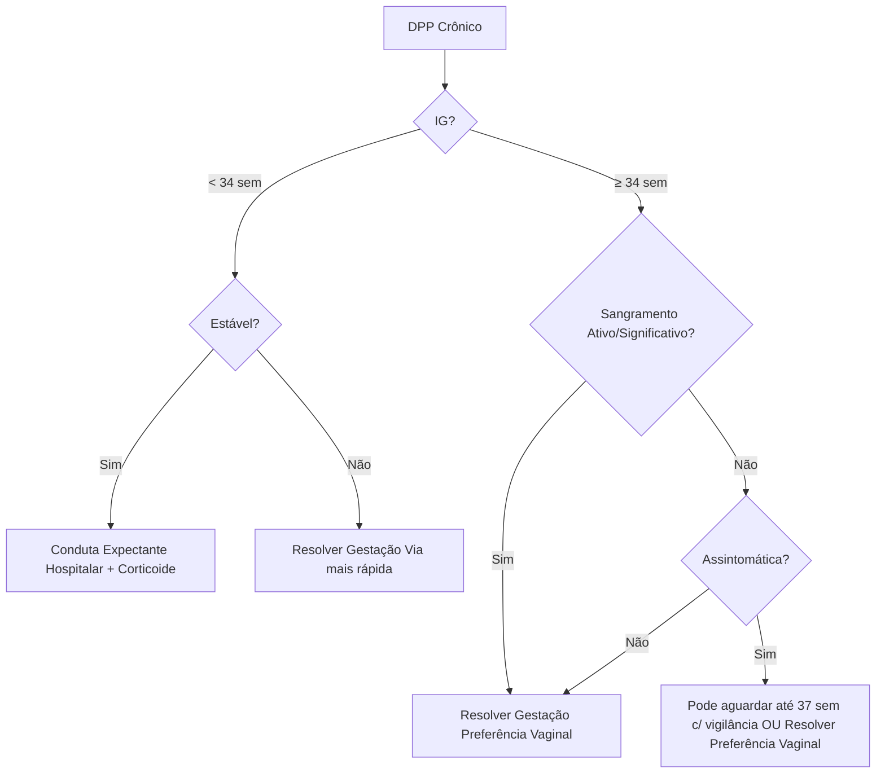
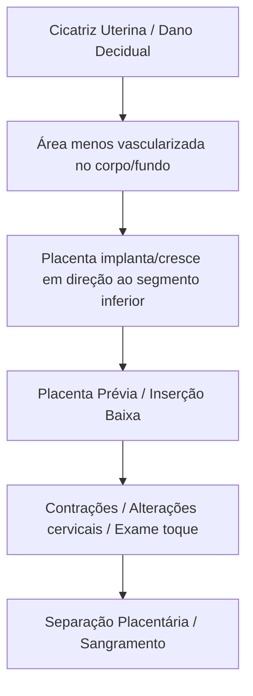

# Sangramento de Segunda Metade da Gestação

Este material aborda as principais causas de sangramento vaginal que ocorrem após a 20ª semana de gestação.

# 1.0 Descolamento Prematuro de Placenta (DPP)

## 1.1 Definição
- Separação da placenta, parcial ou total, de sua inserção normal no corpo uterino, **antes** do nascimento do feto.
- Ocorre em gestações com **20 semanas ou mais**.

## 1.2 Incidência
- Emergência obstétrica com morbimortalidade materna e perinatal significativa.
- Ocorrência: aproximadamente 2-10 a cada 1.000 nascimentos.
- Observa-se aumento da frequência nos últimos anos.

## 1.3 Fisiopatologia
- Origem: Sangramento dos **vasos maternos** na decídua basal, levando à separação entre decídua e placenta. Raramente é de origem fetal.
- **Tipo de Sangramento:**
    - **Arterial:**
        - Geralmente da artéria espiralada uterina.
        - Ocorre na área **central** da placenta.
        - Hemorragia de **alta pressão**, disseca a interface decídua-placenta.
        - Tende a causar separação **quase completa**.
        - Formação de **hematoma retroplacentário**.
        - Leva a complicações graves: sangramento extenso, descolamento extenso, Coagulação Intravascular Disseminada (CIVD).
    - **Venoso:**
        - Hemorragia de **baixa pressão**.
        - Ocorre na **periferia** da placenta.
        - Causa sangramento intermitente leve, descolamento **marginal pequeno** e autolimitado (DPP Crônico).
        - Pode levar a **oligoâmnio** e **Restrição de Crescimento Fetal (RCF)** por diminuição crônica do fluxo placentário.
- **Papel da Trombina:**
    - Sangramento e hipoxia tecidual -> Aumento do fator tecidual -> Aumento exagerado da produção de trombina.
    - Consequências do aumento de trombina:
        - **Hipertonia uterina e contrações:** Trombina é uterotônico direto e potente; reduz receptores de progesterona.
        - **Trabalho de parto e rotura de membranas:** Trombina causa necrose tecidual e degradação da matriz extracelular.
        - **Coagulação Intravascular Disseminada (CIVD):** Grande quantidade de trombina sobrecarrega a hemostasia materna.

| Característica         | Sangramento Arterial (DPP Agudo) | Sangramento Venoso (DPP Crônico) |
| :--------------------- | :------------------------------- | :------------------------------- |
| **Pressão**            | Alta                             | Baixa                            |
| **Localização**        | Centro da placenta               | Periferia da placenta            |
| **Extensão**           | Grande                           | Pequena                          |
| **Tipo de DPP**        | Agudo                            | Crônico                          |
| **Sangramento Clínico**| Grave, extenso                   | Intermitente, leve               |
| **Complicações Fetais**| Descolamento extenso, CIVD       | Oligoâmnio, RCF                  |

## 1.4 Etiologia
- **Processo Crônico de Doença Placentária (Maioria dos casos):**
    - Anormalidades no desenvolvimento inicial das artérias espiraladas -> necrose decidual, inflamação, infarto placentário -> rotura e sangramento vascular decidual (DPP).
    - Associado a: Distúrbios hipertensivos da gestação, RCF, trombofilias.
- **Eventos Mecânicos Repentinos (Minoria dos casos):**
    - Trauma abdominal.
    - Descompressão uterina rápida (ex: rotura de membranas em polidrâmnio, parto do primeiro gemelar).
    - Mecanismo: Estiramento/contração súbita da parede uterina -> cisalhamento entre placenta (inelástica) e útero -> DPP.
    - **Nota:** Após trauma abdominal, monitorizar a gestante por pelo menos 4 horas para afastar DPP.

## 1.5 Tipos de DPP

### 1.5.1 DPP Agudo
- Forma clássica e mais comum.
- Sangramento agudo, grave e extenso.
- Sintomas relacionados à intensidade do sangramento/descolamento.
- Frequente alteração da vitalidade fetal e materna.
- Emergência obstétrica com diagnóstico clínico.

### 1.5.2 DPP Crônico
- Ocorre em ~20% dos casos.
- Sangramento crônico e intermitente, geralmente iniciado no 2º trimestre.
- Sintomas frustros (leves, inespecíficos).
- Diagnóstico geralmente ultrassonográfico (hematoma retroplacentário).
- Associações: Oligoâmnio, RCF, pré-eclâmpsia, rotura prematura pré-termo de membranas (RPMT).

| Característica       | DPP Agudo                             | DPP Crônico                       |
| :------------------- | :------------------------------------ | :-------------------------------- |
| **Sangramento**      | Agudo, grave                          | Crônico, intermitente, leve       |
| **Descolamento**     | Extenso                               | Marginal                          |
| **Diagnóstico**      | Clínico                               | Ultrassonográfico                 |
| **Vitalidade**       | Alteração materna/fetal frequente     | Geralmente preservada (inicialmente) |
| **Complicações**     | Emergência, CIVD                      | Oligoâmnio, RCF, pré-eclâmpsia     |

## 1.6 Fatores de Risco
- **Principal fator:** História prévia de DPP (risco 10-15x maior).
- **Mais associados:** Distúrbios hipertensivos (Pré-eclâmpsia/Eclâmpsia, Hipertensão crônica) - risco ~5x maior.
- **Outros fatores importantes:**
    - Uso de drogas (Cocaína: vasoconstrição -> isquemia -> vasodilatação reflexa -> rotura vascular. ~10% das usuárias no 3º tri terão DPP).
    - Trauma abdominal.
    - Polidrâmnio / Gestação Múltipla (risco de descompressão abrupta).
    - Rotura Prematura de Membranas (RPM), especialmente com corioamnionite.
    - Restrição de Crescimento Fetal (RCF).
    - Tabagismo (risco 2,5x maior; fator modificável).
    - Anomalias uterinas (müllerianas, sinéquias, miomas - por decidualização inadequada).
    - Multiparidade e Idade materna avançada.
    - Cesárea anterior.
    - Trombofilias hereditárias.

| Fator de Risco                          |
| :-------------------------------------- |
| DPP prévia                              |
| Eclâmpsia/pré-eclâmpsia                 |
| Hipertensão arterial crônica            |
| Uso de drogas (Cocaína)                 |
| Trauma abdominal                        |
| Polidrâmnio                             |
| Rotura prematura de membranas           |
| Corioamnionite                          |
| Restrição de crescimento fetal          |
| Tabagismo                               |
| Anomalias uterinas                      |
| Multiparidade e idade maternal avançada |
| Gestação múltipla                       |
| Cesárea anterior                        |
| Trombofilias hereditárias              |
*Nota: Distúrbios hipertensivos são as patologias mais associadas ao DPP.*

## 1.7 Diagnóstico
- **Eminentemente Clínico!** "A clínica é soberana".
- **Sinais e Sintomas Clássicos:**
    - **Sangramento vaginal:** Abrupto, intensidade variável (leve a grave). Presente em ~80% dos casos. **Quantidade NÃO se correlaciona com gravidade** (sangue pode ficar retido - DPP oculto). Coloração geralmente escura ("vinho do porto").
    - **Dor abdominal:** Súbita, intensa.
    - **Hipersensibilidade/Dor à palpação uterina.**
    - **Hipertonia uterina ("útero lenhoso"):** Contração persistente, útero não relaxa entre contrações.
    - **Contrações uterinas / Taquissistolia.**
    - **Hipotensão materna, Taquicardia.**
    - **Alteração da Frequência Cardíaca Fetal (FCF):** Bradicardia, taquicardia persistente, padrão sinusoidal, desacelerações tardias (DIP II) - indicam sofrimento fetal agudo.
    - **Trabalho de parto prematuro.**
    - **Bolsa corioamniótica tensa** ao toque (se houver toque indicado).
- **Tríade Clássica:** Sangramento súbito + Dor abdominal + Hipertonia uterina.
- **Mnemônico:** **D**or = **DPP**.
- **Exames Complementares (Auxiliares, NÃO devem atrasar conduta):**
    - **Cardiotocografia (CTG):** Avalia vitalidade fetal. Alterações (bradicardia, taquicardia, sinusoidal, DIP II) reforçam suspeita e indicam gravidade.
    - **Ultrassonografia (USG):**
        - **NÃO é rotina** para diagnóstico de DPP agudo.
        - Realizar **apenas em casos duvidosos** ou para diagnóstico diferencial (ex: placenta prévia).
        - Pode mostrar **hematoma retroplacentário**, mas sua ausência **NÃO exclui** DPP grave (sangue pode não ter acumulado).
        - **Não deve atrasar a conduta** em caso de instabilidade materna ou fetal.
        - Pode ser útil no **DPP crônico**.
    - **Análise da Placenta (Anatomopatológico):** Identifica DPP em apenas ~30% dos casos. Ausência de achados não exclui o diagnóstico clínico.
- **DPP Crônico/Parcial:** Sangramento leve, sem contrações/hipertonia significativas. Sem coagulopatia ou alteração aguda da vitalidade fetal. Pode confundir com início de trabalho de parto. Associa-se a prematuridade, oligoâmnio, RCF.
- **Coagulopatia de Consumo (CIVD):** Ocorre em 10-20% dos DPP graves com óbito fetal. DPP é a causa mais comum de CIVD na gravidez.

## 1.8 Classificação do DPP
- **Classificação de Sher and Statland** (mais utilizada, baseada na severidade):
    - **Grau 0:** Assintomático. Diagnóstico retrospectivo pela análise da placenta após o parto (hematoma).
    - **Grau 1:** Sangramento discreto, sem hipertonia uterina, vitalidade fetal preservada, sem repercussão hemodinâmica materna, sem coagulopatia.
    - **Grau 2:** Sangramento moderado, hipertonia uterina presente, sinais de sofrimento fetal (alteração da FCF), pode haver taquicardia/hipotensão postural materna, queda nos níveis de fibrinogênio.
    - **Grau 3:** Sangramento importante, hipertonia uterina severa (útero lenhoso), óbito fetal, hipotensão materna/choque, coagulopatia (CIVD) instalada ou não.
        - **3A:** Sem CIVD instalada.
        - **3B:** Com CIVD instalada.

| Grau  | Sangramento | Hipertonia Uterina | Vitalidade Fetal       | Hemodinâmica Materna    | Coagulopatia         |
| :---- | :---------- | :----------------- | :--------------------- | :---------------------- | :------------------- |
| **0** | Ausente     | Não                | Preservada             | Normal                  | Não                  |
| **1** | Discreto    | Não                | Preservada             | Sem repercussão         | Não                  |
| **2** | Moderado    | Sim                | Sinais de sofrimento   | Taquicardia/Hipotensão postural | Queda fibrinogênio |
| **3** | Importante  | Sim (severa)       | Óbito fetal            | Hipotensão/Choque       | Instalada (3B) ou Não (3A) |

## 1.9 Diagnóstico Diferencial
- **Trabalho de Parto (TP):** Contrações regulares, progressivas, com dilatação cervical. Tônus uterino normal entre contrações. Sem hipertonia persistente. Sangramento geralmente discreto (muco com sangue).
- **Placenta Prévia (PP):** Sangramento **indolor**, vermelho-vivo, intermitente. Tônus uterino normal. Geralmente sem sofrimento fetal agudo (a menos que sangramento seja maciço). Diagnóstico por USG.
- **Rotura Uterina:** Dor abdominal súbita e intensa, seguida de **parada das contrações** e **subida da apresentação fetal**. Pode haver sangramento vaginal ou intra-abdominal. FCF alterada. Fator de risco principal: cicatriz uterina prévia.
- **Rotura de Vasa Prévia:** Sangramento vaginal **indolor** após **amniorrexe** (rotura das membranas). Sangramento de **origem fetal**, levando a comprometimento fetal **precoce e grave** sem repercussão materna inicial. Diagnóstico antenatal por USG Doppler.
- **Rotura de Seio Marginal:** Sangramento indolor, vermelho-vivo, contínuo, geralmente em pequena quantidade, associado a tônus normal e sem sofrimento fetal. Diagnóstico geralmente pós-parto (histopatológico).
- **Hematoma Subcoriônico:** Separação entre membranas fetais e parede uterina. Geralmente assintomático ou sangramento leve, **sem dor abdominal**. Ocorre mais frequentemente **antes de 20 semanas**.

| Condição                  | Sangramento                               | Dor Abdominal | Tônus Uterino | Vitalidade Fetal        | Outros                                     |
| :------------------------ | :---------------------------------------- | :------------ | :------------ | :---------------------- | :----------------------------------------- |
| **DPP**                   | Súbito, escuro, variável                  | Sim (súbita)  | Aumentado     | Alterada (frequente)    | Hipertonia, taquissistolia                 |
| **Placenta Prévia**       | Indolor, vermelho-vivo, intermitente      | Não           | Normal        | Geralmente preservada   | Diagnóstico USG, evitar toque              |
| **Rotura Uterina**        | Variável (vaginal/interno)                | Sim (súbita)  | Diminuído     | Alterada (grave)        | Parada contrações, subida apresentação     |
| **Rotura Vasa Prévia**    | Indolor, após amniorrexe, origem fetal    | Não           | Normal        | Alterada (precoce/grave)| Associado a vasa prévia (USG Doppler)      |
| **Rotura Seio Marginal**  | Indolor, vermelho-vivo, contínuo, pequeno | Não           | Normal        | Preservada              | Diagnóstico pós-parto                      |
| **Trabalho de Parto**     | Discreto (muco sanguinolento)             | Sim (cólicas) | Normal (relaxa)| Preservada              | Contrações regulares, dilatação cervical |
| **Hematoma Subcoriônico** | Leve ou ausente                           | Não           | Normal        | Preservada              | Geralmente < 20 semanas                  |

## 1.10 Complicações
- **Maternas:**
    - **Choque hipovolêmico.**
    - Necessidade de **transfusão sanguínea.**
    - **Insuficiência Renal Aguda (IRA):** Principalmente por **Necrose Cortical Aguda** (DPP é a principal causa obstétrica).
    - **Falência de múltiplos órgãos.**
    - **Hemorragia pós-parto (HPP):** Pode ser causada por atonia (incluindo Útero de Couvelaire).
    - **Histerectomia puerperal.**
    - **Coagulação Intravascular Disseminada (CIVD):** DPP é a principal causa obstétrica.
    - **Síndrome de Sheehan:** Hipopituitarismo pós-parto devido a necrose hipofisária por choque.
    - **Útero de Couvelaire:** Infiltração sanguínea no miométrio, útero arroxeado, com dificuldade de contração -> atonia -> HPP -> risco aumentado de histerectomia.
    - **Morte materna.**
- **Fetais:**
    - **Hipoxia fetal / Asfixia perinatal.**
    - **Prematuridade.**
    - **Baixo peso ao nascer.**
    - **Restrição de crescimento fetal (RCF)** (mais associada ao DPP crônico).
    - **Morte perinatal.**

| Complicações Maternas                          | Complicações Fetais           |
| :--------------------------------------------- | :---------------------------- |
| Transfusão sanguínea                           | Hipoxia fetal                 |
| Choque hipovolêmico                            | Prematuridade                 |
| Insuficiência renal aguda (Necrose cortical)   | Baixo peso ao nascer          |
| Falência de múltiplos órgãos                   | Restrição de crescimento fetal|
| Hemorragia pós-parto (incl. Útero Couvelaire)  | Morte perinatal               |
| Histerectomia puerperal                        |                               |
| CIVD                                           |                               |
| Síndrome de Sheehan                            |                               |
| Morte materna                                  |                               |
*DPP é a principal causa de CIVD e Necrose Cortical Renal Aguda em obstetrícia.*

## 1.11 Tratamento Clínico (Abordagem Inicial)
- **Internação Hospitalar Imediata.**
- **Monitorização Hemodinâmica Materna Contínua** (PA, FC, diurese).
- **Acesso Venoso Calibroso** (2 acessos se possível).
- **Administração de Cristaloides** para estabilização inicial.
- **Colher Exames:** Hemograma, Coagulograma (Fibrinogênio, TP, TTPA, Plaquetas), Creatinina, Tipagem Sanguínea (ABO/Rh) e prova cruzada.
- **Solicitar Reserva de Sangue** (Concentrado de hemácias, plasma fresco congelado, plaquetas).
- **Sondagem Vesical de Demora** para controle rigoroso da diurese.
- **Monitorização Fetal Contínua (CTG).**
- **Transferência para UTI** se instabilidade hemodinâmica.
- **Transfusão Sanguínea** se choque hipovolêmico (Hb < 7-8 g/dL ou instabilidade persistente).
- **Administração de Hemocomponentes** (Plasma, Plaquetas, Crioprecipitado) se coagulopatia (CIVD).

## 1.12 Conduta Obstétrica no DPP Agudo

### 1.12.1 Feto Vivo e Viável
- **Regra Geral: Resolução da gestação por Cesárea de Urgência.**
- **Amniotomia Imediata:** Realizar assim que possível (se houver dilatação) para:
    - Reduzir a pressão intra-amniótica.
    - Diminuir a entrada de tromboplastina e fatores de coagulação na circulação materna.
    - Acelerar o trabalho de parto (se for a via escolhida).
- **Parto Vaginal (Exceção):** Considerar **apenas se o parto for iminente** (fase expulsiva ou dilatação completa) E a mãe estiver estável E o feto tiver boa vitalidade (CTG tranquilizador). Monitorização fetal contínua é essencial. Pode-se abreviar o expulsivo com fórceps/vácuo extrator.
- **Nota:** A inibição do trabalho de parto (tocolíticos) é **contraindicada** no DPP agudo.

### 1.12.2 Feto Inviável ou Feto Morto
- **Se Gestante Estável:**
    - **Via de Parto Preferencial: Vaginal.** Menor morbidade materna que a cesárea.
    - **Amniotomia Imediata.**
    - **Indução/Condução com Ocitocina** se o trabalho de parto não estiver evoluindo adequadamente.
    - **Objetivo:** Parto dentro das primeiras **6 horas**.
- **Se Gestante Instável:**
    - **Interromper a gestação pela via mais rápida.** Geralmente é a **Cesárea de Urgência**, mesmo com feto morto, para controlar a hemorragia e estabilizar a mãe.

**Fluxograma Simplificado - DPP Agudo:**

+ TD

    A[DPP Agudo Suspeito] --> B{Feto Vivo/Viável?};
    B -- Sim --> C{Parto Iminente?};
    C -- Sim --> D[Parto Vaginal + Amniotomia];
    C -- Não --> E[Cesárea Urgente + Amniotomia];
    B -- Não (Morto/Inviável) --> F{Gestante Estável?};
    F -- Sim --> G[Parto Vaginal (Indução/Condução) + Amniotomia - Meta < 6h];
    F -- Não --> H[Cesárea Urgente (Via mais rápida)];
`

## 1.13 Conduta Obstétrica no DPP Crônico
- Conduta depende da idade gestacional (IG) e estabilidade materno-fetal.

### 1.13.1 Idade Gestacional < 34 Semanas
- **Se Feto e Gestante Estáveis** (sem sangramento ativo significativo, sem coagulopatia):
    - **Conduta Expectante:** Tentar prolongar a gestação para reduzir riscos da prematuridade.
    - **Internação Hospitalar:** Monitorização rigorosa materno-fetal (vitalidade fetal 2x/dia).
    - **Corticoterapia:** Para maturação pulmonar fetal.
    - **Atenção:** DPP crônico é imprevisível, pode agudizar rapidamente.

### 1.13.2 Idade Gestacional ≥ 34 Semanas
- **Regra Geral: Resolução da Gestação.** Benefícios de prolongar a gestação não superam os riscos maternos.
- **Via de Parto Preferencial: Vaginal.** Muitas vezes entram em trabalho de parto espontâneo.
- **Indução/Condução:** Amniotomia e ocitocina se necessário.
- **Expectante até 37 semanas?** Possível **se** o sangramento foi leve, parou, mãe e feto estão estáveis e assintomáticos.

**Fluxograma Simplificado - DPP Crônico:**

## 1.14 Recorrência
- Risco de recorrência em gestação futura é **10 vezes maior**.
- Orientar a paciente sobre o risco aumentado.
- Investigar causa base (hipertensão, trombofilia).
- Considerar rastreamento de trombofilias no pós-parto se causa não estabelecida.
- Pacientes com DPP têm risco aumentado de doenças cardiovasculares futuras.

## 1.15 Mapa Mental (Resumo Conceitual)
- **O que é?** Separação placenta > 20 sem, antes do parto.
- **Causa?** Sangramento vasos deciduais (geralmente maternos). Arterial (agudo, grave) ou Venoso (crônico, leve). Ligado a doença placentária crônica ou trauma/descompressão.
- **Fatores Risco?** DPP prévio, HAS/Pré-eclâmpsia, Cocaína, Trauma, RPM, Tabagismo, Cesárea prévia.
- **Diagnóstico?** CLÍNICO! Dor abdominal súbita + Sangramento escuro + Hipertonia uterina. USG auxiliar.
- **Classificação?** Sher & Statland (0-3).
- **Complicações?** Maternas (Choque, CIVD, IRA, Couvelaire, Histerectomia, Morte), Fetais (Hipoxia, Prematuridade, Morte).
- **Conduta Aguda?** Estabilizar mãe! Feto vivo/viável -> Cesárea urgente (exceto parto iminente). Feto morto/inviável -> Vaginal se mãe estável; Cesárea se instável. SEMPRE Amniotomia.
- **Conduta Crônica?** < 34 sem -> Expectante se estável + corticoide. ≥ 34 sem -> Resolver (preferência vaginal).

## 1.16 Resumindo (Pontos Chave)
- DPP é a separação prematura da placenta normalmente inserida (>20 sem).
- Sangramento é majoritariamente materno, da decídua basal.
- Maioria dos casos por doença placentária crônica (HAS, RCF, trombofilia). Minoria por trauma/descompressão.
- DPP agudo (clássico) vs. DPP crônico (insidioso).
- Fatores de risco principais: DPP prévio e distúrbios hipertensivos.
- Diagnóstico é clínico (Dor + Sangramento + Hipertonia). USG é auxiliar.
- Complicações graves: CIVD, Necrose Cortical Renal, Útero de Couvelaire, choque, óbito fetal/materno.
- Conduta no DPP agudo visa estabilização materna e resolução rápida (geralmente cesárea se feto vivo).
- Amniotomia é fundamental na conduta.

---

# 2.0 Placenta Prévia (PP)

## 2.1 Definição
- Presença de tecido placentário que atinge ou cobre o **orifício interno do colo uterino (OIC)**.
- Diagnóstico considerado a partir da **segunda metade da gestação** (> 20 semanas).
- Causa importante de sangramento vaginal no 2º e 3º trimestres.

## 2.2 Classificação
- **Terminologia Atual:**
    - **Placenta Prévia (PP):** A borda da placenta atinge ou cobre o OIC.
        - **PP Centro-Total (ou Completa):** Placenta cobre totalmente o OIC.
        - **PP Centro-Parcial (ou Parcial):** Placenta cobre parcialmente o OIC.
    - **Placenta de Inserção Baixa (PIB) / Low-lying Placenta:** A borda inferior da placenta está a **menos de 20 mm** do OIC, mas **não o atinge**.
        - *Termo "Placenta Prévia Marginal" foi abolido.*
    - **Placenta de Inserção Normal:** Borda placentária dista **mais de 20 mm** do OIC.
- **Nota Importante:** Antes de 20 semanas, usa-se o termo "inserção baixa" para qualquer placenta próxima ao OIC, devido à alta chance de "migração placentária" (crescimento diferencial do útero que afasta a placenta do OIC). O diagnóstico definitivo de PP é feito no 3º trimestre.

| Classificação Atual           | Descrição                                                       | Classificação Antiga (Abolida/Modificada) |
| :---------------------------- | :-------------------------------------------------------------- | :-------------------------------------- |
| **Placenta Prévia Total**     | Cobre totalmente o OIC                                          | Centro-Total                            |
| **Placenta Prévia Parcial**   | Cobre parcialmente o OIC                                        | Centro-Parcial                          |
| **Placenta de Inserção Baixa**| Borda a < 20 mm do OIC, sem cobrir                              | Marginal                                |
| **Inserção Normal**           | Borda a ≥ 20 mm do OIC                                          | -                                       |

## 2.3 Incidência
- Aproximadamente 4 para cada 1.000 nascimentos.
- Incidência tem aumentado devido ao maior número de cesáreas.

## 2.4 Etiopatogenia
- Patogênese exata desconhecida.
- **Principal Hipótese:** Cicatrizes na decídua (ex: cesárea, curetagem) -> área menos vascularizada -> placenta implanta/cresce preferencialmente em direção ao segmento inferior (mais vascularizado) em vez do fundo -> Conforme o segmento inferior se forma/modifica e o colo dilata (contrações, etc.) -> separação/sangramento placentário.

**Fluxo Simplificado - Etiopatogenia PP:**

## 2.5 Fatores de Risco
- **Principal Fator:** **Cesárea anterior.** O risco aumenta significativamente com o número de cesáreas (ex: 2 cesáreas + PP = ~40% risco de acretismo).
- **Outros Fatores Importantes:**
    - Placenta prévia anterior.
    - Gestação múltipla.
    - Procedimentos uterinos prévios (curetagem, miomectomia, histeroscopia cirúrgica).
    - Multiparidade.
    - Idade materna avançada (> 35 anos).
    - Tratamento para infertilidade (FIV).
    - Abortamento prévio.
    - Tabagismo (hipoxemia -> hipertrofia placentária compensatória -> maior área superficial).
    - Uso de drogas (Cocaína).
    - Placenta prévia anterior.

| Fator de Risco                   |
| :------------------------------- |
| Parto cesáreo anterior           |
| Placenta prévia anterior         |
| Gestação múltipla                |
| Procedimentos uterinos prévios   |
| Multiparidade                    |
| Idade materna avançada           |
| Tratamento para infertilidade    |
| Abortamento prévio               |
| Tabagismo                        |
| Uso de drogas                    |

## 2.6 Diagnóstico

### 2.6.1 Manifestações Clínicas
- **Sintoma Principal:** **Sangramento vaginal indolor, vermelho-vivo, de início súbito, autolimitado e intermitente.** Ocorre tipicamente no final do 2º ou no 3º trimestre.
- Pode ser desencadeado por contrações, toque vaginal, relação sexual.
- **Tônus uterino: Normal** (diferente do DPP).
- Útero geralmente indolor à palpação.
- Vitalidade fetal geralmente preservada, a menos que o sangramento seja maciço ou haja DPP associado.
- Apresentações fetais anômalas (pélvica, transversa) são mais comuns.
- **NÃO REALIZAR TOQUE VAGINAL** antes de excluir PP por USG!

### 2.6.2 Exames Subsidiários
- **Diagnóstico Padrão-Ouro: Ultrassonografia Transvaginal (USTV).**
    - Mais acurada que a USG transabdominal (menos falso-positivos/negativos).
    - Segura na placenta prévia.
    - Realizada para rastreio/diagnóstico:
        - USG morfológica de 2º trimestre pode levantar suspeita ("inserção baixa").
        - **USTV confirmatória no 3º trimestre (idealmente após 28 semanas, repetir ~32-34 sem se necessário).**
    - Mede a distância da borda placentária ao OIC.
- **USG Transabdominal (USTA):** Menos precisa, pode ser usada para rastreio inicial, mas a confirmação/exclusão deve ser com USTV. Bexiga cheia pode comprimir segmento inferior e simular PP.
- **Ressonância Magnética (RM):**
    - Utilizada em casos selecionados:
        - Dúvida diagnóstica na USG (placenta posterior, obesidade materna).
        - Suspeita de **Acretismo Placentário** (avalia profundidade da invasão).

## 2.7 Conduta

### 2.7.1 Pacientes Assintomáticas
- **Objetivos:** Confirmar diagnóstico, avaliar risco de acretismo, reduzir risco de sangramento, planejar parto.
- **Seguimento:** Pré-natal de alto risco.
- **Avaliação USG:**
    - Se suspeita no 2º tri, repetir USTV ~28 sem e ~32-34 sem.
    - Se ainda baixa (<20mm) ou prévia, repetir USTV ~36 sem para definir classificação final.
- **Orientações:**
    - **Evitar toque vaginal.**
    - **Evitar relação sexual.**
    - **Evitar exercícios físicos extenuantes.**
    - Orientar a procurar emergência se contrações ou sangramento.
- **Investigar Acretismo:** Se PP + cicatriz cesárea (ou outros fatores de risco), realizar USG Doppler e/ou RM.
- **Corticoterapia:** Administrar entre 24-34 semanas se risco de parto prematuro. Alguns protocolos indicam profilático 48h antes da cesárea eletiva se < 37 semanas.
- **Parto:**
    - **Placenta Prévia (cobre OIC): Cesárea Eletiva.**
        - **Timing:** Entre **36 semanas e 37 semanas e 6 dias.** Não ultrapassar 37 semanas idealmente.
    - **Placenta de Inserção Baixa:** Ver seção 2.8.
- **Preparativos para Cesárea:** Hospital com UTI (materna/neonatal), banco de sangue, equipe experiente (risco aumentado de hemorragia/acretismo). Reservar sangue.

### 2.7.2 Paciente com Sangramento Vaginal Agudo
- **Internação Hospitalar Imediata.**
- **Estabilização Materna:** Monitorização hemodinâmica, acesso venoso calibroso, cristaloides, exames (Hb, Ht, Coag, Tipagem), reservar/transfundir sangue conforme necessidade.
- **Monitorização Fetal Contínua (CTG).**
- **NÃO usar Tocolíticos.**
- **NÃO realizar toque vaginal.**
- **Administrar Imunoglobulina Anti-D:** Se mãe Rh negativo e Coombs indireto negativo.
- **Decisão sobre Parto:**
    - **Indicações de Cesárea de Emergência (qualquer IG):**
        - Sangramento grave/persistente com instabilidade materna.
        - Sofrimento fetal agudo (CTG não tranquilizador).
        - Trabalho de parto ativo.
    - **Se Sangramento Cessa e Mãe/Feto Estáveis:**
        - **IG < 34 semanas:** Conduta expectante hospitalar + Corticoterapia.
        - **IG ≥ 34 semanas:** Geralmente indica-se resolução (Cesárea), pois os riscos maternos de novo sangramento superam os benefícios fetais de aguardar.

## 2.8 Conduta na Placenta de Inserção Baixa (PIB)
- **Distância da Borda Placentária ao OIC (medida por USTV no termo):**
    - **> 20 mm:** Inserção normal, parto vaginal permitido.
    - **10-20 mm:** **Parto vaginal é possível (Trial of Labor - TOL)**, mas com risco aumentado de sangramento intraparto. Discutir riscos/benefícios com a paciente. Cesárea pode ser preferível.
    - **< 10 mm:** **Cesárea Eletiva recomendada.** Alto risco de sangramento no parto vaginal.

## 2.9 Diagnósticos Diferenciais
- Principalmente DPP. Outros: Rotura uterina, vasa prévia, rotura seio marginal, causas cervicais/vaginais (cervicite, pólipo, trauma, neoplasia - avaliar com exame especular).
- **Tabela Comparativa (DPP vs PP):**

| Característica     | DPP                                     | Placenta Prévia                           |
| :----------------- | :-------------------------------------- | :---------------------------------------- |
| **Sangramento**    | Súbito, **doloroso**, escuro, variável  | Súbito, **indolor**, vermelho-vivo, intermitente |
| **Tônus Uterino**  | **Aumentado (Hipertonia)**              | **Normal**                                |
| **Dor Palpação**   | **Presente**                            | **Ausente**                               |
| **Sofrimento Fetal**| Frequente                               | Raro (exceto se sangramento maciço)     |
| **CIVD**           | Possível (especialmente Grau 3)         | Raro (a menos que DPP associado)          |
| **Diagnóstico**    | **Clínico**                             | **Ultrassonográfico (USTV)**              |
| **Fator Risco PPAL**| DPP prévio, HAS                         | Cesárea prévia                            |
| **Conduta Imediata**| Estabilizar, Resolver Rápido (Cesárea*) | Estabilizar, Avaliar (Expectante ou Cesárea) |
*\* Via vaginal possível em casos selecionados de DPP.*

## 2.10 Complicações
- **Maternas:**
    - **Hemorragia** (pré, intra, pós-parto).
    - Necessidade de **transfusão.**
    - **Acretismo Placentário (PAS):** Risco muito aumentado, principal causa de histerectomia em PP.
    - **Histerectomia puerperal.**
    - Embolia amniótica.
    - Maior risco de DPP concomitante.
- **Perinatais:**
    - **Prematuridade** (devido a parto indicado por sangramento).
    - Baixo peso ao nascer.
    - **Apresentações anômalas** (pélvica, transversa).
    - Restrição de Crescimento Fetal (RCF).
    - Maior risco de anomalias congênitas (discutível).
    - Vasa prévia (risco aumentado).

## 2.11 Mapa Mental (Resumo Conceitual)
- **O que é?** Placenta cobre ou está perto (<20mm) do OIC > 20 sem.
- **Causa?** Implantação baixa, associada a cicatrizes uterinas.
- **Fatores Risco?** Cesárea prévia (principal), PP prévia, Múltiplos, Curetagem, Tabagismo.
- **Diagnóstico?** USG TRANSVAGINAL! Clínica: Sangramento INDOLOR, vermelho-vivo, intermitente. Tônus NORMAL. NÃO TOCAR!
- **Classificação?** Prévia (Total/Parcial) vs. Inserção Baixa (<20mm).
- **Complicações?** Hemorragia, Acretismo, Histerectomia, Prematuridade.
- **Conduta Assintomática:** Vigiar, programar Cesárea Eletiva (36-37 sem).
- **Conduta Sangramento Agudo:** Estabilizar! Cesárea Urgente se instável/sofrimento fetal/TP. Expectante se <34sem e estável.
- **Conduta Inserção Baixa:** <10mm -> Cesárea. 10-20mm -> TOL possível. >20mm -> Vaginal.

## 2.12 Resumindo (Pontos Chave)
- PP: placenta no/perto do OIC > 20 sem.
- Classificação: Prévia vs. Inserção Baixa (<20mm).
- Fator de risco principal: Cesárea prévia.
- Clínica: Sangramento indolor, vermelho-vivo, intermitente. Tônus normal.
- Diagnóstico: USG Transvaginal (padrão-ouro). Toque vaginal contraindicado.
- Conduta: Cesárea (eletiva ou urgente). Parto vaginal possível em Inserção Baixa 10-20mm.
- Principal complicação: Hemorragia e Acretismo placentário.

---

# 3.0 Acretismo Placentário (Placenta Accreta Spectrum - PAS)

## 3.1 Definição
- Termo geral para invasão trofoblástica anormal da placenta além da camada de Nitabuch (interface decídua-miométrio).
- Resulta na falha de separação da placenta do útero após o parto.

## 3.2 Classificação
- **Baseada na Profundidade da Invasão:**
    - **Placenta Acreta:** Vilosidades aderem diretamente ao miométrio (sem decídua basal interposta), mas **não invadem** o músculo. (FIGO Grau 1)
    - **Placenta Increta:** Vilosidades **invadem o miométrio**. (FIGO Grau 2)
    - **Placenta Percreta:** Vilosidades **penetram através de todo o miométrio**, atingindo a serosa uterina e/ou invadindo órgãos adjacentes (bexiga, reto). (FIGO Grau 3)
        - **FIGO 3a:** Limitada à serosa uterina.
        - **FIGO 3b:** Invasão da bexiga.
        - **FIGO 3c:** Invasão de outros tecidos/órgãos pélvicos.

| Tipo de Acretismo | Profundidade da Invasão                    | FIGO Grau |
| :---------------- | :----------------------------------------- | :-------- |
| **Acreta**        | Aderida ao miométrio (sem invasão)         | 1         |
| **Increta**       | Invade o miométrio                         | 2         |
| **Percreta**      | Atravessa miométrio +/- invasão órgãos     | 3         |

## 3.3 Prevalência
- Incidência crescente, paralela ao aumento das taxas de cesárea.
- Atualmente estimada em torno de 1 para 500-1000 partos, mas varia muito (referência do texto: 0.17% = 1.7/1000).

## 3.4 Etiopatogenia
- **Defeito na Decídua Basal:** Principalmente devido a dano/cicatriz no endométrio/miométrio (cesárea, curetagem).
- A ausência ou deficiência da camada de Nitabuch permite que as vilosidades coriônicas invadam anormalmente o miométrio.

## 3.5 Fatores de Risco
- **Fatores Mais Fortes:**
    - **Placenta Prévia** (especialmente se sobre cicatriz de cesárea).
    - **Cesárea Anterior** (risco aumenta exponencialmente com o número de cesáreas).
        - Ex: PP + 1 cesárea prévia = Risco de acretismo ~3-10%
        - Ex: PP + 3 cesáreas prévias = Risco de acretismo ~40-60%
- **Outros Fatores:**
    - Cirurgia uterina prévia (miomectomia, curetagem vigorosa).
    - Síndrome de Asherman.
    - Idade materna avançada (> 35 anos).
    - Multiparidade.
    - Fertilização in vitro (FIV).
    - Endometrite pós-parto prévia.

| Fator de Risco                          |
| :-------------------------------------- |
| **Placenta prévia**                     |
| **Parto cesáreo anterior**              |
| Procedimentos uterinos prévios          |
| Multiparidade, idade materna > 35 anos  |
| História de remoção manual da placenta  |
| História de endometrite pós-parto       |
| Tratamento de infertilidade (FIV)       |

## 3.6 Diagnóstico
- **Suspeita Clínica:** Baseada nos fatores de risco (PP + Cesárea prévia!).
- **Diagnóstico Antenatal (Ideal):**
    - **Ultrassonografia (USG) com Doppler:** Exame de escolha para rastreio e diagnóstico. Realizado por operador experiente.
        - **Achados Sugestivos:**
            - Perda/irregularidade da zona hipoecoica retroplacentária (interface miometrial).
            - Afinamento do miométrio (< 1 mm) sobre a placenta.
            - **Múltiplas lacunas vasculares placentárias** (irregulares, "queijo suíço").
            - Extensão do tecido placentário através da serosa uterina.
            - Interrupção/abaulamento da linha hiperecoica da parede da bexiga.
            - Vascularização aumentada na interface útero-bexiga (Doppler).
            - Turbulência do fluxo nos vasos lacunares.
    - **Ressonância Magnética (RM):** Exame complementar, útil para:
        - Avaliar placenta posterior.
        - Delimitar melhor a extensão da invasão (profundidade, invasão de órgãos adjacentes - bexiga).
        - Casos duvidosos na USG.
- **Diagnóstico Intraparto:** Ocorre quando há falha na separação e extração da placenta após o parto (retenção placentária) com hemorragia significativa ao tentar a remoção manual.

## 3.7 Conduta
- **Manejo Multidisciplinar em Centro Terciário:** Requer obstetra experiente, anestesista, urologista (se invasão de bexiga), radiologista intervencionista, equipe de banco de sangue, UTI.
- **Parto Programado:**
    - **Cesárea Eletiva Pré-Termo:** Entre **34 e 36 semanas** (idealmente 34 0/7 a 35 6/7), antes do início do trabalho de parto ou sangramento.
    - **Histerectomia Cesárea (Procedimento Padrão):** Realiza-se a cesárea com histerotomia fúndica (longe da placenta), extrai-se o bebê, fecha-se a histerotomia, e procede-se à **histerectomia total com a placenta deixada *in situ***.
- **Tratamento Conservador (Exceção):**
    - Deixar a placenta *in situ* sem histerectomia. Alto risco de hemorragia tardia, infecção, necessidade de histerectomia futura.
    - Considerado apenas em casos selecionados (desejo de fertilidade futura, acretismo focal) e em protocolos de pesquisa. Pode envolver uso de metotrexato (eficácia questionável).
    - Retirada focal da área acreta (risco altíssimo de hemorragia).
- **Se Diagnóstico Intraparto:** Estabilizar a paciente. Não forçar a retirada da placenta. Proceder à **histerectomia de emergência** com placenta *in situ*.

## 3.8 Complicações
- **Principal Complicação: Hemorragia Maciça Pós-Parto.**
    - Necessidade de transfusão maciça (>10 unidades de CH).
    - CIVD.
- **Lesão de Órgãos Adjacentes** (bexiga, ureter, intestino) durante a cirurgia.
- **Histerectomia** (muitas vezes necessária e planejada).
- Necessidade de UTI.
- Fístulas.
- Infecção/Sepse.
- Tromboembolismo.
- **Mortalidade Materna** (embora reduzida com manejo planejado, ainda é significativa).

## 3.9 Resumindo (Pontos Chave)
- PAS: Invasão placentária anormal no miométrio (acreta, increta, percreta).
- Fatores de risco chave: PP + Cesárea prévia.
- Diagnóstico antenatal por USG Doppler (+/- RM) é crucial.
- Manejo: Parto programado (cesárea 34-36 sem) + Histerectomia com placenta in situ, em centro terciário com equipe multi.
- Complicação principal: Hemorragia maciça.

---

# 4.0 Rotura Uterina

## 4.1 Definição
- **Rotura Uterina:** Solução de continuidade envolvendo **todas as camadas** da parede uterina (endométrio, miométrio e serosa) durante a gestação ou trabalho de parto.
- **Deiscência Uterina:** Separação incompleta da cicatriz uterina, com a **serosa permanecendo íntegra**. Geralmente assintomática e achado incidental.

## 4.2 Incidência
- Evento raro em útero sem cicatriz (< 0.1%).
- Risco aumentado em útero com cicatriz, especialmente durante **Trabalho de Parto Após Cesárea (TOLAC)**.
    - 1 cesárea prévia (segmentar transversa): ~0.3-0.7%.
    - 2 ou mais cesáreas prévias: ~1-1.6%.
    - Cicatriz clássica/vertical/T: Risco muito maior (4-9%), TOLAC contraindicado.

## 4.3 Fatores de Risco
- **Principal Fator: Cicatriz Uterina Prévia.**
    - Tipo de cicatriz (Clássica/Vertical > Segmentar Transversa).
    - Número de cesáreas prévias.
    - Miomectomia prévia (especialmente se entrou na cavidade).
    - Cirurgia uterina prévia (correção de anomalia, histeroscopia).
    - História de rotura uterina anterior (TOLAC contraindicado).
- **Fatores Associados ao Trabalho de Parto:**
    - **TOLAC.**
    - **Indução/Aumento do Trabalho de Parto:** Especialmente com Prostaglandinas (Misoprostol é contraindicado em útero com cicatriz; Ocitocina usar com cautela).
    - Trabalho de parto obstruído / Desproporção Cefalopélvica (DCP).
    - Parto prolongado (especialmente período expulsivo).
- **Outros Fatores:**
    - Multiparidade (grande multiparidade).
    - Macrossomia fetal.
    - Anomalias uterinas congênitas.
    - Trauma abdominal.
    - Versão cefálica externa (rara).
    - Uso de fórceps/vácuo extrator (especialmente rotações difíceis).
    - Manobra de Kristeller (contraindicada).
    - Idade gestacional > 40 semanas.
    - Adenomiose.

| Fator de Risco                                     |
| :------------------------------------------------- |
| **Cicatriz uterina prévia (Cesárea, Miomectomia)** |
| **Trabalho de Parto Após Cesárea (TOLAC)**          |
| História de rotura uterina prévia                  |
| Indução/Aumento do TP (esp. Prostaglandinas)       |
| Tipo de cicatriz (Clássica/Vertical)               |
| Número de cesáreas prévias (>1)                    |
| Trabalho de parto obstruído / DCP                  |
| Macrossomia fetal                                  |
| Multiparidade                                      |
| Idade gestacional > 40 semanas                     |
| Trauma abdominal                                   |
| Anomalias uterinas                                 |

## 4.4 Predição de Rotura Uterina
- Não existe método preditivo confiável.
- **Medida da Espessura do Segmento Uterino Inferior (SUI) por USG:**
    - Alguns estudos sugerem que SUI < 2-2.5 mm no final da gestação está associado a maior risco de rotura/deiscência durante TOLAC.
    - Não é rotina e seu valor preditivo é limitado.

## 4.5 Diagnóstico
- **Diagnóstico eminentemente clínico.** Suspeita durante trabalho de parto ou pós-parto.
- **Sinal Mais Comum e Confiável:** **Alteração Súbita da Frequência Cardíaca Fetal (FCF):** Bradicardia fetal profunda e prolongada, desacelerações variáveis severas ou tardias persistentes, perda de variabilidade. Presente em >70% dos casos. **É o primeiro sinal em muitos casos.**
- **Outros Sinais e Sintomas:**
    - **Dor abdominal súbita e intensa:** Pode ser localizada na cicatriz ou difusa. A dor pode **diminuir temporariamente** após a rotura completa.
    - **Parada súbita das contrações uterinas.**
    - **Perda da apresentação fetal:** Subida da cabeça fetal ou partes fetais que se tornam facilmente palpáveis sob a parede abdominal. (Sinal de Reasens).
    - **Sangramento vaginal:** Pode ser leve ou ausente se a hemorragia for intra-abdominal.
    - **Sinais de choque materno:** Taquicardia, hipotensão, palidez (podem ser tardios).
    - **Hematúria** (se lesão vesical associada).
    - Alteração do contorno uterino.
- **Sinais de Iminência de Rotura (raros, clássicos):**
    - **Sinal de Bandl:** Anel de contração patológico visível/palpável entre o corpo uterino (contraído) e o segmento inferior (distendido e fino).
    - **Sinal de Frommel:** Palpação dos ligamentos redondos retesados e desviados para frente.
- **Sinais de Sangramento Intra-abdominal (se houver):**
    - Sinal de Laffont: Dor referida no ombro (irritação do nervo frênico).
    - Sinal de Cullen: Equimose periumbilical.
    - Sinal de Clark: Enfisema subcutâneo (raro).
- **Tríade Clássica (Dor + Sangramento + Alteração FCF):** Presente em apenas ~10% dos casos.

| Sinais e Sintomas de Rotura Uterina                 |
| :-------------------------------------------------- |
| **Alteração súbita/grave da FCF (Mais comum!)**     |
| Dor abdominal súbita e intensa (pode aliviar após)  |
| Parada das contrações                               |
| Perda/Subida da apresentação fetal                  |
| Sangramento vaginal (variável)                      |
| Choque materno (hipotensão, taquicardia)            |
| Palpação fácil de partes fetais                     |
| Hematúria                                           |
| Sinal de Bandl / Frommel (iminência)              |
| Sinais de hemorragia interna (Laffont, Cullen)      |

## 4.6 Conduta
- **Emergência Obstétrica!**
- **Medidas Gerais:**
    - Pedir ajuda (equipe multidisciplinar).
    - Estabilização hemodinâmica materna: Acesso venoso calibroso, fluidos, preparar para transfusão maciça.
    - Oxigênio.
- **Conduta Obstétrica:**
    - **Laparotomia de Emergência Imediata:** Para nascimento do feto e controle da hemorragia.
- **Conduta Cirúrgica:**
    - **Reparo da Rotura (Histerorrafia):** Possível se a rotura for linear, não extensa, sem comprometimento vascular importante e a paciente desejar fertilidade futura.
    - **Histerectomia:** Indicada se:
        - Rotura extensa ou complexa.
        - Impossibilidade de reparo adequado.
        - Hemorragia incontrolável após reparo.
        - Paciente com prole completa.
- **Avaliar bexiga e outras estruturas pélvicas.**

## 4.7 Complicações
- **Maternas:**
    - Hemorragia maciça, choque hipovolêmico.
    - Necessidade de transfusão sanguínea.
    - **Histerectomia.**
    - Lesão de bexiga, ureter, intestino.
    - Infecção.
    - Tromboembolismo.
    - Fístulas.
    - Morte materna (rara em países desenvolvidos, mas possível).
- **Fetais/Neonatais:**
    - Asfixia perinatal / Encefalopatia Hipóxico-Isquêmica (EHI).
    - Acidose metabólica grave.
    - Necessidade de reanimação neonatal avançada.
    - **Morte perinatal:** Risco elevado (5-26%), **dependente do tempo entre diagnóstico e parto** (prognóstico piora significativamente após 10-20 minutos).

## 4.8 Mapa Mental (Resumo Conceitual)
- **O que é?** Ruptura completa parede uterina.
- **Causa?** Cicatriz prévia (principal) + estresse (TP, indução).
- **Fatores Risco?** Cesárea/cirurgia prévia, TOLAC, Indução (Miso proibido!), DCP.
- **Diagnóstico?** CLÍNICO! Sinal + Comum: Bradicardia fetal súbita/grave. Outros: Dor, parada contração, subida feto, choque.
- **Complicações?** Maternas (Hemorragia, Histerectomia, Morte), Fetais (Asfixia, Morte - tempo-dependente!).
- **Conduta?** EMERGÊNCIA! Laparotomia IMEDIATA + Parto + Reparo ou Histerectomia. Estabilizar mãe.

## 4.9 Resumindo (Pontos Chave)
- Rotura uterina: ruptura completa da parede. Deiscência: incompleta (serosa íntegra).
- Principal fator de risco: cicatriz uterina prévia, especialmente durante TOLAC.
- Sinal mais confiável: alteração súbita e grave da FCF.
- Diagnóstico é clínico e exige alto índice de suspeita.
- Conduta é laparotomia de emergência para parto e reparo/histerectomia.
- Complicações maternas e fetais graves, incluindo morte, são possíveis. Prognóstico fetal depende do tempo para o parto.

---

# 5.0 Rotura de Vasa Prévia

## 5.1 Definição
- **Vasa Prévia:** Presença de vasos sanguíneos fetais (umbilicais) desprotegidos pela Geleia de Wharton ou tecido placentário, que cursam dentro das membranas amnióticas passando sobre ou muito próximo (< 2cm) do orifício interno do colo (OIC).
    - Associada a: **Inserção Velamentosa do Cordão** (vasos inserem nas membranas antes de atingir a placenta) ou **Placenta Sucenturiada/Bilobada** (vasos conectando os lobos passam sobre o OIC).
- **Rotura de Vasa Prévia:** Laceração desses vasos fetais desprotegidos, tipicamente ocorrendo durante a **rotura das membranas** (espontânea ou artificial - amniorrexe).

## 5.2 Fatores de Risco (para Vasa Prévia)
- Placenta de inserção baixa / Placenta prévia (mesmo que tenha "migrado").
- Inserção velamentosa do cordão.
- Placenta sucenturiada ou bilobada.
- Gestação múltipla.
- Fertilização in vitro (FIV).

## 5.3 Diagnóstico
- **Diagnóstico Antenatal (Ideal):**
    - **Ultrassonografia Transvaginal (USTV) com Doppler Colorido:** Método de escolha. Permite visualizar os vasos fetais cruzando sobre o OIC.
    - Rastreio direcionado a pacientes com fatores de risco.
- **Diagnóstico Intraparto (Tríade Clássica):**
    1.  **Rotura das Membranas (Amniorrexe).**
    2.  **Sangramento vaginal indolor** (início agudo logo após amniorrexe).
    3.  **Alteração Súbita e Grave da FCF:** Bradicardia fetal, padrão sinusoidal, taquicardia seguida de bradicardia, ou óbito fetal.
    - **Origem do Sangramento:** **FETAL.** Volume sanguíneo fetal é pequeno, então mesmo sangramentos "pequenos" para a mãe são catastróficos para o feto (exsanguinação rápida).
- **Testes para confirmar origem fetal do sangue (raramente usados na prática pela urgência):**
    - Teste de Apt (resistência à desnaturação alcalina da hemoglobina fetal).
    - Citometria de fluxo.

## 5.4 Conduta
- **Se Diagnóstico Antenatal de Vasa Prévia:**
    - Acompanhamento pré-natal de alto risco.
    - **Corticoterapia** para maturação pulmonar (geralmente entre 28-32 semanas).
    - **Internação Hospitalar** no 3º trimestre (geralmente a partir de 30-34 semanas) para vigilância fetal rigorosa.
    - **Parto por Cesárea Eletiva:**
        - **Timing:** Entre **34 e 37 semanas.** Decisão individualizada, balanceando risco de prematuridade vs. risco de rotura das membranas e exsanguinação fetal. A maioria recomenda entre 34-35 semanas.
    - **Evitar toque vaginal e relação sexual.**
- **Se Diagnóstico Intraparto (Rotura de Vasa Prévia):**
    - **Cesárea de Emergência Imediata!** Tempo é crucial para a sobrevida fetal.
    - Notificar equipe de neonatologia imediatamente (preparar para reanimação avançada, possível necessidade de transfusão no RN).
    - Clampeamento rápido do cordão umbilical.

## 5.5 Mapa Mental (Resumo Conceitual)
- **O que é?** Vasos fetais desprotegidos sobre OIC (Vasa Prévia). Rotura ocorre c/ amniorrexe.
- **Causa?** Inserção velamentosa, lobo sucenturiado.
- **Fatores Risco?** PP/PIB, Múltiplos, FIV.
- **Diagnóstico?** Antenatal (Ideal): USG Doppler. Intraparto: Amniorrexe + Sangramento Indolor + Sofrimento Fetal Agudo/Grave. Sangue FETAL!
- **Complicações?** Exsanguinação fetal, óbito fetal (alta mortalidade se não diagnosticado antenatalmente).
- **Conduta Antenatal:** Corticoide, Internar, Cesárea Eletiva 34-37 sem.
- **Conduta Intraparto:** Cesárea de EMERGÊNCIA IMEDIATA!

---

# 6.0 Rotura de Seio Marginal
- **Definição:** Ruptura de um dos seios venosos localizados na margem da placenta (zona de troca materno-fetal).
- **Clínica:**
    - Sangramento vaginal **indolor**, geralmente **vermelho-vivo**, **contínuo**, e em **pequena a moderada quantidade**.
    - Ocorre tipicamente no **final da gestação** ou **durante o trabalho de parto**.
    - **Tônus uterino normal.**
    - **Vitalidade fetal preservada.**
    - Sem repercussões hemodinâmicas maternas significativas.
- **Diagnóstico:**
    - Principalmente de **exclusão** (após afastar PP, DPP, vasa prévia).
    - Confirmação geralmente **histopatológica** da placenta após o parto.
- **Conduta:**
    - Geralmente **expectante** com monitorização materno-fetal.
    - Não costuma requerer intervenção específica para o parto, a menos que o sangramento se torne excessivo ou haja outra indicação obstétrica.

---

# 7.0 Embolia de Líquido Amniótico (ELA)

## 7.1 Etiopatogenia
- Entrada de líquido amniótico (contendo células fetais, lanugo, mecônio, etc.) na circulação materna através de lacerações/lesões no endotélio vascular uterino ou cervical.
- Desencadeia uma **resposta inflamatória sistêmica complexa (semelhante à anafilaxia/sepse):**
    - Liberação de mediadores vasoativos -> Vasoespasmo pulmonar agudo -> Hipertensão pulmonar -> Falência ventricular direita.
    - Lesão endotelial pulmonar -> Edema pulmonar não cardiogênico -> Hipoxemia grave.
    - Depressão miocárdica -> Choque cardiogênico / Colapso cardiovascular.
    - Ativação maciça da cascata de coagulação -> **Coagulação Intravascular Disseminada (CIVD)** -> Hemorragia.

## 7.2 Fatores de Risco
- Não são bem definidos ou fortemente preditivos, mas associações descritas incluem:
    - Idade materna avançada.
    - Multiparidade.
    - Trabalho de parto rápido ou tumultuado.
    - Indução do trabalho de parto (especialmente com altas doses de ocitocina).
    - Cesárea / Parto vaginal operatório (fórceps/vácuo).
    - Placenta prévia / Acretismo placentário.
    - Descolamento prematuro de placenta (DPP).
    - Rotura uterina.
    - Lacerações cervicais.
    - Pré-eclâmpsia / Eclâmpsia.
    - Polidrâmnio.
    - Morte fetal intrauterina.

## 7.3 Diagnóstico
- **Diagnóstico CLÍNICO e DE EXCLUSÃO.** Não há teste laboratorial específico.
- **Suspeita:** Colapso súbito e inexplicado durante o trabalho de parto, parto ou nos primeiros 30 minutos pós-parto.
- **Manifestações Clínicas Típicas (Início Súbito):**
    1.  **Comprometimento Respiratório Grave:** Dispneia, taquipneia, cianose, hipoxemia (SatO2 < 90%), edema agudo de pulmão, parada respiratória.
    2.  **Colapso Cardiovascular:** Hipotensão súbita e profunda, taquicardia/arritmias, choque cardiogênico, parada cardíaca.
    3.  **Coagulopatia (CIVD):** Sangramento maciço e difuso (local de inserção IV, incisão cirúrgica, sítio placentário, TGI), geralmente após o colapso inicial. Laboratório mostra plaquetopenia, fibrinogênio baixo, d-dímero alto, TP/TTPA alargados.
- **Outros Sinais/Sintomas Possíveis:**
    - Alteração do estado mental (agitação, confusão, sensação de morte iminente).
    - Convulsões.
    - Calafrios, náuseas, vômitos.
    - Sofrimento fetal agudo (se ocorrer antes do parto).
- **Tríade Clássica:** Hipotensão + Hipoxemia + Coagulopatia.

## 7.4 Conduta
- **Emergência Médica / Obstétrica Extrema!** Requer resposta rápida e coordenada de equipe multidisciplinar (Obstetrícia, Anestesia, UTI, Hematologia).
- **Suporte Avançado de Vida (ACLS/SAV):**
    - **A (Airway):** Garantir via aérea pérvia (intubação orotraqueal precoce).
    - **B (Breathing):** Ventilação com alta concentração de oxigênio (100%).
    - **C (Circulation):**
        - **RCP de alta qualidade** se parada cardíaca (com deslocamento uterino para esquerda se > 20 sem). Cesárea perimortem se > 4 min sem RCE.
        - Monitorização hemodinâmica invasiva.
        - Reposição volêmica agressiva (cristaloides, coloides).
        - Uso de vasopressores/inotrópicos (noradrenalina, dobutamina).
    - **D (Delivery):** Se a paciente ainda estiver grávida, realizar **parto de emergência (cesárea)** para aliviar compressão aortocaval e melhorar a ressuscitação materna (e potencialmente salvar o feto).
    - **E (Everything Else / Hemorrhage/Coagulopathy):**
        - **Protocolo de Transfusão Maciça:** Administrar hemocomponentes na proporção balanceada (ex: 1 CH: 1 PFC: 1 Plaqueta).
        - Administrar Crioprecipitado (rico em fibrinogênio).
        - Ácido tranexâmico.
        - Fator VIIa recombinante (em casos refratários).
        - Controle de sangramento cirúrgico (se aplicável).
- **Tratamentos Específicos (Controversos/Experimentais):** Inibidores de C1 esterase, plasmaférese, ECMO (Oxigenação por Membrana Extracorpórea).

## 7.5 Prognóstico
- **Extremamente grave.**
- **Alta Mortalidade Materna:** Varia de 10% a 90% (melhorando com reconhecimento precoce e suporte agressivo, mas ainda alta, ~20-40%).
- **Alta Morbidade Materna:** Sobreviventes frequentemente têm sequelas neurológicas permanentes devido à hipoxia.
- **Alta Mortalidade/Morbidade Perinatal:** Se o evento ocorre antes do parto.

## 7.6 Resumindo (Pontos Chave)
- ELA: Emergência rara por entrada de líquido amniótico na circulação materna.
- Patogênese: Resposta inflamatória/anafilactoide -> Colapso CV, Insuficiência Respiratória, CIVD.
- Diagnóstico: Clínico, de exclusão. Início súbito (hipotensão, hipoxemia, coagulopatia).
- Conduta: Suporte avançado de vida agressivo (ABCDE), RCP, ventilação, suporte hemodinâmico, transfusão maciça, parto de emergência.
- Prognóstico: Péssimo, alta mortalidade e morbidade materna/fetal.
