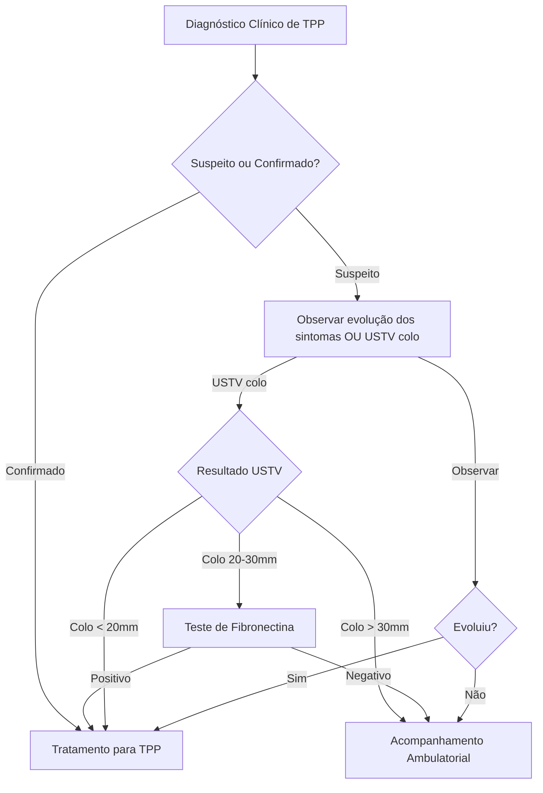
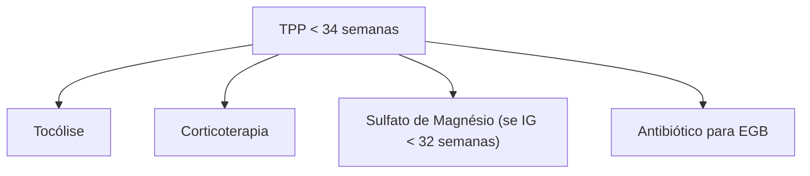

# Obstetrícia: Prematuridade e Trabalho de Parto Prematuro

---

# 1.0 DEFINIÇÃO DE PARTO PREMATURO

*   **Parto Prematuro (PP):** É aquele que ocorre **antes de 37 semanas completas de gestação** (< 259 dias).
    *   A contagem da idade gestacional (IG) inicia-se no primeiro dia da Data da Última Menstruação (DUM).
    *   **Cálculo da Idade Gestacional (Exemplo):**
        *   DUM: 14/05/2020
        *   Data do Cálculo: 24/07/2020
        *   Dias em Maio (após DUM): 31 - 14 = 17 dias
        *   Dias em Junho: 30 dias
        *   Dias em Julho (até data do cálculo): 24 dias
        *   Total de dias: 17 + 30 + 24 = 71 dias
        *   Idade Gestacional: 71 dias / 7 = 10 semanas e 1 dia.
*   **Limite Inferior:** Considera-se parto prematuro a partir de **20 ou 22 semanas completas**.
    *   Antes desse período, o desfecho da gestação é considerado **abortamento**.

---

# 2.0 CLASSIFICAÇÃO DA PREMATURIDADE

A prematuridade pode ser classificada de duas formas principais:

1.  **Quanto à Causa:**
    *   **Prematuridade Espontânea (70-80% dos casos):**
        *   **Trabalho de Parto Prematuro (TPP):** Corresponde a 40-50% dos casos de prematuridade espontânea.
        *   **Rotura Prematura Pré-termo de Membranas (RPM pré-termo):** Corresponde a 20-30% dos casos.
        *   **Insuficiência Istmo Cervical (IIC):** Corresponde a uma pequena porcentagem (< 1%) dos casos.
    *   **Prematuridade Eletiva (ou Terapêutica) (20-30% dos casos):**
        *   Refere-se à gestação interrompida precocemente por **indicação médica** devido a complicações maternas ou fetais.
        *   **Principal Causa:** Distúrbios hipertensivos da gestação.

2.  **Quanto à Idade Gestacional (IG):**
    *   **Prematuridade Precoce:** Nascimento antes de 34 semanas completas.
    *   **Prematuridade Tardia:** Nascimento a partir de 34 semanas completas.
    *   **Classificação da Organização Mundial da Saúde (OMS):**

| Classificação OMS     | Idade Gestacional       | Incidência Aproximada |
| :-------------------- | :---------------------- | :-------------------- |
| Prematuro Extremo     | < 28 semanas            | ~6%                   |
| Muito Prematuro     | 28 - 31 sem e 6/7     | ~10%                  |
| Prematuro Moderado    | 32 - 33 sem e 6/7     | ~13%                  |
| Prematuro Tardio      | 34 - 36 sem e 6/7     | ~70%                  |
*A prematuridade tardia corresponde a 70% de todos os nascimentos prematuros.*

*   **Outras Classificações de Termo:**
    *   **Termo Precoce:** Nascimentos entre 37 e 38 semanas e 6/7 dias. Apresentam maior morbidade relacionada à prematuridade do que os nascimentos a termo completo.
    *   **Termo Completo:** 39 a 40 semanas e 6/7 dias.
    *   **Termo Tardio:** 41 a 41 semanas e 6/7 dias.
    *   **Pós-termo:** A partir de 42 semanas.

---

# 3.0 INCIDÊNCIA DA PREMATURIDADE

*   **Brasil:**
    *   Incidência gira em torno de **11% dos nascidos vivos**.
    *   É o **10º país do mundo** com maior taxa de prematuridade.
    *   Observou-se um aumento das taxas entre 2010 (6,2/100 NV) e 2019 (11,02/100 NV).
    *   Taxas semelhantes entre as diversas regiões do Brasil.
    *   Uma das principais causas do aumento: **grande crescimento do número de cesáreas** (setor público e privado).
*   **Distribuição por Idade Gestacional:**
    *   A maioria dos recém-nascidos prematuros tem IG entre **32 e 36 6/7 semanas** (aproximadamente 85,76%).
    *   Menos de 22 semanas: ~0,47%
    *   De 22 a 27 6/7 semanas: ~4,61%
    *   De 28 a 31 6/7 semanas: ~9,16%
*   **Impacto:**
    *   Responsável por **75% de toda a morbimortalidade neonatal**.
    *   Principal causa de internação em UTI neonatal.
    *   Principal causa de mortalidade infantil nos primeiros 5 anos de vida.

---

# 4.0 PATOGÊNESE DO TRABALHO DE PARTO PREMATURO

Quatro principais fatores estão envolvidos no desencadeamento do TPP:

1.  **Ativação Prematura do Eixo Hipotalâmico-Pituitário-Adrenal (HPA) Materno ou Fetal:**
    *   Relacionado ao estresse materno (psicológico, físico) ou distensão uterina.
    *   Estresse materno leva ao aumento prematuro de cortisol e estrogênio, ativando precocemente o eixo HPA.
2.  **Resposta Inflamatória Exagerada:**
    *   Causada por infecção (ex: corioamnionite, infecções subclínicas) e microbioma do trato genital alterado.
    *   Bactérias produzem endotoxinas, que levam à produção exagerada de citocinas e consequente resposta inflamatória, desencadeando o TPP.
    *   Vias de acesso da infecção aos tecidos intrauterinos:
        *   Transplacentária (infecções sistêmicas maternas).
        *   Fluxo retrógrado (infecções da cavidade peritoneal para tubas uterinas).
        *   Ascendente (infecções da vagina e colo uterino para cavidade uterina - mais comum).
3.  **Hemorragia Decidual:**
    *   Ocorre em situações como descolamento prematuro de placenta (DPP) e inserção baixa de placenta.
    *   Pode desencadear TPP por estimulação da parede miometrial e produção de trombina.
4.  **Distensão Uterina Patológica:**
    *   Causada principalmente por polidrâmnio e gemelaridade.
    *   Leva à ativação de proteínas envolvidas com a contração uterina.
    *   Pode também ativar prematuramente o eixo HPA.

*   **Inter-relação:** Estes fatores estão frequentemente interligados na fisiopatologia do TPP.

---

# 5.0 FATORES DE RISCO PARA PREMATURIDADE

Diversos fatores podem aumentar o risco de prematuridade, classificados como para prematuridade espontânea ou eletiva.

| Prematuridade Espontânea                                  | Prematuridade Eletiva                    |
| :-------------------------------------------------------- | :--------------------------------------- |
| **Prematuridade anterior (principal)**                    | **Distúrbios hipertensivos**             |
| Rotura prematura de membranas                             | Restrição de crescimento fetal (RCF)     |
| **Infecção geniturinária** (vaginose, cistite, bacteriúria assintomática, pielonefrite) | Sofrimento fetal                         |
| Doença periodontal                                        | Placenta prévia                          |
| Aborto tardio anterior e morte fetal anterior             | Descolamento prematuro de placenta (DPP) |
| Gestação múltipla e polidrâmnio                           | Iatrogênica (interrupção por indicação médica) |
| Malformações uterinas e cirurgias no colo uterino         |                                          |
| Tabagismo, etilismo e uso de drogas ilícitas              |                                          |
| Grande multiparidade e intervalo interpartal curto (<18-24 meses) |                                          |
| Extremos de idade materna (<15 anos ou > 40 anos)         |                                          |
| Estado socioeconômico adverso e ausência de pré-natal     |                                          |
| Estresse materno, desnutrição, obesidade                  |                                          |
| Baixo peso pré-gestacional                                |                                          |
| História de RPM pré-termo                                 |                                          |
| Sangramento no primeiro trimestre                         |                                          |
| Tratamento de reprodução assistida                        |                                          |
| **Etiologia Infecciosa Detalhada:**                       |                                          |
| *   Bactérias comuns: Estreptococos do grupo B, *Chlamydia trachomatis*, *Gardnerella vaginalis*, *Neisseria gonorrhoeae*, *Trichomonas vaginalis*, *Ureaplasma*, *Haemophilus influenzae*, *Treponema pallidum*. |                                          |
| *   Vaginose bacteriana: associada também a abortamento espontâneo, RPM pré-termo e corioamnionite. |                                          |

*   **Histórico Prévio de Parto Prematuro:** Aumenta em **25%** a chance de um novo parto pré-termo, geralmente ocorrendo na mesma idade gestacional.

---

# 6.0 PREDIÇÃO E PREVENÇÃO DE PREMATURIDADE

Medidas cruciais para tentar diminuir as taxas de prematuridade e mortalidade infantil.

## 6.1 TRIAGEM INFECCIOSA

*   **Urocultura:**
    *   Realizar em **todas as gestantes** na primeira rotina de exames do pré-natal para pesquisa de bacteriúria assintomática.
    *   Tratar com antibioticoterapia se positivo para diminuir risco de pielonefrite e, consequentemente, prematuridade.
*   **Cultura de Secreção Vaginal (Triagem de Rotina):**
    *   **Não há consenso** sobre sua eficácia em diminuir o risco de prematuridade.
    *   Não é indicada rotineiramente nos protocolos de pré-natal brasileiros.
    *   Mulheres com sinais e sintomas de infecção genital devem ser tratadas.

## 6.2 MEDIDA DO COLO UTERINO

*   **Ultrassonografia Transvaginal (USTV) para Medida do Colo Uterino:**
    *   **Universal:** Preconizada para todas as gestantes entre **19 e 24 semanas**, idealmente junto ao ultrassom morfológico do segundo trimestre.
    *   **Gestantes com História Pregressa de Parto Prematuro:** Avaliação seriada do colo uterino, com início mais precoce (por volta de 16 semanas).
*   **Colo Curto:**
    *   Ponto de corte varia na literatura (15 a 25 mm).
    *   **Ministério da Saúde (MS): ≤ 25 mm** é considerado colo curto.
    *   Se colo curto: suplementação com progesterona, acompanhamento ambulatorial a cada 2-3 semanas (avaliação de contrações, infecção genital, nova medida do colo).
*   **Outros Marcadores Ultrassonográficos (associados ao PP, não usados isoladamente):**
    *   **Ausência do Eco Glandular Endocervical (EGE):** EGE é uma área hiperecoica ao redor do canal cervical. Sua ausência ocorre em IG avançada e TPP.
    *   **Presença de *Sludge* Cervical:** Aglomerado de partículas hiperecoicas entre o orifício interno do colo e a apresentação fetal. Pode estar relacionado à colonização bacteriana ou sangramento coriodecidual. Não há evidências de que antibiótico reduza o risco de prematuridade nestes casos.

## 6.3 PROGESTERONA VAGINAL

*   **Progesterona Micronizada por Via Vaginal:**
    *   Reduz o risco de parto prematuro e morbidade neonatal em aproximadamente **30%** em:
        *   Mulheres com gestação única e história prévia de parto prematuro espontâneo.
        *   Mulheres sem fatores de risco que apresentam colo curto à USTV de rotina.
*   **Indicações (uso entre 16 e 36 6/7 semanas):**
    1.  **História pregressa de parto prematuro ou perda gestacional > 16 semanas.**
    2.  **Medida do colo uterino ≤ 25 mm** entre 16-24 semanas.
    *   Dose: 100 a 400 mg/dia.
*   **Outras Indicações:**
    *   Após TPP inibido (uso profilático).
*   **Situações onde NÃO há comprovação científica de benefício:**
    *   Gestação gemelar sem história prévia de prematuridade e com colo normal.
    *   Após cerclagem uterina.
*   **Caproato de 17-alfa-hidroxiprogesterona intramuscular:** Também eficaz, mas não disponível no Brasil.

**Fluxograma Resumido para Uso de Progesterona Vaginal:**

*   **Triagem Universal com USTV (19-24 semanas):**
    *   Se Colo Uterino ≤ 25mm → Iniciar Progesterona vaginal (até 34 - 36 6/7 semanas).
*   **Gestante com Risco de Prematuridade Espontânea (ex: história de PP):**
    *   Realizar USTV seriada (16-24 semanas).
    *   Se Colo Uterino ≤ 25mm → Manter/Iniciar Progesterona vaginal OU considerar cerclagem uterina.

## 6.4 FIBRONECTINA

*   **Fibronectina Fetal (fFN):** Glicoproteína de alto peso molecular produzida pelo trofoblasto.
    *   Normalmente encontrada nos fluidos cervicovaginais até 20 semanas.
    *   **Utilidade:** Presente na vagina **após 20-24 semanas**, pode predizer risco de PP em mulheres assintomáticas com história prévia de prematuridade.
*   **Realização do Teste:**
    *   Coleta de secreção cervicovaginal no fundo de saco de Douglas (cotonete).
    *   **Condições para Coleta (entre 20 e 36 semanas):**
        *   Bolsa íntegra.
        *   Dilatação < 3 cm.
        *   Ausência de sangramento genital.
        *   Ausência de relação sexual nas últimas 24 horas.
        *   Não realizar toque vaginal, coletas de esfregaços ou uso de lubrificantes antes (aumenta falso-positivo e falso-negativo).
*   **Interpretação:**
    *   **Rotura Prematura de Membranas (RPM):** Teste de fFN será positivo (sem valor preditivo nestes casos).
    *   **Teste Negativo:** Elevado valor preditivo negativo (VPN) – risco de parto nos próximos 7-14 dias é muito pequeno.
    *   **Teste Positivo:** Prediz parto prematuro em apenas 50% das vezes (baixo VPP).
*   **Efetividade:**
    *   Em população de risco, efetividade equivalente à medida do colo uterino via vaginal para predizer prematuridade.
    *   Não útil para predizer risco em gestantes sem história de prematuridade e assintomáticas.

## 6.5 CERCLAGEM UTERINA

*   **Cerclagem Eletiva (Profilática):**
    *   Indicada para gestantes com história prévia de **insuficiência istmocervical (IIC)**:
        *   Perda gestacional no segundo trimestre.
        *   Parto prematuro extremo.
        *   Dilatação cervical indolor no segundo trimestre com cerclagem de emergência anterior.
    *   Gestantes com história prévia de trauma ou cirurgia cervical.
*   **Cerclagem de Emergência (ou Terapêutica):**
    *   Indicada se a gestante apresentar dilatação cervical pouco dolorosa no segundo trimestre.
*   **Outras Indicações (algumas instituições):**
    *   História prévia de parto prematuro espontâneo < 34 semanas **associada à** gestação atual com colo uterino medindo < 25 mm antes de 24 semanas na USTV.

## 6.6 PESSÁRIO CERVICAL

*   Dispositivo colocado na vagina para:
    *   Mudar o ângulo do colo em relação ao corpo uterino.
    *   Promover o fechamento do orifício interno do colo uterino.
*   Algumas instituições (ex: UNIFESP) propõem seu uso diante do diagnóstico de colo curto.
*   Estudos **não mostraram vantagens** na utilização do pessário em relação ao uso de progesterona.
*   Sua utilização ainda é bastante limitada.

## 6.7 OUTRAS MEDIDAS DE PREVENÇÃO

*   **Exercícios Físicos:**
    *   Evitar excessivos.
    *   Leves e moderados (caminhadas, hidroginástica, Pilates) **não aumentam** o risco.
*   **Hábitos:**
    *   Cessar tabagismo, etilismo e uso de drogas ilícitas.
*   **Repouso Absoluto:**
    *   **Não está indicado** para gestantes com risco aumentado para prematuridade.
    *   Não há evidências de benefício.
    *   Aumenta riscos maternos (ex: tromboembolismo venoso).

---

# 7.0 COMPLICAÇÕES DA PREMATURIDADE

*   **Principais Complicações Neonatais Imediatas:**
    *   Síndrome da Membrana Hialina (ou Doença da Membrana Hialina - DMH).
    *   Hemorragia intraventricular.
    *   Enterocolite necrosante.
    *   Sepse neonatal.
*   **Frequência:**
    *   Mais frequentes **antes de 32 semanas**.
    *   Ainda mais importantes **abaixo de 28 semanas** (prematuros extremos).
    *   Estudos: 1 a cada 4 prematuros extremos vai a óbito antes da alta hospitalar.
*   **Morbidade a Longo Prazo:**
    *   Elevada morbidade em sobreviventes.
    *   Distúrbios respiratórios e neurológicos importantes.
    *   Desenvolvimento infantil comprometido:
        *   Alterações nas funções cognitiva, visual e auditiva.
    *   Um terço dos prematuros apresenta algum tipo de sequela neurológica.

---

# 8.0 DIAGNÓSTICO DO TRABALHO DE PARTO PREMATURO (TPP)

## 8.1 AVALIAÇÃO CLÍNICA

*   O diagnóstico de TPP é, na maioria das vezes, **clínico**.
*   Baseia-se na presença de **contrações uterinas regulares associadas à mudança na dilatação ou no esvaecimento cervical**.
*   Menos de 10% das pacientes com diagnóstico clínico de TPP terão o parto nos próximos 7 dias.
*   **TPP Estabelecido/Confirmado:** Considera-se quando a gestante tem:
    1.  Contrações regulares (ex: ≥ 2 contrações em 10 minutos).
    2.  Dilatação cervical de, pelo menos, **3 cm**.
    3.  Idade gestacional < 37 semanas.
*   **Variabilidade na Definição:** Alguns serviços consideram dilatação de 1-2 cm; outros incluem esvaecimento e posição do colo.
*   **Mais Importante:** Avaliar a **progressão** das alterações cervicais para um diagnóstico fidedigno.
*   **Suspeita de TPP com Dúvida Diagnóstica:**
    *   Pode-se realizar USTV para medida do colo ou teste de fibronectina.
    *   Se exames indisponíveis: observar a gestante por **4-6 horas** para avaliar evolução das contrações e mudanças cervicais.
        *   Sem mudança no quadro: pode ser encaminhada para acompanhamento ambulatorial.

## 8.2 AVALIAÇÃO ULTRASSONOGRÁFICA

*   USTV com medida do colo uterino pode ser útil no diagnóstico de TPP quando a clínica é duvidosa.
*   **Interpretação em Casos de Suspeita Clínica de TPP:**
    *   Colo uterino medindo **≤ 15-20 mm**: considera-se que a gestante está em TPP.
    *   Colo uterino medindo **> 30 mm**: < 2% de chance de parto nos próximos 7 dias; encaminhar para acompanhamento ambulatorial.
    *   Colo uterino medindo entre **20 e 30 mm**: realizar teste de fibronectina.
        *   Teste positivo: tratar como TPP.
        *   Teste negativo: encaminhar para acompanhamento ambulatorial.

## 8.3 AVALIAÇÃO LABORATORIAL

*   **Fibronectina Fetal Cervicovaginal (fFN):**
    *   Pode ajudar no diagnóstico de TPP **antes de 34 semanas** quando a clínica é duvidosa.
    *   Marcador útil para predizer o risco de parto prematuro nos próximos **7 a 14 dias**.
    *   **Mulheres com:** contrações uterinas, pouca dilatação cervical (< 3 cm), membrana íntegra, sem sangramento vaginal importante:
        *   **Teste fFN positivo:** Maior risco de parto prematuro nos próximos 7 dias.
        *   **Teste fFN negativo:** Improvável que o parto ocorra nas próximas 2 semanas; alta para acompanhamento ambulatorial.
*   **Combinação de fFN + USTV do Colo:** Aumenta o valor preditivo positivo do diagnóstico de TPP.

**Fluxograma Diagnóstico de TPP (resumido):**

*   **Classificação de Hobel (usada em alguns serviços, ex: FMUSP):**
    *   **Estágio I:** Presença de fatores de risco (medidas preventivas).
    *   **Estágio II:** Útero irritável.
    *   **Estágio III:** Trabalho de parto prematuro reversível (contrações uterinas com alterações cervicais; tocólise indicada).
    *   **Estágio IV:** Trabalho de parto prematuro irreversível (não se indica mais tocólise, apenas assistência ao parto).

---

# 9.0 TRATAMENTO DO TRABALHO DE PARTO PREMATURO (TPP)

*   **Objetivo:** Diminuir os riscos da prematuridade para o feto.
*   **Medidas Iniciais (independente da IG):**
    *   Hospitalização.
    *   Repouso no leito.
    *   Avaliação da vitalidade fetal (cardiotocografia - CTG - em fetos viáveis).
    *   Avaliação das contrações uterinas.
    *   Ultrassonografia obstétrica: confirmar apresentação fetal, avaliar volume do líquido amniótico e peso fetal (se disponível).
*   A conduta subsequente dependerá da idade gestacional.

## 9.1 ABAIXO DE 34 SEMANAS

*   **Principais Medidas Terapêuticas:**
    1.  **Corticoterapia:** Para maturação pulmonar fetal.
    2.  **Antibioticoprofilaxia:** Para estreptococo do grupo B (EGB).
    3.  **Sulfato de Magnésio:** Para neuroproteção fetal (geralmente < 32 semanas).
    4.  **Tocólise:** Administrada com o objetivo de retardar o parto para permitir a administração e o efeito das outras medicações.

**Fluxograma Tratamento TPP < 34 semanas:**

### 9.1.1 TOCÓLISE

*   **Objetivo:** Inibir o trabalho de parto prematuro, retardando o parto em **até 48 horas**.
    *   Permite tempo hábil para administrar corticoide e sulfato de magnésio.
    *   Permite transporte da gestante a um centro de referência, se necessário.
*   **Indicação:** Somente para gestantes cujos fetos se beneficiam dessas intervenções (maturação pulmonar, neuroproteção).
*   **Terapia de Manutenção (> 48h):** **Não está indicada**. É ineficaz em prevenir o parto prematuro e melhorar os parâmetros neonatais.
*   **Critérios para Indicação de Tocólise:**
    *   Trabalho de parto prematuro entre **24 a 34 semanas**.
    *   Membranas íntegras.
    *   Dilatação cervical até **4 cm a 5 cm** (varia conforme o serviço).
*   **Contraindicações para Tocólise:**
    *   Idade gestacional < 24 semanas ou ≥ 34 semanas.
    *   Rotura prematura pré-termo de membranas (RPM-PT).
    *   Óbito fetal ou malformação fetal letal.
    *   Sinais de corioamnionite.
    *   Suspeita de descolamento prematuro de placenta (DPP).
    *   Placenta prévia com sangramento ativo.
    *   Restrição de crescimento fetal (RCF) grave.
    *   Doenças maternas graves descompensadas (ex: pré-eclâmpsia grave, eclâmpsia).
*   **Principais Tocolíticos e suas Características:**

| Tocolítico                                | Mecanismo de Ação                                     | Principais Efeitos Colaterais Maternos                                                                    | Principais Efeitos Colaterais Fetais/Neonatais                                                 | Contraindicações Específicas                                                                   | Observações                                                                                                                               |
| :---------------------------------------- | :---------------------------------------------------- | :-------------------------------------------------------------------------------------------------------- | :--------------------------------------------------------------------------------------------- | :--------------------------------------------------------------------------------------------- | :---------------------------------------------------------------------------------------------------------------------------------------- |
| **Nifedipina** (Bloqueador Canal Cálcio)  | Inibe entrada de cálcio na célula miometrial        | Rubor facial, náuseas, cefaleia, hipotensão.                                                              | -                                                                                              | Cardiopatias, hipotensão severa. Cuidado com uso concomitante com Sulfato de Magnésio (risco de bloqueio neuromuscular). | Mais usada (baixo custo, fácil administração oral). Uso *off-label*. Monitorar PA e FC.                                                     |
| **Atosiban** (Antagonista Ocitocina)      | Compete com receptores de ocitocina no miométrio      | Náuseas, cefaleia, vômitos, tontura, taquicardia, hipotensão (leves).                                        | -                                                                                              | Hipersensibilidade ao atosiban.                                                                  | Escolha na Europa e FMUSP (efetivo, poucos efeitos colaterais). Custo elevado.                                                              |
| **Terbutalina** (Beta-adrenérgico)        | Ativa receptores beta-2, relaxando músculo uterino      | Taquicardia, hipotensão, tremor, palpitação, desconforto torácico, edema pulmonar, hipocalemia, hiperglicemia. | Taquicardia, hiperinsulinismo, hipoglicemia, hipocalemia, hipotensão.                            | Doenças cardíacas maternas, diabetes descontrolado, hipertireoidismo.                            | Menos utilizada devido aos efeitos colaterais. Requer monitorização materna e fetal rigorosa. Uso EV.                                         |
| **Indometacina** (Inibidor Síntese PG)    | Inibe enzima prostaglandina sintetase                  | Náuseas, vômitos, sangramento GI.                                                                           | Fechamento precoce do ducto arterioso, oligoâmnio, hipertensão pulmonar, enterocolite necrosante. | >32 semanas de IG, oligoâmnio, RCF, úlcera péptica, asma, disfunção renal/hepática, plaquetopenia. | Usar com cautela, geralmente por curto período e antes de 32 semanas. Pode ser útil em polidrâmnio.                                        |
| **Sulfato de Magnésio**                   | Compete com cálcio nos canais                         | Rubor, calor, letargia, depressão respiratória (toxicidade).                                                | Hipotonia, sonolência.                                                                           | Miastenia gravis, bloqueio cardíaco, disfunção renal grave.                                        | Efeito tocolítico fraco. Uso como tocolítico primário desestimulado. Principal uso é para neuroproteção fetal.                             |

*   **Doses Comuns (Referência):**
	*   *Nifedipina:* Ataque: 10mg VO a cada 20min (3 doses). Manutenção: 20mg VO a cada 6-8h (máx 48h).
	*   *Atosiban:* Ataque: 6,75mg (0,9ml) EV em bolus (1 min). Manutenção: Infusão 18mg/h (24ml/h) por 3h, seguida de 6mg/h (8ml/h) por até 45h.
	*   *Terbutalina:* Infusão EV contínua, ajuste de dose (ex: 5 ampolas em 500ml SG5%, iniciar 30ml/h, aumentar progressivamente).
	*   *Indometacina:* Ataque: 100mg via retal. Manutenção: 25mg VO a cada 6h (máx 48h).

### 9.1.2 CORTICOIDE

*   **Principal Conduta** em gestantes com risco de parto prematuro nos próximos 7 dias (TPP, RPM pré-termo, parto prematuro eletivo).
*   **Benefícios:** Reduz significativamente os riscos de:
    *   Síndrome Respiratória do Recém-Nascido (Síndrome da Angústia Respiratória - SAR).
    *   Hemorragia intracraniana.
    *   Enterocolite necrosante.
    *   Morte neonatal.
*   **Mecanismo de Ação:**
    *   Acelera o desenvolvimento dos pneumócitos tipo I e II.
    *   Induz os pneumócitos tipo II a produzir surfactante.
    *   Melhora a absorção do fluido pulmonar após o nascimento.
    *   Promove mudanças bioquímicas e estruturais, melhorando a mecânica pulmonar.
*   **Drogas e Doses:**
    *   **Betametasona:** 12 mg intramuscular (IM) a cada 24 horas, total de 2 doses (24 mg). (Preferível por menor número de aplicações).
    *   **Dexametasona:** 6 mg IM a cada 12 horas, total de 4 doses (24 mg). (Mesma eficácia).
*   **Tempo de Ação:**
    *   Efeito inicia nas primeiras horas.
    *   Ação completa ocorre **24 horas após o término do ciclo** (ou seja, 48 horas após a primeira aplicação).
    *   Administrar mesmo que não haja tempo hábil para o ciclo completo.
*   **Indicações de Idade Gestacional:**
    *   **Entre 24 e 33 6/7 semanas:** Um único ciclo é recomendado para gestantes com risco de parto prematuro nos próximos 7 dias.
        *   **Repetir o ciclo:** Somente se transcorridos mais de 14 dias do ciclo anterior E a gestante ainda estiver com < 34 semanas.
    *   **Entre 34 e 36 6/7 semanas ("Late Preterm"):** Um único ciclo pode ser considerado se houver TPP, RPM pré-termo ou parto prematuro eletivo, pois diminuiu o risco de desconforto respiratório do RN.
        *   Esta conduta não é unânime em todos os protocolos (ex: FMUSP e UFRJ podem não indicar rotineiramente).
*   **Contraindicações ao Uso de Corticoide:**
    *   Infecção materna ativa grave (ex: sepse).
    *   Corioamnionite.
    *   Diabetes mellitus descompensada.
    *   Úlcera péptica ativa.

### 9.1.3 SULFATO DE MAGNÉSIO (Neuroproteção Fetal)

*   **Indicação:** Para neuroproteção fetal na **iminência de parto prematuro** (com ou sem rotura de membranas).
    *   Reduz a severidade e os riscos de paralisia cerebral.
*   **Idade Gestacional para Uso:** Entre **24 semanas e 31 semanas e 6 dias** para gestantes em:
    *   Trabalho de parto prematuro estabelecido.
    *   Parto prematuro eletivo programado para as próximas 24 horas.
    *   (Alguns protocolos estendem até 32 semanas completas).
*   **Dose:**
    *   Ataque: 4g endovenoso (EV) em bólus de 15-20 minutos.
    *   Manutenção: Infusão EV de 1g/hora até o nascimento ou por 24 horas.
*   **Efeitos Colaterais Maternos:** Náuseas, vômitos, cefaleia, rubor facial.
*   **Intoxicação por Magnésio:** Depressão respiratória (monitorizar reflexos patelares, frequência respiratória, diurese). Antídoto: Gluconato de Cálcio.
*   **Contraindicações:**
    *   Miastenia gravis.
    *   Cardiopatias (especialmente bloqueios de condução).
    *   Comprometimento da função renal.
    *   Uso concomitante com betamiméticos ou bloqueadores do canal de cálcio (aumenta risco de hipocalcemia, hipotensão, parada respiratória).
*   **Observação:** Alguns serviços (ex: FMUSP) não orientam rotineiramente a administração de sulfato de magnésio para neuroproteção fetal.

### 9.1.4 ANTIBIOTICOPROFILAXIA (Para Estreptococo do Grupo B - EGB)

*   **Triagem:** Na internação por TPP, colher cultura de secreção vaginal e anal para EGB. Se disponível, pesquisa endocervical de clamídia, gonorreia, micoplasma e ureaplasma.
*   **Indicação da Profilaxia Intraparto:**
    *   Para **todas as gestantes em TPP** com cultura positiva para EGB.
    *   Para **todas as gestantes em TPP** com cultura desconhecida.
    *   Objetivo: Prevenção da sepse neonatal precoce por EGB.
*   **Esquema de Primeira Escolha:**
    *   **Penicilina G Cristalina:**
        *   Dose de ataque: 5 milhões UI EV.
        *   Dose de manutenção: 2,5 milhões UI EV a cada 4 horas até o parto.
        *   Idealmente, a primeira dose deve ser administrada pelo menos 4 horas antes do parto.
*   **Alternativa:**
    *   **Ampicilina:** 2g EV de ataque, seguido de 1g EV a cada 4 horas até o parto (alguns protocolos citam 2g a cada 6h).
*   **Alergia à Penicilina:**
    *   Clindamicina EV (se EGB sensível).
    *   Vancomicina EV (se EGB resistente à clindamicina ou sensibilidade desconhecida).

## 9.2 ACIMA DE 34 SEMANAS

*   **Características:** A prematuridade acima de 34 semanas apresenta morbimortalidade perinatal baixa.
*   **Tocólise:** **Não está indicada**, pois os riscos do uso de tocolíticos superam os benefícios de adiar a prematuridade nesta faixa de IG.
*   **Antibioticoprofilaxia Intraparto para EGB:**
    *   **Mantém-se a indicação** (penicilina cristalina) para todas as gestantes em TPP, independentemente da idade gestacional, se cultura positiva ou desconhecida.
*   **Corticoterapia (entre 34 e 36 6/7 semanas):**
    *   Mostrou redução do risco de desconforto respiratório do recém-nascido.
    *   Seu uso **deve ser considerado** nos casos de TPP em algumas instituições, mesmo que não haja tempo hábil para realizar o ciclo completo.

**Resumo da Conduta por Faixa de IG em TPP:**

| Conduta                     | TPP < 34 semanas                 | TPP ≥ 34 semanas (até 36 6/7)    |
| :-------------------------- | :------------------------------- | :------------------------------- |
| Tocólise                    | Sim                              | Não                              |
| Corticoterapia              | Sim                              | Considerar                       |
| Sulfato de Magnésio         | Sim (se IG < 32 semanas)         | Não                              |
| Antibioticoprofilaxia (EGB) | Sim (cultura positiva/desconh.)  | Sim (cultura positiva/desconh.)  |

## 9.3 AVALIAÇÃO DA MATURIDADE PULMONAR

*   Importante na conduta obstétrica dos partos **pré-termos eletivos** e nos **termos precoces antes de 39 semanas**.
*   Testes pesquisam componentes do **surfactante pulmonar** no líquido amniótico (coletado por amniocentese).
*   **Principais Testes de Maturidade Pulmonar:**

| Teste                                                                   | Observações                                                                                                 |
| :---------------------------------------------------------------------- | :---------------------------------------------------------------------------------------------------------- |
| **Relação Lecitina/Esfingomielina (L/E)**                               | Considerado padrão-ouro por muitos. L/E ≥ 2 indica maturidade. Aumenta com a IG.                              |
| **Teste de Clements (Shake Test ou Teste de Espuma)**                     | Mais utilizado na prática. Baseia-se na formação de bolhas estáveis com etanol. Anel de bolhas = maturidade. |
| **Identificação do Fosfatidilglicerol (PG)**                              | Vantagem: não é afetado por sangue, mecônio. Presença indica maturidade.                                    |
| Perfil Pulmonar (Identificação % Fosfatidilcolina, PG, Fosfatidilinositol) | Análise mais completa.                                                                                      |
| Pesquisa de Corpos Lamelares                                              | Método mais fácil, rápido e barato que L/E.                                                                 |
| Relação Surfactante/Albumina                                              | -                                                                                                           |

## 9.4 TRATAMENTO NÃO FARMACOLÓGICO (em TPP)

*   **Repouso e Hidratação Vigorosa:**
    *   Comumente recomendados, mas **não há evidência científica robusta** para sua prescrição.
    *   Podem aumentar os riscos maternos de complicações (ex: tromboembolismo venoso com repouso absoluto prolongado).

## 9.5 ASSISTÊNCIA AO PARTO PREMATURO

*   Requer mais cuidados que o parto a termo, devido aos maiores riscos de distocia, sofrimento fetal e tocotraumatismo.

### 9.5.1 MONITORIZAÇÃO FETAL

*   Deve ser feita de **forma contínua** no TPP.
*   Feto prematuro tem menor tolerância às contrações e maior risco de asfixia perinatal.
*   **Cardiotocografia (CTG):**
    *   Elevado valor preditivo positivo para asfixia neonatal no feto a termo; efeito incerto no pré-termo.
    *   **Características da CTG no Pré-termo Extremo:** Menor variabilidade da FCF, linha de base mais alta, quedas fisiológicas da FCF.
    *   **CTG Categoria III:** Deve ser considerada alterada mesmo em fetos prematuros.

### 9.5.2 VIA DE PARTO

*   Tema controverso.
*   **Apresentação Cefálica:**
    *   **Via vaginal é recomendada**, independentemente do peso ou da idade gestacional, desde que:
        *   O trabalho de parto seja espontâneo.
        *   As condições materno-fetais sejam boas.
*   **Apresentação Pélvica:**
    *   Via vaginal traz mais riscos de complicações (traumatismos fetais, prolapso de cordão) do que na apresentação cefálica.
    *   Feto prematuro: cabeça fetal maior que o tronco, dificultando desprendimento.
    *   **Preferência pela cesárea** nos casos de fetos prematuros em apresentação pélvica.
*   **Limiar de Viabilidade (entre 23 e 25 semanas):**
    *   Dá-se preferência para o **parto vaginal**, mesmo em indicações comuns de cesárea (ex: apresentação pélvica, FCF não tranquilizadora).
    *   Justificativa: sobrevida fetal muito pequena nessas idades gestacionais, evitando-se uma cirurgia materna com poucos benefícios fetais potenciais.

---

# GESTAÇÃO MÚLTIPLA

## INTRODUÇÃO
- Gestações múltiplas são tema de extrema importância e crescente cobrança em provas de Residência Médica.
- Gemelaridade está associada a altas taxas de complicações maternas e fetais.
- Principais tópicos abordados em provas:
    - Determinação de zigosidade e corionicidade (37%)
    - Complicações das gestações múltiplas (27%)
    - Assistência ao parto gemelar (22%)
    - Prevalência e epidemiologia (11%)
    - Tipos de gestações múltiplas (5%)

# 1.0 DEFINIÇÃO
- Gestações múltiplas são aquelas que originam dois ou mais embriões.
- Podem advir de um ou mais zigotos, dependendo do número de óvulos fecundados.
    - **Dizigótica:** Dois óvulos fecundados por dois espermatozoides diferentes.
    - **Monozigótica:** Um óvulo fecundado por um espermatozoide, com divisão posterior do zigoto.

# 2.0 PREVALÊNCIA E EPIDEMIOLOGIA
- Correspondem a menos de 5% de todas as gestações.
- Responsáveis por 15% dos partos prematuros extremos e 35% dos recém-nascidos com peso < 1500g.
- **Gestações Dizigóticas (DZ):**
    - Mais comuns (aprox. 70% das gemelares).
    - Fatores associados a maior ocorrência:
        - História familiar materna.
        - Idade materna avançada.
        - Alta paridade.
        - Afrodescendência.
        - Tratamentos de reprodução humana (principalmente nos últimos anos).
- **Gestações Monozigóticas (MZ):**
    - Menos comuns (aprox. 30% das gemelares).
    - Prevalência mais ou menos constante mundialmente, independentemente de raça, hereditariedade, idade materna e paridade.
- **Distribuição geral conforme tipos de gemelaridade:**
    - **Dizigóticas (70%):**
        - Sempre Dicoriônica Diamniótica (100% das DZ).
    - **Monozigóticas (30%):**
        - Dicoriônica Diamniótica (25% das MZ).
        - Monocoriônica Diamniótica (74% das MZ).
        - Monocoriônica Monoamniótica (1% das MZ) - *Raras, ocorrem em 1-2% de todas as gestações múltiplas*.

# 3.0 TIPOS DE GESTAÇÕES MÚLTIPLAS
- Classificadas pela **zigosidade** (número de óvulos fecundados) e pela **corionicidade/amnionicidade** (número de placentas e bolsas amnióticas).
    - **Córion:** Relacionado ao número de placentas.
    - **Âmnio:** Relacionado ao número de cavidades amnióticas.

- **Gestações Dizigóticas (Fraternos ou Bivitelinos):**
    - Originam-se da fecundação de dois óvulos por dois espermatozoides.
    - Formam dois zigotos distintos.
    - **Sempre serão Dicoriônicas e Diamnióticas (DC/DA):** Cada embrião tem sua própria placenta e cavidade amniótica, e material genético distinto.
    - O mesmo se aplica a gestações trizigóticas (3 óvulos, 3 placentas, 3 cavidades), etc.

- **Gestações Monozigóticas (Idênticos ou Univitelinos):**
    - Resultam da fecundação de um único óvulo por um único espermatozoide, com divisão posterior do zigoto.
    - Material genético dos fetos é idêntico; sexo é o mesmo.
    - O **tempo de divisão do zigoto** determina a corionicidade e amnionicidade:
        - **Divisão até 72h (1-3 dias) pós-fecundação:**
            - Resulta em gestação **Dicoriônica Diamniótica (DC/DA)**.
            - Ocorre antes da formação do córion e do âmnio, então cada embrião desenvolve os seus.
        - **Divisão entre o 4º e o 8º dia pós-fecundação:**
            - Resulta em gestação **Monocoriônica Diamniótica (MC/DA)**.
            - O córion já se formou (uma placenta), mas o âmnio ainda não (duas cavidades).
        - **Divisão entre o 8º e o 13º dia pós-fecundação:**
            - Resulta em gestação **Monocoriônica Monoamniótica (MC/MA)**.
            - O córion e o âmnio já se formaram (uma placenta, uma cavidade).
        - **Divisão tardia, entre o 14º e o 17º dia pós-fecundação:**
            - Resulta em **Gêmeos Conjugados (Siameses)**.
            - Gemelaridade imperfeita, uma placenta, uma cavidade, embriões coligados.

    - **Importante:** Não existe gestação Dicoriônica Monoamniótica. Toda placenta deve ter pelo menos uma cavidade amniótica.

# 4.0 DIAGNÓSTICO
- **Ultrassonografia (USG) Obstétrica:**
    - Permite diagnóstico da gemelaridade no primeiro trimestre.
- **Diagnóstico Clínico:**
    - Possível em gestações mais avançadas.
    - Sinais:
        - Maior volume uterino para a idade gestacional.
        - Palpação de dois polos cefálicos.
        - Ausculta de dois ritmos cardíacos com frequências diferentes.
    - A partir de 20 semanas, a altura uterina em gestações gemelares é cerca de 5 cm maior que em gestações únicas.

## 4.1 DETERMINAÇÃO DA CORIONICIDADE E AMNIONICIDADE
- Essencial para o acompanhamento, pois gestações **monocoriônicas (MC)** têm maior risco de complicações específicas.
- **Método mais efetivo:** USG do primeiro trimestre (entre 6 e 14 semanas).
    - **Entre 6 e 8 semanas:**
        - **Dicoriônicas (DC):** Dois sacos gestacionais distintos com um septo espesso entre eles.
        - **Monocoriônicas (MC):** Um saco gestacional com dois embriões.
            - *Se houver duas vesículas vitelínicas e dois embriões em um único saco gestacional, é uma gestação MC, detectável a partir de 6 semanas.*
    - **A partir de 9 semanas (idealmente entre 11 e 13 semanas + 6 dias para avaliação combinada com risco de cromossomopatias):**
        - Âmnio visível com maior precisão.
        - **Sinais ultrassonográficos da membrana amniótica:**
            - **Monocoriônica/Monoamniótica (MC/MA):** Ausência de membrana entre os fetos.
            - **Monocoriônica/Diamniótica (MC/DA):** Membrana fina entre os fetos, formando o **"sinal do T"** (inserção perpendicular da membrana na placenta única).
            - **Dicoriônica/Diamniótica (DC/DA):** Membrana espessa entre os fetos, formando o **"sinal do Lambda"** ou **"Twin Peak"** (projeção triangular de tecido placentário entre as membranas coriônicas na base do septo interamniótico).
- **Após o primeiro trimestre:** A identificação dos sinais do Lambda e do T torna-se difícil devido à fusão placentária, dificultando a determinação da corionicidade.
- **Número de vesículas vitelínicas:** Não é mais usado como critério diagnóstico para amnionicidade/corionicidade.

# 5.0 MODIFICAÇÕES MATERNAS NA GESTAÇÃO MÚLTIPLA
- Alterações fisiológicas da gravidez são mais acentuadas:
    - **Volume sanguíneo:** Cerca de 500ml maior que na gestação única.
    - **Débito cardíaco:** Aumentado (20% maior) devido ao aumento da volemia e pré-carga cardíaca.
    - **Sistema respiratório:** Maior dificuldade respiratória devido ao maior volume uterino.
    - **Sistema urinário:** Compressão das vias urinárias pode levar à pielectasia acentuada.
    - **Outras:** Maior propensão a hiperêmese gravídica, anemia e infecção urinária.

# 6.0 COMPLICAÇÕES
- Risco aumentado para mãe e fetos.
- **Complicações Maternas:**
    - Pré-eclâmpsia.
    - Diabetes gestacional.
    - Anemia.
    - Complicações hemorrágicas (ex: hemorragia pós-parto).
    - Edema pulmonar.
    - Óbito materno (risco duas vezes maior).
- **Complicações Fetais Gerais:**
    - Prematuridade (principal).
    - Restrição de crescimento fetal (RCF).
    - Anomalias fetais.
    - Óbito fetal e neonatal (risco 5-7 vezes maior que em gestações unifetais).
- **Menos frequentes que em gestações únicas:** Pós-datismo e macrossomia fetal.

- **Complicações Específicas de Gestações Monocoriônicas (MC):**
    - Síndrome da Transfusão Feto-Fetal (STFF).
    - Sequência Anemia-Policitemia (TAPS).
    - Gêmeo Acárdico (Sequência TRAP - Perfusão Arterial Reversa Gemelar).
    - Enovelamento de cordão (especialmente em MC/MA).
    - Gêmeos conjugados.

| Complicações           | Maternas             | Fetais                        | Somente em Monocoriônicas      |
| :--------------------- | :------------------- | :---------------------------- | :----------------------------- |
|                        | Hipertensão          | Prematuridade                 | Síndrome da transfusão fetofetal |
|                        | Diabetes             | Restrição de crescimento fetal | Sequência anemia-policitemia   |
|                        | Anemia               | Malformação fetal             | Sequência TRAP - gêmeo acárdico|
|                        | Hemorragia pós-parto | Óbito fetal                   | Enovelamento de cordões        |
|                        | Edema pulmonar       |                               | Gêmeos conjugados              |

## 6.1 PREMATURIDADE
- Principal complicação fetal (ocorre em 30-50% dos casos), mais comum em MC.
- **Predição:** Medida do colo uterino via vaginal, teste de fibronectina fetal (mesmo que em gestações únicas).
- **Profilaxia:**
    - **Progesterona vaginal:** Indicada se colo curto (≤ 25 mm) ou história de parto prematuro. Reduz risco de parto prematuro < 33 semanas, mortalidade neonatal, desconforto respiratório e necessidade de ventilação mecânica.
- **Não indicados/eficazes em gemelares:**
    - Cerclagem uterina (mesmo com colo curto).
    - Pessário.
    - Internação hospitalar de rotina e repouso no leito.
- **Uso de tocolíticos, corticoide, sulfato de magnésio e antibioticoprofilaxia:** Seguem as mesmas indicações de gestações únicas.

## 6.2 ÓBITO FETAL
- Risco aumentado devido ao maior número de complicações.
- **Óbito unifetal precoce:** Geralmente não afeta a evolução do outro concepto.
- **Óbito unifetal tardio:** Pode ter repercussões para o feto sobrevivente.
    - **Em gestações MC:**
        - Risco de 15% de óbito e 26% de sequela neurológica no feto sobrevivente (devido a hipotensão aguda, anemia e isquemia pela comunicação vascular placentária).
        - A resolução imediata da gestação após o óbito de um dos fetos NÃO traz benefícios e aumenta a prematuridade do sobrevivente.
        - Sugere-se resolução da gestação se > 26 semanas e óbito de um feto for iminente.
    - **Em gestações DC:**
        - Risco mínimo para o feto sobrevivente (placentas separadas, sem anastomoses vasculares).
        - Conduta pode ser expectante.
- **Coagulação Intravascular Disseminada (CIVD) materna:** Extremamente rara devido ao óbito de um dos fetos; não é necessário monitoramento adicional.

## 6.3 MALFORMAÇÕES FETAIS
- Ocorrência maior (5-6%) que em gestações únicas.
- Em gestações MC, o risco é 2-3 vezes maior (provavelmente relacionado ao processo de clivagem do zigoto).
- Essencial: Avaliação morfológica detalhada dos fetos, incluindo ecocardiograma fetal.
- Anomalia em um feto pode afetar ambos, pois muitas malformações aumentam risco de prematuridade e óbito fetal.

## 6.4 RESTRIÇÃO DE CRESCIMENTO FETAL (RCF)
- Fetos de gestações gemelares têm 10 vezes mais chance de RCF. Mais frequente em MC.
- A partir de 28 semanas, ritmo de crescimento é menos acelerado.
- Principal motivo: Inserção anômala do cordão umbilical no leito placentário.
- Outras causas: Pré-eclâmpsia, anomalias congênitas, STFF.
- Pode ocorrer RCF em ambos ou **RCF Seletiva** (em apenas um feto).
- **Crescimento Discordante:** Ambos os fetos com peso normal para IG, mas um com peso significativamente menor que o outro (diferença de peso > 20%).
    - Cálculo da diferença de peso: `((Peso Maior - Peso Menor) / Peso Maior) * 100`.
- Acompanhamento: USG seriada e Dopplervelocimetria. Resolução oportuna.
- Manejo RCF em DC: Similar a gestações únicas.
- Manejo RCF em MC: Depende de complicações associadas (ex: STFF).

### 6.4.1 RESTRIÇÃO DE CRESCIMENTO FETAL SELETIVA (RCFs)
- Um feto com peso abaixo do esperado, podendo ter alterações Doppler e de líquido amniótico, enquanto o outro feto é normal.
- **Critérios diagnósticos:**
    1.  Peso Estimado Fetal (PEF) < percentil 3.
    2.  OU PEF < percentil 10 **E** pelo menos dois dos seguintes:
        - Discordância de peso fetal ≥ 20%.
        - IP da artéria umbilical do menor feto > percentil 95.
        - Circunferência abdominal < percentil 10.
- **Causas em DC:** Insuficiência placentária, anormalidades do cordão, causas genéticas.
- **Causas em MC:** Distribuição desigual do leito placentário, desbalanço do fluxo vascular, anormalidades de inserção do cordão.
- Diagnóstico diferencial com STFF.

## 6.5 SÍNDROME DA TRANSFUSÃO FETOFETAL (STFF)
- Complicação exclusiva de gestações **Monocoriônicas Diamnióticas (MC/DA)**.
- Caracteriza-se pelo desbalanço de sangue entre as circulações dos dois fetos.
- Causa: Anastomoses vasculares **arteriovenosas profundas** na placenta, permitindo transferência de sangue de um feto (doador) para o outro (receptor).
- **Diagnóstico (geralmente entre 15-26 semanas):**
    - Discrepância no volume de líquido amniótico:
        - **Feto Doador:** Oligoâmnio (maior bolsão vertical < 2 cm), anemia, RCF, oligúria, bexiga vazia/pequena.
        - **Feto Receptor:** Polidrâmnio (maior bolsão vertical > 8 cm antes de 20 sem, > 10 cm após 20 sem), policitemia, sobrecarga cardíaca, hidropisia, bexiga cheia.
- Alta morbimortalidade.
- **Classificação de Quintero (estadiamento e guia de conduta):**

| Estágio   | Características                                                                                       |
| :-------- | :---------------------------------------------------------------------------------------------------- |
| Estágio I | Sequência oligoâmnio/polidrâmnio. Discordância entre os líquidos amnióticos.                            |
| Estágio II| Estágio I + Não visualização da bexiga do doador. Doppler fetal normal.                                |
| Estágio III| Estágio II + Doppler anormal em qualquer um dos gêmeos (A. Umbilical, Ducto Venoso ou V. Umbilical).  |
| Estágio IV| Estágio III + Hidropisia em um ou ambos os fetos.                                                       |
| Estágio V | Morte de um ou ambos os fetos.                                                                        |

- **Tratamento:**
    - **Estágio I:** Amniodrenagem seriada (paliativo).
    - **A partir do Estágio II (e casos graves Estágio I):** **Coagulação a laser das anastomoses por fetoscopia** (melhores resultados).
    - Outros: Septostomia (raro), feticídio seletivo (casos extremos).
    - Estágios II, III e IV são considerados GRAVES. Sem cirurgia a laser, morte de um dos fetos >90%, com danos neurológicos de 50-100% no sobrevivente.

## 6.6 SEQUÊNCIA ANEMIA-POLICITEMIA (TAPS)
- *Twin Anemia-Polycythemia Sequence*.
- Também é um desbalanço de sangue entre circulações em gestações MC, devido a anastomoses vasculares arteriovenosas placentárias, porém **mínimas/finas** e em menor intensidade que na STFF.
- **Características distintivas da STFF:**
    - **Não há** alterações significativas no volume do líquido amniótico (sem oligo/polidrâmnio).
    - **Não há** restrição de crescimento fetal significativa.
- **Diagnóstico:**
    - **Aumento do Pico de Velocidade Sistólica da Artéria Cerebral Média (PVS-ACM)** em um gêmeo (>1,5 MoM), indicando anemia fetal.
    - **Diminuição do PVS-ACM** no outro gêmeo (<1,0 MoM ou <0,8 MoM), indicando policitemia fetal.
- **Tratamento:** Expectante, indução do parto, transfusão intrauterina para o feto anêmico, exsanguineotransfusão parcial para o feto policitêmico, feticídio seletivo, ablação a laser das anastomoses.
- **Tabela Comparativa STFF vs TAPS vs RCFs:**

| Achados Ultrassonográficos | STFF                                      | TAPS                                                       | RCFs                                  |
| :------------------------- | :---------------------------------------- | :--------------------------------------------------------- | :------------------------------------ |
| Corionicidade              | Monocoriônica                             | Monocoriônica                                              | Monocoriônica e Dicoriônica         |
| Líquido Amniótico          | Oligoâmnio e Polidrâmnio                  | Não altera líquido                                         | Oligoâmnio no feto com RCFs           |
| Discordância de Peso (>20%)| Pode ocorrer                              | Discordância leve                                          | Há discordância em 100% dos casos     |
| Doppler da ACM Discordante | Discordância leve                         | **Grande discordância** (doador anêmico e receptor pletórico)| Discordância leve                     |
| Bexiga Fetal               | Pequena no doador e grande no receptor    | Não tem alteração                                          | Não tem alteração                     |
| Ducto Venoso               | Pode alterar nos dois fetos               | Raramente altera                                           | Pode alterar no feto com RCF          |
| Hidropisia Fetal           | Pode ocorrer                              | Raramente ocorre                                           | Não ocorre                            |

## 6.7 GÊMEO ACÁRDICO (Sequência TRAP)
- *Twin Reversed Arterial Perfusion*.
- Complicação exclusiva de gestações **monocoriônicas**.
- Decorrente de **anastomoses artério-arteriais (e veno-venosas)**.
- Um feto ("gêmeo acárdico" ou "receptor") não possui coração funcional ou tem um coração rudimentar.
- O outro feto ("gêmeo bomba" ou "doador") perfunde o gêmeo acárdico através dessas anastomoses, com fluxo sanguíneo **reverso** na artéria umbilical do acárdico.
- **Gêmeo Acárdico:** Malformações severas, pode ser uma massa de tecido disforme, frequentemente com membros inferiores bem desenvolvidos e ausência de tórax/crânio.
- **Gêmeo Bomba:** Risco de polidrâmnio, insuficiência cardíaca e óbito (50-70%) devido à sobrecarga.
- **Tratamento:** Ocluir o fluxo para o gêmeo acárdico (ex: ligadura endoscópica do cordão, coagulação a laser, embolização dos vasos umbilicais com álcool absoluto).

## 6.8 GESTAÇÃO MONOAMNIÓTICA (MC/MA)
- Corresponde a 1% das gestações monozigóticas.
- Risco de mortalidade fetal entre 50-70%.
- **Principais complicações:**
    - **Enovelamento (entrelaçamento) dos cordões umbilicais:** Risco de compressão e óbito.
    - Malformações fetais.
    - Prematuridade.
    - Óbito fetal súbito.

## 6.9 GÊMEOS CONJUGADOS (Unidos/Coligados/Siameses)
- Ocorre por demora na separação da massa embrionária (divisão do zigoto após o 13º-14º dia da fecundação).
- Acontece apenas em gestações monozigóticas, monocoriônicas e monoamnióticas.
- O local da união é variável e influencia o prognóstico. Taxa de sobrevivência < 10%.
- **Classificação conforme local de fusão mais proeminente:**
    - **Toracópagos:** Tórax (mais comum).
    - **Onfalópagos:** Abdome (parede abdominal).
    - **Pigópagos:** Sacro.
    - **Isquiópagos:** Pelve.
    - **Craniópagos:** Crânio.
    - **Raquípagos:** Canal medular.
- Podem ser simétricos (bem desenvolvidos) ou assimétricos/desiguais (uma pequena parte do corpo duplicada ou incompleta, como gêmeos parasitas ou *fetus in fetu*).

## 6.10 GESTAÇÃO TRIGEMELAR
- Ocorrência aumentou com técnicas de reprodução humana.
- Podem ser mono ou polizigóticas, com diversas combinações de corionicidade e amnionicidade.
    - Ex: Tricoriônica Triamniótica (3 sacos gestacionais).
    - Ex: Dicoriônica, com um par MC/MA (2 sacos, 3 embriões, 2 deles sem membrana divisória).
- **Complicações:** Mesmas das gemelares, mas com maior incidência de partos prematuros (chegando a 90%), com idade gestacional média de 32-33 semanas.
- **Via de parto preferível:** Cesárea (maior risco de complicações no parto vaginal).

# 7.0 ACOMPANHAMENTO PRÉ-NATAL
- Maior número de consultas e ultrassonografias periódicas.
- **Datação da gestação:**
    - Comprimento Cabeça-Nádegas (CCN) do maior feto no 1º trimestre.
    - Se USG após 14 semanas: Maior Circunferência Cefálica (CC).
- **Contagem obstétrica:** Uma gestação gemelar conta como uma gestação (G1) e um parto (P1), independentemente do número de fetos.
- **Exames de rotina:** Mesmos da gestação única + pesquisa mensal de anemia materna.
- **Acompanhamento ultrassonográfico:**
    - **Gestações Dicoriônicas (DC):** Mensal a partir de 16 semanas.
    - **Gestações Monocoriônicas (MC):** Quinzenal a partir de 16 semanas (devido ao risco de STFF e outras complicações específicas).
- **Profilaxia de Prematuridade:** Avaliar colo uterino via vaginal e usar progesterona vaginal se colo ≤ 25mm ou história de prematuridade.
- **Rastreamento de Anomalias Cromossômicas:**
    - Similar a gestações únicas: USG morfológica do 1º trimestre (11-13sem6d) - Translucência Nucal (TN), osso nasal, ducto venoso + idade materna.
    - **Gestações Dizigóticas ou Corionicidade Indeterminada:** Calcular risco individual para cada feto (usando TN de cada um).
    - **Gestações Monozigóticas:** Calcular risco único para ambos os fetos (usando a TN média dos fetos, ou a TN do maior, ou a mais alterada).
    - *Alteração de TN ou ducto venoso em um dos fetos MZ pode ser manifestação precoce de STFF se a gestação for MC.*
- **Profilaxia de Pré-eclâmpsia (alto risco em gemelares):**
    - Aspirina em baixa dose (100-150 mg/dia) entre 12 e 36 semanas.
    - Suplementação com Carbonato de Cálcio (1,5 a 2 g/dia).

# 8.0 ASSISTÊNCIA AO PARTO NA GESTAÇÃO MÚLTIPLA
- **Idade Gestacional para Resolução:**
    - **Dicoriônicas (DC/DA):** Pode-se aguardar o termo. Alguns estudos sugerem não ultrapassar 38 semanas.
    - **Monocoriônicas Diamnióticas (MC/DA):** Resolução entre 36 e 38 semanas (se não houver complicações).
    - **Monocoriônicas Monoamnióticas (MC/MA):** Não ultrapassar 33 semanas (devido ao alto risco de óbito fetal súbito por complicações de cordão).
- **Via de Parto:**
    - **MC/MA:** Cesárea (pelo risco de entrelaçamento de cordões).
    - **Gestações Diamnióticas (DC/DA ou MC/DA):** Parto vaginal é possível.
- **Critérios para Parto Vaginal em Gestações Diamnióticas:**
    - Primeiro gemelar em apresentação **cefálica**.
    - Peso estimado dos fetos entre **1500g e 4000g**.
    - Peso estimado do primeiro gemelar **NÃO MENOR** que o do segundo gemelar com diferença ≥ 500g (ou seja, 1º ≥ 2º, ou 1º < 2º mas diferença < 500g).
- **Indicações de Cesárea em Gestações Diamnióticas:**
    - Primeiro gemelar **não cefálico** (pélvico, transverso).
    - Peso estimado do primeiro gemelar **menor** que o do segundo com diferença ≥ 500g.
    - Peso estimado de qualquer um dos fetos **< 1500g**.
    - Cicatriz uterina prévia (relativo, mas frequentemente opta-se por cesárea).
    - Outras indicações obstétricas habituais.
- **Apresentações fetais comuns:** Cefálica/Cefálica (mais comum), Cefálica/Não Cefálica. Apresentação pélvica do primeiro gemelar é a mais difícil de ocorrer.
- **Manejo do Segundo Gemelar:**
    - Se o segundo gemelar estiver em apresentação transversa após o nascimento do primeiro: **Versão fetal interna podálica** e, em seguida, parto pélvico.
- **Intervalo de Nascimento entre os Gêmeos:** Não há tempo estabelecido; o prognóstico do segundo gemelar não é alterado pelo intervalo, desde que mantida boa vitalidade.
- **Indução do parto:** Pode ser realizada com misoprostol ou ocitocina, seguindo os mesmos princípios de gestações únicas, quando a via vaginal é apropriada.