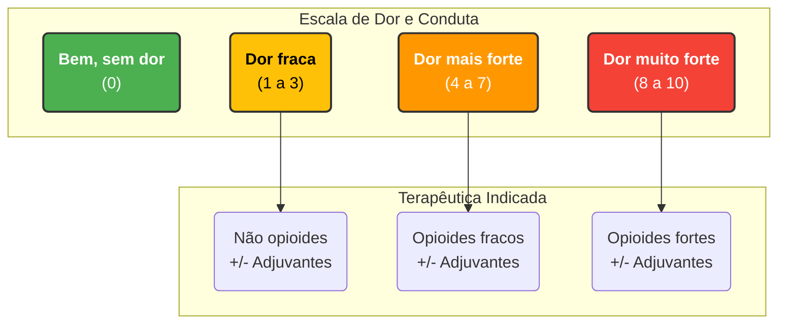
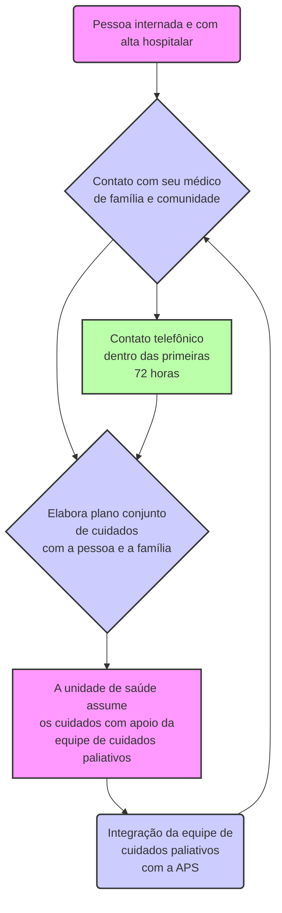

# Resumo/Aula: Cuidados Paliativos na Atenção Primária à Saúde

Este material é um resumo detalhado do Capítulo 106, focado em fornecer uma compreensão aprofundada sobre a aplicação dos cuidados paliativos no âmbito da atenção primária.

---

### **Aspectos-Chave dos Cuidados Paliativos**

-   **Definição e Objetivo**:
    -   O cuidado paliativo é uma abordagem que visa melhorar a qualidade de vida de pacientes e seus familiares que enfrentam doenças que ameaçam a continuidade da vida.
    -   Seu foco principal é a prevenção e o alívio do sofrimento, seja ele físico, psicológico, social ou espiritual.
-   **Impacto Familiar e Social**:
    -   A necessidade de cuidados contínuos provoca mudanças significativas na dinâmica familiar e nas atividades cotidianas.
    -   Isso pode levar a um aumento da vulnerabilidade social da família, devido ao impacto financeiro, emocional e na rotina de trabalho dos cuidadores.

### **Contextualização Através de um Caso Clínico**

-   **Situação Apresentada**:
    -   Dona Maria, 46 anos, com diagnóstico de carcinoma de colo do útero em estágio avançado, com metástases cerebrais e sem resposta ao tratamento curativo (quimioterapia).
    -   Recebeu alta hospitalar para cuidados domiciliares, pois "não havia mais nada a ser feito" no hospital sob a perspectiva curativa.
    -   Apresenta um quadro complexo: restrita ao leito, uso de sonda nasoenteral e vesical, dor intensa, vômitos, náuseas, constipação e insônia.
-   **Complexidade Social**:
    -   A irmã, Joana, é a cuidadora principal e manifesta insegurança para lidar com a situação.
    -   A família possui outras vulnerabilidades: Dona Maria tem uma filha de 10 anos com síndrome de Down e cuidava de sua mãe de 77 anos com Alzheimer.
    -   A família não possuía acompanhamento prévio pela equipe de saúde da família de seu território, evidenciando uma falha na integração do cuidado.

### **O Papel dos Cuidados Paliativos na Prática**

-   **Abordagem Ampla**: Os cuidados paliativos não são uma intervenção de "fim de linha", mas sim uma abordagem estruturada para atender às necessidades dos pacientes e familiares em qualquer fase de uma doença grave, e devem ser iniciados o mais precocemente possível.
-   **Necessidade na Atenção Primária**: O caso de Dona Maria ilustra uma situação comum nos serviços de saúde, onde pacientes com doenças avançadas recebem alta sem um plano de cuidados continuados, tornando essencial a atuação da Atenção Primária à Saúde (APS) para estabelecer um plano de cuidados integrais.

### **Trabalhando a Espiritualidade: A Ferramenta FICA**

-   A avaliação da espiritualidade e religiosidade é um componente crucial do cuidado paliativo, pois as crenças do paciente influenciam sua forma de lidar com o estresse e as decisões sobre a saúde.
-   A ferramenta FICA é um acrônimo utilizado para guiar essa conversa de forma sensível.

| Acrônimo | Significado | Perguntas |
| :--- | :--- | :--- |
| **F** | **Fé e crença** | Quanto se considera religioso ou espiritualizado? Quanto a crença espiritual ou religiosa o (a) ajuda a suportar o estresse? Quanto significa a sua vida? |
| **I** | **Importância e influência** | Que importância a fé e a crença tem em sua vida? Quanto a fé e as crenças influenciam na forma como lidar com o estresse? Quanto uma crença específica pode influenciar nas decisões sobre os cuidados com sua saúde? |
| **C** | **Comunidade** | Em que medida fazer parte de um grupo religioso ou espiritual pode lhe ajudar? Quantifique a afirmação: "Comunidades religiosas e espirituais podem dar um forte apoio para as pessoas doentes". |
| **A** | **Ação do cuidado** | Quanto a Unidade de Saúde pode ajudar nas suas questões religiosas ou espirituais? |

### **Identificação das Necessidades e Problemas**

-   A partir da visita domiciliar, o médico de família identificou as necessidades da paciente e da cuidadora.

-   **Necessidades da Paciente (Dona Maria)**:
    -   **Dor Nível 9 (em uma escala de 0 a 10)**, que não aliviava com a medicação prescrita (Paracetamol + Codeína).
    -   Náuseas e vômitos intensos.
    -   Constipação intestinal (2 dias sem evacuar).
    -   Dificuldade para dormir e sono agitado.
    -   Desejo de se alimentar pela boca para sentir o gosto da comida.
    -   Desejo de retomar suas práticas religiosas e compromissos com a igreja.
    -   Avaliação da real necessidade do uso contínuo das sondas.

-   **Necessidades da Cuidadora (Irmã Joana)**:
    -   Dificuldade para comprar a dieta recomendada no hospital.
    -   Medo relacionado ao manejo das sondas.
    -   Abandono do trabalho para se dedicar integralmente aos cuidados de Maria, da sobrinha e da mãe.
    -   Sobrecarga por cuidar de três pessoas com necessidades especiais.
    -   Situação financeira precária.
    -   Rede familiar de apoio pobre.

### **Escala de Dor e Analgesia**

A avaliação da dor é fundamental e deve ser tratada como o "quinto sinal vital". A escala visual ajuda a classificar a intensidade e a guiar a terapia.

### **Fluxograma de Trabalho Integrado: Desospitalização e APS**

Para garantir a continuidade do cuidado, é essencial uma parceria bem definida entre o hospital e a atenção primária.

### **Plano de Cuidados Detalhado e Contextualização**

Com base nos problemas identificados, a equipe multiprofissional elabora um plano de ação.

| Problemas | Plano de Cuidado | Contextualização |
| :--- | :--- | :--- |
| **1. Dor** | Iniciar com morfina, solução oral 10 mg/mL (10 gotas), de 4/4 h. Reavaliar em 24 horas usando a escala de dor para adequar a dose. | A dor é o "quinto sinal vital" e ocorre em 60-90% das pessoas com câncer avançado. Deve ser registrada e tratada com a mesma prioridade dos outros sinais vitais. |
| **2. Náuseas e vômitos** | Acrescentar haloperidol, 5 gotas, 3 x/dia. A medicação também ajudará a diminuir o soluço. | Sintomas presentes em 60% dos pacientes, causados por fatores como compressão gástrica por tumores, ascite, quimioterapia e radioterapia. |
| **3. Constipação** | Introduzir líquidos e alimentação pastosa (via oral, se possível), rica em resíduos. Usar óleo mineral, se necessário. | Ocorre em até 65% das pessoas com câncer. A imobilidade, a dieta e, principalmente, o uso de opioides (como a morfina) são as principais causas. |
| **4. Soluço** | Oferecer líquidos frios, esfregar o palato com dedo e gaze. Se não melhorar, suco de laranja/limão com açúcar ou xilocaína gel. | Consequência de espasmos diafragmáticos, frequentemente associados à distensão gástrica ou ao crescimento do fígado (hepatomegalia). |
| **5. Alterações do sono** | Prescrever amitriptilina, 25 mg, à noite, com aumento gradual da dose. | A inversão do ciclo sono-vigília é comum (insônia em 29-59% dos pacientes). A amitriptilina tem efeito analgésico e antidepressivo, atuando na insônia. **Atenção aos efeitos colaterais**: constipação, retenção urinária e boca seca. |
| **6. Alimentação** | Programar a retirada da sonda nasoenteral, a partir da aceitação da via oral. Checar em 24 h. | A alimentação tem valor biológico, social e simbólico. Anorexia e perda de peso são comuns em câncer. Respeitar o desejo do paciente é fundamental. |
| **7. Saúde espiritual** | Incentivar a irmã a facilitar o contato de Dona Maria com sua ordem religiosa. Sugere-se aplicar a ferramenta FICA. | A espiritualidade (não necessariamente ligada à religião) reúne crenças e sentimentos que dão sentido à vida e deve ser valorizada em todos os pacientes. |
| **8. Cuidados com as sondas** | Avaliar a real necessidade das sondas (nasoenteral e vesical), revisando a indicação com o hospital e solicitando ajuda da enfermeira para avaliar a suspensão. | A decisão deve priorizar, de maneira geral, a vontade da pessoa, sua real necessidade e o conforto, avaliando o estado clínico em que ela se encontra. |
| **9. Aspectos sociais** | Trabalhar com a família para devolver o controle da situação, auxiliando-os a estabelecer planos realistas de cuidado e apoio. | Os problemas sociais são tão cruciais quanto os físicos e exigem uma abordagem holística (integral) do paciente e da família. |

### **Outras Formas de Reagir a uma Doença Grave**

Além dos estágios do luto, pacientes e familiares podem apresentar outras reações.

| Reação | Descrição |
| :--- | :--- |
| **Rejeição** | A pessoa sabe de sua doença, mas evita falar sobre o assunto ou realizar atividades que a lembrem da enfermidade. |
| **Buscas salvadoras** | A pessoa sai em busca de tratamentos alternativos, outras práticas ou pessoas que prometem a cura ou restabelecimento da saúde. |
| **Pensamento mágico** | Crença de que um ritual, promessa ou ato específico pode reverter o quadro clínico da doença. |

### **Requisitos para uma Assistência Domiciliar Adequada**

Para que o cuidado em casa seja bem-sucedido, alguns critérios são fundamentais.

-   Vontade da pessoa de permanecer em casa.
-   Capacidade e disponibilidade da família para assumir os cuidados.
-   Ausência de problemas econômicos graves que impeçam o cuidado.
-   Boa comunicação entre paciente, profissionais e família.
-   Competência técnico-científica da equipe de saúde.
-   Suporte psicossocial adequado para o paciente e sua família.
-   Acompanhamento integrado com o serviço especializado em cuidados paliativos.
-   Definição de um plano de cuidados extensivo ao cuidador (para evitar o esgotamento).
-   Cuidado com o estresse profissional da equipe.
-   Definição clara dos limites de atuação da equipe de saúde da família.

### **Prognóstico e Complicações Possíveis**

A equipe deve estar preparada para a evolução da doença e orientar a família.

| Categoria | Detalhes |
| :--- | :--- |
| **Alterações neurológicas** | ▸ Convulsões ▸ Agitação ▸ Alterações do sensório |
| **Situação da doença** | ▸ Avanço do tumor ▸ Outras complicações (ex: infecções) |
| **Preparação da família** | ▸ Avaliar o conhecimento da família sobre a doença. ▸ Discutir planos de vida e desejos do paciente. ▸ Discutir onde o paciente deseja ser atendido caso piore (hospital ou domicílio). ▸ Trabalhar a preparação para a morte. ▸ Orientar sobre desfecho e atestado de óbito. ▸ Planejar os cuidados com a família enlutada. |

### **Níveis de Cuidados Paliativos na Rede de Saúde**

Os cuidados paliativos são organizados em diferentes níveis de complexidade, integrando a atenção primária, secundária e terciária.

| Nível de Cuidados | População | Necessidades do Paciente | Atribuições do Profissional | Local do Cuidado |
| :--- | :--- | :--- | :--- | :--- |
| **Primário** | **60-70%** dos indivíduos com doença progressiva | Físicas (dor e outros sintomas), Emocional, Social, Cultural, Espiritual. | **Conhecimento básico de cuidados paliativos**, Acompanhamento clínico continuado, Atenção integral. | APS, Ambulatório geral, Atenção domiciliar, Pronto-atendimento. |
| **Secundário** | **25-30%** dos casos | Piora esporádica de sintomas, Complicações da doença de base ou comorbidades. | **Qualificação em cuidados paliativos**, Apoio aos profissionais da APS, Consultoria, Compartilhamento do atendimento. | Unidade mista, Ambulatório, Internação domiciliar, Emergência, Hospital geral. |
| **Terciário** | **5-10%** dos casos refratários | Necessidades complexas e refratárias (físicas, emocionais, etc.). Requer plano de cuidado altamente especializado. | **Especialista em cuidados paliativos**, Intervenções e avaliações especializadas, Tratamentos complexos ou invasivos, Co-manejo. | Unidade especializada, Hospital geral, Ambulatório especializado. |

### **Conclusão**

-   **O que Fazer Sempre**: É preciso enfatizar que, mesmo quando a cura não é mais possível, **sempre há o que fazer** para melhorar as condições de vida da pessoa.
-   **Direitos do Paciente**: Respeitar o direito de viver os últimos momentos sem sofrimento, morrer em casa (se assim desejar), rodeado por seus entes queridos e com assistência adequada.
-   **Dignidade**: O objetivo final é proporcionar um fim de vida o mais digno possível.