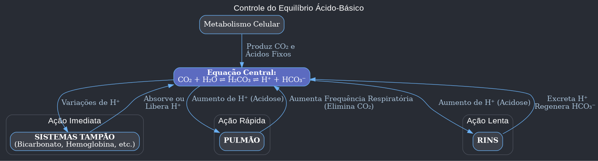
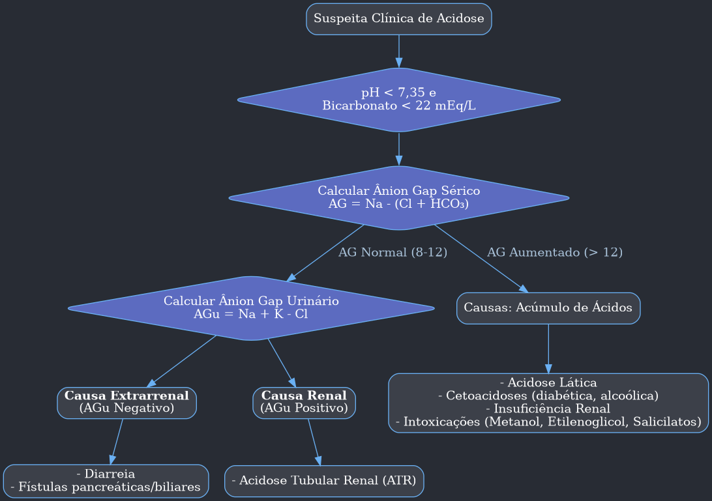
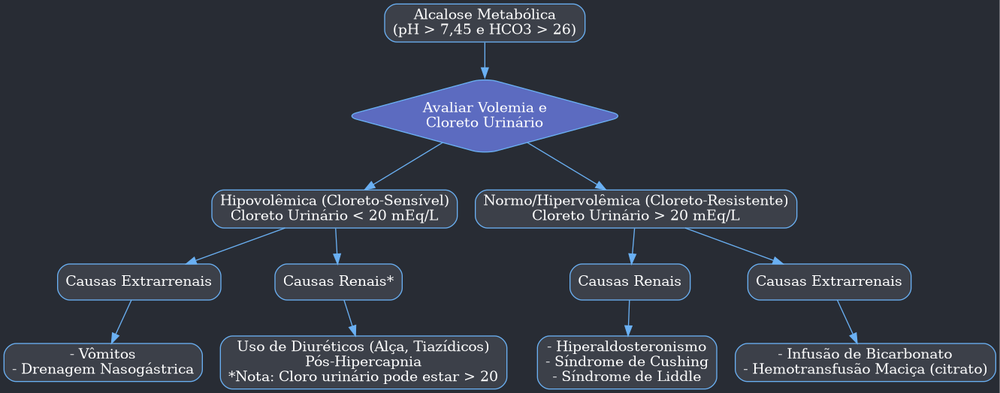

Com certeza. Entendi perfeitamente. Sua solicitação é para processar o material de estudo completo, identificar todos os diagramas `Mermaid` e traduzi-los para o formato `PlantUML` usando a sintaxe `digraph`, que oferece controle superior.

Preparei o resumo completo para o Obsidian, substituindo cada um dos fluxogramas `Mermaid` originais pela sua versão `digraph` correspondente, mantendo o tema escuro e a clareza visual.

Aqui está o material finalizado:

***

# Aula: Distúrbios Ácido-Básicos

## 1.0 Introdução aos Distúrbios do Equilíbrio Ácido-Básico

- Antes de abordar os distúrbios, é crucial solidificar alguns conceitos fundamentais.

#### 1.1 Definindo um Ácido e uma Base

- **Ácido:**
    - É uma substância que tem a capacidade de **doar um íon H⁺ (próton)**.
    - **Ácidos Fortes**: Dissociam-se rapidamente, liberando uma grande quantidade de H⁺.
        - *Exemplo*: Ácido Clorídrico (HCl), presente na secreção gástrica.
        - `HCl ⇌ H⁺ + Cl⁻`
    - **Ácidos Fracos**: Apresentam uma dissociação menor, liberando menos H⁺.
- **Base:**
    - É uma substância que tem a capacidade de **receber um íon H⁺ (próton)**.
    - **Base Forte**: Reage rapidamente com o H⁺, retirando-o da solução.
        - *Exemplo*: Bicarbonato (HCO₃⁻), que reage com H⁺ para formar Ácido Carbônico (H₂CO₃).
        - `HCO₃⁻ + H⁺ ⇌ H₂CO₃`

#### 1.2 Potencial de Hidrogênio: O pH

- O pH é uma medida que avalia a acidez, alcalinidade ou neutralidade de uma solução.
- Os valores normais do **pH sérico (no sangue)** se mantêm em uma faixa muito estreita: **entre 7,35 e 7,45**.
- A manutenção dessa faixa é vital para o funcionamento adequado de enzimas e processos celulares.

| Conceito | Descrição | Valor Laboratorial de Referência |
| :--- | :--- | :--- |
| **Acidemia** | Excesso de H⁺ no compartimento extracelular. | **pH < 7,35** |
| **Alcalemia** | Déficit de H⁺ no compartimento extracelular. | **pH > 7,45** |
| **Acidose** | Processo patológico (metabólico ou respiratório) que leva à **redução do pH**. | Causa queda do bicarbonato ou aumento da pCO₂. |
| **Alcalose** | Processo patológico (metabólico ou respiratório) que leva ao **aumento do pH**. | Causa aumento do bicarbonato ou queda da pCO₂. |

- **Sistemas de Controle do Equilíbrio Ácido-Básico:** O organismo conta com três aliados principais:
    - **Pulmões (Controle Rápido):**
        - O metabolismo de carboidratos gera CO₂. O excesso de CO₂ leva à formação de ácido, aumentando a concentração de H⁺.
        - Os pulmões eliminam o CO₂ (um ácido volátil).
        - **Aumento da frequência respiratória**: "Lava" o CO₂, reduzindo a formação de H⁺ (corrige acidose).
        - **Redução da frequência respiratória**: Retém CO₂, aumentando a formação de H⁺ (corrige alcalose).
    - **Rins (Controle Lento):**
        - Eliminam os **ácidos fixos** (não voláteis), produtos do metabolismo de proteínas e gorduras.
        - Têm a capacidade de regenerar e reabsorver bicarbonato (HCO₃⁻), a principal base do corpo.
    - **Sistemas-Tampão (Controle Imediato):**
        - Soluções que minimizam as variações de pH.
        - **Tampão Extracelular Principal: Bicarbonato (HCO₃⁻)**. Ele se liga ao H⁺ para formar H₂O e CO₂, sendo o mais importante do organismo.
        - **Tampão Intracelular: Hemoglobina e Fosfato.**
            - Em acidoses, o H⁺ entra nas células para ser tamponado, e em troca, o potássio (K⁺) sai para o sangue. Por isso, **acidoses frequentemente cursam com hipercalemia**.
            - Em alcaloses, o H⁺ sai das células, e o K⁺ entra. Por isso, **alcaloses podem causar e ser perpetuadas por hipocalemia**.
        - **Tampão Ósseo:** Relevante em acidose metabólica crônica. A liberação de cálcio dos ossos para tamponar o H⁺ pode causar calciúria, nefrolitíase e nefrocalcinose.

#### 1.3 A Equação de Henderson-Hasselbalch

- É a fórmula matemática que descreve a relação entre pH, bicarbonato (componente metabólico) e pCO₂ (componente respiratório).
- **Associação Clínica Chave:**
    - `pH ∝ HCO₃⁻ / pCO₂`
    - Para o **pH subir (Alcalemia)**, é necessário um processo de **alcalose**: um **aumento de HCO₃⁻** ou uma **queda de pCO₂**.
    - Para o **pH cair (Acidemia)**, é necessário um processo de **acidose**: uma **queda de HCO₃⁻** ou um **aumento de pCO₂**.

#### 1.4 Distúrbios Primários do Equilíbrio Ácido-Básico

| Distúrbio Primário | Alteração Principal |
| :--- | :--- |
| **Acidose Metabólica** | **Queda** nos níveis de bicarbonato (HCO₃⁻) |
| **Alcalose Metabólica** | **Aumento** nos níveis de bicarbonato (HCO₃⁻) |
| **Acidose Respiratória** | **Aumento** do pCO₂ |
| **Alcalose Respiratória**| **Queda** do pCO₂ |

- **Distúrbios Mistos:** Ocorrem quando há alterações simultâneas, tanto metabólicas quanto respiratórias. O diagnóstico preciso requer a **análise da gasometria arterial**.

***

## 2.0 Acidose Metabólica

#### 2.1 Definição

- É um processo patológico definido pela **redução dos níveis séricos de bicarbonato** (abaixo de 22 mEq/L).
- Pode ser causada por um **ganho de ácidos** ou por uma **perda de bases**.
- Leva a uma tendência de queda do pH para < 7,35 (acidemia).

#### 2.2 Classificação e Ânion Gap

- A acidose metabólica é classificada em dois grandes grupos com base no **Ânion Gap (AG)** ou **Hiato Aniônico**.
    1.  **Acidose metabólica com ânion gap aumentado.**
    2.  **Acidose metabólica com ânion gap normal (ou hiperclorêmica).**

- **O que é o Ânion Gap?**
    - Baseia-se no princípio da **eletroneutralidade do plasma**: a soma das cargas positivas (cátions) deve ser igual à soma das cargas negativas (ânions).
    - O AG representa os ânions não medidos rotineiramente no sangue (proteínas como a albumina, sulfato, fosfato).
    - **Fórmula:**
        - `Ânion Gap = Na⁺ – (Cl⁻ + HCO₃⁻)`
    - **Valor Normal:** 8 a 12 mEq/L.
    - **Utilidade Clínica:**
        - **AG Aumentado**: Geralmente indica uma acidose causada pelo **acúmulo de um ácido**. O ânion desse ácido "ocupa" o espaço do bicarbonato, que foi consumido para tamponar o H⁺.
        - **AG Normal (Hiperclorêmica)**: Geralmente indica uma acidose causada pela **perda de bicarbonato**. Para manter a eletroneutralidade, o corpo retém cloreto (Cl⁻), resultando em hipercloremia.

#### 2.3 Causas de Acidose Metabólica

##### 2.3.1 Acidose Metabólica com Ânion Gap Elevado

- **Acidose Lática**: Principal causa de acidose metabólica com AG elevado.
    - **Tipo A (mais comum)**: Associada à **má perfusão tecidual** (choque hemodinâmico), levando ao metabolismo anaeróbio e acúmulo de lactato.
    - **Tipo B**: Causada por defeitos na metabolização do lactato, sem má perfusão.
        - *Drogas*: **Metformina**, Linezolida, Inibidores de transcriptase reversa.
- **Cetoacidoses**: Acúmulo de cetoácidos.
    - **Cetoacidose Diabética**: Deficiência de insulina impede o uso de glicose, levando à queima de gordura e produção de cetoácidos.
    - **Cetoacidose Alcoólica**: Baixo aporte calórico e estímulo do álcool à lipólise.
    - **Jejum Prolongado**: Produção de cetoácidos para energia.
- **Insuficiência Renal (Aguda ou Crônica Avançada)**: Acúmulo de ácidos fixos (sulfato, fosfato) que o rim doente não consegue eliminar.
- **Intoxicações Exógenas**:
    - **Metanol** (presente em solventes e bebidas adulteradas): Metabolizado em ácido fórmico, tóxico para o nervo óptico, causando **alterações visuais**.
    - **Etilenoglicol** (presente em anticongelantes): Metabolizado em ácido glicólico e ácido oxálico. Causa lesão renal aguda e **presença de cristais de oxalato de cálcio na urina**.
    - **Salicilatos** (AAS): Inicialmente causa alcalose respiratória (estímulo direto do centro respiratório), mas depois evolui para acidose metabólica com AG elevado.
    - **Paracetamol**: Em intoxicações, pode levar ao acúmulo de ácido piroglutâmico (oxoprolina).
- > **Gap Osmolar**: Em suspeita de intoxicação por álcoois tóxicos, calcula-se o gap osmolar. Se a osmolalidade medida for >10 unidades acima da calculada, fortalece o diagnóstico.

##### 2.3.2 Acidose Metabólica com Ânion Gap Normal (Hiperclorêmica)

- **Perdas Intestinais**: Principal causa.
    - **Diarreia**: As secreções intestinais (pós-ângulo de Treitz) são ricas em bicarbonato. A perda na diarreia causa acidose.
- **Perdas Renais: Acidoses Tubulares Renais (ATR)**: Defeitos na acidificação da urina ou na reabsorção de bicarbonato.
    - **ATR tipo II (Proximal)**: Defeito na reabsorção de HCO₃⁻ no túbulo proximal. Causas: **mieloma múltiplo**, aminoglicosídeos, **acetazolamida**.
    - **ATR tipo I (Distal)**: Incapacidade de secretar H⁺ no túbulo distal. Cursa classicamente com **pH urinário alcalino e hipocalemia**. Associada a doenças autoimunes (Sjögren) e anfotericina B. Causa nefrolitíase e nefrocalcinose.
    - **ATR tipo IV**: Associada ao hipoaldosteronismo. A falta de aldosterona impede a secreção de K⁺ e H⁺. É a única que cursa com **HIPERCALEMIA**. Causas: diabetes, IECA/BRA, espironolactona.
- > **Ânion Gap Urinário (AGu):** Usado para diferenciar a causa da acidose com AG normal.
    > - **Fórmula:** `AGu = Na⁺ (urinário) + K⁺ (urinário) – Cl⁻ (urinário)`
    > - **Interpretação:**
    >     - **AGu Negativo**: Rim funcionando normalmente, eliminando ácido (na forma de NH₄Cl). A causa é **extrarrenal (diarreia)**.
    >     - **AGu Positivo ou Zero**: Rim não consegue eliminar ácido. A causa é **renal (ATR)**.
- **Ureterossigmoidostomia**: Anastomose do ureter no sigmoide. A urina (rica em cloreto) em contato com a mucosa intestinal leva à reabsorção de Cl⁻ em troca da secreção de HCO₃⁻.
- **Administração Excessiva de Solução Fisiológica (SF 0,9%)**: A infusão de grandes volumes de uma solução rica em cloreto causa hipercloremia, forçando o rim a excretar bicarbonato para manter a eletroneutralidade.

---
### Fluxograma Diagnóstico da Acidose Metabólica

---

#### 2.4 Consequências Clínicas e Fisiológicas da Acidose Metabólica

- **Respiração de Kussmaul**: Padrão respiratório com inspirações profundas e rápidas, sem pausas, numa tentativa de compensar a acidose eliminando mais CO₂.
- **Desvio da Curva de Dissociação da Hemoglobina para a Direita**:
    - Em ambiente ácido (pH baixo), a afinidade da hemoglobina pelo oxigênio diminui.
    - Isso facilita a **liberação de oxigênio para os tecidos**, um mecanismo adaptativo em situações de hipóxia.
- **Efeitos Cardiovasculares**: Em acidemia grave (pH < 7,1), há interferência na resposta aos receptores adrenérgicos, causando **disfunção miocárdica, vasodilatação (vasoplegia) e hipotensão arterial**. É uma causa de parada cardiorrespiratória.

| Sistema | Consequências da Acidemia Grave |
| :--- | :--- |
| **Cardiovasculares** | Hipotensão, Vasoplegia, Inotropismo negativo |
| **Metabólicas** | Hipercalemia, Resistência à insulina, Aumento do catabolismo |
| **Cerebrais** | Rebaixamento do nível de consciência, Redução do metabolismo cerebral |
| **Respiratórias** | Hiperventilação (Kussmaul), Fadiga respiratória |

#### 2.5 Tratamento da Acidose Metabólica

- **Acidose Aguda**:
    - O foco principal é **tratar a causa de base** (ex: tratar o choque na acidose lática, dar insulina na cetoacidose diabética).
    - A **reposição de bicarbonato NÃO é rotineira**.
    - **Riscos da reposição de bicarbonato**: hipernatremia, hipocalemia (o K⁺ volta para a célula), hipocalcemia (aumento da ligação do cálcio à albumina, diminuindo o cálcio iônico ativo) e piora da acidose intracelular.
    - **Indicação de Bicarbonato**: Considerado em casos de acidemia grave (**pH < 7,2**) associada a lesão renal aguda, com o objetivo de reduzir a mortalidade e a necessidade de diálise.
- **Acidose Crônica**:
    - O tratamento envolve a **reposição de bases** (ex: bicarbonato de sódio oral).
    - A correção melhora a força muscular e a doença óssea associada.

***

## 3.0 Alcalose Metabólica

#### 3.1 Definição

- É um processo patológico definido pelo **aumento primário do bicarbonato sérico** (acima de 26 mEq/L).
- Ocorre por um **ganho de bases** ou por uma **perda de ácidos (H⁺)**.
- Leva a uma tendência de aumento do pH para > 7,45 (alcalemia).

#### 3.2 Aspectos Fisiológicos

- O rim é muito eficiente em excretar bicarbonato. Para que a alcalose metabólica se instale e se mantenha, algo precisa impedir essa excreção.
- **Fases da Alcalose Metabólica:**
    1.  **Fase de Geração**: O evento inicial que causa o ganho de base ou perda de ácido.
    2.  **Fase de Manutenção**: Fatores que **perpetuam** a alcalose, impedindo a correção renal.
- **Três Fatores de Manutenção (Perpetuadores):**
    1.  **Hipovolemia**: A contração de volume estimula a reabsorção de sódio no túbulo proximal. Como a reabsorção de sódio está acoplada à de bicarbonato, o HCO₃⁻ também é reabsorvido, impedindo sua excreção.
    2.  **Hipocloremia**: A falta de cloreto força o rim a reabsorver sódio junto com bicarbonato, perpetuando a alcalose.
    3.  **Hipocalemia**: Na tentativa de poupar potássio, o rim aumenta a secreção de H⁺ em troca da reabsorção de sódio no túbulo coletor, piorando a alcalose.

#### 3.3 Classificação

- A classificação é baseada na resposta à administração de cloreto (solução salina) e no estado volêmico.

##### 3.3.1 Alcaloses Hipovolêmicas (Cloreto-Sensíveis)

- Cursam com **cloreto urinário baixo (< 20 mEq/L)**.
- Melhoram com a reposição de volume e cloreto (SF 0,9%).
- **Causas Renais (Cloro urinário > 20):**
    - **Uso de Diuréticos**: Tanto os de alça (furosemida) quanto os tiazídicos (hidroclorotiazida) causam perda de volume, cloro e potássio, levando à alcalose.
- **Causas Extrarrenais (Cloro urinário < 20):**
    - **Vômitos ou Drenagem Gástrica**: É a principal causa. Há perda direta de ácido clorídrico (H⁺ e Cl⁻), gerando hipovolemia, hipocloremia e hipocalemia (perda urinária de potássio), que perpetuam a alcalose.
    - > **Acidúria Paradoxal**: Em pacientes com alcalose metabólica por vômitos, a urina pode estar paradoxalmente ácida. Isso ocorre porque, devido à hipovolemia severa, o rim prioriza reabsorver sódio e bicarbonato, secretando H⁺, o que acidifica a urina apesar da alcalemia sistêmica.

##### 3.3.2 Alcaloses Normo/Hipervolêmicas (Cloreto-Resistentes)

- Cursam com **cloreto urinário alto (> 20 mEq/L)**.
- **Não** respondem à reposição de solução salina.
- O principal mecanismo perpetuador é a **hipocalemia**.
- **Causas Renais**:
    - **Hiperaldosteronismo**: Excesso de aldosterona aumenta a reabsorção de sódio e a excreção de potássio e H⁺, causando hipertensão, hipocalemia e alcalose metabólica.
    - **Síndrome de Liddle**: Causa genética de hiperfunção do canal de sódio (ENaC) no túbulo coletor, mimetizando o hiperaldosteronismo.
    - **Síndrome de Cushing**: O excesso de cortisol tem efeito mineralocorticoide, agindo como a aldosterona.
- **Causas Extrarrenais**:
    - **Infusão de Bicarbonato**: Administração excessiva de bicarbonato de sódio.
    - **Hemotransfusão Maciça**: O citrato, anticoagulante das bolsas de sangue, é metabolizado no fígado em bicarbonato.

---
### Fluxograma Diagnóstico da Alcalose Metabólica

---

#### 3.4 Repercussões Clínicas

| Sistema              | Consequências da Alcalemia Grave                                            |
| :------------------- | :-------------------------------------------------------------------------- |
| **Cardiovasculares** | Constrição arteriolar, Predisposição a arritmias, Angina                    |
| **Metabólicas**      | Hipocalemia, Hipocalcemia (sintomática: tetania, cãibras)                   |
| **Cerebrais**        | Rebaixamento do nível de consciência, Redução do fluxo cerebral, Convulsões |
| **Respiratórias**    | Hipoventilação (compensatória), Hipercapnia, Hipóxia                        |
|                      |                                                                             |

#### 3.5 Tratamento

- O tratamento foca em **corrigir os fatores de manutenção**.
- **Alcalose Cloreto-Sensível**:
    - **Reposição de volume com solução salina isotônica (SF 0,9%)**. Isso fornece volume e cloreto.
    - Reposição de potássio (KCl), se houver hipocalemia.
- **Alcalose Cloreto-Resistente**:
    - Tratar a causa de base (ex: espironolactona para hiperaldosteronismo).
    - A correção da **hipocalemia** é fundamental.

***

## 4.0 Acidose Respiratória

#### 4.1 Definição

- Caracterizada por um **aumento primário da pCO₂** (pressão parcial de CO₂).
- A causa é a **hipoventilação alveolar**, ou seja, a incapacidade dos pulmões de eliminar o CO₂ produzido pelo corpo.
- Resulta em tendência à queda do pH (< 7,35).
- Pode ser aguda ou crônica.

#### 4.2 Causas

| Mecanismo | Causas de Acidose Respiratória Aguda |
| :--- | :--- |
| **Alterações Neuromusculares** | Lesão de tronco/medula, Síndrome de Guillain-Barré, **Miastenia gravis**, Drogas (opióides, benzodiazepínicos) |
| **Obstrução de Vias Aéreas** | Corpo estranho, Edema de laringe, **Broncoespasmo grave (asma)** |
| **Desordens Toracopulmonares** | Tórax instável, Pneumotórax |

| Mecanismo | Causas de Acidose Respiratória Crônica |
| :--- | :--- |
| **Anormalidades Neuromusculares** | Paralisia diafragmática, Síndrome de Pickwick (hipoventilação da obesidade) |
| **Desordens Toracopulmonares** | **Doença Pulmonar Obstrutiva Crônica (DPOC)**, Cifoescoliose, Doença pulmonar intersticial terminal |

#### 4.3 Quadro Clínico

- Inespecífico. O aumento da pCO₂ causa vasodilatação cerebral.
- **Sintomas Neurológicos**: Confusão mental, tremores, **flapping (asterixis)** e coma.
- Em casos crônicos, os pacientes são mais adaptados. Sintomas agudos surgem durante exacerbações.
- Acidemia grave pode levar a arritmias e óbito.

#### 4.4 Tratamento

- Não há terapia específica. O tratamento é direcionado para a **correção da doença de base**.
- O objetivo é **melhorar a ventilação alveolar** (ex: broncodilatadores, ventilação não invasiva ou invasiva).

***

## 5.0 Alcalose Respiratória

#### 5.1 Definição

- Definida por uma **queda primária da pCO₂**.
- A causa é a **hiperventilação alveolar**.
- Gera uma tendência de aumento do pH (> 7,45).

#### 5.2 Causas

- A hiperventilação ocorre por dois mecanismos principais: **hipóxia** (que estimula o centro respiratório) ou um **estímulo direto ao centro respiratório**.

| Mecanismo | Causas |
| :--- | :--- |
| **Hipóxia** | Pneumonia, Tromboembolismo pulmonar, Insuficiência cardíaca, Edema pulmonar |
| **Estímulo Direto do Centro Respiratório** | **Ansiedade (crise de pânico)**, Intoxicação por salicilato (fase inicial), Acidente vascular cerebral (AVC) |

#### 5.3 Quadro Clínico

- Os sintomas são mais proeminentes na forma aguda.
- Relacionam-se com hiperexcitabilidade neurológica e redução do fluxo sanguíneo cerebral.
- O aumento do pH favorece a ligação do cálcio à albumina, reduzindo o cálcio iônico livre e causando uma **hipocalcemia transitória funcional**.
- **Sintomas**: Parestesias (formigamento) periorais e em extremidades, cãibras, tontura, confusão mental. O quadro pode ser indistinguível de uma hipocalcemia aguda.

#### 5.4 Tratamento

- Não há tratamento específico. A conduta é voltada para a **doença de base**.
- No caso de ansiedade, orientar o paciente a respirar mais lentamente ou usar um saco de papel para reinspirar o CO₂ pode ajudar.