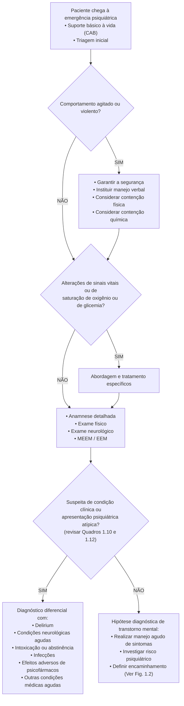
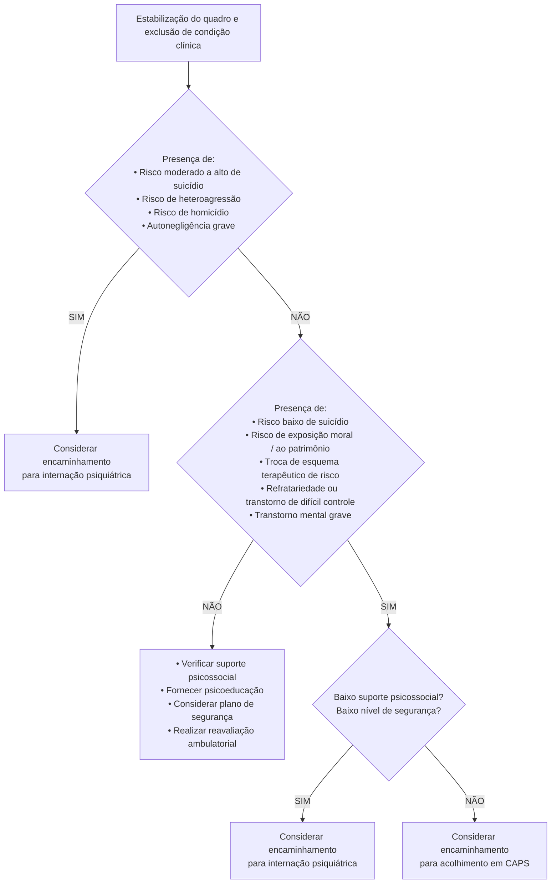

Com certeza. Prepararei uma aula/resumo detalhado do material fornecido, formatado para o Obsidian, com bullet points, tabelas e fluxogramas. O conteúdo será dividido em várias mensagens para garantir a clareza e a profundidade dos detalhes.

---

### **Parte 1: Introdução e Primeira Prioridade (Segurança)**

# Avaliação do Paciente na Emergência

## Introdução à Emergência Psiquiátrica (EP)

- **Definição de Emergência Psiquiátrica (EP):**
    - Qualquer distúrbio agudo do pensamento, humor, comportamento ou relacionamento social.
    - É uma condição referida pelo próprio paciente, pela família ou pela comunidade.
    - Requer uma intervenção imediata para proteger o paciente e outras pessoas de um risco iminente.
    - As intervenções devem ser implementadas em minutos ou horas.

- **Exemplos de Situações de EP:**
    - Agitação psicomotora grave.
    - Risco de homicídio.
    - Risco de suicídio ou de autolesão.
    - Estupor depressivo.
    - Psicose ou mania agudas e graves.
    - Mudanças comportamentais e cognitivas agudas.
    - Juízo crítico amplamente comprometido.
    - Autonegligência grave.

- **Contexto e Prevalência:**
    - As EPs ocorrem em diversos ambientes, como hospitais comunitários e ambulatórios.
    - Cerca de **4%** de todos os atendimentos em emergências gerais são devidos a uma condição de saúde mental.
    - **Um terço** dos atendimentos em EP são para avaliação de risco de suicídio.
    - **58,1%** dos pacientes em EP têm história prévia de transtorno mental.
    - Mais de **58%** dos pacientes são encaminhados para internação após o atendimento de emergência.

- **Recomendação Fundamental:**
    - A avaliação do paciente em EP deve ocorrer em um ambiente com acesso à avaliação médica geral (ex: hospital geral).
    - O objetivo é identificar e descartar condições médicas que possam estar causando ou influenciando os sintomas psiquiátricos.

---

## Prioridades na Avaliação de uma EP

A avaliação é dividida em três prioridades sequenciais:

1.  **Primeira prioridade:** Garantir a segurança.
2.  **Segunda prioridade:** Realizar avaliação efetiva.
3.  **Terceira prioridade:** Facilitar a intervenção adequada.

---

## Primeira Prioridade: Garantir a Segurança

- **Justificativa:**
    - Embora a maioria dos pacientes não seja violenta, o risco existe e deve ser manejado prioritariamente.
    - Uma metanálise sugere que **1 a cada 5 pacientes** admitidos em unidades psiquiátricas agudas pode cometer um ato violento.
    - A segurança do paciente, do médico, da equipe e de outras pessoas na área é a principal preocupação inicial.

- **Recomendações de Segurança:**
    - É crucial elaborar protocolos de segurança em todos os serviços de saúde, especialmente em locais não especializados em saúde mental (como atenção primária e hospitais comunitários).
    - Estes protocolos devem incluir:
        - Organização do espaço físico.
        - Treinamento da equipe para lidar com situações de risco.
    - O primeiro passo é a **identificação precoce** de comportamento agitado ou violento durante a triagem.

- **Manejo da Agitação:**
    - Em casos de agitação psicomotora e agressividade, condutas para estabilização do quadro devem ser tomadas **antes** da coleta detalhada da história clínica.
    - Isso pode incluir:
        - Técnicas de manejo verbal.
        - Contenção física.
        - Contenção química (medicação parenteral).

A tabela abaixo detalha as considerações práticas de segurança.

| **CONSIDERAÇÕES PRÁTICAS DE SEGURANÇA NAS EMERGÊNCIAS PSIQUIÁTRICAS** | |
| :--- | :--- |
| **Reconhecer precocemente sinais de comportamento agressivo ou violento** | |
| | • Atitude combativa |
| | • Reatividade aumentada a estímulos |
| | • Gesticulação exagerada, expressão facial de raiva e contato visual desafiante |
| | • Tom de voz aumentado ou recusa a comunicar-se |
| | • Irritabilidade ou hostilidade |
| | • Agressividade verbal ou física contra si, terceiros ou objetos |
| | • Tendência à frustração e dificuldade para antecipar consequências |
| | • Ideação delirante ou alucinações |
| **Instituir medidas ambientais de segurança** | |
| | • Implementação de protocolos de triagem e rotinas para o manejo de paciente agitado |
| | • Treinamento e reciclagem periódica da equipe de atendimento |
| | • Afastamento de pessoas que possam ser desestabilizadoras para o paciente |
| | • Observação contínua por outros membros da equipe em caso de agitação |
| | • Precaução ao sentar-se atrás de uma mesa durante avaliação |
| | • Consultórios com duas saídas, portas com janelas resistentes que abram para fora |
| | • Disponibilidade de equipe de segurança, câmeras de segurança e detectores de metais |
| | • Sistema de alarme ou código comum entre a equipe |

---
### **Parte 2: Segunda Prioridade (Avaliação Efetiva - Parte 1)**

## Segunda Prioridade: Realizar Avaliação Efetiva

Após garantir a segurança do ambiente, do paciente e da equipe, o foco se volta para uma avaliação clínica completa e precisa.

### Avaliação Médica Inicial

- **Suporte Básico à Vida:**
    - Todo paciente com queixas psíquicas deve ser avaliado quanto ao suporte básico à vida, seguindo o mnemônico **CAB**:
        - **C**irculação
        - **A**bertura de vias aéreas (Airway)
        - **B**oa respiração (Breathing)
    - A avaliação inclui a verificação de:
        - Sinais vitais.
        - Oximetria de pulso.
        - Glicemia capilar.
    - **Objetivo:** Identificar rapidamente condições médicas gerais que possam causar ou exacerbar as alterações comportamentais.

- **Risco Clínico Aumentado:**
    - Pacientes em EP frequentemente apresentam um risco maior de:
        - **Lesões traumáticas:** por autoagressão, heteroagressão ou agressão por terceiros.
        - **Condições com risco à vida:** como parada cardiorrespiratória por overdose de medicamentos ou substâncias psicoativas.

### Anamnese e Exame Físico

- **Estabelecimento do Vínculo:**
    - A avaliação deve sempre começar com o estabelecimento de um vínculo terapêutico.
    - O examinador deve se apresentar (nome, função) e explicar o objetivo da avaliação de forma acolhedora e respeitosa.
    - Uma boa abordagem inicial não só ajuda a elucidar o diagnóstico, mas também funciona como um processo terapêutico em si.

- **Foco da Entrevista:**
    - A entrevista deve se concentrar na queixa principal e nos motivos que levaram o paciente à emergência.
    - **Informações Suplementares:** Quando o paciente não consegue fornecer informações coerentes, é fundamental obter uma história com acompanhantes, familiares ou amigos.

A tabela a seguir oferece dicas práticas para facilitar a aproximação e a construção do vínculo com o paciente.

| **DICAS PARA FACILITAR A APROXIMAÇÃO DO PACIENTE AO EXAMINADOR** | |
| :--- | :--- |
| **Identifique o afeto predominante do paciente** | Identificar sentimentos como raiva, medo e vergonha, e motivar o paciente a falar sobre eles. |
| **Observe a identificação com os sentimentos do paciente** | Pacientes irritados ou assustados podem transferir esses sentimentos ao avaliador (ex: ameaças, posturas de vitimização). É necessário estar atento aos sentimentos que o paciente provoca (medo, raiva, pena) para não agir em resposta a eles, mas sim de forma terapêutica. |
| **Esteja atento à crítica sobre o motivo e sobre a voluntariedade (ou não) do atendimento** | A falta de crítica (juízo) e a involuntariedade do atendimento podem comprometer a avaliação. Inicie a entrevista com temas genéricos, escute o relato sem interromper e conecte-se com as informações disponíveis (linguagem, aparência, etc.). Evite usar a lógica para convencer o paciente de que ele está errado. |
| **Mostre-se interessado e escute atentamente o relato e o contexto do paciente** | Pacientes geralmente estão mais preocupados com os acontecimentos recentes do que com o conjunto de sintomas. Uma avaliação dos estressores psicossociais mostra ao paciente que o examinador está interessado nele, o que pode trazer informações importantes para o manejo. |

- **Coleta de Dados e Prontuário:**
    - É fundamental verificar o prontuário e outros registros clínicos prévios.
    - Contatar outros profissionais que já atendem o paciente pode ser muito útil.
    - A entrevista deve ser estruturada para otimizar o tempo.

A tabela abaixo detalha os dados essenciais a serem obtidos na anamnese psiquiátrica de emergência.

| **DADOS IMPORTANTES PARA SEREM OBTIDOS DA ANAMNESE NA EMERGÊNCIA PSIQUIÁTRICA** | |
| :--- | :--- |
| **Identificação** | • Nome, idade, sexo, etnia, naturalidade e procedência, situação conjugal • Informantes, contatos, proveniência do encaminhamento • Com quem mora e como está a qualidade da relação (suporte social) |
| **Queixa principal** | • Ideia clara do motivo pelo qual o paciente buscou atendimento e por que neste momento |
| **História da doença atual** | • **Pródromos:** início dos sintomas, grau de interferência no cotidiano (sono, alimentação, sexualidade), relações, trabalho, estudos; eventos vitais ou fatores precipitantes • **Uso de medicamentos:** medicamentos em uso, possibilidade de abuso, início, alterações de dose ou suspensão recentes |
| **História psiquiátrica pregressa** | • Presença de episódios anteriores (semelhantes ou não) • **Hospitalizações:** número, duração e instituições • **Psicotrópicos:** quais já utilizados, período de uso, motivo da suspensão ou troca • **Tentativas de suicídio:** número e período, meios empregados e consequências • **Uso, abuso e dependência de drogas:** quais substâncias, último consumo, quantidade média, características de abstinências anteriores |
| **História médica** | • Uso de suplementos/homeopatia/fitoterápicos • **História sexual:** parceiro fixo, uso de métodos de barreira, diagnóstico e tratamento prévio de ISTs |

---
### **Parte 3: Segunda Prioridade (Avaliação Efetiva - Parte 2)**

Continuando a avaliação efetiva, esta seção detalha o restante da anamnese, o exame físico com foco no exame neurológico e a avaliação de transtornos neurológicos funcionais.

### Continuação da Anamnese

A tabela abaixo complementa os dados importantes a serem coletados durante a anamnese na emergência.

| **DADOS IMPORTANTES PARA SEREM OBTIDOS DA ANAMNESE (CONTINUAÇÃO)** | |
| :--- | :--- |
| **História ginecológica** | • Número de gestações e de filhos, data da última menstruação, métodos anticoncepcionais, último citopatológico e última mamografia |
| **Comorbidades e uso de medicações clínicas** | • Traumas (TCE), doenças neurológicas (epilepsia, AVC), doenças cardiovasculares, diabetes melito, HAS, doenças infecciosas (HIV, outras ISTs), neoplasias |
| **História familiar** | • **Pais e irmãos:** idades e estado de saúde; se falecidos, idade e motivo do falecimento • História de condição parecida com a do paciente; internações psiquiátricas; uso de álcool/drogas; tentativas de suicídio ou suicídio (esclarecer parentesco, idade, etc.) • Outras condições: comportamento antissocial, violência, transtornos do humor, demência, etc. |
| **Perfil psicossocial** | • Escolaridade • Trabalho e história ocupacional (incluindo exposições) • Problemas legais e criminais (processos, detenções, etc.) |
| **Revisão de sintomas clínicos e psiquiátricos** | • Investigação ativa de sintomas de diversas áreas para não deixar passar informações importantes. |

*Siglas: AVC (acidente vascular cerebral); HAS (hipertensão arterial sistêmica); HIV (vírus da imunodeficiência adquirida); ISTs (infecções sexualmente transmissíveis); TCE (traumatismo craniencefálico).*

### Exame Físico e Neurológico

- **Objetivo do Exame Físico:** Identificar condições orgânicas que possam estar causando ou exacerbando a alteração psiquiátrica.
    - Deve ser completo em pacientes com estado mental alterado, agitados ou possivelmente intoxicados.
    - O peso deve ser verificado, especialmente em pacientes com suspeita de transtorno alimentar.

- **Exame Neurológico:**
    - É um dos componentes mais importantes.
    - Deve-se estar atento a **alterações focais**, que podem indicar um comprometimento neurológico agudo (ex: AVC).
    - O **transtorno conversivo** (transtorno de sintomas neurológicos funcionais) é uma condição comum que pode ser identificada através de sinais semiológicos específicos.

A tabela a seguir apresenta os componentes de um exame neurológico básico na emergência.

| **EXAME NEUROLÓGICO BÁSICO** | |
| :--- | :--- |
| **PACIENTE SENTADO** | |
| **Estado mental e funções corticais superiores** | • Miniexame do estado mental • **Praxias:** imitação de gestos (pentear os cabelos, assoprar uma vela) • **Gnosias:** identificação de cores, objetos, sons e objetos pelo toque |
| **Pares cranianos** | • **Olhos:** Campos visuais, reflexo fotomotor, movimentos oculares (Pares II, III, IV, VI) • **Face:** Sensibilidade, mastigação, mímica facial (Pares V, VII) • **Ouvido:** Testes de Rinne, Weber, pesquisa de nistagmo (Par VIII) • **Boca:** Simetria do palato, reflexo do vômito, elevação da úvula, motricidade da língua (Pares IX, X, XII) • **Pescoço:** Motricidade do esternoclidomastóideo e trapézio (Par XI) |
| **Motricidade** | • Tônus e trofismo dos membros superiores • Força dos membros superiores (manobras contra resistência) |
| **Reflexos** | • **Miotáticos:** tricipital, bicipital, estilorradial, flexor dos dedos, patelar, aquileu • **Primitivos:** palmo-mentual, *grasping* (preensão), glabelar, sucção |
| **Coordenação** | • **Metria:** teste índex-nariz ou índex-índex • **Diadococinesia:** alternância de movimentos de supinação e pronação |
| **PACIENTE DEITADO** | |
| **Motricidade** | • **Força (manobras deficitárias):**   - **Mingazzini:** decúbito dorsal, sustentar membros inferiores flexionados   - **Barré:** decúbito ventral, sustentar perna fletida |
| **Reflexos** | • Primitivos (cutâneo-plantar e cutâneo-abdominal) |
| **Coordenação** | • Metria (calcanhar-joelho) |
| **Sensibilidade** | • **Porção anterior e lateral da medula:** pressão, tato grosseiro, dor e temperatura • **Porção posterior da medula:** vibração, tato fino e propriocepção |
| **PACIENTE EM PÉ** | |
| **Marcha** | • Normal (pode ser sensibilizada com manobras: andar nos calcanhares, ponta dos pés, pé ante pé) |
| **Equilíbrio estático** | • Pés juntos e olhos abertos; depois, olhos fechados (oscilação com olhos fechados = **Romberg positivo**) |

---
### **Parte 4: Avaliação de Transtornos Neurológicos Funcionais (Conversivos)**

Esta seção foca em como identificar o Transtorno Conversivo, uma condição onde sintomas neurológicos não podem ser explicados por uma doença neurológica conhecida.

### Transtorno Conversivo (Transtorno de Sintomas Neurológicos Funcionais)

- **Atualização do DSM-5:**
    - Não é mais necessário identificar um estressor psicológico para o diagnóstico.
    - Foi removida a necessidade de excluir explicitamente simulação ou fingimento.
    - O diagnóstico é positivo, baseado em sinais clínicos específicos.

As tabelas a seguir apresentam dados da história e do exame físico que são sugestivos de um quadro funcional (conversivo) em vez de um quadro orgânico.

| **DADOS DA HISTÓRIA SUGESTIVOS DE TRANSTORNO CONVERSIVO** | |
| :--- | :--- |
| **Curso temporal dos sintomas** | • **Início súbito** e com a maior gravidade logo na instalação do quadro • Associação frequente com um evento desencadeante (lesão física, ataque de pânico, etc.) • História de apresentações similares prévias com resolução espontânea ou recorrência |
| **Sintomas que costumam acompanhar** | • **Pródromos** semelhantes a ataques de pânico (taquicardia, diaforese, dispneia) ou experiência dissociativa (desrealização, despersonalização) |
| **Comorbidades clínicas ou psiquiátricas** | • **Clínicas:** Síndrome do intestino irritável, fibromialgia, dor crônica, enxaqueca, asma • **Neurológicas:** Deficiência intelectual, TCE leve, epilepsia, enxaqueca • **Psiquiátricas:** Transtornos depressivos, de ansiedade, TEPT, transtornos de personalidade (especialmente *cluster* B e C), história de maus-tratos |

| **DADOS DO EXAME SUGESTIVO DE TRANSTORNO CONVERSIVO (SINAIS E TESTES)** | |
| :--- | :--- |
| **SINAIS DE FRAQUEZA FUNCIONAL** | |
| **Sinal de Hoover** | Baseia-se na contração sinérgica: ocorre extensão involuntária do membro "paralisado" quando se flete a perna contralateral contra resistência. Nas paralisias orgânicas, o examinador sente a pressão para baixo do calcanhar da perna contralateral; nas não orgânicas, nenhuma pressão é percebida. (Alta sensibilidade e especificidade). |
| **Fraqueza do colapso ou do soltar** | Após força aparentemente normal, o membro subitamente "perde a força" e não se sustenta contra a resistência do examinador. |
| **Inconsistência** | O desempenho motor de um músculo varia entre diferentes testes ou entre o teste e a observação casual. |
| **Superatividade hemifacial** | Contração unilateral do músculo orbicular do olho ou da boca, acompanhada pela contração do platisma, que pode ser confundida com fraqueza facial do lado oposto. |
| **SINAIS DE ALTERAÇÃO DE SENSIBILIDADE FUNCIONAL** | |
| **Divisão da linha média** | Perda sensorial de todo um hemicorpo nitidamente demarcada na linha média (no tronco ou face). |
| **Divisão vibratória** | Perda sensorial vibratória demarcada na linha média do osso frontal ou do esterno. |
| **Perda sensorial não anatômica** | A perda sensorial não segue a distribuição dos dermátomos. |
| **Inconsistência** | Os sintomas sensoriais flutuam em exames seriados. |
| **SINAIS DE ALTERAÇÃO DE MOVIMENTO FUNCIONAL** | |
| **Tremor variável** | Variação na frequência, ritmo e padrão do tremor. Melhora ou desaparece com distratores. |
| **Transmissão de tremor** | Um tremor unilateral adota o ritmo do membro não afetado quando este realiza um movimento rítmico. |
| **Dobrar joelhos** | Os joelhos dobram enquanto o paciente fica de pé ou deambula, parecendo uma queda iminente, mas raramente levando a quedas. |
| **Astasia-abasia** | Padrão de marcha bizarro, onde o paciente parece alternar entre base alargada e estreita, com contorções do tronco, mas com coordenação preservada. |
| **Marcha monoplégica de arrastar** | O paciente arrasta o membro como se fosse um objeto inanimado, geralmente com o pé rotacionado. |
| **CONVULSÃO NÃO EPILÉPTICA PSICOGÊNICA (CNEP)** | |
| **Duração** | Longa (> 2 min). |
| **Curso** | Flutuante, com pausas ou com aumentos e diminuições na frequência. |
| **Movimentos ictais** | Dessincronizados, de lado a lado, choro, "empurrão pélvico", fechamento ocular contra a resistência do examinador. |
| **Resposta a estímulos externos** | Espectadores ou estímulos externos (como falar com o paciente) podem aliviar ou intensificar o evento. |
| **Características pós-ictais** | Ausência de confusão pós-ictal; o paciente é capaz de lembrar informações apresentadas durante o evento. |

---
### **Parte 5: Avaliação do Estado Mental**

Após a anamnese e o exame físico, a avaliação se aprofunda no estado mental do paciente.

### Exame do Estado Mental (EEM)

- **Definição:** O EEM é a parte da avaliação que sintetiza as observações e impressões do examinador sobre o paciente no momento da entrevista.
- **Foco na Emergência Psiquiátrica (EP):**
    - Deve-se dar atenção especial ao **nível de consciência** e a alterações agudas da **atenção**, **orientação** e **memória**.
    - A presença dessas alterações sugere fortemente uma causa orgânica.

- **Divisão do EEM:**
    - **Primeira parte:** Avalia o funcionamento cerebral orgânico.
    - **Segunda parte:** Enfatiza a presença de transtornos funcionais.

- **Aparência do Paciente:**
    - A avaliação começa antes mesmo da entrevista, observando a aparência do paciente (grau de autocuidado, vestuário, postura, expressão facial, contato visual).
    - A aparência pode oferecer indicadores cruciais sobre a capacidade de cuidar de si e sobre o juízo crítico.

### Miniexame do Estado Mental (MEEM ou MMSE)

- **Utilidade:** Quando há suspeita de organicidade (ex: *delirium*), o MEEM pode ser usado para uma avaliação rápida e padronizada das funções cognitivas.

A tabela abaixo detalha todos os componentes e a pontuação do MEEM.

| **MINIEXAME DO ESTADO MENTAL (MEEM)** | **PONTOS** |
| :--- | :--- |
| **Orientação temporal** | **(5 pontos)** |
| • Qual o (Ano)? (Estação do ano)? (Dia da semana)? (Dia do mês)? (Mês)? | 1 para cada |
| **Orientação espacial** | **(5 pontos)** |
| • Qual o (País)? (Estado)? (Cidade)? (Local)? (Andar)? | 1 para cada |
| **Registro (memória imediata)** | **(3 pontos)** |
| • Repita e lembre as 3 palavras: (Pente) (Rua) (Azul). | 1 para cada |
| **Atenção e cálculo** | **(5 pontos)** |
| • Subtrair 7 a partir do 100, por 5 vezes: (93), (86), (79), (72), (65). | 1 para cada |
| **Evocação (memória recente)** | **(3 pontos)** |
| • Quais as 3 palavras ditas anteriormente? (Pente) (Rua) (Azul). | 1 para cada |
| **Linguagem** | **(9 pontos)** |
| • **Nomear:** (Caneta) (Relógio de pulso). | 2 pontos |
| • **Repetir:** (Nem aqui, nem ali, nem lá). | 1 ponto |
| • **Comando de 3 estágios:** (Pegue o papel com a mão direita, dobre ao meio e ponha no chão). | 3 pontos |
| • **Leitura:** Ler e executar a frase (Feche os olhos). | 1 ponto |
| • **Escrita:** Escrever uma frase completa. | 1 ponto |
| • **Cópia de desenho:** Copiar o desenho dos polígonos intersectados. | 1 ponto |
| **PONTUAÇÃO MÁXIMA TOTAL** | **30 PONTOS** |

- **Pontuação e Níveis de Corte (Ajustados pela Escolaridade):**
    - A pontuação de corte para suspeita de déficit cognitivo varia conforme os anos de estudo do paciente.
    - **Analfabetos:** ≤ 21
    - **Baixa escolaridade (1-5 anos):** ≤ 24
    - **Média escolaridade (6-11 anos):** ≤ 26
    - **Alta escolaridade (≥ 12 anos):** ≤ 27

    *Nota: Estes são pontos de corte sugeridos para a população brasileira. Pontuações abaixo do corte indicado para o nível de escolaridade do paciente levantam suspeita de déficit cognitivo e indicam a necessidade de uma investigação mais aprofundada.*

---
### **Parte 6: Funções Mentais (Transtornos Orgânicos vs. Funcionais)**

Esta seção detalha as funções mentais a serem avaliadas no Exame do Estado Mental (EEM), dividindo-as entre aquelas mais comumente associadas a transtornos orgânicos e as relacionadas a transtornos funcionais.

### Funções Mentais Relacionadas a Transtornos Orgânicos

A avaliação destas funções é crucial para identificar quadros como *delirium*, demências ou outras condições médicas que afetam o cérebro.

| **FUNÇÕES MENTAIS RELACIONADAS A TRANSTORNOS ORGÂNICOS** | |
| :--- | :--- |
| **Consciência** | • **Alterações:** Obnubilação, confusão, estupor e coma. • **Avaliação:** Observar as reações a estímulos verbais ou táteis. Usar a Escala de Coma de Glasgow se necessário. |
| **Atenção** | • **Alterações:** Vigilância (hipo e hipervigilância) e tenacidade (hipo e hipertenacidade). • **Avaliação:**   - **SPAN de dígitos:** Pedir para o paciente repetir uma série de dígitos (normal: 6 ou 7 dígitos).   - **Contagem regressiva:** Contar de 20 até 1 (1 ou mais erros = alteração).   - **Meses em ordem inversa:** Repetir os meses do ano de trás para frente (1 ou mais erros = alteração). |
| **Sensopercepção** | • **Alterações:** Hiper/hipoestesia, ilusões, pseudoalucinações, alucinações (visuais, auditivas, táteis, olfativas). • **Avaliação:** Questionar ativamente sobre alucinações, especialmente as **visuais e táteis**, que são mais sugestivas de organicidade. Observar se o paciente parece estar respondendo a estímulos não presentes. |
| **Orientação** | • **Alterações:** Desorientação no tempo, espaço e em relação a si mesmo. • **Avaliação:**   - **Tempo:** Perguntar hora, dia da semana, mês, ano, estação.   - **Espaço:** Perguntar local, endereço, cidade, estado, país.   - **Autopsíquica (própria pessoa):** Perguntar nome, data de nascimento, profissão.   - **Alopsíquica (outras pessoas):** Pedir para identificar familiares ou membros da equipe. |
| **Memória** | • **Alterações:** Amnésia (imediata, anterógrada, retrógrada, lacunar), confabulação. • **Avaliação:**   - **Memória imediata (registro):** Repetir 3 objetos (ex: "pente, azul, rua").   - **Memória recente (evocação):** Pedir para repetir os 3 objetos 5 minutos após.   - **Memória remota:** Perguntar sobre eventos importantes do passado e suas datas (nomes dos pais, data de casamento, escolas). |
| **Inteligência e Abstração** | • **Alterações:** Nível cognitivo aparentemente na média, inferior ou superior. • **Avaliação:** Avaliar escolaridade, vocabulário, capacidade de lidar com dinheiro e de se locomover. Avaliar a interpretação de provérbios e semelhanças entre palavras (ex: "o que maçã e pera têm em comum?"). |

### Funções Mentais Relacionadas a Transtornos Funcionais

Estas funções são o cerne da avaliação em transtornos psiquiátricos primários, como esquizofrenia, transtorno bipolar e depressão.

| **FUNÇÕES MENTAIS RELACIONADAS A TRANSTORNOS FUNCIONAIS** | |
| :--- | :--- |
| **Afeto e Humor** | • **Alterações:**   - **Afeto:** Congruente ou incongruente com o humor, reativo, constrito, embotado, plano.   - **Humor:** Deprimido, irritável, ansioso, expansivo, eufórico. • **Avaliação:** Observar o conteúdo afetivo predominante, a expressão facial, a postura e a adequação das respostas emocionais. |
| **Pensamento** | • **Alterações:**   - **Produção:** Lógico, ilógico ou mágico.   - **Curso:** Lento, acelerado (fuga de ideias), circunstancialidade, tangencialidade, afrouxamento de associações, bloqueio, roubo do pensamento.   - **Conteúdo:** Delírios, ideias supervalorizadas, de referência, obsessões, fobias, ideias suicidas e homicidas. • **Avaliação:** Observações ao longo da entrevista. |
| **Juízo Crítico** | • **Alterações:** Inadequação de comportamento ou discurso, não reconhecer a própria doença ou limitações. • **Avaliação:** Conteúdo da entrevista com paciente e familiares. Pode-se usar situações imaginárias (ex: "O que você faria se encontrasse na rua uma carta endereçada e selada?"). |
| **Conduta e Controle de Impulsos** | • **Alterações:** Hiper/hipobulia (vontade), compulsões, perversões, auto/heteroagressividade, conduta bizarra, uso de substâncias. • **Avaliação:** Observação do paciente e perguntas objetivas para o paciente e familiar. |
| **Linguagem** | • **Alterações:** Disartrias, taquilalia (fala acelerada), mutismo, neologismos, ecolalia (repetição), coprolalia (falar palavrões). • **Avaliação:** Observação da fala, avaliando quantidade, velocidade, qualidade e volume. |

---
### **Parte 7: Suspeita de Organicidade e Diagnóstico Diferencial**

Após a coleta da história clínica e a realização dos exames, o passo essencial é o diagnóstico diferencial, principalmente para distinguir causas orgânicas de funcionais.

### Características que Indicam Suspeita de Organicidade

A presença de um ou mais dos seguintes fatores deve aumentar a suspeita de que uma condição médica geral é a causa dos sintomas psiquiátricos.

| **CARACTERÍSTICAS QUE INDICAM SUSPEITA DE ORGANICIDADE** |
| :--- |
| • **Início de sintomas psiquiátricos após os 45 anos** |
| • Atendimento de paciente com idade avançada (**65 anos ou mais**) |
| • **Início agudo dos sintomas** (período de horas ou minutos) |
| • **Sintomas que flutuam** (pioram e melhoram ao longo de horas ou dias) |
| • **Alucinações não auditivas** (visuais, táteis, olfativas são mais comuns em quadros orgânicos) |
| • Quadros psiquiátricos com **apresentação atípica** |
| • Resistência ou resposta não habitual ao tratamento psiquiátrico |
| • Início recente de medicações novas ou ajuste de dosagens |
| • Sintomas de **intoxicação, abstinência** ou exposição a toxinas/álcool/outras substâncias |
| • História pessoal de abuso de medicamentos, álcool ou outras substâncias |
| • História pessoal de **epilepsia** |
| • História de doença clínica preexistente ou atual |
| • **Ausência de história familiar** de problemas psiquiátricos |
| • História familiar de condições clínicas que cursam com sintomas psiquiátricos |
| • Revisão de sintomas clínicos positiva (ex: febre, tosse) |
| • Sinais sugestivos de organicidade no exame do estado mental (ver Tabela 1.8) |
| • **Alterações de sinais vitais** |
| • **Sinais neurológicos focais** ou evidência de traumatismo craniencefálico |
| • Sinais sugestivos de **catatonia** (estupor, catalepsia, flexibilidade cérea, mutismo, etc.) |

### Diagnóstico Diferencial de Alterações de Comportamento

É fundamental considerar uma vasta gama de condições médicas.

| **DIAGNÓSTICO DIFERENCIAL DE ALTERAÇÕES DE COMPORTAMENTO** |
| :--- |
| **Condições com risco de vida** |
| • **Metabólicas:** Hipóxia (ex: DPOC, asma), hipoglicemia, hiperglicemia |
| • **Neurológicas:** Encefalopatia hipertensiva, encefalopatia de Wernicke, infecções (meningite, encefalite), epilepsia, AVC, TCE, lesões intracranianas |
| • **Toxicológicas:** Intoxicação ou abstinência ao álcool ou outra substância |
| • **Infecciosas:** Sepse |
| **Condições comuns** |
| • **Metabólicas/endocrinológicas:** Alterações hidroeletrolíticas, alterações tireoidianas |
| • **Toxicológicas:** Síndrome de retirada de medicações, efeitos adversos, interações medicamentosas (atentar para polifarmácia) |
| • **Infecciosas:** ITU (infecção do trato urinário), pneumonia |
| • **Transtornos mentais primários** |
| **Outras condições** |
| • Doenças endocrinológicas, *delirium*, demência, aids, desnutrição |

### Diferença entre Psicose Orgânica e Psicose Funcional

A distinção entre psicose funcional (ex: esquizofrenia) e psicose orgânica (geralmente associada ao *delirium*) é de extrema importância.

| | **PSICOSE ORGÂNICA** | **PSICOSE FUNCIONAL** |
| :--- | :--- | :--- |
| **Nível de Consciência, Atenção, Orientação e Memória** | **Alterado** (em nível de consciência, atenção, orientação e/ou memória imediata/recente) | Geralmente **preservados** |
| **Alucinações** | Em geral, **visuais e táteis** | Em geral, **auditivas** |
| **Início** | **Agudo**, geralmente em pessoas com > 40 anos ou < 12 anos e **sem** história psiquiátrica prévia | **Insidioso**, habitualmente em pessoas com < 40 anos ou > 12 anos e **com** história psiquiátrica prévia (pessoal ou familiar) |
| **Curso dos Sintomas** | **Oscilam** ao longo do dia, sendo mais intensos no final do dia | Mais estáveis ao longo do dia |
| **Causa** | **Evidência** de causa neurológica ou clínica (história, exame físico, exames complementares) | Ausência de causa orgânica identificável |

---
### **Parte 8: Emergências por Psicofármacos e Investigação Laboratorial**

Esta seção aborda as emergências psiquiátricas que podem ser causadas pelo uso de medicamentos psicotrópicos e orienta sobre a solicitação de exames complementares.

### Emergências Psiquiátricas Associadas ao Uso de Psicofármacos

Efeitos colaterais agudos e toxicidades de psicofármacos podem se manifestar como uma emergência psiquiátrica.

| **EMERGÊNCIAS PSIQUIÁTRICAS ASSOCIADAS AO USO DE PSICOFÁRMACOS** |
| :--- |
| **Síndrome neuroléptica maligna** • Febre, rigidez, instabilidade autonômica, flutuação de consciência, leucocitose e CPK elevada. |
| **Síndrome serotoninérgica** • Uso de 2 ou mais medicamentos serotoninérgicos (ex: IMAO + ISRS). • MEEM alterado, febre, agitação, tremor, mioclonia, hiper-reflexia, ataxia, sudorese, diarreia. |
| **Reação à tiramina / crise hipertensiva** • Ingestão de alimentos com tiramina durante uso de IMAOs. • Hipertensão arterial, cefaleia, rigidez de nuca, sudorese, náusea. Pode causar AVC ou morte. |
| **Distonia aguda** • Espasmos musculares de início agudo: olhos (crise oculógira), língua, mandíbula, pescoço. Pode causar espasmo de laringe. |
| **Intoxicação por lítio** • Pode ocorrer com qualquer valor de litemia sérica (geralmente > 1,5 mEq/L). • Náusea, vômitos, disartria, ataxia, mioclonia, hiper-reflexia, convulsões, *delirium* e coma. |
| **Intoxicação por ácido valproico** • Sedação excessiva, confusão, hiper-reflexia, convulsões, depressão respiratória, coma e morte. |
| **Intoxicação por carbamazepina** • Sintomas neuromusculares, tontura, dificuldade respiratória, estupor, arritmias, convulsões, nistagmo, coma. |
| **Intoxicação por antidepressivos tricíclicos** • Efeitos anticolinérgicos, distúrbios da condução cardíaca, hipotensão, depressão respiratória, agitação, alucinações, convulsões. |

*Siglas: CPK (creatinofosfocinase); IMAOs (inibidores da monoaminoxidase); ISRSs (inibidores seletivos da recaptação de serotonina); MEEM (miniexame do estado mental).*

### Solicitação de Exames Complementares

- **Princípio Geral:** A solicitação de exames laboratoriais e de imagem **não deve ser rotineira** para todos os pacientes. Ela deve ser guiada pela suspeita clínica e por fatores de risco individuais.
- **Recomendações:**
    - Pacientes alertas, cooperativos e clinicamente assintomáticos geralmente não necessitam de uma bateria de exames.
    - O exame toxicológico de urina de rotina também não é recomendado em pacientes alertas e cooperativos.
    - A solicitação de exames de imagem para psicose de início agudo, sem sinais neurológicos focais, deve ser guiada por fatores de risco.
- **Grupos de Risco:** Pacientes idosos, imunossuprimidos, com psicose de início agudo ou histórico de abuso de substâncias podem se beneficiar mais de testes laboratoriais.

A tabela abaixo sugere um guia para solicitação de exames conforme a suspeita clínica.

| **SOLICITAÇÃO DE EXAMES LABORATORIAIS CONFORME SUSPEITA CLÍNICA** |
| :--- |
| **Pacientes com alterações de estado mental sugestivas de *delirium* (incluindo psicose de início agudo)** |
| • Hemograma, plaquetas, provas de função renal, hepática e tireoidiana, eletrólitos (incluindo cálcio iônico), glicemia de jejum, vitamina B₁₂, sorologias (VDRL, HIV, hepatite B e C), exame de urina e urocultura. • **Considerar outros:** nível sérico de medicações, exame toxicológico de urina, exame de imagem cerebral, eletrocardiograma. |
| **Pacientes com abuso ou dependências de substâncias psicoativas** |
| • Sorologias (VDRL, HIV, hepatite B e C) e teste de gravidez nas mulheres em idade fértil. |
| **Pacientes desnutridos** |
| • Hemograma, plaquetas, provas de função renal, hepática e tireoidiana, eletrólitos, glicemia de jejum, ferro, ferritina, vitamina B₁₂, sorologias (VDRL, HIV, hepatite B e C), eletrocardiograma em repouso. |

*Siglas: VDRL (Veneral Disease Research Laboratory).*

---
### **Parte 9: Terceira Prioridade (Intervenção), Encaminhamento e Fluxogramas**

Após a estabilização, avaliação e exclusão de causas orgânicas graves, a etapa final é planejar a intervenção e o encaminhamento mais adequados.

## Terceira Prioridade: Facilitar a Intervenção Adequada

- **Objetivo:** Avaliar a presença de riscos psiquiátricos e proceder ao encaminhamento para a intervenção mais adequada.
- **Opções de Encaminhamento:**
    - Investigação clínica mais aprofundada.
    - Internação psiquiátrica.
    - Atendimento em hospital-dia.
    - Encaminhamento para um **Centro de Atenção Psicossocial (CAPS)**.
    - Alta da emergência com orientação para procurar atendimento ambulatorial.

- **Fator Decisivo:** O principal fator que norteia a escolha do ambiente de tratamento é a **segurança** do paciente e de terceiros.

### Avaliação de Riscos Psiquiátricos

- **Principais Riscos a Avaliar:**
    - **Risco de suicídio.**
    - **Risco de heteroagressão** (agressão a outros).
    - **Risco de homicídio.**
    - **Risco de autonegligência grave** (déficit de autocuidado, desnutrição).

- **Fatores que Auxiliam na Decisão de Internar:**
    - **Suporte familiar ou social insuficiente:** para garantir adesão ao tratamento e segurança.
    - Presença de **agitação e impulsividade**.
    - **Aliança terapêutica prejudicada**.
    - Dificuldade para discutir e estabelecer um plano de segurança.
    - **Juízo crítico prejudicado**.
    - Intenção suicida intensa e planos persistentes.
    - Tentativa de suicídio altamente letal.
    - Presença de transtornos mentais de alto risco (psicose com alucinações de comando, mania grave).
    - Homem com mais de 45 anos com início recente de transtorno mental.
    - Mudança de estado mental influenciada por fatores clínicos (metabólicos, infecciosos).

- **Alternativa à Internação:**
    - Quando há suporte social adequado e segurança suficiente, o paciente pode ser encaminhado para um serviço extra-hospitalar, como o CAPS.

### Fluxogramas do Processo de Avaliação e Encaminhamento

Abaixo estão os fluxogramas que resumem todo o processo, desde a chegada do paciente até a definição do encaminhamento.

---

**Figura 1.1: Avaliação Inicial do Paciente na Emergência Psiquiátrica**

---

**Figura 1.2: Avaliação de Riscos e Processo de Encaminhamento na Emergência Psiquiátrica**

