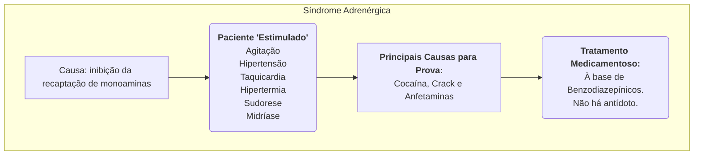
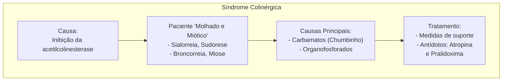
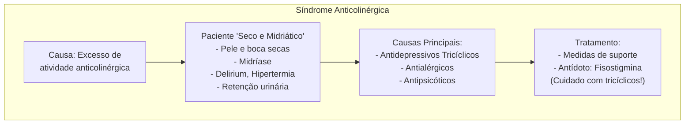
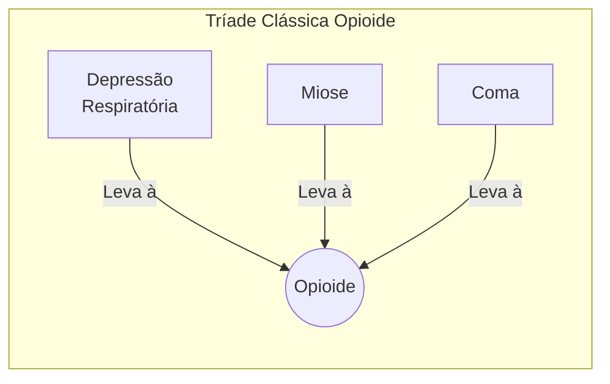

Olá! Com certeza. Preparei um resumo detalhado do material para ser usado no Obsidian, seguindo todas as suas especificações.

Para manter a clareza e a organização, dividirei o conteúdo em várias mensagens, começando pelos tópicos introdutórios.

---

### **Parte 1: Introdução e Medidas Gerais**

### **1.0 Introdução**

-   **Relevância do Tema**: O estudo das intoxicações exógenas é fundamental, pois envolve uma vasta gama de medicamentos e substâncias, sendo um tema interdisciplinar na medicina.
-   **Prevalência em Provas**: É um assunto extremamente comum em provas de Residência Médica. Uma análise (engenharia reversa) de provas de R 1 entre 2014 e 2023 mostra que "Intoxicações Exógenas" é o segundo tema mais cobrado em Psiquiatria, com 17,15% das questões, ficando atrás apenas de "Dependência Química" (21,50%).
-   **Foco do Material**: O objetivo é capacitar o estudante a:
    -   Identificar a substância responsável pela intoxicação.
    -   Reconhecer as principais toxíndromes.
    -   Realizar a abordagem clínica adequada.
    -   Empregar o tratamento direcionado e o antídoto específico quando houver.

| Tema em Psiquiatria (R 1 2014-2023) | Prevalência |
| :--- | :--- |
| 1º Dependência química | 21,50% |
| **2º Intoxicações Exógenas** | **17,15%** |
| 3º Transtornos do humor | 16,80% |
| 4º Psiquiatria infantil | 10,25% |
| 5º Psicofarmacologia | 9,30% |
| 6º Transtornos ansiosos | 5,25% |
| 7º Reforma Psiquiátrica e Psiquiatria Social | 5,10% |
| 8º TOC, Transtornos somáticos, dissociativos e do estresse | 5,00% |
| 9º Transtornos Psicóticos | 4,05% |
| 10º Transtornos alimentares | 2,70% |
| 11º Psicopatologia | 2,05% |
| 12º Transtornos de personalidade | 0,85% |
| **TOTAL** | **100,00%** |

### **2.0 Intoxicações Exógenas**

-   **Definições Importantes**:
    -   **Tóxico**: Do latim *toxicum*, refere-se a qualquer substância que produz efeitos nocivos em um organismo, podendo levar a doença ou morte.
    -   **Toxicologia**: É o estudo dos efeitos (agudos e crônicos) de substâncias químicas nos organismos e no ambiente.
    -   **Intoxicação Exógena**: É um conjunto de sinais e sintomas, agudos ou crônicos, que surgem após a exposição a um agente tóxico.
    -   **Toxíndrome**: É um conjunto de sinais e sintomas característicos que pode ser produzido por uma ou mais substâncias. Diferentes agentes podem causar a mesma toxíndrome.

#### **2.1 Avaliação das Intoxicações Exógenas**

-   **Desafios na Avaliação**: A identificação do agente tóxico pode ser difícil devido ao ambiente de emergência, desespero de familiares e colaboração reduzida do paciente.
-   **Mnemônico dos "5 Ws"**: Uma ferramenta para guiar a coleta de informações essenciais.
    -   **Who? (Quem?)**: Identificar o paciente, seu histórico de saúde, ocupação, situação social e tratamentos atuais.
    -   **What? (O quê?)**: Tentar identificar a substância. Familiares notaram a falta de algum medicamento? Há acesso a alguma substância específica?
    -   **When? (Quando?)**: Determinar o tempo decorrido desde a intoxicação. Isso é crucial para decidir sobre a utilidade dos métodos de descontaminação e para inferir a velocidade e intensidade dos efeitos.
    -   **Where? (Onde?)**: Investigar o local da intoxicação. Podem ser encontradas pistas como cartelas de medicamentos vazias, seringas ou cartas de despedida.
    -   **Why? (Por quê?)**: Identificar a causa/motivação. É fundamental para indicar cuidados futuros, como a avaliação psiquiátrica em casos de tentativa de suicídio.

### **3.0 Medidas Gerais**

#### **3.1 Descontaminação de Superfícies**

-   **Absorção Sistêmica**: Muitos tóxicos podem ser absorvidos pela pele e mucosas.
-   **Procedimentos**:
    -   **Pele**: Remover as roupas do paciente e lavar a pele abundantemente com água ou soro fisiológico. Substâncias corrosivas devem ser manuseadas com cuidado para evitar agravar as lesões.
        -   **"Neutralização Química"**: Tratar uma substância ácida com uma básica (ou vice-versa) é **raramente indicada**, pois pode piorar a lesão.
    -   **Olhos**: Realizar lavagem com soro fisiológico ou água corrente. Se necessário, pode-se administrar um colírio anestésico antes do procedimento.
    -   **Inalação (fumaça, aerossóis, vapores)**:
        -   Fornecer medidas de suporte, como oxigênio umidificado.
        -   Considerar entubação orotraqueal se houver sinais de alarme.
        -   **Sinais de Alarme**: Queimadura de pelos faciais, voz rouca, edema de vias aéreas, alterações na ausculta pulmonar ou esforço respiratório.

#### **3.2 Descontaminação Gastrintestinal**

-   **Objetivo**: Retirar o agente tóxico ingerido antes da absorção sistêmica.
-   **Janela de Tempo**: A eficácia é limitada. O ideal é realizar o procedimento **antes de 60 minutos** após a ingestão, sendo aceitável até **2 horas**.
-   **Métodos**:
    -   **Indução de Vômitos**:
        -   Atualmente possui poucas indicações, pois o carvão ativado é mais seguro e eficaz.
        -   Pode ser considerado em situações pré-hospitalares onde o socorro médico demorará.
        -   O **Xarope de Ipeca** pode ser usado, mas seu uso pode causar broncoaspiração e piorar o quadro clínico.
        -   **Contraindicações**: Pacientes sedados, com convulsões ou que ingeriram agentes corrosivos.
    -   **Lavagem Gástrica**:
        -   Consiste na introdução de uma sonda nasogástrica de grosso calibre para infundir soro fisiológico e aspirar o conteúdo gástrico repetidamente.
        -   É mais útil para substâncias líquidas; pode não aspirar comprimidos.
        -   **Riscos**: Perfuração do trato digestivo e broncoaspiração.
        -   **Contraindicações**: Ingestão de agentes corrosivos, hematêmese, varizes esofagianas. Em pacientes sedados ou com convulsões, a via aérea deve ser protegida antes do procedimento.
    -   **Carvão Ativado**:
        -   É o método mais seguro e eficaz.
        -   Trata-se de um pó com poros que **adsorvem** e neutralizam toxinas, reduzindo a absorção sistêmica.
        -   Pode ser ingerido por via oral ou administrado por sonda gástrica.
        -   **Efeitos Adversos**: Impactação intestinal, vômitos e broncoaspiração. Pode prejudicar a visualização em uma futura endoscopia.
        -   **Contraindicações**: Em pacientes sedados ou convulsivos, a via aérea deve ser protegida.

| Substâncias Pouco Adsorvidas pelo Carvão Ativado |
| :--- |
| Lítio |
| Ferro |
| Potássio |
| Etanol |
| Cianeto |
| Ácidos e Álcalis (corrosivos) |
| Metais Pesados |

-   **Carvão Ativado em Doses Múltiplas**: Pode ser útil no tratamento de intoxicações por:
    -   Cafeína
    -   Fenitoína
    -   Fenobarbital
    -   Carbamazepina
    -   Dapsona

#### **3.3 Outras Medidas de Eliminação de Toxinas**

-   **Alcalinização Urinária**:
    -   Usa-se bicarbonato de sódio para manter o pH urinário > 7,5.
    -   Isso facilita a formação de sal do tóxico, impedindo sua reabsorção renal.
    -   **Útil em intoxicações por**: Fenobarbital, metotrexato e salicilatos.
-   **Lavagem Intestinal**:
    -   Usa-se um catártico (ex: polietilenoglicol) via sonda nasoenteral para acelerar a eliminação da toxina.
    -   **Indicações**: Intoxicações maciças por substâncias não adsorvíveis pelo carvão ativado ou em *body packers* ("pacotes de droga").
-   **Hemodiálise**:
    -   Indicada para pacientes graves que não respondem às medidas de suporte.
    -   **Critérios para um tóxico ser dialisável**:
        -   Peso molecular < 500 daltons
        -   Baixo volume de distribuição
        -   Hidrossolubilidade
        -   Pouca ligação com proteínas plasmáticas
    -   **Substâncias dialisáveis**: Aciclovir, fenobarbital, etanol, metanol, salicilatos, paracetamol e lítio.

---
Combinado! Segue o resumo completo e detalhado de todo o material, formatado para o Obsidian.

---

### **Parte 2: Principais Toxíndromes**

### **4.0 Principais Toxíndromes**

#### **4.1 Síndrome Adrenérgica (Simpatomimética)**

-   **Causa**: Desencadeada por um aumento intenso do tônus simpático adrenérgico, devido à ação de catecolaminas (adrenalina, noradrenalina, dopamina) e serotonina. Essencialmente, é uma inibição da recaptação de monoaminas.
-   **Agentes Causadores Principais**:
    -   **Anfetaminas, Cocaína e Crack**: São os mais relevantes para provas.
        -   **Efeitos Adicionais da Cocaína/Crack**: Bloqueiam os canais de sódio nas fibras nervosas, causando efeitos anestésicos e cardiotóxicos (depressão da condução cardíaca, prolongamento do QRS, arritmias graves).
    -   **Outros Medicamentos**: Antidepressivos IMAO, xantinas (cafeína, teofilina), derivados da efedrina (pseudoefedrina), nafazolina, agonistas dopaminérgicos.

-   **4.2 Quadro Clínico**: Caracterizado por um estado de "estímulo".
    -   **Sintomas Principais**: Agitação psicomotora, taquicardia, hipertensão, hipertermia, sudorese excessiva, hiperreflexia, **midríase** (pupilas dilatadas), cefaleia, náuseas e vômitos.
    -   **Casos Graves**: Arritmias cardíacas, dor torácica, infarto agudo do miocárdio (IAM), rebaixamento do nível de consciência, sintomas psicóticos, *delirium*, convulsões, rabdomiólise (por agitação motora), insuficiência renal aguda, AVC.
    -   **Efeito Paradoxal da Nafazolina**: Especialmente em crianças, pode causar efeitos simpatolíticos (hipotensão, bradicardia, depressão respiratória) devido à sua ação em receptores alfa-2 centrais.

-   **4.3 Diagnóstico**:
    -   **Clínico**: Baseado nos sinais e sintomas.
    -   **Pistas Adicionais**: Marcas de agulhas (uso endovenoso), lesões de septo nasal (cocaína aspirada), queimaduras nos dedos (uso de cachimbos de crack).
    -   **Alerta de Prova**: A suspeita deve ser alta em casos de **IAM em pacientes jovens** sem comorbidades ou histórico de cardiopatia.

-   **4.4 Tratamento**:
    -   **Não há antídoto específico**. O tratamento é de suporte e sintomático.
    -   **Medidas Gerais**: Hidratação e correção da hipertermia.
    -   **Agitação e Sintomas Psicóticos**:
        -   **Primeira Linha**: **Benzodiazepínicos**. Eles sedam, reduzem a excitação, diminuem a pressão arterial, melhoram a taquicardia e previnem convulsões e rabdomiólise.
        -   **Segunda Linha**: Haloperidol (antipsicótico típico) pode ser usado se não houver resposta aos benzodiazepínicos, mas com **cuidado**, pois pode precipitar convulsões.
    -   **Hipertensão Arterial Não Controlada**: Usar antagonistas dos canais de cálcio ou nitratos.
        -   **EVITAR BETABLOQUEADORES**: Especialmente os não seletivos, pois podem agravar a hipertensão ao deixar os receptores alfa sem a contraposição dos receptores beta, causando vasoconstrição coronariana. Esse fenômeno é conhecido como **"hipertensão paradoxal"**.
    -   **Alargamento do QRS (>100 ms) ou Acidose Metabólica**:
        -   **Bicarbonato de Sódio**: Corrige a acidose e a entrada de íons de sódio pode reverter os efeitos de depressão de membrana causados pelo bloqueio de canais de sódio. Indicado também para hipotensão e arritmias ventriculares.

---

#### **4.5 Síndrome Colinérgica (Anticolinesterásica)**

-   **Causa**: Inibição da enzima **acetilcolinesterase**, que é responsável pela degradação da acetilcolina. O acúmulo de acetilcolina leva a uma hiperestimulação dos receptores muscarínicos e nicotínicos.
-   **Agentes Causadores Principais**:
    -   **Pesticidas**: Carbamatos ("chumbinho") e Organofosforados (OF).
        -   **Carbamatos**: Inibição **temporária e reversível** da acetilcolinesterase. Efeitos duram menos de 24 horas e têm menor penetração no SNC.
        -   **Organofosforados**: Ligação **forte e duradoura** com a acetilcolinesterase. São muito lipossolúveis, atravessam facilmente a barreira hematoencefálica (causando mais efeitos no SNC) e se depositam em tecido gorduroso, podendo levar a uma intoxicação prolongada ("síndrome intermediária").
    -   **Agrotóxicos, inseticidas, rodenticidas**.
    -   **Medicações**: Donepezila, rivastigmina, galantamina (tratamento de Alzheimer), piridostigmina (tratamento de Miastenia Gravis).

-   **4.6 Quadro Clínico**: Caracterizado por um paciente **"molhado e miótico"**. O excesso de secreções é a marca da síndrome.
    -   **Efeitos Muscarínicos (Mnemônico DUMBELS)**:
        -   **D**iarrhea / **D**iaphoresis (sudorese)
        -   **U**rination (incontinência urinária)
        -   **M**iosis (**miose** puntiforme - "cabeça de alfinete")
        -   **B**ronchorrhea (hipersecreção brônquica) / **B**ronchospasm / **B**radycardia
        -   **E**mesis (vômitos)
        -   **L**acrimation (lacrimejamento)
        -   **S**alivation (sialorreia)
    -   **Efeitos Nicotínicos**: Fasciculações, tremores, fraqueza muscular e taquicardia.
    -   **Risco de Morte**: A principal causa de óbito é a **insuficiência respiratória**, causada pela combinação de broncoespasmo, broncorreia e fraqueza da musculatura torácica.

-   **4.7 Diagnóstico**:
    -   **Clínico**: O quadro de um paciente "molhado" é muito sugestivo.
    -   **Pistas Adicionais**: História de exposição em meio rural, odor de alho (típico de alguns organofosforados).

-   **4.8 Tratamento**:
    -   **Medidas de Suporte**: O mais importante é garantir a via aérea e a ventilação.
    -   **Antídotos Específicos**:
        -   **Atropina (1ª linha)**:
            -   É um antagonista muscarínico. Controla a hipersecreção.
            -   Administrada por via endovenosa em doses escalonadas (1 a 5 mg a cada 5 minutos, dobrando a dose se necessário).
            -   O objetivo é atingir a **"atropinização adequada"**, que é o **controle da broncorreia**, melhorando o broncoespasmo e a oxigenação. A frequência cardíaca e o tamanho da pupila **não** são os parâmetros principais para guiar a dose.
        -   **Pralidoxima (2ª linha)**:
            -   É uma oxima que **reativa a acetilcolinesterase**.
            -   Reduz os efeitos muscarínicos e, principalmente, os nicotínicos (fraqueza muscular).
            -   Seu benefício é controverso e está associado ao risco de arritmias.
            -   Seu uso deve ser reservado para casos graves e refratários de intoxicação por **organofosforados**, pois na intoxicação por carbamatos a inibição já é reversível e menos intensa.

---

#### **4.9 Síndrome Anticolinérgica**

-   **Causa**: Resultado de uma intensa ação anticolinérgica **muscarínica**, bloqueando a ação da acetilcolina em diversos sistemas. É o oposto da síndrome colinérgica.
-   **Agentes Causadores**:
    -   Antidepressivos tricíclicos (amitriptilina, imipramina)
    -   Anti-histamínicos
    -   Antiespasmódicos
    -   Relaxantes musculares
    -   Antipsicóticos (clorpromazina)
    -   Biperideno, prometazina.
    -   **Carbamazepina**: Um anticonvulsivante que também possui efeitos anticolinérgicos proeminentes, causando uma toxíndrome semelhante.

-   **4.10 Quadro Clínico**: Paciente **"seco e midriático"**.
    -   **Mnemônico**: *"Louco como uma lebre, cego como um morcego, vermelho como um pimentão, quente como uma pedra e seco como um osso."*
    -   **Sintomas Principais**:
        -   **SNC**: *Delirium*, alucinações, agitação ("louco").
        -   **Ocular**: **Midríase** (pupilas dilatadas), visão turva ("cego").
        -   **Pele**: Rubor facial, pele seca ("vermelho" e "seco").
        -   **Temperatura**: Hipertermia (por incapacidade de dissipar calor via suor) ("quente").
        -   **Outros**: Taquicardia, boca seca, constipação intestinal, retenção urinária.
    -   **Casos Graves (especialmente com Tricíclicos)**: Convulsões, alargamento do intervalo QRS, arritmias cardíacas, acidose metabólica, choque e hipotensão (por bloqueio alfa-adrenérgico).

-   **4.11 Diagnóstico**:
    -   **Clínico**: Baseado na história e nos achados do exame físico.
    -   **Pistas Adicionais**: Frequente em tentativas de suicídio com psicofármacos. A presença de **alargamento de QRS** no ECG é um forte indicador de intoxicação por tricíclicos.

-   **4.12 Tratamento**:
    -   **Medidas de Suporte**: Hidratação, controle da hipertermia.
    -   **Convulsões**: Benzodiazepínicos.
    -   **Alargamento de QRS ou Acidose Metabólica**: **Bicarbonato de Sódio**.
    -   **Antídoto**: **Fisostigmina**.
        -   É um carbamato (inibidor da acetilcolinesterase) que aumenta os níveis de acetilcolina.
        -   Pode ser usada em casos graves de síndrome anticolinérgica, especialmente com *delirium* ou psicose.
        -   **CUIDADO**: Deve ser **evitada** se a intoxicação for por **antidepressivos tricíclicos**, devido ao alto risco de precipitar arritmias cardíacas graves.
        -   **Neostigmina**: Outro carbamato, mas não atravessa bem a barreira hematoencefálica, não sendo útil para os sintomas centrais da síndrome.

#### **4.13 Síndrome Narcótica (Opioide)**

-   **Causa**: Depressão do sistema nervoso central causada por opioides, que se ligam a receptores específicos (Mu, Kappa, Delta, etc.).
-   **Agentes Causadores**:
    -   **Naturais (Opiáceos)**: Ópio, morfina, codeína.
    -   **Semissintéticos**: Heroína, oxicodona.
    -   **Sintéticos**: Metadona, fentanil, tramadol.

-   **4.14 Quadro Clínico**:
    -   **Sintomas Principais**: Letargia, sonolência, bradicardia, hipotensão, náuseas, vômitos.
    -   **Miose**: A pupila fica puntiforme, descrita como **"cabeça de alfinete"**.
    -   **Casos Graves**: Depressão respiratória, arritmias cardíacas, choque e coma.
    -   **Causa de Óbito**: Combinação de rebaixamento intenso do nível de consciência com aspiração brônquica de vômitos.

-   **4.15 Diagnóstico**:
    -   Baseado nos achados clínicos.
    -   A suspeita deve ser considerada em todo paciente com a **tríade clássica da intoxicação por opioides**:
        1.  **Depressão respiratória**
        2.  **Rebaixamento do nível de consciência (coma)**
        3.  **Miose**

-   **4.16 Tratamento**:
    -   **Suporte Ventilatório**: Essencial.
    -   **Antídoto**: **Naloxona**.
        -   É um antagonista dos receptores opioides.
        -   Administrar preferencialmente por via endovenosa (0,4 a 2 mg a cada 2-3 minutos) até obter resposta.
        -   Pode também ser administrada por via IM, SC, intranasal ou endotraqueal.
        -   **Terapia Empírica**: Pode ser administrada quando a causa do coma é desconhecida.
        -   **Cuidado**: Em pacientes dependentes de opioides, a naloxona pode desencadear uma síndrome de abstinência aguda.
        -   **Meia-vida Curta**: A naloxona tem meia-vida de ~2 horas, podendo ser necessárias aplicações repetidas para manter o efeito terapêutico.
    -   **Convulsões**: Benzodiazepínicos.

---

#### **4.17 Síndrome Hipnossedativa**

-   **Causa**: Depressão neurológica e respiratória por efeito de drogas sedativas, ansiolíticas e hipnóticas, que geralmente agem no sistema GABAérgico.
-   **Agentes Causadores**:
    -   **Benzodiazepínicos** (diazepam, clonazepam, etc.)
    -   **Drogas Z** (zolpidem, eszopiclona)
    -   **Barbitúricos** (fenobarbital)

-   **4.18 Quadro Clínico**:
    -   **Sintomas Principais**: Sedação, "fala arrastada", nistagmo, hipotensão e ataxia cerebelar.
    -   **Casos Graves**: Hiporreflexia, hipotermia, parada respiratória e coma.
    -   **Alteração Pupilar**: **Raramente ocorre**. A ausência de miose ajuda a diferenciar da intoxicação por opioides.

-   **4.19 Diagnóstico**:
    -   Difícil de distinguir clinicamente de outras síndromes depressoras (ex: intoxicação alcoólica).
    -   **Diagnóstico Diferencial**:
        -   Se houver **miose**, a origem é provavelmente **narcótica**.
        -   Se não houver resposta clínica à administração de **naloxona**, a intoxicação tem outras causas (provavelmente hipnossedativa ou alcoólica).

-   **4.20 Tratamento**:
    -   **Intoxicação por Barbitúricos**:
        -   **Não há antídoto**.
        -   Manejo com administrações repetidas de carvão ativado (devido à recirculação êntero-hepática).
        -   Em casos graves, hemodiálise.
    -   **Intoxicação por Benzodiazepínicos ou Drogas Z**:
        -   **Antídoto**: **Flumazenil**.
        -   Administrar por via endovenosa (iniciar com 0,1 a 0,2 mg).
        -   **CUIDADO - NÃO USAR DE FORMA EMPÍRICA**:
            -   O flumazenil pode precipitar **convulsões graves**, especialmente em pacientes epiléticos ou se houver co-ingestão de fármacos que reduzem o limiar convulsivo (como antidepressivos tricíclicos).
            -   Pode precipitar uma **síndrome de abstinência aguda grave** em pacientes dependentes.

---

#### **4.21 Resumo das Principais Toxíndromes**

| Síndrome | Freq. Resp. | Temperatura | Pupila | Sudorese |
| :--- | :--- | :--- | :--- | :--- |
| **Anticolinérgica** | Normal/Aumentada | **Aumentada** | **Midríase** | **Diminuída (pele seca)** |
| **Colinérgica** | Normal/Diminuída | Normal | **Miose** | **Aumentada** |
| **Narcótica** | **Diminuída** | **Diminuída** | **Miose** | **Diminuída** |
| **Adrenérgica** | **Aumentada** | **Aumentada** | **Midríase** | **Aumentada** |
| **Hipnossedativa** | **Diminuída** | **Diminuída** | Normal | **Diminuída** |

---

### **Parte 3: Intoxicações por Outras Drogas e Agrotóxicos**

### **5.0 Intoxicações Exógenas por Outras Drogas**

#### **5.1 Intoxicação por Paracetamol (Acetaminofeno)**

-   **Contexto**: Um dos medicamentos mais consumidos no mundo.
-   **Quadro Clínico**:
    -   **Leve/Moderado**: Sintomas gastrointestinais (náuseas, vômitos, diarreia).
    -   **Grave (após 24-48 h)**: **Hepatite fulminante**, acidose lática, distúrbios de coagulação, encefalopatia e morte.
    -   **Dose Tóxica**: >150-200 mg/kg (crianças) ou >7-10 gramas (adultos).
-   **Mecanismo de Toxicidade**: O metabólito **NAPQI** (N-acetil-p-benzoquinonaimina) é altamente tóxico e causa lesão nos hepatócitos.
-   **5.2 Tratamento**:
    -   **Antídoto**: **N-acetilcisteína (NAC)**. Deve ser iniciado o mais rápido possível, preferencialmente **até 12 horas** após a intoxicação.
    -   **Administração do NAC**: Dose de ataque de 140 mg/kg e manutenção de 70 mg/kg, geralmente por 72 horas. Pode ser administrado por via oral ou endovenosa.
    -   **Casos Extremos**: Hemodiálise pode ser indicada.

#### **5.3 Intoxicação por Lítio**

-   **Contexto**: Estabilizador de humor com janela terapêutica estreita.
-   **Níveis Séricos**:
    -   Terapêutico: 0,6 a 1,2 mEq/L
    -   Tóxico Leve/Moderado: 1,2 a 2,5 mEq/L
    -   Tóxico Grave: 2,5 a 4 mEq/L
    -   Risco de Morte: > 4 mEq/L
-   **5.4 Diagnóstico (Intoxicação Aguda)**: O quadro clínico inclui tremores, ataxia, rigidez muscular, náuseas, vômitos, diarreia e um característico **"gosto metálico na boca"**.
    -   **Intoxicação Crônica**: Pode levar a insuficiência renal, diabetes insípido nefrogênico e hipotireoidismo.
-   **5.5 Tratamento**:
    -   **Não há antídoto específico**. O tratamento é de suporte.
    -   **Descontaminação**: Carvão ativado **NÃO** adsorve o lítio. Lavagem gástrica pode ser tentada em ingestões recentes.
    -   **Casos Extremos**: **Hemodiálise** é o tratamento de escolha.

#### **5.6 Intoxicação por Cianeto**

-   **Contexto**: Substância de alta toxicidade encontrada na mandioca-brava, caroço de damasco e na combustão de plásticos e borrachas.
-   **Mecanismo**: Age como asfixiante químico, **inibindo a utilização aeróbia do oxigênio**.
-   **5.7 Diagnóstico**: Suspeitar em pacientes em coma com acidose metabólica em cenários de incêndio. O **cheiro de "amêndoa amarga"** é característico.
-   **5.8 Tratamento**:
    -   **Antídotos**: **Hidroxicobalamina** (primeira escolha) ou **nitritos e tiossulfato**.

#### **5.9 Intoxicação por Salicilatos (AAS)**

-   **Quadro Clínico**: Náuseas, vômitos, dor abdominal. Em casos graves, pode ocorrer hipoglicemia, hiperpneia (respiração rápida e profunda), letargia, acidose metabólica e convulsões.
-   **5.10 Tratamento**:
    -   **Descontaminação**: Lavagem gástrica e carvão ativado (inclusive doses repetidas).
    -   **Alcalinização urinária**: Para aumentar a excreção.
    -   **Casos Extremos**: Hemodiálise.

#### **5.11 Intoxicação por Hidrocarbonetos (gasolina, querosene)**

-   **Contexto**: Ingestão oral não causa absorção sistêmica relevante. O principal risco é a aspiração.
-   **O que NÃO fazer**:
    -   Não administrar carvão ativado.
    -   Não realizar lavagem gástrica.
    -   Não induzir vômitos.
-   **Conduta**: Observação clínica por 6 a 12 horas e medidas de suporte, com atenção para o surgimento de sintomas respiratórios (pneumonite química).

#### **5.12 Intoxicação por Metanol**

-   **Contexto**: Álcool tóxico encontrado em solventes e fluidos anticongelantes.
-   **Mecanismo**: Metabolizado a **formaldeído** e **ácido fórmico**, que causam acidose metabólica grave, **cegueira** e morte.
-   **Tratamento**:
    -   **Antídotos**: **Fomepizol** ou **Etanol**. Eles competem pelo álcool desidrogenase, impedindo a metabolização do metanol.
    -   **Casos Graves**: Hemodiálise.

#### **5.13 Intoxicação por Ferro**

-   **Quadro Clínico**: Vômitos, diarreia, sangramento gastrointestinal. Casos graves evoluem para insuficiência hepática, acidose metabólica e coma.
-   **Tratamento**:
    -   Carvão ativado **NÃO** é útil.
    -   **Quelante**: **Deferoxamina**.
    -   Hemodiálise não é eficaz.

#### **5.14 Intoxicação por Metais Pesados (chumbo, mercúrio)**

-   **Quadro Clínico**: Efeitos no SNC, depressão respiratória, sintomas gastrointestinais. Um sinal clássico da intoxicação por chumbo são as **"cólicas de chumbo"**.
-   **Tratamento**:
    -   **Antídotos (Quelantes)**: **EDTA**, **Dimercaprol (BAL)**.

#### **5.15 Intoxicação por Antidiabéticos e Hipoglicemiantes**

-   **Quadro Clínico**: Sintomas decorrentes da **hipoglicemia** (agitação, confusão, sudorese, convulsões).
    -   **Metformina**: Em intoxicações graves, pode causar **acidose lática**.
-   **Tratamento**:
    -   Reposição de glicose endovenosa.
    -   **Intoxicação por Sulfonilureia**: **Octreotida** pode ser útil.
    -   Descontaminação gástrica em casos recentes.

#### **5.16 Intoxicação por Betabloqueadores e Antagonistas dos Canais de Cálcio (ACC)**

-   **Quadro Clínico**: **Hipotensão** e **bradicardia**.
    -   **Intoxicação por ACC**: Pode haver **hiperglicemia** associada (devido à redução da liberação de insulina).
-   **Tratamento**:
    -   **Intoxicação por ACC**: **Gluconato de cálcio**.
    -   **Bradicardia/Hipotensão Refratária (em ambos)**: **Glucagon**.
    -   **Alargamento de QRS**: Bicarbonato de sódio.

#### **5.17 Intoxicação por Anticoagulantes (cumarínicos, "chumbinho")**

-   **Mecanismo**: Antagonismo da vitamina K, levando a sangramentos.
-   **Tratamento**:
    -   **Antídoto**: **Vitamina K₁ (fitomenadiona)**.

#### **5.18 Intoxicação por Agrotóxicos Específicos**

-   **Organoclorados**:
    -   Uso banido no Brasil desde os anos 80 (alta toxicidade, bioacumulação).
    -   São lipossolúveis, atravessam a barreira hematoencefálica e causam **sintomas neurológicos** (cefaleia, tremores, convulsões, rebaixamento de consciência).
    -   **Tratamento**: Medidas de suporte. Não há antídoto.
-   **Piretroides**:
    -   Derivados de piretrinas (encontradas em crisântemos).
    -   Causam reações alérgicas e lesões de pele. Em casos graves, sintomas no SNC.
    -   **Tratamento**: Medidas de suporte. Não há antídoto.
    -   **Diferenciar**: **Organofosforados** causam síndrome **colinérgica**. **Organoclorados** causam sintomas **neurológicos**.

---

### **Sumário dos Principais Tóxicos e Antídotos**

| Tóxico / Síndrome                                      | Antídoto (s)                             |
| :----------------------------------------------------- | :--------------------------------------- |
| **Anticoagulantes** (cumarínicos, varfarina)           | Vitamina K 1                             |
| **Benzodiazepínicos e Drogas Z**                       | Flumazenil                               |
| **Betabloqueadores / Antagonistas de Cálcio**          | Glucagon, Gluconato de Cálcio (ACC)      |
| **Cianeto**                                            | Hidroxicobalamina, Nitritos, Tiossulfato |
| **Metais Pesados** (chumbo, mercúrio)                  | EDTA, Dimercaprol (BAL)                  |
| **Metanol / Etilenoglicol**                            | Fomepizol, Etanol                        |
| **Opioides**                                           | Naloxona, Nalmefeno                      |
| **Paracetamol** (Acetaminofeno)                        | N-acetilcisteína (NAC)                   |
| **Síndrome Anticolinérgica**                           | Fisostigmina                             |
| **Síndrome Colinérgica** (Organofosforados/Carbamatos) | Atropina, Pralidoxima                    |
| **Digoxina**                                           | Anticorpo antidigoxina                   |
| **Ferro**                                              | Deferoxamina                             |
| **Metemoglobinemia**                                   | Azul de metileno                         |
| **Isoniazida**                                         | Piridoxina (Vitamina B 6)                |
| **Sulfonilureias**                                     | Octreotida                               |