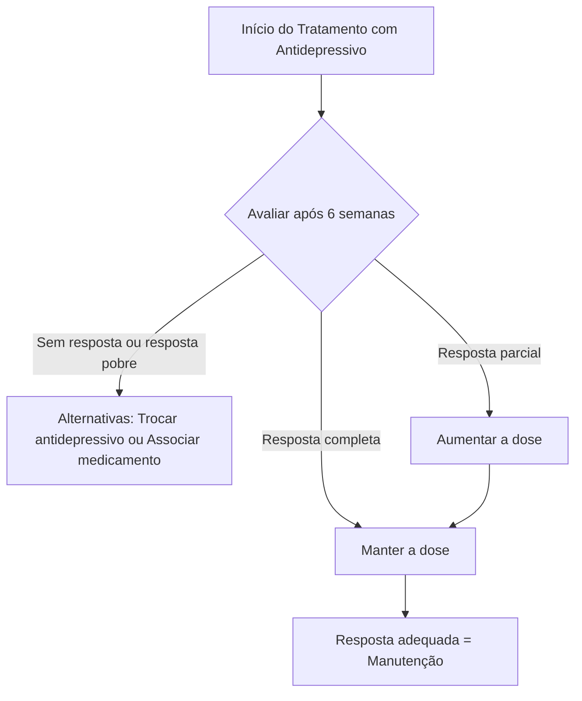
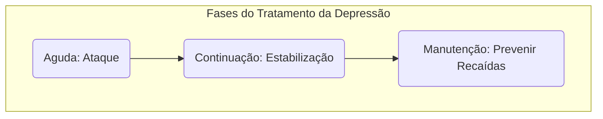

Olá! Com certeza. Preparei uma aula completa e detalhada baseada no seu material, formatada para o Obsidian. O conteúdo foi dividido para facilitar a leitura e a importação.

Aqui está a primeira parte.

***

# 1.0 Psicofarmacologia

A psicofarmacologia é uma área complexa que estuda o mecanismo de ação, indicações, contraindicações e efeitos colaterais dos psicofármacos. Nas provas de residência, o foco costuma ser nos pontos mais práticos e relevantes para a clínica.

**Engenharia Reversa Psiquiatria (R 1 2014-2023)**

| Tema | Incidência |
| :--- | :--- |
| 1º Dependência Química | 21,50% |
| 2º Intoxicações Exógenas | 17,15% |
| 3º Transtornos do Humor | 16,80% |
| 4º Psiquiatria Infantil | 10,25% |
| 5º Psicofarmacologia | 9,30% |
| 6º Transtornos Ansiosos | 5,25% |
| 7º Reforma Psiquiátrica e Psiquiatria Social | 5,10% |
| 8º TOC, Transtornos somáticos, Dissociativos e do Estresse | 5,00% |
| 9º Transtornos Psicóticos | 4,05% |
| 10º Transtornos Alimentares | 2,70% |
| 11º Psicopatologia | 2,05% |
| 12º Transtornos de Personalidade | 0,85% |
| **Total** | **100,00%** |

---
## 1.1 Antidepressivos

- **Definição**: Antidepressivos são fármacos usados para tratar diversos transtornos psiquiátricos (depressão, ansiedade, TOC) e condições clínicas (síndromes dolorosas, transtornos gastrointestinais, etc.).
- **Classificação**: São divididos em classes conforme seu perfil de ação farmacodinâmica, embora a eficácia entre as classes seja semelhante para os principais tratamentos.

### 1.1.1 Inibidores Seletivos da Recaptação de Serotonina (ISRS)
- **Mecanismo de Ação**: Atuam inibindo a recaptação do neurotransmissor serotonina na fenda sináptica, aumentando sua disponibilidade.
- **Indicações e Perfil**:
    - São considerados **medicações de primeira linha** para quadros depressivos, ansiosos e obsessivos.
    - Possuem um perfil favorável com **poucos efeitos colaterais**, alta tolerabilidade e **baixa interação farmacológica**.
    - São a **classe de escolha** para a maioria dos pacientes, especialmente:
        - Idosos.
        - Pacientes com comorbidades.
        - Pacientes em uso de polifarmácia.
- **Efeitos Colaterais Comuns**:
    - Alterações de apetite.
    - Sintomas gastrointestinais (náuseas, diarreia).
    - Alterações de sono (insônia ou sonolência).
    - Ansiedade (principalmente no início do tratamento).
    - Sedação.
    - **Redução da libido** e outras disfunções sexuais (anorgasmia, retardo ejaculatório).
    - *Nota*: Geralmente, esses efeitos são brandos, autolimitados e não exigem a descontinuação do tratamento.

**Principais ISRS**
- **Citalopram**:
    - **Interações**: Possui poucas interações medicamentosas, sendo uma excelente opção para idosos e polimedicados.
    - **Meia-vida**: Superior a 30 horas.
    - **Dose Terapêutica**: 10 mg a 40 mg/dia.
- **Escitalopram**:
    - **Características**: É a forma ativa (enantiômero S) do citalopram, com perfil farmacológico similar.
    - **Dose Terapêutica**: 5 mg a 20 mg/dia.
    - **Atenção**: Em doses elevadas, tanto o Citalopram quanto o Escitalopram podem causar **prolongamento do intervalo QT**, um evento raro, mas clinicamente relevante.
- **Fluoxetina**:
    - **Meia-vida**: Possui **meia-vida longa** (até 2 semanas, considerando seus metabólitos ativos), o que reduz o risco de sintomas de retirada.
    - **Efeitos Iniciais**: Pode causar ansiedade e insônia no início do tratamento, tendo um perfil mais "ativador".
    - **Interações**: Apresenta um número maior de interações farmacológicas em comparação com outros ISRS.
    - **Gestação e Amamentação**: É considerada **segura** nessas fases, sendo uma das preferenciais por ter mais estudos de segurança.
    - **Dose Terapêutica**: 10 mg a 80 mg/dia.
- **Paroxetina**:
    - **Perfil de Ação**: Além do efeito serotoninérgico, possui ações **anticolinérgicas** e **noradrenérgicas**.
    - **Meia-vida**: Inferior a 24 horas, o que aumenta o risco de **sintomas de retirada** se a tomada não for regular ou a suspensão for abrupta.
    - **Características**: Tem um perfil mais **sedativo**.
    - **Efeitos Colaterais**: Causa **maior prejuízo da libido** entre os ISRS.
    - **Populações Especiais**: **Não é ideal para idosos** devido ao seu efeito anticolinérgico.
    - **Dose Terapêutica**: 10 mg a 60 mg/dia.
- **Sertralina**:
    - **Segurança Cardiovascular**: Considerada muito **segura** do ponto de vista cardiovascular.
    - **Interações**: Interage pouco farmacologicamente.
    - **Meia-vida**: Superior a 30 horas.
    - **Gestação e Amamentação**: Também é considerada **segura** e preferencial nessas fases.
    - **Dose Terapêutica**: 50 mg a 200 mg/dia.

### 1.1.2 Antidepressivos Inibidores da Recaptação da Serotonina e Noradrenalina (IRSN)
- **Mecanismo de Ação**: Também conhecidos como "duais", inibem a recaptação de serotonina e noradrenalina na fenda sináptica.
- **Indicações**: Possuem as mesmas indicações dos ISRS, sendo também considerados **medicamentos de primeira linha**.
- **Nota para Provas**: Se uma questão apresentar a opção de usar um ISRS ou um IRSN, a resposta mais adequada **geralmente será o ISRS**, por serem mais antigos, mais acessíveis (distribuídos no SUS) e com mais estudos de segurança.

**Principais IRSN**
- **Venlafaxina**:
    - **Ação Dose-Dependente**: Em **doses baixas**, sua ação é predominantemente **serotoninérgica**. A ação noradrenérgica se torna mais significativa em doses mais altas.
    - **Meia-vida**: Curta (aprox. 5 horas), o que leva a frequentes **sintomas de retirada**.
    - **Interações**: Interage pouco com outras drogas, sendo útil em polifarmácia.
    - **Efeito Adverso**: Em doses elevadas, pode causar **hipertensão arterial**.
    - **Dose Terapêutica**: 75 mg a 225 mg/dia.
- **Desvenlafaxina**:
    - **Características**: É o metabólito ativo da venlafaxina.
    - **Dose Terapêutica**: 50 mg a 200 mg/dia.
- **Duloxetina**:
    - **Propriedades**: Possui ações antidepressivas, ansiolíticas e **analgésicas**, sendo útil em quadros de dor crônica (ex: fibromialgia, neuropatia diabética).
    - **Meia-vida**: 12 horas, também associada a **sintomas de retirada**.
    - **Efeito Adverso**: Em doses elevadas, pode causar aumento da pressão arterial.
    - **Dose Terapêutica**: 30 mg a 120 mg/dia.

### 1.1.3 Antidepressivos Inibidores da Monoamina Oxidase (IMAO)
- **Mecanismo de Ação**: Inibem a enzima monoaminoxidase (MAO), responsável pela degradação de neurotransmissores como serotonina, dopamina e noradrenalina.
- **Exemplos**: Selegilina, Tranilcipromina.
- **Indicações**: Associados a melhores resultados clínicos em casos de **depressões graves ou refratárias** (resistentes a outros tratamentos).
- **Limitações**:
    - São cada vez menos utilizados devido a um perfil de **efeitos colaterais intensos e potencialmente fatais**.
    - Requerem o cumprimento de uma **dieta específica**, com restrição de **tiramina**.
- **Efeito "Queijo" (Crise Hipertensiva)**:
    - A tiramina é um aminoácido presente em alimentos como queijos, embutidos, alguns peixes e vinhos.
    - Normalmente, a MAO no sistema digestivo degrada a tiramina.
    - Quando um paciente usa um IMAO, a tiramina não é degradada, é absorvida e, por ter potentes propriedades monoaminérgicas, causa **vasoconstrição intensa**, levando a um **aumento súbito e perigoso da pressão arterial** (emergência hipertensiva).

### 1.1.4 Antidepressivos Tricíclicos (ADTs)
- **Mecanismo de Ação Principal**: Bloqueiam a recaptação de serotonina e noradrenalina.
- **Mecanismo de Ação Adicional**: Agem em diversos outros receptores (acetilcolina, histamina, alfa-1 adrenérgicos), o que é responsável pela maioria de seus **efeitos colaterais**.
- **Metabolização**: É mais complexa e apresenta maior risco de interações medicamentosas.
- **Uso Atual**: Apesar de sua eficácia comprovada, vêm perdendo espaço para ISRS, duais e atípicos devido ao perfil de segurança desfavorável.
- **Efeito Analgésico**: Alguns representantes, como a **amitriptilina**, bloqueiam canais de sódio, conferindo um importante efeito analgésico, útil em quadros de dor crônica.

**Principais Efeitos Colaterais dos Tricíclicos**
- **Ação Anticolinérgica** (bloqueio muscarínico):
    - Piora cognitiva, *delirium* (especialmente em idosos).
    - Boca seca, constipação intestinal, retenção urinária.
    - Visão turva, aumento da pressão intraocular (contraindicado em **glaucoma de ângulo fechado**).
    - Arritmias cardíacas.
- **Ação Anti-histaminérgica** (bloqueio H 1):
    - Sedação intensa, sonolência.
    - Aumento do apetite e ganho de peso.
    - Piora do perfil metabólico.
    - Risco de quedas.
- **Bloqueio Alfa-1 Adrenérgico**:
    - Hipotensão postural (tontura ao levantar).
    - Quedas, síncope.
- **Bloqueio dos Canais de Sódio**:
    - Risco de arritmias cardíacas (alargamento do PR ou QT no ECG).
    - Em altas doses (intoxicação), pode causar convulsões e arritmias fatais.

> **Questão Clássica de Prova**: O antidepressivo com **maior risco de reações adversas em idosos** é a **Amitriptilina** (ou qualquer outro tricíclico), devido à combinação de efeitos anticolinérgicos, anti-histaminérgicos e bloqueio alfa-1, que aumentam o risco de quedas, confusão mental, constipação e problemas cardiovasculares.

---
### 1.1.5 Antidepressivos Atípicos

- **Definição**: Fármacos com mecanismos de ação peculiares ou estrutura química distinta das outras classes.

- **Bupropiona**:
    - **Mecanismo**: Inibidor da recaptação de **noradrenalina e dopamina**.
    - **Perfil**: **Estimulante**. Útil para pacientes com sintomas de baixa energia, apatia, fadiga e dificuldade de concentração.
    - **Efeitos Colaterais**: Tem poucos efeitos sobre acetilcolina e histamina. É **segura do ponto de vista cardiovascular**. Pode promover **perda de peso**.
    - **Disfunção Sexual**: **Não causa disfunção sexual** e pode até ser usada para tratar esse efeito colateral de outros antidepressivos.
    - **Indicações Específicas**:
        - Medicação de **primeira linha no tratamento do tabagismo**.
        - Medicação de **segunda linha no tratamento do TDAH**.
    - **Contraindicações (Clássico de Prova)**: Deve ser **evitada** em pacientes com:
        - Histórico de **convulsão** (reduz o limiar convulsivo).
        - Traumatismo craniano.
        - Etilismo ativo.
        - Anorexia nervosa e bulimia (distúrbios eletrolíticos aumentam risco de convulsão).
    - **Dose Terapêutica**: 150 mg a 450 mg/dia.

- **Mirtazapina**:
    - **Mecanismo**: Fármaco tetracíclico com ação complexa. Aumenta a liberação de serotonina e noradrenalina através do bloqueio de auto-receptores (alfa-2 noradrenérgicos) e heterorreceptores (5 HT-2 e 5 HT-3).
    - **Efeitos Clínicos**:
        - **Potente efeito anti-histaminérgico (H 1)**: Causa **aumento do apetite** e **sedação intensa**.
        - **Efeito Antiemético**: Bloqueia receptores 5 HT-3, sendo útil para pacientes em quimioterapia.
    - **Indicações**: Excelente opção para pacientes deprimidos com **insônia** e **perda de peso significativa**.
    - **Segurança**: Considerada segura do ponto de vista cardiovascular e tem baixo risco de disfunção sexual.
    - **Dose Terapêutica**: 15 mg a 60 mg/dia.

- **Trazodona**:
    - **Mecanismo**: Antagonista de receptores serotoninérgicos (5 HT 2 A e C) e inibidor da recaptação de serotonina. Também tem forte ação anti-histamínica.
    - **Perfil**: **Extremamente sedativo**.
    - **Indicação Principal**: Muito utilizada em doses baixas (25-100 mg) como um hipnótico para tratamento da **insônia**.
    - **Efeito Colateral Característico**: **Priapismo** (ereção peniana prolongada e dolorosa), um efeito raro, mas que constitui uma emergência médica.
    - **Dose Terapêutica (antidepressiva)**: 50 mg a 600 mg/dia.

**Tabela Resumo de Antidepressivos e Doses**

| Classe | Medicamento | Dose Terapêutica Diária (mg) |
| :--- | :--- | :--- |
| **ISRS** | Citalopram | 10 - 40 |
| | Escitalopram | 5 - 20 |
| | Fluoxetina | 20 - 80 |
| | Paroxetina | 10 - 60 |
| | Sertralina | 25 - 200 |
| **IRSN/Duais** | Desvenlafaxina | 50 - 200 |
| | Duloxetina | 30 - 90 |
| | Venlafaxina | 75 - 225 |
| **Tricíclicos** | Amitriptilina | 25 - 300 |
| | Clomipramina | 25 - 300 |
| | Doxepina | 25 - 300 |
| | Imipramina | 25 - 300 |
| | Nortriptilina | 50 - 200 |
| **Atípicos** | Agomelatina | 25 - 50 |
| | Bupropiona | 150 - 450 |
| | Mirtazapina | 15 - 60 |
| | Trazodona | 50 - 600 |
| | Vortioxetina | 5 - 20 |

> **Psicofármacos e Glaucoma**: Psicofármacos com **ação anticolinérgica** (bloqueio de receptores muscarínicos) são **contraindicados em pacientes com glaucoma de ângulo fechado**. O bloqueio desses receptores causa midríase (dilatação da pupila), o que prejudica a drenagem do humor aquoso e eleva a pressão intraocular.
> - **Exemplos**: Antidepressivos **tricíclicos**, **paroxetina**, **mirtazapina** (efeito modesto) e alguns antipsicóticos (clorpromazina, olanzapina).

---
## Como escolher e iniciar um antidepressivo

- **Eficácia e Resposta**:
    - A maioria dos antidepressivos possui **eficácia parecida**. A exceção são os IMAO, que podem ser superiores em casos refratários, mas ao custo de mais efeitos colaterais.
    - A velocidade de resposta também é similar, com melhora clínica surgindo, em geral, após **2 a 4 semanas** de uso contínuo em dose adequada.
- **Critérios de Escolha**: A decisão deve ser individualizada, considerando:
    - **Perfil de efeitos colaterais** do fármaco vs. **características clínicas e necessidades** do paciente.
        - *Exemplo*: Para um paciente com insônia e perda de peso, a **mirtazapina** é uma excelente escolha. Para um paciente apático e com baixa energia, a **bupropiona** ou a **fluoxetina** podem ser mais adequadas.
    - **Interações medicamentosas**, especialmente em idosos e polimedicados.
    - **Experiência do prescritor**.
    - **Preferência do paciente**.
    - **Histórico prévio de tratamento**: Uma resposta positiva do paciente (ou de um familiar de primeiro grau) a um determinado antidepressivo no passado é um bom preditor de sucesso.
- **Atenção antes de Iniciar**:
    - É fundamental realizar uma entrevista minuciosa para **descartar (ou confirmar) a presença de transtorno bipolar**.
    - O uso de antidepressivos em pacientes bipolares sem um estabilizador de humor é **contraindicado**, pois pode induzir um **episódio maníaco ou hipomaníaco** (virada maníaca).
    - Sintomas suspeitos de bipolaridade incluem: euforia, desinibição, diminuição da necessidade de sono, pensamentos acelerados, aumento de energia e impulsividade.

### Fases do tratamento com antidepressivos

O tratamento psicofarmacológico da depressão maior é dividido em fases, cada uma com um objetivo específico.

**Fluxograma do Início do Tratamento**

**As Fases do Tratamento**
- **1. Fase Aguda**:
    - **Duração**: Primeiros 3 meses.
    - **Objetivo**: **Remissão dos sintomas**, ou seja, diminuir significativamente a sintomatologia até que o paciente retorne ao seu estado funcional pré-mórbido.
- **2. Fase de Continuação**:
    - **Duração**: 6 meses seguintes (após a remissão).
    - **Objetivo**: **Estabilizar o quadro** e prevenir recaídas precoces, consolidando a melhora obtida na fase aguda.
- **3. Fase de Manutenção**:
    - **Duração**: Variável, de 12 meses a tempo indeterminado.
    - **Objetivo**: **Prevenir novas recorrências** (novos episódios) e manter a funcionalidade do paciente a longo prazo.

- **Recomendação de Manutenção**:
    - Após a melhora clínica do **primeiro episódio depressivo maior**, recomenda-se manter o tratamento por pelo menos **12 meses** após a remissão completa. Após esse período, a medicação pode ser retirada de forma lenta e gradual.
    - O tratamento de manutenção por tempo **estendido ou indeterminado** é recomendado nos seguintes casos:
        - **Episódios recorrentes** (três ou mais episódios na vida).
        - Após episódios **muito graves** ou de difícil tratamento.
        - **Depressão "crônica"** (sintomas depressivos persistentes por mais de 2 anos).
        - Presença de **comorbidades** psiquiátricas ou outras condições médicas de risco.
        - **Permanência de sintomas residuais** mesmo após a melhora do quadro principal.

---
## Efeitos Colaterais Específicos

### Efeitos Colaterais Sexuais
- **Contexto**: A disfunção sexual é um dos efeitos colaterais **mais abordados em provas** e uma das principais causas de abandono do tratamento.
- **Mecanismo**: Acredita-se que sejam causados principalmente pela **ação serotoninérgica**, além de possíveis influências de efeitos anticolinérgicos e antiadrenérgicos.
- **Manifestações**:
    - Baixa da libido (desejo sexual).
    - Anorgasmia (dificuldade ou incapacidade de atingir o orgasmo).
    - Ejaculação retardada.
- **Prevalência**: Pode afetar até **50% dos usuários** de determinados antidepressivos, especialmente os ISRS (com destaque para a paroxetina).
- **Importante**: A própria depressão pode causar alterações sexuais. O desejo sexual é dinâmico e pode ser restituído com a melhora clínica do quadro.
- **Manejo e Opções Terapêuticas**:
    - Os antidepressivos **atípicos** (como **bupropiona**, mirtazapina e trazodona) são boas opções, com **reduzido risco** de disfunção sexual. A bupropiona pode, inclusive, aumentar a libido.
    - A associação de bupropiona a um ISRS é uma estratégia comum para mitigar a disfunção sexual.
- **Uso Terapêutico**: O efeito de retardo ejaculatório pode ser utilizado de forma benéfica no tratamento da **ejaculação precoce**.

### Ganho de Peso
- **Mecanismo**: Geralmente decorre da **ação anti-histaminérgica** (aumento do apetite) e **anticolinérgica**.
- **Fármacos Mais Associados**:
    - **Antidepressivos Tricíclicos**.
    - **Mirtazapina**.
    - **Paroxetina** (entre os ISRS).
- **Implicações**: Podem levar à piora do perfil metabólico, aumento da resistência insulínica e do peso corporal.
- **Alternativa**: A **bupropiona** é uma excelente opção para pacientes preocupados com o ganho de peso ou que necessitam perder peso, pois tende a causar o efeito oposto.

---
## Síndromes Importantes

### Síndrome Serotoninérgica
- **Definição**: É uma reação **potencialmente grave** e até fatal, causada por uma **hiperestimulação do tônus serotoninérgico** no sistema nervoso central.
- **Causas**:
    - Uso de antidepressivos serotoninérgicos em **altas doses**.
    - **Combinação** de fármacos serotoninérgicos.
        - *Exemplo clássico de prova*: Associação de um ISRS (ex: fluoxetina) com a **sibutramina** (um antidepressivo dual usado para emagrecimento).
    - Outras drogas: anfetaminas, lítio, tramadol, triptanos.
- **Sintomas**: São variados e inespecíficos. A tríade clássica inclui:
    - **Alterações do estado mental**: Agitação psicomotora, ansiedade, confusão.
    - **Hiperatividade autonômica**: Taquicardia, hipertensão, hipertermia, sudorese, diarreia.
    - **Anormalidades neuromusculares**: **Mioclonias** (abalos musculares), tremores, hiperreflexia, rigidez muscular.
    - Outros: Midríase (pupilas dilatadas), convulsões e alteração do nível de consciência.
- **Tratamento**:
    - **Suspensão imediata** da (s) droga (s) precipitadora (s).
    - **Suporte à vida** e medidas gerais:
        - Resfriamento corporal.
        - Uso de relaxantes musculares e benzodiazepínicos (para agitação e rigidez).
    - **Ciproeptadina**: Um anti-histamínico com forte ação antisserotoninérgica, que pode ser útil como "antídoto" em alguns casos.

### Síndrome de Retirada dos Antidepressivos
- **Definição**: Conjunto de sintomas que podem ocorrer após a **descontinuação** de um antidepressivo, especialmente se for **abrupta**.
- **Características**: Os sintomas são clinicamente **benignos e autolimitados**.
- **Fármacos Mais Associados**: Aqueles com **meia-vida curta**, como:
    - **Paroxetina**.
    - **Venlafaxina** e **Desvenlafaxina**.
- **Início**: Podem surgir dentro de horas a dias após a suspensão.
- **Sintomas Comuns**:
    - Tonturas, náuseas, vômitos.
    - Sintomas gripais (mialgia, calafrios).
    - Dificuldades de marcha.
    - Alterações sensoriais (parestesias, sensação de "choques na cabeça").
    - Insônia, irritabilidade e ansiedade.
- **Prevenção**: A melhor forma de prevenir é realizar a **descontinuação de forma lenta e gradual**. Quanto mais lenta a retirada, menores as chances de ocorrência.

---
## Tratamento com Psicofármacos nos Extremos da Vida

- **Crianças e Adolescentes**:
    - O tratamento deve ser iniciado com **doses menores**, com aumento lento e gradual.
    - Paradoxalmente, devido ao metabolismo hepático mais intenso e acelerado, crianças e adolescentes podem precisar de **doses mais elevadas** (em mg/kg) para atingir o mesmo efeito terapêutico de um adulto.
- **Idosos**:
    - Deve-se seguir o axioma: **"Start slow, go slow, but go"** (Comece devagar, vá devagar, mas vá).
    - **O que significa?**
        - **Não se deve evitar** o tratamento medicamentoso quando ele é necessário.
        - O tratamento deve ser iniciado com **doses menores** que as habituais para adultos.
        - Os aumentos de dose devem ser **lentos e graduais**.
        - O acompanhamento clínico deve ser atento para monitorar efeitos adversos.
        - O objetivo final ainda é a **remissão total dos sintomas**, mesmo que isso exija atingir as doses máximas recomendadas.
    - **Fisiologia do Idoso**:
        - Redução da metabolização hepática e da excreção renal.
        - Maior permeabilidade da barreira hematoencefálica.
        - Isso os torna **mais sensíveis** aos efeitos das drogas, aumentando o risco de quedas, síncopes, sedação e intoxicações.
    - **Prescrição**: A abordagem correta é iniciar com doses baixas e titular lentamente, **NÃO** iniciar com a dose habitual de adultos.