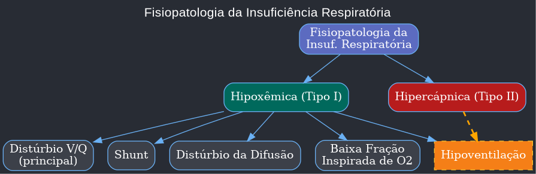
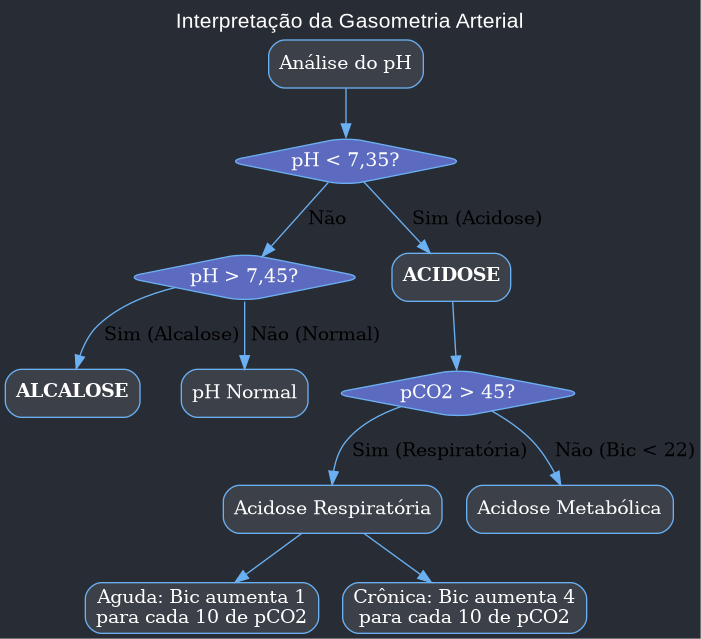
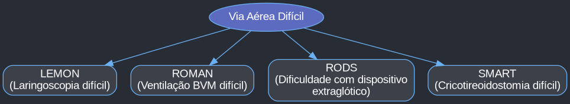
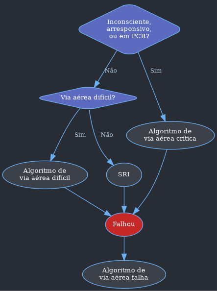
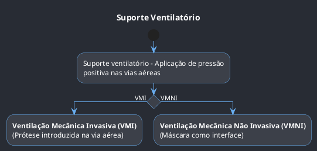
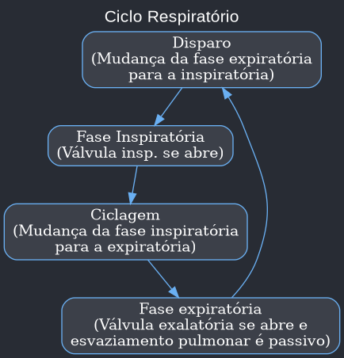
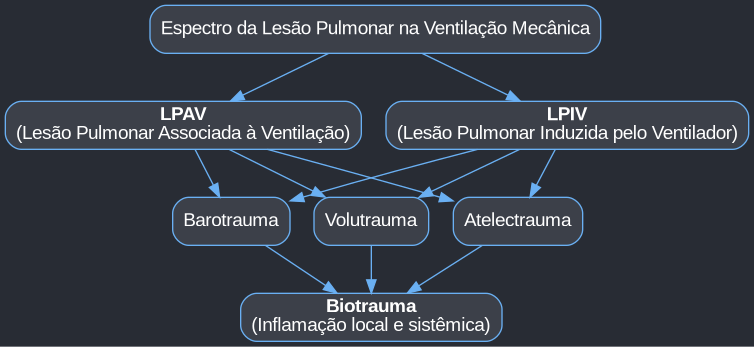

Claro! Aqui está uma aula detalhada em formato de texto para o Obsidian, baseada no material fornecido.

# Pneumologia Intensiva

## 1.0 Introdução à Pneumologia Intensiva

-   **Foco do Módulo**: Este material aborda os tópicos de pneumologia com maior interface com a prática da medicina de emergência e terapia intensiva.
-   **Tópicos Principais**:
    1.  **Insuficiência Respiratória Aguda (IRpA)**: Diagnóstico, diferenciação dos tipos e mecanismos fisiopatológicos.
    2.  **Abordagem da Via Aérea**: Acesso à via aérea e dispositivos de oxigênio.
    3.  **Ventilação Mecânica (VM)**: Invasiva (VMI) e Não Invasiva (VMNI), desde conceitos iniciais até ajustes em situações especiais (DPOC, SDRA).
    4.  **Síndrome do Desconforto Respiratório Agudo (SDRA)**: Foco pós-pandemia de COVID-19.
    5.  **Hemoptise**: Diagnóstico e manejo.
-   **Importância Prática**: O conteúdo é crucial para provas práticas de Residência Médica e Revalidação, além de ser um guia para plantões em pronto atendimento. A incidência de questões sobre IRpA, SDRA e manejo de via aérea tem aumentado significativamente.

---

## 2.0 Insuficiência Respiratória Aguda (IRpA)

### 2.1 Definição
-   **Conceito Central**: A IRpA é uma síndrome complexa definida como a **incapacidade do sistema respiratório de manter a troca gasosa adequada**.
-   **Causas**: Pode ter etiologia pulmonar ou extrapulmonar.
-   **Dois Problemas Principais**:
    1.  Dificuldade na oferta de oxigênio aos tecidos (Hipoxemia).
    2.  Inadequada remoção de gás carbônico (CO₂) pelos pulmões (Hipercapnia).
-   **Definição Laboratorial (Gasométrica)**:
    -   **Hipoxemia**: PaO₂ < 55-60 mmHg ou saturação < 90%.
    -   **Hipercapnia**: pH ≤ 7,34 associado a uma PaCO₂ > 45-50 mmHg.
-   **Pontos Importantes**:
    -   A IRpA é uma **síndrome**, não uma doença. O tratamento foca na causa base.
    -   Os valores gasométricos não são rígidos; devem ser combinados com a clínica do paciente (sinais e sintomas de hipoxemia e/ou hipercapnia).

### 2.2 Classificação
-   **Base da Classificação**: O sistema respiratório é dividido em duas partes: os **pulmões** (responsáveis pela troca gasosa) e a **"bomba" ventilatória** (parede torácica, centros respiratórios, nervos).
-   **Tipos Principais**:
    -   **IRpA Tipo I (Hipoxêmica)**: Falência primária dos pulmões. Manifesta-se como hipoxemia.
    -   **IRpA Tipo II (Hipercápnica ou Ventilatória)**: Falência da "bomba" ventilatória. Manifesta-se como hipercapnia.
    -   **IRpA Mista**: Ocorre hipoxemia grave associada à retenção de CO₂ com acidemia.

```nomnoml
[Insuficiência Respiratória] -> [Falência Pulmonar]
[Insuficiência Respiratória] -> [Falência da 'bomba']

[Falência Pulmonar] -> [Hipoxemia]
[Falência da 'bomba'] -> [Hipercapnia]
```

| Tipos de Insuficiência Respiratória (IRpA) | Gasometria arterial | Ventilação Alveolar (VA) | Oxigenação | Condições clínicas                   |     |                                                  |
| :----------------------------------------- | :------------------ | :----------------------- | :--------- | :----------------------------------- | --- | ------------------------------------------------ |
| **Tipo / Variáveis**                       | **pH**              | **PaCO₂**                | **PaO₂**   | **Gradiente alvéolo-arterial de O₂** |     |                                                  |
| **Tipo I (hipoxêmica)**                    | ↑                   | ↓                        | ↓↓         | ↑                                    | ↑↑  | Pneumonia, SDRA, Tromboembolismo, EAP, TEP       |
| **Tipo II (hipercápnica)**                 | ↓↓                  | ↑↑                       | ↓          | Normal                               | ↓   | Hipoventilação por sedação por benzodiazepínicos |
| **Mista**                                  | ↓↓                  | ↑                        | ↓↓         | ↑                                    | ↓↓  | Pneumonia + fadiga muscular                      |
***SDRA:** Síndrome do Desconforto Respiratório Agudo; **EAP:** Edema Agudo Pulmonar; **TEP:** Tromboembolismo Pulmonar.*

### 2.3 Etiologia
-   **IRpA Tipo I (Hipoxêmica)**: A causa principal é o desequilíbrio na relação ventilação/perfusão (distúrbio V/Q).
-   **IRpA Tipo II (Hipercápnica)**: Sempre associada à **hipoventilação alveolar**.
-   **Intercambialidade**: A progressão da hipoventilação (Tipo II) pode levar à hipoxemia, tornando os tipos intercambiáveis.

| Causas de Insuficiência Respiratória Hipoxêmica (tipo I) |
| :------------------------------------------------------- |
| **Distúrbio Ventilação / Perfusão**                      |
| Edema agudo de pulmão                                    |
| Cor pulmonale                                            |
| Doenças pulmonares intersticiais                         |
| Tromboembolismo pulmonar (aumento do espaço morto)       |
| DPOC / Asma                                              |
| **Efeito shunt**                                         |
| Grandes atelectasias                                     |
| Pneumonias                                               |
| Edema agudo de pulmão                                    |
| **Distúrbio da difusão**                                 |
| Pneumonias virais                                        |
| Edema agudo de pulmão                                    |
| Pneumocistose                                            |

| Causas de Insuficiência Respiratória Hipercápnica (tipo II) |
| :---------------------------------------------------------- |
| **Depressão do drive respiratório**                         |
| Acidose / Alcalose metabólica cerebral                      |
| Síndrome da obesidade - hipoventilação (SOH)                |
| Hiponatremia / Hipoglicemia / Hiperglicemia                 |
| Hipotermia                                                  |
| Opioides / Benzodiazepínicos / Bloqueadores neuromusculares |
| **Doença neuromuscular**                                    |
| Miastenia gravis                                            |
| Botulismo                                                   |
| Síndrome de Guillain-Barré                                  |
| **Aumento da carga ventilatória**                           |
| Cifoescoliose                                               |
| Obesidade                                                   |
| Asma/Doença Pulmonar Obstrutiva Crônica (DPOC)              |

### 2.4 Fisiopatologia
-   A hipoxemia na IRpA ocorre por cinco mecanismos principais. A hipoventilação é o mecanismo central da IRpA tipo II, enquanto os outros quatro causam a IRpA tipo I.

-   **1. Distúrbio Ventilação/Perfusão (V/Q)**:
    -   **Conceito**: É a causa mais comum de hipoxemia. Ocorre um desequilíbrio entre o ar que chega aos alvéolos (ventilação) e o sangue que passa pelos capilares pulmonares (perfusão).
    -   **Extremos do Distúrbio V/Q**:
        -   **Efeito Espaço Morto**: Área ventilada, mas não perfundida (V/Q → ∞). Ex: Tromboembolismo pulmonar (TEP).
        -   **Efeito Shunt**: Área perfundida, mas não ventilada (V/Q → 0). Ex: Atelectasia, pneumonia.
    -   **Exemplos Clínicos**: DPOC, Asma, SDRA.

-   **2. Shunt**:
    -   **Conceito**: Passagem de sangue do leito venoso para o arterial sem passar por áreas pulmonares ventiladas, resultando em uma mistura de sangue não oxigenado com sangue oxigenado.
    -   **Característica Chave**: A hipoxemia causada por shunt **não responde (ou responde muito pouco) ao aumento da oferta de oxigênio (FiO₂)**.
    -   **Exemplos**: Pneumonia lobar, atelectasias extensas, fístulas arteriovenosas.

-   **3. Distúrbios da Difusão**:
    -   **Conceito**: Ocorrem por um **espessamento da membrana alvéolo-capilar**, dificultando a passagem do oxigênio do alvéolo para o sangue.
    -   **Característica**: Raramente causam IRpA de forma isolada devido à grande reserva funcional pulmonar. O CO₂ se difunde 20 vezes mais rápido que o O₂, então a hipoxemia ocorre sem hipercapnia até fases tardias (fadiga).
    -   **Exemplos**: Doenças intersticiais como fibrose pulmonar, pneumonias virais (COVID-19), linfangite carcinomatosa.

-   **4. Diminuição da Fração Inspirada de Oxigênio (FiO₂)**:
    -   **Causa**: Geralmente ocorre em grandes altitudes (hipóxia hipobárica), onde a pressão barométrica é menor.
    -   **Mecanismo**: Leva à vasoconstrição hipóxica pulmonar, um mecanismo de defesa que pode resultar em hipertensão pulmonar se for crônico.

-   **5. Hipoventilação**:
    -   **Conceito**: O ar alveolar não é renovado adequadamente, levando à **diminuição da remoção de CO₂** (hipercapnia) e, consequentemente, à queda da pressão parcial de O₂ nos alvéolos (hipoxemia).
    -   **Causa Central da IRpA Tipo II**: Pode ser secundária à diminuição da Frequência Respiratória (FR) ou do Volume Corrente (VC).
    -   **Consequência**: O aumento agudo do CO₂ causa queda do pH, resultando em **acidose respiratória**.
    -   **Tratamento**: Focado em tratar a causa base e fornecer suporte ventilatório para aumentar o volume-minuto (VC e/ou FR). A oferta isolada de oxigênio não corrige o problema.

### 2.5 Manifestações Clínicas
-   **Principal Sintoma**: Dispneia.
-   **Sinais e Sintomas**: Variam conforme a causa e a gravidade, podendo ser relacionados à hipoxemia ou à hipercapnia.

| Sinais e sintomas - Insuficiência Respiratória Aguda |
| :--- | :--- |
| **Hipoxemia** | **Hipercapnia** |
| Taquipneia | Tremor |
| Taquicardia | Inquietação |
| Ansiedade | Sonolência |
| Diaforese | Cefaleia |
| Confusão mental | Letargia |
| Rebaixamento do nível de consciência | Coma |

-   **Exame Físico**: Procurar por sinais de aumento do trabalho respiratório, como tiragem intercostal, respiração paradoxal e uso de musculatura acessória.

### 2.6 Diagnóstico
-   **Ferramentas Principais**: Oximetria de pulso e gasometria arterial.
-   **Oximetria de Pulso**: Ferramenta não invasiva, útil para monitorização contínua. Oferece excelente acurácia com saturação > 70%. Pode sofrer interferência de má perfusão, arritmias e esmaltes.     
-   **Gasometria Arterial**: Exame fundamental para confirmar o diagnóstico, classificar a IRpA e guiar o tratamento.


-   **Primeiro Passo**: Avaliar o **pH** para identificar acidemia (<7,35) ou alcalemia (>7,45).
-   **Segundo Passo**: Avaliar o **distúrbio primário** (respiratório ou metabólico).
-   **Base Excess (BE)**: Ajuda a diferenciar distúrbios agudos de crônicos. Um BE elevado em acidose respiratória indica cronicidade (compensação renal com retenção de bicarbonato).
-   **Gradiente Alvéolo-arterial de O₂ (G (A-a) O₂)**:
    -   **Utilidade**: Ferramenta crucial para diferenciar as causas de hipoxemia.
    -   **Cálculo Simplificado**: G (A-a) O₂ = 150 - (PaCO₂/0,8) - PaO₂ (em ar ambiente).
    -   **Interpretação**:
        -   **Gradiente Normal (< 15-20)**: A IRpA é secundária à **hipoventilação** ou baixa FiO₂.
        -   **Gradiente Aumentado (> 20)**: A IRpA é por alteração no processo de oxigenação (distúrbio V/Q, shunt ou difusão).

### 2.7 Tratamento

#### 2.7.1 Dispositivos de Fornecimento de Oxigênio
-   **Objetivo**: Corrigir a hipoxemia e garantir ventilação alveolar adequada.
-   **Oxigênio como Medicamento**: Deve ter critérios para início, meta terapêutica e descontinuação.
-   **Dispositivos de Baixo Fluxo (Sistemas Abertos)**:
    -   **Cânula Nasal (Cateter Nasal)**:
        -   **Uso**: O mais utilizado, para dispneia e dessaturação leves.
        -   **Fluxo Máximo**: 6 litros por minuto.
        -   **FiO₂ Estimada**: Aumenta cerca de 3-4% para cada litro de O₂. Varia de 25% a 40%.
    -   **Máscara Facial Simples**:
        -   **Uso**: Para necessidade de quantidades moderadas de O₂.
        -   **Fluxo**: 6 a 10 litros por minuto.
        -   **FiO₂ Estimada**: Entre 35% e 50%.
        -   **Atenção**: Não protege contra aerossolização, perdendo espaço na pandemia de COVID-19.

-   **Dispositivos de Alto Fluxo (Controle Preciso da FiO₂)**:
    -   **Máscara de Venturi**:
        -   **Uso**: Permite controle preciso da FiO₂. Dispositivo de escolha na **exacerbação aguda de DPOC (EADPOC)** e no desmame de oxigênio pós-operatório.
        -   **Mecanismo**: Utiliza válvulas coloridas que, baseadas no efeito Venturi, misturam o oxigênio com o ar ambiente para entregar uma fração fixa.
        -   **FiO₂**: Varia de 24% a 50%.
    -   **Máscara Não Reinalante (MNR) com Reservatório**:
        -   **Uso**: Consegue entregar a **maior FiO₂** para pacientes em ventilação espontânea.
        -   **FiO₂**: Até 95% (embora estudos mais recentes apontem um máximo de 80%).
        -   **Fluxo Mínimo**: 10 litros por minuto para evitar reinalação de CO₂.
        -   **Importância**: Ganhou destaque na pandemia de COVID-19 por fornecer altas FiO₂ e minimizar a aerossolização do ambiente.

---

## 3.0 Cuidados com a Via Aérea

### 3.1 Introdução
-   **Foco**: Abordagem da via aérea no paciente clínico, com ênfase em estações práticas.
-   **Conteúdo**: Princípios de manejo, definições, algoritmos, manejo básico e avançado.

### 3.2 Princípios do Manejo da Via Aérea

#### 3.2.1 Decisão de Intubar
-   **Três Perguntas Fundamentais**: Antes de intubar, deve-se responder:
    1.  O paciente tem incapacidade de **manter ou proteger** a via aérea? (Ex: rebaixamento do nível de consciência)
    2.  O paciente tem incapacidade de **ventilar ou oxigenar**? (Ex: IRpA hipoxêmica ou hipercápnica grave)
    3.  Qual a **evolução clínica ou desfecho esperado**? (Ex: paciente com necessidade de procedimento cirúrgico, instabilidade hemodinâmica progressiva)

| Indicações de Intubação Orotraqueal (IOT) |
| :--- |
| Escala de Coma de Glasgow (ECG) ≤ 8 |
| Impossibilidade de manter via aérea pérvia |
| Fadiga respiratória iminente |
| Hipoxemia refratária / Acidose respiratória grave |
| Instabilidade hemodinâmica grave / Parada Cardiorrespiratória (PCR) |
| Procedimentos e cirurgias |
| Insuficiência respiratória aguda grave e refratária |

#### 3.2.2 Abordagem do Paciente
-   **Avaliação Inicial**: Verificar patência e eficiência da via aérea. Conversar com o paciente ("qual o seu nome?") avalia o estado neurológico e a capacidade de fonação.
-   **Sinais de Obstrução de Via Aérea Superior**:
    -   Voz abafada ("batata quente").
    -   Incapacidade de deglutir.
    -   Estridor (sinal tardio).
    -   Dispneia.
-   **Avaliação Sistemática**: Exame físico completo em busca da etiologia da IRpA e avaliação do estado mental.

### 3.3 Definições
-   **Via Aérea Difícil (VAD)**: Atributos **anatômicos** que predizem dificuldade técnica para garantir a via aérea. É uma previsão.
-   **Via Aérea Falha (VAF)**: Situação em que a **técnica escolhida falhou**. É um evento.
-   **Crash Airway (Via Aérea Crítica ou Imediata)**: Paciente arresponsivo, que provavelmente não reagirá à laringoscopia, ou em estado de pré-PCR. A sedoanalgesia inicial pode não ser necessária.

### 3.4 Avaliação da Via Aérea
-   Uma VAD é definida por dificuldades em uma ou mais das quatro dimensões:
    1.  Laringoscopia (LEMON)
    2.  Ventilação com Bolsa-Válvula-Máscara (BVM) (ROMAN)
    3.  Inserção de dispositivo extraglótico (RODS)
    4.  Cricotireoidostomia (SMART)



#### 3.4.1 Dificuldade na Laringoscopia: LEMON
-   **L - Look (Olhar externamente)**: Pescoço curto, abertura bucal pequena, barba, bigode, má oclusão.
-   **E - Evaluate (Avaliar com a regra 3-3-2)**:
    -   **3 (dedos)**: Abertura bucal (distância interincisivos).
    -   **3 (dedos)**: Comprimento do espaço mandibular (distância hiomentoniana).
    -   **2 (dedos)**: Posição da laringe (distância tireo-hioidea).
-   **M - Mallampati**:
    -   **Técnica**: Paciente sentado, boca aberta, língua em máxima protrusão, sem fonar.
    -   **Classificação**:
        -   **Classe I**: Palato mole, úvula, fauce e pilares visíveis.
        -   **Classe II**: Palato mole, úvula e fauce visíveis.
        -   **Classe III**: Palato mole e base da úvula visíveis.
        -   **Classe IV**: Apenas o palato duro é visível.
    -   **Preditores de VAD**: Classes III e IV.
-   **O - Obstruction/Obesity (Obstrução/Obesidade)**: Sinais de obstrução de via aérea superior (estridor, voz abafada) ou obesidade.
-   **N - Neck mobility (Mobilidade do pescoço)**: Capacidade limitada de extensão do pescoço (colar cervical, artrite reumatoide, espondilite anquilosante).

#### 3.4.2 Dificuldade na Ventilação BVM: ROMAN
-   **R - Restriction/Radiation (Restrição/Radiação)**: Doenças pulmonares restritivas (asma, DPOC) ou radioterapia cervical.
-   **O - Obesity/Obstruction (Obesidade/Obstrução/Apneia do sono)**: IMC > 26 kg/m², tecidos redundantes, SAOS.
-   **M - Mallampati/Mask seal (Mallampati/Vedação da máscara/Masculino)**: Mallampati III ou IV, barba, sangue ou debris na face.
-   **A - Age (Idade)**: Idade > 55 anos.
-   **N - No teeth (Nenhum dente)**: Paciente edêntulo, dificulta a vedação da máscara.

#### 3.4.3 Dificuldade com Dispositivo Extraglótico: RODS
-   **R - Restriction (Restrição)**: Doenças pulmonares com baixa complacência.
-   **O - Obstruction/Obesity (Obstrução/Obesidade)**: Obstrução ao nível da faringe/laringe.
-   **D - Disrupted/Distorted (Distorcida ou rompida)**: Anatomia distorcida por abscesso, trauma, etc.
-   **S - Short (Curta distância tireomentoniana)**.

#### 3.4.4 Dificuldade na Cricotireoidostomia: SMART
-   **S - Surgery (Cirurgia)**: Cirurgia ou anatomia alterada no local.
-   **M - Mass (Massa)**: Hematoma ou tumor no local.
-   **A - Access (Acesso)**: Obesidade ou pescoço curto que dificulta o acesso anatômico.
-   **R - Radiation (Radiação)**: Radioterapia prévia na região.
-   **T - Tumor**: Tumor local.

### 3.5 Algoritmos de Tomada de Decisão na Via Aérea

#### Algoritmo Universal da Via Aérea


#### Algoritmo da Via Aérea Crítica (Crash Airway)
-   **Cenário**: Paciente inconsciente ou em pré-parada.
-   **Passos**:
    1.  Manter oxigenação (ventilação BVM já instituída).
    2.  **Primeira tentativa de IOT** (sem drogas se possível).
    3.  **Sucesso?** → Manejo pós-IOT.
    4.  **Falha?** → Checar se consegue manter a oxigenação.
    5.  Se oxigenação mantida, considerar relaxante muscular (Succinilcolina) para facilitar nova tentativa.
    6.  Se oxigenação falha → Acionar algoritmo de **Via Aérea Falha (VAF)**.

#### Algoritmo da Via Aérea Difícil (VAD)
-   **Cenário**: Paciente com preditores de VAD (LEMON), mas ainda não em falha de intubação.
-   **Passos**:
    1.  **Pedir ajuda!**
    2.  Avaliar se é preciso "Forçado a agir" (ex: anafilaxia). Se sim, proceder com a melhor tentativa possível.
    3.  Se não, realizar a **"Melhor tentativa"** de IOT (paciente otimizado, sedado, analgesiado).
    4.  **Falha?** → Acionar algoritmo de **Via Aérea Falha (VAF)**.
    5.  Se a melhor tentativa for arriscada, considerar técnicas com o paciente acordado (ex: videolaringoscopia, broncofibroscopia).

#### Algoritmo da Via Aérea Falha (VAF)
-   **Cenário**: Falha em intubar.
-   **Conceito chave**: O objetivo muda de "intubar" para "oxigenar".
-   **Passos**:
    1.  **Pedir ajuda!**
    2.  Falha em manter a oxigenação (cenário NINO - "Não intubo, não oxigeno")?
        -   **Sim**: **Cricotireoidostomia de emergência**. É o destino final.
    3.  Consegue manter a oxigenação? (cenário "Não intubo, porém oxigeno")
        -   **Sim**: Considerar dispositivos extraglóticos (Máscara Laríngea é preferível) ou outras técnicas.

### 3.6 Manejo Básico da Via Aérea
-   **Ponto Central**: Ventilação com Bolsa-Válvula-Máscara (VBVM).
-   **Três Fatores para Sucesso da VBVM**:
    1.  Via aérea patente.
    2.  Vedação adequada da máscara.
    3.  Ventilação apropriada.

#### 3.6.1 Métodos Manuais
-   **Manobra de Heimlich**:
    -   **Indicação**: Obstrução de via aérea alta por corpo estranho em paciente consciente.
    -   **Técnica**: Compressões abdominais (ou torácicas em gestantes/obesos) para dentro e para cima.
    -   **Paciente inconsciente**: Iniciar RCP com compressões torácicas.
-   **Abertura de Via Aérea**:
    -   **Sem Trauma Cervical**: Manobra de inclinação da cabeça com elevação do mento (*head tilt-chin lift*).
    -   **Com Suspeita de Trauma Cervical**: Manobra de anteriorização da mandíbula (*jaw thrust*).

#### 3.6.2 Equipamentos Básicos
-   **Cânula Orofaríngea (Guedel)**:
    -   **Uso**: Apenas em pacientes **inconscientes e sem reflexo de vômito**.
    -   **Medida**: Da comissura labial ao lóbulo da orelha.
    -   **Inserção**: Invertida (ponta para o palato) e rotacionada 180° ao atingir o palato mole.
-   **Cânula Nasofaríngea**:
    -   **Uso**: Pode ser usada em pacientes despertos ou com reflexo de tosse presente.
    -   **Contraindicação Absoluta**: Suspeita de fratura de base de crânio.
    -   **Medida**: Da ponta do nariz ao lóbulo da orelha.

#### 3.6.3 Ventilação Bolsa-Válvula-Máscara (VBVM)
-   **Técnica com uma mão (CE)**: O polegar e o indicador formam um "C" sobre a máscara, e os outros três dedos formam um "E" sob a mandíbula, tracionando-a para cima.
-   **Técnica com duas mãos**: Método mais efetivo. Um profissional veda a máscara com as duas mãos enquanto outro comprime a bolsa.
-   **Volume e Frequência**: Administrar 10-12 respirações/minuto, com volume suficiente para elevar o tórax (aprox. 500 mL ou 5-7 mL/kg).
-   **Manobra de Sellick (Pressão Cricoide)**: Compressão da cartilagem cricoide para ocluir o esôfago e minimizar o risco de aspiração. **Não confundir com a manobra BURP**.

### 3.7 Manejo Avançado da Via Aérea (Via Aérea Definitiva)
-   **Via Aérea Definitiva**: Tubo com balonete ("cuff") insuflado na traqueia.

#### 3.7.2 Laringoscopia Direta (LD)
-   **Objetivo**: Criar uma linha reta entre a boca e a laringe para visualizar as pregas vocais.
-   **Equipamento**:
    -   **Lâmina Curva (Macintosh)**: A ponta é inserida na valécula (espaço entre a base da língua e a epiglote) para elevar a epiglote indiretamente.
    -   **Lâmina Reta (Miller)**: A ponta é usada para levantar diretamente a epiglote. Preferível em pacientes com dentes incisivos proeminentes ou língua grande.
-   **Posicionamento do Paciente**:
    -   **Posição Olfativa (*Sniffing position*)**: Flexão do pescoço e extensão da cabeça para alinhar os eixos oral, faríngeo e laríngeo.
    -   **Posição em Rampa**: Para pacientes obesos, elevar a cabeça e o tórax até que o meato auricular esteja alinhado com o esterno.
-   **Manobra BURP (*Back Up Right Pressure*)**: Manobra de manipulação laríngea externa realizada por um **assistente** para melhorar a visualização da glote. A pressão é aplicada para trás (Back), para cima (Up) e para a direita (Right).

#### 3.7.2.7 Introdutores (Bougie)
-   **Uso**: Equipamento que auxilia na IOT quando há dificuldade na visualização da glote (ex: Cormack-Lehane 3).
-   **Técnica**: O *bougie* é inserido na traqueia, e sua posição é confirmada pelo atrito da ponta nos anéis traqueais. O tubo orotraqueal (TOT) é então deslizado sobre o *bougie*.

#### 3.7.2.8 Confirmando a IOT
-   **Padrão-Ouro**: **Capnografia em forma de onda contínua**. Uma onda quadrada persistente por pelo menos seis respirações confirma o posicionamento traqueal. A ausência de onda sugere intubação esofágica.
-   **Outros Métodos (Menos Confiáveis)**:
    -   Ausculta (detecta intubação seletiva, mas não confirma posição traqueal).
    -   Embaçamento do tubo (não confiável).
    -   Radiografia de tórax (avalia a **profundidade** do tubo, não a localização traqueal vs. Esofágica).

### 3.8 Sequência Rápida de Intubação (SRI)
-   **Definição**: Administração de um agente **indutor** (sedativo) potente seguido imediatamente por um **bloqueador neuromuscular** de ação rápida para criar condições ideais para a IOT em pacientes com estômago cheio.
-   **Propósito**: Induzir inconsciência e paralisia rapidamente, minimizando o risco de aspiração. **Não se ventila com BVM** entre a indução e a intubação, a menos que haja hipoxemia grave.

#### Os 7 Ps da SRI

| Passo | Ação (7 Ps) | Detalhes |
| :--- | :--- | :--- |
| 1 | **Preparação** | Monitorização, acessos, equipamentos, drogas. Avaliação de VAD (LEMON). |
| 2 | **Pré-oxigenação** | O₂ a 100% por 3-5 minutos para criar um reservatório de oxigênio. |
| 3 | **Pré-tratamento (Otimização)** | Corrigir hipotensão, bradicardia, etc. Fentanil pode ser usado para atenuar a resposta simpática. |
| 4 | **Paralisia com Indução** (Tempo Zero) | Administração rápida do indutor (ex: etomidato, quetamina) e do bloqueador neuromuscular (ex: succinilcolina). |
| 5 | **Posicionamento** | Posição olfativa ou em rampa. |
| 6 | **Passagem do Tubo com Confirmação** | Laringoscopia, passagem do TOT e confirmação com capnografia. |
| 7 | **Pós-intubação: Manejo** | Fixação do tubo, radiografia, ajuste da ventilação, manejo da hipotensão pós-IOT. |

#### Medicações Utilizadas na SRI

| Classe | Fármaco | Dose | Vantagens | Desvantagens/Contraindicações |
| :--- | :--- | :--- | :--- | :--- |
| **Pré-tratamento** | Fentanil | 1-3 mcg/kg | Rápido início, analgesia potente. | Hipotensão, tórax rígido, bradicardia. |
| **Indução** | Etomidato | 0,2-0,4 mg/kg | Estabilidade hemodinâmica, início rápido. | Supressão adrenal, mioclonia. |
| | Quetamina | 1-2 mg/kg | Efeito broncodilatador, analgesia, estabilidade hemodinâmica (aumenta PA e FC). | Aumento da pressão intracraniana, alucinações. |
| | Propofol | 1,5-3 mg/kg | Início rápido e curto. | Hipotensão significativa, apneia. |
| **Paralisia** | Succinilcolina | 1-1,5 mg/kg | Início mais rápido (30-60 s), curta duração. | Hipercalemia, hipertermia maligna, aumento da pressão intraocular. |
| | Rocurônio | 1 mg/kg | Alternativa à succinilcolina, sem os seus efeitos adversos. | Duração mais longa, requer agente reversor. |

### 3.8.2 Sequência Atrasada de Intubação (SAI)
-   **Conceito**: Estratégia para pacientes hipoxêmicos e agitados, onde a pré-oxigenação é difícil.
-   **Técnica**: Utiliza-se uma dose dissociativa de **quetamina** para sedar o paciente, permitindo uma pré-oxigenação eficaz antes de prosseguir com o restante da SRI. Ganhou força durante a pandemia de COVID-19.

---
Com certeza. Continuando a aula detalhada para o Obsidian.

---

## 4.0 Ventilação Mecânica (VM)

### 4.1 Introdução
-   **Definição Central**: O suporte ventilatório é definido como a **aplicação de pressão positiva na via aérea** do paciente de maneira artificial.
-   **Divisão Principal**: O suporte ventilatório pode ser subdividido em duas categorias principais, com base na interface com o paciente.
    -   **Suporte Invasivo**: Requer uma via aérea artificial, como um tubo orotraqueal (TOT) ou uma cânula de traqueostomia. É o foco da Ventilação Mecânica Invasiva (VMI).
    -   **Suporte Não Invasivo**: Utiliza uma interface externa, como uma máscara, para aplicar a pressão positiva, dispensando a necessidade de uma via aérea definitiva. É o foco da Ventilação Mecânica Não Invasiva (VMNI).



### 4.2 Ventilação Mecânica Não Invasiva (VMNI)

#### 4.2.1 Introdução
-   **Definição de VMNI**: É todo suporte ventilatório com pressão positiva ofertado ao paciente por meio de uma **máscara (interface)**, dispensando a necessidade de uma via aérea definitiva.
-   **Benefícios Principais**:
    -   Redução do trabalho respiratório.
    -   Melhora nas trocas gasosas.
    -   Evita os efeitos deletérios associados à via aérea artificial, como estenose de traqueia e pneumonia associada à ventilação (PAV).
    -   Permite que o paciente permaneça acordado, sem necessidade de sedoanalgesia profunda ou bloqueio neuromuscular.

#### 4.2.2 Definições e Terminologias
-   A VMNI possui dois modos ventilatórios principais: **CPAP** e **BiPAP**.

| Modos Ventilatórios Não Invasivos | Descrição |
| :--- | :--- |
| **CPAP** | Pressão constante na via aérea. Ventilação espontânea (isoladamente, não gera ventilação). |
| **BiPAP** | Dois níveis de pressão (IPAP: pressão inspiratória e EPAP: pressão expiratória positiva). Consegue gerar fluxo, é capaz de gerar ventilação. |
***CPAP**: Continue Positive Airway Pressure (Pressão Positiva Contínua na Via Aérea).<br>**BiPAP**: Bi-Level Positive Airway Pressure (Ventilação com Pressão Positiva em dois níveis de pressão).*

-   **Parâmetros Fundamentais da VMNI**:
    -   **IPAP (*Inspiratory Positive Airway Pressure*)**: Pressão imposta pelo ventilador durante a **inspiração**. É a pressão mais alta do ciclo.
    -   **EPAP (*Expiratory Positive Airway Pressure*)**: Pressão imposta pelo ventilador durante a **expiração**. É a pressão mais baixa do ciclo e é funcionalmente sinônimo de **PEEP (*Positive End Expiratory Pressure*)**. Sua principal função é manter a patência das vias aéreas e dos alvéolos, melhorando a oxigenação.
    -   **Pressão de Suporte (PS)**: É a **diferença entre a IPAP e a EPAP (PS = IPAP - EPAP)**. Este é o delta pressórico que efetivamente **gera o fluxo de ar e promove a ventilação**, auxiliando na "lavagem" de CO₂.

#### 4.2.3 Pressão Positiva Contínua na Via Aérea (CPAP)
-   **Funcionamento**: Impõe um **único nível de pressão** contínuo durante todo o ciclo respiratório.
-   **Principal Benefício**: Ocorre na fase **expiratória**, onde a pressão (EPAP/PEEP) previne o colapso alveolar e melhora as trocas gasosas (oxigenação).
-   **Limitação**: **Não gera fluxo ativamente**, ou seja, não auxilia na ventilação (remoção de CO₂). Por isso, há debate na literatura se é de fato uma modalidade de VMNI ou apenas uma forma de PEEP.

#### 4.2.4 Dois Níveis de Pressão (BiPAP)
-   **Funcionamento**: A pressão oscila entre um nível mais alto na inspiração (IPAP) e um nível mais baixo na expiração (EPAP).
-   **Principal Benefício**: **É capaz de gerar fluxo (ventilação)** devido à diferença de pressão (Pressão de Suporte), auxiliando ativamente a musculatura do paciente, reduzindo o trabalho respiratório e ajudando a eliminar o CO₂.
-   **Conceito Prático**: Podemos pensar no BiPAP como um CPAP (o nível de EPAP) ao qual se adiciona uma Pressão de Suporte.

#### 4.2.5 Vantagens x Desvantagens da VMNI

| Vantagens | Desvantagens |
| :--- | :--- |
| Preserva vias aéreas superiores | Desconforto pela interface / claustrofobia |
| Suporte ventilatório precoce | Ajustes constantes da interface e dos parâmetros |
| Possibilidade de manter a comunicação com o paciente e alimentação pela via oral | Possibilidade de lesão por pressão da pele em contato com a interface |
| Facilidade de iniciar e retirar | Sem proteção das vias aéreas |
| Menor necessidade de sedoanalgesia | Sem acesso direto à árvore brônquica para aspiração de secreção |
| Pode ser utilizada em ambiente domiciliar, para casos crônicos | Pode prorrogar uma decisão semi eletiva de intubação |
| Sem complicações da ventilação mecânica invasiva, como estenose de traqueia pós-intubação e pneumonia associada à ventilação | Poucas interfaces disponíveis na prática |

#### 4.2.6 Interfaces
-   A VMNI utiliza diversas interfaces para se conectar ao paciente. A escolha depende da anatomia do paciente, do conforto e da necessidade clínica. Os principais tipos são:
    -   Nasal
    -   Oronasal (a mais comum)
    -   Facial Total (*Full Face*)
    -   Capacete (*Helmet*)

#### 4.2.7 Indicações
-   A VMNI é uma ferramenta terapêutica importante em diversas condições, com diferentes níveis de evidência.

| Indicações de Ventilação Mecânica Não Invasiva (VMNI) |
| :--- | :--- | :--- |
| **Indicação** | **Evidência favorável** | **Recomendações** |
| Exacerbação aguda hipercápnica da doença pulmonar obstrutiva crônica (EADPOC) | Forte | Diminui necessidade de intubação orotraqueal (IOT), tempo de internação e mortalidade. Deve ser utilizado o BiPAP para reversão da hipercapnia. |
| Edema agudo de pulmão (EAP) cardiogênico | Moderada | Diminui necessidade de IOT e mortalidade hospitalar. Pode ser utilizado tanto o BiPAP quanto o CPAP. |
| Cuidados paliativos | Moderada | Pacientes com neoplasia sem proposta curativa ou outras doenças terminais com dispneia refratária. Respeitar a autonomia e tolerância do paciente. |
| Imunossuprimidos | Moderada | Quando indicada de maneira precoce em pacientes com insuficiência respiratória aguda, tem impacto na sobrevida, necessidade de IOT e taxa de evolução para pneumonia nosocomial. Pode ser utilizada a VMNI ou CNAF. |
| Insuficiência respiratória aguda (IRpA) no pós-operatório | Moderada | Recomendado nos 7 dias do pós-operatório, sobretudo procedimentos de alto risco de atelectasia no pós-operatório. |
| Pós extubação imediata em pacientes de alto risco de falência à reintubação | Baixa | Deve ser utilizada imediatamente após a extubação em um grupo selecionado de pacientes sob risco para tal complicação, como forma de prevenção, e não como tratamento da insuficiência respiratória já instalada. |
| Exacerbação aguda de asma | Sem evidência | **Diretriz Brasileira de VM (2013):** a VNI pode ser utilizada em conjunto com terapia medicamentosa para pacientes selecionados, com IRpA leve a moderada. **ERJ/ATS (2017):** dada a incerteza das evidências, não podemos oferecer uma recomendação sobre o uso de VNI para IRpA devido à asma. |
| Síndrome do desconforto respiratório agudo (SDRA) | Sem evidência | **Diretriz Brasileira de VM (2013):** pode-se utilizar a VNI na síndrome de desconforto respiratório agudo (SDRA), especialmente nos casos de SDRA leve, com os cuidados de se observarem as metas de sucesso de 0,5 a 2 horas. Risco de falha, evitar retardar a intubação. |

-   **VMNI no Desmame Ventilatório**: Um subgrupo específico de pacientes se beneficia da VMNI imediatamente após a extubação para **prevenir a falência respiratória**.

| Pacientes considerados em risco de falha de extubação que poderão se beneficiar do uso de VMNI IMEDIATO pós-extubação |
| :--- |
| Hipercapnia |
| Insuficiência cardíaca congestiva |
| Tosse ineficaz ou secreção retida em via aérea |
| Mais de um fracasso no teste de respiração espontânea |
| Mais do que uma comorbidade |
| Obstrução das vias aéreas superiores |
| Idade > 65 anos |
| Tempo de ventilação mecânica > 72 horas |
| Paciente portador de doenças neuromusculares |
| Pacientes obesos |

#### 4.2.8 Contraindicações
-   Para realizar a VMNI, o paciente precisa ter **drive respiratório preservado e ser colaborativo**.

| Contraindicações à Ventilação mecânica não invasiva (VMNI) |
| :--- |
| **ABSOLUTAS (SEMPRE EVITAR)** |
| Necessidade de intubação orotraqueal de emergência |
| Parada cardíaca ou respiratória |
| **RELATIVAS (ANALISAR RISCO X BENEFÍCIO)** |
| Incapacidade de cooperar, proteger vias aéreas ou secreções abundantes |
| Rebaixamento do nível de consciência (exceto acidose hipercápnica em DPOC) |
| Falências orgânicas não respiratórias (encefalopatia, taqui ou bradiarritmias, hemorragia digestiva, instabilidade hemodinâmica) |
| Cirurgia facial ou neurológica |
| Trauma ou deformidade facial |
| Alto risco de aspiração |
| Obstrução de vias aéreas superiores |
| Anastomose de esôfago recente |

-   **Importante**: Pacientes com EADPOC, acidose respiratória e rebaixamento leve do nível de consciência **podem** ser candidatos a um teste de VMNI (BiPAP) por até 30 minutos. Se não houver melhora, devem ser intubados.

#### 4.2.9 Sucesso e Insucesso da VMNI
-   O **escore HACOR** foi desenvolvido para predizer a falência da VMNI em pacientes com IRpA hipoxêmica, avaliado uma hora após o início da terapia.
-   **Acrônimo HACOR**:
    -   **H** - *Heart rate* (Frequência Cardíaca)
    -   **A** - *Acidosis* (Acidose - pH)
    -   **C** - *Consciousness* (Nível de Consciência - Glasgow)
    -   **O** - *Oxygenation* (Oxigenação - Relação PaO₂/FiO₂)
    -   **R** - *Respiratory rate* (Frequência Respiratória)
-   **Interpretação**: Uma pontuação **> 5 pontos** prediz falência em mais de 80% dos pacientes. O principal preditor isolado de falha é uma Escala de Coma de Glasgow ≤ 10.
-   **Aplicação Prática**: Não é preciso decorar o escore, mas sim conhecer os **preditores de pior resposta**: taquicardia, acidose, rebaixamento do nível de consciência, má oxigenação e taquipneia persistentes após 1 hora de VMNI.

### 4.3 Cateter Nasal de Alto Fluxo (CNAF)
-   **Definição**: É um suporte ventilatório não invasivo que combina o *delivery* de **altas taxas de fluxo** de uma mistura de ar e oxigênio aquecida e umidificada, associada a uma **pressão positiva**.
-   **Interface**: Cânula nasal.
-   **Benefícios**:
    -   Redução da taxa de intubação em casos selecionados.
    -   Melhora das trocas gasosas.
    -   Diminuição do trabalho respiratório através de um efeito de "PEEP" (pressão positiva gerada pelo alto fluxo, que pode chegar a 5-7 cmH₂O).
    -   Conforto para o paciente.
-   **Uso**: Originalmente pediátrico, seu uso em adultos tem crescido exponencialmente, especialmente em cenários de IRpA hipoxêmica.

---

## 4.4 Ventilação Mecânica Invasiva (VMI)

#### 4.4.1 Conceitos e Definições
-   **Ventilador Mecânico**: Essencialmente, é um **gerador de FLUXO**. Ele fornece uma mistura de ar e oxigênio pressurizada para o paciente.
-   **Controlador**: O "cérebro" do ventilador, geralmente microprocessado, que determina o fluxo a ser gerado e a mistura de ar/O₂.
-   **Variável de Controle**: Parâmetro que o ventilador ajusta para atingir o objetivo programado. Pode ser **Volume** ou **Pressão**.
    -   **Modos controlados a Volume**: O ventilador entrega um fluxo determinado para atingir um volume corrente (VC) pré-definido. A pressão nas vias aéreas será uma consequência da mecânica respiratória do paciente.
    -   **Modos controlados a Pressão**: O ventilador gera um fluxo suficiente para atingir e manter uma pressão pré-definida. O volume corrente (VC) será uma consequência da mecânica respiratória.

#### 4.4.2 Fases do Ciclo Respiratório
-   Todo ciclo ventilatório mecânico possui 4 fases. O mnemônico **"DICE"** ajuda a lembrá-las.

| Fases do ciclo respiratório |
| :--- |
| **1: Disparo** |
| **2: Inspiração** |
| **3: Ciclagem** |
| **4: Expiração** |

1.  **Disparo (*Trigger*)**:
    -   **O que é**: É o evento que **inicia a inspiração**. A válvula expiratória se fecha e a inspiratória se abre.
    -   **Como ocorre**: Pode ser disparado:
        -   **Pelo ventilador (a tempo)**: Em modos controlados, o ventilador inicia a inspiração com base na frequência respiratória (FR) programada.
        -   **Pelo paciente (a pressão ou a fluxo)**: Em modos assistidos, o ventilador detecta o esforço inspiratório do paciente (uma queda na pressão ou uma mudança no fluxo) e inicia a inspiração. A variável que determina o disparo é a **sensibilidade**.

2.  **Inspiração**:
    -   **O que é**: Fase em que o ventilador **insufla os pulmões** para atingir a variável de controle (volume ou pressão). A válvula inspiratória está aberta.

3.  **Ciclagem**:
    -   **O que é**: É o evento que **interrompe a inspiração e inicia a expiração**. A válvula inspiratória se fecha e a expiratória se abre.
    -   **Como ocorre**: A ciclagem pode ser determinada por:
        -   **Volume**: Ao atingir o volume corrente programado (em VCV).
        -   **Tempo**: Ao atingir o tempo inspiratório programado (em PCV).
        -   **Fluxo**: Quando o fluxo inspiratório cai a uma determinada porcentagem do pico de fluxo (em PSV).

4.  **Expiração**:
    -   **O que é**: Fase **passiva** que permite o recolhimento elástico do pulmão. A única variável que influencia ativamente a expiração é a **PEEP**.



#### 4.4.3 Terminologia (Parâmetros Ventilatórios)
-   **Volume Corrente (VC)**:
    -   **Definição**: Volume de gás mobilizado em cada ciclo respiratório.
    -   **Cálculo**: Deve ser baseado no **peso predito** do paciente (calculado a partir da altura), não no peso real.
    -   **Meta na SDRA**: 4-6 mL/kg.
-   **Volume-Minuto (VM)**:
    -   **Definição**: Volume total de gás mobilizado em um minuto (VM = VC x FR).
    -   **Relação com CO₂**: É inversamente proporcional à PaCO₂. Aumentar o VM ajuda a "lavar" o CO₂.
-   **Pressão de Pico (Ppico)**:
    -   **Definição**: Pressão máxima atingida nas vias aéreas durante a inspiração.
    -   **Reflete**: A resistência das vias aéreas + a pressão elástica do sistema.
    -   **Meta**: < 40 cmH₂O.
-   **Pressão de Platô (Pplatô)**:
    -   **Definição**: Pressão medida ao final da inspiração após uma pausa de 0,5-2 segundos (fluxo zero).
    -   **Reflete**: A pressão elástica do sistema respiratório, sendo uma estimativa da **pressão alveolar**.
    -   **Meta na Ventilação Protetora**: < 30 cmH₂O.
-   **PEEP (*Positive End Expiratory Pressure*)**:
    -   **Definição**: Pressão positiva mantida nas vias aéreas ao final da expiração.
    -   **Função**: Evitar o colapso alveolar, melhorar a oxigenação e prevenir lesão pulmonar (atelectrauma).
-   **Driving Pressure (DP) ou Pressão de Distensão**:
    -   **Definição**: É a diferença entre a pressão de platô e a PEEP (DP = Pplatô - PEEP).
    -   **Reflete**: A pressão que efetivamente "estica" os alvéolos a cada ciclo.
    -   **Meta na Ventilação Protetora**: **< 15 cmH₂O**. É um dos preditores mais importantes de mortalidade.
-   **Complacência**:
    -   **Definição**: Medida da "elasticidade" do sistema respiratório. É a variação de volume dividida pela variação de pressão (Complacência = VC / DP).
    -   **Interpretação**:
        -   **Alta Complacência** (ex: enfisema): Pulmões "moles", fáceis de insuflar.
        -   **Baixa Complacência** (ex: SDRA, fibrose): Pulmões "duros", difíceis de insuflar.
-   **Resistência**:
    -   **Definição**: Medida da oposição ao fluxo de ar nas vias aéreas.
    -   **Relação com Pressões**: A resistência é a principal responsável pela diferença entre a Ppico e a Pplatô (Resistência = (Ppico - Pplatô) / Fluxo).

---
Perfeitamente. Vamos continuar a aula de Ventilação Mecânica para o Obsidian.

---

#### 4.4.4 Ciclos Respiratórios e Modos Ventilatórios
-   **Conceito**: Os modos ventilatórios definem como os ciclos respiratórios são iniciados (disparados), mantidos e finalizados.
-   **Classificação dos Ciclos**:
    1.  **Controlados**: O ventilador inicia, controla e finaliza o ciclo, baseado puramente em tempo (FR programada). Não há participação do paciente.
    2.  **Assistidos**: O paciente inicia o ciclo com seu esforço, mas o ventilador controla e finaliza.
    3.  **Espontâneos**: O paciente inicia, controla e finaliza o ciclo. O ventilador pode oferecer um suporte (pressão), mas o tempo do ciclo é determinado pelo paciente.

#### 4.4.5 Modalidades Ventilatórias Básicas
-   A combinação da **variável de controle** (Volume ou Pressão) com o **tipo de ciclo** (Controlado, Assistido, etc.) define as modalidades básicas.

##### 4.4.5.1 Volume Controlado (VCV - *Volume Controlled Ventilation*)
-   **Como funciona**:
    -   **Disparo**: A tempo (controlado) ou pelo paciente (assistido).
    -   **Variável de Controle**: **Volume Corrente (VC)**. O ventilador garante que o volume programado seja entregue.
    -   **Fluxo**: É constante, com uma onda de formato **quadrado**.
    -   **Ciclagem**: A **volume**. A inspiração termina quando o VC programado é atingido.
-   **Características**:
    -   A **pressão nas vias aéreas é variável**, dependendo da resistência e complacência do paciente. Se o pulmão fica "duro" (baixa complacência), a pressão sobe para entregar o mesmo volume, aumentando o risco de **barotrauma**.
    -   É a modalidade mais utilizada no mundo, especialmente no início da VM.

##### 4.4.5.2 Pressão Controlada (PCV - *Pressure Controlled Ventilation*)
-   **Como funciona**:
    -   **Disparo**: A tempo (controlado) ou pelo paciente (assistido).
    -   **Variável de Controle**: **Pressão inspiratória**. O ventilador garante que a pressão programada seja atingida e mantida durante a inspiração.
    -   **Fluxo**: É livre e **desacelerado**. O fluxo é alto no início da inspiração e diminui à medida que o pulmão enche.
    -   **Ciclagem**: A **tempo**. A inspiração termina quando o tempo inspiratório programado é atingido.
-   **Características**:
    -   O **Volume Corrente é variável**, dependendo da resistência e complacência. Se o pulmão fica "duro", o volume entregue será menor, com risco de **hipoventilação**.
    -   Considerado mais fisiológico e confortável para o paciente devido ao fluxo livre.

##### 4.4.5.3 Pressão de Suporte (PSV - *Pressure Support Ventilation*)
-   **Como funciona**:
    -   **Modo totalmente espontâneo**.
    -   **Disparo**: **Sempre pelo paciente**.
    -   **Variável de Controle**: **Pressão de Suporte (PS)**. O ventilador oferece uma pressão positiva pré-ajustada para auxiliar o esforço do paciente.
    -   **Fluxo**: Livre e desacelerado.
    -   **Ciclagem**: A **fluxo**. A inspiração termina quando o fluxo inspiratório cai a uma determinada porcentagem do seu pico (geralmente 25%).
-   **Características**:
    -   O paciente controla a FR, o tempo inspiratório e o volume corrente.
    -   Principal modo utilizado para o **desmame ventilatório**.
    -   Exige que o paciente tenha **drive respiratório**. É mandatório configurar um alarme e um **modo de *backup* de apneia**.

##### 4.4.5.4 Ventilação Mandatória Intermitente Sincronizada (SIMV)
-   **Como funciona**:
    -   É um modo **misto** que permite a coexistência de diferentes tipos de ciclos.
    -   O ventilador entrega um número pré-determinado de ciclos controlados ou assistidos (mandatórios), em VCV ou PCV.
    -   Entre os ciclos mandatórios, o paciente pode respirar **espontaneamente**, e essas respirações podem ser auxiliadas com Pressão de Suporte (PSV).
-   **Características**:
    -   Foi criado para facilitar o desmame, mas estudos mostraram que pode **aumentar o tempo de retirada da VM** e o trabalho respiratório.
    -   Atualmente está em **desuso** na maioria dos serviços.

| Ventilação Mecânica - Modos ventilatórios e principais ajustes |
| :--- | :--- | :--- | :--- | :--- |
| **Modos /parâmetro** | **A/C - VCV** | **A/C - PCV** | **PSV** | **SIMV** |
| **Principais Variáveis** | Volume e fluxo | Pressão da via aérea | Pressão de Suporte (PS) | Mesmo que VCV ou PCV + PS |
| **Disparo** | Tempo ou paciente | Tempo ou paciente | Paciente | Tempo ou paciente |
| **Ciclagem** | Volume | Tempo | Porcentagem do pico do fluxo inspiratório | Volume ou tempo a depender do modo + fluxo |
| **Tipos de ciclos** | Assistidos e controlados | Assistidos e controlados | Espontâneos, ciclados a fluxo | Assistidos, controlados e espontâneos |
| **Principal vantagem** | Controle do VC | Maior sincronia de fluxo | Importante no desmame | Garante frequência mínima |

#### 4.4.6 Ajustes Iniciais na VMI
-   **FiO₂**: Iniciar em **100%** após a IOT e reduzir progressivamente para manter a saturação alvo (geralmente 93-97%), visando a menor FiO₂ possível para evitar toxicidade pelo oxigênio (idealmente < 60%).
-   **Volume Corrente (VC)**: Ajustar em **6 mL/kg** do peso predito.
-   **Frequência Respiratória (FR)**: Iniciar entre **12 e 16 respirações por minuto**. Ajustar conforme a gasometria para atingir o pH e a PaCO₂ alvos.
-   **PEEP**: Iniciar com **5 cmH₂O**. Em pacientes com SDRA, valores maiores são necessários para manter os alvéolos abertos.
-   **Relação I:E**: Iniciar entre **1:2 e 1:3**. Significa que o tempo expiratório será 2 a 3 vezes maior que o inspiratório.
-   **Sensibilidade**: Ajustar para que o ventilador detecte o esforço do paciente sem disparos automáticos (autociclagem).
    -   A fluxo: 2,0 L/min.
    -   A pressão: -1,0 a -2,0 cmH₂O.

#### 4.4.7 AutoPEEP (PEEP Intrínseca)
-   **O que é**: É o **aprisionamento aéreo** que ocorre quando a expiração é incompleta antes do início do próximo ciclo inspiratório. Isso gera uma pressão positiva ao final da expiração que não foi programada (intrínseca).
-   **Causas**: Principalmente em doenças com **limitação ao fluxo expiratório** (asma, DPOC) ou quando o **tempo expiratório é muito curto** (FR elevada).
-   **Como identificar na VM**: A curva de **fluxo expiratório não retorna à linha de base (zero)** antes do início da próxima inspiração.
-   **Consequências**: Hiperinsuflação dinâmica, aumento do trabalho respiratório, instabilidade hemodinâmica (choque obstrutivo) e barotrauma.
-   **Manejo**:
    1.  **Aumentar o tempo expiratório**:
        -   Reduzir a Frequência Respiratória (principal medida).
        -   Reduzir o tempo inspiratório (aumentando o fluxo inspiratório em VCV ou diminuindo o *rise time* em PCV).
    2.  Tratar a causa base (ex: broncodilatadores para asma/DPOC).

#### 4.4.8 Lesão Pulmonar Induzida pela Ventilação Invasiva (LPIV ou VILI)
-   A VMI, embora salve vidas, pode causar ou agravar a lesão pulmonar através de múltiplos mecanismos.



-   **Volutrauma**: Lesão por **estiramento excessivo** dos alvéolos devido a volumes correntes elevados.
-   **Barotrauma**: Lesão por **pressão excessiva** nas vias aéreas, levando à ruptura alveolar (pneumotórax, pneumomediastino).
-   **Atelectrauma**: Lesão causada pela **abertura e fechamento cíclicos** de unidades alveolares instáveis, especialmente com PEEP inadequada.
-   **Biotrauma**: Liberação de mediadores inflamatórios (citocinas) em resposta aos outros traumas, causando inflamação local e sistêmica, podendo levar à disfunção de múltiplos órgãos.

-   **Ventilação Protetora**: Conjunto de medidas para evitar a LPIV.
    -   **VC baixo**: 6 mL/kg.
    -   **Pplatô < 30 cmH₂O**.
    -   **Driving Pressure < 15 cmH₂O**.
    -   **PEEP adequada**.
    -   **Hipercapnia Permissiva**: Tolerar níveis mais altos de PaCO₂ (até 70-80 mmHg) desde que o pH se mantenha acima de 7,20, para permitir o uso de VC baixo.

#### 4.4.9 Assincronias Paciente-Ventilador
-   **Definição**: Incoordenação entre a demanda respiratória do paciente e o que o ventilador está ofertando.
-   **Tipos (classificados pela fase do ciclo)**:
    -   **Assincronia de Disparo**: Disparo ineficaz, duplo disparo, autociclagem.
    -   **Assincronia de Fluxo**: Fluxo insuficiente.
    -   **Assincronia de Ciclagem**: Ciclagem prematura ou tardia.

#### 4.4.10 Ventilação em Situações Especiais

-   **Ventilação nas Doenças Obstrutivas (Asma/DPOC)**:
    -   **Objetivo Principal**: **Evitar a AutoPEEP** e a hiperinsuflação dinâmica, maximizando o tempo expiratório.
    -   **Estratégia**:
        -   **FR baixa**: 8-12 rpm.
        -   **Relação I: E baixa**: 1:3 a 1:5.
        -   **Fluxo inspiratório alto** (em VCV) para encurtar o tempo inspiratório.
        -   **Hipercapnia permissiva** é a regra.
        -   **PEEP**: Inicial de 5 cmH₂O ou ajustar para 80% da AutoPEEP para facilitar o disparo pelo paciente.

-   **Ventilação nas Doenças Restritivas (SDRA)**:
    -   **Objetivo Principal**: **Ventilação Protetora** para evitar LPIV.
    -   **Estratégia**:
        -   **VC baixo**: 6 mL/kg.
        -   **Pplatô < 30 cmH₂O**.
        -   **Driving Pressure < 15 cmH₂O**.
        -   **FR mais alta**: 20-30 rpm para compensar o VC baixo e manter o volume-minuto.
        -   **PEEP mais alta**: Titulada para melhorar a oxigenação e reduzir o colapso alveolar.

#### 4.4.11 Desmame da VMI
-   **Definição**: Transição da ventilação artificial para a espontânea. Corresponde a cerca de metade do tempo total da VMI.

-   **Critérios para Iniciar o Desmame**:
    1.  **Causa da IRpA**: Resolvida ou em melhora significativa.
    2.  **Oxigenação**: PaO₂/FiO₂ > 150-200 com PEEP ≤ 5-8 cmH₂O e FiO₂ ≤ 40%.
    3.  **Estabilidade Hemodinâmica**: Sem choque, sem drogas vasoativas ou em doses baixas e estáveis.
    4.  **Nível de Consciência**: Desperto, colaborativo (Glasgow ≥ 12-13).
    5.  **Drive Respiratório**: Presente e eficaz.

-   **Teste de Respiração Espontânea (TRE)**:
    -   **O que é**: Período de observação em que o paciente respira com mínimo ou nenhum suporte do ventilador.
    -   **Métodos**: Tubo T ou PSV com pressões baixas (PSV 5-7 cmH₂O e PEEP 5 cmH₂O).
    -   **Duração**: 30 a 120 minutos.
    -   **Critérios de Falha no TRE**: Taquipneia (>35 rpm), hipoxemia (SatO₂ < 90%), instabilidade hemodinâmica (taquicardia, hipotensão), agitação, rebaixamento do nível de consciência, acidose.

-   **Classificação do Desmame**:
    -   **Simples**: Sucesso no primeiro TRE.
    -   **Difícil**: Falha no primeiro TRE, mas sucesso em até 3 TREs ou em até 7 dias.
    -   **Prolongado**: Falha em mais de 3 TREs ou necessidade de > 7 dias para o desmame.

---

## 5.0 Síndrome do Desconforto Respiratório Agudo (SDRA)

### 5.1 Definição e Epidemiologia
-   **Definição**: É uma forma de insuficiência respiratória aguda **hipoxêmica**, caracterizada por uma inflamação **aguda, difusa e inflamatória** do parênquima pulmonar.
-   **Fisiopatologia Central**: Aumento da **permeabilidade da membrana alvéolo-capilar**, levando a edema pulmonar não cardiogênico, disfunção do surfactante, colapso alveolar e hipoxemia refratária.
-   **Definição de Berlim (2012)**: Critérios diagnósticos padronizados.

| Definição de Berlim para Síndrome do Desconforto Respiratório Agudo (SDRA) |
| :--- | :--- |
| **Tempo de evolução** | Em até uma semana de um evento sabidamente causador de SDRA ou o paciente ter evoluído com novos sintomas ou piora dos sintomas preexistentes no período |
| **Radiologia (tomografia/radiografia)** | Opacidades bilaterais não totalmente explicadas por derrame pleural, atelectasias, nódulos |
| **Origem do edema** | Não pode ser totalmente explicado por insuficiência cardíaca ou sobrecarga volêmica. Avaliação ecocardiográfica nos casos em que há dúvidas |
| **Classificação quanto à oxigenação (relação PO 2/FiO 2)** |
| **LEVE** | 201-300 mmHg com PEEP ≥5 cm H₂O |
| **MODERADA** | 101-200 mmHg com PEEP ≥5 cm H₂O |
| **GRAVE** | ≤100 mmHg com PEEP ≥5 cm H₂O |

-   **Atualizações Recentes (ATS 2023)**:
    -   A gravidade pode ser classificada também pela relação **SatO₂/FiO₂ ≤ 315** (se SatO₂ ≤ 97%).
    -   Pacientes em VNI ou CNAF (com fluxo ≥ 30 L/min) podem ser diagnosticados com SDRA.
    -   Ultrassom pulmonar pode substituir a radiografia em locais com recursos limitados.

### 5.2 Fisiopatologia
-   **Mecanismo**: Uma injúria (pulmonar direta ou sistêmica) desencadeia uma cascata inflamatória intensa, com recrutamento de neutrófilos que lesam o endotélio capilar e o epitélio alveolar.
-   **Consequências**:
    1.  **Alteração nas trocas gasosas**: Edema e colapso alveolar levam a um **efeito shunt** maciço.
    2.  **Alteração na mecânica respiratória**: O pulmão fica "encharcado" e pesado, com **baixa complacência**.
    3.  **Alteração na circulação pulmonar**: Vasoconstrição hipóxica e microtrombose levam à **hipertensão pulmonar**.
-   **Fases da SDRA**:
    1.  **Exsudativa (1-7 dias)**: Dano alveolar difuso com edema, membranas hialinas e inflamação.
    2.  **Proliferativa (7-21 dias)**: Tentativa de reparo, com proliferação de pneumócitos tipo II e deposição de colágeno.
    3.  **Fibrótica (após 2-3 semanas)**: Fibrose pulmonar e obliteração da arquitetura normal.

### 5.3 Etiologia/Fatores Predisponentes
-   **Causas Principais**:
    -   **Sepse** (causa mais comum).
    -   **Pneumonia** (viral, fúngica, micobacteriana).
    -   **Aspiração** de conteúdo gástrico.
-   **Outras Causas**: Trauma grave (contusão pulmonar), pancreatite, transfusão maciça (TRALI), circulação extracorpórea, afogamento.

### 5.4 Quadro Clínico e Radiológico
-   **Clínica**: Dispneia progressiva, taquipneia, taquicardia e hipoxemia refratária que se instalam em horas a dias após um fator de risco. Ausculta com crepitações difusas.
-   **Gasometria**: Hipoxemia com gradiente alvéolo-arterial aumentado. Inicialmente pode haver alcalose respiratória, mas evolui para acidose.
-   **Radiologia**:
    -   **Radiografia de Tórax**: Infiltrados/opacidades alveolares **difusas e bilaterais**.
    -   **Tomografia de Tórax**: Mostra a heterogeneidade da doença, com áreas de colapso em regiões dependentes (dorsais), áreas normalmente aeradas em regiões não dependentes (ventrais) e áreas de recrutamento potencial no meio. Opacidades em vidro fosco são comuns.

### 5.5 Tratamento
-   **Base do Tratamento**:
    1.  Tratamento do fator causal (ex: antibióticos para sepse/pneumonia).
    2.  **Ventilação Mecânica Protetora** (a única medida que comprovadamente reduz a mortalidade).

#### 5.5.1 Princípios da Ventilação Mecânica Protetora
-   **VC**: 6 mL/kg de peso predito (pode ser reduzido para até 4 mL/kg se Pplatô > 30).
-   **Pplatô**: Manter ≤ 30 cmH₂O.
-   **Driving Pressure**: Manter ≤ 15 cmH₂O.
-   **PEEP**: Titulada para otimizar a oxigenação e minimizar a LPIV (geralmente PEEP mais alta é necessária).
-   **Hipercapnia Permissiva**: Tolerar PaCO₂ elevada desde que o pH > 7,20.

#### 5.5.2 Terapias de Resgate em Hipoxemia Refratária
-   Quando a ventilação protetora não é suficiente para manter a oxigenação.
-   **1. Posição Prona**:
    -   **Indicação**: SDRA moderada a grave com relação PaO₂/FiO₂ < 150.
    -   **Mecanismo**: Melhora a relação V/Q, recrutando áreas pulmonares dorsais (que são mais perfundidas) e aliviando a compressão cardíaca.
    -   **Evidência**: Reduz a mortalidade (estudo PROSEVA).
    -   **Duração**: Sessões de pelo menos 16 horas.
-   **2. Bloqueio Neuromuscular (BNM)**:
    -   **Indicação**: Uso precoce (primeiras 48 h) em pacientes com SDRA e PaO₂/FiO₂ < 120-150 para melhorar a sincronia com o ventilador.
    -   **Evidência**: Controversa. O estudo ACURASYS (2010) mostrou benefício, mas o ROSE (2019) não confirmou. A recomendação atual é usar em casos de assincronia grave que não responde à sedação profunda.
-   **3. Manobras de Recrutamento Alveolar (MRA)**:
    -   **Conceito**: Aumento transitório e controlado da pressão nas vias aéreas para abrir alvéolos colapsados.
    -   **Evidência**: O estudo ART (brasileiro) mostrou **aumento da mortalidade**. Não devem ser feitas de rotina.
-   **4. ECMO (Oxigenação por Membrana Extracorpórea)**:
    -   **Indicação**: Hipoxemia refratária extrema apesar de todas as outras medidas. É uma ponte para a recuperação pulmonar.
    -   **Técnica**: ECMO veno-venosa (VV-ECMO) remove o sangue, oxigena-o fora do corpo e o devolve ao sistema venoso.

---
## 6.0 Hemoptise
### 6.1 Etiologia e Fisiopatologia
-   **Definição**: Expectoração de sangue originado do trato respiratório inferior (abaixo das pregas vocais).
-   **Pseudo-hemoptise**: Sangramento de origem no trato respiratório superior ou gastrointestinal.
-   **Hemoptise Maciça (ou Ameaçadora à Vida)**:
    -   **Definição Clássica (variável)**: Volume > 500-600 mL em 24 h ou > 100 mL/hora.
    -   **Definição Funcional (preferível)**: Qualquer sangramento que cause instabilidade hemodinâmica, insuficiência respiratória ou obstrução de via aérea.
-   **Origem do Sangramento**:
    -   **95% dos casos**: **Artérias brônquicas** (sistema de alta pressão, ramo da aorta).
    -   **5% dos casos**: Artérias pulmonares (sistema de baixa pressão).
-   **Causas Mais Comuns**:
    -   **Países desenvolvidos**: Bronquite, carcinoma brônquico, bronquiectasia.
    -   **Países em desenvolvimento**: **Tuberculose**, bronquiectasia.
    -   Outras: Tromboembolismo pulmonar, estenose mitral, vasculites, malformações arteriovenosas.

### 6.2 Exames e Procedimentos
-   **1. Radiografia de Tórax**: Primeiro exame de imagem a ser realizado. Pode localizar o sangramento ou sugerir a causa.
-   **2. Tomografia de Tórax (Angiotomografia)**: Exame com maior acurácia para localizar o foco e elucidar a etiologia (bronquiectasias, neoplasias). Essencial no planejamento terapêutico.
-   **3. Broncoscopia**:
    -   **Flexível**: Permite visualizar a árvore brônquica, localizar o sangramento e coletar material.
    -   **Rígida**: Ferramenta terapêutica crucial na hemoptise maciça. Permite melhor aspiração de coágulos e ventilação do paciente.

### 6.3 Manejo da Hemoptise Não Ameaçadora à Vida
-   **Avaliação inicial**: Exame físico e radiografia de tórax.
-   **Investigação**: Se a radiografia for anormal, ou se for normal mas o paciente tem fator de risco para TEP ou neoplasia, prosseguir com **Tomografia de Tórax**.
-   **Tratamento**: Focado na causa base.

### 6.4 Manejo da Hemoptise Ameaçadora à Vida
-   **Prioridade Máxima (ABC)**:
    -   **A (Via Aérea)**: Proteger a via aérea é o mais importante! Risco de **asfixia**. Intubação seletiva do pulmão não sangrante se necessário.
    -   **B (Respiração)**: Oxigenoterapia.
    -   **C (Circulação)**: Acessos venosos calibrosos, reposição volêmica.
-   **Medidas Gerais**:
    -   Elevar a cabeceira.
    -   Manter o paciente em **decúbito lateral sobre o pulmão sangrante** para proteger o pulmão saudável.
    -   Coagulograma e tipagem sanguínea.
-   **Tratamento Específico**:
    1.  **Broncoscopia (preferencialmente rígida)**: Para localizar o sangramento, aspirar coágulos e realizar tamponamento com balão ou instilação de substâncias vasoconstritoras.
    2.  **Arteriografia com Embolização da Artéria Brônquica**: Procedimento de escolha para o controle definitivo do sangramento. Altamente eficaz (sucesso em 90%).
    3.  **Cirurgia (Ressecção Pulmonar)**: Opção de resgate quando as outras medidas falham. Alta mortalidade.