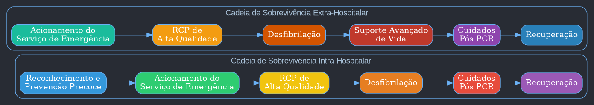
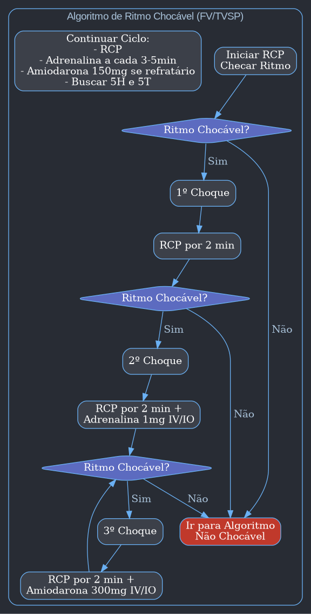
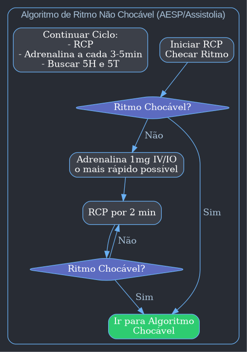

Claro, aqui está a primeira parte do resumo detalhado da aula sobre Suporte Básico e Avançado de Vida, formatado para o Obsidian.

### Suporte Básico e Avançado de Vida

- **Introdução**
    - A parada cardiorrespiratória (PCR) é uma das situações mais críticas na emergência, exigindo uma resposta rápida e precisa.
    - O sucesso do atendimento depende de uma participação multiprofissional bem organizada e de uma equipe bem treinada.
    - Em equipes bem estruturadas, cada profissional tem um papel definido (via aérea, medicações, compressões, liderança), o que otimiza o atendimento.

- **As Causas Reversíveis (5Hs e 5Ts)**
    - Um dos focos principais durante o atendimento da PCR é a identificação e tratamento das causas potencialmente reversíveis, conhecidas como "5Hs e 5Ts".
        - **5Hs:** Hipovolemia, Hipóxia, Hidrogênio (acidose), Hipo/Hipercalemia, Hipotermia.
        - **5Ts:** Tensão no tórax (pneumotórax), Tamponamento cardíaco, Tóxicos, Trombose pulmonar, Trombose coronariana.
    - A abordagem dessas causas é fundamental para o sucesso da reanimação.

- **Suporte Básico de Vida (SBV) vs. Suporte Avançado de Vida (SAV)**
    - **Suporte Básico de Vida (SBV):**
        - Pode ser realizado por leigos treinados.
        - Não depende de medicamentos ou manejo avançado de via aérea.
        - Foca em compressões torácicas de alta qualidade e, quando disponível, no uso do Desfibrilador Externo Automático (DEA).
    - **Suporte Avançado de Vida (SAV):**
        - Realizado por profissionais de saúde.
        - Inclui o uso de medicamentos, manejo avançado de via aérea e avaliação de ritmos.
        - Requer a estabilização do paciente após o retorno da circulação espontânea (RCE).

- **Ritmos de Parada Cardíaca**
    - A PCR pode se apresentar em diferentes ritmos, que são divididos em dois grandes grupos: chocáveis e não chocáveis.

| **Ritmos Chocáveis**                                       | **Ritmos Não Chocáveis**                         |
| --------------------------------------------------------- | ------------------------------------------------ |
| Fibrilação Ventricular (FV)                               | Atividade Elétrica Sem Pulso (AESP)              |
| Taquicardia Ventricular Sem Pulso (TVSP)                  | Assistolia                                       |

- **Ritmos Chocáveis:**
	- **Fibrilação Ventricular (FV):** Ocorre quando os ventrículos tremem de forma desorganizada, sem contração efetiva, resultando em ausência de débito cardíaco.
	- **Taquicardia Ventricular Sem Pulso (TVSP):** Uma arritmia rápida e organizada que origina-se nos ventrículos, mas é tão rápida que não permite o enchimento ventricular adequado, levando à ausência de pulso.
- **Ritmos Não Chocáveis:**
	- **Atividade Elétrica Sem Pulso (AESP):** Presença de atividade elétrica organizada no monitor, mas sem pulso palpável.
	- **Assistolia:** Ausência completa de atividade elétrica no coração (linha reta no monitor).

- **Prevalência dos Ritmos**
    - No ambiente pré-hospitalar, os ritmos mais comuns e importantes são os chocáveis, principalmente a Fibrilação Ventricular.
    - Isso ressalta a importância do acesso rápido à desfibrilação, justificando a presença de DEAs em locais públicos e o treinamento de leigos.

---
Com certeza. Aqui está a continuação do resumo da aula sobre Suporte Básico e Avançado de Vida.

### As Cadeias de Sobrevivência

- A American Heart Association (AHA) define duas cadeias de sobrevivência distintas, uma para o ambiente **intra-hospitalar** e outra para o **extra-hospitalar**. Cada elo da cadeia representa uma ação crucial para aumentar as chances de sobrevida do paciente.

#### Cadeia de Sobrevivência Intra-Hospitalar

- **Foco principal:** Prevenção e reconhecimento precoce da deterioração do paciente.
- **Elos da Cadeia:**
    - **Reconhecimento e Prevenção Precoce:** O primeiro elo enfatiza que, no hospital, o paciente geralmente mostra sinais de piora clínica horas antes da parada cardíaca.
        - **Time de Resposta Rápida (TRR):** Equipes especializadas que são acionadas com base em critérios de deterioração clínica (ex: queda na saturação, alteração do nível de consciência, hipotensão). O objetivo do TRR é intervir *antes* que a PCR ocorra, estabilizando o paciente.
    - **Acionamento do Serviço de Emergência:** Ao identificar uma PCR, acionar imediatamente a equipe de emergência do hospital.
    - **RCP de Alta Qualidade:** Iniciar imediatamente as compressões torácicas e ventilações.
    - **Desfibrilação Rápida:** Utilizar o desfibrilador o mais rápido possível se o ritmo for chocável.
    - **Cuidados Pós-PCR:** Após o retorno da circulação espontânea (RCE), o paciente necessita de cuidados intensivos para estabilização, tratamento da causa base e prevenção de danos neurológicos.
    - **Recuperação:** Inclui reabilitação, suporte neurológico e apoio psicossocial para o paciente e sua família.

---

### RCP de Alta Qualidade: Os Componentes Essenciais

- As compressões torácicas são o componente mais crítico da RCP, pois geram um fluxo sanguíneo mínimo para o cérebro e o coração.
- **O que define uma RCP de alta qualidade?**
    - **Frequência:** Comprimir o tórax a uma frequência de **100 a 120 compressões por minuto**.
    - **Profundidade:** Afundar o tórax em pelo menos **5 cm**, mas não mais que **6 cm** em adultos.
    - **Retorno Completo do Tórax:** Permitir que o tórax retorne completamente à sua posição original após cada compressão. Isso é fundamental para que o coração se encha de sangue. Não se apoie sobre o tórax do paciente entre as compressões.
    - **Minimizar Interrupções:** As pausas nas compressões devem ser as mais curtas possíveis (idealmente menos de 10 segundos). Cada interrupção cessa o fluxo sanguíneo para os órgãos vitais.
    - **Ventilações Adequadas:** Realizar 2 ventilações a cada 30 compressões (ciclo 30:2). Cada ventilação deve durar cerca de 1 segundo e ser suficiente para causar a elevação visível do tórax. Evitar ventilação excessiva (hiperventilação).

- **Posicionamento e Técnica:**
    - O paciente deve estar em uma **superfície rígida** (chão ou com uma prancha sob o dorso na maca).
    - O socorrista deve se posicionar ao lado do paciente, com os braços estendidos e os ombros alinhados diretamente sobre as mãos.
    - A compressão deve ser feita com o **peso do tronco**, não com a força dos braços.
    - A região de compressão é o **centro do tórax**, na metade inferior do osso esterno (entre os mamilos).

- **Troca de Socorrista:**
    - Para garantir a qualidade das compressões, os socorristas devem trocar de função a cada **2 minutos** (ou 5 ciclos de 30:2) para evitar o cansaço, que leva a compressões ineficazes.

---
Excelente. Dando continuidade, aqui está a terceira parte do resumo, focada no **Suporte Avançado de Vida (SAV)** e seus algoritmos.

### Suporte Avançado de Vida (SAV) - O Algoritmo de PCR

- O SAV se baseia em um algoritmo cíclico que se repete a cada 2 minutos. O ponto central do algoritmo é a análise do ritmo cardíaco, que determina se o paciente deve ou não receber um choque elétrico (desfibrilação).

- **O Ciclo de 2 Minutos:**
    - A cada 2 minutos de RCP, há uma breve pausa (menor que 10 segundos) para:
        1.  Trocar o socorrista que está realizando as compressões.
        2.  Analisar o ritmo cardíaco no monitor/desfibrilador.
        3.  Verificar o pulso (se o ritmo for organizado).

- **Acesso Venoso e Intraósseo (IO):**
    - Durante o SAV, é crucial obter um acesso para administração de drogas.
    - **Acesso Venoso Periférico (IV):** É a primeira escolha. Deve ser tentado rapidamente.
    - **Acesso Intraósseo (IO):** Se um acesso IV não puder ser obtido rapidamente, o acesso IO é uma alternativa rápida e eficaz. A cânula é inserida na medula óssea (geralmente na tíbia proximal), permitindo que drogas e fluidos cheguem à circulação central. É preferível a um acesso venoso central durante a PCR, pois não exige a interrupção das compressões.

---

### Algoritmo para Ritmos Chocáveis (FV/TV Sem Pulso)

- Este é o cenário onde a desfibrilação é o tratamento mais importante.

1.  **Ritmo Chocável Identificado (FV/TVSP):**
    - **Primeira Ação:** A equipe se afasta e administra **1 CHOQUE**.
    - **Imediatamente Após o Choque:** Reiniciar a **RCP por 2 minutos**, começando pelas compressões. *Não se verifica pulso ou ritmo logo após o choque*. O coração precisa de tempo com perfusão (gerada pela RCP) para se recuperar.

2.  **Após 2 Minutos de RCP:**
    - Analisar o ritmo. Se ainda for chocável (FV/TVSP):
    - **Segunda Ação:** Administrar **1 CHOQUE**.
    - **Imediatamente Após o Choque:** Reiniciar a **RCP por 2 minutos** e administrar a primeira droga:
        - **Adrenalina (Epinefrina): 1 mg IV/IO**. Repetir a cada 3 a 5 minutos.

3.  **Após Mais 2 Minutos de RCP:**
    - Analisar o ritmo. Se ainda for chocável (FV/TVSP):
    - **Terceira Ação:** Administrar **1 CHOQUE**.
    - **Imediatamente Após o Choque:** Reiniciar a **RCP por 2 minutos** e administrar a droga antiarrítmica:
        - **Amiodarona: 1ª dose de 300 mg IV/IO em bolus**.

- **Ciclos Subsequentes:**
    - A cada 2 minutos, o ciclo se repete: Checar ritmo -> Se chocável, aplicar choque -> Reiniciar RCP.
    - A **Adrenalina** continua sendo administrada a cada 3-5 minutos.
    - Se a FV/TVSP persistir, uma **segunda (e última) dose de Amiodarona de 150 mg** pode ser administrada.

---

### Algoritmo para Ritmos Não Chocáveis (AESP/Assistolia)

- Neste cenário, a desfibrilação não é indicada. O foco é na RCP de alta qualidade e na busca e tratamento das causas reversíveis (5Hs e 5Ts).

1.  **Ritmo Não Chocável Identificado (AESP/Assistolia):**
    - **Primeira Ação:** Administrar **Adrenalina (Epinefrina) 1 mg IV/IO o mais rápido possível**.
    - **Imediatamente:** Iniciar/Continuar a **RCP por 2 minutos**.

2.  **Após 2 Minutos de RCP:**
    - Analisar o ritmo.
    - Se continuar não chocável (AESP/Assistolia), continuar o ciclo.
    - Repetir a **Adrenalina a cada 3 a 5 minutos**.
    - A prioridade máxima é a **RCP de altíssima qualidade** e a **investigação agressiva dos 5Hs e 5Ts**.

- **Protocolo da Linha Reta (Assistolia):**
    - Ao se deparar com uma linha reta no monitor, é mandatório confirmar que não se trata de um artefato. O protocolo é conhecido como **"C-G-D"** ou "cagada":
        - **C**abos: Verificar se os cabos e eletrodos estão bem conectados.
        - **G**anho: Aumentar o ganho (amplitude) do sinal no monitor para garantir que não é uma FV fina.
        - **D**erivação: Mudar a derivação no monitor (ex: de DII para DI ou aVL) para ver o coração de outro ângulo elétrico.
    - Somente após confirmar com esses passos, o ritmo é definido como assistolia.

---

### O Papel da Capnografia no SAV

- A capnografia (medição do CO₂ no final da expiração - ETCO₂) é uma ferramenta extremamente útil durante a PCR.

- **Principais Usos:**
    1.  **Confirmação do Posicionamento do Tubo Endotraqueal:** É o método mais confiável. Se o tubo estiver na via aérea, o capnógrafo detectará CO₂. Se estiver no esôfago, a leitura será próxima de zero.
    2.  **Monitoramento da Qualidade da RCP:** O ETCO₂ é um reflexo direto do fluxo sanguíneo pulmonar (e, portanto, do débito cardíaco).
        - Um **ETCO₂ baixo (< 10 mmHg)** durante a RCP indica que as compressões são ineficazes e precisam ser melhoradas (mais forte, mais rápido, etc.).
    3.  **Identificação do Retorno da Circulação Espontânea (RCE):** Um **aumento súbito e sustentado do ETCO₂** (geralmente para valores entre 35-45 mmHg) é frequentemente o primeiro sinal de que o coração voltou a bater de forma eficaz, muitas vezes antes mesmo de um pulso ser palpável.

---
Perfeito. Vamos finalizar com a última parte do resumo, cobrindo as drogas, o manejo avançado da via aérea e os cruciais cuidados pós-parada.

### Drogas Utilizadas no Suporte Avançado de Vida

- A farmacologia na PCR é direcionada e baseada no ritmo cardíaco. As duas drogas principais são a Adrenalina e a Amiodarona.

- **Adrenalina (Epinefrina)**
    - **Mecanismo:** É um potente vasoconstritor (efeito alfa-adrenérgico). Durante a PCR, seu principal objetivo é aumentar a pressão de perfusão coronariana e cerebral, ou seja, aumentar o fluxo sanguíneo para o coração e o cérebro durante as compressões.
    - **Quando usar:** Em **TODOS** os ritmos de parada cardíaca (FV, TVSP, AESP, Assistolia).
    - **Dose e Frequência:**
        - **1 mg** administrado em bolus IV/IO.
        - Repetir a cada **3 a 5 minutos** (o que equivale a cada 2 ciclos de RCP).

- **Amiodarona**
    - **Mecanismo:** É um antiarrítmico que atua nos canais de sódio, potássio e cálcio, ajudando a estabilizar a membrana da célula cardíaca e a reverter arritmias ventriculares.
    - **Quando usar:** **APENAS** em ritmos chocáveis (FV/TVSP) que são **refratários** à desfibrilação. É administrada após o 3º choque.
    - **Dose e Frequência:**
        - **Primeira dose:** **300 mg** em bolus IV/IO.
        - **Segunda dose (se necessário):** **150 mg** em bolus IV/IO. Não há mais doses após esta.

- **Lidocaína (Alternativa à Amiodarona)**
    - Se a Amiodarona não estiver disponível, a Lidocaína pode ser usada.
    - **Dose:** 1 a 1,5 mg/kg IV/IO. Dose de repetição: 0,5 a 0,75 mg/kg.

---

### Manejo da Via Aérea Avançada

- A obtenção de uma via aérea avançada é uma prioridade, mas não deve interromper as compressões torácicas de alta qualidade.

- **Dispositivos:**
    - **Tubo Orotraqueal (TOT):** Padrão-ouro, mas requer habilidade e laringoscopia, que pode interromper a RCP.
    - **Dispositivos Supraglóticos (Máscara Laríngea, Tubo Laríngeo):** Excelentes alternativas que podem ser inseridas rapidamente e "às cegas", sem necessidade de interromper as compressões.

- **Mudança na Dinâmica da RCP após a Via Aérea Avançada:**
    - Uma vez que uma via aérea avançada está posicionada e confirmada (idealmente com capnografia), a RCP se torna **assíncrona**.
    - **Compressões:** Tornam-se **contínuas**, sem pausas para ventilação, na frequência de 100-120/min.
    - **Ventilações:** São realizadas a uma frequência fixa de **1 ventilação a cada 6 segundos (10 ventilações por minuto)**, independentemente do ciclo de compressão.

---

### Cuidados Pós-Retorno da Circulação Espontânea (Pós-PCR)

- O retorno do pulso não é o fim do atendimento, mas o começo de uma fase crítica. A sobrevida com boa qualidade neurológica depende dos cuidados nesta fase. A abordagem é frequentemente resumida pelo "ABCDE".

- **A e B (Via Aérea e Ventilação):**
    - Garantir via aérea avançada segura.
    - Otimizar a ventilação e a oxigenação.
    - **Metas:**
        - **Saturação de O₂ (SpO₂):** Manter entre **92% e 98%**. Evitar a hiperóxia (excesso de oxigênio), que pode ser prejudicial ao cérebro.
        - **Capnografia (ETCO₂):** Manter entre **35 e 45 mmHg**. Evitar hipo e hipercapnia.

- **C (Circulação):**
    - Otimizar a hemodinâmica para garantir a perfusão dos órgãos.
    - **Metas:**
        - **Pressão Arterial Sistólica (PAS):** > 90 mmHg.
        - **Pressão Arterial Média (PAM):** > 65 mmHg.
    - **Intervenções:**
        - Bolus de fluidos (cristaloides) se houver suspeita de hipovolemia.
        - Drogas vasoativas (ex: Noradrenalina) se a hipotensão persistir.

- **D e E (Disfunção Neurológica e Exposição/ECG):**
    - **Eletrocardiograma (ECG) de 12 Derivações:** Realizar o mais rápido possível para identificar a causa da parada.
        - Se o ECG mostrar um **Infarto Agudo do Miocárdio com Supradesnível do Segmento ST (IAMCSST)**, o paciente deve ser levado para **cateterismo cardíaco de emergência**.
    - **Avaliação Neurológica:** Avaliar o nível de consciência do paciente.
        - **Se o paciente estiver comatoso (não responde a comandos):** Ele é candidato ao **Controle Direcionado de Temperatura (CDT)**.

#### Controle Direcionado de Temperatura (CDT)

- **O que é:** Uma intervenção para proteger o cérebro de danos secundários após a isquemia da PCR.
- **Para quem:** Pacientes adultos comatosos após RCE, independentemente do ritmo inicial.
- **Como é feito:** O paciente é resfriado e mantido a uma temperatura corporal constante entre **32°C e 36°C** por pelo menos **24 horas**.

---

### Mensagens-Chave e Resumo Final

- **A base de tudo é a RCP de alta qualidade.** A técnica correta (frequência, profundidade, retorno do tórax) é mais importante do que qualquer outra intervenção.
- **Minimizar as interrupções** nas compressões é vital. As pausas para checar ritmo, ventilar ou administrar drogas devem ser as mais breves possíveis.
- Nos ritmos chocáveis (FV/TVSP), a **desfibrilação precoce** é o tratamento que salva vidas.
- Nos ritmos não chocáveis (AESP/Assistolia), o foco é na **RCP de excelência e na busca agressiva pelas causas reversíveis (5Hs e 5Ts)**.
- **Use a capnografia** sempre que disponível para confirmar o tubo, monitorar a qualidade da RCP e detectar o RCE.
- Os **cuidados pós-PCR** são fundamentais para determinar a sobrevida do paciente com boa qualidade de vida, com destaque para a otimização hemodinâmica e o Controle Direcionado de Temperatura.