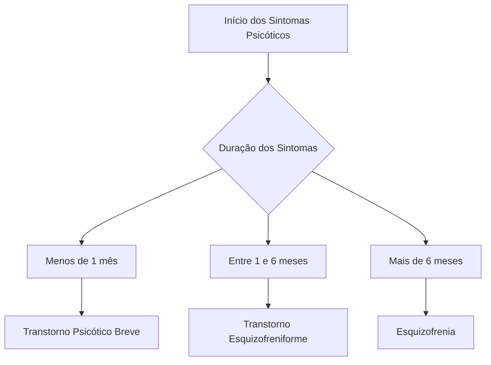

***

### **1.0 TRANSTORNOS PSICÓTICOS**

- **Definição Geral:**
    - Os transtornos psicóticos são um grupo heterogêneo de transtornos psiquiátricos.
    - Sua origem é multifatorial e de natureza incerta.
    - A principal característica é a presença de **sintomas psicóticos**, como **alucinações** (alterações da sensopercepção) e **delírios** (alterações do juízo de realidade).
- **Importância em Provas de Residência Médica:**
    - O diagnóstico principal dentro deste grupo é a **esquizofrenia**.
    - Questões sobre transtornos psicóticos, somadas, representam aproximadamente **4%** das questões de Psiquiatria em provas de R 1 (entre 2014 e 2023).

A tabela abaixo mostra a relevância dos temas de Psiquiatria em provas de residência:

| Tema | Incidência |
| :--- | :--- |
| 1º Dependência Química | 21,50% |
| 2º Intoxicações Exógenas | 17,15% |
| 3º Transtornos do Humor | 16,80% |
| 4º Psiquiatria Infantil | 10,25% |
| 5º Psicofarmacologia | 9,30% |
| 6º Transtornos Ansiosos | 5,25% |
| 7º Reforma Psiquiátrica e Psiquiatria Social | 5,10% |
| 8º TOC, Transtornos somáticos, Dissociativos e do Estresse | 5,00% |
| **9º Transtornos Psicóticos** | **4,05%** |
| 10º Transtornos Alimentares | 2,70% |
| 11º Psicopatologia | 2,05% |
| 12º Transtornos de Personalidade | 0,85% |
| **Total** | **100,00%** |

---
### **1.1. ESQUIZOFRENIA**

- **Definição:**
    - É um transtorno psicótico **crônico**.
    - Afeta múltiplas funções mentais: pensamento, humor, sensopercepção, comportamento e juízo crítico.
    - Prejudica progressivamente as **funções cognitivas e executivas**.
    - Historicamente, era conhecida como *dementia praecox* devido ao seu curso progressivo e incapacitante.
- **Classificação dos Sintomas Centrais:**
    - **Sintomas Positivos:** Representam uma "adição" ou "exagero" de funções normais.
        - Alucinações
        - Delírios
        - Comportamento desorganizado
        - Pensamento desorganizado
    - **Sintomas Negativos:** Representam uma "perda" ou "diminuição" de funções normais.
        - **Anedonia:** Capacidade reduzida de sentir prazer ou interesse.
        - **Avolia:** Redução da motivação ou iniciativa.
        - **Embotamento Afetivo:** Redução na capacidade de sentir e demonstrar afeto.
        - **Empobrecimento do Discurso:** Redução da produção e expressão da linguagem.
        - **Isolacionismo social.**

#### **1.1.1. DIAGNÓSTICO DA ESQUIZOFRENIA (DSM-5-TR)**

O diagnóstico é clínico e baseado nos critérios do DSM-5-TR. A tabela abaixo resume os critérios necessários.

| Critério | Descrição |
| :--- | :--- |
| **A** | **Dois ou mais** dos seguintes sintomas, presentes por pelo menos **1 mês**. Pelo menos um deles deve ser (1), (2) ou (3): |
| | 1. Delírios. |
| | 2. Alucinações. |
| | 3. Discurso desorganizado. |
| | 4. Comportamento grosseiramente desorganizado ou catatônico. |
| | 5. Sintomas negativos. |
| **B** | Os sintomas causam um **prejuízo funcional** significativo em áreas como trabalho, relações interpessoais ou autocuidado. |
| **C** | A duração total do quadro (Critérios A + B) deve ser de, no mínimo, **6 meses**. |

- **Observações Importantes:**
    - **DSM-5-TR:** Exige que, durante a "fase ativa", haja pelo menos **1 sintoma positivo** (delírios, alucinações ou discurso desorganizado) de forma intensa por no mínimo **30 dias**. O período total de 6 meses pode incluir a soma de sintomas positivos (em fase ativa ou atenuados) e sintomas negativos.
    - **CID-11:** Para comparação, a CID-11 exige um período sintomático de apenas **1 mês** para o diagnóstico.

***

#### **1.1.2. EPIDEMIOLOGIA, CURSO E PROGNÓSTICO DA ESQUIZOFRENIA**

- **Epidemiologia:**
    - **Prevalência:** Afeta aproximadamente **1%** da população mundial.
    - **Idade de Início:** Geralmente, os primeiros sintomas surgem entre os **25 e 30 anos**.
    - **Início em Idades Extremas:**
        - **Infância:** A ocorrência de sintomas clássicos é rara.
        - **Após os 40 anos:** O início é incomum e é conhecido como **esquizofrenia de início tardio**.
        - **Após os 60 anos:** É chamado de **esquizofrenia de início muito tardio**.
    - **Diferenças entre Gêneros:**
        - **Homens:** A doença tende a se manifestar mais cedo e com predominância de **sintomas negativos**.
        - **Mulheres:** O quadro tende a iniciar mais tarde e com maior prevalência de **sintomas positivos**.
- **Curso e Prognóstico:**
    - **Evolução:** Apenas **20 a 30%** dos pacientes têm uma evolução satisfatória, mantendo autonomia parcial. A maioria sofre com manifestações de intensidade moderada a grave ao longo da vida.
    - **Contribuição Genética:** É um fator fundamental, respondendo por **70% a 80%** dos fatores necessários para o desenvolvimento da síndrome.
    - **Hipótese Atual:** Considera-se que a esquizofrenia seja resultado de:
        - Alterações no **neurodesenvolvimento cerebral**.
        - Processos **neurodegenerativos precoces** que ocorrem antes da manifestação dos sintomas.

A tabela abaixo resume os principais fatores que ajudam a predizer o prognóstico de um paciente com esquizofrenia.

| Prognóstico Bom | Prognóstico Ruim |
| :--- | :--- |
| Fator desencadeador identificado | Sem fator desencadeador óbvio |
| Desempenho social prévio adequado | Desempenho social prévio inadequado |
| Sintomas positivos ou depressivos | Sintomas negativos proeminentes |
| Sem agressividade | Com agressividade |
| Casamento e filhos | Baixo suporte social e familiar |
| Início súbito | Início lento |

---
#### **1.1.3. SUBTIPOS DA ESQUIZOFRENIA (CLASSIFICAÇÃO ANTIGA - CID-10)**

- **Contexto Importante:**
    - A **CID-10** classificava a esquizofrenia em subtipos.
    - A partir de 2022, a **CID-11 eliminou essa classificação** por considerar que ela tem pouca validação científica e relevância clínica.
    - Apesar de ultrapassada, é importante conhecer os subtipos, pois podem aparecer em questões de provas mais antigas.
- **Principais Subtipos (CID-10):**
    - **Esquizofrenia Paranoide:**
        - Caracterizada principalmente por **delírios persecutórios** e **alucinações auditivas**. O paciente acredita estar sendo perseguido, vigiado ou conspirado contra.
    - **Esquizofrenia Hebefrênica (ou Desorganizada):**
        - Predominam **sintomas negativos**.
        - Há uma intensa perturbação do afeto (emoções superficiais e inadequadas).
        - O comportamento é infantilizado e pueril.
    - **Esquizofrenia Catatônica:**
        - O principal sintoma é uma **variação intensa da psicomotricidade**, alternando entre extremos:
            - **Estupor catatônico:** Perda total da reatividade a estímulos externos.
            - **Flexibilidade Cérea:** O paciente pode ser colocado em posturas desconfortáveis e as mantém por longos períodos, como uma estátua de cera.
            - **Obediência automática.**
            - **Agitação:** Episódios imprevisíveis de agitação psicomotora intensa.
        - Um sinal clássico da catatonia é o **"sinal do travesseiro psíquico"**, no qual o paciente, deitado, sustenta a cabeça elevada sem apoio por horas.

***

#### **1.1.4. SINTOMAS PRÉ-MÓRBIDOS DA ESQUIZOFRENIA**

- **Conceito:**
    - Refere-se a um conjunto de características e comportamentos que frequentemente estão presentes no paciente **antes da "abertura do quadro psicótico"**, ou seja, antes da manifestação clara dos sintomas positivos.
    - Esses sintomas são geralmente sutis e podem ser notados durante a **adolescência**.
- **Características Comuns:**
    - Comportamento quieto e introvertido.
    - Poucas amizades e tendência ao isolamento social.
    - **Apatia:** Falta de emoção, interesse ou entusiasmo.
    - Pouco interesse afetivo, social ou sexual.
    - Piora no rendimento escolar.
- **Identificação:**
    - Por serem características patológicas discretas, muitas vezes **não são percebidas pela família** como sinais de um transtorno.
    - É comum que o reconhecimento dessas características seja **retrospectivo**, ou seja, a família só se dá conta desses sinais após o diagnóstico ser estabelecido.

---
#### **1.1.5. TRATAMENTO DA ESQUIZOFRENIA**

- **Base do Tratamento Farmacológico:**
    - O tratamento é feito com **medicações antipsicóticas**.
    - O principal alvo terapêutico, de acordo com a "hipótese dopaminérgica", é o bloqueio dos **receptores D 2 de dopamina na via mesolímbica**.
- **Estratégia Terapêutica (Fase Aguda):**
    1.  O antipsicótico escolhido deve ser iniciado e ajustado até a dose terapêutica pretendida.
    2.  É crucial aguardar um período de aproximadamente **4 semanas** para avaliar a resposta do paciente.
    3.  Caso o resultado seja insatisfatório, o antipsicótico deve ser substituído por outro (preferencialmente um atípico).
    4.  Um novo teste de **4 semanas** com a nova medicação deve ser estabelecido.
    - **Objetivo do Tratamento Agudo:** Controlar o surto psicótico o mais brevemente possível para amenizar a neurotoxicidade e os danos cerebrais que ocorrem durante a fase ativa dos sintomas.
- **Esquizofrenia Refratária:**
    - **Definição:** É o quadro em que o paciente **não apresenta resposta satisfatória após duas tentativas consecutivas** e bem conduzidas com antipsicóticos diferentes (em doses e tempo adequados).
    - **Tratamento Indicado:** Nesses casos, a medicação de escolha é a **clozapina**.

---
#### **1.1.6. HIPÓTESE DOPAMINÉRGICA**

- **Conceito Central:**
    - É a principal teoria neurobiológica para explicar a esquizofrenia.
    - Postula que o **excesso de atividade dopaminérgica na via mesolímbica** é o responsável pela produção dos sintomas psicóticos (especialmente os sintomas positivos).
- **Pilares que Sustentam a Teoria:**
    1.  **Eficácia dos Antipsicóticos:** Medicamentos que produzem um forte bloqueio dopaminérgico nessa via são eficazes no tratamento dos sintomas positivos.
    2.  **Efeito de Substâncias:** Substâncias que aumentam o tônus dopaminérgico (como anfetaminas e cocaína) podem produzir ou agravar sintomas psicóticos em indivíduos vulneráveis.
- **Limitações da Hipótese:**
    - **Não explica tudo:** A hipótese dopaminérgica não consegue explicar adequadamente por que uma grande parcela dos pacientes tem resultados terapêuticos insatisfatórios.
    - **O Paradoxo da Clozapina:** A **clozapina**, que é o antipsicótico mais eficaz, **não exerce um bloqueio relevante sobre os receptores D 2**. Isso sugere que outros sistemas de neurotransmissores (como o serotoninérgico e o glutamatérgico) desempenham um papel crucial.
    - **Conclusão:** O entendimento fisiopatológico dos transtornos psicóticos é extremamente complexo e incerto, envolvendo a interação de múltiplos fatores (ambientais, genéticos, metabólicos, neuroanatômicos) e não pode ser reduzido a uma única hipótese.

Entendido. Segue o restante do resumo detalhado em uma única mensagem, cobrindo todos os tópicos do material.

***

#### **1.1.7. ANTIPSICÓTICOS TÍPICOS (PRIMEIRA GERAÇÃO)**

- **Mecanismo de Ação:**
    - Atuam fundamentalmente como **bloqueadores dos receptores D 2 de dopamina**.
    - São os antipsicóticos mais antigos.
- **Eficácia:**
    - São reconhecidos pela sua eficácia no controle dos **sintomas positivos** (delírios, alucinações).
    - Têm pouco ou nenhum efeito sobre os sintomas negativos.
- **Efeitos Colaterais:**
    - Estão associados a um maior risco de **sintomas extrapiramidais** (tremores, rigidez, distonias) devido ao forte bloqueio D 2 na via nigroestriatal.

| Principais Antipsicóticos Típicos e Dosagens Terapêuticas |
| :--- |
| **Clorpromazina:** 300 mg – 1000 mg |
| **Haloperidol:** 5 mg – 20 mg |
| **Levomepromazina:** 300 mg – 1000 mg |

---
#### **1.1.8. ANTIPSICÓTICOS ATÍPICOS (SEGUNDA GERAÇÃO)**

- **Mecanismo de Ação:**
    - Possuem um perfil de ação mais variado e complexo.
    - A maioria atua como **antagonista dos receptores de dopamina (D 2) e de serotonina (5 HT 2 A)**.
    - Alguns, como o aripiprazol, agem como **agonistas parciais dopaminérgicos**, modulando o tônus de dopamina (bloqueiam onde há excesso e estimulam onde há falta).
- **Eficácia:**
    - Podem proporcionar uma resposta discretamente superior no controle dos **sintomas negativos** em comparação com os típicos.
- **Efeitos Colaterais:**
    - Menor risco de sintomas extrapiramidais, mas maior risco de **efeitos colaterais metabólicos** (ganho de peso, diabetes, dislipidemia).

| Principais Antipsicóticos Atípicos e Dosagens Terapêuticas |
| :--- |
| **Aripiprazol:** 5 mg – 30 mg |
| **Clozapina:** 100 mg – 900 mg |
| **Lurasidona:** 20 mg – 160 mg |
| **Olanzapina:** 5 mg – 30 mg |
| **Quetiapina:** 200 mg – 800 mg |
| **Risperidona:** 2 mg – 16 mg |
| **Ziprasidona:** 40 mg – 160 mg |

---
#### **1.1.9. CLOZAPINA: INDICAÇÃO E CUIDADOS**

- **Eficácia e Indicações:**
    - É o antipsicótico **mais eficaz** de todos.
    - Indicado para **esquizofrenia refratária**.
    - Apresenta importantes efeitos na redução da **agressividade** e do **comportamento suicida**.
- **Mecanismo e Paradoxo:**
    - Exerce **pouco bloqueio dos receptores D 2**, o que teoricamente a torna um antipsicótico "fraco". No entanto, sua eficácia superior sugere a importância de outros sistemas de neurotransmissores. Praticamente não causa sintomas extrapiramidais.
- **Efeitos Colaterais Graves:**
    - É reservada para casos graves devido aos seus efeitos colaterais intensos e potencialmente fatais:
        - **Agranulocitose:** Redução drástica dos leucócitos (glóbulos brancos), que ocorre em até **1%** dos pacientes. Aumenta drasticamente o risco de infecções graves.
        - **Miocardite:** Inflamação do músculo cardíaco.
- **Protocolo de Monitoramento Obrigatório:**
    - **Antes de iniciar:** Avaliação cardiológica.
    - **Durante o tratamento:** Realização de **hemogramas** semanais nas primeiras **18 semanas** para contagem de leucócitos. Após esse período, o hemograma passa a ser solicitado **mensalmente** enquanto durar o tratamento.

---
#### **1.1.10. TRATAMENTO DE MANUTENÇÃO NA ESQUIZOFRENIA**

- **Início da Fase:**
    - Começa quando os **sintomas positivos estão remitidos** (controlados) e os **sintomas negativos estão atenuados** (melhorados, mas raramente desaparecem).
- **Objetivos:**
    - Evitar a ocorrência de novos surtos psicóticos (recaídas).
    - Proporcionar a melhor qualidade de vida possível ao paciente.
- **Duração Recomendada:**
    - **Após o primeiro surto psicótico:** Duração de cerca de **2 anos**.
    - **Após o segundo surto psicótico:** Recomenda-se manter o tratamento por, no mínimo, **cinco anos**. Muitos especialistas defendem a manutenção por tempo indeterminado (vitalício) devido à alta probabilidade de novos episódios, que se tornam cada vez mais debilitantes.

---
#### **1.1.11. ANTIPSICÓTICOS DE DEPÓSITO (LONGA AÇÃO)**

- **Justificativa:**
    - O tratamento da esquizofrenia é de longo prazo, e a **quebra da adesão é extremamente comum**. Estima-se que, em 2 anos, **metade dos pacientes abandona** o uso regular das medicações.
- **O que são:**
    - São antipsicóticos em formulações **injetáveis de longa duração**.
    - Agem por semanas ou até meses com uma única aplicação.
- **Indicação:**
    - Devem ser considerados para pacientes com histórico de má adesão, garantindo a continuidade do tratamento e prevenindo recaídas.

---
#### **1.1.12. TRATAMENTO NÃO MEDICAMENTOSO NA ESQUIZOFRENIA**

- **Abordagens:**
    - Incluem diversas técnicas **psicoterápicas, psicossociais e ocupacionais**.
- **Objetivos:**
    - Desenvolver a **autonomia** do paciente.
    - Aumentar as **habilidades sociais**.
    - Melhorar a **comunicação interpessoal**.
    - Harmonizar o **convívio familiar**.
    - Inserir o indivíduo na **vida comunitária**.

***

### **1.2 TRANSTORNO PSICÓTICO BREVE**

- **Definição:**
    - Caracterizado pela ocorrência súbita de, no mínimo, **1 sintoma psicótico**.
- **Critério Temporal Fundamental:**
    - A duração dos sintomas é **entre 1 e 30 dias** (ou seja, < 1 mês).
- **Evolução:**
    - O paciente se **recupera completamente**, com retorno total ao seu estado de funcionamento pré-mórbido (antes da doença).
    - Estima-se que metade dos pacientes pode evoluir, em algum momento, para um diagnóstico de **esquizofrenia** ou **transtorno bipolar**.
- **Tratamento:**
    - Baseado no uso de **antipsicóticos**.
    - Após a resolução do quadro, recomenda-se manter a medicação por até **12 meses**.

***

### **1.3 TRANSTORNO ESQUIZOFRENIFORME**

- **Definição:**
    - É um "meio-termo" diagnóstico entre o Transtorno Psicótico Breve e a Esquizofrenia.
- **Critério Temporal Fundamental:**
    - Os critérios diagnósticos são **idênticos aos da esquizofrenia**, exceto pela duração.
    - Os sintomas persistem por **entre 1 e 6 meses**.
- **Evolução:**
    - Estima-se que cerca de **80%** dos pacientes com esse diagnóstico terão seu quadro posteriormente alterado para **esquizofrenia, transtorno esquizoafetivo ou transtorno bipolar**.
- **Tratamento:**
    - Segue as mesmas diretrizes terapêuticas da esquizofrenia.

Aqui está um fluxograma para diferenciar os transtornos psicóticos primários com base na duração dos sintomas:

***

### **1.4 TRANSTORNO ESQUIZOAFETIVO**

- **Definição:**
    - Uma síndrome psicótica em que há uma **combinação** de características da **esquizofrenia** (sintomas psicóticos) e de **transtornos do humor** (sintomas afetivos persistentes, como episódios de depressão maior ou mania).
- **Características Clínicas:**
    - Os sintomas psicóticos e afetivos ocorrem na maior parte do curso do transtorno. Os sintomas podem flutuar entre os psicóticos clássicos e os afetivos, ocorrendo no mesmo episódio ou em episódios separados por poucos dias.
- **Epidemiologia e Prognóstico:**
    - Atinge cerca de **0,5%** da população.
    - O curso e o prognóstico são variados, podendo se assemelhar mais à depressão recorrente/transtorno bipolar (quando sintomas afetivos predominam) ou à esquizofrenia (quando os sintomas psicóticos são centrais).
- **Tratamento:**
    - Depende da apresentação clínica. Geralmente envolve uma **associação** de:
        - **Antipsicótico**
        - **Estabilizador do humor** ou **Antidepressivo**.

***

### **1.5 TRANSTORNO DELIRANTE PERSISTENTE**

- **Definição:**
    - Um transtorno psicótico cujo achado central é a ocorrência de **delírios duradouros**.
    - **Duração:** > 1 mês (DSM-5-TR) ou > 3 meses (CID-11).
- **Características Diferenciais (vs. Esquizofrenia):**
    - As ideias delirantes **não costumam ter conteúdo bizarro** (são coisas que poderiam acontecer na vida real, embora não estejam acontecendo).
    - Os delírios podem ter certa organização e teor crível.
    - **Alucinações são raras**.
    - O paciente **preserva sua cognição e funcionalidade** na maior parte do tempo, exceto nos aspectos relacionados ao delírio.
- **Anosognosia:**
    - O paciente não tem juízo crítico sobre seu adoecimento (falta de insight). Por isso, raramente procura ajuda médica e dificilmente aceita tratamento.

| Tipos de Delírios no Transtorno Delirante Persistente |
| :--- | :--- |
| **Persecutório** | O paciente acredita que está sendo perseguido, enganado, espionado ou que conspiram contra si. É o tipo mais comum. |
| **Erotomaníaco (Síndrome de Clérambault)** | O paciente acredita que outra pessoa (geralmente de status social superior, como um artista famoso) está secretamente apaixonada por ele. |
| **De Parasitose (Síndrome de Ekbom)** | O paciente tem a convicção de que está infestado por vermes, insetos ou outros parasitas. |
| **Grandeza ou Megalomania** | O paciente acredita ter uma missão divina, ser de linhagem nobre, ter feito uma grande invenção ou ser extremamente rico. |
| **Síndrome de Capgras** | O paciente crê que pessoas de sua família foram substituídas por sósias ou impostores idênticos. |
| **Síndrome de Fregoli** | O paciente acredita que um perseguidor se disfarça de várias pessoas diferentes para vigiá-lo. |
| **Síndrome de Cotard** | O paciente acredita que seus órgãos estão apodrecendo, que ele não existe ou que já está morto (delírio niilista). |
| **Ciumento (Síndrome de Otelo)** | O paciente tem a convicção de que está sendo traído, baseando-se em "evidências" triviais e infundadas. |

- **Tratamento:**
    - É feito com **antipsicóticos e suporte psicoterápico**. A adesão é baixa e a resposta costuma ser insatisfatória.

***

### **1.6 PSICOSE PUERPERAL**

- **Definição:**
    - Ocorrência de sintomas psicóticos em puérperas (mulheres no período pós-parto).
    - Ocorre em cerca de **1 a 2 mulheres a cada 1000 partos**.
- **Início e Sintomas:**
    - Geralmente, os sintomas se iniciam na **segunda ou terceira semana do puerpério**.
    - Caracteriza-se por **delírios**, **alterações afetivas**, **agitação psicomotora**, **comportamento desorganizado**, **insônia** e, menos frequentemente, alucinações auditivas.
- **Causa Subjacente:**
    - Acredita-se que, na maioria dos casos, seja uma manifestação clínica de **transtorno bipolar** ou **depressão maior**, precipitada ou agravada pelas mudanças hormonais e psicossociais do parto.
- **Riscos Graves:**
    - Há um risco significativo de **infanticídio** (consumado em cerca de 4% dos casos) e **suicídio** (até 5% das puérperas).
    - Devido a esses riscos, pode ser necessário o **afastamento temporário entre mãe e recém-nascido**.
- **Tratamento:**
    - Baseia-se no uso de **antipsicóticos combinados com estabilizadores de humor ou antidepressivos**.