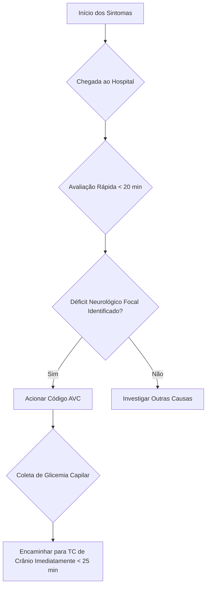
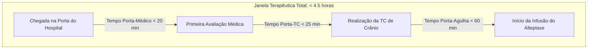

Claro! Prepararei um resumo detalhado da aula em formato otimizado para o Obsidian, dividido em mensagens para garantir a clareza e a profundidade do conteúdo.

---

### **Parte 1: Orientações Gerais do Internato e Abordagem ao Paciente**

# Resumo da Aula: Internato e Abordagem ao AVC Isquêmico

## 1. Logística e Orientações do Internato

-   **Postura e Responsabilidade:**
    -   Os internos são vistos como médicos em formação final. Espera-se autonomia e responsabilidade.
    -   É fundamental ter consideração e comunicação com a equipe, especialmente com os preceptores. A comunicação sobre saídas, trocas ou problemas é essencial.
    -   A relação com a equipe de enfermagem é crucial. Uma boa relação facilita o trabalho e o aprendizado, enquanto uma relação ruim pode criar dificuldades significativas. A enfermagem possui grande experiência prática e pode ser uma fonte valiosa de aprendizado e auxílio.

-   **Horários, Faltas e Aulas:**
    -   **Horário:** O cumprimento do horário estabelecido é uma cobrança básica e esperada.
    -   **Faltas:** Caso seja necessário faltar (por cansaço, doença ou qualquer intercorrência), a comunicação prévia com o preceptor é obrigatória. A falta deverá ser reposta posteriormente. Honestidade é mais valorizada do que desculpas pouco convincentes.
    -   **Aulas:** As aulas teóricas são prioridade. Quando houver aula, o interno deve avisar o preceptor com antecedência e está liberado para participar. A equipe pode, inclusive, ajustar a rotina para acomodar os horários das aulas.

-   **Logística do Hospital:**
    -   **Refeições:** O hospital oferece almoço e jantar no restaurante da instituição para os internos.
    -   **Uniforme (Scrub):**
        -   O hospital fornece um uniforme (scrub) que pode ser pego no local.
        -   É recomendado usar o uniforme do hospital, principalmente em procedimentos que possam gerar sujidade (sangue, fluidos), para preservar o uniforme pessoal.
        -   O interno pode vir com seu próprio scrub e trocá-lo no vestiário da urgência ou no repouso médico.

-   **Procedimentos e Condutas no Internato:**
    -   **Cobertura da CME (Central de Material e Esterilização) e Atendimentos:**
        -   A prioridade é a cobertura da CME, mas também é importante que os internos participem dos atendimentos no consultório para observar a prática clínica real.
        -   É preciso ter bom senso para equilibrar as duas atividades, especialmente quando a CME estiver mais calma.
    -   **Autonomia em Procedimentos:**
        -   Os internos são responsáveis por realizar procedimentos como suturas e drenagem de abscessos.
        -   Em procedimentos mais complexos como acesso venoso central e drenagem de tórax, os internos auxiliarão o médico preceptor. O objetivo é aprender a técnica correta, desde a preparação da mesa até a execução.
        -   É crucial aprender a organizar a mesa de procedimentos de forma autônoma, preparando todo o material necessário (seringas, anestésico, gazes, etc.) antes de iniciar.

-   **Relacionamento com a Equipe e Profissionalismo:**
    -   **Hierarquia e Respeito:** Manter uma postura de respeito com todos os membros da equipe. Você é o "irmão mais novo" aprendendo com os "irmãos mais velhos".
    -   **Trabalho em Equipe:** O ambiente hospitalar é colaborativo. A enfermagem, por exemplo, pode ser uma grande aliada no cuidado ao paciente e na resolução de problemas. Gestos de cortesia, como levar um lanche para a equipe, ajudam a construir uma boa relação.
    -   **Ética:** É estritamente proibido se envolver romanticamente ou assediar colegas de trabalho (médicas, enfermeiras, etc.) no ambiente hospitalar. A postura profissional deve ser mantida em todos os momentos.

---
### **Parte 2: Acidente Vascular Cerebral (AVC) - Introdução, Trombólise e Escalas**

## 2. Acidente Vascular Cerebral (AVC): Introdução e Impacto

-   **Relevância Clínica:** O AVC é a **principal causa de incapacidade** no mundo, superando traumas e outras doenças neurológicas. A cada 5 minutos, uma pessoa é vítima de AVC no Brasil.
-   **Foco do Tratamento:** O objetivo principal do tratamento na fase aguda do AVC isquêmico não é primariamente reduzir a mortalidade, mas sim **melhorar a funcionalidade do paciente**. A intervenção visa reverter o déficit neurológico e evitar que o paciente se torne um sequelado, dependente de cuidados.
-   **Impacto Social e Econômico:** Um paciente sequelado por AVC gera um enorme impacto negativo na qualidade de vida, além de um alto custo social e financeiro para a família e para o sistema de saúde.

## 3. Abordagem Inicial e Critérios para Trombólise

### Os 3 Pilares da Elegibilidade para Trombólise

Para que um paciente seja considerado um candidato à trombólise com Alteplase (rt-PA), ele precisa preencher três critérios fundamentais:

1.  **Déficit Neurológico Focal:** O paciente deve apresentar um déficit neurológico súbito e claro (ex: hemiparesia, afasia, desvio de rima).
2.  **Janela Terapêutica Adequada:** O tempo entre o início dos sintomas e a administração do medicamento deve ser de, no máximo, **4 horas e 30 minutos**.
3.  **Ausência de Contraindicações:** O paciente não pode ter nenhuma contraindicação absoluta para o uso do trombolítico, o que é verificado através da história clínica e de exames.

---

### **Fluxograma Simplificado da Admissão do Paciente com Suspeita de AVC**



---

-   **O Papel da Tomografia Computadorizada (TC) de Crânio:**
    -   **Objetivo Primordial:** O principal objetivo da TC de crânio sem contraste na fase aguda **NÃO** é ver a área isquêmica, mas sim **descartar sangramento (AVC hemorrágico)**. A trombólise em um paciente com AVC hemorrágico é fatal.
    -   **Achados Esperados:** Em um AVC isquêmico agudo, o esperado é que a tomografia venha **normal**. A área isquêmica (hipodensidade) geralmente só se torna visível na TC após 24-48 horas.
    -   **Sinais Precoces:** Embora o objetivo não seja esse, a TC pode mostrar sinais precoces de isquemia, que são avaliados pela **Escala ASPECTS**.

-   **O Papel da Glicemia Capilar:**
    -   **Diagnóstico Diferencial Essencial:** A hipoglicemia e a hiperglicemia severa podem **mimetizar os sintomas de um AVC**. É obrigatório verificar a glicemia capilar de todo paciente com suspeita de AVC.
    -   **Conduta:** Se for detectada uma alteração glicêmica, ela deve ser corrigida imediatamente. Muitas vezes, a correção da glicemia resolve completamente o déficit neurológico, descartando o diagnóstico de AVC.

## 4. Escalas de Avaliação do AVC

### A. Escala ASPECTS (Alberta Stroke Program Early CT Score)

-   **Finalidade:** É um escore quantitativo utilizado para avaliar a extensão de **sinais isquêmicos precoces** na TC de crânio sem contraste. Ele ajuda a determinar a viabilidade do tecido cerebral e o risco de transformação hemorrágica pós-trombólise. A escala avalia o território da **Artéria Cerebral Média**.
-   **Como Funciona:**
    -   O cérebro é dividido em 10 regiões.
    -   A pontuação inicial é **10** (representando uma TC normal).
    -   Para cada uma das 10 regiões que apresentar um sinal de isquemia precoce (ex: perda da diferenciação córtico-subcortical, hipodensidade), **subtrai-se 1 ponto**.
    -   Um ASPECTS baixo indica uma grande área de isquemia já estabelecida (core isquêmico), com alto risco de sangramento se a trombólise for realizada.

---
#### **Tabela de Regiões da Escala ASPECTS**

| Corte Tomográfico                | Regiões Avaliadas (Total de 10)                                |
| -------------------------------- | -------------------------------------------------------------- |
| **Nível dos Gânglios da Base**   | **C** - Núcleo Caudado                                         |
|                                  | **L** - Núcleo Lentiforme                                      |
|                                  | **I** - Cápsula Interna                                        |
|                                  | **Ins** - Córtex Insular                                       |
| **Nível Supraganglionar**        | **M1** - Córtex Frontal Anterior                               |
| (imediatamente acima dos gânglios) | **M2** - Córtex Temporal Anterior (lobo da ínsula)             |
|                                  | **M3** - Córtex Temporal Posterior                             |
|                                  | **M4** - Córtex Frontal Superior                               |
|                                  | **M5** - Córtex Parietal Superior                              |
|                                  | **M6** - Córtex Occipital Superior                             |

---

-   **Interpretação e Conduta:**
    -   **ASPECTS ≥ 7:** Geralmente considerado seguro para trombólise. Indica que a maior parte do tecido ainda é viável (área de penumbra).
    -   **ASPECTS < 7:** **Contraindicação relativa à trombólise**. Indica um core isquêmico extenso, e o risco de hemorragia supera o potencial benefício.

---
### **Parte 3: Escala NIHSS, Trombólise e Cuidados Pós-Procedimento**

### B. Escala NIHSS (National Institutes of Health Stroke Scale)

-   **Finalidade:** É a principal ferramenta para **quantificar a gravidade do déficit neurológico** em um paciente com AVC. Ela não substitui o exame neurológico completo, mas o sistematiza de forma objetiva.
-   **Importância:**
    -   Ajuda a padronizar a avaliação.
    -   Serve como critério de inclusão em estudos.
    -   Permite monitorar a evolução do paciente (melhora ou piora) durante e após o tratamento.
    -   Prediz a **área de penumbra**: um NIHSS alto com um ASPECTS alto (ex: NIHSS 12 com ASPECTS 10) sugere uma grande área de tecido cerebral em risco, mas ainda viável, sendo um forte candidato à trombólise.
-   **Pontuação:** Varia de **0 (normal) a 42 (déficit máximo)**.

---
#### **Critérios Detalhados da Escala NIHSS**

| Item                       | Pontuação | Descrição do Critério                                                                   |
| -------------------------- | --------- | --------------------------------------------------------------------------------------- |
| **1a. Nível de Consciência** | 0-3       | 0: Alerta; 1: Sonolento, mas responde; 2: Estuporoso, responde a estímulos dolorosos; 3: Coma. |
| **1b. Perguntas (Mês e Idade)** | 0-2       | 0: Responde ambas corretamente; 1: Responde uma; 2: Não responde nenhuma.                 |
| **1c. Comandos (Abrir/Fechar Mão, Olhos)** | 0-2       | 0: Executa ambos; 1: Executa um; 2: Não executa nenhum.                                  |
| **2. Melhor Olhar Conjugado** | 0-2       | 0: Normal; 1: Paresia do olhar; 2: Desvio tônico do olhar.                                |
| **3. Campos Visuais**      | 0-3       | 0: Normal; 1: Hemianopsia parcial; 2: Hemianopsia completa; 3: Hemianopsia bilateral.       |
| **4. Paresia Facial**        | 0-3       | 0: Normal; 1: Paresia leve; 2: Paresia parcial; 3: Paralisia completa.                  |
| **5. Motor do Braço (D/E)**  | 0-4       | 0: Sem queda; 1: Queda antes de 10s; 2: Algum movimento contra gravidade; 3: Sem movimento contra gravidade; 4: Sem movimento. |
| **6. Motor da Perna (D/E)**  | 0-4       | 0: Sem queda; 1: Queda antes de 5s; 2: Algum movimento contra gravidade; 3: Sem movimento contra gravidade; 4: Sem movimento. |
| **7. Ataxia de Membros**     | 0-2       | 0: Ausente; 1: Em um membro; 2: Em dois ou mais membros.                                |
| **8. Sensibilidade**       | 0-2       | 0: Normal; 1: Perda leve a moderada; 2: Perda severa.                                   |
| **9. Melhor Linguagem (Afasia)** | 0-3       | 0: Normal; 1: Afasia leve a moderada; 2: Afasia grave; 3: Mudo / Afasia global.           |
| **10. Disartria**          | 0-2       | 0: Normal; 1: Disartria leve a moderada; 2: Disartria grave / Anartria.                     |
| **11. Extinção e Negligência** | 0-2       | 0: Ausente; 1: Negligência visual, tátil ou auditiva; 2: Negligência profunda.            |

---

## 5. Trombólise com Alteplase (rt-PA)

-   **Contraindicações:** Devem ser consultadas em um checklist, nunca memorizadas, pois o risco de esquecer um item é alto. As principais são:
    -   **Absolutas:** Sangramento ativo, TC com evidência de hemorragia, ASPECTS < 7, cirurgia de grande porte recente (<14 dias), PA > 185x110 mmHg refratária ao tratamento.
    -   **Relativas:** Glicemia < 50 ou > 400 mg/dL, uso de anticoagulantes com INR > 1.7.

---

### **Passo a Passo da Administração do Alteplase**

1.  **Calcular a Dose Total:**
    -   **Dose:** 0,9 mg por kg de peso do paciente.
    -   **Dose Máxima:** Nunca ultrapassar 90 mg, mesmo que o cálculo por peso seja maior.

2.  **Preparar e Administrar o Bolus:**
    -   **Dose do Bolus:** 10% da dose total.
    -   **Administração:** Infundir em **1 minuto**, em veia periférica.

3.  **Preparar e Administrar a Infusão:**
    -   **Dose da Infusão:** Os 90% restantes da dose total.
    -   **Administração:** Infundir em **60 minutos** em bomba de infusão contínua (BIC).

**Exemplo Prático:** Paciente de 80 kg.
-   Dose total: 80 kg * 0,9 mg/kg = 72 mg.
-   Bolus (10%): 7,2 mg em 1 minuto.
-   Infusão (90%): 64,8 mg em 60 minutos.

---

## 6. Cuidados Pós-Trombólise (Primeiras 24 Horas)

-   **Monitoramento Neurológico:**
    -   Reavaliar o **NIHSS a cada 15 minutos durante a infusão**, depois a cada 30 minutos por 6 horas, e então de hora em hora até completar 24 horas.
    -   **Se o NIHSS piorar:** Interromper a infusão imediatamente e levar o paciente para uma nova TC de crânio para descartar sangramento. Se não houver sangramento, a infusão pode ser reiniciada.

-   **Controle Pressórico Estrito:**
    -   Manter a **PA < 180x105 mmHg** durante e após a infusão.
    -   Utilizar anti-hipertensivos venosos de ação rápida, como o **Nipride (nitroprussiato de sódio)**.

-   **Restrições Importantes:**
    -   **NÃO** passar sonda nasogástrica.
    -   **NÃO** passar sonda vesical.
    -   **NÃO** realizar punção de acesso venoso central.
    -   **NÃO** administrar antiagregantes ou anticoagulantes.
    -   Essas medidas visam minimizar o risco de sangramento, que é a principal complicação da trombólise.

-   **Tomografia de Controle:**
    -   É obrigatório realizar uma nova TC de crânio **24 horas após** a trombólise para reavaliar o parênquima cerebral antes de reintroduzir medicações como antiagregantes.

---
### **Parte 4: Investigação Secundária, Trombectomia e Métricas de Atendimento**

## 7. Investigação Secundária e Prevenção

-   **Objetivo:** Após a fase aguda, é fundamental investigar a **causa do AVC isquêmico** para direcionar a prevenção secundária e evitar novos eventos.
-   **Principais Etiologias:**
    1.  **Cardioembólica (30%):** Geralmente causada por Fibrilação Atrial (FA). Trombos se formam no coração e embolizam para o cérebro.
    2.  **Aterotrombótica (25%):** Causada por placas de ateroma em grandes vasos, como as artérias carótidas.

-   **Exames para Investigação:**
    -   **Eletrocardiograma (ECG) e Holter 24h:** Para investigar arritmias, principalmente Fibrilação Atrial.
    -   **Ecocardiograma:** Para avaliar a estrutura cardíaca, procurar trombos intracavitários ou forame oval patente.
    -   **Doppler de Carótidas e Vertebrais:** Para identificar estenoses e placas de ateroma que possam ser a fonte do trombo.

## 8. Trombectomia Mecânica

-   **O que é:** Um procedimento endovascular no qual um cateter é inserido (geralmente pela artéria femoral) e guiado até o cérebro para **remover mecanicamente o coágulo** que está obstruindo um grande vaso.
-   **Indicação:** Oclusão de grandes vasos (ex: artéria cerebral média, topo da basilar), identificada na **Angiotomografia (AngioTC)**.
-   **Janela Terapêutica Estendida:** Pode ser realizada em **até 24 horas** do início dos sintomas em casos selecionados.
-   **Relação com a Trombólise:**
    -   A trombólise **NÃO** contraindica a trombectomia.
    -   A estratégia ideal para um paciente com oclusão de grande vaso é a **terapia combinada**: iniciar a trombólise venosa o mais rápido possível e, em seguida, levar o paciente para a trombectomia mecânica.

## 9. Métricas de Qualidade no Atendimento ao AVC (Fluxograma de Tempos)

-   A agilidade no atendimento ao AVC é medida por uma série de "tempos-porta", que são indicadores de qualidade do serviço.

---

### **Fluxograma de Métricas de Tempo no AVC Agudo**


---

-   **Explicação das Métricas:**
    -   **Tempo Porta-Médico:** O paciente deve ser avaliado por um médico em menos de 20 minutos após sua chegada.
    -   **Tempo Porta-TC:** A tomografia de crânio deve ser realizada em menos de 25 minutos.
    -   **Tempo Porta-Agulha:** O tempo total desde a chegada do paciente até o início da infusão do trombolítico deve ser inferior a 60 minutos. Atingir essa meta é um sinal de excelência e organização da equipe.
Com certeza! Adicionarei uma nova seção detalhando o protocolo para o AVC de início indeterminado (Ictus Desconhecido ou *Wake-Up Stroke*), mantendo o formato otimizado para o Obsidian.

---

### **Parte 5: Protocolo para AVC de Início Indeterminado (Wake-Up Stroke)**

## 10. Protocolo para AVC de Início Indeterminado (*Wake-Up Stroke* ou Ictus Desconhecido)

-   **O Dilema Clínico:**
    -   O "Ictus Desconhecido" refere-se a um AVC em que o tempo exato do início dos sintomas não pode ser determinado. O cenário clássico é o paciente que **vai dormir neurologicamente normal e acorda com um déficit focal**.
    -   O desafio é que a janela terapêutica padrão para a trombólise venosa (4 horas e 30 minutos) se baseia no tempo de início dos sintomas. Sem essa informação, tradicionalmente, esses pacientes eram excluídos do tratamento agudo.

-   **A Solução: Imagem Avançada para Estimar o Tempo do Evento:**
    -   A evolução da neuroimagem permitiu criar protocolos para identificar quais desses pacientes ainda possuem tecido cerebral viável (a **penumbra**) e, portanto, podem se beneficiar da terapia de reperfusão.
    -   O princípio fundamental é diferenciar o **Core Isquêmico** (tecido cerebral já infartado, irrecuperável) da **Área de Penumbra** (tecido em sofrimento isquêmico, em risco, mas ainda potencialmente salvável se o fluxo sanguíneo for restaurado).

### A. Protocolo Principal: Ressonância Magnética (RM) e o "DWI-FLAIR Mismatch"

-   **Princípio:** Este protocolo, validado pelo estudo WAKE-UP, utiliza a diferença no tempo de aparecimento das lesões em duas sequências diferentes de Ressonância Magnética para inferir a "idade" do AVC.

-   **As Sequências de RM:**
    1.  **DWI (Diffusion-Weighted Imaging / Imagem Ponderada em Difusão):**
        -   **O que detecta:** Restrição à difusão de moléculas de água, que é o primeiro sinal de isquemia celular (edema citotóxico).
        -   **Quando aparece:** É extremamente sensível e positiva **minutos após o início da isquemia**. O DWI mostra o **core isquêmico**.
    2.  **FLAIR (Fluid-Attenuated Inversion Recovery / Recuperação de Inversão Atenuada de Fluido):**
        -   **O que detecta:** O edema vasogênico (aumento de água no interstício cerebral) que se desenvolve na área infartada.
        -   **Quando aparece:** É um sinal mais tardio. A lesão no FLAIR geralmente só se torna visível **após 4.5 a 6 horas** do início do AVC.

-   **O Conceito de "DWI-FLAIR Mismatch":**
    -   Ocorre quando há uma **lesão visível (hipersinal) na sequência DWI, mas a mesma área aparece normal (sem hipersinal) na sequência FLAIR**.
    -   **Interpretação Clínica:** Esse "mismatch" (incompatibilidade) sugere fortemente que o AVC ocorreu **há menos de 4 horas e 30 minutos**. O core já se formou (visto no DWI), mas o edema ainda não teve tempo de se estabelecer (o FLAIR ainda está "limpo").
    -   **Conduta:** Um paciente com *Wake-Up Stroke* que apresenta um DWI-FLAIR Mismatch é considerado um **candidato elegível para a trombólise venosa com Alteplase**, mesmo com o tempo de início desconhecido.

---
#### **Tabela Resumo: DWI-FLAIR Mismatch**

| Sequência RM | Lesão Visível (Hipersinal) | O que Significa                                  |
| ------------ | -------------------------- | ------------------------------------------------ |
| **DWI**      | **Sim**                    | Core isquêmico presente (evento agudo confirmado) |
| **FLAIR**    | **Não**                    | Lesão recente (provavelmente < 4.5 horas)        |
| **Resultado**  | **DWI-FLAIR Mismatch**     | **Candidato à Trombólise**                       |

---

### B. Protocolo Alternativo: Tomografia com Perfusão (AngioTC com Perfusão)

-   **Quando Usar:** Quando a Ressonância Magnética não está disponível, é contraindicada, ou para estender a janela terapêutica para trombectomia.
-   **Princípio:** Utiliza a injeção de contraste para medir parâmetros do fluxo sanguíneo cerebral, permitindo que um software mapeie e quantifique as áreas de core isquêmico e penumbra.
-   **O Conceito de "Mismatch de Perfusão":**
    -   Ocorre quando o software identifica um **volume pequeno de core isquêmico** (tecido com fluxo sanguíneo criticamente baixo) e um **volume significativamente maior de área de penumbra** (tecido com fluxo reduzido, mas ainda viável).
    -   **Conduta:** A presença de um mismatch favorável (core pequeno, penumbra grande) indica que o paciente ainda pode se beneficiar da terapia de reperfusão (trombólise ou, mais comumente, trombectomia mecânica), mesmo em janelas de tempo estendidas (até 24 horas).

---
### **Fluxograma de Decisão para o Ictus Desconhecido**

```mermaid
graph TD
    A[Paciente com Déficit Neurológico Focal de Início Indeterminado] --> B{RM Disponível e Segura?};
    B -- Sim --> C[Realizar RM de Crânio (Sequências DWI e FLAIR)];
    C --> D{Há DWI-FLAIR Mismatch?};
    D -- Sim --> E[Candidato à Trombólise Venosa];
    D -- Não --> F[Tratamento de Suporte e Prevenção Secundária];
    B -- Não --> G{AngioTC com Perfusão Disponível?};
    G -- Sim --> H[Realizar AngioTC com Perfusão];
    H --> I{Há Mismatch de Perfusão Favorável? (Core Pequeno / Penumbra Grande)};
    I -- Sim --> J[Candidato à Terapia de Reperfusão (Trombólise ou Trombectomia)];
    I -- Não --> F;
    G -- Não --> F;
```